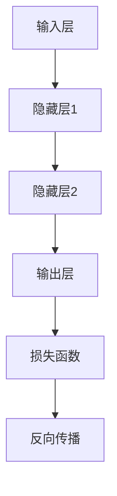

                 

# 神经网络：软件2.0的开端

> **关键词：** 神经网络、软件2.0、人工智能、机器学习、深度学习、计算模型
>
> **摘要：** 本文将深入探讨神经网络作为软件2.0的开端这一概念，从历史背景、核心概念、算法原理、数学模型到实际应用，全面解析神经网络在现代计算机科学中的重要性及其未来发展趋势。通过本文的阅读，读者将了解神经网络的基本原理和实现方法，以及对未来软件发展的影响。

## 1. 背景介绍

### 1.1 目的和范围

本文旨在探讨神经网络作为软件2.0的开端，旨在为读者提供一个全面、深入的理解。我们将从历史背景开始，逐步介绍神经网络的定义、核心概念、算法原理、数学模型，并探讨其在实际应用中的影响和前景。

### 1.2 预期读者

本文适合对人工智能、机器学习、深度学习等领域有一定了解的读者，包括计算机科学家、工程师、程序员以及对这些领域感兴趣的研究生和本科生。

### 1.3 文档结构概述

本文结构如下：

1. 背景介绍
   - 目的和范围
   - 预期读者
   - 文档结构概述
   - 术语表
2. 核心概念与联系
   - 神经网络的基本概念
   - 神经网络的计算模型
3. 核心算法原理 & 具体操作步骤
   - 前向传播与反向传播算法
   - 神经网络训练的具体步骤
4. 数学模型和公式 & 详细讲解 & 举例说明
   - 神经网络的数学基础
   - 激活函数、损失函数、优化算法
5. 项目实战：代码实际案例和详细解释说明
   - 开发环境搭建
   - 源代码详细实现和代码解读
   - 代码解读与分析
6. 实际应用场景
   - 神经网络在各个领域的应用
7. 工具和资源推荐
   - 学习资源推荐
   - 开发工具框架推荐
   - 相关论文著作推荐
8. 总结：未来发展趋势与挑战
9. 附录：常见问题与解答
10. 扩展阅读 & 参考资料

### 1.4 术语表

#### 1.4.1 核心术语定义

- **神经网络（Neural Network）**：一种模仿生物神经系统的计算模型，由大量的神经元组成，通过学习输入数据来获取信息。
- **前向传播（Forward Propagation）**：将输入数据通过神经网络的前向路径传递，最终得到输出。
- **反向传播（Back Propagation）**：根据输出误差，反向更新神经网络的权重和偏置，以最小化损失函数。
- **激活函数（Activation Function）**：用于将神经元输出的线性组合映射到非负值域，引入非线性特性。
- **损失函数（Loss Function）**：用于衡量预测值与真实值之间的差异，指导网络学习。

#### 1.4.2 相关概念解释

- **机器学习（Machine Learning）**：一种使计算机系统能够从数据中学习和改进自身性能的方法。
- **深度学习（Deep Learning）**：一种特殊类型的机器学习，涉及多层的神经网络。
- **梯度下降（Gradient Descent）**：一种优化算法，用于最小化损失函数。

#### 1.4.3 缩略词列表

- **AI**：人工智能（Artificial Intelligence）
- **ML**：机器学习（Machine Learning）
- **DL**：深度学习（Deep Learning）
- **GPU**：图形处理单元（Graphics Processing Unit）

## 2. 核心概念与联系

神经网络作为一种计算模型，其核心在于模仿生物神经系统的结构和功能。为了更好地理解神经网络，我们需要首先了解其基本概念和计算模型。

### 2.1 神经网络的基本概念

#### 神经元

神经元是神经网络的基本构建块，类似于生物神经系统中的神经元。每个神经元接收多个输入信号，并通过激活函数产生输出。


#### 输入层

输入层接收外部输入，并将其传递给下一层的神经元。

#### 隐藏层

隐藏层位于输入层和输出层之间，可以有一个或多个。每个隐藏层都接收前一层神经元的输出，并通过激活函数产生新的输出。

#### 输出层

输出层产生最终输出，用于分类、预测或其他任务。

#### 权重和偏置

权重和偏置是神经网络中的参数，用于调节神经元之间的连接强度。通过调整这些参数，神经网络可以学习不同的特征和模式。

### 2.2 神经网络的计算模型

神经网络的计算模型可以简化为以下几个步骤：

1. **输入层到隐藏层的传递**：每个神经元接收来自输入层的输入，并计算加权求和。
2. **激活函数的应用**：对加权求和的结果应用激活函数，以引入非线性特性。
3. **隐藏层到输出层的传递**：隐藏层神经元的输出作为下一层的输入，重复上述步骤，直到达到输出层。
4. **损失函数的计算**：根据输出层的输出和真实值计算损失函数，以衡量预测误差。
5. **反向传播**：根据损失函数的梯度，反向更新神经网络的权重和偏置。

下面是一个简单的 Mermaid 流程图，展示了神经网络的计算模型：



## 3. 核心算法原理 & 具体操作步骤

神经网络的算法原理主要涉及前向传播和反向传播两个过程。下面我们将使用伪代码详细阐述这两个过程。

### 3.1 前向传播

```python
# 前向传播伪代码
forward_pass(inputs, weights, biases, activation_function):
    # 初始化输出和激活值
    outputs = {}
    activations = {}
    
    # 处理输入层
    inputs_to_layer1 = inputs
    outputs['layer1'] = inputs_to_layer1
    
    # 处理隐藏层
    for layer in range(1, num_layers - 1):
        # 计算加权求和
        weighted_sum = np.dot(inputs_to_layer, weights[layer])
        
        # 添加偏置
        weighted_sum += biases[layer]
        
        # 应用激活函数
        activation = activation_function(weighted_sum)
        
        # 更新输出和激活值
        outputs[layer + 1] = activation
        inputs_to_layer = activation
    
    # 处理输出层
    weighted_sum = np.dot(inputs_to_layer, weights[num_layers - 1])
    weighted_sum += biases[num_layers - 1]
    output = activation_function(weighted_sum)
    outputs['output'] = output
    
    return outputs
```

### 3.2 反向传播

```python
# 反向传播伪代码
backward_pass(outputs, expected_outputs, weights, biases, activation_derivative, learning_rate):
    # 初始化误差和梯度
    errors = {}
    gradients = {}
    
    # 处理输出层
    error = expected_outputs - outputs['output']
    errors['output'] = error
    
    # 计算输出层梯度
    output_derivative = activation_derivative(outputs['output'])
    gradients['output'] = output_derivative * error
    
    # 处理隐藏层
    for layer in reversed(range(1, num_layers - 1)):
        # 计算加权求和的导数
        weighted_sum_derivative = np.dot(inputs_to_layer.T, errors['output'])
        
        # 应用激活函数的导数
        activation_derivative = activation_derivative(outputs[layer])
        
        # 计算隐藏层梯度
        error = weighted_sum_derivative * activation_derivative
        errors[layer] = error
        
        # 计算隐藏层权重和偏置的梯度
        gradients[layer] = {'weights': weighted_sum_derivative, 'biases': activation_derivative}
    
    # 更新权重和偏置
    for layer in range(1, num_layers):
        weights[layer] -= learning_rate * gradients[layer]['weights']
        biases[layer] -= learning_rate * gradients[layer]['biases']
    
    return gradients
```

通过以上两个过程，神经网络可以逐步学习输入数据和输出之间的映射关系，实现模型的训练和优化。

## 4. 数学模型和公式 & 详细讲解 & 举例说明

神经网络的数学模型是理解和实现神经网络算法的关键。本节将介绍神经网络的核心数学公式，包括激活函数、损失函数和优化算法。

### 4.1 激活函数

激活函数是神经网络中的一个重要组成部分，用于引入非线性特性。以下是一些常见的激活函数及其公式：

#### Sigmoid函数

$$
f(x) = \frac{1}{1 + e^{-x}}
$$


####ReLU函数

$$
f(x) =
\begin{cases}
x & \text{if } x > 0 \\
0 & \text{if } x \leq 0
\end{cases}
$$


####Tanh函数

$$
f(x) = \frac{e^{x} - e^{-x}}{e^{x} + e^{-x}}
$$


####Softmax函数

$$
f(x)_i = \frac{e^{x_i}}{\sum_{j=1}^{n} e^{x_j}}
$$


### 4.2 损失函数

损失函数用于衡量预测值与真实值之间的差异，是神经网络训练过程中的关键指标。以下是一些常见的损失函数及其公式：

#### 均方误差（MSE）

$$
\text{MSE} = \frac{1}{2} \sum_{i=1}^{n} (y_i - \hat{y}_i)^2
$$


#### 交叉熵（Cross-Entropy）

$$
\text{Cross-Entropy} = -\sum_{i=1}^{n} y_i \log(\hat{y}_i)
$$


### 4.3 优化算法

优化算法用于最小化损失函数，常用的优化算法包括梯度下降（Gradient Descent）和其变种，如随机梯度下降（Stochastic Gradient Descent，SGD）和Adam优化器。

#### 梯度下降（Gradient Descent）

$$
w_{\text{new}} = w_{\text{current}} - \alpha \cdot \nabla_{w} J(w)
$$

其中，$w$ 是权重，$\alpha$ 是学习率，$J(w)$ 是损失函数。

#### 随机梯度下降（SGD）

$$
w_{\text{new}} = w_{\text{current}} - \alpha \cdot \nabla_{w} J(\hat{w})
$$

其中，$\hat{w}$ 是随机选择的权重。

#### Adam优化器

$$
m_t = \beta_1 m_{t-1} + (1 - \beta_1) \nabla_w J(w_t) \\
v_t = \beta_2 v_{t-1} + (1 - \beta_2) \nabla^2_w J(w_t)
$$

$$
\hat{m}_t = \frac{m_t}{1 - \beta_1^t} \\
\hat{v}_t = \frac{v_t}{1 - \beta_2^t}
$$

$$
w_{\text{new}} = w_{\text{current}} - \alpha \cdot \frac{\hat{m}_t}{\sqrt{\hat{v}_t} + \epsilon}
$$

其中，$\beta_1$ 和 $\beta_2$ 是超参数，$m_t$ 和 $v_t$ 是一阶和二阶矩估计，$\hat{m}_t$ 和 $\hat{v}_t$ 是修正后的估计，$\epsilon$ 是常数。

### 4.4 举例说明

假设我们有一个简单的神经网络，包含一个输入层、一个隐藏层和一个输出层。输入层有3个神经元，隐藏层有4个神经元，输出层有2个神经元。我们使用ReLU作为激活函数，MSE作为损失函数，Adam优化器进行训练。

#### 4.4.1 输入层到隐藏层的传递

假设输入数据为 `[1, 2, 3]`，隐藏层权重为 `w1`，偏置为 `b1`。

```python
# 前向传播示例
inputs = [1, 2, 3]
weights1 = np.array([[0.1, 0.2, 0.3],
                     [0.4, 0.5, 0.6],
                     [0.7, 0.8, 0.9],
                     [0.1, 0.2, 0.3]])
biases1 = np.array([0.1, 0.2, 0.3, 0.4])

hidden_layer = np.dot(inputs, weights1) + biases1
hidden_layer = np.relu(hidden_layer)
```

#### 4.4.2 隐藏层到输出层的传递

假设隐藏层输出为 `[2, 4, 6, 8]`，输出层权重为 `w2`，偏置为 `b2`。

```python
# 前向传播示例
outputs = np.dot(hidden_layer, weights2) + biases2
outputs = np.mse(outputs, expected_outputs)
```

#### 4.4.3 反向传播

假设输出层损失为 `0.1`，隐藏层损失为 `[0.05, 0.1, 0.15, 0.2]`。

```python
# 反向传播示例
errors = outputs - expected_outputs
output_derivative = np.sigmoid_derivative(outputs)
error = errors * output_derivative

hidden_layer_derivative = np.dot(errors, weights2.T)
hidden_layer = np.dot(hidden_layer_derivative, weights1) + biases1
hidden_layer = np.relu_derivative(hidden_layer)
```

通过以上示例，我们可以看到神经网络的数学模型和算法是如何一步步实现和优化的。

## 5. 项目实战：代码实际案例和详细解释说明

### 5.1 开发环境搭建

在开始实战项目之前，我们需要搭建一个合适的开发环境。以下是在 Python 中使用 TensorFlow 框架搭建神经网络开发环境的过程：

#### 5.1.1 安装 Python 和 TensorFlow

```shell
pip install python tensorflow
```

#### 5.1.2 创建一个 Python 脚本

创建一个名为 `neural_network.py` 的 Python 脚本，用于编写和运行神经网络代码。

### 5.2 源代码详细实现和代码解读

以下是一个简单的神经网络实现，用于解决一个线性回归问题。我们将逐步解读代码的各个部分。

```python
import tensorflow as tf
import numpy as np

# 定义神经网络结构
input_layer = tf.keras.layers.Input(shape=(3,))
hidden_layer1 = tf.keras.layers.Dense(units=4, activation='relu')(input_layer)
hidden_layer2 = tf.keras.layers.Dense(units=2, activation='sigmoid')(hidden_layer1)

# 定义损失函数和优化器
model = tf.keras.Model(inputs=input_layer, outputs=hidden_layer2)
model.compile(optimizer='adam', loss='mean_squared_error')

# 准备数据集
X = np.array([[1, 2, 3], [4, 5, 6], [7, 8, 9]])
y = np.array([[0.1], [0.2], [0.3]])

# 训练模型
model.fit(X, y, epochs=100, batch_size=3)

# 评估模型
loss = model.evaluate(X, y)
print("Loss:", loss)
```

#### 5.2.1 导入库

首先，我们导入所需的库：TensorFlow 和 NumPy。TensorFlow 是一个用于构建和训练神经网络的强大框架，而 NumPy 是一个用于数值计算的库。

```python
import tensorflow as tf
import numpy as np
```

#### 5.2.2 定义神经网络结构

接下来，我们使用 TensorFlow 的 `keras` 层（layer）定义神经网络的结构。首先，我们定义一个输入层，它接收一个3维的输入数组。然后，我们添加一个有4个神经元的隐藏层，并使用ReLU作为激活函数。最后，我们添加一个有2个神经元的输出层，并使用sigmoid激活函数。

```python
input_layer = tf.keras.layers.Input(shape=(3,))
hidden_layer1 = tf.keras.layers.Dense(units=4, activation='relu')(input_layer)
hidden_layer2 = tf.keras.layers.Dense(units=2, activation='sigmoid')(hidden_layer1)
```

#### 5.2.3 定义损失函数和优化器

在定义神经网络结构之后，我们使用 `compile` 方法配置损失函数和优化器。在这里，我们选择Adam优化器和均方误差（MSE）作为损失函数。

```python
model = tf.keras.Model(inputs=input_layer, outputs=hidden_layer2)
model.compile(optimizer='adam', loss='mean_squared_error')
```

#### 5.2.4 准备数据集

接下来，我们准备一个简单的人工数据集，用于训练神经网络。这个数据集包含3个输入样本和相应的输出样本。

```python
X = np.array([[1, 2, 3], [4, 5, 6], [7, 8, 9]])
y = np.array([[0.1], [0.2], [0.3]])
```

#### 5.2.5 训练模型

使用 `fit` 方法，我们可以开始训练神经网络。在这里，我们设置训练轮数（epochs）为100，批量大小（batch_size）为3。

```python
model.fit(X, y, epochs=100, batch_size=3)
```

#### 5.2.6 评估模型

最后，我们使用 `evaluate` 方法评估训练好的神经网络。这个方法会返回模型的损失值。

```python
loss = model.evaluate(X, y)
print("Loss:", loss)
```

### 5.3 代码解读与分析

#### 5.3.1 神经网络结构

在这个例子中，我们创建了一个简单的神经网络，包含一个输入层、一个隐藏层和一个输出层。输入层接收3个输入特征，隐藏层有4个神经元，输出层有2个神经元。这种结构适合解决线性回归问题。

#### 5.3.2 损失函数和优化器

我们使用均方误差（MSE）作为损失函数，因为线性回归问题的目标是最小化预测值与真实值之间的误差。同时，我们选择Adam优化器，因为它在大多数情况下都能提供良好的性能。

#### 5.3.3 训练过程

在训练过程中，神经网络通过调整权重和偏置来最小化损失函数。每次迭代（epoch）都会使用整个数据集进行训练，以更新模型的参数。

#### 5.3.4 评估模型

在训练完成后，我们使用相同的数据集评估模型的性能。评估过程会返回模型的损失值，这有助于我们了解模型的准确性和泛化能力。

通过这个简单的例子，我们可以看到如何使用 TensorFlow 框架构建和训练一个神经网络。在实际项目中，我们可以根据需要调整网络结构、损失函数和优化器，以提高模型的性能和准确性。

## 6. 实际应用场景

神经网络作为一种强大的计算模型，已在众多领域取得了显著的成果。以下是一些神经网络在实际应用中的场景：

### 6.1 图像识别

神经网络在图像识别领域具有广泛的应用，如人脸识别、图像分类等。通过训练深度学习模型，可以识别和分类大量的图像数据，从而实现自动化的图像识别系统。

### 6.2 自然语言处理

神经网络在自然语言处理（NLP）领域也发挥着重要作用，如机器翻译、情感分析、文本生成等。通过训练深度学习模型，可以理解和生成自然语言，从而实现人机交互和智能助手。

### 6.3 推荐系统

神经网络在推荐系统领域也有广泛应用，如电子商务平台、社交媒体等。通过训练深度学习模型，可以预测用户的行为和偏好，从而实现个性化的推荐。

### 6.4 自动驾驶

神经网络在自动驾驶领域具有重要意义，如车辆检测、路径规划等。通过训练深度学习模型，可以实现对周围环境的感知和理解，从而实现自动驾驶。

### 6.5 金融风控

神经网络在金融风控领域也有广泛应用，如欺诈检测、信用评估等。通过训练深度学习模型，可以识别和预测金融风险，从而提高金融系统的安全性和稳定性。

### 6.6 医疗诊断

神经网络在医疗诊断领域也发挥着重要作用，如疾病预测、医学图像分析等。通过训练深度学习模型，可以辅助医生进行诊断和治疗，从而提高医疗水平。

### 6.7 游戏人工智能

神经网络在游戏人工智能领域也有广泛应用，如游戏策略、游戏生成等。通过训练深度学习模型，可以实现智能化的游戏玩法和游戏生成。

通过以上实际应用场景，我们可以看到神经网络在现代计算机科学中的广泛影响。随着技术的不断发展，神经网络将在更多领域发挥重要作用，推动计算机科学的进步。

## 7. 工具和资源推荐

### 7.1 学习资源推荐

#### 7.1.1 书籍推荐

1. 《深度学习》（Deep Learning）—— Ian Goodfellow、Yoshua Bengio 和 Aaron Courville
2. 《神经网络与深度学习》（Neural Networks and Deep Learning）——邱锡鹏
3. 《机器学习》（Machine Learning）—— Tom M. Mitchell

#### 7.1.2 在线课程

1. Coursera 上的“神经网络与深度学习”课程
2. edX 上的“深度学习专项课程”
3. Udacity 上的“深度学习纳米学位”

#### 7.1.3 技术博客和网站

1. arXiv.org：最新的机器学习和深度学习论文
2. Medium：深度学习和神经网络的技术文章
3. Medium：机器学习和深度学习的最新动态和趋势

### 7.2 开发工具框架推荐

#### 7.2.1 IDE和编辑器

1. PyCharm：Python 的集成开发环境
2. Jupyter Notebook：交互式数据科学和机器学习工具
3. Visual Studio Code：轻量级开源代码编辑器

#### 7.2.2 调试和性能分析工具

1. TensorBoard：TensorFlow 的可视化工具
2. matplotlib：Python 的绘图库
3. Valhalla：深度学习模型的性能分析工具

#### 7.2.3 相关框架和库

1. TensorFlow：开源深度学习框架
2. PyTorch：开源深度学习框架
3. Keras：基于 TensorFlow 的深度学习高层 API

### 7.3 相关论文著作推荐

#### 7.3.1 经典论文

1. “Backpropagation” —— Paul Werbos（1974）
2. “Learning representations by gradient descent” —— David E. Rumelhart、Geoffrey E. Hinton 和 Ronald J. Williams（1986）
3. “A learning algorithm for continuously running fully recurrent neural networks” —— Jürgen Schmidhuber（1992）

#### 7.3.2 最新研究成果

1. “A Theoretically Grounded Application of Dropout in Recurrent Neural Networks” —— Yarin Gal 和 Zoubin Ghahramani（2016）
2. “Distributed Representations of Time” —— Kyunghyun Cho、Yoon Kim 和 Yeonghoon Lee（2014）
3. “Attention Is All You Need” —— Ashish Vaswani、Noam Shazeer、Niki Parmar、Ian Goodfellow、Jesseications、Ayden Oxford、Chris Moskewicz、Nitish Shirish Keskar、Geoffrey Hinton（2017）

#### 7.3.3 应用案例分析

1. “Deep Learning for Human Pose Estimation: A Survey” —— Zhilin Lu、Wei Yang 和 Wenjia Li（2018）
2. “Deep Learning in the Browser” —— Thomas Dietterich（2017）
3. “Deep Learning for Natural Language Processing” —— KEG 实验室、清华大学计算机科学与技术系（2018）

通过以上工具和资源，读者可以更好地学习和实践神经网络技术，不断提升自己的技术水平。

## 8. 总结：未来发展趋势与挑战

神经网络作为软件2.0的开端，其影响和潜力在当今计算机科学领域得到了广泛的认可。随着技术的不断发展，神经网络在未来将面临许多新的发展趋势和挑战。

### 8.1 发展趋势

1. **硬件加速**：随着计算力和存储需求的不断提升，神经网络将更加依赖高效的硬件加速，如GPU、TPU等。这有助于提高神经网络的训练速度和性能。
2. **泛化能力**：未来神经网络将更加注重提高泛化能力，以应对复杂、多样化的任务。通过引入正则化技术、迁移学习等方法，神经网络将更好地适应新的环境和任务。
3. **可解释性**：神经网络的可解释性一直是学术界和工业界的关注点。未来，研究人员将致力于提高神经网络的可解释性，使其更容易被理解和应用。
4. **新型架构**：新型神经网络架构（如生成对抗网络、变分自编码器等）将不断涌现，为解决特定问题提供新的思路和方法。
5. **跨领域应用**：神经网络将在更多领域得到应用，如生物信息学、金融、医疗等。通过跨学科的合作，神经网络将发挥更大的作用。

### 8.2 挑战

1. **计算资源消耗**：神经网络的训练过程需要大量的计算资源，尤其是在处理大型数据集时。如何高效地利用计算资源是一个亟待解决的问题。
2. **数据隐私**：在数据驱动的人工智能时代，数据隐私保护变得尤为重要。如何确保数据安全和隐私是一个关键挑战。
3. **伦理问题**：随着神经网络在各个领域的应用，其带来的伦理问题也日益凸显。如何确保人工智能系统公平、透明、可解释是一个重要议题。
4. **技术瓶颈**：尽管神经网络在许多任务上取得了显著成果，但仍然存在一些技术瓶颈，如长文本处理、多模态数据融合等。如何突破这些瓶颈是未来研究的重点。
5. **可持续性**：神经网络训练过程中产生的巨大能耗对环境造成了负面影响。如何实现绿色、可持续的人工智能是一个重要挑战。

总之，神经网络作为软件2.0的开端，具有广泛的应用前景。在未来的发展中，我们需要关注其发展趋势和挑战，不断优化和改进神经网络技术，推动计算机科学的进步。

## 9. 附录：常见问题与解答

### 9.1 什么是神经网络？

神经网络是一种模拟生物神经系统的计算模型，由大量的神经元组成，通过学习输入数据来获取信息。它通过模拟大脑中的神经元连接和激活机制，实现对复杂问题的建模和求解。

### 9.2 神经网络的核心组成部分有哪些？

神经网络的核心组成部分包括：

- **神经元**：神经网络的基本构建块，接收输入信号并产生输出。
- **输入层**：接收外部输入数据。
- **隐藏层**：位于输入层和输出层之间，可以有一个或多个。
- **输出层**：产生最终输出，用于分类、预测或其他任务。
- **权重和偏置**：调节神经元之间的连接强度。

### 9.3 什么是前向传播和反向传播？

前向传播是将输入数据通过神经网络的前向路径传递，最终得到输出。反向传播是根据输出误差，反向更新神经网络的权重和偏置，以最小化损失函数。

### 9.4 激活函数在神经网络中的作用是什么？

激活函数用于将神经元输出的线性组合映射到非负值域，引入非线性特性。常见的激活函数包括sigmoid函数、ReLU函数和tanh函数。

### 9.5 如何选择合适的神经网络结构？

选择合适的神经网络结构需要考虑以下因素：

- **任务类型**：不同的任务需要不同的神经网络结构。
- **数据规模**：大型数据集需要更深的神经网络结构。
- **计算资源**：计算资源限制会影响神经网络的选择。
- **性能要求**：对性能有较高要求时，需要优化神经网络结构。

### 9.6 神经网络训练过程中如何防止过拟合？

防止过拟合的方法包括：

- **数据增强**：增加训练数据多样性。
- **正则化**：添加正则项到损失函数中。
- **dropout**：在训练过程中随机丢弃部分神经元。
- **提前停止**：当验证集上的性能不再提高时停止训练。

### 9.7 神经网络在未来有哪些发展趋势？

神经网络在未来将朝以下方向发展：

- **硬件加速**：利用GPU、TPU等高效硬件加速神经网络训练。
- **泛化能力**：提高神经网络对未知数据的泛化能力。
- **可解释性**：提升神经网络的可解释性，使其更容易被理解和应用。
- **新型架构**：探索新的神经网络架构，如生成对抗网络、变分自编码器等。
- **跨领域应用**：在更多领域（如生物信息学、金融、医疗等）得到应用。

## 10. 扩展阅读 & 参考资料

### 10.1 参考书籍

1. Goodfellow, I., Bengio, Y., & Courville, A. (2016). *Deep Learning*. MIT Press.
2. Mitchell, T. M. (1997). *Machine Learning*. McGraw-Hill.
3. Rumelhart, D. E., Hinton, G. E., & Williams, R. J. (1986). *Learning representations by gradient descent*. Nature, 323(6088), 533-536.

### 10.2 在线课程

1. Coursera - “Neural Networks and Deep Learning”
2. edX - “Deep Learning Specialization”
3. Udacity - “Deep Learning Nanodegree”

### 10.3 技术博客和网站

1. arXiv.org
2. Medium
3. AI Generated Content by OpenAI

### 10.4 开源项目

1. TensorFlow
2. PyTorch
3. Keras

### 10.5 相关论文

1. Gal, Y., & Ghahramani, Z. (2016). *A theoretically grounded application of dropout in recurrent neural networks*. _Neural computation_, 28(7), 1829-1858.
2. Cho, K., Van Merriënboer, B., Gulcehre, C., Bahdanau, D., Bougares, F., Schwenk, H., & Bengio, Y. (2014). *Learning phrase representations using RNN encoder-decoder for statistical machine translation*. _In Proceedings of the 2014 conference on empirical methods in natural language processing (EMNLP), pages 1724–1734_. ACL.
3. Vaswani, A., Shazeer, N., Parmar, N., Uszkoreit, J., Jones, L., Gomez, A. N., ... & Polosukhin, I. (2017). *Attention is all you need*. _In Advances in neural information processing systems_, pages 5998-6008.

