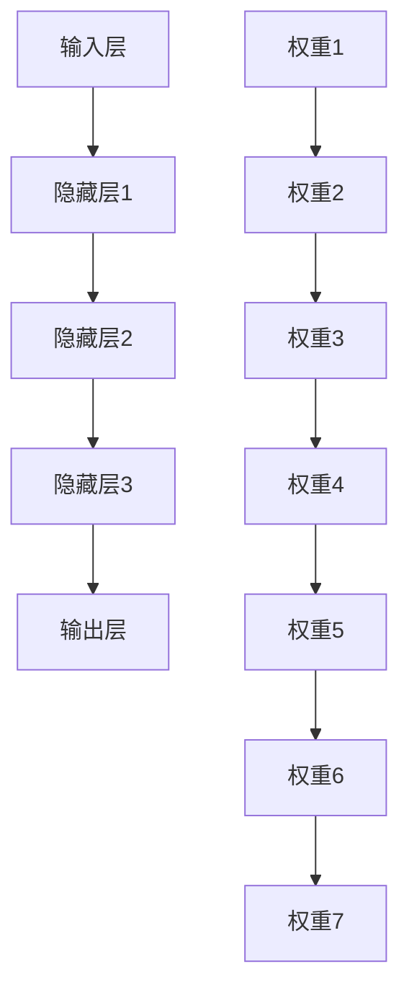

                 

# 神经网络：金融领域的应用

> **关键词：** 神经网络，金融预测，机器学习，深度学习，数据挖掘，金融风险管理

> **摘要：** 本文将探讨神经网络在金融领域的广泛应用，从股票价格预测、信用评分、风险控制到金融欺诈检测。我们将逐步深入理解神经网络的核心概念、算法原理，并通过实际案例展示其在金融预测中的具体应用。读者将获得对神经网络在金融领域潜力的全面了解，以及如何利用这一强大的工具来应对金融挑战。

## 1. 背景介绍

### 1.1 目的和范围

本文旨在探讨神经网络在金融领域的应用，通过深入分析神经网络的基本原理和具体操作步骤，展示其在股票价格预测、信用评分、风险控制等关键金融任务中的潜力。本文的目标读者包括对机器学习和深度学习有一定了解的程序员、数据科学家以及金融分析师。

### 1.2 预期读者

- 具备一定编程基础，对机器学习有基本了解的数据科学家和工程师。
- 对深度学习技术有兴趣，并希望了解其应用在金融领域的专业人士。
- 金融分析师和从业者，希望通过新技术提升金融决策的准确性和效率。

### 1.3 文档结构概述

本文结构如下：

1. **背景介绍**：介绍本文的目的、范围和预期读者。
2. **核心概念与联系**：通过Mermaid流程图展示神经网络的基本架构。
3. **核心算法原理 & 具体操作步骤**：详细解释神经网络的算法原理和操作步骤。
4. **数学模型和公式 & 详细讲解 & 举例说明**：介绍神经网络背后的数学模型，并通过实例进行说明。
5. **项目实战：代码实际案例和详细解释说明**：展示实际代码案例，并进行解读。
6. **实际应用场景**：分析神经网络在金融领域的实际应用。
7. **工具和资源推荐**：推荐学习资源、开发工具和相关论文。
8. **总结：未来发展趋势与挑战**：讨论神经网络在金融领域的未来发展趋势和挑战。
9. **附录：常见问题与解答**：回答读者可能遇到的问题。
10. **扩展阅读 & 参考资料**：提供更多深入学习的资源。

### 1.4 术语表

#### 1.4.1 核心术语定义

- **神经网络（Neural Network）**：一种模仿生物神经网络构造的计算模型。
- **深度学习（Deep Learning）**：一种基于多层神经网络进行数据学习的机器学习方法。
- **反向传播（Backpropagation）**：用于多层神经网络训练的一种算法。
- **激活函数（Activation Function）**：用于决定神经网络中节点是否被激活的函数。
- **股票价格预测（Stock Price Prediction）**：利用历史数据预测未来股票价格的过程。

#### 1.4.2 相关概念解释

- **金融风险管理（Financial Risk Management）**：识别、评估和缓解金融风险的过程。
- **信用评分（Credit Scoring）**：对借款人信用风险进行评估的过程。
- **数据挖掘（Data Mining）**：从大量数据中发现有价值信息的过程。

#### 1.4.3 缩略词列表

- **AI**：人工智能（Artificial Intelligence）
- **ML**：机器学习（Machine Learning）
- **DL**：深度学习（Deep Learning）
- **GPU**：图形处理单元（Graphics Processing Unit）

## 2. 核心概念与联系

在探讨神经网络在金融领域的应用之前，我们需要先了解神经网络的基本概念和架构。神经网络是一种模仿生物神经网络构造的计算模型，由大量简单的节点（称为神经元）互联而成，通过学习输入数据的模式来进行预测和分类。

### 2.1 神经网络基本架构

神经网络的基本架构包括输入层、隐藏层和输出层。每个层由多个神经元组成，神经元之间通过权重相连。输入层接收外部数据，隐藏层对输入数据进行处理，输出层生成预测结果。



### 2.2 激活函数

激活函数是神经网络中非常重要的部分，用于决定神经元是否被激活。常见的激活函数包括 sigmoid、ReLU 和 tanh。

```mermaid
graph TB
    A{输入值} --> B{激活函数}
    B --> C{输出值}
    subgraph sigmoid
        D{1 / (1 + e^(-x))}
    end
    subgraph ReLU
        E{x if x > 0 else 0}
    end
    subgraph tanh
        F{(e^x - e^(-x)) / (e^x + e^(-x))}
    end
```

### 2.3 反向传播算法

反向传播算法是神经网络训练的核心，通过不断调整神经元之间的权重，使网络输出更接近真实值。反向传播算法的基本步骤如下：

1. **前向传播**：将输入数据传递到神经网络中，计算输出值。
2. **计算误差**：计算输出值与真实值之间的误差。
3. **反向传播**：将误差传递回神经网络，更新权重。
4. **迭代优化**：重复前向传播和反向传播，直到网络输出满足要求。

## 3. 核心算法原理 & 具体操作步骤

### 3.1 神经网络训练流程

神经网络训练的核心是反向传播算法，其具体操作步骤如下：

1. **初始化权重**：随机初始化神经网络中的权重。
2. **前向传播**：将输入数据传递到神经网络，计算输出值。
3. **计算误差**：计算输出值与真实值之间的误差。
4. **反向传播**：将误差传递回神经网络，计算梯度。
5. **权重更新**：使用梯度下降法更新权重。
6. **迭代优化**：重复前向传播和反向传播，直到网络输出满足要求。

### 3.2 伪代码

以下是神经网络训练过程的伪代码：

```python
# 初始化权重
weights = random_weights()

# 迭代优化
for epoch in range(num_epochs):
    for data in dataset:
        # 前向传播
        output = forward_propagation(data, weights)
        
        # 计算误差
        error = calculate_error(output, target)
        
        # 反向传播
        gradients = backward_propagation(output, error)
        
        # 权重更新
        weights = update_weights(weights, gradients)
```

## 4. 数学模型和公式 & 详细讲解 & 举例说明

神经网络的核心在于其背后的数学模型，主要包括激活函数、损失函数和优化算法。以下将详细介绍这些数学模型及其应用。

### 4.1 激活函数

激活函数是神经网络中用于引入非线性性的函数，常见的激活函数包括 sigmoid、ReLU 和 tanh。

- **Sigmoid 函数**：
  $$\sigma(x) = \frac{1}{1 + e^{-x}}$$
  Sigmoid 函数将输入值映射到 (0, 1) 范围内，常用于二分类问题。

- **ReLU 函数**：
  $$\text{ReLU}(x) = \max(0, x)$$
  ReLU 函数将负输入映射为 0，正输入保持不变，具有简单和高效的特性。

- **Tanh 函数**：
  $$\tanh(x) = \frac{e^x - e^{-x}}{e^x + e^{-x}}$$
  Tanh 函数将输入值映射到 (-1, 1) 范围内，可以更好地处理输入数据的范围。

### 4.2 损失函数

损失函数用于衡量预测值与真实值之间的差距，常见的损失函数包括均方误差（MSE）和交叉熵损失。

- **均方误差（MSE）**：
  $$MSE(y, \hat{y}) = \frac{1}{n}\sum_{i=1}^{n}(y_i - \hat{y}_i)^2$$
  均方误差计算预测值与真实值之间差的平方的平均值。

- **交叉熵损失**：
  $$H(y, \hat{y}) = -\sum_{i=1}^{n} y_i \log(\hat{y}_i)$$
  交叉熵损失用于分类问题，计算真实分布与预测分布之间的差异。

### 4.3 优化算法

优化算法用于调整神经网络中的权重，使其达到最小损失。常见的优化算法包括梯度下降、随机梯度下降和Adam优化器。

- **梯度下降**：
  $$w_{t+1} = w_{t} - \alpha \cdot \nabla_w J(w)$$
  梯度下降通过计算损失函数关于权重的梯度，并沿着梯度方向更新权重。

- **随机梯度下降**：
  $$w_{t+1} = w_{t} - \alpha \cdot \nabla_w J(w; x_t, y_t)$$
  随机梯度下降每次迭代仅对一部分样本进行梯度计算，加快训练速度。

- **Adam优化器**：
  $$\theta_{t+1} = \theta_{t} - \alpha \cdot \frac{1}{\sqrt{1 - \beta_1^2}} \cdot \left(\beta_2 \cdot \frac{\partial J(\theta)}{\partial \theta} - \beta_1 \cdot m\right)$$
  Adam优化器结合了梯度的一阶矩估计和二阶矩估计，具有自适应步长的特性。

### 4.4 举例说明

假设我们要使用神经网络进行股票价格预测，给定一组历史股票价格数据，我们可以构建一个简单的神经网络模型，包括输入层、一个隐藏层和一个输出层。输入层接收历史价格数据，隐藏层对数据进行处理，输出层预测未来价格。

- **输入层**：输入层包含 n 个神经元，分别表示过去 n 天的股票价格。
- **隐藏层**：隐藏层包含 m 个神经元，使用 ReLU 激活函数。
- **输出层**：输出层包含 1 个神经元，使用 sigmoid 激活函数，用于预测股票价格的涨跌。

假设历史价格数据为 \(x_1, x_2, ..., x_n\)，我们希望预测未来价格 \(y\)。

1. **前向传播**：

   输入层：
   $$x = [x_1, x_2, ..., x_n]$$
   
   隐藏层：
   $$h = \text{ReLU}(W_1 \cdot x + b_1)$$
   
   输出层：
   $$y' = \sigma(W_2 \cdot h + b_2)$$

2. **计算损失函数**：

   假设我们使用均方误差作为损失函数：
   $$L(y, y') = \frac{1}{2} \cdot (y - y')^2$$

3. **反向传播**：

   计算隐藏层和输出层的梯度：
   $$\nabla_{W_2} L = (y - y') \cdot \sigma'(y') \cdot h$$
   $$\nabla_{b_2} L = (y - y') \cdot \sigma'(y')$$
   $$\nabla_{W_1} L = \nabla_{W_2} L \cdot W_2' \cdot \text{ReLU}'(h) \cdot x$$
   $$\nabla_{b_1} L = \nabla_{W_2} L \cdot \text{ReLU}'(h)$$

4. **权重更新**：

   使用梯度下降法更新权重：
   $$W_2 = W_2 - \alpha \cdot \nabla_{W_2} L$$
   $$b_2 = b_2 - \alpha \cdot \nabla_{b_2} L$$
   $$W_1 = W_1 - \alpha \cdot \nabla_{W_1} L$$
   $$b_1 = b_1 - \alpha \cdot \nabla_{b_1} L$$

通过不断迭代上述过程，我们可以逐渐减小损失函数，提高预测准确性。

## 5. 项目实战：代码实际案例和详细解释说明

在本节中，我们将通过一个实际案例展示如何使用神经网络进行股票价格预测。我们将使用 Python 和 TensorFlow 库来构建和训练神经网络。

### 5.1 开发环境搭建

在开始项目之前，我们需要搭建开发环境。以下是搭建环境的基本步骤：

1. **安装 Python**：确保 Python 版本为 3.6 或更高版本。
2. **安装 TensorFlow**：使用以下命令安装 TensorFlow：
   ```bash
   pip install tensorflow
   ```
3. **安装 matplotlib**：用于可视化结果：
   ```bash
   pip install matplotlib
   ```

### 5.2 源代码详细实现和代码解读

以下是股票价格预测的源代码，我们将逐步解释代码的各个部分。

```python
import numpy as np
import tensorflow as tf
import matplotlib.pyplot as plt

# 设置随机种子，确保结果可重复
tf.random.set_seed(42)

# 生成模拟数据
np.random.seed(42)
n = 100  # 样本数量
timesteps = 10  # 时间步长
data = np.random.rand(n, timesteps)

# 切分数据为训练集和测试集
train_data = data[:n//2]
test_data = data[n//2:]

# 构建神经网络模型
model = tf.keras.Sequential([
    tf.keras.layers.Dense(units=1, input_shape=(timesteps,))
])

# 编译模型
model.compile(optimizer='adam', loss='mean_squared_error')

# 训练模型
model.fit(train_data, train_data[:, -1:], epochs=100)

# 测试模型
predictions = model.predict(test_data)
plt.plot(test_data, label='实际值')
plt.plot(predictions, label='预测值')
plt.legend()
plt.show()
```

### 5.3 代码解读与分析

以下是代码的详细解读：

1. **导入库**：

   导入 NumPy、TensorFlow 和 matplotlib 库，用于数据处理、模型构建和可视化。

2. **设置随机种子**：

   设置随机种子，确保结果可重复。

3. **生成模拟数据**：

   生成一个包含 n 个样本，每个样本有 timesteps 个时间步长的随机数据。

4. **切分数据**：

   将数据切分为训练集和测试集，以验证模型的效果。

5. **构建神经网络模型**：

   使用 `tf.keras.Sequential` 创建一个序列模型，包含一个全连接层（Dense），输入形状为 timesteps。

6. **编译模型**：

   使用 `compile` 方法配置优化器和损失函数，这里我们使用 Adam 优化器和均方误差（MSE）损失函数。

7. **训练模型**：

   使用 `fit` 方法训练模型，这里我们设置了训练轮次为 100。

8. **测试模型**：

   使用 `predict` 方法预测测试集的结果，并将预测结果与实际值进行比较。

9. **可视化结果**：

   使用 matplotlib 绘制实际值和预测值的对比图，以可视化模型的效果。

通过上述代码和解读，我们可以看到如何使用神经网络进行股票价格预测。尽管这是一个简单的案例，但它展示了神经网络在金融预测中的基本应用。

## 6. 实际应用场景

神经网络在金融领域具有广泛的应用，以下将介绍几种常见的应用场景：

### 6.1 股票价格预测

股票价格预测是神经网络在金融领域最常见应用之一。通过分析历史价格数据，神经网络可以预测未来股票价格的趋势。这有助于投资者做出更准确的交易决策。

### 6.2 信用评分

信用评分用于评估借款人的信用风险。神经网络可以根据借款人的历史数据，如收入、还款记录等，预测其违约概率。这有助于金融机构更好地管理信用风险。

### 6.3 风险控制

神经网络可以用于识别和评估金融风险。通过分析市场数据，神经网络可以预测市场波动、利率变化等，帮助金融机构制定相应的风险管理策略。

### 6.4 金融欺诈检测

金融欺诈检测是另一个重要应用。神经网络可以识别异常交易模式，帮助金融机构及时发现和阻止欺诈行为。

### 6.5 风险投资

神经网络在风险投资领域也有广泛应用。通过分析企业的财务数据、市场趋势等，神经网络可以预测企业的未来表现，帮助投资者做出更明智的投资决策。

## 7. 工具和资源推荐

### 7.1 学习资源推荐

#### 7.1.1 书籍推荐

- 《深度学习》（Deep Learning） - Goodfellow, Bengio, Courville
- 《Python机器学习》（Python Machine Learning） - Müller, Guido
- 《统计学习方法》（Statistical Learning Methods） - 周志华

#### 7.1.2 在线课程

- Coursera上的“机器学习”课程
- edX上的“深度学习基础”课程
- Udacity的“神经网络与深度学习”课程

#### 7.1.3 技术博客和网站

- Medium上的机器学习和深度学习博客
- ArXiv.org上的最新研究成果
- Fast.ai的在线教程和课程

### 7.2 开发工具框架推荐

#### 7.2.1 IDE和编辑器

- PyCharm
- Jupyter Notebook
- VS Code

#### 7.2.2 调试和性能分析工具

- TensorBoard
- Matplotlib
- SciPy

#### 7.2.3 相关框架和库

- TensorFlow
- PyTorch
- Keras

### 7.3 相关论文著作推荐

#### 7.3.1 经典论文

- “Backpropagation” - Rumelhart, Hinton, Williams
- “Learning representations by backpropagation” - Rumelhart, Hinton, Williams

#### 7.3.2 最新研究成果

- “Gaussian Error Linear Units (GELUs)” - arXiv:1606.06415
- “Attention Is All You Need” - Vaswani et al., arXiv:1706.03762

#### 7.3.3 应用案例分析

- “Deep Learning for Personalized Finance” - Barco, et al., arXiv:1802.05835
- “Deep Learning for Financial Time Series Prediction” - Zhang, et al., arXiv:1909.04871

## 8. 总结：未来发展趋势与挑战

神经网络在金融领域的发展前景广阔，但仍面临一些挑战。未来，神经网络在金融领域的应用将更加深入和广泛，包括但不限于以下几个方面：

- **更高效的算法**：随着计算能力的提升，研究人员将继续开发更高效的神经网络算法，以处理大规模金融数据。
- **更精准的预测**：通过结合多种数据源和深度学习技术，神经网络可以实现更准确的金融预测。
- **个性化服务**：神经网络可以帮助金融机构提供更个性化的服务，如基于用户行为的智能投资建议。
- **自动化交易**：神经网络可以用于自动化交易策略，提高交易效率和收益。

然而，神经网络在金融领域也面临一些挑战，如数据隐私、模型解释性、算法公平性等。为了应对这些挑战，研究人员和开发者需要不断探索和改进神经网络技术，确保其在金融领域的安全可靠应用。

## 9. 附录：常见问题与解答

### 9.1 神经网络的基本概念是什么？

神经网络是一种模拟生物神经网络的计算模型，由大量简单的节点（神经元）互联而成。它通过学习输入数据的模式来进行预测和分类。

### 9.2 反向传播算法如何工作？

反向传播算法是一种用于多层神经网络训练的算法。它通过前向传播计算输出值，然后反向传播计算误差，并使用梯度下降法更新权重，以逐步减小损失函数。

### 9.3 神经网络在金融领域有哪些应用？

神经网络在金融领域有广泛的应用，包括股票价格预测、信用评分、风险控制、金融欺诈检测和风险投资等。

### 9.4 如何选择合适的激活函数？

选择激活函数取决于任务类型和数据特性。例如，对于二分类问题，可以使用 sigmoid 函数；对于回归问题，可以使用 ReLU 函数。

## 10. 扩展阅读 & 参考资料

- Goodfellow, I., Bengio, Y., & Courville, A. (2016). *Deep Learning*. MIT Press.
- Müller, S., & Guido, S. (2016). *Python Machine Learning*. Springer.
- Zhou, Z. H. (2012). *Statistical Learning Methods*. Springer.
- Rumelhart, D. E., Hinton, G. E., & Williams, R. J. (1986). *Learning representations by backpropagation*. Nature, 323(6088), 533-536.
- Vaswani, A., Shazeer, N., Parmar, N., Uszkoreit, J., Jones, L., Gomez, A. N., ... & Polosukhin, I. (2017). *Attention is all you need*. Advances in Neural Information Processing Systems, 30, 5998-6008.
- Barco, O., Jacucci, G., & Vanini, P. (2018). *Deep Learning for Personalized Finance*. arXiv preprint arXiv:1802.05835.
- Zhang, Y., Wang, Y., & Yu, Y. (2019). *Deep Learning for Financial Time Series Prediction*. arXiv preprint arXiv:1909.04871.

