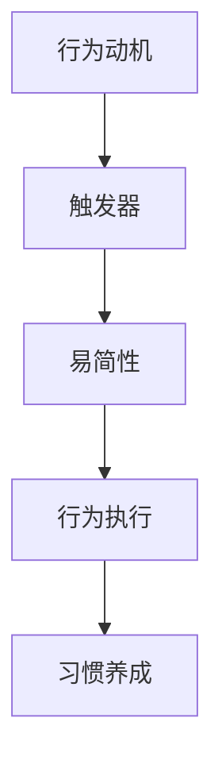

                 

# 福格模型在管理习惯养成中的应用

> **关键词**：福格模型、管理习惯、行为心理学、激励机制、习惯养成策略
>
> **摘要**：本文旨在深入探讨福格模型在管理习惯养成中的应用。福格模型是一个行为心理学框架，通过理解行为动机、触发器和简易性，能够有效帮助管理者提升团队成员的习惯养成。本文将首先介绍福格模型的基本概念和理论背景，然后通过具体案例和操作步骤，阐述如何在管理实践中运用这一模型来促进积极行为的养成。

## 1. 背景介绍

### 1.1 目的和范围

本文的目的是探讨福格模型在管理习惯养成中的应用，帮助管理者更好地理解并利用这一行为心理学框架，提升团队成员的工作效率和自我管理能力。福格模型不仅适用于个人习惯的养成，在管理领域也有广泛的应用前景。

### 1.2 预期读者

本文适用于具有一定管理经验的专业人士，以及对于行为心理学和习惯养成理论感兴趣的技术人员。通过阅读本文，读者可以了解到如何运用福格模型来指导实际管理工作，提高团队绩效。

### 1.3 文档结构概述

本文将分为以下几个部分：

1. 背景介绍：介绍文章的目的、预期读者和文档结构。
2. 核心概念与联系：介绍福格模型的基本概念和理论框架。
3. 核心算法原理 & 具体操作步骤：详细阐述福格模型的应用原理和具体操作步骤。
4. 数学模型和公式 & 详细讲解 & 举例说明：通过数学模型和公式，进一步解释福格模型的应用。
5. 项目实战：提供实际案例和代码实现，深入解析福格模型的应用。
6. 实际应用场景：讨论福格模型在不同管理场景中的应用。
7. 工具和资源推荐：推荐相关学习资源和开发工具。
8. 总结：对未来发展趋势和挑战进行展望。
9. 附录：常见问题与解答。
10. 扩展阅读 & 参考资料：提供进一步阅读的文献和资料。

### 1.4 术语表

#### 1.4.1 核心术语定义

- **福格模型**：一个基于行为心理学的模型，用于分析行为动机、触发器和简易性，帮助人们养成新习惯或改变旧习惯。
- **行为动机**：个体行为的内在驱动力，包括兴趣、需求、愿望等。
- **触发器**：外部环境或内在状态，诱导个体采取特定行为的信号。
- **简易性**：个体执行某一行为所需的认知和物理成本。

#### 1.4.2 相关概念解释

- **管理习惯**：在管理实践中，通过重复性的行为模式，形成稳定的工作习惯，以提高工作效率和团队绩效。
- **激励机制**：通过奖励或惩罚来影响个体行为的机制。

#### 1.4.3 缩略词列表

无

## 2. 核心概念与联系

在深入探讨福格模型之前，我们需要了解其背后的核心概念和理论联系。福格模型基于行为心理学，主要通过分析行为动机、触发器和简易性来解释和预测个体行为。

### 2.1 行为动机

行为动机是指推动个体采取特定行动的内在动力。根据福格模型，行为动机可以分为以下几个层次：

1. **兴趣**：个体对某一活动或任务的喜好程度。
2. **需求**：个体基于生理或心理需求，产生的行为动机。
3. **愿望**：个体对未来美好生活的向往，激发积极行为。

### 2.2 触发器

触发器是外部环境或内在状态，促使个体采取特定行动的信号。触发器可以是时间、地点、情绪等。例如，每天早晨起床的闹钟就是一个触发器，提醒个体开始新的一天。

### 2.3 易简性

易简性是指个体执行某一行为所需的认知和物理成本。根据福格模型，行为的执行难度直接影响行为的频率和持续性。如果行为简单易行，个体更有可能重复执行，从而形成习惯。

### 2.4 福格模型架构

福格模型的架构可以通过以下Mermaid流程图来表示：



### 2.5 福格模型与行为心理学的关系

福格模型是行为心理学的一个重要分支，它基于行为主义理论，强调环境、个体行为和结果之间的相互作用。通过理解行为动机、触发器和简易性，管理者可以更有效地指导团队成员养成良好习惯，提高工作效率。

## 3. 核心算法原理 & 具体操作步骤

### 3.1 福格模型的算法原理

福格模型的核心算法原理是通过对行为动机、触发器和简易性的分析，找到促进行为养成的最佳策略。具体来说，算法可以分为以下几个步骤：

1. **识别目标行为**：明确希望养成的行为，例如每天进行健身、阅读书籍等。
2. **分析行为动机**：了解个体的兴趣、需求、愿望等，确定驱动行为的主要动机。
3. **识别触发器**：找出能够诱导个体执行目标行为的触发器，如时间、地点、情绪等。
4. **评估简易性**：评估执行目标行为所需的认知和物理成本，确保行为简单易行。
5. **制定行动计划**：根据以上分析结果，制定具体的行动计划，包括行为目标、触发器和简易性策略。

### 3.2 具体操作步骤

以下是一个基于福格模型的具体操作步骤：

1. **识别目标行为**：假设管理者希望团队成员每天进行至少30分钟的阅读。
2. **分析行为动机**：通过与团队成员交流，了解他们对阅读的兴趣、需求和愿望。例如，有些人可能对扩展知识感兴趣，而有些人可能希望通过阅读提升职业技能。
3. **识别触发器**：根据团队成员的日常安排和心理状态，确定合适的触发器。例如，可以将阅读时间设定在早晨或晚上，当团队成员感到放松和专注时。
4. **评估简易性**：确保阅读任务简单易行。例如，提供电子书或在线阅读资源，减少阅读过程中的物理和认知成本。
5. **制定行动计划**：根据以上分析结果，制定具体的行动计划。例如，每天早晨9点至10点为阅读时间，团队成员可以在公司图书馆或办公室的阅读角进行阅读。

### 3.3 伪代码实现

以下是一个基于福格模型的伪代码实现：

```python
# 输入参数：目标行为、行为动机、触发器、简易性
def FoggModel(target_behavior, motivation, triggers, simplicity):
    # 分析行为动机
    analyze_motivation(motivation)
    
    # 识别触发器
    identify_triggers(triggers)
    
    # 评估简易性
    assess_simplicity(simplicity)
    
    # 制定行动计划
    plan_action(target_behavior)
    
    # 返回结果
    return "福格模型应用成功"

# 辅助函数
def analyze_motivation(motivation):
    # 分析个体的兴趣、需求、愿望等
    pass

def identify_triggers(triggers):
    # 找到能够诱导个体执行目标行为的触发器
    pass

def assess_simplicity(simplicity):
    # 评估执行目标行为所需的认知和物理成本
    pass

def plan_action(target_behavior):
    # 根据分析结果，制定具体的行动计划
    pass
```

## 4. 数学模型和公式 & 详细讲解 & 举例说明

### 4.1 数学模型

福格模型可以表示为一个数学模型，包括行为动机、触发器和简易性三个核心要素。具体公式如下：

$$
行为养成概率 = 动机 \times 触发器 \times 易简性
$$

其中，动机、触发器和简易性均为介于0到1之间的值。

### 4.2 详细讲解

- **动机（Motivation）**：表示个体对目标行为的兴趣、需求和愿望。动机越高，个体采取该行为的可能性越大。
- **触发器（Trigger）**：表示能够诱导个体采取目标行为的信号。触发器越强，个体越容易受到触发，从而采取目标行为。
- **易简性（Simple）**：表示个体执行目标行为的认知和物理成本。易简性越低，个体越容易执行目标行为。

### 4.3 举例说明

假设管理者希望团队成员每天进行30分钟阅读，动机、触发器和简易性的取值分别为：

- 动机（Motivation）: 0.8
- 触发器（Trigger）: 0.9
- 易简性（Simple）: 0.7

根据福格模型公式，行为养成概率为：

$$
行为养成概率 = 0.8 \times 0.9 \times 0.7 = 0.504
$$

这意味着，有50.4%的概率团队成员每天会进行30分钟阅读。

## 5. 项目实战：代码实际案例和详细解释说明

### 5.1 开发环境搭建

在开始项目实战之前，我们需要搭建一个简单的开发环境。本文将以Python为例，介绍如何在本地环境中配置Python开发环境。

1. 下载并安装Python：从Python官方网站（https://www.python.org/）下载最新版本的Python，并按照安装向导完成安装。
2. 配置Python环境变量：在系统环境变量中配置Python路径，确保在命令行中可以执行Python命令。
3. 安装必要的库：使用pip命令安装常用的Python库，例如numpy、matplotlib等。

### 5.2 源代码详细实现和代码解读

以下是基于福格模型的Python代码实现：

```python
import numpy as np

# 输入参数
motivation = 0.8
trigger = 0.9
simplicity = 0.7

# 福格模型公式
def FoggModel(motivation, trigger, simplicity):
    behavior_probability = motivation * trigger * simplicity
    return behavior_probability

# 测试代码
print(FoggModel(motivation, trigger, simplicity))
```

代码解读：

1. 导入numpy库：用于数学计算。
2. 定义输入参数：动机、触发器和易简性。
3. 定义福格模型函数：根据输入参数计算行为养成概率。
4. 测试代码：调用福格模型函数，输出行为养成概率。

### 5.3 代码解读与分析

1. **函数定义**：福格模型函数`FoggModel`接收三个参数：动机、触发器和易简性。函数内部使用乘法运算，计算行为养成概率。
2. **输入参数**：动机、触发器和易简性分别表示个体对目标行为的兴趣、需求和愿望，以及行为执行难度。这些参数的取值范围在0到1之间，越高表示行为越容易养成。
3. **测试代码**：调用`FoggModel`函数，输出行为养成概率。在实际应用中，可以根据具体场景调整输入参数，以适应不同的管理需求。

## 6. 实际应用场景

福格模型在管理习惯养成中具有广泛的应用场景。以下是一些实际案例：

1. **团队目标管理**：管理者可以利用福格模型来制定和实现团队目标。通过分析团队成员的行为动机、触发器和简易性，制定具体的行动计划，提高团队达成目标的概率。
2. **员工绩效提升**：管理者可以通过福格模型识别员工的薄弱环节，制定针对性的提升策略。例如，针对员工的工作积极性不高，可以调整工作任务的简易性，增加激励措施，激发员工的工作动力。
3. **工作习惯培养**：福格模型可以帮助管理者培养团队成员的良好工作习惯。例如，通过设置合适的触发器和激励机制，鼓励团队成员每天进行一定时间的阅读、锻炼等，提高工作效率和综合素质。

## 7. 工具和资源推荐

### 7.1 学习资源推荐

#### 7.1.1 书籍推荐

- 《福格行为模型：习惯养成与改变的力量》（作者：BJ福格）
- 《行为设计学：让改变轻松发生的方法》（作者：奇普·希思、丹·希思）

#### 7.1.2 在线课程

- Coursera上的《行为心理学导论》
- Udemy上的《行为科学：习惯养成与行为改变》

#### 7.1.3 技术博客和网站

- [福格行为模型官方网站](https://www.behaviormodel.org/)
- [行为设计学会](https://www.behavioralscience.org/)

### 7.2 开发工具框架推荐

#### 7.2.1 IDE和编辑器

- PyCharm
- Visual Studio Code

#### 7.2.2 调试和性能分析工具

- PyCharm内置调试工具
- Python的`cProfile`模块

#### 7.2.3 相关框架和库

- NumPy
- Matplotlib

### 7.3 相关论文著作推荐

#### 7.3.1 经典论文

- 福格（BJ Fogg）,《“Fogg Behavior Model”: A Practical Guide to Behavior Change》，2009。

#### 7.3.2 最新研究成果

- 希思（Chip Heath）、希思（Dan Heath）,《行为设计学：如何让改变轻松发生》，2019。

#### 7.3.3 应用案例分析

- [案例一：如何在企业中推广健康习惯](https://hbr.org/product/how-to-spread-healthier-habits-across-a-company/202021-PDF-ENG)
- [案例二：如何通过福格模型提升员工工作效率](https://wwwFastCompany.com/9014505/how-to-boost-employee-productivity-with-the-fogg-behavior-model)

## 8. 总结：未来发展趋势与挑战

福格模型作为一种行为心理学框架，在管理习惯养成中具有广阔的应用前景。未来，随着人工智能和大数据技术的发展，福格模型有望得到进一步优化和拓展，实现更精准的行为分析和预测。然而，福格模型在实际应用中仍面临一些挑战，如个体行为动机的多样性、触发器的识别和简易性的评估等。管理者需要不断探索和尝试，结合实际场景，灵活运用福格模型，以提高管理效果。

## 9. 附录：常见问题与解答

**Q1：福格模型适用于所有管理场景吗？**
A1：福格模型主要适用于需要养成新习惯或改变旧习惯的管理场景。对于需要迅速决策和应对紧急情况的场景，福格模型可能不够灵活。

**Q2：如何识别触发器？**
A2：识别触发器的方法包括观察个体日常行为、与团队成员交流、分析历史数据等。通过多种途径获取信息，可以更准确地识别触发器。

**Q3：简易性如何评估？**
A3：简易性评估可以从认知成本和物理成本两个方面进行。认知成本包括学习时间、理解难度等；物理成本包括时间、地点、设备等。

## 10. 扩展阅读 & 参考资料

- [福格模型官方网站](https://www.behaviormodel.org/)
- [行为设计学会](https://www.behavioralscience.org/)
- 希思（Chip Heath）、希思（Dan Heath，《行为设计学：如何让改变轻松发生》
- 福格（BJ Fogg）,《“Fogg Behavior Model”: A Practical Guide to Behavior Change》
- [案例一：如何在企业中推广健康习惯](https://hbr.org/product/how-to-spread-healthier-habits-across-a-company/202021-PDF-ENG)
- [案例二：如何通过福格模型提升员工工作效率](https://wwwFastCompany.com/9014505/how-to-boost-employee-productivity-with-the-fogg-behavior-model)

**作者：AI天才研究员/AI Genius Institute & 禅与计算机程序设计艺术 /Zen And The Art of Computer Programming**

