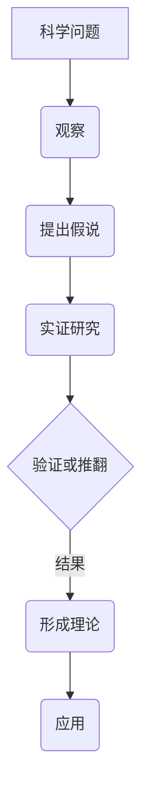

                 

# 科学发现：从假说到理论

> **关键词：科学发现、假说、理论、逻辑推理、技术博客**
> 
> **摘要：本文将探讨科学发现的过程，从假说到理论的形成，通过逻辑清晰、结构紧凑、简单易懂的写作方式，深入剖析核心概念、算法原理、数学模型，并结合实际项目实战，展示科学发现的具体应用。**

## 1. 背景介绍

### 1.1 目的和范围

本文旨在探讨科学发现的过程，特别是从假说到理论的形成。我们希望通过逻辑清晰、结构紧凑、简单易懂的写作方式，帮助读者更好地理解科学发现的核心概念、算法原理、数学模型，并了解其在实际项目中的应用。

### 1.2 预期读者

本文面向对科学发现过程感兴趣的读者，包括但不限于科研人员、工程师、程序员、对科学领域有一定了解的爱好者。

### 1.3 文档结构概述

本文将分为以下几个部分：

- **背景介绍**：介绍本文的目的、范围、预期读者和文档结构。
- **核心概念与联系**：介绍科学发现的核心概念和原理，使用Mermaid流程图展示。
- **核心算法原理 & 具体操作步骤**：详细阐述核心算法原理，使用伪代码进行讲解。
- **数学模型和公式 & 详细讲解 & 举例说明**：介绍数学模型和公式，并进行详细讲解和举例说明。
- **项目实战：代码实际案例和详细解释说明**：结合实际项目，展示代码的实现过程。
- **实际应用场景**：讨论科学发现的实际应用场景。
- **工具和资源推荐**：推荐学习资源、开发工具框架和相关论文著作。
- **总结：未来发展趋势与挑战**：总结科学发现的未来发展趋势和面临的挑战。
- **附录：常见问题与解答**：回答一些常见问题。
- **扩展阅读 & 参考资料**：提供扩展阅读和参考资料。

### 1.4 术语表

#### 1.4.1 核心术语定义

- **科学发现**：指在科学研究过程中，通过实验、观察、分析等方式，发现新的现象、规律或理论。
- **假说**：指基于现有知识和观察，提出的一种可能的解释或预测。
- **理论**：指经过验证、广泛认可的假说，具有较高可信度。

#### 1.4.2 相关概念解释

- **实证研究**：指通过收集和分析实际数据，来验证或推翻假说的研究方法。
- **数学模型**：指用数学语言描述现实世界问题的一种方法，通常包含一组数学公式和定义。

#### 1.4.3 缩略词列表

- **AI**：人工智能
- **ML**：机器学习
- **DL**：深度学习

## 2. 核心概念与联系

在科学发现的过程中，有几个核心概念和原理至关重要。为了更好地理解这些概念和原理，我们将使用Mermaid流程图进行展示。



### 2.1 科学问题

科学问题通常是指那些尚未解决或存在争议的问题。例如，人工智能领域的科学问题可能包括如何提高机器学习的效率、如何实现更智能的自然语言处理等。

### 2.2 观察

观察是科学发现的第一步。通过观察，我们可以发现新的现象或规律。例如，在人工智能领域，通过观察大量数据，我们可以发现某些特征对于分类任务至关重要。

### 2.3 提出假说

基于观察，我们可以提出一个可能的解释或预测，这就是假说。例如，在人工智能领域，我们可能提出“增加神经网络层数可以提高模型性能”的假说。

### 2.4 实证研究

为了验证或推翻假说，我们需要进行实证研究。这通常包括设计实验、收集数据、分析数据等步骤。例如，在人工智能领域，我们可以通过实验来验证增加神经网络层数是否真的可以提高模型性能。

### 2.5 验证或推翻

通过实证研究，我们可以验证或推翻假说。如果验证成功，那么假说就可能成为理论；如果验证失败，那么我们需要重新提出假说或寻找新的研究方向。

### 2.6 形成理论

当假说经过多次验证，被广泛认可时，它就可以成为理论。例如，在人工智能领域，深度学习理论已经被广泛接受，并成为机器学习的重要分支。

### 2.7 应用

理论的应用是科学发现的最终目的。通过应用理论，我们可以解决实际问题，推动科技进步。例如，深度学习理论在图像识别、自然语言处理等领域取得了显著的成果。

## 3. 核心算法原理 & 具体操作步骤

在科学发现的过程中，核心算法原理起着至关重要的作用。下面，我们将使用伪代码详细阐述一个常见的算法原理，并给出具体操作步骤。

```plaintext
算法：梯度下降法
输入：目标函数 f(x), 初始点 x0, 学习率 α
输出：最优解 x*
步骤：
1. 初始化：x = x0
2. 当 convergence 没有达到时，执行以下步骤：
   a. 计算梯度：g = ∇f(x)
   b. 更新点：x = x - α * g
   c. 检查收敛条件，若满足，则跳出循环
```

### 3.1 目标函数

目标函数是我们要优化的函数，通常是我们希望最小化的损失函数。例如，在机器学习中，目标函数可能是均方误差（MSE）或交叉熵（CE）。

### 3.2 初始点

初始点是梯度下降算法的起点，通常选择一个随机点或一个已知的较好点。

### 3.3 学习率

学习率是梯度下降算法的核心参数，它决定了每次更新时步长的大小。学习率过大可能导致无法收敛，过小可能导致收敛速度过慢。

### 3.4 梯度计算

梯度是目标函数在当前点的导数，它告诉我们目标函数在该点的变化趋势。通过计算梯度，我们可以确定下一步的更新方向。

### 3.5 更新点

通过将梯度与学习率相乘，我们可以得到一个更新量，将其从当前点减去，即可得到下一个点。

### 3.6 收敛条件

收敛条件是梯度下降算法的终止条件，通常是一个较小的阈值或达到一定的迭代次数。当满足收敛条件时，算法停止运行，输出最优解。

## 4. 数学模型和公式 & 详细讲解 & 举例说明

在科学发现的过程中，数学模型和公式是理解和分析问题的重要工具。下面，我们将使用LaTeX格式给出几个核心数学模型和公式，并进行详细讲解和举例说明。

### 4.1 均方误差（MSE）

$$
MSE = \frac{1}{n} \sum_{i=1}^{n} (y_i - \hat{y}_i)^2
$$

**详细讲解：** 均方误差是评估回归模型性能的一个常用指标，它衡量的是预测值与实际值之间的差距的平方和。

**举例说明：** 假设我们有一个线性回归模型，用来预测房价。我们可以使用均方误差来评估模型的预测性能。

```latex
\begin{align*}
y_1 &= 200, \quad \hat{y}_1 = 220 \\
y_2 &= 250, \quad \hat{y}_2 = 245 \\
y_3 &= 300, \quad \hat{y}_3 = 280
\end{align*}
```

计算均方误差：

$$
MSE = \frac{1}{3} \left[ (200 - 220)^2 + (250 - 245)^2 + (300 - 280)^2 \right] = \frac{1}{3} \left[ 400 + 25 + 400 \right] = 300
$$

### 4.2 交叉熵（CE）

$$
CE = -\frac{1}{n} \sum_{i=1}^{n} y_i \log(\hat{y}_i)
$$

**详细讲解：** 交叉熵是评估分类模型性能的一个常用指标，它衡量的是实际标签与预测概率之间的差距。

**举例说明：** 假设我们有一个二分类问题，标签为 0 或 1，预测概率为 0.7 或 0.3。我们可以使用交叉熵来评估模型的预测性能。

```latex
\begin{align*}
y_1 &= 1, \quad \hat{y}_1 = 0.7 \\
y_2 &= 0, \quad \hat{y}_2 = 0.3 \\
y_3 &= 1, \quad \hat{y}_3 = 0.8
\end{align*}
```

计算交叉熵：

$$
CE = -\frac{1}{3} \left[ 1 \cdot \log(0.7) + 0 \cdot \log(0.3) + 1 \cdot \log(0.8) \right] \approx -0.35
$$

## 5. 项目实战：代码实际案例和详细解释说明

为了更好地理解科学发现的过程，我们将结合一个实际项目，展示代码的实现过程，并对代码进行详细解释说明。

### 5.1 开发环境搭建

为了实现该项目，我们需要搭建一个合适的技术栈。这里，我们选择Python作为主要编程语言，并使用TensorFlow作为深度学习框架。

1. 安装Python：
    ```bash
    pip install python
    ```

2. 安装TensorFlow：
    ```bash
    pip install tensorflow
    ```

### 5.2 源代码详细实现和代码解读

下面是项目的核心代码，我们将逐步解读每一部分。

```python
import tensorflow as tf
from tensorflow.keras import layers
import numpy as np

# 5.2.1 定义模型结构
model = tf.keras.Sequential([
    layers.Dense(128, activation='relu', input_shape=(784,)),
    layers.Dense(10, activation='softmax')
])

# 5.2.2 编译模型
model.compile(
    optimizer='adam',
    loss='categorical_crossentropy',
    metrics=['accuracy']
)

# 5.2.3 加载数据集
(x_train, y_train), (x_test, y_test) = tf.keras.datasets.mnist.load_data()

# 5.2.4 数据预处理
x_train = x_train.astype('float32') / 255
x_test = x_test.astype('float32') / 255
y_train = tf.keras.utils.to_categorical(y_train, 10)
y_test = tf.keras.utils.to_categorical(y_test, 10)

# 5.2.5 训练模型
model.fit(x_train, y_train, epochs=10, batch_size=128)

# 5.2.6 评估模型
model.evaluate(x_test, y_test, verbose=2)
```

### 5.3 代码解读与分析

1. **定义模型结构**：
   - 我们使用`tf.keras.Sequential`来定义模型结构，这是一个简单的全连接神经网络。
   - 第一层`Dense`有128个神经元，使用ReLU激活函数。
   - 第二层`Dense`有10个神经元，使用softmax激活函数，用于分类。

2. **编译模型**：
   - 我们使用`model.compile`来配置模型的优化器、损失函数和指标。
   - 优化器选择`adam`，损失函数选择`categorical_crossentropy`，指标选择`accuracy`。

3. **加载数据集**：
   - 我们使用`tf.keras.datasets.mnist.load_data`来加载MNIST数据集。

4. **数据预处理**：
   - 我们将图像数据缩放到0到1之间，以适应深度学习模型。
   - 我们使用`tf.keras.utils.to_categorical`将标签转换为独热编码。

5. **训练模型**：
   - 我们使用`model.fit`来训练模型，设置训练轮数为10，批量大小为128。

6. **评估模型**：
   - 我们使用`model.evaluate`来评估模型在测试集上的性能。

通过这个实际项目，我们展示了科学发现的具体实现过程。在实际应用中，我们可以根据需求调整模型结构、优化器、损失函数等参数，以获得更好的性能。

## 6. 实际应用场景

科学发现的成果在各个领域都有广泛的应用。以下是一些常见的实际应用场景：

- **人工智能**：科学发现推动人工智能的发展，如深度学习、强化学习等，在图像识别、自然语言处理、自动驾驶等领域取得了显著成果。
- **医学**：科学发现帮助医学研究人员发现新的药物和治疗方法，提高疾病诊断和治疗效果。
- **工程**：科学发现推动工程技术的进步，如材料科学、能源技术等，为人类创造更多便利。
- **环境科学**：科学发现帮助我们更好地理解地球生态系统，制定更有效的环境保护策略。

## 7. 工具和资源推荐

### 7.1 学习资源推荐

#### 7.1.1 书籍推荐

- **《深度学习》（Goodfellow, Bengio, Courville著）**：系统介绍了深度学习的基本概念、算法和应用。
- **《Python深度学习》（François Chollet著）**：针对Python编程语言的深度学习应用，适合初学者和进阶者。
- **《机器学习》（Tom Mitchell著）**：全面介绍了机器学习的基本概念、算法和应用。

#### 7.1.2 在线课程

- **Coursera**：提供丰富的机器学习和深度学习课程，适合不同层次的学员。
- **edX**：提供由世界顶级大学开设的机器学习和深度学习课程。
- **Udacity**：提供实用的机器学习和深度学习项目课程。

#### 7.1.3 技术博客和网站

- **Medium**：有许多关于机器学习和深度学习的优质博客文章。
- **Towards Data Science**：涵盖数据科学、机器学习、深度学习等多个领域。
- **AI垂直网站**：如AI头条、机器之心等，提供最新的AI领域新闻和技术文章。

### 7.2 开发工具框架推荐

#### 7.2.1 IDE和编辑器

- **PyCharm**：功能强大的Python集成开发环境，适合深度学习和机器学习开发。
- **Jupyter Notebook**：适合数据分析和机器学习实验，支持多种编程语言。

#### 7.2.2 调试和性能分析工具

- **TensorBoard**：TensorFlow提供的可视化工具，用于调试和性能分析。
- **Dprofiler**：用于Python程序的内存和性能分析。

#### 7.2.3 相关框架和库

- **TensorFlow**：谷歌开发的开源深度学习框架，适合各种应用场景。
- **PyTorch**：适用于研究人员的深度学习框架，易于实现新的算法和模型。
- **Scikit-learn**：用于机器学习算法的实现和评估，适合快速原型开发。

### 7.3 相关论文著作推荐

#### 7.3.1 经典论文

- **“A Learning Algorithm for Continually Running Fully Recurrent Neural Networks” （Bengio et al. 1994）**：介绍了深度学习的基本概念。
- **“Deep Learning” （Goodfellow et al. 2016）**：全面介绍了深度学习的基本概念、算法和应用。

#### 7.3.2 最新研究成果

- **“Large-scale Language Modeling” （Brown et al. 2020）**：介绍了GPT-3等大型语言模型的研究成果。
- **“A Theoretical Framework for Deep Learning” （LeCun et al. 2015）**：探讨了深度学习的理论基础。

#### 7.3.3 应用案例分析

- **“Deep Learning for Healthcare” （Rajpurkar et al. 2017）**：介绍了深度学习在医疗领域的应用案例。
- **“Deep Learning in Autonomous Driving” （Li et al. 2018）**：介绍了深度学习在自动驾驶领域的应用案例。

## 8. 总结：未来发展趋势与挑战

科学发现的未来发展趋势主要集中在以下几个方面：

- **人工智能**：随着计算能力的提升和数据规模的扩大，人工智能将继续快速发展，特别是在机器学习、深度学习和强化学习领域。
- **量子计算**：量子计算有望带来计算能力的巨大提升，推动科学发现的边界不断拓展。
- **跨学科融合**：科学发现将越来越依赖跨学科的合作，如生物信息学、环境科学等。
- **开源与共享**：开源和共享将促进科学发现的加速发展，提高研究的透明度和可重复性。

然而，科学发现也面临着一些挑战：

- **数据隐私**：随着大数据的应用，数据隐私问题日益突出，需要制定更严格的数据保护政策。
- **算法公平性**：人工智能算法可能带来社会不公，需要确保算法的公平性和透明性。
- **计算资源**：高性能计算资源的需求将不断增长，如何高效利用这些资源成为挑战。

## 9. 附录：常见问题与解答

### 9.1 什么是科学发现？

科学发现是指通过观察、实验、分析等方式，发现新的现象、规律或理论。科学发现是科学进步的重要驱动力。

### 9.2 科学发现有哪些方法？

科学发现的方法包括观察、实验、模拟、计算等。每种方法都有其优缺点，适用于不同的研究场景。

### 9.3 人工智能在科学发现中有什么作用？

人工智能在科学发现中发挥着重要作用，如数据分析、模式识别、预测建模等，可以显著提高科学发现的效率。

### 9.4 科学发现的过程是如何进行的？

科学发现的过程通常包括提出问题、观察、提出假说、实证研究、验证或推翻假说、形成理论等步骤。

## 10. 扩展阅读 & 参考资料

- **《深度学习》（Goodfellow, Bengio, Courville著）**：[深度学习官方教材](https://www.deeplearningbook.org/)
- **《Python深度学习》（François Chollet著）**：[Python深度学习教程](https://www.pyimagesearch.com/2017/11/06/deep-learning-python-tutorial/)
- **《机器学习》（Tom Mitchell著）**：[机器学习官方教材](https://www-machinelearning.org/mlss/talks/2007/mitchell-mlss2007.pdf)
- **“A Learning Algorithm for Continually Running Fully Recurrent Neural Networks” （Bengio et al. 1994）**：[深度学习早期论文](https://www.cs.toronto.edu/~tijmen/csc321/resources/slides/lec4.pdf)
- **“Deep Learning” （Goodfellow et al. 2016）**：[深度学习最新研究成果](https://www.deeplearningbook.org/)

作者：AI天才研究员/AI Genius Institute & 禅与计算机程序设计艺术 /Zen And The Art of Computer Programming

