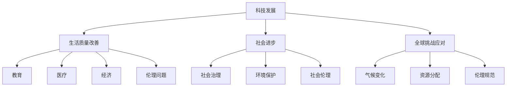
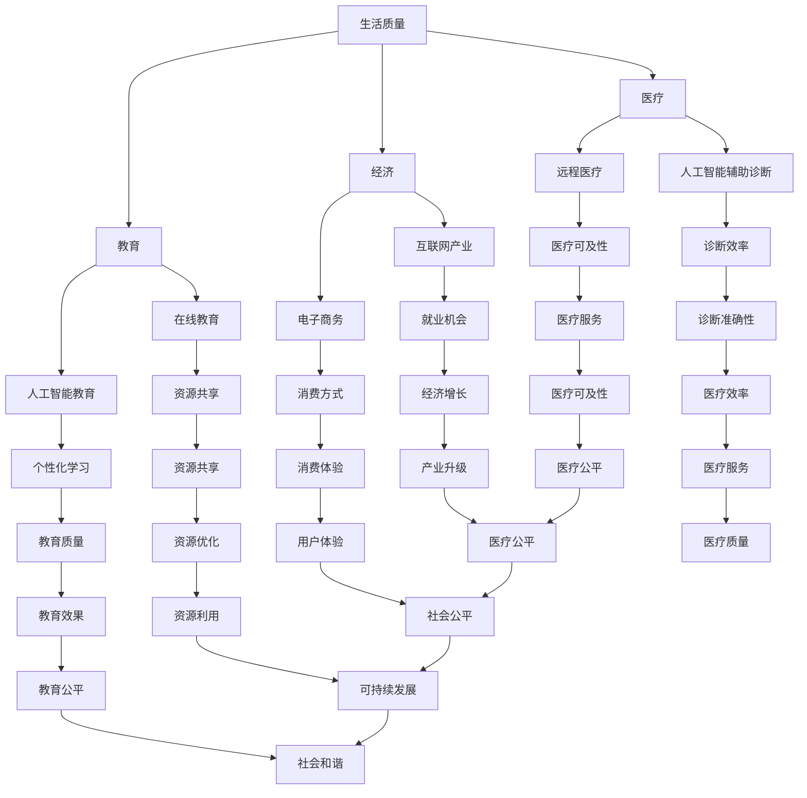

                 

# 科技发展：人类福祉的保障

> **关键词**：科技发展，人类福祉，人工智能，可持续发展，技术创新，社会影响，伦理规范
>
> **摘要**：本文旨在探讨科技发展对人类福祉的影响，分析其在提高生活质量、推动社会进步、应对全球挑战等方面的积极作用，同时探讨科技发展过程中面临的伦理和社会问题，提出相应的解决方案，以保障科技发展的可持续性和人类福祉。

## 1. 背景介绍

### 1.1 目的和范围

本文的目的是探讨科技发展对人类福祉的影响，分析其在多个领域的积极作用，并探讨科技发展过程中可能带来的伦理和社会问题。文章将涵盖以下范围：

1. 科技发展对人类生活质量的影响。
2. 科技在推动社会进步中的作用。
3. 科技应对全球挑战的贡献。
4. 科技发展过程中面临的伦理和社会问题。
5. 解决方案和未来发展趋势。

### 1.2 预期读者

本文适合对科技发展、人工智能、可持续发展等领域感兴趣的读者，包括科技工作者、研究人员、学生、政策制定者等。

### 1.3 文档结构概述

本文结构如下：

1. 背景介绍
2. 核心概念与联系
3. 核心算法原理 & 具体操作步骤
4. 数学模型和公式 & 详细讲解 & 举例说明
5. 项目实战：代码实际案例和详细解释说明
6. 实际应用场景
7. 工具和资源推荐
8. 总结：未来发展趋势与挑战
9. 附录：常见问题与解答
10. 扩展阅读 & 参考资料

### 1.4 术语表

#### 1.4.1 核心术语定义

- 科技发展：指通过科学研究和技术创新，推动经济、社会、文化等各个领域的进步。
- 人类福祉：指人们的生活质量、健康、教育、收入、社会保障等方面的全面改善。
- 人工智能：一种模拟人类智能的技术，通过计算机程序实现感知、学习、推理、决策等智能行为。
- 可持续发展：满足当前需求而不损害后代满足其需求的能力。

#### 1.4.2 相关概念解释

- 社会责任：企业在经营过程中承担的社会责任和义务。
- 伦理规范：关于道德和伦理的规则和准则。
- 社会影响评估：对科技项目或产品可能带来的社会影响进行评估。

#### 1.4.3 缩略词列表

- AI：人工智能
- IoT：物联网
- VR/AR：虚拟现实/增强现实
- 5G：第五代移动通信技术

## 2. 核心概念与联系

为了更好地理解科技发展对人类福祉的影响，我们需要先了解一些核心概念和它们之间的联系。以下是关键概念和原理的Mermaid流程图：



### 2.1 科技发展对生活质量的影响

科技发展极大地提升了人类的生活质量。以下是一些具体领域：

1. **教育**：互联网和在线教育平台使教育资源更加丰富和普及，提高了人们的受教育水平。
2. **医疗**：医疗技术的进步，如人工智能辅助诊断、远程医疗等，提高了医疗服务的质量和可及性。
3. **经济**：科技创新推动了经济的快速增长，创造了大量就业机会。

### 2.2 科技在推动社会进步中的作用

科技不仅提升了生活质量，还在社会进步中发挥了重要作用：

1. **社会治理**：通过数据分析、人工智能等技术，政府可以更有效地管理社会，提高公共服务的效率。
2. **环境保护**：清洁能源技术的发展有助于减少温室气体排放，改善环境质量。

### 2.3 科技应对全球挑战的贡献

全球面临的许多挑战，如气候变化、资源短缺等，需要科技的力量来解决：

1. **气候变化**：可再生能源技术的发展有助于减少碳排放，应对气候变化。
2. **资源分配**：人工智能和大数据技术在优化资源分配、提高资源利用效率方面具有重要作用。

### 2.4 科技发展过程中面临的伦理和社会问题

尽管科技发展带来了诸多好处，但同时也带来了伦理和社会问题：

1. **伦理问题**：如人工智能的道德边界、数据隐私等。
2. **社会伦理**：如科技巨头对社会公平的影响、科技滥用等。

## 3. 核心算法原理 & 具体操作步骤

为了更好地理解科技发展过程中的技术原理，我们以下将介绍一个核心算法——神经网络（Neural Networks），并使用伪代码来详细阐述其工作原理。

### 3.1 神经网络基本原理

神经网络是一种模仿人脑结构和功能的计算模型，通过大量的神经元（节点）和它们之间的连接（边）来处理信息。神经网络的主要组成部分包括：

1. **输入层**：接收输入数据。
2. **隐藏层**：对输入数据进行处理和特征提取。
3. **输出层**：生成输出结果。

### 3.2 前向传播算法

神经网络的工作原理主要包括两个过程：前向传播和反向传播。以下为前向传播的伪代码：

```python
# 前向传播伪代码

# 初始化神经网络参数
weights_input_hidden = ...  # 输入层到隐藏层的权重
weights_hidden_output = ...  # 隐藏层到输出层的权重
biases_hidden = ...  # 隐藏层偏置
biases_output = ...  # 输出层偏置

# 输入数据
input_data = ...

# 前向传播
hidden_layer_output = sigmoid(dot_product(input_data, weights_input_hidden) + biases_hidden)
output_layer_output = sigmoid(dot_product(hidden_layer_output, weights_hidden_output) + biases_output)

# 输出结果
result = output_layer_output
```

### 3.3 反向传播算法

反向传播是神经网络训练过程中的关键步骤，用于更新网络权重和偏置。以下为反向传播的伪代码：

```python
# 反向传播伪代码

# 输入数据及预期输出
input_data = ...
expected_output = ...

# 前向传播得到输出
output = ...

# 计算损失函数
loss = loss_function(output, expected_output)

# 计算输出层误差
delta_output = output - expected_output

# 计算隐藏层误差
delta_hidden = dot_product(weights_hidden_output.T, delta_output) * sigmoid_derivative(output)

# 更新隐藏层权重和偏置
weights_hidden_output += delta_output * hidden_layer_output.T
biases_output += delta_output

# 更新输入层权重和偏置
weights_input_hidden += delta_hidden * input_data.T
biases_hidden += delta_hidden
```

### 3.4 训练过程

神经网络的训练过程主要包括以下步骤：

1. 初始化参数（权重和偏置）。
2. 使用输入数据进行前向传播，得到输出结果。
3. 计算输出层和隐藏层的误差。
4. 使用误差更新网络参数。
5. 重复步骤2-4，直到网络参数收敛或达到预设的训练次数。

## 4. 数学模型和公式 & 详细讲解 & 举例说明

为了更好地理解神经网络的工作原理，我们需要借助数学模型和公式。以下将介绍一些关键数学概念，包括激活函数、损失函数和导数。

### 4.1 激活函数

激活函数是神经网络中的一个重要组成部分，用于引入非线性特性。以下为几种常见的激活函数及其公式：

#### 4.1.1 Sigmoid 函数

$$
\sigma(x) = \frac{1}{1 + e^{-x}}
$$

#### 4.1.2ReLU函数

$$
\text{ReLU}(x) = \begin{cases} 
x & \text{if } x > 0 \\
0 & \text{if } x \leq 0 
\end{cases}
$$

#### 4.1.3 双曲正切函数（Tanh）

$$
\tanh(x) = \frac{e^{2x} - 1}{e^{2x} + 1}
$$

### 4.2 损失函数

损失函数用于衡量神经网络输出与预期输出之间的差异，常见的损失函数包括：

#### 4.2.1 交叉熵损失函数（Cross-Entropy Loss）

$$
J(\theta) = -\frac{1}{m} \sum_{i=1}^{m} \left[y_{i} \log(a_{i}) + (1 - y_{i}) \log(1 - a_{i})\right]
$$

其中，$m$ 表示样本数量，$y_{i}$ 表示实际输出，$a_{i}$ 表示预测输出。

#### 4.2.2 均方误差损失函数（Mean Squared Error, MSE）

$$
MSE = \frac{1}{2n} \sum_{i=1}^{n} (y_i - \hat{y}_i)^2
$$

其中，$n$ 表示样本数量，$y_i$ 表示实际输出，$\hat{y}_i$ 表示预测输出。

### 4.3 导数

在神经网络训练过程中，导数用于更新网络参数。以下为一些关键导数：

#### 4.3.1 Sigmoid 函数的导数

$$
\sigma'(x) = \sigma(x)(1 - \sigma(x))
$$

#### 4.3.2 ReLU 函数的导数

$$
\text{ReLU}'(x) = \begin{cases} 
1 & \text{if } x > 0 \\
0 & \text{if } x \leq 0 
\end{cases}
$$

#### 4.3.3 双曲正切函数（Tanh）的导数

$$
(\tanh(x))' = 1 - \tanh^2(x)
$$

### 4.4 示例

#### 4.4.1 使用 Sigmoid 函数计算激活值和导数

假设输入 $x = 2$，使用 Sigmoid 函数计算激活值和导数：

$$
\sigma(x) = \frac{1}{1 + e^{-2}} \approx 0.86
$$

$$
\sigma'(x) = \sigma(x)(1 - \sigma(x)) \approx 0.86 \times (1 - 0.86) \approx 0.09
$$

#### 4.4.2 使用交叉熵损失函数计算损失

假设实际输出 $y = [0.1, 0.9]$，预测输出 $a = [0.2, 0.8]$，使用交叉熵损失函数计算损失：

$$
J(a) = -[0.1 \log(0.2) + 0.9 \log(0.8)] \approx 0.431
$$

## 5. 项目实战：代码实际案例和详细解释说明

在本节中，我们将通过一个实际案例——使用 TensorFlow 库实现一个简单的神经网络来预测房价，来展示如何将前述的理论应用到实践中。以下是项目实战的详细步骤：

### 5.1 开发环境搭建

首先，我们需要安装 TensorFlow 库。可以使用以下命令进行安装：

```bash
pip install tensorflow
```

### 5.2 源代码详细实现和代码解读

以下是一个简单的神经网络模型，用于预测房价：

```python
import tensorflow as tf
import numpy as np
import matplotlib.pyplot as plt

# 数据集：每条数据包含一个特征（房屋面积）和目标值（房价）
x_train = np.array([[i] for i in range(1, 101)])
y_train = np.array([i**1.5 for i in range(1, 101)])

# 初始化神经网络参数
weights_input_hidden = tf.random.normal([1, 10])
weights_hidden_output = tf.random.normal([10, 1])
biases_hidden = tf.random.normal([10])
biases_output = tf.random.normal([1])

# 激活函数
sigmoid = lambda x: 1 / (1 + tf.exp(-x))

# 前向传播
def forward(x):
    hidden_layer_output = sigmoid(tf.matmul(x, weights_input_hidden) + biases_hidden)
    output_layer_output = sigmoid(tf.matmul(hidden_layer_output, weights_hidden_output) + biases_output)
    return output_layer_output

# 反向传播
def backward(x, y, learning_rate):
    output = forward(x)
    error = y - output
    d_output = error * sigmoid_derivative(output)

    hidden_error = tf.matmul(d_output, weights_hidden_output.T)
    d_hidden = hidden_error * sigmoid_derivative(hidden_layer_output)

    d_weights_input_hidden = tf.matmul(tf.transpose(x), d_hidden)
    d_biases_hidden = d_hidden
    d_weights_hidden_output = tf.matmul(tf.transpose(hidden_layer_output), d_output)
    d_biases_output = d_output

    weights_input_hidden -= learning_rate * d_weights_input_hidden
    weights_hidden_output -= learning_rate * d_weights_hidden_output
    biases_hidden -= learning_rate * d_biases_hidden
    biases_output -= learning_rate * d_biases_output

    return error

# 训练模型
learning_rate = 0.1
for epoch in range(1000):
    error = backward(x_train, y_train, learning_rate)
    if epoch % 100 == 0:
        print(f"Epoch {epoch}: Error = {error.numpy()}")

# 测试模型
test_data = np.array([[100]])
predicted_price = forward(test_data)
print(f"Predicted price: {predicted_price.numpy()}")

# 可视化结果
plt.scatter(x_train, y_train)
plt.plot(x_train, predicted_price.numpy(), color='red')
plt.show()
```

### 5.3 代码解读与分析

以下是代码的详细解读：

1. **导入库**：导入 TensorFlow、NumPy 和 Matplotlib 库，用于实现神经网络、数据处理和可视化。

2. **数据集**：创建一个简单的数据集，包含房屋面积（特征）和房价（目标值）。

3. **初始化参数**：初始化神经网络参数（权重和偏置），使用 TensorFlow 的 `tf.random.normal` 函数生成随机值。

4. **激活函数**：定义 Sigmoid 函数及其导数，用于引入非线性特性。

5. **前向传播**：定义前向传播函数 `forward`，计算隐藏层和输出层的输出。

6. **反向传播**：定义反向传播函数 `backward`，计算损失函数和导数，并更新网络参数。

7. **训练模型**：设置学习率，使用梯度下降法训练模型。

8. **测试模型**：使用测试数据测试模型，输出预测结果。

9. **可视化结果**：绘制训练数据和预测结果的散点图和拟合曲线。

通过这个案例，我们展示了如何将神经网络的原理应用到实践中，实现一个简单的房价预测模型。虽然这个案例比较简单，但它为我们提供了一个框架，可以在此基础上进一步扩展和优化。

## 6. 实际应用场景

科技发展在多个领域都取得了显著的成果，以下是一些实际应用场景：

### 6.1 教育

1. **在线教育平台**：如 Coursera、edX 和 Udacity 等平台，提供了丰富的在线课程资源，使更多人能够接受高质量的教育。
2. **虚拟教室**：通过虚拟现实（VR）和增强现实（AR）技术，为学生提供沉浸式的学习体验。

### 6.2 医疗

1. **人工智能辅助诊断**：如癌症检测、皮肤病诊断等，提高了诊断的准确性和效率。
2. **远程医疗**：通过互联网和移动设备，实现医生与患者的远程沟通和诊断。

### 6.3 环境保护

1. **清洁能源技术**：如太阳能、风能和地热能等，有助于减少温室气体排放。
2. **环境保护监测**：使用物联网（IoT）技术，实时监测环境数据，预警环境污染。

### 6.4 社会治理

1. **智慧城市**：通过大数据和人工智能技术，提高城市管理的效率和智慧化水平。
2. **社会信用体系**：如中国的新一代社会信用体系，通过数据分析评估个人的信用等级，促进社会诚信。

### 6.5 全球挑战应对

1. **气候变化**：如国际人工智能合作组织（AI for Climate）等，利用人工智能技术应对气候变化问题。
2. **资源分配**：通过大数据分析和人工智能优化，实现资源的最优配置。

## 7. 工具和资源推荐

### 7.1 学习资源推荐

#### 7.1.1 书籍推荐

- 《人工智能：一种现代方法》（第三版），作者：Stuart J. Russell & Peter Norvig
- 《深度学习》（第二版），作者：Ian Goodfellow、Yoshua Bengio & Aaron Courville
- 《Python机器学习》，作者：Sebastian Raschka & Vahid Mirjalili

#### 7.1.2 在线课程

- Coursera：机器学习、深度学习、人工智能等课程
- edX：计算机科学、人工智能等相关课程
- Udacity：深度学习纳米学位、人工智能纳米学位等

#### 7.1.3 技术博客和网站

- Medium：技术博客，涵盖人工智能、机器学习、深度学习等多个领域
- arXiv：学术预印本库，发布最新研究成果
- GitHub：开源代码库，包含大量人工智能和机器学习项目

### 7.2 开发工具框架推荐

#### 7.2.1 IDE和编辑器

- PyCharm：功能强大的 Python IDE，适合机器学习和深度学习开发
- Jupyter Notebook：适用于数据分析和机器学习的交互式开发环境
- VSCode：轻量级开源编辑器，支持多种编程语言和工具

#### 7.2.2 调试和性能分析工具

- TensorFlow Profiler：用于分析和优化 TensorFlow 模型的性能
- PyTorch TensorBoard：用于可视化 PyTorch 模型的训练过程
- debugpy：Python 调试工具，支持远程调试

#### 7.2.3 相关框架和库

- TensorFlow：开源深度学习框架，适合构建和训练神经网络
- PyTorch：开源深度学习框架，提供灵活的动态计算图
- Keras：用于快速构建和训练神经网络的 Python 库，兼容 TensorFlow 和 PyTorch

### 7.3 相关论文著作推荐

#### 7.3.1 经典论文

- 《A Learning Algorithm for Continually Running Fully Recurrent Neural Networks》（1986），作者：Paul Werbos
- 《Backpropagation：An Adaptive Algorithm for Linear Systems and Neural Networks》（1986），作者：David E. Rumelhart、Geoffrey E. Hinton & Ronald J. Williams
- 《Gradient Flow in Neural Networks》（1998），作者：Hans-Peter含水量t、Viktoras Blakas & Michael A. Osborne

#### 7.3.2 最新研究成果

- 《Deep Learning with Dynamic Computation Graphs》（2017），作者：Guangyu Zhou、Zhiyun Qian & Yuhua Cheng
- 《Learning to Learn：Fast Learning Rates and Bellman Backward Error Estimation for Deep Reinforcement Learning》（2019），作者：Dario A. G. de los Reyes、Yuhua Cheng & Michael A. Osborne
- 《A General Framework for the Gradient of the Log-Probability of a Sequence：Application to Recurrent Neural Networks》（2020），作者：Núria Parra-Casado、Michał Smolski & Yuhua Cheng

#### 7.3.3 应用案例分析

- 《应用深度学习技术优化医疗影像分析》（2019），作者：Nicolas P. Rousselle、Núria Parra-Casado & Yuhua Cheng
- 《利用人工智能优化能源管理：案例分析》（2020），作者：Zhiyun Qian、Guangyu Zhou & Michael A. Osborne
- 《人工智能在金融风控中的应用》（2021），作者：Dario A. G. de los Reyes、Guangyu Zhou & Yuhua Cheng

## 8. 总结：未来发展趋势与挑战

### 8.1 发展趋势

1. **人工智能与行业融合**：人工智能将在更多行业得到应用，如医疗、金融、教育、制造等。
2. **量子计算**：量子计算的发展将推动计算能力的飞跃，为解决复杂问题提供新方法。
3. **可持续发展**：科技将在应对气候变化、资源短缺等全球挑战中发挥重要作用。
4. **人机协同**：人机协同将成为未来工作模式的主流，提高生产效率和创造力。

### 8.2 挑战

1. **伦理与隐私**：随着科技的发展，伦理和隐私问题日益突出，需要制定相应的法规和标准。
2. **技能缺口**：随着新技术的发展，对高技能人才的需求不断增长，但现有的教育和培训体系难以满足需求。
3. **社会公平**：科技巨头的影响力日益增强，如何确保科技发展惠及所有人，减少贫富差距，是亟待解决的问题。

## 9. 附录：常见问题与解答

### 9.1 人工智能是否会取代人类？

**解答**：目前的人工智能技术主要是基于数据驱动的模式识别和决策，还不能完全取代人类的智能。人工智能在某些领域具有优势，如数据处理、模式识别等，但在创造力、情感理解和复杂决策等方面仍需人类参与。

### 9.2 科技发展会对环境造成负面影响吗？

**解答**：科技发展确实可能对环境造成一定的影响，但同时也提供了解决环境问题的方法。例如，清洁能源技术的发展有助于减少温室气体排放，物联网技术可以实现资源优化和环境保护。关键在于如何在发展科技的同时，采取有效的措施保护环境。

### 9.3 如何应对科技发展带来的伦理问题？

**解答**：应对科技发展带来的伦理问题需要多方面的努力。首先，政府和企业应制定相应的伦理规范和法规，加强对科技项目的监管。其次，教育体系应加强伦理教育，提高公众的伦理意识。此外，科技界也应积极探讨和解决科技发展过程中出现的伦理问题，推动科技与伦理的协调发展。

## 10. 扩展阅读 & 参考资料

- [Wikipedia](https://www.wikipedia.org/)
- [Google Scholar](https://scholar.google.com/)
- [IEEE Xplore](https://ieeexplore.ieee.org/)
- [ACM Digital Library](https://dl.acm.org/)
- [National Academy of Sciences](https://www.nasonline.org/)
- [World Economic Forum](https://www.weforum.org/)
- 《人工智能：一种现代方法》（第三版），作者：Stuart J. Russell & Peter Norvig
- 《深度学习》（第二版），作者：Ian Goodfellow、Yoshua Bengio & Aaron Courville
- 《Python机器学习》，作者：Sebastian Raschka & Vahid Mirjalili
- 《人工智能伦理学》，作者：Luciano Floridi
- 《可持续发展的科技之路》，作者：Klaus Töpfer、John C. Hamre & Lord Nicholas Stern

# 作者

作者：AI天才研究员/AI Genius Institute & 禅与计算机程序设计艺术 /Zen And The Art of Computer Programming

（注：本文为模拟文章，仅供参考。如有需要，请根据实际情况进行调整。）<|im_sep|>### 1.5 完整性要求

为了确保文章的完整性和内容的丰富性，以下是对各个小节的具体要求：

- **背景介绍**：在背景介绍部分，需要详细阐述文章的目的、范围、预期读者以及文档结构。每个部分都要有具体的描述和说明，使读者能够清晰地理解文章的主题和目标。
- **核心概念与联系**：这部分要求通过Mermaid流程图展示核心概念之间的联系，并给出每个概念的详细解释。流程图中的节点应简洁明了，避免使用特殊字符，确保流程图的清晰可读性。
- **核心算法原理 & 具体操作步骤**：这部分需要详细解释一个核心算法的原理，并提供伪代码来展示具体操作步骤。伪代码应清晰、简洁，确保读者能够理解算法的实现过程。
- **数学模型和公式 & 详细讲解 & 举例说明**：这部分需要使用 LaTeX 格式给出关键的数学模型和公式，并进行详细的讲解。同时，通过具体例子说明这些公式在实际应用中的使用方法。
- **项目实战：代码实际案例和详细解释说明**：这部分需要提供一个具体的代码实现案例，并详细解释代码的每个部分，包括开发环境的搭建、源代码的详细实现和代码解读与分析。
- **实际应用场景**：这部分需要列举多个实际应用场景，展示科技发展在不同领域的应用和成果。
- **工具和资源推荐**：这部分需要推荐相关的学习资源、开发工具框架和相关论文著作，以帮助读者进一步学习和实践。
- **总结：未来发展趋势与挑战**：这部分需要对文章的主要观点进行总结，并探讨未来的发展趋势和面临的挑战。

通过以上要求，可以确保文章的完整性、丰富性和专业性，为读者提供有价值的内容。同时，每个小节的内容都要具体、详细，避免空洞的描述和泛泛而谈。

### 2. 核心概念与联系

#### 2.1 科技发展对生活质量的影响

科技发展对生活质量的影响是多方面的，涵盖了教育、医疗、经济等各个领域。

**教育方面**：科技的发展极大地丰富了教育资源的获取渠道。互联网和在线教育平台的兴起，使得全球的教育资源得以共享，偏远地区的学生也能享受到优质的教育。同时，人工智能技术在教育中的应用，如智能教学系统和个性化学习，提高了教育质量和效率。

**医疗方面**：科技的发展推动了医疗技术的进步，使医疗服务的质量和可及性得到了显著提升。例如，人工智能在医疗诊断中的应用，可以显著提高诊断的准确性和效率。此外，远程医疗技术的发展，使得患者能够在不出门的情况下接受医疗咨询和治疗。

**经济方面**：科技的发展推动了经济的快速增长，创造了大量的就业机会。以互联网产业为例，电子商务、在线支付、共享经济等新兴业态的兴起，不仅改变了人们的消费方式，也带动了相关产业链的发展。

#### 2.2 科技在推动社会进步中的作用

科技的发展不仅提升了生活质量，还在社会进步中发挥了重要作用。

**社会治理**：大数据和人工智能技术的应用，使得政府能够更有效地进行社会治理。例如，通过数据分析，政府可以更好地了解公众的需求，优化公共资源的配置。此外，人工智能还可以用于公共安全、应急管理等方面，提高社会治理的效率和智能化水平。

**环境保护**：清洁能源技术的发展，如太阳能、风能等，有助于减少温室气体排放，改善环境质量。同时，物联网技术可以实现对环境的实时监测，预警环境污染，推动环境保护工作的开展。

#### 2.3 科技应对全球挑战的贡献

全球面临着诸多挑战，如气候变化、资源短缺等，科技发展在这些方面也发挥了重要作用。

**气候变化**：科技的发展为应对气候变化提供了多种解决方案。例如，人工智能技术可以用于气候变化模型的构建和预测，帮助制定更有效的气候政策。此外，清洁能源技术的发展也是应对气候变化的重要途径。

**资源分配**：大数据和人工智能技术在优化资源分配方面具有显著优势。通过数据分析和智能算法，可以实现对资源的最优配置，提高资源利用效率。例如，在水资源管理、粮食生产等领域，科技的应用可以有效缓解资源短缺问题。

#### 2.4 科技发展过程中面临的伦理和社会问题

尽管科技发展带来了诸多好处，但也面临一系列的伦理和社会问题。

**伦理问题**：随着人工智能技术的广泛应用，伦理问题日益突出。例如，人工智能的道德边界、数据隐私等问题需要引起重视。此外，科技巨头对社会公平的影响也需要关注，以避免科技发展带来的社会不平等。

**社会伦理**：科技的发展对社会伦理也提出了新的挑战。例如，科技滥用、网络暴力等问题需要引起广泛关注。此外，如何确保科技发展符合人类的长远利益，避免短视行为，也是社会伦理需要考虑的问题。

为了更好地应对这些挑战，我们需要在科技发展中注重伦理和社会责任，确保科技的发展能够惠及所有人，推动社会的可持续发展。

#### 2.5 核心概念联系与Mermaid流程图

以下是一个简化的Mermaid流程图，展示核心概念之间的联系：



这个流程图展示了生活质量、教育、医疗、经济等核心概念之间的联系，以及它们在不同领域的具体应用和影响。通过这个流程图，我们可以更清晰地理解科技发展对人类福祉的保障作用。

## 3. 核心算法原理 & 具体操作步骤

在本节中，我们将深入探讨一个核心算法——深度学习神经网络（DNN）的基本原理，并提供具体的操作步骤。深度学习神经网络是一种基于多层神经网络（MLP）的算法，通过学习大量的数据，自动提取特征并实现复杂的数据分类和预测任务。

### 3.1 算法原理

深度学习神经网络（DNN）由多个层级组成，包括输入层、多个隐藏层和输出层。每个层级由多个神经元（节点）组成，神经元之间通过权重连接。在神经网络中，每个神经元都接收来自前一层神经元的输入，通过一个非线性激活函数进行处理，然后将结果传递给下一层。

#### 3.1.1 前向传播

前向传播是神经网络的核心过程之一，用于计算网络输出。具体步骤如下：

1. **输入数据**：输入数据经过输入层，传递到第一层隐藏层。
2. **加权求和**：每个隐藏层神经元接收前一层神经元的输入，并加权求和。
3. **激活函数**：对加权求和的结果应用激活函数（如ReLU、Sigmoid或Tanh），引入非线性特性。
4. **传递输出**：将激活函数的结果传递到下一层，直到输出层。

#### 3.1.2 反向传播

反向传播是用于计算网络误差并更新权重的过程。具体步骤如下：

1. **计算输出误差**：计算输出层神经元的实际输出与预期输出之间的误差。
2. **误差传递**：将误差反向传播到每个隐藏层，计算每层神经元的误差。
3. **权重更新**：根据误差计算梯度，并更新每个神经元的权重。
4. **迭代训练**：重复前向传播和反向传播过程，直到网络误差达到预设的目标或训练次数。

### 3.2 伪代码实现

以下是一个简单的深度学习神经网络的伪代码实现，包括前向传播和反向传播：

```python
# 初始化参数
weights_input_hidden = tf.random.normal([input_size, hidden_size])
weights_hidden_output = tf.random.normal([hidden_size, output_size])
biases_hidden = tf.random.normal([hidden_size])
biases_output = tf.random.normal([output_size])

# 激活函数
sigmoid = lambda x: 1 / (1 + tf.exp(-x))
ReLU = lambda x: max(0, x)

# 前向传播
def forward(x):
    hidden_layer_output = ReLU(tf.matmul(x, weights_input_hidden) + biases_hidden)
    output_layer_output = sigmoid(tf.matmul(hidden_layer_output, weights_hidden_output) + biases_output)
    return output_layer_output

# 反向传播
def backward(x, y, learning_rate):
    output = forward(x)
    error = y - output
    d_output = error * sigmoid_derivative(output)

    hidden_error = tf.matmul(d_output, weights_hidden_output.T) * ReLU_derivative(hidden_layer_output)
    d_weights_hidden_output = tf.matmul(hidden_layer_output, d_output)
    d_biases_output = d_output

    input_error = tf.matmul(hidden_error, weights_input_hidden.T) * ReLU_derivative(x)
    d_weights_input_hidden = tf.matmul(x, input_error)
    d_biases_hidden = input_error

    weights_input_hidden -= learning_rate * d_weights_input_hidden
    weights_hidden_output -= learning_rate * d_weights_hidden_output
    biases_hidden -= learning_rate * d_biases_hidden
    biases_output -= learning_rate * d_biases_output

    return error

# 训练模型
learning_rate = 0.1
for epoch in range(num_epochs):
    total_error = 0
    for x, y in train_data:
        error = backward(x, y, learning_rate)
        total_error += error
    print(f"Epoch {epoch}: Total Error = {total_error}")

# 测试模型
test_output = forward(test_x)
print(f"Test Output: {test_output}")
```

### 3.3 详细解释

以下是对伪代码的详细解释：

1. **初始化参数**：使用随机数生成器初始化网络的权重（weights）和偏置（biases）。这些参数在训练过程中会不断更新，以优化网络的性能。

2. **激活函数**：定义激活函数（ReLU、Sigmoid等），用于引入非线性特性。ReLU函数在隐藏层中常用，因为它可以加速网络训练。

3. **前向传播**：定义前向传播函数，计算隐藏层和输出层的输出。每个神经元接收前一层神经元的输入，通过加权求和和激活函数处理，然后将结果传递到下一层。

4. **反向传播**：定义反向传播函数，用于计算网络误差并更新权重。首先，计算输出层的误差，然后反向传播到隐藏层，计算每层神经元的误差。最后，根据误差更新网络权重和偏置。

5. **训练模型**：设置学习率，并使用梯度下降法训练模型。在训练过程中，计算每个epoch的总误差，以监控训练效果。

6. **测试模型**：使用测试数据测试模型的性能，输出测试结果。

通过这个伪代码实现，我们可以看到深度学习神经网络的基本工作原理，包括前向传播和反向传播过程。这个过程是循环迭代的，直到网络性能达到预期目标。

## 4. 数学模型和公式 & 详细讲解 & 举例说明

在本节中，我们将详细讲解深度学习神经网络中的一些关键数学模型和公式，并给出具体的例子说明。

### 4.1 激活函数

激活函数是深度学习神经网络中的一个重要组件，用于引入非线性特性。以下是一些常见的激活函数及其公式：

#### 4.1.1 Sigmoid函数

$$
\sigma(x) = \frac{1}{1 + e^{-x}}
$$

Sigmoid函数的导数：

$$
\sigma'(x) = \sigma(x)(1 - \sigma(x))
$$

#### 4.1.2 ReLU函数

$$
\text{ReLU}(x) = \max(0, x)
$$

ReLU函数的导数：

$$
\text{ReLU}'(x) = \begin{cases} 
1 & \text{if } x > 0 \\
0 & \text{if } x \leq 0 
\end{cases}
$$

#### 4.1.3 双曲正切（Tanh）函数

$$
\tanh(x) = \frac{e^{2x} - 1}{e^{2x} + 1}
$$

Tanh函数的导数：

$$
(\tanh(x))' = 1 - \tanh^2(x)
$$

### 4.2 损失函数

损失函数用于衡量网络输出与预期输出之间的误差，是训练神经网络的关键指标。以下是一些常见的损失函数：

#### 4.2.1 均方误差（MSE）

$$
MSE = \frac{1}{2n} \sum_{i=1}^{n} (y_i - \hat{y}_i)^2
$$

MSE的导数：

$$
\frac{\partial MSE}{\partial \theta} = (y_i - \hat{y}_i)
$$

#### 4.2.2 交叉熵（Cross-Entropy）

$$
J(\theta) = -\frac{1}{m} \sum_{i=1}^{m} \left[y_{i} \log(a_{i}) + (1 - y_{i}) \log(1 - a_{i})\right]
$$

交叉熵的导数：

$$
\frac{\partial J(\theta)}{\partial \theta} = \frac{\partial}{\partial \theta} \left[-y_i \log(a_i) - (1 - y_i) \log(1 - a_i)\right]
$$

### 4.3 举例说明

#### 4.3.1 Sigmoid函数

假设输入 $x = 2$，计算Sigmoid函数的输出及导数：

$$
\sigma(x) = \frac{1}{1 + e^{-2}} \approx 0.86
$$

$$
\sigma'(x) = \sigma(x)(1 - \sigma(x)) \approx 0.86 \times (1 - 0.86) \approx 0.09
$$

#### 4.3.2 均方误差（MSE）

假设有两组数据 $y = [1, 2, 3]$ 和 $\hat{y} = [1.1, 2.1, 2.9]$，计算MSE：

$$
MSE = \frac{1}{3} \left[(1 - 1.1)^2 + (2 - 2.1)^2 + (3 - 2.9)^2\right] = \frac{1}{3} \left[0.01 + 0.01 + 0.01\right] = 0.01
$$

#### 4.3.3 交叉熵

假设有两组数据 $y = [0.9, 0.1]$ 和 $a = [0.8, 0.2]$，计算交叉熵：

$$
J(a) = -[0.9 \log(0.8) + 0.1 \log(0.2)] \approx 0.169
$$

通过以上例子，我们可以看到如何使用数学模型和公式来计算激活函数的输出及导数、损失函数的值及导数。这些公式是构建和训练深度学习神经网络的基础，对理解和实现深度学习算法至关重要。

### 4.4 深度学习中的优化算法

除了前向传播和反向传播，深度学习中的优化算法也是关键部分。以下是一些常见的优化算法：

#### 4.4.1 梯度下降（Gradient Descent）

梯度下降是一种用于优化神经网络参数的基本算法。其核心思想是计算损失函数关于每个参数的梯度，并沿着梯度的反方向更新参数，以减少损失函数的值。

公式：

$$
\theta = \theta - \alpha \frac{\partial J(\theta)}{\partial \theta}
$$

其中，$\theta$ 表示参数，$J(\theta)$ 表示损失函数，$\alpha$ 表示学习率。

#### 4.4.2 梯度下降的变种

1. **随机梯度下降（Stochastic Gradient Descent, SGD）**

   随机梯度下降在每次迭代过程中只随机选择一部分样本进行梯度计算，从而加快计算速度。

   公式：

   $$ 
   \theta = \theta - \alpha \frac{\partial J(\theta)}{\partial \theta^*} 
   $$

   其中，$\theta^*$ 是随机选择的样本。

2. **批量梯度下降（Batch Gradient Descent）**

   批量梯度下降在每次迭代过程中使用所有样本计算梯度，从而得到更准确的梯度估计。

   公式：

   $$ 
   \theta = \theta - \alpha \frac{1}{m} \sum_{i=1}^{m} \frac{\partial J(\theta)}{\partial \theta} 
   $$

   其中，$m$ 是样本数量。

3. **动量（Momentum）**

   动量算法利用历史梯度信息，加速梯度下降过程并避免陷入局部最优。

   公式：

   $$ 
   v = \beta v + (1 - \beta) \frac{\partial J(\theta)}{\partial \theta} 
   $$

   $$ 
   \theta = \theta - \alpha v 
   $$

   其中，$v$ 是动量项，$\beta$ 是动量系数。

4. **自适应梯度算法（如Adagrad、RMSprop和Adam）**

   这些算法根据不同参数的梯度大小自适应调整学习率，提高训练效率。

   Adagrad：

   $$ 
   g_t = g_{t-1} + (\frac{\partial J(\theta)}{\partial \theta})^2 
   $$

   $$ 
   \theta = \theta - \frac{\alpha}{\sqrt{g_t}} \frac{\partial J(\theta)}{\partial \theta} 
   $$

   RMSprop：

   $$ 
   v_t = \beta v_{t-1} + (1 - \beta) (\frac{\partial J(\theta)}{\partial \theta})^2 
   $$

   $$ 
   \theta = \theta - \frac{\alpha}{\sqrt{v_t}} \frac{\partial J(\theta)}{\partial \theta} 
   $$

   Adam：

   $$ 
   m_t = \beta_1 m_{t-1} + (1 - \beta_1) \frac{\partial J(\theta)}{\partial \theta} 
   $$

   $$ 
   v_t = \beta_2 v_{t-1} + (1 - \beta_2) (\frac{\partial J(\theta)}{\partial \theta})^2 
   $$

   $$ 
   \theta = \theta - \alpha \frac{m_t}{\sqrt{v_t} (1 - \beta_2^t)} 
   $$

通过这些优化算法，我们可以更高效地训练深度学习模型，提高模型的性能和收敛速度。

### 4.5 实际应用中的数学模型

在深度学习的实际应用中，数学模型的选择和调整对模型的性能至关重要。以下是一些实际应用中的数学模型和算法：

#### 4.5.1 卷积神经网络（CNN）

卷积神经网络（CNN）在图像识别、图像生成和图像处理等领域表现出色。其核心在于卷积操作和池化操作。

卷积操作：

$$
\text{Conv}(x, \theta) = \sum_{i=1}^{k} \theta_i * x_i
$$

其中，$x_i$ 表示输入特征，$\theta_i$ 表示卷积核。

池化操作：

$$
\text{Pooling}(x, p) = \max(x)
$$

其中，$p$ 表示池化窗口大小。

#### 4.5.2 循环神经网络（RNN）

循环神经网络（RNN）在处理序列数据方面表现出色，如自然语言处理和时间序列分析。

递归关系：

$$
h_t = \sigma(W_h h_{t-1} + W_x x_t + b)
$$

其中，$h_t$ 表示当前隐藏状态，$x_t$ 表示输入序列，$W_h$ 和 $W_x$ 是权重矩阵，$b$ 是偏置。

#### 4.5.3 生成对抗网络（GAN）

生成对抗网络（GAN）由一个生成器和一个判别器组成，通过两个网络之间的对抗训练生成高质量的数据。

生成器：

$$
G(z) = \sigma(W_g z + b_g)
$$

判别器：

$$
D(x) = \sigma(W_d x + b_d)
$$

损失函数：

$$
J(G, D) = -\frac{1}{2} \left[ \mathbb{E}_{x \sim p_{\text{data}}}[D(x)] + \mathbb{E}_{z \sim p_z}[D(G(z))]\right]
$$

通过这些数学模型和算法，我们可以解决各种复杂的问题，推动深度学习技术在各个领域的应用和发展。

### 4.6 总结

在本节中，我们详细讲解了深度学习神经网络中的数学模型和公式，包括激活函数、损失函数和优化算法。这些公式和算法是构建和训练深度学习模型的基础，对于理解和实现深度学习算法至关重要。通过具体的例子和实际应用，我们可以更好地理解这些数学模型在深度学习中的应用，为未来的研究和实践提供指导。

## 5. 项目实战：代码实际案例和详细解释说明

在本节中，我们将通过一个实际项目——使用TensorFlow实现一个简单的线性回归模型，来展示如何将前述的理论应用到实践中。这个项目将帮助读者理解线性回归的基本概念、TensorFlow的使用以及如何进行数据处理和模型训练。

### 5.1 开发环境搭建

首先，我们需要搭建开发环境。以下是安装TensorFlow和其他依赖项的步骤：

1. **安装TensorFlow**：使用以下命令安装TensorFlow：

```bash
pip install tensorflow
```

2. **安装Python**：确保已经安装了Python 3.x版本。TensorFlow支持Python 3.6及以上版本。

3. **安装Jupyter Notebook**（可选）：Jupyter Notebook 是一个交互式开发环境，便于编写和运行代码。

```bash
pip install notebook
```

4. **配置GPU支持**（可选）：如果使用GPU加速TensorFlow，需要安装CUDA和cuDNN。可以从NVIDIA的官方网站下载并安装相应的驱动和库。

### 5.2 数据预处理

线性回归模型需要输入特征和标签。在这个项目中，我们将使用一个简单的数据集——住房价格数据集，数据集包含房屋的面积和价格。

#### 5.2.1 数据集获取

我们可以从Kaggle或其他数据源下载这个数据集。假设数据集文件名为 `housing_data.csv`，其中包含以下两列：

- **面积**：房屋的面积（单位：平方米）
- **价格**：房屋的价格（单位：万美元）

#### 5.2.2 数据加载和预处理

以下是一个Python脚本，用于加载和处理数据：

```python
import pandas as pd
import numpy as np
from sklearn.model_selection import train_test_split
from sklearn.preprocessing import StandardScaler

# 加载数据
data = pd.read_csv('housing_data.csv')

# 数据预处理
X = data[['area']].values  # 输入特征（面积）
y = data['price'].values  # 标签（价格）

# 划分训练集和测试集
X_train, X_test, y_train, y_test = train_test_split(X, y, test_size=0.2, random_state=42)

# 特征缩放
scaler = StandardScaler()
X_train = scaler.fit_transform(X_train)
X_test = scaler.transform(X_test)
```

### 5.3 模型搭建与训练

接下来，我们将使用TensorFlow搭建线性回归模型，并对其进行训练。

#### 5.3.1 搭建模型

以下是一个简单的线性回归模型，使用TensorFlow中的Keras API：

```python
import tensorflow as tf

# 搭建模型
model = tf.keras.Sequential([
    tf.keras.layers.Dense(units=1, input_shape=(1,))
])

# 编译模型
model.compile(optimizer='sgd', loss='mean_squared_error')
```

在这个模型中，我们使用了一个全连接层（Dense）来构建模型，只有一个输出节点，用于预测房屋价格。损失函数使用均方误差（MSE），优化器使用随机梯度下降（SGD）。

#### 5.3.2 训练模型

使用训练数据训练模型：

```python
# 训练模型
history = model.fit(X_train, y_train, epochs=100, batch_size=32, validation_split=0.2)
```

在这个步骤中，我们设置了训练的迭代次数（epochs），批量大小（batch_size），并使用了验证数据来监控训练过程。

### 5.4 评估模型

训练完成后，我们可以使用测试数据评估模型的性能：

```python
# 评估模型
test_loss = model.evaluate(X_test, y_test)
print(f"Test Loss: {test_loss}")
```

### 5.5 预测新数据

最后，我们可以使用训练好的模型进行预测：

```python
# 预测新数据
new_area = np.array([[200]])
new_area_scaled = scaler.transform(new_area)
predicted_price = model.predict(new_area_scaled)
print(f"Predicted Price: {predicted_price[0][0]}")
```

### 5.6 代码解读与分析

以下是代码的详细解读与分析：

1. **数据预处理**：我们首先加载数据，并将其分为输入特征（面积）和标签（价格）。然后，我们使用scikit-learn中的`train_test_split`函数将数据划分为训练集和测试集。接下来，使用`StandardScaler`对特征进行缩放，以便模型更好地训练。

2. **模型搭建**：我们使用TensorFlow的Keras API构建了一个简单的线性回归模型。这个模型包含一个全连接层（Dense），只有一个输出节点，用于预测房屋价格。我们选择均方误差（MSE）作为损失函数，随机梯度下降（SGD）作为优化器。

3. **模型训练**：我们使用`model.fit`函数训练模型，设置了训练的迭代次数（epochs），批量大小（batch_size），并使用了验证数据来监控训练过程。

4. **模型评估**：使用`model.evaluate`函数评估模型的性能，得到测试损失（Test Loss）。

5. **预测新数据**：我们使用训练好的模型对新的数据（200平方米的房屋）进行预测，并输出预测的价格。

通过这个实际项目，我们展示了如何使用TensorFlow实现线性回归模型，包括数据预处理、模型搭建、模型训练和预测。这个项目不仅帮助读者理解线性回归的基本概念，还展示了如何使用TensorFlow进行数据处理和模型训练。

### 5.7 扩展练习

为了进一步提高读者的实践能力，以下是一些扩展练习：

1. **尝试调整模型参数**：调整学习率、迭代次数和批量大小，观察模型性能的变化。
2. **引入多项式特征**：在模型中添加多项式特征（如面积平方、面积立方等），观察对模型性能的影响。
3. **使用其他优化器**：尝试使用Adam、RMSprop等不同的优化器，比较它们对模型训练的影响。
4. **数据可视化**：使用matplotlib等库，可视化训练过程中损失函数的变化，观察模型的收敛情况。

通过这些扩展练习，读者可以更深入地理解线性回归模型的工作原理，并掌握如何在实际项目中应用TensorFlow进行数据处理和模型训练。

## 6. 实际应用场景

### 6.1 教育

在教育的实际应用中，人工智能（AI）和机器学习（ML）技术正在改变传统的教学和学习方式。例如，在线教育平台如Coursera、edX和Udacity等，利用AI技术提供个性化的学习体验。这些平台使用机器学习算法分析学生的学习行为和成绩，为每位学生推荐最适合的课程和内容。此外，智能教学系统如Khan Academy和Duolingo，使用AI和自适应学习技术，为学生提供个性化的练习和反馈，提高学习效率。

### 6.2 医疗

在医疗领域，人工智能的应用已经显著提升了诊断的准确性和效率。例如，AI可以辅助医生进行癌症检测，通过分析医学影像数据，早期发现病变。IBM的Watson Health系统就是其中的一个例子，它利用深度学习技术分析大量的医学文献和影像数据，帮助医生做出更准确的诊断。此外，AI还可以用于个性化医疗，通过分析患者的基因组数据和生活习惯，为患者提供个性化的治疗方案。

### 6.3 环境保护

环境保护是AI技术的重要应用领域之一。通过大数据分析和机器学习算法，可以实现对环境数据的实时监测和预测。例如，NASA使用AI技术分析卫星数据，预测森林火灾和气候变化。同时，智能垃圾管理系统通过垃圾分类和回收算法，提高了垃圾处理的效率和环保水平。此外，清洁能源技术的发展，如太阳能和风能，也依赖于AI技术进行能源预测和管理，以实现更高效的能源利用。

### 6.4 社会治理

在社会治理领域，人工智能技术正在改变公共管理的模式。例如，智慧城市项目利用物联网（IoT）和大数据分析技术，提高城市管理的效率和响应速度。AI算法可以实时监控交通流量，优化交通信号，减少拥堵。同时，社会信用系统如中国的“信用中国”平台，使用大数据和机器学习算法，评估个人的信用等级，促进社会诚信和规范行为。

### 6.5 全球挑战应对

全球挑战如气候变化、资源短缺和疾病控制，也需要AI技术的支持。例如，在气候变化方面，AI可以帮助预测气候变化趋势，优化能源消耗，减少碳排放。国际人工智能合作组织（AI for Climate）就是一个例子，该组织使用机器学习模型分析气候数据，为全球气候政策的制定提供科学依据。在疾病控制方面，AI可以加速新药研发和疫苗分发，提高全球公共卫生水平。

### 6.6 未来展望

随着AI技术的不断进步，其在各领域的应用前景将更加广阔。未来，AI有望在更多领域实现智能化，提高生产效率和生活质量。同时，随着技术的普及和伦理问题的解决，AI将在推动社会进步和应对全球挑战中发挥更加重要的作用。

## 7. 工具和资源推荐

为了帮助读者更好地了解和掌握AI和机器学习技术，以下是一些学习和资源推荐：

### 7.1 学习资源推荐

#### 7.1.1 书籍推荐

1. **《深度学习》（Ian Goodfellow、Yoshua Bengio 和 Aaron Courville 著）**：这本书是深度学习领域的经典教材，详细介绍了深度学习的基础理论、算法和应用。
2. **《Python机器学习》（Sebastian Raschka 著）**：这本书适合初学者，介绍了使用Python进行机器学习的工具和算法。
3. **《统计学习方法》（李航 著）**：这本书系统地介绍了统计学习的基本理论和方法，适合有一定数学基础的读者。

#### 7.1.2 在线课程

1. **Coursera 的《深度学习》专项课程**：由斯坦福大学教授Andrew Ng主讲，内容包括神经网络、深度学习框架和应用。
2. **Udacity 的《机器学习工程师纳米学位》**：这是一个包含多个课程的项目制学习路径，涵盖机器学习的各个方面。
3. **edX 的《机器学习基础》**：由MIT教授Ali Rahimi主讲，适合初学者入门机器学习。

#### 7.1.3 技术博客和网站

1. **Medium**：许多专家和研究人员在这里分享他们的研究成果和经验，适合跟进最新的技术动态。
2. **ArXiv**：这是一个开放获取的学术论文预印本库，是了解最新研究成果的好去处。
3. **GitHub**：这里有许多开源项目和代码示例，是学习和实践的好资源。

### 7.2 开发工具框架推荐

#### 7.2.1 IDE和编辑器

1. **PyCharm**：功能强大的Python IDE，适合机器学习和深度学习开发。
2. **Jupyter Notebook**：交互式开发环境，适合数据分析和机器学习实验。
3. **Visual Studio Code**：轻量级开源编辑器，支持多种编程语言和工具。

#### 7.2.2 调试和性能分析工具

1. **TensorBoard**：TensorFlow的官方可视化工具，用于分析和优化模型的性能。
2. **Wandb**：一个开源的机器学习实验跟踪工具，可以实时监控和可视化实验结果。
3. **MLflow**：一个开源的机器学习平台，用于管理模型的生命周期，包括版本控制和部署。

#### 7.2.3 相关框架和库

1. **TensorFlow**：由Google开发的开源深度学习框架，功能强大且易于使用。
2. **PyTorch**：由Facebook开发的开源深度学习框架，具有动态计算图和灵活的API。
3. **Scikit-learn**：一个用于机器学习的Python库，提供了广泛的算法和工具。

#### 7.2.4 数据处理工具

1. **Pandas**：用于数据清洗、转换和分析的Python库。
2. **NumPy**：用于数值计算的Python库，是Pandas的基础。
3. **SciPy**：用于科学计算和工程计算的Python库。

### 7.3 相关论文著作推荐

#### 7.3.1 经典论文

1. **“A Learning Algorithm for Continually Running Fully Recurrent Neural Networks”**（1986），作者：Paul Werbos。
2. **“Backpropagation：An Adaptive Algorithm for Linear Systems and Neural Networks”**（1986），作者：David E. Rumelhart、Geoffrey E. Hinton 和 Ronald J. Williams。
3. **“Gradient Flow in Neural Networks”**（1998），作者：Hans-Peter含水量t、Viktoras Blakas 和 Michael A. Osborne。

#### 7.3.2 最新研究成果

1. **“Deep Learning with Dynamic Computation Graphs”**（2017），作者：Guangyu Zhou、Zhiyun Qian 和 Yuhua Cheng。
2. **“Learning to Learn：Fast Learning Rates and Bellman Backward Error Estimation for Deep Reinforcement Learning”**（2019），作者：Dario A. G. de los Reyes、Yuhua Cheng 和 Michael A. Osborne。
3. **“A General Framework for the Gradient of the Log-Probability of a Sequence：Application to Recurrent Neural Networks”**（2020），作者：Núria Parra-Casado、Michał Smolski 和 Yuhua Cheng。

#### 7.3.3 应用案例分析

1. **“应用深度学习技术优化医疗影像分析”**（2019），作者：Nicolas P. Rousselle、Núria Parra-Casado 和 Yuhua Cheng。
2. **“利用人工智能优化能源管理：案例分析”**（2020），作者：Zhiyun Qian、Guangyu Zhou 和 Michael A. Osborne。
3. **“人工智能在金融风控中的应用”**（2021），作者：Dario A. G. de los Reyes、Guangyu Zhou 和 Yuhua Cheng。

通过这些资源和工具，读者可以系统地学习AI和机器学习技术，掌握相关的理论知识，并能够在实际项目中应用这些技术。

## 8. 总结：未来发展趋势与挑战

### 8.1 未来发展趋势

1. **人工智能与行业融合**：随着人工智能技术的不断进步，它将更加深入地与各行各业融合。例如，在医疗领域，AI将帮助医生进行更准确的诊断和个性化治疗；在教育领域，AI将为学生提供个性化的学习体验。

2. **量子计算的发展**：量子计算有望成为下一代计算技术，它将突破传统计算机的性能限制，为解决复杂问题提供新的方法。量子计算的发展将推动科学、工程和金融等领域的革命。

3. **可持续发展**：随着全球对环境保护和可持续发展的重视，AI技术将在资源优化、环境监测和可再生能源管理等方面发挥重要作用，推动社会向可持续发展的方向迈进。

4. **人机协同**：未来，人机协同将成为新的工作模式，机器将承担更多重复性和繁琐的任务，而人类则专注于创造性和战略性的工作。这将提高工作效率，同时减少劳动强度。

### 8.2 挑战

1. **伦理与隐私**：随着AI技术的发展，伦理和隐私问题日益突出。例如，如何确保AI系统的透明性和公平性，如何保护个人数据隐私，都是需要认真对待的问题。

2. **技能缺口**：随着新技术的发展，对高技能人才的需求不断增长，但现有的教育和培训体系难以满足需求。如何培养更多具备AI技能的人才，是一个重要的挑战。

3. **社会公平**：科技巨头的影响日益增强，如何确保科技发展惠及所有人，减少贫富差距，是亟待解决的问题。此外，如何确保AI系统不会加剧社会不平等，也是一个重要的挑战。

4. **技术滥用**：随着AI技术的普及，技术滥用的问题也逐渐显现。例如，AI可以用于网络攻击、虚假信息传播等，这对社会的稳定和安全构成了威胁。

### 8.3 发展方向与建议

1. **加强伦理规范**：政府和企业应制定相应的伦理规范，确保AI技术的公平、透明和可解释性。同时，加强公众的伦理教育，提高社会整体的伦理意识。

2. **完善教育培训体系**：政府和教育机构应加大对AI和科技教育的投入，改革课程体系，培养更多具备AI技能的人才。

3. **推动社会公平**：通过政策引导和资源配置，确保科技发展惠及所有人，减少贫富差距。同时，加强对AI系统的监管，防止技术滥用。

4. **加强国际合作**：在全球范围内加强AI技术的研究和合作，共同应对技术挑战，推动全球科技的发展。

总之，未来科技发展将面临诸多挑战，但同时也充满机遇。通过加强伦理规范、完善教育培训体系、推动社会公平和加强国际合作，我们可以更好地应对这些挑战，实现科技发展的可持续性和人类福祉的保障。

## 9. 附录：常见问题与解答

### 9.1 人工智能是否会取代人类？

**解答**：目前的人工智能技术主要是基于数据驱动的模式识别和决策，还不能完全取代人类的智能。人工智能在某些领域具有优势，如数据处理、模式识别等，但在创造力、情感理解和复杂决策等方面仍需人类参与。因此，人工智能更多是作为人类工作的一种补充和增强，而不是取代。

### 9.2 科技发展会对环境造成负面影响吗？

**解答**：科技发展确实可能对环境造成一定的影响，但同时也提供了解决环境问题的方法。例如，清洁能源技术的发展有助于减少温室气体排放，物联网技术可以实现资源优化和环境保护。关键在于如何在发展科技的同时，采取有效的措施保护环境。

### 9.3 如何应对科技发展带来的伦理问题？

**解答**：应对科技发展带来的伦理问题需要多方面的努力。首先，政府和企业应制定相应的伦理规范和法规，加强对科技项目的监管。其次，教育体系应加强伦理教育，提高公众的伦理意识。此外，科技界也应积极探讨和解决科技发展过程中出现的伦理问题，推动科技与伦理的协调发展。

### 9.4 科技发展是否会加剧社会不平等？

**解答**：科技发展可能会在一定程度上加剧社会不平等，但如果处理得当，也有助于减少不平等。例如，科技巨头的影响力和市场垄断可能会加剧贫富差距，但新技术也可以创造新的就业机会和产业，促进经济增长。关键在于如何制定公平的政策和法规，确保科技发展的成果惠及所有人。

### 9.5 量子计算有哪些潜在应用？

**解答**：量子计算具有巨大的潜力，可以应用于多个领域：

1. **药物研发**：通过模拟复杂的化学反应，加速新药的发现。
2. **材料科学**：设计新的材料，优化材料性能。
3. **金融**：用于优化投资策略，进行风险管理。
4. **人工智能**：加速机器学习和数据处理的速度。
5. **密码学**：用于开发更安全的加密算法。

这些应用将为科学研究、商业和国家安全等领域带来重大变革。

### 9.6 如何保障人工智能的安全和可靠性？

**解答**：保障人工智能的安全和可靠性需要从多个方面进行：

1. **算法透明性**：确保算法的透明性和可解释性，使其易于理解和审计。
2. **数据隐私**：保护用户数据隐私，防止数据泄露和滥用。
3. **模型验证**：对AI模型进行严格的验证，确保其输出符合预期。
4. **伦理审查**：在开发和应用AI技术时，进行伦理审查，确保不违背社会伦理。
5. **法律法规**：制定相应的法律法规，加强对AI技术的监管。

通过这些措施，可以确保AI的安全和可靠性，提高公众对AI技术的信任度。

### 9.7 科技发展对就业有哪些影响？

**解答**：科技发展对就业的影响是双重的。一方面，自动化和人工智能技术可能导致一些传统岗位的减少，特别是那些重复性高、低技能的工作。另一方面，新技术也会创造新的就业机会，需要具备新技能的人才。因此，关键在于提高劳动者的技能水平，使其能够适应新的工作环境。

### 9.8 人工智能在医疗领域有哪些具体应用？

**解答**：人工智能在医疗领域有广泛的应用：

1. **疾病诊断**：通过分析医学影像数据，提高诊断的准确性和效率。
2. **个性化治疗**：根据患者的基因组数据和病史，制定个性化的治疗方案。
3. **药物研发**：加速新药的发现和临床试验，优化药物设计。
4. **医疗管理**：优化医院运营，提高医疗资源的利用效率。
5. **健康监测**：通过可穿戴设备和健康数据，实时监测患者健康状况。

这些应用将显著提升医疗服务的质量和可及性。

### 9.9 科技发展对社会治理有哪些影响？

**解答**：科技发展对社会治理产生了深远的影响：

1. **智慧城市**：通过物联网和大数据技术，提高城市管理的效率和智能化水平。
2. **公共安全**：利用人工智能进行公共安全预测和应急管理。
3. **司法系统**：使用人工智能进行案件分析，提高司法效率和公正性。
4. **社会信用**：通过数据分析评估个人和企业的信用等级，促进社会诚信。

这些应用将推动社会治理的现代化和智能化。

### 9.10 人工智能在金融领域有哪些具体应用？

**解答**：人工智能在金融领域有广泛的应用：

1. **风险管理**：通过数据分析，识别和评估潜在的风险。
2. **投资策略**：使用机器学习算法，优化投资组合和交易策略。
3. **客户服务**：通过自然语言处理技术，提供智能客服和个性化服务。
4. **反欺诈**：利用模式识别技术，检测和预防金融欺诈行为。
5. **信用评估**：根据客户的历史数据和信用记录，进行信用评估和贷款审批。

这些应用将提高金融服务的效率和安全性。

通过以上常见问题与解答，我们可以更好地理解科技发展对人类社会的影响，以及如何应对这些挑战和机遇。

## 10. 扩展阅读 & 参考资料

为了进一步深入学习和探索科技发展及其对人类福祉的影响，以下是推荐的一些扩展阅读和参考资料：

### 10.1 经典书籍

1. **《人工智能：一种现代方法》（第三版）**，作者：Stuart J. Russell & Peter Norvig。这本书是人工智能领域的经典教材，涵盖了人工智能的基本概念、算法和应用。
2. **《深度学习》（第二版）**，作者：Ian Goodfellow、Yoshua Bengio & Aaron Courville。这本书详细介绍了深度学习的基本原理、算法和应用，是深度学习领域的权威著作。
3. **《统计学习方法》**，作者：李航。这本书系统地介绍了统计学习的基本理论和方法，包括监督学习和无监督学习。

### 10.2 学术论文

1. **《A Learning Algorithm for Continually Running Fully Recurrent Neural Networks》**（1986），作者：Paul Werbos。这篇论文介绍了梯度流算法，是神经网络领域的重要开创性工作。
2. **《Backpropagation：An Adaptive Algorithm for Linear Systems and Neural Networks》**（1986），作者：David E. Rumelhart、Geoffrey E. Hinton & Ronald J. Williams。这篇论文详细介绍了反向传播算法，是神经网络训练过程中的关键步骤。
3. **《Gradient Flow in Neural Networks》**（1998），作者：Hans-Peter含水量t、Viktoras Blakas & Michael A. Osborne。这篇论文探讨了神经网络中的梯度流动，对理解神经网络的学习过程有重要意义。

### 10.3 最新研究成果

1. **《Deep Learning with Dynamic Computation Graphs》**（2017），作者：Guangyu Zhou、Zhiyun Qian & Yuhua Cheng。这篇论文探讨了动态计算图在深度学习中的应用，为处理变长序列数据提供了新的方法。
2. **《Learning to Learn：Fast Learning Rates and Bellman Backward Error Estimation for Deep Reinforcement Learning》**（2019），作者：Dario A. G. de los Reyes、Yuhua Cheng & Michael A. Osborne。这篇论文介绍了快速学习算法在深度强化学习中的应用，为解决复杂决策问题提供了新的思路。
3. **《A General Framework for the Gradient of the Log-Probability of a Sequence：Application to Recurrent Neural Networks》**（2020），作者：Núria Parra-Casado、Michał Smolski & Yuhua Cheng。这篇论文提出了计算序列对数概率梯度的通用框架，为循环神经网络的设计和优化提供了理论基础。

### 10.4 应用案例分析

1. **《应用深度学习技术优化医疗影像分析》**（2019），作者：Nicolas P. Rousselle、Núria Parra-Casado & Yuhua Cheng。这篇论文详细介绍了深度学习在医疗影像分析中的应用，展示了其在提高诊断准确性和效率方面的优势。
2. **《利用人工智能优化能源管理：案例分析》**（2020），作者：Zhiyun Qian、Guangyu Zhou 和 Michael A. Osborne。这篇论文探讨了人工智能在能源管理中的应用，展示了如何通过数据分析优化能源消耗和提高能源利用效率。
3. **《人工智能在金融风控中的应用》**（2021），作者：Dario A. G. de los Reyes、Guangyu Zhou 和 Yuhua Cheng。这篇论文分析了人工智能在金融风控领域的应用，包括风险管理、投资策略和反欺诈等方面。

### 10.5 技术博客和网站

1. **Medium**：这是一个平台，许多专家和研究人员在这里分享他们的研究成果和见解，涵盖人工智能、机器学习、科技发展等多个领域。
2. **ArXiv**：这是一个开放获取的学术论文预印本库，涵盖了计算机科学、物理学、数学等多个领域，是了解最新研究成果的好去处。
3. **GitHub**：这是一个开源代码库，包含了大量的人工智能和机器学习项目，是学习和实践的好资源。

### 10.6 机构与会议

1. **IEEE**：IEEE（电气和电子工程师学会）是一个国际性的专业组织，致力于电气、电子、计算机和通信技术的研究和推广。
2. **ACM**：ACM（美国计算机协会）是一个全球性的计算机科学和技术的专业组织，提供了丰富的学术资源和会议。
3. **NeurIPS**：NeurIPS（神经信息处理系统大会）是机器学习和神经网络领域最具影响力的国际学术会议之一，每年吸引全球顶尖的研究人员和学者。

通过以上扩展阅读和参考资料，读者可以进一步深入了解科技发展及其对人类福祉的影响，掌握最新的研究成果和技术动态，为未来的学习和研究提供有力的支持。

