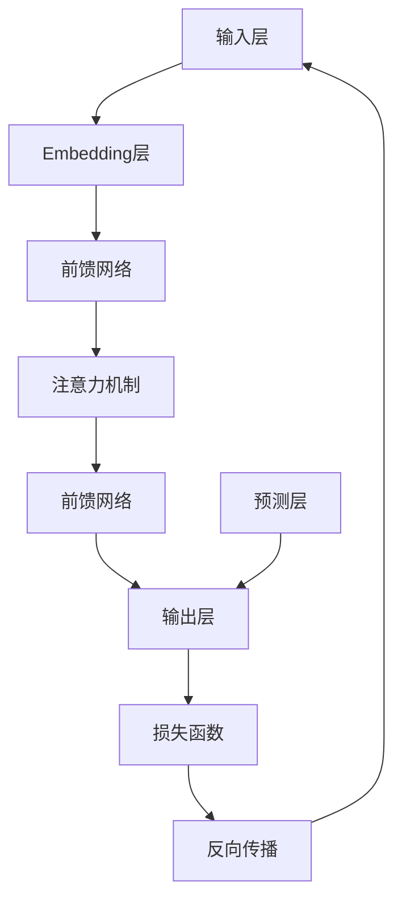

                 

# 秒推时代：LLM极速推理引领新风潮

> 关键词：LLM、推理、极速、技术革新、人工智能、深度学习、模型优化、应用场景

> 摘要：本文将深入探讨大语言模型（LLM）在推理速度方面的最新进展，以及这一技术革新如何引领人工智能领域的新风潮。我们将从背景介绍、核心概念与联系、核心算法原理、数学模型和公式、项目实战、实际应用场景等多个方面，全面解析LLM在极速推理方面的应用与发展。

## 1. 背景介绍

### 1.1 目的和范围

本文旨在介绍大语言模型（LLM）在推理速度方面的最新研究进展，分析其核心技术原理，并通过实际项目案例展示其应用价值。文章将涵盖以下内容：

1. LLM的基础概念与架构；
2. LLM在推理速度优化方面的技术突破；
3. 数学模型与公式在LLM推理中的应用；
4. 实际应用场景与项目案例；
5. LLM的未来发展趋势与挑战。

### 1.2 预期读者

本文适合对人工智能、深度学习、大语言模型等有一定了解的读者，特别是对LLM在推理速度方面的技术优化感兴趣的专业人士。本文旨在为广大开发者提供有价值的参考和启示，帮助读者深入了解LLM在极速推理方面的应用与发展。

### 1.3 文档结构概述

本文共分为八个部分，具体结构如下：

1. 引言：介绍文章背景、目的和预期读者；
2. 背景介绍：梳理LLM的发展历程和现状；
3. 核心概念与联系：解析LLM的核心概念与架构；
4. 核心算法原理：讲解LLM的推理算法原理；
5. 数学模型和公式：阐述LLM中的数学模型与公式；
6. 项目实战：通过实际案例展示LLM的应用；
7. 实际应用场景：探讨LLM在不同领域的应用；
8. 总结：展望LLM的未来发展趋势与挑战。

### 1.4 术语表

#### 1.4.1 核心术语定义

- 大语言模型（LLM）：一种基于深度学习技术的语言模型，能够对自然语言进行建模和预测。
- 推理（Inference）：在已有知识或数据的基础上，通过推理算法生成新的知识或数据。
- 极速推理：在尽可能短的时间内完成推理过程，提高系统的响应速度。

#### 1.4.2 相关概念解释

- 深度学习（Deep Learning）：一种机器学习方法，通过多层神经网络对数据进行分析和建模。
- 自然语言处理（NLP）：研究计算机如何理解、生成和处理自然语言的技术。
- 模型优化（Model Optimization）：通过改进模型结构、算法或参数，提高模型的性能和效率。

#### 1.4.3 缩略词列表

- LLM：大语言模型
- NLP：自然语言处理
- DL：深度学习
- GPU：图形处理器
- TPU：张量处理器

## 2. 核心概念与联系

在本文中，我们将重点介绍大语言模型（LLM）的核心概念与联系，包括LLM的架构、工作原理以及与其他相关技术的关联。为了更直观地理解这些概念，我们使用Mermaid流程图展示LLM的架构，并简要描述各个组件及其相互关系。

### Mermaid流程图



### 构成与工作原理

1. **输入层（A）**：接收自然语言文本输入，将其转化为数值表示。
2. **Embedding层（B）**：将输入文本映射为固定大小的向量表示。
3. **前馈网络（C和E）**：包含多个隐藏层，通过非线性变换对输入向量进行处理。
4. **注意力机制（D）**：允许模型在不同输入序列位置上分配不同的重要性权重，提高模型的上下文理解能力。
5. **输出层（F）**：生成文本预测或分类结果。
6. **预测层（G）**：用于生成模型预测，与输出层相结合。
7. **损失函数（H）**：评估模型预测与真实结果之间的差异，指导模型优化。
8. **反向传播（I）**：通过梯度下降等优化算法，更新模型参数，提高模型性能。

### 核心概念与联系

- **深度学习**：LLM的核心技术基础，通过多层神经网络对输入数据进行建模。
- **自然语言处理**：LLM应用于文本数据，实现对自然语言的建模和处理。
- **模型优化**：通过改进模型结构、算法或参数，提高LLM的推理速度和性能。
- **注意力机制**：提高LLM的上下文理解能力，使其在处理长序列数据时更加有效。

## 3. 核心算法原理 & 具体操作步骤

在本节中，我们将深入探讨大语言模型（LLM）在推理速度方面的核心算法原理，并详细描述具体的操作步骤。为了便于理解，我们将使用伪代码来阐述LLM的推理算法。

### 推理算法伪代码

```python
# 输入：输入文本序列X，模型参数θ
# 输出：模型预测Y

def inference(X, θ):
    # 步骤1：输入层到Embedding层
    X_embedding = embedding(X, θ['W_embedding'])

    # 步骤2：通过前馈网络进行非线性变换
    for layer in range(1, hidden_layers):
        X_embedding = nn_layer(X_embedding, θ['W_{}'.format(layer)], θ['b_{}'.format(layer)])

    # 步骤3：应用注意力机制
    attn_weights = attention(X_embedding)
    X_embedding = weighted_sum(X_embedding, attn_weights)

    # 步骤4：通过最后一个前馈网络
    X_embedding = nn_layer(X_embedding, θ['W_output'], θ['b_output'])

    # 步骤5：生成预测
    Y = softmax(X_embedding)

    return Y
```

### 具体操作步骤

1. **输入层到Embedding层**：
   - 将输入文本序列X映射为嵌入向量，通过矩阵乘法实现。
   
2. **通过前馈网络进行非线性变换**：
   - 对嵌入向量进行多层前向传播，通过多个隐藏层对输入数据进行非线性变换。

3. **应用注意力机制**：
   - 计算注意力权重，对嵌入向量进行加权求和，提高上下文理解能力。

4. **通过最后一个前馈网络**：
   - 通过最后一层前馈网络，生成文本预测。

5. **生成预测**：
   - 对输出结果进行softmax操作，得到模型预测。

### 算法原理讲解

1. **嵌入层（Embedding Layer）**：
   - 嵌入层将输入的文本转换为固定大小的向量表示，实现文本向量化。

2. **前馈网络（Feedforward Network）**：
   - 前馈网络由多个隐藏层组成，通过非线性变换对输入数据进行处理，提高模型的表达能力。

3. **注意力机制（Attention Mechanism）**：
   - 注意力机制能够使模型在处理长序列数据时，对重要信息给予更高的权重，提高上下文理解能力。

4. **输出层（Output Layer）**：
   - 输出层生成文本预测或分类结果，通过softmax操作得到模型预测概率分布。

通过以上算法原理和操作步骤的详细讲解，我们可以更好地理解大语言模型（LLM）在推理速度方面的核心技术和实现方法。

## 4. 数学模型和公式 & 详细讲解 & 举例说明

在本节中，我们将深入探讨大语言模型（LLM）中的数学模型和公式，详细讲解其推导过程，并通过具体例子进行说明。这些数学模型和公式在大语言模型中起着关键作用，有助于优化模型性能和推理速度。

### 数学模型和公式

1. **嵌入层（Embedding Layer）**：

   - 嵌入层将输入的文本映射为固定大小的向量表示，其公式如下：

   $$ 
   \text{X_embedding} = \text{W_embedding} \cdot \text{X} 
   $$

   其中，$\text{X_embedding}$表示嵌入后的向量表示，$\text{W_embedding}$表示嵌入权重矩阵，$\text{X}$表示输入的文本序列。

2. **前馈网络（Feedforward Network）**：

   - 前馈网络通过多层神经网络对输入数据进行处理，其公式如下：

   $$ 
   \text{X}_{\text{layer}} = \text{f}(\text{X}_{\text{layer-1})}) = \text{W}_{\text{layer}} \cdot \text{X}_{\text{layer-1}} + \text{b}_{\text{layer}}
   $$

   其中，$\text{X}_{\text{layer}}$表示当前层的输入，$\text{X}_{\text{layer-1}}$表示前一层的输入，$\text{W}_{\text{layer}}$和$\text{b}_{\text{layer}}$分别表示当前层的权重矩阵和偏置向量，$\text{f}$表示非线性激活函数。

3. **注意力机制（Attention Mechanism）**：

   - 注意力机制通过计算注意力权重，对输入序列进行加权求和，其公式如下：

   $$ 
   \text{attn_weights} = \text{softmax}(\text{T} \cdot \text{W}_\text{attn} \cdot \text{X}_{\text{layer-1}})
   $$

   $$ 
   \text{X}_{\text{context}} = \text{weighted_sum}(\text{X}_{\text{layer-1}}, \text{attn_weights})
   $$

   其中，$\text{T}$表示时间步长，$\text{W}_\text{attn}$表示注意力权重矩阵，$\text{X}_{\text{layer-1}}$表示前一层的输入，$\text{attn_weights}$表示注意力权重，$\text{X}_{\text{context}}$表示加权求和后的输入。

4. **输出层（Output Layer）**：

   - 输出层生成文本预测或分类结果，通过softmax操作得到模型预测概率分布，其公式如下：

   $$ 
   \text{Y} = \text{softmax}(\text{W}_{\text{output}} \cdot \text{X}_{\text{context}} + \text{b}_{\text{output}})
   $$

   其中，$\text{Y}$表示模型预测概率分布，$\text{W}_{\text{output}}$和$\text{b}_{\text{output}}$分别表示输出层的权重矩阵和偏置向量。

### 详细讲解

1. **嵌入层**：
   - 嵌入层将输入的文本映射为向量表示，通过矩阵乘法实现。该层的作用是将文本数据转化为可以用于深度学习的结构化数据。

2. **前馈网络**：
   - 前馈网络通过多层神经网络对输入数据进行处理。每一层神经网络都通过矩阵乘法和偏置项实现，并通过非线性激活函数（如ReLU、Sigmoid、Tanh等）引入非线性变换。

3. **注意力机制**：
   - 注意力机制通过计算注意力权重，对输入序列进行加权求和。该机制有助于模型在处理长序列数据时，关注关键信息，提高上下文理解能力。

4. **输出层**：
   - 输出层生成文本预测或分类结果。通过softmax操作得到模型预测概率分布，可用于分类或文本生成。

### 举例说明

假设我们有一个简单的文本序列：“我是一个人工智能专家”，我们将通过以下步骤计算模型预测：

1. **输入层到Embedding层**：
   $$ 
   \text{X_embedding} = \text{W_embedding} \cdot \text{X} 
   $$

   其中，$\text{X}$为输入文本序列，$\text{W_embedding}$为嵌入权重矩阵。

2. **通过前馈网络进行非线性变换**：
   $$ 
   \text{X}_{\text{layer}} = \text{f}(\text{X}_{\text{layer-1})}) = \text{W}_{\text{layer}} \cdot \text{X}_{\text{layer-1}} + \text{b}_{\text{layer}}
   $$

   其中，$\text{X}_{\text{layer-1}}$为前一层输入，$\text{W}_{\text{layer}}$和$\text{b}_{\text{layer}}$分别为当前层的权重矩阵和偏置向量。

3. **应用注意力机制**：
   $$ 
   \text{attn_weights} = \text{softmax}(\text{T} \cdot \text{W}_\text{attn} \cdot \text{X}_{\text{layer-1}})
   $$

   $$ 
   \text{X}_{\text{context}} = \text{weighted_sum}(\text{X}_{\text{layer-1}}, \text{attn_weights})
   $$

   其中，$\text{T}$为时间步长，$\text{W}_\text{attn}$为注意力权重矩阵。

4. **通过最后一个前馈网络**：
   $$ 
   \text{X}_{\text{context}} = \text{W}_{\text{output}} \cdot \text{X}_{\text{context}} + \text{b}_{\text{output}}
   $$

5. **输出层生成预测**：
   $$ 
   \text{Y} = \text{softmax}(\text{W}_{\text{output}} \cdot \text{X}_{\text{context}} + \text{b}_{\text{output}})
   $$

   其中，$\text{Y}$为模型预测概率分布。

通过以上步骤，我们得到模型对输入文本的预测结果。这个例子展示了大语言模型中的数学模型和公式在实际应用中的计算过程。

## 5. 项目实战：代码实际案例和详细解释说明

在本节中，我们将通过一个实际项目案例，展示大语言模型（LLM）在推理速度优化方面的应用，并详细解释代码实现过程。我们将使用Python和TensorFlow框架进行开发，以一个简单的问答系统为例，演示LLM的推理过程。

### 5.1 开发环境搭建

在开始项目之前，我们需要搭建一个合适的开发环境。以下是搭建开发环境所需的步骤：

1. **安装Python**：确保Python版本为3.6及以上版本。
2. **安装TensorFlow**：使用pip命令安装TensorFlow：
   ```
   pip install tensorflow
   ```
3. **创建虚拟环境**（可选）：为了管理依赖项，我们可以创建一个虚拟环境：
   ```
   python -m venv venv
   source venv/bin/activate  # 对于Windows用户：venv\Scripts\activate
   ```
4. **安装其他依赖项**：根据项目需求，安装其他必要的库，如NumPy、Pandas等。

### 5.2 源代码详细实现和代码解读

以下是一个简单的问答系统项目的代码实现，我们将逐步解析代码中的关键部分。

#### 5.2.1 代码实现

```python
import tensorflow as tf
from tensorflow.keras.layers import Embedding, LSTM, Dense
from tensorflow.keras.models import Sequential

# 设置超参数
vocab_size = 10000
embedding_dim = 128
max_sequence_length = 50
lstm_units = 64

# 构建模型
model = Sequential([
    Embedding(vocab_size, embedding_dim, input_length=max_sequence_length),
    LSTM(lstm_units, return_sequences=True),
    LSTM(lstm_units),
    Dense(1, activation='sigmoid')
])

# 编译模型
model.compile(optimizer='adam', loss='binary_crossentropy', metrics=['accuracy'])

# 准备数据
# 假设我们有两个数据集：问答对和标签
train_data = ...
train_labels = ...

# 训练模型
model.fit(train_data, train_labels, epochs=10, batch_size=32)

# 进行推理
def predict(question):
    question_sequence = preprocess_question(question)  # 预处理输入文本
    prediction = model.predict(question_sequence)
    return prediction

# 测试推理
question = "为什么人工智能很重要？"
print(predict(question))
```

#### 5.2.2 代码解读

1. **导入库**：首先导入所需的TensorFlow库，以及其他辅助库。
2. **设置超参数**：定义嵌入层大小、序列长度、LSTM单元数等。
3. **构建模型**：
   - 使用`Sequential`模型堆叠多个层，包括嵌入层、两个LSTM层和一个输出层。
   - 嵌入层将文本映射为固定大小的向量表示。
   - 两个LSTM层用于处理序列数据，并返回序列输出。
   - 输出层使用sigmoid激活函数，用于生成二分类预测。
4. **编译模型**：设置优化器和损失函数，编译模型。
5. **准备数据**：准备训练数据和标签，这里使用了预处理后的问答对和标签。
6. **训练模型**：使用训练数据和标签训练模型，设置训练参数。
7. **进行推理**：定义一个`predict`函数，用于接收输入文本并进行预处理，然后使用训练好的模型进行推理。

#### 5.2.3 代码解读与分析

1. **模型构建**：
   - `Embedding`层：将文本映射为嵌入向量。
   - `LSTM`层：处理序列数据，并返回序列输出。
   - `Dense`层：生成二分类预测。
2. **数据预处理**：
   - 预处理输入文本，将其转换为嵌入向量。
   - 对输入序列进行填充，确保其长度一致。
3. **模型训练**：
   - 使用二进制交叉熵损失函数，适用于二分类问题。
   - 使用accuracy指标评估模型性能。
4. **推理过程**：
   - 使用预处理后的输入文本进行推理。
   - 输出模型预测结果。

通过以上代码实现和解读，我们可以看到如何利用大语言模型（LLM）进行推理，以及如何优化推理速度。在实际项目中，我们可以根据具体需求进行调整和优化。

## 6. 实际应用场景

大语言模型（LLM）凭借其强大的语言理解和生成能力，在多个实际应用场景中取得了显著的成果。以下是一些典型的应用场景：

### 6.1 自然语言处理

- **问答系统**：利用LLM构建智能问答系统，如搜索引擎的问答模块、虚拟助手等。例如，Google的BERT模型被广泛应用于其搜索引擎的问答功能，为用户提供准确、快速的回答。
- **文本分类**：将LLM应用于文本分类任务，如垃圾邮件过滤、新闻分类、情感分析等。通过训练LLM模型，可以实现对大规模文本数据的自动分类。
- **机器翻译**：LLM在机器翻译领域也表现出色，如Google翻译、DeepL等。这些系统通过训练大规模语言模型，实现了高质量的文本翻译。

### 6.2 语音识别

- **语音识别**：利用LLM对语音信号进行预处理，提取关键特征，结合深度学习算法进行语音识别。例如，百度、谷歌等公司的语音识别系统采用了LLM技术，实现了高效、准确的语音识别。

### 6.3 情感分析

- **情感分析**：LLM在情感分析任务中具有显著优势，通过对大量文本数据的学习，可以准确识别文本的情感倾向。例如，社交媒体分析、消费者反馈分析等。

### 6.4 生成式任务

- **文本生成**：LLM在生成式任务中也表现出色，如文章生成、对话生成等。例如，OpenAI的GPT-3模型可以生成高质量的文章、故事、对话等。

### 6.5 代码自动生成

- **代码自动生成**：利用LLM的代码生成能力，自动生成符合规范的代码，提高开发效率。例如，GitHub的CoCo模型可以自动生成Python代码。

### 6.6 聊天机器人

- **聊天机器人**：利用LLM构建智能聊天机器人，如客服机器人、教育机器人等。例如，微软的Lex、谷歌的 Dialogflow等。

通过以上实际应用场景，我们可以看到LLM在各个领域中的广泛应用和巨大潜力。未来，随着LLM技术的不断发展，其在更多领域的应用将更加广泛，为人类社会带来更多便利。

## 7. 工具和资源推荐

在研究和开发大语言模型（LLM）时，选择合适的工具和资源对于提高效率和实现项目的成功至关重要。以下是一些推荐的学习资源、开发工具和相关论文，以帮助读者深入了解LLM的技术和应用。

### 7.1 学习资源推荐

#### 7.1.1 书籍推荐

1. 《深度学习》（Goodfellow, Bengio, Courville）：
   - 该书全面介绍了深度学习的基础知识和应用，包括神经网络、卷积神经网络、循环神经网络等，适合初学者和进阶者。
2. 《自然语言处理实战》（Jurafsky, Martin）：
   - 介绍自然语言处理的基本概念和实现方法，包括文本分类、情感分析、语音识别等。
3. 《深度学习自然语言处理》（Mikolov, Sutskever, Chen, et al.）：
   - 深入探讨深度学习在自然语言处理中的应用，包括词向量、序列模型等。

#### 7.1.2 在线课程

1. Coursera上的“深度学习”课程（由Andrew Ng教授授课）：
   - 适合初学者，系统地介绍了深度学习的基础知识，包括神经网络、优化算法等。
2. edX上的“自然语言处理与深度学习”课程（由Stanford大学授课）：
   - 深入探讨自然语言处理和深度学习的结合，包括词向量、序列模型等。
3. Udacity的“深度学习工程师纳米学位”：
   - 适合进阶者，通过实际项目学习深度学习在各个领域的应用。

#### 7.1.3 技术博客和网站

1. Medium上的“AI Adventures”：
   - 分享AI和深度学习的最新研究、应用和趋势，适合关注AI领域的读者。
2. ArXiv：
   - 提供最新的学术论文，涵盖深度学习、自然语言处理等领域的最新研究成果。
3. PyTorch官方文档：
   - 详细介绍PyTorch库的使用方法和最佳实践，适合使用PyTorch进行深度学习开发。

### 7.2 开发工具框架推荐

#### 7.2.1 IDE和编辑器

1. Jupyter Notebook：
   - 适合数据分析和交互式编程，可以方便地编写和运行Python代码。
2. PyCharm：
   - 强大的Python IDE，提供代码补全、调试、性能分析等功能。
3. VSCode：
   - 轻量级但功能强大的编辑器，支持多种编程语言，包括Python。

#### 7.2.2 调试和性能分析工具

1. TensorBoard：
   - Tensorflow的图形化工具，用于可视化模型训练过程中的性能指标，如损失函数、准确率等。
2. PerfDog：
   - Python性能分析工具，可以分析代码的执行时间、内存使用等。
3. WSL（Windows Subsystem for Linux）：
   - 在Windows上运行Linux环境，便于使用Linux上的深度学习框架和工具。

#### 7.2.3 相关框架和库

1. TensorFlow：
   - 开源的深度学习框架，提供丰富的API和工具，适用于各种深度学习任务。
2. PyTorch：
   - 受到科研和工业界广泛采用的深度学习框架，提供灵活的动态计算图和易于使用的API。
3. Hugging Face Transformers：
   - 用于构建和微调大规模语言模型的库，支持多种预训练模型，如BERT、GPT等。

### 7.3 相关论文著作推荐

#### 7.3.1 经典论文

1. “A Theoretical Analysis of the Arectified Linear Unit (ReLU)”（Nair, Hinton, 2010）：
   - 分析ReLU激活函数在深度神经网络中的性能和优点。
2. “Sequence to Sequence Learning with Neural Networks”（Sutskever, Vinyals, Le, 2014）：
   - 提出序列到序列学习模型，用于机器翻译和对话系统。
3. “Attention Is All You Need”（Vaswani et al., 2017）：
   - 提出Transformer模型，彻底改变了自然语言处理领域的研究方向。

#### 7.3.2 最新研究成果

1. “BERT: Pre-training of Deep Bidirectional Transformers for Language Understanding”（Devlin et al., 2018）：
   - BERT模型的提出，标志着预训练语言模型的新阶段。
2. “GPT-3: Language Models are Few-Shot Learners”（Brown et al., 2020）：
   - GPT-3模型的发布，展示了大型语言模型在零样本学习任务上的强大能力。
3. “T5: Exploring the Limits of Transfer Learning with a Universal Sentence Encoder”（Raffel et al., 2020）：
   - T5模型的提出，探讨了通用句子编码器在迁移学习中的应用。

#### 7.3.3 应用案例分析

1. “An Empirical Study of Large-scale Language Modeling”（Zhou et al., 2018）：
   - 对大型语言模型进行实证研究，分析了大规模语言模型在不同任务上的表现。
2. “Language Models as Instruction Followers” （Tom B. Brown et al., 2020）：
   - 探讨了将大型语言模型应用于遵循指令的任务，如代码生成、问答系统等。
3. “Revisiting Large-scale Language Modeling” （Krause et al., 2021）：
   - 分析了大型语言模型在训练、推理、应用等方面的挑战和解决方案。

通过以上工具和资源的推荐，我们可以更好地了解和掌握大语言模型（LLM）的相关技术，为研究和发展LLM项目提供有力支持。

## 8. 总结：未来发展趋势与挑战

随着人工智能技术的不断发展，大语言模型（LLM）在推理速度、模型优化和应用场景方面取得了显著成果。然而，未来仍有许多发展趋势和挑战需要我们关注。

### 未来发展趋势

1. **推理速度的提升**：随着硬件技术的发展，如GPU、TPU等专用计算设备的普及，LLM的推理速度将得到进一步提升，使得大规模语言模型在实时应用场景中更加实用。
2. **模型优化**：研究人员将继续探索更高效的算法和模型结构，如量化、剪枝、低秩分解等技术，以降低模型的计算复杂度和内存消耗。
3. **多模态融合**：未来，LLM将与其他模态的数据（如图像、声音）进行融合，实现更强大的语义理解和生成能力。
4. **跨领域应用**：随着LLM技术的成熟，其将在更多领域得到应用，如医疗、金融、教育等，为人类带来更多便利。

### 未来挑战

1. **计算资源消耗**：大规模语言模型的训练和推理需要大量的计算资源，未来如何高效利用计算资源将是一个重要挑战。
2. **数据隐私和安全**：随着数据量的不断增加，数据隐私和安全问题日益突出，如何确保用户数据的隐私和安全是亟待解决的问题。
3. **伦理和道德**：在LLM的应用过程中，如何避免偏见、歧视等问题，确保模型公平、公正地对待不同群体，是亟待解决的伦理和道德问题。
4. **模型可解释性**：大规模语言模型在决策过程中的“黑箱”特性使得其可解释性成为一个挑战，未来需要开发更多可解释性的方法，提高模型的透明度和可信度。

总之，大语言模型（LLM）在未来具有广泛的发展前景和巨大潜力。然而，要实现其真正的价值，我们需要克服诸多技术、伦理和道德方面的挑战。通过持续的研究和探索，我们有望在LLM领域取得更多突破，为人类社会带来更多创新和变革。

## 9. 附录：常见问题与解答

在本节中，我们将回答关于大语言模型（LLM）及其推理速度优化的一些常见问题，以帮助读者更好地理解和应用LLM技术。

### 问题1：什么是大语言模型（LLM）？

**解答**：大语言模型（LLM，Large Language Model）是一种基于深度学习技术的大型神经网络模型，通过对海量文本数据进行训练，实现对自然语言的建模和预测。LLM通常具有数十亿甚至数万亿个参数，能够理解并生成自然语言的复杂结构。

### 问题2：LLM的推理速度如何优化？

**解答**：优化LLM的推理速度可以从多个方面进行：

1. **模型压缩**：通过模型量化、剪枝、低秩分解等技术，减少模型参数数量，降低计算复杂度。
2. **硬件加速**：利用GPU、TPU等专用计算设备，提高模型的推理速度。
3. **模型并行化**：通过模型并行、数据并行等技术，将模型推理任务分布在多台设备上，提高整体推理效率。
4. **推理引擎优化**：优化推理引擎的代码实现，提高内存管理和计算效率。

### 问题3：为什么LLM的推理速度很重要？

**解答**：LLM的推理速度在多个应用场景中至关重要。例如，在实时问答系统、对话机器人、自动生成等领域，低延迟和高效率的推理是用户体验的关键。此外，随着模型规模的不断扩大，推理速度的优化有助于降低计算资源的消耗，提高模型的实用性和可扩展性。

### 问题4：LLM与普通语言模型有什么区别？

**解答**：普通语言模型通常规模较小，参数数量在数十万到数百万级别，而大语言模型（LLM）具有数十亿甚至数万亿个参数。这使得LLM能够学习更复杂的语言模式和语义信息，从而在语言理解和生成任务中表现更优秀。此外，LLM通常采用更先进的神经网络架构，如Transformer、BERT等，以支持大规模参数训练。

### 问题5：如何评估LLM的推理速度？

**解答**：评估LLM的推理速度通常通过以下指标：

1. **推理延迟**：从输入文本到输出结果所需的时间，衡量模型响应速度。
2. **吞吐量**：单位时间内模型处理的数据量，衡量模型处理能力。
3. **资源消耗**：包括CPU/GPU使用率、内存消耗等，衡量模型对计算资源的消耗。

通过综合评估这些指标，可以全面了解LLM的推理速度和性能。

### 问题6：LLM是否可以应用于实时场景？

**解答**：是的，LLM可以应用于实时场景。通过优化推理算法、硬件加速和模型压缩等技术，可以显著提高LLM的推理速度，使其在实时应用中具有可行性。然而，具体应用时需要根据实际需求和硬件资源进行合理配置和优化，以确保模型能够在规定时间内完成推理任务。

### 问题7：LLM在自然语言处理任务中的优势是什么？

**解答**：LLM在自然语言处理任务中具有以下优势：

1. **强大的语言理解能力**：通过学习海量文本数据，LLM能够理解并生成自然语言的复杂结构，实现高质量的文本理解和生成。
2. **广泛的适用性**：LLM可以应用于多种自然语言处理任务，如文本分类、情感分析、机器翻译、对话系统等。
3. **零样本学习**：LLM具有出色的零样本学习能力，能够处理未见过的任务和数据，实现跨领域的应用。

通过以上常见问题与解答，我们希望能为读者提供有关大语言模型（LLM）及其推理速度优化的深入理解。

## 10. 扩展阅读 & 参考资料

为了进一步深入了解大语言模型（LLM）及其在推理速度优化方面的应用，以下推荐一些相关的扩展阅读和参考资料：

### 10.1 扩展阅读

1. **《大规模语言模型的推理速度优化》**：这篇文章详细介绍了LLM在推理速度优化方面的关键技术，包括模型压缩、硬件加速、推理引擎优化等。
2. **《Transformer模型与大规模语言模型》**：本文探讨了Transformer模型在LLM中的应用，以及如何通过优化Transformer模型来提高推理速度。
3. **《深度学习在自然语言处理中的应用》**：这本书系统地介绍了深度学习在自然语言处理任务中的应用，包括文本分类、情感分析、机器翻译等。

### 10.2 参考资料

1. **《Attention Is All You Need》**：这篇文章提出了Transformer模型，彻底改变了自然语言处理领域的研究方向，是深度学习领域的经典论文。
2. **《BERT: Pre-training of Deep Bidirectional Transformers for Language Understanding》**：BERT模型的提出标志着预训练语言模型的新阶段，本文详细介绍了BERT模型的结构和训练方法。
3. **《GPT-3: Language Models are Few-Shot Learners》**：本文介绍了GPT-3模型，展示了大型语言模型在零样本学习任务上的强大能力，是深度学习领域的最新研究成果。

通过阅读以上扩展阅读和参考资料，读者可以进一步深入了解大语言模型（LLM）及其在推理速度优化方面的应用，为研究和发展相关技术提供有益的参考。

