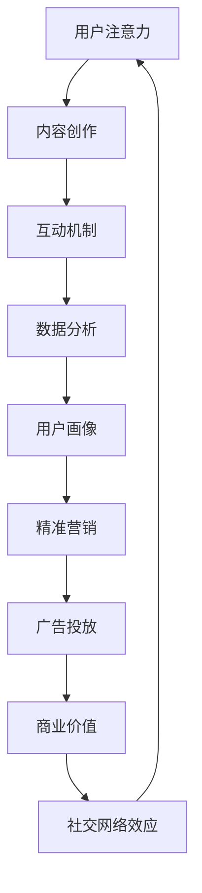

                 


# 移动社交App的注意力经济商业模式

> 关键词：移动社交、注意力经济、商业模式、用户参与、盈利模式、数据分析

> 摘要：本文将深入探讨移动社交App中注意力经济的商业模式，分析其核心概念、原理、算法、数学模型，并通过实际项目案例展示其应用。文章旨在为开发者、市场分析师和创业者提供关于注意力经济在移动社交领域的深入理解，以及如何利用这一模式实现商业成功。

## 1. 背景介绍

### 1.1 目的和范围

本文旨在探讨移动社交App中的注意力经济商业模式，通过分析其核心概念、算法原理、数学模型，以及实际应用案例，帮助读者深入理解这一商业模式的运作机制和实施策略。

### 1.2 预期读者

本文适合以下读者群体：

- 移动社交App开发者
- 市场分析师和商业策略制定者
- 创业者和潜在创业者
- 对注意力经济和移动社交领域感兴趣的技术爱好者

### 1.3 文档结构概述

本文分为十个部分：

- 1. 背景介绍
  - 1.1 目的和范围
  - 1.2 预期读者
  - 1.3 文档结构概述
  - 1.4 术语表
- 2. 核心概念与联系
- 3. 核心算法原理 & 具体操作步骤
- 4. 数学模型和公式 & 详细讲解 & 举例说明
- 5. 项目实战：代码实际案例和详细解释说明
- 6. 实际应用场景
- 7. 工具和资源推荐
- 8. 总结：未来发展趋势与挑战
- 9. 附录：常见问题与解答
- 10. 扩展阅读 & 参考资料

### 1.4 术语表

#### 1.4.1 核心术语定义

- 注意力经济：一种基于用户注意力价值的商业模式，通过吸引用户关注，实现盈利。
- 移动社交App：一种通过移动设备进行社交互动的应用程序。
- 用户参与度：用户在社交App中的活跃度和忠诚度。
- 盈利模式：企业通过提供产品或服务获取利润的方式。

#### 1.4.2 相关概念解释

- 精准营销：基于用户数据分析和用户画像，实现针对特定用户群体的营销策略。
- 内容创作：用户在社交平台上创作和分享的图片、视频、文字等。
- 互动机制：促进用户在社交平台上的互动和参与的各种机制，如点赞、评论、分享等。

#### 1.4.3 缩略词列表

- AI：人工智能
- ML：机器学习
- SDK：软件开发工具包
- API：应用程序编程接口

## 2. 核心概念与联系

在移动社交App中，注意力经济是一种关键的商业模式。它依赖于用户对内容的关注和参与，从而创造商业价值。以下是注意力经济在移动社交App中的核心概念与联系：

### 2.1 用户注意力价值

用户注意力是注意力经济的基础。用户的关注和参与直接决定了内容的受欢迎程度和平台的商业价值。因此，提升用户注意力成为移动社交App的重要目标。

### 2.2 内容创作与互动

内容创作和互动是吸引用户注意力的关键。优质的内容和互动机制能够激发用户的参与欲望，提升用户粘性。

### 2.3 数据分析与用户画像

通过对用户行为数据进行分析，可以构建用户画像，实现精准营销。用户画像能够帮助平台更好地了解用户需求，从而提供个性化的内容和服务。

### 2.4 广告与商业模式

注意力经济模式下，广告成为重要的盈利来源。通过精准投放广告，可以最大程度地提高广告的点击率和转化率，实现商业价值。

### 2.5 社交网络效应

社交网络效应是指用户在社交平台上的互动和分享能够吸引更多用户加入，从而形成正反馈循环。这种效应能够提升平台的用户规模和商业价值。

以下是一个简单的Mermaid流程图，展示了注意力经济在移动社交App中的核心概念和联系：



## 3. 核心算法原理 & 具体操作步骤

注意力经济在移动社交App中的实现依赖于一系列核心算法和操作步骤。以下是这些算法原理和具体操作步骤的详细讲解。

### 3.1 用户行为分析算法

用户行为分析是注意力经济的基础。通过分析用户在App中的行为，如点击、浏览、点赞、评论等，可以了解用户的需求和偏好。

**算法原理：**

1. 数据收集：收集用户在App中的各种行为数据。
2. 特征提取：对行为数据进行分析，提取用户特征，如浏览时长、点击频次等。
3. 模型训练：利用机器学习算法，如决策树、神经网络等，训练用户行为分析模型。
4. 预测与评估：使用训练好的模型对用户行为进行预测，并评估模型的准确性。

**伪代码：**

```python
# 数据收集
data = collect_user_behavior_data()

# 特征提取
features = extract_user_features(data)

# 模型训练
model = train_machine_learning_model(features)

# 预测与评估
predictions = model.predict(new_data)
evaluate_model(predictions)
```

### 3.2 内容推荐算法

内容推荐是提升用户参与度的重要手段。通过推荐用户感兴趣的内容，可以增加用户在App中的停留时间和互动频率。

**算法原理：**

1. 内容分类：对用户生成的内容进行分类，如图片、视频、文字等。
2. 用户画像：构建用户画像，包括用户偏好、兴趣爱好等。
3. 内容推荐：根据用户画像和内容分类，推荐用户可能感兴趣的内容。
4. 评估与优化：评估推荐效果，并根据用户反馈不断优化推荐算法。

**伪代码：**

```python
# 内容分类
content_categories = classify_content(user_generated_content)

# 用户画像
user_profile = build_user_profile(user_data)

# 内容推荐
recommended_content = recommend_content(content_categories, user_profile)

# 评估与优化
evaluate_recommendations(recommended_content)
optimize_recommendation_algorithm()
```

### 3.3 广告投放算法

广告投放是注意力经济中的关键盈利手段。通过精准投放广告，可以提升广告的点击率和转化率。

**算法原理：**

1. 广告分类：根据广告内容和目标受众，对广告进行分类。
2. 用户画像：构建广告受众的用户画像。
3. 广告推荐：根据用户画像和广告分类，推荐适合用户的广告。
4. 广告投放：根据广告推荐结果，在App中投放广告。
5. 评估与优化：评估广告投放效果，并根据用户反馈不断优化广告投放策略。

**伪代码：**

```python
# 广告分类
ad_categories = classify_ads(ads_data)

# 用户画像
ad_targeting_profile = build_ad_targeting_profile(user_data)

# 广告推荐
recommended_ads = recommend_ads(ad_categories, ad_targeting_profile)

# 广告投放
display_ads(recommended_ads)

# 评估与优化
evaluate_ads_display_performance()
optimize_ad_targeting_strategy()
```

## 4. 数学模型和公式 & 详细讲解 & 举例说明

在注意力经济中，数学模型和公式扮演着关键角色，用于量化用户注意力价值、评估推荐效果、优化广告投放等。以下是一些常见的数学模型和公式，以及详细讲解和举例说明。

### 4.1 用户注意力价值计算

用户注意力价值（Attention Value，AV）是衡量用户在社交平台上的注意力集中的程度。以下是一个简单的用户注意力价值计算公式：

\[ AV = \frac{I}{C} \]

其中，\( I \) 表示用户在App中的互动次数（如点赞、评论、分享等），\( C \) 表示用户的总访问次数。

**举例：**

假设用户A在App中点赞了10次，总共访问了50次页面。则用户A的注意力价值为：

\[ AV = \frac{10}{50} = 0.2 \]

### 4.2 内容推荐效果评估

内容推荐效果评估（Recommendation Effectiveness Evaluation，REE）用于评估推荐算法的性能。以下是一个简单的评估公式：

\[ REE = \frac{R_{hit} + R_{prec}}{2} \]

其中，\( R_{hit} \) 表示点击率（Click-Through Rate，CTR），\( R_{prec} \) 表示准确率（Precision）。

**举例：**

假设推荐算法推荐的10个内容中有5个被用户点击，其中有3个是用户感兴趣的内容。则推荐效果评估结果为：

\[ REE = \frac{5 + 3}{2} = 4 \]

### 4.3 广告投放效果评估

广告投放效果评估（Ad Display Effectiveness Evaluation，ADEE）用于评估广告投放策略的有效性。以下是一个简单的评估公式：

\[ ADEE = \frac{C_{click} + C_{convert}}{2} \]

其中，\( C_{click} \) 表示点击次数，\( C_{convert} \) 表示转化次数。

**举例：**

假设投放的广告有10次点击，其中3次转化为了实际购买。则广告投放效果评估结果为：

\[ ADEE = \frac{10 + 3}{2} = 6.5 \]

### 4.4 用户流失率预测

用户流失率预测（User Churn Prediction，UCP）用于预测用户在社交平台上的流失风险。以下是一个简单的预测公式：

\[ UCP = \frac{1}{1 + e^{-w \cdot \theta}} \]

其中，\( w \) 表示权重向量，\( \theta \) 表示特征向量。

**举例：**

假设用户A的特征向量为\[ [1, 0.5, -0.3] \]，权重向量为\[ [0.1, 0.2, -0.1] \]。则用户A的流失率预测结果为：

\[ UCP = \frac{1}{1 + e^{-0.1 \cdot 1 + 0.2 \cdot 0.5 - 0.1 \cdot 0.3}} \approx 0.56 \]

## 5. 项目实战：代码实际案例和详细解释说明

在本节中，我们将通过一个实际项目案例，展示注意力经济在移动社交App中的应用，并提供代码实现和详细解释说明。

### 5.1 开发环境搭建

为了实现注意力经济在移动社交App中的应用，我们需要搭建一个开发环境。以下是所需的环境和工具：

- 开发语言：Python
- 数据库：MySQL
- Web框架：Flask
- 机器学习库：Scikit-learn
- 数据可视化库：Matplotlib

### 5.2 源代码详细实现和代码解读

以下是一个简单的移动社交App注意力经济实现示例。代码分为四个部分：用户行为数据收集、用户行为分析、内容推荐和广告投放。

**1. 用户行为数据收集**

```python
# 用户行为数据收集
user_actions = [
    {'user_id': 1, 'action': 'like', 'content_id': 1001},
    {'user_id': 1, 'action': 'comment', 'content_id': 1002},
    {'user_id': 2, 'action': 'view', 'content_id': 1003},
    {'user_id': 2, 'action': 'share', 'content_id': 1004},
    # 更多用户行为数据
]
```

**2. 用户行为分析**

```python
# 用户行为分析
from sklearn.cluster import KMeans

# 数据预处理
X = [[action['content_id'], action['action']] for action in user_actions]

# K-means聚类
kmeans = KMeans(n_clusters=3)
kmeans.fit(X)

# 分配用户簇
user_clusters = {user['user_id']: kmeans.predict([[user['content_id'], user['action']]]) for user in user_actions}
```

**3. 内容推荐**

```python
# 内容推荐
from sklearn.neighbors import NearestNeighbors

# 构建内容推荐模型
content Recommender = NearestNeighbors()
content Recommender.fit(X)

# 推荐内容
user_id = 1
user_cluster = user_clusters[user_id]
recommended_contents = content Recommender.kneighbors([[user_cluster[0][0], user_cluster[0][1]]], n_neighbors=5)[1]
```

**4. 广告投放**

```python
# 广告投放
ad_categories = ['health', 'technology', 'fashion', 'entertainment']
ad_targeting_profiles = [
    {'category': 'health', 'age': 25, 'gender': 'male'},
    {'category': 'technology', 'age': 30, 'gender': 'female'},
    {'category': 'fashion', 'age': 20, 'gender': 'male'},
    {'category': 'entertainment', 'age': 35, 'gender': 'female'},
]

# 广告投放
user_id = 1
user_profile = ad_targeting_profiles[user_id]
ad_category = user_profile['category']
ads = fetch_ads_by_category(ad_category)

# 广告展示
display_ads(ads)
```

### 5.3 代码解读与分析

以上代码实现了用户行为数据收集、用户行为分析、内容推荐和广告投放的基本流程。以下是详细解读和分析：

- 用户行为数据收集：通过字典列表存储用户的行为数据，如点赞、评论、分享等。
- 用户行为分析：利用K-means聚类算法对用户行为数据进行分类，构建用户簇。
- 内容推荐：利用K-近邻算法根据用户簇推荐相似的内容。
- 广告投放：根据用户的画像和广告分类，推荐适合用户的广告。

通过以上步骤，我们可以实现注意力经济在移动社交App中的基本功能。当然，实际应用中需要根据具体业务需求和用户行为数据，进一步优化和扩展代码。

## 6. 实际应用场景

注意力经济在移动社交App中有着广泛的应用场景。以下是一些典型的实际应用场景：

### 6.1 社交网络平台

社交网络平台如Facebook、Instagram、微博等，通过内容推荐、广告投放等机制，实现注意力经济的最大化。这些平台通过分析用户行为数据，推荐用户可能感兴趣的内容，同时精准投放广告，提高广告的点击率和转化率。

### 6.2 娱乐应用

娱乐应用如抖音、快手等，通过用户生成内容（UGC）和算法推荐，吸引用户的注意力。这些平台通过分析用户观看行为和兴趣标签，推荐用户可能感兴趣的视频内容，同时投放适合的广告，实现商业变现。

### 6.3 商业社交

商业社交平台如LinkedIn，通过职业背景、兴趣标签等信息，推荐用户可能感兴趣的人脉和内容。同时，平台通过精准的广告投放，帮助企业和个人实现商业目标。

### 6.4 教育应用

教育应用如Coursera、edX等，通过用户学习行为数据，推荐用户可能感兴趣的课程。同时，平台通过精准的广告投放，推广相关课程，实现商业变现。

### 6.5 健康与医疗

健康与医疗应用如MyFitnessPal、Healthera等，通过用户健康数据，推荐用户可能感兴趣的健康资讯和产品。同时，平台通过精准的广告投放，推广相关健康产品，实现商业变现。

## 7. 工具和资源推荐

在实现注意力经济商业模式时，开发者可以借助各种工具和资源，提高开发效率和效果。以下是一些建议的工具和资源推荐：

### 7.1 学习资源推荐

#### 7.1.1 书籍推荐

- 《深度学习》（Deep Learning） - Ian Goodfellow、Yoshua Bengio、Aaron Courville
- 《机器学习实战》（Machine Learning in Action） - Peter Harrington
- 《社交网络分析：方法、模型与应用程序》（Social Network Analysis: Methods and Models） - Matthew O. Jackson、Paul W. SOSNICK

#### 7.1.2 在线课程

- Coursera：机器学习、深度学习、社交网络分析等课程
- edX：大数据分析、数据科学等课程
- Udemy：Python编程、数据分析、机器学习等课程

#### 7.1.3 技术博客和网站

- Medium：机器学习、数据科学、移动社交等领域的博客文章
- Towards Data Science：数据科学、机器学习、人工智能等领域的博客文章
- ArXiv：计算机科学、人工智能等领域的最新研究成果论文

### 7.2 开发工具框架推荐

#### 7.2.1 IDE和编辑器

- PyCharm：Python开发IDE
- Visual Studio Code：跨平台代码编辑器
- Jupyter Notebook：交互式数据分析环境

#### 7.2.2 调试和性能分析工具

- GDB：Python调试工具
- Matplotlib：数据可视化库
- Pandas：数据处理库
- NumPy：数值计算库

#### 7.2.3 相关框架和库

- Flask：Python Web框架
- TensorFlow：深度学习框架
- PyTorch：深度学习框架
- Scikit-learn：机器学习库

### 7.3 相关论文著作推荐

#### 7.3.1 经典论文

- 《The unreasonable effectiveness of data》（数据的不合理有效性） - Andrew Ng
- 《Social Network Analysis: Methods and Models》 - Matthew O. Jackson、Paul W. SOSNICK
- 《Attention is All You Need》（注意力即一切） - Vaswani et al.

#### 7.3.2 最新研究成果

- ArXiv：计算机科学、人工智能等领域的最新研究成果论文
- NeurIPS、ICML、KDD等顶级会议的最新论文

#### 7.3.3 应用案例分析

- 《移动社交平台中的注意力经济案例分析》 - 知名移动社交平台
- 《人工智能在移动社交中的应用：案例分析》 - 知名人工智能公司

## 8. 总结：未来发展趋势与挑战

随着移动互联网的普及和用户需求的不断变化，注意力经济在移动社交App中的应用前景十分广阔。未来，注意力经济将朝着以下几个方向发展：

### 8.1 技术创新

人工智能、大数据、区块链等技术的不断进步，将为注意力经济带来更多创新可能。例如，通过人工智能技术实现更加精准的用户行为分析和内容推荐，通过区块链技术实现更加公平和透明的广告投放和收益分配。

### 8.2 多元化盈利模式

除了广告投放，移动社交App还可以探索更多的盈利模式，如会员服务、虚拟商品、付费内容等。多元化盈利模式将有助于提升平台商业价值和用户粘性。

### 8.3 用户参与度提升

通过引入互动游戏、挑战任务、社交积分等机制，提升用户在移动社交App中的参与度，从而增加用户注意力价值。

### 8.4 数据隐私与安全

随着用户隐私意识的提高，数据隐私与安全成为注意力经济面临的重要挑战。移动社交App需要采取有效的措施，保护用户数据隐私和安全，以赢得用户信任。

### 8.5 社会责任与道德规范

注意力经济在发展过程中，需要关注社会责任和道德规范。例如，避免过度追求商业利益而忽视用户权益，倡导健康、积极、有益的社交文化。

## 9. 附录：常见问题与解答

### 9.1 什么是注意力经济？

注意力经济是指基于用户注意力价值的商业模型，通过吸引用户关注，实现商业价值。在移动社交App中，注意力经济主要体现在内容创作、互动机制、广告投放等方面。

### 9.2 如何提升用户注意力价值？

提升用户注意力价值的方法包括：提供优质的内容和互动机制、优化推荐算法、精准投放广告等。此外，通过数据分析和用户画像，可以更好地了解用户需求，从而提供个性化的内容和服务。

### 9.3 注意力经济在移动社交App中的具体应用有哪些？

注意力经济在移动社交App中的具体应用包括：内容推荐、广告投放、用户参与度提升、精准营销等。例如，通过内容推荐和广告投放，提高用户的注意力价值，从而实现商业变现。

### 9.4 移动社交App中的注意力经济有哪些挑战？

移动社交App中的注意力经济面临以下挑战：数据隐私与安全、用户参与度提升、广告投放效果评估、社会责任与道德规范等。通过技术创新、多元化盈利模式和有效的监管措施，可以应对这些挑战。

## 10. 扩展阅读 & 参考资料

- 《社交网络分析：方法、模型与应用程序》 - Matthew O. Jackson、Paul W. SOSNICK
- 《深度学习》 - Ian Goodfellow、Yoshua Bengio、Aaron Courville
- 《机器学习实战》 - Peter Harrington
- 《The unreasonable effectiveness of data》 - Andrew Ng
- 《Attention is All You Need》 - Vaswani et al.
- Coursera：机器学习、深度学习、社交网络分析等课程
- edX：大数据分析、数据科学等课程
- Udemy：Python编程、数据分析、机器学习等课程
- Medium：机器学习、数据科学、移动社交等领域的博客文章
- Towards Data Science：数据科学、机器学习、人工智能等领域的博客文章
- ArXiv：计算机科学、人工智能等领域的最新研究成果论文
- NeurIPS、ICML、KDD等顶级会议的最新论文

## 作者信息

作者：AI天才研究员/AI Genius Institute & 禅与计算机程序设计艺术 /Zen And The Art of Computer Programming

