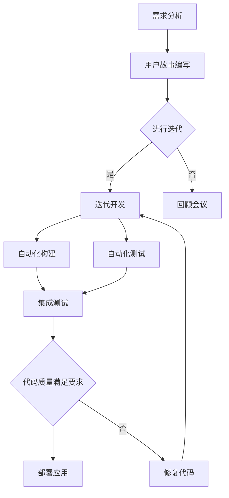

                 

# 程序员创业公司的敏捷开发与持续集成实践

> **关键词：** 敏捷开发、持续集成、程序员创业公司、DevOps、Scrum、Kubernetes、容器化、自动化测试、质量保障

> **摘要：** 本文旨在探讨敏捷开发与持续集成（CI）在程序员创业公司中的应用与实践。我们将深入分析敏捷开发的原则与实践方法，介绍持续集成的概念和重要性，并提供一套完整的实施指南。文章将结合实际案例，展示如何通过敏捷开发和持续集成来提升创业公司的软件开发效率和质量。

## 1. 背景介绍

### 1.1 目的和范围

本文的目标是帮助程序员创业公司理解敏捷开发与持续集成（CI）的核心理念，并提供一套实际可行的实施方法。我们将探讨以下内容：

1. **敏捷开发的基本原则和实践方法。**
2. **持续集成的概念、重要性及其与敏捷开发的结合。**
3. **敏捷开发与持续集成在实际项目中的应用案例。**
4. **创业公司在实施敏捷开发和持续集成时可能面临的挑战及解决方案。**

### 1.2 预期读者

本文适用于以下读者：

1. **程序员创业公司创始人及团队领导。**
2. **软件开发工程师和测试工程师。**
3. **对敏捷开发和持续集成感兴趣的IT专业人士。**

### 1.3 文档结构概述

本文的结构如下：

1. **第1章：背景介绍。**
2. **第2章：核心概念与联系。**
   - **2.1 核心概念与原理。**
   - **2.2 Mermaid流程图展示。**
3. **第3章：核心算法原理 & 具体操作步骤。**
4. **第4章：数学模型和公式 & 详细讲解 & 举例说明。**
5. **第5章：项目实战：代码实际案例和详细解释说明。**
   - **5.1 开发环境搭建。**
   - **5.2 源代码详细实现和代码解读。**
   - **5.3 代码解读与分析。**
6. **第6章：实际应用场景。**
7. **第7章：工具和资源推荐。**
8. **第8章：总结：未来发展趋势与挑战。**
9. **第9章：附录：常见问题与解答。**
10. **第10章：扩展阅读 & 参考资料。**

### 1.4 术语表

#### 1.4.1 核心术语定义

- **敏捷开发（Agile Development）：** 一种软件开发的方法论，强调灵活应对需求变化，通过短周期迭代来快速交付高质量的软件产品。
- **持续集成（Continuous Integration，CI）：** 一种软件开发实践，通过自动化构建和测试，确保代码集成后的质量和稳定性。
- **Scrum：** 一种敏捷开发框架，强调通过短周期的迭代（Sprint）来交付可用的软件。
- **DevOps：** 一种结合软件开发（Dev）和IT运维（Ops）的方法论，旨在通过协作和自动化提高软件交付的效率和质量。
- **Kubernetes：** 一个开源的容器编排平台，用于自动化容器的部署、扩展和管理。
- **容器化（Containerization）：** 一种轻量级虚拟化技术，通过容器（Container）来封装应用程序及其依赖项，实现应用程序的隔离和可移植性。
- **自动化测试（Automated Testing）：** 通过编写脚本和工具，自动化执行测试用例，以检测代码的质量和功能正确性。

#### 1.4.2 相关概念解释

- **敏捷开发与持续集成的结合：** 敏捷开发强调快速交付和灵活应对需求变化，而持续集成则通过自动化构建和测试确保代码的稳定性和质量。两者的结合可以显著提高软件开发和交付的效率和质量。
- **敏捷开发实践方法：** 包括用户故事（User Story）、迭代（Iteration）、站立会议（Stand-up Meeting）、回顾会议（Retrospective Meeting）等。
- **持续集成实践方法：** 包括自动化构建（Automated Build）、自动化测试（Automated Testing）、部署脚本（Deployment Script）等。

#### 1.4.3 缩略词列表

- **CI：** 持续集成（Continuous Integration）
- **CD：** 持续交付（Continuous Delivery）
- **K8s：** Kubernetes
- **SaaS：** 软件即服务（Software as a Service）
- **IaaS：** 基础设施即服务（Infrastructure as a Service）
- **PaaS：** 平台即服务（Platform as a Service）

## 2. 核心概念与联系

### 2.1 核心概念与原理

在深入探讨敏捷开发和持续集成之前，我们需要了解它们的核心概念和原理。

#### 2.1.1 敏捷开发

敏捷开发是一种软件开发方法，旨在通过快速迭代和持续反馈来交付高质量的软件。它强调以下原则：

1. **个体和互动重于过程和工具。**
2. **可工作的软件重于详尽的文档。**
3. **客户合作重于合同谈判。**
4. **响应变化重于遵循计划。**

敏捷开发的核心原则是“尽早并持续交付有价值的软件给客户”，并通过以下实践方法来实现：

1. **用户故事（User Story）：** 一种描述用户需求的简短故事。
2. **迭代（Iteration）：** 短周期（通常为2-4周）的软件开发周期。
3. **站立会议（Stand-up Meeting）：** 团队成员每日召开的简短会议，讨论进展、问题和计划。
4. **回顾会议（Retrospective Meeting）：** 在每个迭代结束时召开的会议，用于评估团队流程并做出改进。

#### 2.1.2 持续集成

持续集成是一种软件开发实践，通过自动化构建和测试来确保代码的稳定性和质量。它的核心原则是：

1. **频繁集成。** 频繁地将代码集成到主分支，以避免冲突和集成风险。
2. **自动化测试。** 通过自动化测试确保每次集成后的代码质量。
3. **快速反馈。** 通过自动化构建和测试，快速发现和修复代码问题。

持续集成的核心组成部分包括：

1. **自动化构建（Automated Build）：** 使用构建工具（如Maven、Gradle）自动构建代码。
2. **自动化测试（Automated Testing）：** 编写测试脚本，自动化执行测试用例。
3. **部署脚本（Deployment Script）：** 自动部署和配置应用程序。

### 2.2 Mermaid流程图展示

下面是敏捷开发与持续集成的主要流程的Mermaid流程图展示：



### 2.3 核心算法原理 & 具体操作步骤

接下来，我们将深入探讨敏捷开发和持续集成中的核心算法原理和具体操作步骤。

#### 2.3.1 敏捷开发的核心算法原理

敏捷开发的核心算法原理包括：

1. **迭代优化（Iterative Optimization）：** 通过反复迭代和不断改进，逐步优化软件。
2. **增量开发（Incremental Development）：** 将大型项目分解为可管理的增量，逐步实现和交付。
3. **风险评估（Risk Assessment）：** 在每个迭代开始前进行风险评估，以确保项目按计划进行。

具体操作步骤如下：

1. **需求分析：** 与客户和利益相关者讨论，明确软件需求和目标。
2. **用户故事编写：** 将需求分解为用户故事，并确定每个用户故事的优先级。
3. **迭代计划：** 根据用户故事优先级，确定每个迭代的目标和任务。
4. **迭代开发：** 在每个迭代周期内，按照计划开发并交付可工作的软件。
5. **自动化测试：** 在每个迭代周期内，编写和执行自动化测试用例，以确保代码质量。
6. **回顾会议：** 在每个迭代结束时，评估团队流程和项目进展，并制定改进计划。

#### 2.3.2 持续集成的核心算法原理

持续集成（CI）的核心算法原理包括：

1. **自动化构建（Automated Build）：** 使用构建工具（如Maven、Gradle）自动编译和打包代码。
2. **自动化测试（Automated Testing）：** 编写测试脚本，自动化执行测试用例。
3. **快速反馈（Fast Feedback）：** 通过自动化构建和测试，快速发现和修复代码问题。

具体操作步骤如下：

1. **代码仓库管理：** 使用版本控制系统（如Git）管理代码仓库。
2. **自动化构建：** 使用构建工具（如Maven、Gradle）配置自动化构建脚本，确保每次提交的代码都可以成功编译和打包。
3. **自动化测试：** 编写测试脚本，自动化执行测试用例，确保每次集成后的代码质量。
4. **部署脚本：** 配置自动化部署脚本，确保成功集成的代码可以自动部署到生产环境。
5. **持续交付：** 在自动化测试和部署完成后，将应用程序交付给用户。

### 2.4 数学模型和公式 & 详细讲解 & 举例说明

在敏捷开发和持续集成中，数学模型和公式可以用于评估项目进度、代码质量和风险。

#### 2.4.1 项目进度评估

可以使用以下数学模型来评估项目进度：

$$
\text{进度} = \frac{\text{已完成任务}}{\text{总任务数}} \times 100\%
$$

举例说明：

假设一个项目共有100个任务，已完成60个任务，则项目进度为：

$$
\text{进度} = \frac{60}{100} \times 100\% = 60\%
$$

#### 2.4.2 代码质量评估

可以使用以下数学模型来评估代码质量：

$$
\text{代码质量} = \frac{\text{通过测试的代码行数}}{\text{总代码行数}} \times 100\%
$$

举例说明：

假设一个项目的代码总共有1000行，其中500行通过了测试，则代码质量为：

$$
\text{代码质量} = \frac{500}{1000} \times 100\% = 50\%
$$

#### 2.4.3 风险评估

可以使用以下数学模型来评估项目风险：

$$
\text{风险评分} = \text{风险概率} \times \text{风险影响}
$$

举例说明：

假设一个项目的风险概率为30%，风险影响为5，则风险评分为：

$$
\text{风险评分} = 30\% \times 5 = 1.5
$$

风险评分越高，项目风险越大。

## 3. 项目实战：代码实际案例和详细解释说明

### 3.1 开发环境搭建

在本节中，我们将搭建一个简单的Web应用程序开发环境，用于后续的敏捷开发和持续集成实践。

1. **安装操作系统：** 在本地计算机上安装Linux操作系统（如Ubuntu）。
2. **安装Java开发环境：** 使用以下命令安装Java开发环境：

   ```shell
   sudo apt-get update
   sudo apt-get install openjdk-8-jdk
   ```

3. **安装Maven：** 使用以下命令安装Maven：

   ```shell
   sudo apt-get install maven
   ```

4. **安装Git：** 使用以下命令安装Git：

   ```shell
   sudo apt-get install git
   ```

5. **创建项目文件夹：** 在Linux系统中创建一个项目文件夹，例如`my-webapp`。

6. **初始化Maven项目：** 使用以下命令初始化Maven项目：

   ```shell
   cd my-webapp
   mvn archetype:generate
   ```

7. **配置Maven依赖：** 在`pom.xml`文件中添加必要的Maven依赖，例如Spring Boot和Thymeleaf。

   ```xml
   <dependencies>
       <dependency>
           <groupId>org.springframework.boot</groupId>
           <artifactId>spring-boot-starter-web</artifactId>
       </dependency>
       <dependency>
           <groupId>org.springframework.boot</groupId>
           <artifactId>spring-boot-starter-thymeleaf</artifactId>
       </dependency>
   </dependencies>
   ```

8. **启动应用程序：** 使用以下命令启动应用程序：

   ```shell
   mvn spring-boot:run
   ```

应用程序将启动并在默认的8080端口上提供服务。

### 3.2 源代码详细实现和代码解读

在本节中，我们将详细实现一个简单的Web应用程序，并解释关键代码部分。

1. **创建控制器：** 在`src/main/java/com/example/webapp`目录下创建一个名为`HelloController.java`的类。

   ```java
   package com.example.webapp;

   import org.springframework.stereotype.Controller;
   import org.springframework.web.bind.annotation.GetMapping;
   import org.springframework.web.bind.annotation.RestController;

   @RestController
   public class HelloController {

       @GetMapping("/")
       public String hello() {
           return "Hello, World!";
       }
   }
   ```

   在这个类中，我们定义了一个简单的控制器，用于处理GET请求到根路径（`/`）。该方法返回字符串`"Hello, World!"`作为响应。

2. **创建Thymeleaf模板：** 在`src/main/resources/templates`目录下创建一个名为`hello.html`的Thymeleaf模板。

   ```html
   <!DOCTYPE html>
   <html xmlns:th="http://www.thymeleaf.org">
       <head>
           <title>Hello, World!</title>
       </head>
       <body>
           <h1 th:text="${message}">Hello, World!</h1>
       </body>
   </html>
   ```

   在这个模板中，我们定义了一个简单的HTML页面，其中包含一个标题（`<h1>`元素），其内容来自Thymeleaf变量`message`。

3. **配置Thymeleaf：** 在`src/main/resources/application.properties`文件中配置Thymeleaf。

   ```properties
   spring.thymeleaf.cache=false
   ```

   这个配置禁用了Thymeleaf的缓存功能，以确保每次请求时都使用最新的模板。

4. **运行应用程序：** 使用以下命令运行应用程序：

   ```shell
   mvn spring-boot:run
   ```

应用程序将启动并在默认的8080端口上提供服务。在浏览器中访问`http://localhost:8080/`，将看到以下页面：

```html
<!DOCTYPE html>
<html xmlns:th="http://www.thymeleaf.org">
    <head>
        <title>Hello, World!</title>
    </head>
    <body>
        <h1>Hello, World!</h1>
    </body>
</html>
```

### 3.3 代码解读与分析

在本节中，我们将对关键代码部分进行解读和分析。

1. **控制器（HelloController.java）：**

   ```java
   package com.example.webapp;

   import org.springframework.stereotype.Controller;
   import org.springframework.web.bind.annotation.GetMapping;
   import org.springframework.web.bind.annotation.RestController;

   @RestController
   public class HelloController {

       @GetMapping("/")
       public String hello() {
           return "Hello, World!";
       }
   }
   ```

   这个类是一个Spring Boot控制器，使用`@RestController`注解表示它是一个RESTful Web服务。`hello()`方法是一个处理GET请求的处理器，返回字符串`"Hello, World!"`作为响应。

2. **Thymeleaf模板（hello.html）：**

   ```html
   <!DOCTYPE html>
   <html xmlns:th="http://www.thymeleaf.org">
       <head>
           <title>Hello, World!</title>
       </head>
       <body>
           <h1 th:text="${message}">Hello, World!</h1>
       </body>
   </html>
   ```

   这个模板使用Thymeleaf模板语言（`th:*`属性）来渲染变量`message`的值。在这里，`message`变量的值是`"Hello, World!"`，因此页面上的标题将是`"Hello, World!"`。

3. **应用程序配置（application.properties）：**

   ```properties
   spring.thymeleaf.cache=false
   ```

   这个配置禁用了Thymeleaf的缓存功能，以确保每次请求时都使用最新的模板。这对于敏捷开发和持续集成非常重要，因为频繁的代码更改可能需要确保用户始终看到最新的界面。

通过这个简单的示例，我们展示了如何使用Spring Boot和Thymeleaf创建一个基本的Web应用程序，并通过Maven进行构建和部署。在后续的章节中，我们将进一步介绍如何将敏捷开发和持续集成实践应用到这个项目，以提高开发效率和软件质量。

## 4. 实际应用场景

敏捷开发和持续集成（CI）在实际项目中有着广泛的应用，特别是在程序员创业公司中。以下是一些实际应用场景，展示了如何通过敏捷开发和持续集成来提升软件开发效率和质量。

### 4.1 产品迭代与客户反馈

**场景描述：** 一个程序员创业公司正在开发一款面向企业的协作工具。公司采用敏捷开发方法，每个迭代周期为两周，并在每个迭代结束时与客户进行反馈会议。

**解决方案：** 

1. **用户故事编写：** 团队根据客户需求和反馈编写用户故事，并将其分解为可管理的任务。
2. **迭代开发：** 在每个迭代周期内，团队按照优先级执行任务，并确保在每个迭代结束时交付可工作的软件。
3. **持续集成：** 通过持续集成工具（如Jenkins），自动化构建和测试每次提交的代码，确保代码质量和稳定性。
4. **客户反馈：** 在迭代结束时，团队与客户进行反馈会议，收集反馈和建议，并据此调整下一迭代的目标。

**效果：** 这种方法使得团队能够快速响应客户需求，提高软件质量，并确保产品始终符合市场期望。

### 4.2 多功能团队合作

**场景描述：** 一个创业公司由多个功能团队组成，包括前端开发、后端开发、测试和运维。团队之间需要高效协作，以确保项目按时交付。

**解决方案：**

1. **敏捷开发框架：** 采用Scrum框架，通过每日站立会议、迭代计划和回顾会议，促进团队协作和透明度。
2. **持续集成：** 通过持续集成工具（如GitLab CI/CD），自动化构建、测试和部署，确保代码质量和环境一致性。
3. **DevOps实践：** 采用DevOps方法，通过自动化基础设施配置和部署脚本，简化运维流程，提高团队协作效率。
4. **沟通与协作工具：** 使用Slack、Trello等沟通与协作工具，确保团队成员之间高效沟通和任务分配。

**效果：** 这种方法促进了多功能团队之间的协作，提高了软件开发和交付的效率，并减少了沟通和协调成本。

### 4.3 快速市场响应

**场景描述：** 一个创业公司需要快速响应市场变化，及时发布新功能以保持竞争力。

**解决方案：**

1. **敏捷开发：** 采用敏捷开发方法，通过短周期迭代（如两周）快速交付新功能。
2. **持续集成：** 使用持续集成工具（如Jenkins）自动化构建、测试和部署，确保每次发布都是高质量和稳定的。
3. **自动化测试：** 编写和执行自动化测试用例，确保每次发布的新功能都经过充分测试。
4. **敏捷发布策略：** 采用蓝绿部署或灰度发布策略，逐步发布新功能，降低风险。

**效果：** 这种方法使得公司能够快速响应市场变化，及时发布新功能，同时确保软件质量和用户体验。

### 4.4 跨地域团队协作

**场景描述：** 一个创业公司由多个跨地域的团队组成，团队之间需要高效协作。

**解决方案：**

1. **敏捷开发：** 采用敏捷开发方法，通过远程站立会议和在线协作工具（如Zoom、Slack），促进团队协作。
2. **持续集成：** 使用持续集成工具（如GitLab CI/CD）在远程环境中自动化构建、测试和部署，确保代码质量和一致性。
3. **代码仓库管理：** 使用分布式版本控制系统（如Git），确保团队成员之间的代码同步和协作。
4. **自动化测试：** 编写和执行自动化测试用例，确保每次提交的代码都经过充分测试。

**效果：** 这种方法促进了跨地域团队之间的协作，提高了软件开发和交付的效率，并减少了地域差异带来的沟通和协作成本。

通过以上实际应用场景，我们可以看到敏捷开发和持续集成在程序员创业公司中的应用效果。这些方法不仅提高了软件开发和交付的效率和质量，还促进了团队协作和客户满意度，为创业公司的成功奠定了基础。

## 5. 工具和资源推荐

在敏捷开发和持续集成（CI）的实践过程中，选择合适的工具和资源对于提高开发效率和软件质量至关重要。以下是一些建议的资源和工具，涵盖了学习材料、开发工具框架以及相关论文著作。

### 5.1 学习资源推荐

#### 5.1.1 书籍推荐

1. **《敏捷开发实践指南》（Agile Project Guide）：** 本书详细介绍了敏捷开发的原则和方法，适合初学者和有经验的开发者。
2. **《持续集成实践指南》（Continuous Integration：Elaborating the Agile Practice Approaches）：** 本书深入探讨了持续集成的核心概念和最佳实践，适用于希望了解CI细节的开发者。
3. **《Scrum：The Art of Doing Twice the Work in Half the Time》：** 本书介绍了Scrum框架，适合需要学习敏捷项目管理方法的团队。

#### 5.1.2 在线课程

1. **Coursera上的《Agile Project Management》：** 由康奈尔大学提供的免费课程，涵盖了敏捷开发的各个方面。
2. **Udemy上的《Agile Project Management and Scrum Master Certification》：** 适合初学者和中级开发者的实践课程。
3. **Pluralsight上的《Continuous Integration with Jenkins》：** 详细介绍了如何使用Jenkins实现持续集成。

#### 5.1.3 技术博客和网站

1. **Martin Fowler的博客（martinfowler.com）：** 提供了大量关于敏捷开发和持续集成的高质量文章和案例研究。
2. **ThoughtWorks的Tech Radar（tech雷达）：** 定期更新关于最新技术趋势和实践的洞察。
3. **DZone（dzone.com）：** 提供了丰富的技术博客和资源，涵盖敏捷开发、持续集成等领域。

### 5.2 开发工具框架推荐

#### 5.2.1 IDE和编辑器

1. **IntelliJ IDEA：** 强大的Java和Android开发IDE，支持多种编程语言和框架。
2. **Visual Studio Code：** 轻量级但功能强大的开源代码编辑器，支持多种语言和开发框架。
3. **Eclipse：** 适用于Java和多种编程语言的开源IDE，适合大型项目开发。

#### 5.2.2 调试和性能分析工具

1. **JProfiler：** 强大的Java应用程序性能分析工具，适用于性能调优和故障排查。
2. **VisualVM：** 开源的工具，用于Java应用程序的监控和分析。
3. **New Relic：** SaaS性能监控工具，提供实时的性能监控和错误跟踪。

#### 5.2.3 相关框架和库

1. **Spring Boot：** 用于创建独立、生产级的Spring应用程序的框架，简化了开发和部署过程。
2. **JUnit：** Java编程语言的单元测试框架，用于编写和执行测试用例。
3. **Mockito：** 用于模拟对象和交互测试的库，帮助编写更简单和可维护的测试。

### 5.3 相关论文著作推荐

#### 5.3.1 经典论文

1. **《The Agile Manifesto》：** 敏捷开发的起源文件，阐述了敏捷开发的核心价值观和实践方法。
2. **《Pattern-Oriented Software Architecture, Volume 1》：** 详细介绍了面向模式软件架构的方法，适用于大型项目的设计和开发。

#### 5.3.2 最新研究成果

1. **《Continuous Integration in the Age of DevOps》：** 探讨了持续集成在DevOps时代的演变和最佳实践。
2. **《DevOps: A Software Architect's Perspective》：** 从软件架构师的角度介绍了DevOps的原则和实践。

#### 5.3.3 应用案例分析

1. **《Netflix的DevOps实践》：** 介绍了Netflix如何在大规模分布式系统中应用DevOps实践，实现快速交付和高效运维。
2. **《亚马逊AWS的敏捷实践》：** 分享了亚马逊AWS如何通过敏捷开发和持续集成来支持大规模云服务的开发和运维。

通过以上推荐的学习资源、开发工具框架和相关论文著作，程序员创业公司可以更好地理解和应用敏捷开发和持续集成的方法，提高软件开发效率和质量。

## 6. 总结：未来发展趋势与挑战

随着技术的不断进步和市场需求的变化，敏捷开发和持续集成（CI）在未来将继续发挥重要作用，但也面临一系列新的挑战。

### 未来发展趋势

1. **DevOps文化的深化：** DevOps作为一种文化和实践，将继续深化，成为软件开发和运维的核心组成部分。团队将更加注重协作、自动化和持续改进。

2. **容器化和微服务架构的普及：** 容器技术（如Docker和Kubernetes）的普及将推动微服务架构的广泛应用。这种架构可以显著提高系统的可伸缩性、可靠性和灵活性。

3. **人工智能和机器学习的集成：** 人工智能和机器学习将在敏捷开发和CI中发挥越来越重要的作用。例如，自动化测试和代码审查可以使用机器学习算法来提高效率和质量。

4. **持续交付和持续部署（CD）：** 持续交付和持续部署将逐渐取代传统的发布流程，使软件更新更加频繁、稳定和安全。

5. **可观测性（Observability）和监控：** 随着系统的复杂度增加，可观测性和监控将成为确保系统稳定运行的关键。通过实时监控和分析，团队能够更快地发现和解决问题。

### 面临的挑战

1. **团队协作与沟通：** DevOps和敏捷开发强调团队协作，但跨职能团队的沟通和协作仍然是一个挑战。如何确保团队成员之间高效沟通和合作，是一个需要持续解决的问题。

2. **技术债务和管理：** 随着迭代和持续集成，技术债务（即因短期解决方案导致的长期问题）可能会积累。如何合理管理和解决技术债务，是团队需要关注的重要问题。

3. **自动化测试和质量保障：** 自动化测试是CI的核心，但编写和维护自动化测试用例本身就是一个挑战。如何确保测试覆盖全面且持续更新，是一个需要解决的问题。

4. **安全性和合规性：** 在快速交付软件的同时，确保软件的安全性、合规性，特别是在金融、医疗等行业中，是一个重要且复杂的任务。

5. **持续学习和适应：** 技术和市场需求在不断变化，团队需要持续学习和适应新的工具、技术和方法。如何保持团队的学习能力和适应性，是一个长期的挑战。

总之，敏捷开发和持续集成在未来将继续发展，并面临新的机遇和挑战。团队需要不断探索和采用新技术，优化开发流程，提高软件质量和交付效率，以适应不断变化的市场需求。

## 7. 附录：常见问题与解答

### 7.1 敏捷开发常见问题

**Q1：敏捷开发与传统的瀑布开发有何不同？**

A1：敏捷开发与传统的瀑布开发相比，主要区别在于其灵活性和迭代性。瀑布开发是一种线性过程，每个阶段完成后才能进入下一个阶段。而敏捷开发则强调快速迭代和持续交付，通过短周期（如2-4周）的迭代来快速交付可工作的软件，并根据客户反馈进行改进。

**Q2：如何处理敏捷开发中的变更需求？**

A2：敏捷开发鼓励快速响应变更。团队在每个迭代开始时会评估需求和优先级，并根据需求的变化进行调整。通过使用用户故事和迭代计划，团队能够灵活地处理变更，并确保最关键的需求得到满足。

**Q3：敏捷开发是否适用于大型项目？**

A3：是的，敏捷开发同样适用于大型项目。敏捷原则强调了灵活性和适应性，这对于大型项目来说尤为重要，因为大型项目通常面临更复杂的需求和环境变化。通过将大型项目分解为多个可管理的部分，团队能够更好地控制项目进度和质量。

### 7.2 持续集成常见问题

**Q1：什么是持续集成（CI）？**

A1：持续集成是一种软件开发实践，通过自动化构建和测试，确保每次代码提交后都能快速集成并确保代码质量。它减少了集成风险，提高了开发效率。

**Q2：为什么持续集成很重要？**

A2：持续集成通过自动化构建和测试，确保代码的稳定性和质量。它有助于：

1. **快速发现和修复代码问题。**
2. **减少集成风险。**
3. **提高开发效率和质量。**
4. **确保团队成员之间的代码一致性。**

**Q3：持续集成与持续交付（CD）有何区别？**

A3：持续集成（CI）专注于代码的集成和测试，而持续交付（CD）则涵盖了从集成到部署的整个流程。持续交付确保成功集成的代码可以安全、可靠地部署到生产环境。

**Q4：如何设置持续集成流程？**

A4：设置持续集成流程通常包括以下步骤：

1. **选择CI工具（如Jenkins、GitLab CI/CD）。**
2. **配置构建脚本（如Maven、Gradle）。**
3. **编写和配置自动化测试脚本。**
4. **配置部署脚本，确保代码可以自动部署到测试或生产环境。**
5. **定期运行集成流程，确保代码质量和环境一致性。

### 7.3 敏捷开发与持续集成结合的问题

**Q1：如何确保敏捷开发与持续集成的一致性？**

A1：确保敏捷开发与持续集成的一致性，可以通过以下方法：

1. **团队协作：** 确保开发、测试和运维团队紧密协作，共同遵循敏捷原则。
2. **持续反馈：** 通过持续集成流程获取即时反馈，快速识别和解决问题。
3. **自动化测试：** 在持续集成中自动化执行测试，确保每次提交的代码都经过充分测试。
4. **持续改进：** 定期回顾和优化开发流程，确保敏捷开发与持续集成的方法持续改进。

**Q2：如何处理敏捷开发中的技术债务？**

A2：处理敏捷开发中的技术债务，可以采取以下策略：

1. **定期评估：** 定期评估技术债务的严重程度和优先级。
2. **逐步解决：** 逐步解决高优先级的技术债务，避免债务积累。
3. **代码审查：** 加强代码审查，确保新代码不会引入技术债务。
4. **重构：** 定期进行代码重构，优化现有代码结构和质量。

通过这些策略，团队可以确保敏捷开发过程中的技术债务得到有效管理，从而提高软件质量和开发效率。

## 8. 扩展阅读 & 参考资料

为了深入了解敏捷开发与持续集成（CI）的理论和实践，以下是一些建议的扩展阅读和参考资料：

### 书籍

1. **《敏捷开发实践指南》（Agile Project Guide）**：作者：Michael James，提供了详细的敏捷开发方法和实践案例。
2. **《持续集成实践指南》（Continuous Integration：Elaborating the Agile Practice Approaches）**：作者：Paul Duvall，阐述了CI的核心概念和最佳实践。
3. **《Scrum：The Art of Doing Twice the Work in Half the Time》**：作者：Jeff Sutherland，介绍了Scrum框架及其在实际项目中的应用。

### 在线课程

1. **Coursera上的《Agile Project Management》**：由康奈尔大学提供，涵盖了敏捷开发的各个方面。
2. **Udemy上的《Agile Project Management and Scrum Master Certification》**：适合初学者和中级开发者。
3. **Pluralsight上的《Continuous Integration with Jenkins》**：详细介绍了如何使用Jenkins实现CI。

### 技术博客和网站

1. **Martin Fowler的博客（martinfowler.com）**：提供了大量关于敏捷开发和CI的高质量文章和案例研究。
2. **ThoughtWorks的Tech Radar（tech雷达）**：定期更新关于最新技术趋势和实践的洞察。
3. **DZone（dzone.com）**：提供了丰富的技术博客和资源，涵盖敏捷开发、CI等领域。

### 论文和报告

1. **《The Agile Manifesto》**：敏捷开发的起源文件，阐述了敏捷开发的核心价值观和实践方法。
2. **《Pattern-Oriented Software Architecture, Volume 1》**：详细介绍了面向模式软件架构的方法，适用于大型项目的设计和开发。
3. **《Continuous Integration in the Age of DevOps》**：探讨了CI在DevOps时代的演变和最佳实践。
4. **《DevOps: A Software Architect's Perspective》**：从软件架构师的角度介绍了DevOps的原则和实践。

### 实际案例研究

1. **《Netflix的DevOps实践》**：介绍了Netflix如何在大规模分布式系统中应用DevOps实践，实现快速交付和高效运维。
2. **《亚马逊AWS的敏捷实践》**：分享了亚马逊AWS如何通过敏捷开发和CI来支持大规模云服务的开发和运维。

通过这些扩展阅读和参考资料，读者可以更深入地了解敏捷开发与持续集成（CI）的理论和实践，为实际项目提供指导和借鉴。

