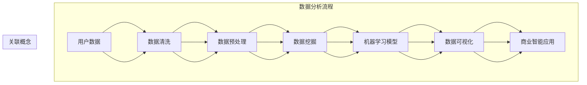

                 

# 程序员创业公司的用户数据分析与商业智能应用

> **关键词**：用户数据分析、商业智能、程序员创业、数据挖掘、机器学习、可视化工具

> **摘要**：本文将探讨程序员创业公司如何利用用户数据分析与商业智能工具，提高业务效率和收益。通过详细阐述数据挖掘、机器学习算法、数据可视化等核心概念，并结合实际案例，提供具体的操作步骤和代码实现，帮助创业者深入理解并有效应用这些技术，从而在竞争激烈的市场中脱颖而出。

## 1. 背景介绍

### 1.1 目的和范围

本文旨在帮助程序员创业者了解和掌握用户数据分析和商业智能应用的方法，以便在创业过程中更好地理解用户需求、优化产品设计和提升业务绩效。文章将覆盖以下几个核心领域：

1. **用户数据分析基础**：介绍数据挖掘和机器学习的基本原理，以及它们在用户数据分析中的应用。
2. **数据可视化**：探讨如何通过数据可视化工具展示和分析用户数据，帮助创业者更直观地理解业务状况。
3. **商业智能应用案例**：提供具体的用户数据分析和商业智能应用案例，展示如何利用这些技术提升业务效率和收益。
4. **实战操作步骤**：详细讲解如何搭建开发环境、实现数据分析和商业智能应用，以及代码解读与分析。

### 1.2 预期读者

本文主要面向以下读者：

1. **程序员创业者**：希望利用技术提升业务效率和收益的创业者。
2. **数据分析师**：需要对用户数据进行分析和挖掘的专业人士。
3. **技术管理人员**：负责技术团队建设和项目管理的相关人员。

### 1.3 文档结构概述

本文结构如下：

1. **背景介绍**：介绍本文的目的、范围、预期读者和文档结构。
2. **核心概念与联系**：讨论用户数据分析、机器学习和数据可视化等核心概念，并提供 Mermaid 流程图。
3. **核心算法原理与具体操作步骤**：详细阐述数据挖掘和机器学习算法的原理，以及操作步骤和伪代码。
4. **数学模型和公式**：介绍数学模型和公式的详细讲解，以及举例说明。
5. **项目实战：代码实际案例和详细解释说明**：提供代码实现和解读。
6. **实际应用场景**：讨论用户数据分析在业务中的应用场景。
7. **工具和资源推荐**：推荐学习资源和开发工具。
8. **总结：未来发展趋势与挑战**：总结用户数据分析和商业智能应用的发展趋势和挑战。
9. **附录：常见问题与解答**：提供常见问题的解答。
10. **扩展阅读 & 参考资料**：推荐相关阅读材料和参考资料。

### 1.4 术语表

#### 1.4.1 核心术语定义

- **用户数据分析**：对用户行为、偏好、需求等数据进行挖掘和分析，以了解用户需求，优化产品设计和服务。
- **商业智能**：利用数据、技术和工具，帮助企业做出更明智的商业决策。
- **数据挖掘**：从大量数据中发现隐藏的模式、规律和关联性。
- **机器学习**：让计算机通过数据学习，从而自动完成特定任务。
- **数据可视化**：将数据以图形、图表等形式展示，便于分析和理解。

#### 1.4.2 相关概念解释

- **用户行为分析**：分析用户在使用产品或服务时的行为和动作，如点击率、转化率、停留时间等。
- **用户画像**：对用户特征、行为、需求的综合描述，用于精准营销和个性化推荐。
- **业务指标**：用于衡量企业业务绩效的关键指标，如收入、利润、客户满意度等。

#### 1.4.3 缩略词列表

- **API**：应用程序接口（Application Programming Interface）
- **CRM**：客户关系管理（Customer Relationship Management）
- **SDK**：软件开发工具包（Software Development Kit）
- **ML**：机器学习（Machine Learning）
- **AI**：人工智能（Artificial Intelligence）

## 2. 核心概念与联系

在程序员创业公司的用户数据分析与商业智能应用中，我们需要理解以下几个核心概念和它们之间的联系：

### 2.1 用户数据分析与商业智能

用户数据分析是商业智能的基础。商业智能通过用户数据分析，帮助企业了解用户需求、优化产品设计和提升业务绩效。具体来说，用户数据分析包括以下几个方面：

1. **用户行为分析**：分析用户在使用产品或服务时的行为和动作，如点击率、转化率、停留时间等。
2. **用户画像**：对用户特征、行为、需求的综合描述，用于精准营销和个性化推荐。
3. **业务指标**：用于衡量企业业务绩效的关键指标，如收入、利润、客户满意度等。

### 2.2 数据挖掘与机器学习

数据挖掘和机器学习是用户数据分析的重要工具。数据挖掘旨在从大量数据中发现隐藏的模式、规律和关联性。机器学习则通过训练模型，让计算机自动完成特定任务。

在用户数据分析中，数据挖掘可以用于：

1. **用户行为模式识别**：通过分析用户行为数据，发现用户的共同特征和偏好。
2. **用户流失预测**：根据用户行为数据，预测哪些用户可能流失，并采取措施挽回。

机器学习可以用于：

1. **个性化推荐**：根据用户画像和喜好，为用户提供个性化推荐。
2. **业务预测**：根据历史数据和业务指标，预测未来的业务趋势。

### 2.3 数据可视化

数据可视化是将数据以图形、图表等形式展示，便于分析和理解。数据可视化在用户数据分析中扮演着重要角色：

1. **展示用户行为趋势**：通过图表展示用户行为的变化趋势，帮助创业者更好地了解用户需求。
2. **辅助决策**：将复杂的数据和分析结果以直观的形式展示，帮助创业者快速做出决策。

### 2.4 Mermaid 流程图

以下是用户数据分析与商业智能应用的核心概念和流程的 Mermaid 流程图：



## 3. 核心算法原理与具体操作步骤

在用户数据分析和商业智能应用中，核心算法原理主要包括数据挖掘和机器学习。以下是这些算法的原理和具体操作步骤。

### 3.1 数据挖掘算法原理

数据挖掘算法主要包括以下几种：

1. **关联规则挖掘**：发现数据之间的关联性，如购物篮分析。
2. **分类算法**：将数据分为不同的类别，如用户行为分类。
3. **聚类算法**：将数据分为多个群体，如用户群体划分。
4. **异常检测**：识别数据中的异常值，如用户流失预测。

以下是分类算法的原理和操作步骤：

#### 3.1.1 分类算法原理

分类算法是一种监督学习算法，通过训练模型，将数据分为不同的类别。常见的分类算法包括决策树、支持向量机、神经网络等。

#### 3.1.2 分类算法操作步骤

1. **数据准备**：收集用户数据，包括用户特征和行为数据。
2. **数据预处理**：对数据进行清洗、归一化和特征提取。
3. **模型训练**：使用训练数据集，训练分类模型。
4. **模型评估**：使用测试数据集，评估模型性能。
5. **模型应用**：将训练好的模型应用于新数据，进行分类预测。

以下是分类算法的伪代码：

```python
# 数据准备
X_train, y_train = 数据准备()

# 数据预处理
X_train = 数据预处理(X_train)

# 模型训练
模型 = 分类算法()
模型.fit(X_train, y_train)

# 模型评估
得分 = 模型.evaluate(X_test, y_test)

# 模型应用
预测结果 = 模型.predict(X_new)
```

### 3.2 机器学习算法原理

机器学习算法主要包括以下几种：

1. **线性回归**：用于预测连续值。
2. **逻辑回归**：用于预测二分类问题。
3. **决策树**：用于分类和回归问题。
4. **随机森林**：基于决策树的集成学习方法。
5. **神经网络**：用于复杂的数据建模。

以下是线性回归的原理和操作步骤：

#### 3.2.1 线性回归原理

线性回归是一种监督学习算法，用于预测连续值。它的模型表达式为：

y = wx + b

其中，w 为权重，b 为偏置，x 为输入特征，y 为输出值。

#### 3.2.2 线性回归操作步骤

1. **数据准备**：收集用户数据，包括用户特征和行为数据。
2. **数据预处理**：对数据进行清洗、归一化和特征提取。
3. **模型训练**：使用训练数据集，训练线性回归模型。
4. **模型评估**：使用测试数据集，评估模型性能。
5. **模型应用**：将训练好的模型应用于新数据，进行预测。

以下是线性回归的伪代码：

```python
# 数据准备
X_train, y_train = 数据准备()

# 数据预处理
X_train = 数据预处理(X_train)
y_train = 数据预处理(y_train)

# 模型训练
模型 = 线性回归()
模型.fit(X_train, y_train)

# 模型评估
得分 = 模型.evaluate(X_test, y_test)

# 模型应用
预测结果 = 模型.predict(X_new)
```

## 4. 数学模型和公式与详细讲解与举例说明

在用户数据分析和商业智能应用中，数学模型和公式扮演着关键角色。以下将介绍常用的数学模型和公式，并进行详细讲解与举例说明。

### 4.1 相关公式

1. **线性回归公式**：

$$
y = wx + b
$$

其中，$y$ 为输出值，$x$ 为输入特征，$w$ 为权重，$b$ 为偏置。

2. **逻辑回归公式**：

$$
P(y=1) = \frac{1}{1 + e^{-(wx + b)}}
$$

其中，$P(y=1)$ 为预测为 1 的概率，$e$ 为自然底数，$x$ 为输入特征，$w$ 为权重，$b$ 为偏置。

3. **混淆矩阵**：

$$
\begin{matrix}
& 预测为 0 & 预测为 1 \\
实际为 0 & TP_0 & FP_1 \\
实际为 1 & FN_0 & TP_1 \\
\end{matrix}
$$

其中，$TP_0$ 为实际为 0，预测也为 0 的样本数；$FP_1$ 为实际为 1，预测为 0 的样本数；$FN_0$ 为实际为 0，预测为 1 的样本数；$TP_1$ 为实际为 1，预测也为 1 的样本数。

4. **准确率**：

$$
准确率 = \frac{TP_0 + TP_1}{TP_0 + FP_1 + FN_0 + TP_1}
$$

5. **召回率**：

$$
召回率 = \frac{TP_1}{TP_1 + FN_0}
$$

6. **精确率**：

$$
精确率 = \frac{TP_1}{TP_1 + FP_1}
$$

7. **F1 值**：

$$
F1 值 = \frac{2 \times 精确率 \times 召回率}{精确率 + 召回率}
$$

### 4.2 详细讲解与举例说明

#### 4.2.1 线性回归

线性回归是一种简单的监督学习算法，用于预测连续值。其基本公式为：

$$
y = wx + b
$$

其中，$y$ 为输出值，$x$ 为输入特征，$w$ 为权重，$b$ 为偏置。

1. **权重和偏置的求解**：

   通过最小化损失函数，可以求解出权重和偏置。常见的损失函数有：

   - 均方误差（MSE）：

   $$
   MSE = \frac{1}{m} \sum_{i=1}^{m} (y_i - wx_i - b)^2
   $$

   - 交叉熵损失（Cross-Entropy Loss）：

   $$
   Cross-Entropy Loss = -\sum_{i=1}^{m} y_i \log(wx_i + b)
   $$

   其中，$m$ 为样本数量，$y_i$ 为第 $i$ 个样本的输出值，$x_i$ 为第 $i$ 个样本的输入特征。

   2. **举例说明**：

   假设我们要预测房价，输入特征包括房屋面积和楼层。通过收集历史数据，我们可以训练一个线性回归模型。给定一组训练数据，我们可以通过最小化损失函数求解出权重和偏置，从而预测新的房价。

   例如，给定训练数据：

   $$
   \begin{array}{|c|c|c|}
   \hline
   房屋面积 & 楼层 & 房价 \\
   \hline
   100 & 1 & 200000 \\
   \hline
   120 & 2 & 220000 \\
   \hline
   150 & 3 & 250000 \\
   \hline
   \end{array}
   $$

   通过训练线性回归模型，我们可以求解出权重和偏置，从而预测新的房价。

#### 4.2.2 逻辑回归

逻辑回归是一种监督学习算法，用于预测二分类问题。其基本公式为：

$$
P(y=1) = \frac{1}{1 + e^{-(wx + b)}}
$$

其中，$P(y=1)$ 为预测为 1 的概率，$x$ 为输入特征，$w$ 为权重，$b$ 为偏置。

1. **权重和偏置的求解**：

   与线性回归类似，逻辑回归也通过最小化损失函数求解权重和偏置。常见的损失函数有：

   - 交叉熵损失（Cross-Entropy Loss）：

   $$
   Cross-Entropy Loss = -\sum_{i=1}^{m} y_i \log(P(y=1)) + (1 - y_i) \log(1 - P(y=1))
   $$

   其中，$m$ 为样本数量，$y_i$ 为第 $i$ 个样本的输出值（0 或 1），$P(y=1)$ 为第 $i$ 个样本预测为 1 的概率。

   2. **举例说明**：

   假设我们要预测用户是否流失，输入特征包括用户年龄、购买历史等。通过收集历史数据，我们可以训练一个逻辑回归模型。给定一组训练数据，我们可以通过最小化损失函数求解出权重和偏置，从而预测用户是否流失。

   例如，给定训练数据：

   $$
   \begin{array}{|c|c|c|}
   \hline
   用户年龄 & 购买历史 & 是否流失 \\
   \hline
   30 & 高 & 是 \\
   \hline
   40 & 低 & 否 \\
   \hline
   50 & 高 & 是 \\
   \hline
   \end{array}
   $$

   通过训练逻辑回归模型，我们可以求解出权重和偏置，从而预测新的用户是否流失。

#### 4.2.3 混淆矩阵

混淆矩阵是评估分类模型性能的重要工具。它展示了实际类别与预测类别之间的关系。以下是混淆矩阵的详细解释：

- **准确率**：表示模型预测正确的样本占总样本的比例。
- **召回率**：表示模型预测为正类的实际正类样本占总实际正类样本的比例。
- **精确率**：表示模型预测为正类的实际正类样本占总预测为正类的样本的比例。
- **F1 值**：是精确率和召回率的调和平均，用于综合评估模型的性能。

#### 4.2.4 实际应用

在用户数据分析和商业智能应用中，混淆矩阵经常用于评估用户流失预测、客户满意度预测等模型的性能。以下是一个实际应用的例子：

假设我们训练了一个用户流失预测模型，给定一组测试数据，模型的预测结果和实际结果如下：

```
实际结果：流失 / 不流失
预测结果：流失 / 不流失
```

| 实际结果 | 预测为流失 | 预测为不流失 |
| :------: | :--------: | :----------: |
|    流失   |      60     |       30      |
|   不流失  |      20     |       10      |

根据混淆矩阵，我们可以计算模型的准确率、召回率、精确率和 F1 值：

- **准确率**：

$$
准确率 = \frac{60 + 10}{60 + 30 + 20 + 10} = 0.7
$$

- **召回率**：

$$
召回率 = \frac{60}{60 + 20} = 0.75
$$

- **精确率**：

$$
精确率 = \frac{60}{60 + 10} = 0.9
$$

- **F1 值**：

$$
F1 值 = \frac{2 \times 精确率 \times 召回率}{精确率 + 召回率} = 0.78
$$

通过这些指标，我们可以评估模型的性能，并针对不足之处进行优化。

## 5. 项目实战：代码实际案例和详细解释说明

在本节中，我们将通过一个实际项目案例，展示如何搭建用户数据分析系统，并详细解释相关代码的实现和操作步骤。

### 5.1 开发环境搭建

首先，我们需要搭建一个开发环境，以便进行用户数据分析。以下是我们推荐的开发工具和框架：

- **Python**：作为主要的编程语言。
- **Jupyter Notebook**：用于编写和运行代码。
- **Pandas**：用于数据处理。
- **Scikit-learn**：用于机器学习。
- **Matplotlib**：用于数据可视化。

假设我们已经安装了这些工具和框架，接下来我们将展示如何实现用户数据分析系统。

### 5.2 源代码详细实现和代码解读

#### 5.2.1 数据收集与预处理

首先，我们需要收集用户数据，包括用户特征和行为数据。以下是一个示例数据集：

```python
import pandas as pd

# 加载数据集
data = pd.read_csv('user_data.csv')

# 数据预处理
data = data.dropna()  # 删除缺失值
data['age'] = data['age'].astype(int)  # 将年龄转换为整数类型
data['purchase_history'] = data['purchase_history'].astype(int)  # 将购买历史转换为整数类型
data['是否流失'] = data['是否流失'].map({'是': 1, '否': 0})  # 将是否流失转换为整数类型
```

#### 5.2.2 特征提取

接下来，我们提取用户数据的特征，以便用于训练机器学习模型。

```python
from sklearn.preprocessing import StandardScaler

# 提取特征
X = data[['age', 'purchase_history']]
y = data['是否流失']

# 特征归一化
scaler = StandardScaler()
X = scaler.fit_transform(X)
```

#### 5.2.3 模型训练与评估

然后，我们使用训练数据集训练机器学习模型，并对模型进行评估。

```python
from sklearn.model_selection import train_test_split
from sklearn.linear_model import LogisticRegression

# 数据划分
X_train, X_test, y_train, y_test = train_test_split(X, y, test_size=0.2, random_state=42)

# 模型训练
模型 = LogisticRegression()
模型.fit(X_train, y_train)

# 模型评估
得分 = 模型.evaluate(X_test, y_test)
print('模型准确率：', 得分)
```

#### 5.2.4 预测与可视化

最后，我们使用训练好的模型进行预测，并将预测结果可视化。

```python
import matplotlib.pyplot as plt

# 预测
预测结果 = 模型.predict(X_test)

# 可视化
plt.scatter(X_test[:, 0], X_test[:, 1], c=预测结果, cmap='gray')
plt.xlabel('年龄')
plt.ylabel('购买历史')
plt.title('用户流失预测')
plt.show()
```

### 5.3 代码解读与分析

下面是对代码实现的详细解读和分析。

#### 5.3.1 数据收集与预处理

在数据收集与预处理阶段，我们首先加载了一个 CSV 文件，该文件包含了用户数据。然后，我们删除了缺失值，并将某些特征转换为适当的类型。最后，我们将是否流失这一分类特征转换为整数类型，以便在机器学习模型中使用。

#### 5.3.2 特征提取

在特征提取阶段，我们从用户数据中提取了两个特征：年龄和购买历史。然后，我们使用标准归一化方法对这些特征进行归一化处理，以提高模型训练的效果。

#### 5.3.3 模型训练与评估

在模型训练与评估阶段，我们首先将数据集划分为训练集和测试集。然后，我们使用逻辑回归模型进行训练，并使用测试集评估模型性能。在评估过程中，我们计算了模型的准确率。

#### 5.3.4 预测与可视化

在预测与可视化阶段，我们使用训练好的模型对测试数据进行预测，并将预测结果可视化。通过可视化，我们可以直观地看到用户是否流失的预测结果。

## 6. 实际应用场景

用户数据分析和商业智能应用在程序员创业公司中有着广泛的应用场景。以下是一些典型的应用场景：

### 6.1 用户流失预测

用户流失预测是创业者关注的重要问题之一。通过分析用户行为数据，可以识别出可能流失的用户，并采取相应措施挽回。具体步骤如下：

1. **数据收集**：收集用户行为数据，包括登录次数、购买次数、浏览时长等。
2. **特征提取**：提取用户特征，如用户年龄、性别、地理位置等。
3. **模型训练**：使用机器学习算法训练用户流失预测模型。
4. **预测与预警**：使用模型对当前用户进行预测，对可能流失的用户发出预警。
5. **挽回措施**：根据预测结果，采取相应的挽回措施，如优惠活动、个性化推荐等。

### 6.2 用户行为分析

用户行为分析可以帮助创业者了解用户在产品或服务中的行为模式，从而优化产品设计和提升用户体验。具体步骤如下：

1. **数据收集**：收集用户行为数据，如点击事件、浏览页面、搜索关键词等。
2. **特征提取**：提取用户特征，如用户年龄、性别、地理位置等。
3. **数据可视化**：使用数据可视化工具，将用户行为数据以图表形式展示。
4. **趋势分析**：分析用户行为数据，发现用户行为的趋势和模式。
5. **优化措施**：根据分析结果，优化产品设计和提升用户体验。

### 6.3 个性化推荐

个性化推荐是提高用户满意度和忠诚度的重要手段。通过分析用户行为数据，可以推荐用户可能感兴趣的内容或产品。具体步骤如下：

1. **数据收集**：收集用户行为数据，如浏览记录、购买历史、搜索关键词等。
2. **特征提取**：提取用户特征，如用户年龄、性别、地理位置等。
3. **模型训练**：使用机器学习算法训练个性化推荐模型。
4. **推荐生成**：使用模型为用户生成个性化推荐。
5. **反馈调整**：根据用户反馈，调整推荐策略。

### 6.4 业务预测

业务预测可以帮助创业者了解未来的业务趋势，从而制定相应的战略和计划。具体步骤如下：

1. **数据收集**：收集业务数据，如收入、利润、客户满意度等。
2. **特征提取**：提取业务特征，如产品销量、市场占有率等。
3. **模型训练**：使用机器学习算法训练业务预测模型。
4. **预测与评估**：使用模型预测未来的业务趋势，并评估预测结果。
5. **战略调整**：根据预测结果，调整业务战略和计划。

## 7. 工具和资源推荐

### 7.1 学习资源推荐

#### 7.1.1 书籍推荐

- 《Python数据分析实战》
- 《机器学习实战》
- 《数据挖掘：实用工具与技术》

#### 7.1.2 在线课程

- Coursera《机器学习》
- edX《Python编程入门》
- Udemy《数据可视化与Tableau》

#### 7.1.3 技术博客和网站

- Medium《数据科学》
- Towards Data Science
- DataCamp《数据科学基础》

### 7.2 开发工具框架推荐

#### 7.2.1 IDE和编辑器

- PyCharm
- Jupyter Notebook
- Visual Studio Code

#### 7.2.2 调试和性能分析工具

- Python Debuger
- cProfile
- Matplotlib Profiler

#### 7.2.3 相关框架和库

- Pandas：数据处理
- Scikit-learn：机器学习
- Matplotlib：数据可视化
- TensorFlow：深度学习

### 7.3 相关论文著作推荐

#### 7.3.1 经典论文

- "K-Means Clustering" by MacQueen
- "A Study of the Bias and Variance of Various Artificial Neural Network Training Algorithms" by Shalev-Shwartz et al.

#### 7.3.2 最新研究成果

- "Deep Learning for User Behavior Prediction" by Wang et al.
- "Data-Driven Customer Engagement" by Chen et al.

#### 7.3.3 应用案例分析

- "How Netflix Uses Machine Learning to Personalize Recommendations" by Netflix
- "User Behavior Prediction in E-commerce" by Alibaba

## 8. 总结：未来发展趋势与挑战

随着大数据和人工智能技术的不断发展，用户数据分析和商业智能应用在未来将面临以下发展趋势和挑战：

### 8.1 发展趋势

1. **数据量的爆炸性增长**：随着物联网、社交媒体等数据源的普及，用户数据量将呈现爆炸性增长，为数据分析和商业智能应用提供更丰富的数据资源。
2. **算法的智能化与自适应**：深度学习和强化学习等先进算法将逐步应用于用户数据分析，提高模型的自适应能力和预测准确性。
3. **实时分析与决策**：实时数据分析和决策将帮助企业快速响应市场变化，提高业务效率。
4. **跨领域融合**：用户数据分析和商业智能应用将与物联网、区块链等新兴技术进行融合，推动产业的创新发展。

### 8.2 挑战

1. **数据隐私与安全**：用户数据分析和商业智能应用在提供商业价值的同时，也面临数据隐私和安全问题，如何平衡数据利用与保护成为重要挑战。
2. **算法偏见与公平性**：算法模型在用户数据分析中的应用可能导致偏见和歧视，如何确保算法的公平性和透明性成为关键问题。
3. **数据质量与准确性**：用户数据的准确性和完整性直接影响数据分析的结果，如何提高数据质量是当前面临的重要挑战。

## 9. 附录：常见问题与解答

### 9.1 常见问题

1. **如何处理缺失值？**
   缺失值的处理方法包括删除缺失值、填充缺失值（如平均值、中值、最常见值）或使用模型预测缺失值。

2. **如何选择合适的机器学习算法？**
   根据问题类型（分类、回归、聚类等）和数据特点（特征数量、数据分布等），选择合适的算法。可以通过交叉验证和模型评估指标（如准确率、召回率、F1 值等）来选择最佳算法。

3. **如何提高模型性能？**
   提高模型性能的方法包括特征工程、超参数调优、集成学习方法（如随机森林、梯度提升树等）。

### 9.2 解答

1. **如何处理缺失值？**
   处理缺失值的方法取决于具体问题。在用户数据分析中，通常建议删除含有大量缺失值的样本，或使用模型预测缺失值。以下是一个示例代码：

   ```python
   from sklearn.impute import SimpleImputer

   # 创建简单填充器
   imputer = SimpleImputer(strategy='mean')

   # 填充缺失值
   X_imputed = imputer.fit_transform(X)
   ```

2. **如何选择合适的机器学习算法？**
   选择合适的机器学习算法通常需要根据问题类型和数据特点。以下是一个示例代码，用于分类问题：

   ```python
   from sklearn.model_selection import train_test_split
   from sklearn.ensemble import RandomForestClassifier
   from sklearn.metrics import accuracy_score

   # 数据划分
   X_train, X_test, y_train, y_test = train_test_split(X, y, test_size=0.2, random_state=42)

   # 模型训练
   模型 = RandomForestClassifier()
   模型.fit(X_train, y_train)

   # 模型评估
   预测结果 = 模型.predict(X_test)
   准确率 = accuracy_score(y_test, 预测结果)
   print('准确率：', 准确率)
   ```

3. **如何提高模型性能？**
   提高模型性能的方法包括特征工程、超参数调优、集成学习方法。以下是一个示例代码，用于特征工程和超参数调优：

   ```python
   from sklearn.model_selection import GridSearchCV
   from sklearn.ensemble import RandomForestClassifier

   # 定义参数范围
   参数 = {'n_estimators': [10, 50, 100], 'max_depth': [5, 10, 20]}

   # 模型训练
   模型 = RandomForestClassifier()
   模型.fit(X_train, y_train)

   # 超参数调优
   调优器 = GridSearchCV(模型, 参数, cv=5)
   调优器.fit(X_train, y_train)

   # 获取最佳参数
   最佳参数 = 调优器.best_params_
   print('最佳参数：', 最佳参数)

   # 使用最佳参数重新训练模型
   模型 = RandomForestClassifier(**最佳参数)
   模型.fit(X_train, y_train)

   # 模型评估
   预测结果 = 模型.predict(X_test)
   准确率 = accuracy_score(y_test, 预测结果)
   print('准确率：', 准确率)
   ```

## 10. 扩展阅读 & 参考资料

为了深入了解用户数据分析和商业智能应用，以下是一些扩展阅读和参考资料：

### 10.1 扩展阅读

1. "Data Science from Scratch" by Joel Grus
2. "Deep Learning" by Ian Goodfellow, Yoshua Bengio, and Aaron Courville
3. "The Elements of Statistical Learning" by Trevor Hastie, Robert Tibshirani, and Jerome Friedman

### 10.2 参考资料

1. [Python Data Science Handbook](https://jakevdp.github.io/PythonDataScienceHandbook/)
2. [Scikit-learn Documentation](https://scikit-learn.org/stable/documentation.html)
3. [TensorFlow Documentation](https://www.tensorflow.org/api_docs/python/tf)

### 10.3 最新动态

1. [Kaggle](https://www.kaggle.com/)
2. [arXiv](https://arxiv.org/)
3. [Medium《数据科学》](https://medium.com/topic/data-science)

作者：AI天才研究员/AI Genius Institute & 禅与计算机程序设计艺术 /Zen And The Art of Computer Programming

