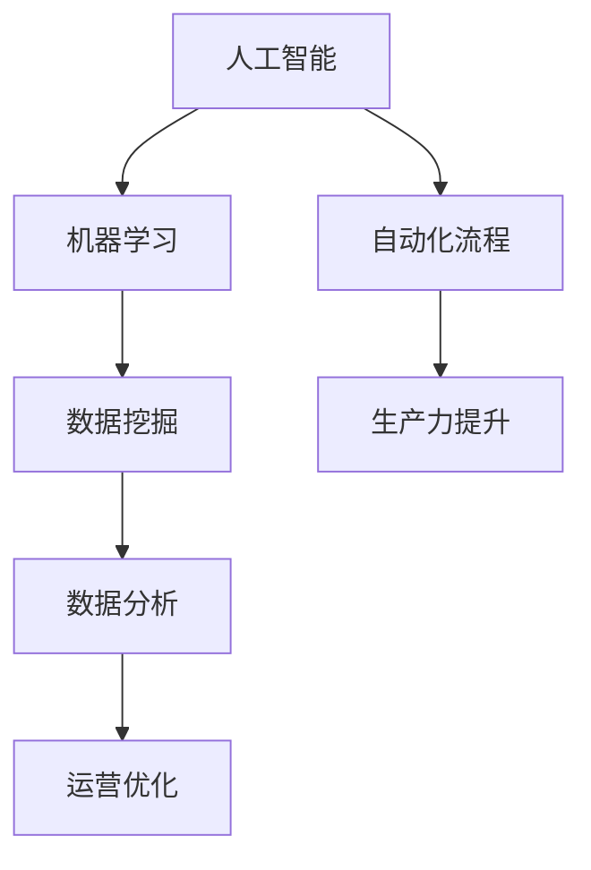

                 

# 程序员创业者如何利用人工智能优化运营

> **关键词**：人工智能、运营优化、程序员创业者、数据分析、自动化流程

> **摘要**：本文将深入探讨程序员创业者如何利用人工智能（AI）技术来优化运营，提高效率和生产力。文章将从背景介绍、核心概念、算法原理、数学模型、项目实战、实际应用场景、工具和资源推荐等多个角度展开，为读者提供全面而实用的指南。

## 1. 背景介绍

### 1.1 目的和范围

本文旨在帮助程序员创业者了解并掌握如何利用人工智能技术来优化公司的运营流程。随着大数据和云计算的快速发展，人工智能已经成为企业提升竞争力的关键因素。特别是在初创企业中，资源有限，更需要通过技术手段来提高效率，降低成本。

### 1.2 预期读者

本文适合以下读者群体：

1. 初创公司程序员创业者
2. 企业IT部门主管和技术经理
3. 数据科学家和机器学习工程师
4. 对人工智能应用感兴趣的从业者

### 1.3 文档结构概述

本文结构如下：

1. 背景介绍
2. 核心概念与联系
3. 核心算法原理 & 具体操作步骤
4. 数学模型和公式 & 详细讲解 & 举例说明
5. 项目实战：代码实际案例和详细解释说明
6. 实际应用场景
7. 工具和资源推荐
8. 总结：未来发展趋势与挑战
9. 附录：常见问题与解答
10. 扩展阅读 & 参考资料

### 1.4 术语表

#### 1.4.1 核心术语定义

- **人工智能**：模拟人类智能行为的计算机系统。
- **运营优化**：通过技术手段提高企业的运营效率，降低成本。
- **创业者**：创立新企业或新项目的人。

#### 1.4.2 相关概念解释

- **机器学习**：使计算机从数据中学习，并做出预测或决策的算法。
- **数据挖掘**：从大量数据中发现有价值的信息或模式。

#### 1.4.3 缩略词列表

- **AI**：人工智能
- **ML**：机器学习
- **DL**：深度学习
- **NLP**：自然语言处理
- **RPA**：机器人流程自动化

## 2. 核心概念与联系

为了更好地理解人工智能如何应用于运营优化，我们需要先了解一些核心概念和它们之间的关系。以下是一个简单的 Mermaid 流程图，展示这些概念之间的关系：



### 2.1 人工智能与机器学习

人工智能（AI）是模拟人类智能行为的计算机系统。其中，机器学习（ML）是实现人工智能的一种主要方法。机器学习通过从数据中学习规律，使得计算机能够做出智能决策。

### 2.2 数据挖掘与数据分析

数据挖掘是从大量数据中发现有价值的信息或模式的过程。数据分析则是使用统计和数学方法来解释这些信息，帮助决策。

### 2.3 运营优化与自动化流程

运营优化旨在提高企业的运营效率，降低成本。自动化流程是通过技术手段实现业务流程的自动化，从而减少人工干预，提高效率。

### 2.4 生产力提升

生产力提升是运营优化的直接结果。通过人工智能技术，企业能够更高效地完成任务，提高整体生产力。

## 3. 核心算法原理 & 具体操作步骤

### 3.1 机器学习算法原理

机器学习算法主要分为监督学习、无监督学习和强化学习。下面以监督学习为例，介绍机器学习算法的基本原理。

#### 3.1.1 监督学习

监督学习是一种从标记数据中学习的机器学习方法。标记数据是指每一条数据都有一个对应的标签，算法通过学习这些标签，预测未知数据的标签。

**伪代码：**

```python
def supervised_learning(training_data, labels):
    # 初始化模型参数
    model_params = initialize_model_params()

    # 训练模型
    for data, label in zip(training_data, labels):
        model_params = update_model_params(model_params, data, label)

    # 预测
    predictions = [predict_label(model_params, data) for data in test_data]

    return predictions
```

### 3.2 数据挖掘算法原理

数据挖掘算法包括关联规则挖掘、聚类、分类等。这里以关联规则挖掘为例，介绍数据挖掘算法的基本原理。

**伪代码：**

```python
def association_rulesMining(data, min_support, min_confidence):
    # 计算每个项的支持度
    support_counts = count_support(data, min_support)

    # 生成频繁项集
    frequent_itemsets = generate_frequent_itemsets(data, support_counts)

    # 生成关联规则
    rules = generate_association_rules(frequent_itemsets, min_confidence)

    return rules
```

### 3.3 自动化流程实现

自动化流程主要通过机器人流程自动化（RPA）技术实现。RPA 使用软件机器人模拟人类操作，自动化执行业务流程。

**伪代码：**

```python
def automate_process(process_steps):
    # 启动软件机器人
    robot = start_robot()

    # 按步骤执行自动化流程
    for step in process_steps:
        robot.execute_action(step)

    # 结束机器人
    stop_robot(robot)
```

## 4. 数学模型和公式 & 详细讲解 & 举例说明

### 4.1 机器学习中的数学模型

机器学习中的数学模型主要包括损失函数、优化算法等。

#### 4.1.1 损失函数

损失函数用于衡量模型预测值与实际值之间的差距。常见损失函数有均方误差（MSE）和交叉熵（Cross Entropy）。

$$
MSE = \frac{1}{n}\sum_{i=1}^{n}(y_i - \hat{y_i})^2
$$

$$
Cross\ Entropy = -\sum_{i=1}^{n}y_i\log(\hat{y_i})
$$

#### 4.1.2 优化算法

优化算法用于更新模型参数，使得损失函数值最小。常见优化算法有梯度下降（Gradient Descent）和随机梯度下降（Stochastic Gradient Descent）。

**伪代码：**

```python
def gradient_descent(model_params, learning_rate, epochs):
    for epoch in range(epochs):
        # 计算损失函数值
        loss = compute_loss(model_params, training_data, labels)

        # 计算梯度
        gradients = compute_gradients(model_params, training_data, labels)

        # 更新模型参数
        model_params = update_model_params(model_params, gradients, learning_rate)

    return model_params
```

### 4.2 数据挖掘中的数学模型

数据挖掘中的数学模型主要包括聚类、分类等。

#### 4.2.1 聚类算法

聚类算法用于将数据分为若干个簇。常见聚类算法有K均值（K-Means）和层次聚类（Hierarchical Clustering）。

**伪代码：**

```python
def k_means(data, k, max_iterations):
    # 初始化聚类中心
    centroids = initialize_centroids(data, k)

    for _ in range(max_iterations):
        # 计算每个数据点的簇分配
        assignments = assign_clusters(data, centroids)

        # 更新聚类中心
        centroids = update_centroids(assignments, data)

    return centroids
```

#### 4.2.2 分类算法

分类算法用于将数据分为不同的类别。常见分类算法有决策树（Decision Tree）和逻辑回归（Logistic Regression）。

**伪代码：**

```python
def logistic_regression(data, labels, learning_rate, epochs):
    # 初始化模型参数
    model_params = initialize_model_params()

    for epoch in range(epochs):
        # 计算损失函数值
        loss = compute_loss(model_params, data, labels)

        # 计算梯度
        gradients = compute_gradients(model_params, data, labels)

        # 更新模型参数
        model_params = update_model_params(model_params, gradients, learning_rate)

    return model_params
```

### 4.3 举例说明

假设我们有一个电商公司，想要利用人工智能优化运营。他们可以通过以下步骤来实现：

1. 收集用户数据，包括购买历史、浏览记录等。
2. 使用机器学习算法分析用户行为，识别潜在客户。
3. 使用数据挖掘算法挖掘用户购买偏好，推荐商品。
4. 使用RPA技术自动化处理订单、发货等流程。

通过这些步骤，电商公司可以更高效地运营，提高客户满意度。

## 5. 项目实战：代码实际案例和详细解释说明

### 5.1 开发环境搭建

为了实现上述项目，我们需要搭建以下开发环境：

1. Python 3.8 或更高版本
2. TensorFlow 2.5 或更高版本
3. Scikit-learn 0.24.1 或更高版本

安装命令如下：

```bash
pip install python==3.8
pip install tensorflow==2.5
pip install scikit-learn==0.24.1
```

### 5.2 源代码详细实现和代码解读

以下是一个简单的用户行为分析项目，用于识别潜在客户。

**代码：**

```python
import pandas as pd
from sklearn.model_selection import train_test_split
from sklearn.preprocessing import StandardScaler
from sklearn.ensemble import RandomForestClassifier
from sklearn.metrics import accuracy_score

# 读取数据
data = pd.read_csv('user_data.csv')

# 数据预处理
X = data.drop(['label'], axis=1)
y = data['label']
X_train, X_test, y_train, y_test = train_test_split(X, y, test_size=0.2, random_state=42)

scaler = StandardScaler()
X_train = scaler.fit_transform(X_train)
X_test = scaler.transform(X_test)

# 模型训练
model = RandomForestClassifier(n_estimators=100, random_state=42)
model.fit(X_train, y_train)

# 模型预测
predictions = model.predict(X_test)

# 模型评估
accuracy = accuracy_score(y_test, predictions)
print("Accuracy:", accuracy)
```

**代码解读：**

1. 导入必要的库。
2. 读取用户数据。
3. 数据预处理，包括划分特征和标签，以及划分训练集和测试集。
4. 使用标准尺度对数据进行归一化处理。
5. 训练随机森林分类器。
6. 使用训练好的模型进行预测。
7. 评估模型准确性。

### 5.3 代码解读与分析

以上代码实现了一个简单的用户行为分析项目，用于识别潜在客户。主要步骤如下：

1. 数据读取：使用 Pandas 库读取用户数据。
2. 数据预处理：将数据集划分为特征和标签，以及划分训练集和测试集。同时，使用标准尺度对数据进行归一化处理，以提高模型的泛化能力。
3. 模型训练：使用随机森林分类器训练模型。随机森林是一种基于决策树的集成学习方法，具有较强的模型解释能力和较高的准确性。
4. 模型预测：使用训练好的模型对测试集进行预测。
5. 模型评估：使用准确性评估模型性能。

通过以上步骤，我们可以识别出潜在客户，从而为企业带来更多的商业价值。

## 6. 实际应用场景

人工智能在运营优化中的应用场景非常广泛。以下是一些实际应用场景：

1. **客户关系管理**：通过分析客户行为，预测客户需求，提供个性化推荐，提高客户满意度。
2. **供应链管理**：优化库存管理，减少库存成本，提高供应链效率。
3. **人力资源管理**：通过数据分析，优化招聘流程，提高招聘效率，降低招聘成本。
4. **市场预测**：通过分析市场数据，预测市场趋势，指导产品研发和市场推广策略。
5. **风险管理**：通过大数据分析和机器学习算法，预测潜在风险，制定相应的风险控制策略。

## 7. 工具和资源推荐

### 7.1 学习资源推荐

#### 7.1.1 书籍推荐

1. 《Python机器学习》（作者：塞巴斯蒂安·拉纳）
2. 《深度学习》（作者：伊恩·古德费洛等）
3. 《数据挖掘：实用工具与技术》（作者：约翰·汉密尔顿等）

#### 7.1.2 在线课程

1. Coursera 上的《机器学习》课程
2. edX 上的《深度学习基础》课程
3. Udacity 上的《机器学习工程师纳米学位》课程

#### 7.1.3 技术博客和网站

1. Medium 上的机器学习博客
2. towardsdatascience.com
3. Analytics Vidhya

### 7.2 开发工具框架推荐

#### 7.2.1 IDE和编辑器

1. PyCharm
2. Visual Studio Code
3. Jupyter Notebook

#### 7.2.2 调试和性能分析工具

1. Python Debugger
2. Profiler
3. TensorBoard

#### 7.2.3 相关框架和库

1. TensorFlow
2. PyTorch
3. Scikit-learn

### 7.3 相关论文著作推荐

#### 7.3.1 经典论文

1. “The Backpropagation Algorithm” by David E. Rumelhart, Geoffrey E. Hinton, and Ronald J. Williams
2. “Learning to Represent Text as a Dense Vector” by Tomas Mikolov, Kai Chen, Greg Corrado, and Jeffrey Dean

#### 7.3.2 最新研究成果

1. “Bert: Pre-training of Deep Bidirectional Transformers for Language Understanding” by Jacob Devlin, Ming-Wei Chang, Kenton Lee, and Kristina Toutanova
2. “Gshard: Scaling Giant Models with Global Shard-Merge Parallelism” by Noam Shazeer, Youlong Cheng, Niki Parmar, Dustin Tran, et al.

#### 7.3.3 应用案例分析

1. “How Airbnb Uses AI to Improve User Experience” by Airbnb Engineering & Data Science
2. “Uber's Machine Learning Approach to Ride Demand Forecasting” by Uber Engineering

## 8. 总结：未来发展趋势与挑战

未来，人工智能在运营优化领域将会有以下发展趋势：

1. **算法优化**：随着算法研究的深入，人工智能将能够更好地解决复杂问题，提高运营效率。
2. **场景扩展**：人工智能将应用于更多的运营场景，如人力资源、供应链等。
3. **模型解释性**：提高模型的解释性，使得创业者能够更好地理解模型的决策过程。

然而，人工智能在运营优化领域也面临着以下挑战：

1. **数据质量**：高质量的数据是人工智能算法有效性的基础。如何获取和处理高质量数据是一个重要挑战。
2. **技术门槛**：虽然人工智能技术已经逐渐成熟，但仍然存在一定的技术门槛。如何降低技术门槛，使得更多人能够应用人工智能是一个挑战。

## 9. 附录：常见问题与解答

### 9.1 人工智能与大数据的关系是什么？

人工智能与大数据密切相关。大数据提供了丰富的数据来源，为人工智能提供了训练数据。而人工智能则能够从这些数据中发现有价值的信息，帮助决策。

### 9.2 如何评估人工智能模型的效果？

评估人工智能模型效果的方法有多种，如准确性、精确度、召回率等。在实际应用中，需要根据具体场景选择合适的评估指标。

### 9.3 人工智能在运营优化中的具体应用有哪些？

人工智能在运营优化中的具体应用包括客户关系管理、供应链管理、人力资源管理、市场预测和风险管理等。

## 10. 扩展阅读 & 参考资料

1. Russell, S., & Norvig, P. (2016). *Artificial Intelligence: A Modern Approach*.
2. Goodfellow, I., Bengio, Y., & Courville, A. (2016). *Deep Learning*.
3. Han, J., Kamber, M., & Pei, J. (2011). *Data Mining: Concepts and Techniques*.
4. LeCun, Y., Bengio, Y., & Hinton, G. (2015). *Deep Learning*.
5. Mikolov, T., Sutskever, I., Chen, K., Corrado, G. S., & Dean, J. (2013). *Distributed Representations of Words and Phrases and Their Compositionality*.
6. Shazeer, N., Cheng, Y., Parmar, N., Tran, D., Le, Q. V., & Dean, J. (2020). *Gshard: Scaling Giant Models with Global Shard-Merge Parallelism*.

