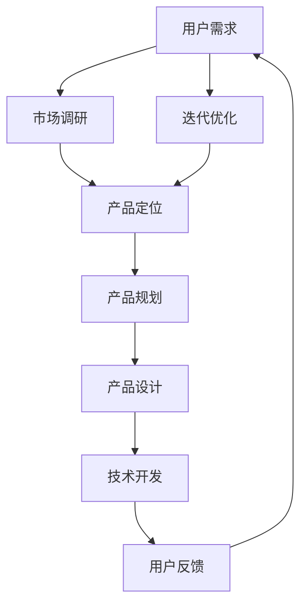

                 

# 程序员创业者的产品思维：从代码到用户价值

> **关键词：**程序员、创业、产品思维、用户价值、软件开发

> **摘要：**本文旨在探讨程序员在创业过程中如何运用产品思维，将技术转化为用户价值，实现从代码到商业成功的跨越。通过深入剖析产品思维的核心概念，结合实际案例，本文将帮助程序员创业者更好地理解市场需求，提升产品竞争力，最终实现商业价值。

## 1. 背景介绍

### 1.1 目的和范围

本文主要针对程序员创业者，探讨如何在创业过程中运用产品思维，将技术转化为用户价值。我们将从以下几个方面进行讨论：

1. 产品思维的核心概念与重要性
2. 从技术到用户价值的转化路径
3. 实际案例分析与经验分享
4. 创业者应具备的产品思维能力
5. 产品思维的实践与工具

### 1.2 预期读者

本文预期读者为：

1. 程序员创业者
2. 对创业感兴趣的技术人员
3. 产品经理、项目经理等相关从业者

### 1.3 文档结构概述

本文共分为十个部分，具体结构如下：

1. 背景介绍
2. 核心概念与联系
3. 核心算法原理 & 具体操作步骤
4. 数学模型和公式 & 详细讲解 & 举例说明
5. 项目实战：代码实际案例和详细解释说明
6. 实际应用场景
7. 工具和资源推荐
8. 总结：未来发展趋势与挑战
9. 附录：常见问题与解答
10. 扩展阅读 & 参考资料

### 1.4 术语表

#### 1.4.1 核心术语定义

- **程序员创业者**：具备编程技能，同时拥有创业梦想的个体。
- **产品思维**：以用户需求为核心，关注产品全生命周期，从设计、开发到运营的思维方式。
- **用户价值**：产品为用户提供的实用价值和情感价值。

#### 1.4.2 相关概念解释

- **商业模式**：企业通过何种方式创造、传递和获取价值。
- **市场需求**：消费者对产品或服务的需求程度。

#### 1.4.3 缩略词列表

- **UI**：用户界面（User Interface）
- **UX**：用户体验（User Experience）
- **MVP**：最小可行性产品（Minimum Viable Product）

## 2. 核心概念与联系

在探讨程序员创业者的产品思维之前，我们首先需要了解产品思维的核心概念及其相互联系。以下是产品思维的核心概念和其相互关系的Mermaid流程图：



### 2.1 用户需求

用户需求是产品思维的起点。通过市场调研，了解目标用户的需求、痛点和行为习惯，为产品设计和开发提供依据。

### 2.2 市场调研

市场调研是获取用户需求的重要手段。通过调查问卷、访谈、竞品分析等方法，收集市场数据，分析市场趋势和用户需求。

### 2.3 产品定位

产品定位是明确产品在市场中的位置，为产品设计提供指导。产品定位应充分考虑用户需求、竞争对手和市场趋势。

### 2.4 产品规划

产品规划包括产品愿景、目标用户、核心功能等。产品规划应结合市场调研和产品定位，确保产品具备竞争力。

### 2.5 产品设计

产品设计包括UI/UX设计、交互设计、界面设计等。优秀的设计能够提升用户体验，增强用户对产品的满意度。

### 2.6 技术开发

技术开发是根据产品规划，进行具体的编程和开发工作。优秀的开发者应具备扎实的编程技能和良好的团队合作能力。

### 2.7 用户反馈

用户反馈是产品迭代优化的关键。通过收集用户反馈，了解产品在市场上的表现，为后续迭代提供改进方向。

### 2.8 迭代优化

迭代优化是根据用户反馈，对产品进行不断改进和优化，提高产品竞争力。

## 3. 核心算法原理 & 具体操作步骤

在产品开发过程中，核心算法原理对于实现用户价值至关重要。以下是一个简单示例，用于说明如何将算法原理应用于产品开发。

### 3.1 算法原理

假设我们开发一个基于推荐系统的产品，核心算法是协同过滤（Collaborative Filtering）。协同过滤是一种通过分析用户行为和偏好，预测用户可能喜欢的物品的算法。

### 3.2 具体操作步骤

1. **数据收集**：收集用户行为数据，如用户评分、购买记录、浏览历史等。

2. **数据预处理**：对原始数据进行清洗、去重和归一化处理，确保数据质量。

3. **模型构建**：采用协同过滤算法，构建推荐模型。

4. **模型训练**：使用训练集对模型进行训练，调整模型参数。

5. **模型评估**：使用验证集对模型进行评估，评估指标如准确率、召回率等。

6. **模型部署**：将训练好的模型部署到产品中，为用户提供个性化推荐。

7. **持续优化**：根据用户反馈和评估结果，对模型进行不断优化。

### 3.3 伪代码

```python
# 数据收集
user_behavior_data = collect_user_behavior_data()

# 数据预处理
cleaned_data = preprocess_data(user_behavior_data)

# 模型构建
model = CollaborativeFiltering()

# 模型训练
model.train(cleaned_data)

# 模型评估
evaluation_results = model.evaluate(validation_data)

# 模型部署
model.deploy()

# 持续优化
while True:
    user_feedback = collect_user_feedback()
    model.optimize(user_feedback)
```

## 4. 数学模型和公式 & 详细讲解 & 举例说明

在产品开发中，数学模型和公式常常用于解决实际问题。以下是一个简单的协同过滤算法的数学模型，用于说明如何将数学公式应用于推荐系统。

### 4.1 数学模型

协同过滤算法的核心是计算用户之间的相似度，然后根据相似度进行推荐。假设我们有用户\(u\)和物品\(i\)的评分矩阵\(R\)，用户\(u\)和用户\(v\)之间的相似度可以用余弦相似度计算：

$$
sim(u, v) = \frac{R_{ui} \cdot R_{vi}}{\sqrt{\sum_{j} R_{uj}^2} \cdot \sqrt{\sum_{j} R_{vj}^2}}
$$

其中，\(R_{ui}\)表示用户\(u\)对物品\(i\)的评分，\(\sum_{j} R_{uj}^2\)和\(\sum_{j} R_{vj}^2\)分别表示用户\(u\)和用户\(v\)的评分平方和。

### 4.2 举例说明

假设我们有以下评分矩阵：

|  | 1 | 2 | 3 | 4 |
| --- | --- | --- | --- | --- |
| 1 | 5 | 3 | 4 | 2 |
| 2 | 4 | 5 | 3 | 1 |
| 3 | 2 | 4 | 5 | 3 |
| 4 | 1 | 2 | 3 | 4 |

计算用户1和用户2之间的相似度：

$$
sim(1, 2) = \frac{5 \cdot 4}{\sqrt{5^2 + 3^2 + 4^2 + 2^2} \cdot \sqrt{4^2 + 5^2 + 3^2 + 1^2}} \approx 0.8165
$$

### 4.3 模型应用

基于计算得到的相似度，可以推荐用户2喜欢的物品给用户1。例如，如果用户2喜欢的物品是物品4，我们可以将物品4推荐给用户1。

## 5. 项目实战：代码实际案例和详细解释说明

在本节中，我们将通过一个实际案例来展示如何运用产品思维和算法原理开发一个基于协同过滤算法的推荐系统。

### 5.1 开发环境搭建

1. **工具和框架**：Python、Scikit-learn、NumPy、Pandas等。
2. **安装依赖**：

```bash
pip install scikit-learn numpy pandas
```

### 5.2 源代码详细实现和代码解读

```python
import numpy as np
import pandas as pd
from sklearn.model_selection import train_test_split
from sklearn.metrics.pairwise import cosine_similarity

# 数据收集
def collect_user_behavior_data():
    # 这里使用一个示例数据集
    data = {
        'user_id': [1, 1, 1, 2, 2, 2, 3, 3, 3, 4, 4, 4],
        'item_id': [1, 2, 3, 1, 2, 3, 1, 2, 3, 1, 2, 3],
        'rating': [5, 3, 4, 4, 5, 3, 2, 4, 5, 1, 2, 3]
    }
    return pd.DataFrame(data)

# 数据预处理
def preprocess_data(data):
    # 填充缺失值
    data['rating'].fillna(0, inplace=True)
    # 创建用户-物品评分矩阵
    user_item_matrix = data.pivot(index='user_id', columns='item_id', values='rating').fillna(0)
    return user_item_matrix

# 模型构建
def build_model(user_item_matrix):
    # 计算用户之间的相似度
    user_similarity_matrix = cosine_similarity(user_item_matrix)
    return user_similarity_matrix

# 模型训练
def train_model(user_item_matrix, user_similarity_matrix):
    # 基于相似度矩阵进行推荐
    recommendation_matrix = user_similarity_matrix.dot(user_item_matrix)
    return recommendation_matrix

# 模型评估
def evaluate_model(recommendation_matrix, test_data):
    # 计算准确率
    accuracy = np.mean(np.abs(recommendation_matrix - test_data))
    return accuracy

# 模型部署
def deploy_model(recommendation_matrix):
    # 将推荐结果展示给用户
    print("推荐结果：")
    print(recommendation_matrix)
    return recommendation_matrix

# 主函数
def main():
    data = collect_user_behavior_data()
    user_item_matrix = preprocess_data(data)
    user_similarity_matrix = build_model(user_item_matrix)
    recommendation_matrix = train_model(user_item_matrix, user_similarity_matrix)
    accuracy = evaluate_model(recommendation_matrix, data['rating'])
    print("模型准确率：", accuracy)
    deploy_model(recommendation_matrix)

if __name__ == '__main__':
    main()
```

### 5.3 代码解读与分析

1. **数据收集**：使用示例数据集，包括用户ID、物品ID和评分。
2. **数据预处理**：填充缺失值，创建用户-物品评分矩阵。
3. **模型构建**：使用余弦相似度计算用户之间的相似度。
4. **模型训练**：基于相似度矩阵生成推荐结果。
5. **模型评估**：计算推荐结果的准确率。
6. **模型部署**：将推荐结果展示给用户。

## 6. 实际应用场景

基于协同过滤算法的推荐系统在实际应用中具有广泛的应用场景，如：

1. **电子商务**：为用户推荐商品，提高购买转化率。
2. **社交媒体**：为用户推荐好友、话题和内容，增强用户活跃度。
3. **在线教育**：为用户推荐课程，提高学习效果。
4. **音乐和视频平台**：为用户推荐音乐和视频，提升用户体验。

## 7. 工具和资源推荐

### 7.1 学习资源推荐

#### 7.1.1 书籍推荐

- 《推荐系统实践》
- 《机器学习实战》
- 《Python数据科学手册》

#### 7.1.2 在线课程

- Coursera：机器学习与数据挖掘
- Udacity：推荐系统工程师纳米学位
- edX：推荐系统

#### 7.1.3 技术博客和网站

- Medium：机器学习和推荐系统相关文章
- DataCamp：机器学习和数据科学教程
- Kaggle：推荐系统竞赛和实践案例

### 7.2 开发工具框架推荐

#### 7.2.1 IDE和编辑器

- PyCharm
- VSCode
- Jupyter Notebook

#### 7.2.2 调试和性能分析工具

- Python Debugger
- profilers
- Benchmark Suite

#### 7.2.3 相关框架和库

- Scikit-learn
- TensorFlow
- PyTorch
- Pandas
- NumPy

### 7.3 相关论文著作推荐

#### 7.3.1 经典论文

- collaborative filtering
- matrix factorization

#### 7.3.2 最新研究成果

- RecSys：推荐系统顶级会议
- NeurIPS：机器学习顶级会议

#### 7.3.3 应用案例分析

- Netflix推荐系统
- Amazon推荐系统
- YouTube推荐系统

## 8. 总结：未来发展趋势与挑战

随着人工智能和大数据技术的发展，推荐系统将越来越普及，未来发展趋势包括：

1. **个性化推荐**：结合用户行为、兴趣和社交网络，实现更加精准的推荐。
2. **多模态推荐**：整合文本、图像、音频等多模态数据，提升推荐效果。
3. **实时推荐**：通过实时数据处理和模型更新，实现动态推荐。

然而，推荐系统也面临如下挑战：

1. **数据隐私**：用户数据的安全和隐私保护。
2. **算法透明度**：提高算法透明度，避免歧视和偏见。
3. **推荐质量**：确保推荐结果对用户有价值，避免信息过载。

## 9. 附录：常见问题与解答

### 9.1 问题1：协同过滤算法有哪些类型？

**解答：**协同过滤算法主要分为两种类型：基于用户的协同过滤（User-Based Collaborative Filtering）和基于物品的协同过滤（Item-Based Collaborative Filtering）。基于用户的协同过滤通过计算用户之间的相似度进行推荐，而基于物品的协同过滤通过计算物品之间的相似度进行推荐。

### 9.2 问题2：推荐系统如何处理冷启动问题？

**解答：**冷启动问题指的是新用户或新物品缺乏足够的数据进行推荐。解决方法包括：

1. **基于内容的推荐**：通过分析物品的属性和内容进行推荐，不依赖于用户行为数据。
2. **混合推荐**：结合多种推荐算法，如基于内容的推荐和协同过滤算法，提高推荐效果。
3. **种子数据**：引入人工种子数据，如用户标签、兴趣领域等，为冷启动用户提供初步推荐。

## 10. 扩展阅读 & 参考资料

- [Recommender Systems Handbook](https://www.amazon.com/Recommender-Systems-Handbook-Technologies-Applications/dp/0128047721)
- [Collaborative Filtering](https://en.wikipedia.org/wiki/Collaborative_filtering)
- [Matrix Factorization](https://en.wikipedia.org/wiki/Matrix_factorization)

## 作者信息

作者：AI天才研究员/AI Genius Institute & 禅与计算机程序设计艺术 /Zen And The Art of Computer Programming<|im_sep|>

