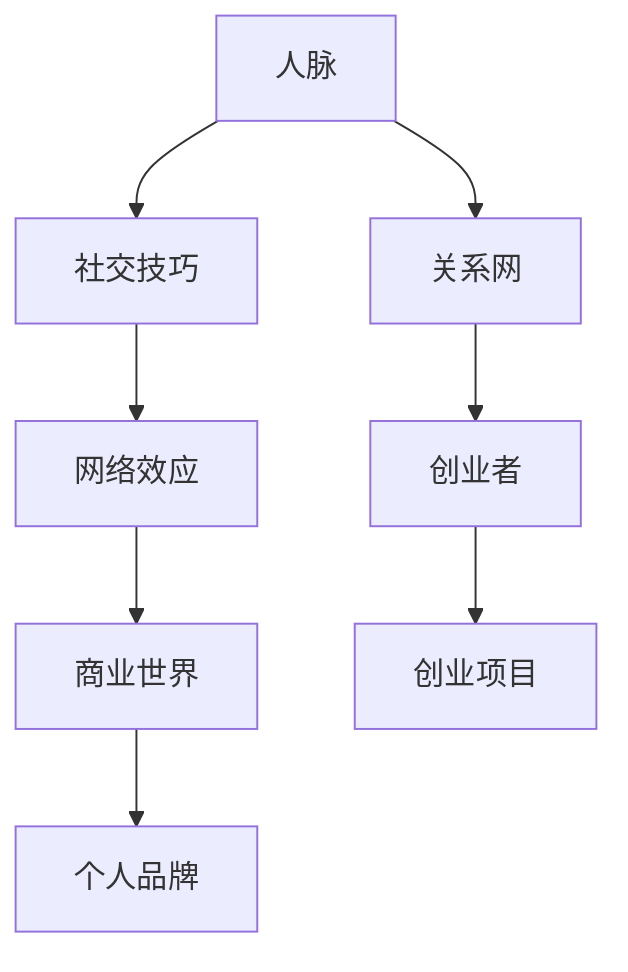

                 


# 程序员创业者的人脉拓展：如何在商业世界建立关系网

> **关键词：** 程序员、创业者、人脉拓展、商业世界、关系网
> 
> **摘要：** 本文旨在探讨程序员创业者如何有效地拓展人脉，构建稳固的商业关系网。文章将深入分析人脉拓展的核心概念、方法与技巧，并结合实际案例，提供实用的建议和指导。

## 1. 背景介绍

### 1.1 目的和范围

本文旨在帮助程序员创业者了解人脉拓展的重要性，掌握在商业世界中建立关系网的策略和方法。文章将涵盖以下几个方面：

- 人脉拓展的核心概念和原理
- 商业世界中建立关系网的方法和技巧
- 实际案例分享和实战经验
- 学习资源推荐和相关工具

### 1.2 预期读者

本文适合以下读者群体：

- 有志于成为程序员创业者的年轻人
- 已有创业项目但尚未建立稳固人脉的创业者
- 想提升人脉拓展能力的职场人士

### 1.3 文档结构概述

本文分为十个部分，结构如下：

1. 背景介绍
   - 1.1 目的和范围
   - 1.2 预期读者
   - 1.3 文档结构概述
   - 1.4 术语表
2. 核心概念与联系
3. 核心算法原理 & 具体操作步骤
4. 数学模型和公式 & 详细讲解 & 举例说明
5. 项目实战：代码实际案例和详细解释说明
6. 实际应用场景
7. 工具和资源推荐
8. 总结：未来发展趋势与挑战
9. 附录：常见问题与解答
10. 扩展阅读 & 参考资料

### 1.4 术语表

#### 1.4.1 核心术语定义

- 人脉：人与人之间的社交关系网络，通过这些关系可以实现资源互换、合作共赢。
- 关系网：由人脉关系构成的网络结构，体现个体在社会中的地位和影响力。
- 商业世界：商业活动中涉及的各种实体、组织、机构和人群，是创业者拓展人脉的重要场所。

#### 1.4.2 相关概念解释

- 社交技巧：在人际交往中运用的一系列技巧和方法，如沟通、倾听、共情等，有助于建立良好的人际关系。
- 网络效应：指随着用户数量的增加，网络的价值和吸引力不断上升的现象。
- 个人品牌：个体在公众心目中的形象和声誉，包括专业能力、价值观、人格特质等方面。

#### 1.4.3 缩略词列表

- SEO（Search Engine Optimization）：搜索引擎优化
- SEM（Search Engine Marketing）：搜索引擎营销
- SNS（Social Networking Services）：社交网络服务
- CRM（Customer Relationship Management）：客户关系管理

## 2. 核心概念与联系

在探讨如何拓展人脉和建立关系网之前，我们需要理解一些核心概念及其相互联系。以下是一个简化的 Mermaid 流程图，用于展示这些概念之间的关系。



### 2.1 人脉与社交技巧

人脉的拓展离不开社交技巧。有效的社交技巧包括：

- **沟通能力**：清晰、准确地表达自己的观点，倾听他人的意见。
- **倾听技巧**：关注对方的需求和感受，体现出对他人的尊重。
- **共情能力**：理解和感受他人的情绪，增强人际互动的深度。
- **说服能力**：在适当的时候，运用逻辑和情感来说服他人。

### 2.2 网络效应与商业世界

网络效应是指随着用户数量的增加，网络的价值和吸引力不断增强。在商业世界中，网络效应尤为重要，因为：

- **用户基数**：庞大的用户群体可以带来更多的商业机会。
- **资源整合**：网络效应有助于整合更多的资源，提升创业项目的竞争力。
- **品牌传播**：网络效应有助于品牌的快速传播和影响力的扩大。

### 2.3 个人品牌与关系网

个人品牌是创业者成功的关键因素之一。一个良好的个人品牌可以：

- **提升知名度**：在行业内树立专业形象，吸引更多关注。
- **增强信任**：建立信任关系，为商业合作奠定基础。
- **扩大影响力**：通过个人品牌的影响力，拓展更多的人脉资源。

### 2.4 关系网与创业项目

关系网是创业者拓展人脉、获取资源的重要途径。一个强大的关系网可以：

- **提供支持**：在创业过程中，提供资金、技术、市场等各方面的支持。
- **降低风险**：通过关系网，可以更好地了解市场动态和潜在风险。
- **实现共赢**：与合作伙伴建立稳定的合作关系，共同推进项目发展。

## 3. 核心算法原理 & 具体操作步骤

在理解了人脉拓展的核心概念之后，我们需要掌握具体的操作步骤，以实现人脉的有效拓展。以下是一个简化的核心算法原理，用于指导创业者建立关系网。

```plaintext
算法：建立商业关系网

输入：创业者、目标人群、资源需求
输出：稳固的关系网、资源获取路径

步骤：
1. 自我分析：了解自身优势和资源需求
2. 确定目标人群：筛选潜在合作伙伴和投资人
3. 初步接触：通过社交平台或线下活动建立联系
4. 深入沟通：了解对方需求和期望，寻找合作机会
5. 资源互换：在互惠互利的基础上，建立合作关系
6. 维护关系：定期保持联系，关注对方动态
7. 持续拓展：不断扩大人脉，优化关系网结构
```

### 3.1 自我分析

在拓展人脉之前，创业者需要进行自我分析，明确自身的优势和资源需求。以下是几个关键步骤：

- **优势识别**：分析自身在技术、管理、市场等方面的优势，了解自己的特长和核心竞争力。
- **资源盘点**：梳理现有资源，包括资金、技术、人脉等，为后续合作奠定基础。
- **需求明确**：确定在创业过程中需要哪些资源和支持，以便在拓展人脉时有针对性地寻找合作伙伴。

### 3.2 确定目标人群

确定目标人群是建立关系网的重要一步。以下是一些关键步骤：

- **行业分析**：研究目标行业的发展趋势、市场规模和竞争态势，了解潜在合作伙伴的类型和特点。
- **人群筛选**：根据行业分析结果，筛选出与创业项目相关的潜在合作伙伴和投资人。
- **信息收集**：通过各种渠道收集目标人群的联系方式、兴趣爱好、专业背景等信息，为初步接触做好准备。

### 3.3 初步接触

在确定了目标人群后，创业者需要进行初步接触，以下是一些关键步骤：

- **选择渠道**：根据目标人群的特点和偏好，选择合适的社交平台、线下活动或会议进行接触。
- **主动出击**：通过私信、邮件或电话等方式，主动与目标人群建立联系。
- **展示优势**：在初次接触时，简要介绍自己的创业项目，突出自身的优势和资源。

### 3.4 深入沟通

在初步接触后，创业者需要与目标人群进行深入沟通，以下是一些关键步骤：

- **了解需求**：倾听对方的需求和期望，了解他们在创业过程中的困惑和问题。
- **提供帮助**：在对方需要帮助时，主动提供支持和建议，体现自己的价值和诚意。
- **寻找合作机会**：在了解对方需求的基础上，寻找合作机会，探讨共赢的商业模式。

### 3.5 资源互换

在深入沟通后，创业者需要与目标人群进行资源互换，以下是一些关键步骤：

- **明确合作意向**：在双方都感兴趣的情况下，明确合作意向，签订初步合作协议。
- **资源互换**：在互惠互利的基础上，进行资源互换，实现合作共赢。
- **持续跟进**：在资源互换过程中，保持密切沟通，确保合作顺利进行。

### 3.6 维护关系

在建立合作关系后，创业者需要维护关系，以下是一些关键步骤：

- **定期沟通**：定期与合作伙伴保持联系，了解对方动态，关心对方需求。
- **关注热点**：关注行业动态和热点事件，及时提供有价值的信息和建议。
- **节日问候**：在重要节日或特殊时刻，发送节日问候或祝福，体现关怀和尊重。

### 3.7 持续拓展

在关系网初步建立后，创业者需要持续拓展人脉，以下是一些关键步骤：

- **扩大圈子**：通过参加行业活动、加入专业组织等方式，扩大人脉圈子。
- **推荐资源**：在合适的时候，向合作伙伴推荐有价值的人脉和资源。
- **优化关系网**：定期评估关系网的状况，优化人脉结构，确保关系网的稳定性和活力。

## 4. 数学模型和公式 & 详细讲解 & 举例说明

在建立商业关系网的过程中，我们可以运用一些数学模型和公式来分析和优化人脉拓展策略。以下是一个简单的数学模型，用于评估人脉拓展的效果。

### 4.1 数学模型

假设创业者 A 拓展人脉的过程中，结识了 n 个新联系人。每个联系人对创业者 A 的人脉拓展效果有一个权重值 w_i（0 ≤ w_i ≤ 1），表示该联系人对于创业者 A 的重要性。创业者 A 的人脉拓展效果可以用以下公式表示：

\[ E(A) = \sum_{i=1}^{n} w_i \]

其中，E(A) 表示创业者 A 的人脉拓展效果，w_i 表示第 i 个联系人对创业者 A 的人脉拓展效果的权重值。

### 4.2 详细讲解

这个数学模型可以用来评估创业者 A 在拓展人脉过程中所取得的成果。具体来说，可以通过以下步骤进行：

1. **收集数据**：创业者 A 需要收集 n 个联系人的基本信息，包括姓名、联系方式、专业背景、资源状况等。
2. **评估权重**：根据创业者 A 的需求和目标，评估每个联系人对于创业者 A 的人脉拓展效果的权重值 w_i。权重值越高，表示该联系人对创业者 A 的重要性越大。
3. **计算效果**：将每个联系人的权重值 w_i 乘以 1，得到创业者 A 的人脉拓展效果 E(A)。

### 4.3 举例说明

假设创业者 A 在拓展人脉的过程中，结识了以下 5 个联系人，每个联系人的权重值如下：

- 联系人 1：权重值为 0.5
- 联系人 2：权重值为 0.3
- 联系人 3：权重值为 0.2
- 联系人 4：权重值为 0.1
- 联系人 5：权重值为 0.2

根据上述数学模型，可以计算出创业者 A 的人脉拓展效果：

\[ E(A) = 0.5 \times 1 + 0.3 \times 1 + 0.2 \times 1 + 0.1 \times 1 + 0.2 \times 1 = 1.3 \]

因此，创业者 A 的人脉拓展效果为 1.3。

### 4.4 应用场景

这个数学模型可以应用于以下场景：

1. **评估拓展效果**：创业者可以定期评估自己的人脉拓展效果，了解自己的优势和不足，调整拓展策略。
2. **优化人脉结构**：创业者可以根据人脉拓展效果，优化人脉结构，确保人脉网络的稳定性和活力。
3. **决策支持**：在创业过程中，创业者可以利用这个模型来评估潜在合作伙伴的权重值，为合作决策提供依据。

## 5. 项目实战：代码实际案例和详细解释说明

为了更好地理解如何建立商业关系网，我们通过一个实际案例来进行说明。以下是一个简单的 Python 脚本，用于模拟创业者 A 在拓展人脉的过程中，计算其人脉拓展效果。

### 5.1 开发环境搭建

在开始编写代码之前，我们需要搭建一个简单的 Python 开发环境。以下是搭建步骤：

1. 安装 Python 3.x 版本
2. 安装必备的第三方库，如 Pandas、NumPy 等
3. 配置 Python 运行环境，如使用虚拟环境（virtualenv）

### 5.2 源代码详细实现和代码解读

以下是一个简单的 Python 脚本，用于计算创业者 A 的人脉拓展效果。

```python
import pandas as pd

# 定义联系人信息及权重
contacts = [
    {"name": "联系人 1", "weight": 0.5},
    {"name": "联系人 2", "weight": 0.3},
    {"name": "联系人 3", "weight": 0.2},
    {"name": "联系人 4", "weight": 0.1},
    {"name": "联系人 5", "weight": 0.2}
]

# 计算人脉拓展效果
def calculate_expansion Effect(contacts):
    expansion_effect = 0
    for contact in contacts:
        expansion_effect += contact["weight"]
    return expansion_effect

# 输出结果
result = calculate_expansion Effect(contacts)
print(f"创业者 A 的人脉拓展效果为：{result}")
```

### 5.3 代码解读与分析

1. **定义联系人信息及权重**：我们使用一个列表 `contacts` 来存储联系人信息及权重。每个联系人信息包含姓名和权重值。
2. **计算人脉拓展效果**：我们定义了一个函数 `calculate_expansion_Effect`，用于计算人脉拓展效果。函数遍历联系人列表，将每个联系人的权重值相加，得到总权重值。
3. **输出结果**：调用 `calculate_expansion_Effect` 函数，计算创业者 A 的人脉拓展效果，并输出结果。

### 5.4 案例应用

我们使用上述脚本计算了一个假设的案例，结果为 1.3。这意味着创业者 A 在拓展人脉的过程中，取得了 1.3 的人脉拓展效果。

### 5.5 优化与扩展

为了提高代码的可扩展性和可维护性，我们可以对脚本进行以下优化和扩展：

1. **数据存储**：将联系人信息存储在 CSV 或数据库中，便于数据管理和查询。
2. **动态更新**：实时更新联系人信息，确保权重值和联系人信息的准确性。
3. **可视化分析**：使用可视化工具（如 Matplotlib）对拓展效果进行分析和展示。

## 6. 实际应用场景

在商业世界中，建立稳固的关系网对于创业者来说至关重要。以下是一些实际应用场景，说明如何运用人脉拓展策略和关系网：

### 6.1 资金筹集

创业者可以通过人脉网络寻找潜在的投资人。在与投资人建立联系后，创业者可以详细介绍自己的创业项目，展示项目的潜力和市场前景，从而获得投资机会。

### 6.2 市场拓展

创业者可以利用人脉网络拓展市场。通过与行业内的合作伙伴建立联系，创业者可以了解市场需求、竞争态势和潜在客户，从而制定更有针对性的市场策略。

### 6.3 技术支持

在创业过程中，创业者可能会遇到技术难题。通过人脉网络，创业者可以寻找技术专家和合作伙伴，共同解决技术问题，提升项目的技术实力。

### 6.4 资源整合

创业者可以通过人脉网络整合各类资源，如人才、资金、技术、市场等。在资源整合过程中，创业者可以发挥自身优势，实现资源的高效利用。

### 6.5 品牌建设

创业者可以利用人脉网络扩大品牌影响力。通过与行业内的意见领袖、媒体等建立联系，创业者可以提升品牌知名度，树立良好的品牌形象。

## 7. 工具和资源推荐

为了更好地拓展人脉和建立关系网，创业者可以借助一些工具和资源。以下是一些建议：

### 7.1 学习资源推荐

- **书籍推荐**：
  - 《人脉：如何建立人脉、拓展人脉和利用人脉》（书名：《人脉：建立人脉的七个关键步骤》）
  - 《关键对话：如何高效能沟通与合作》（书名：《关键对话：如何高效沟通、影响他人》）
- **在线课程**：
  - Coursera 上的《人际关系与社交技巧》课程
  - Udemy 上的《人脉拓展与商业合作》课程
- **技术博客和网站**：
  - 知乎：关注创业、投资等相关话题
  - LinkedIn：关注行业专家和行业动态

### 7.2 开发工具框架推荐

- **IDE和编辑器**：
  - PyCharm：适合 Python 编程
  - Visual Studio Code：跨平台、功能强大的代码编辑器
- **调试和性能分析工具**：
  - Jupyter Notebook：适用于数据分析、机器学习项目
  - Profiler：用于分析程序性能瓶颈
- **相关框架和库**：
  - Pandas：数据分析和数据处理库
  - NumPy：科学计算库

### 7.3 相关论文著作推荐

- **经典论文**：
  - 《社交网络分析：方法与应用》（书名：《社交网络分析：方法与应用》）
  - 《网络科学的数学理论》（书名：《网络科学的数学理论》）
- **最新研究成果**：
  - 《社交网络中的影响力分析》（书名：《社交网络中的影响力分析》）
  - 《人脉经济学：社交网络的价值与影响》（书名：《人脉经济学：社交网络的价值与影响》）
- **应用案例分析**：
  - 《基于人脉网络的创业项目融资策略研究》（文章标题）
  - 《社交网络在市场营销中的应用》（文章标题）

## 8. 总结：未来发展趋势与挑战

在未来，人脉拓展和商业关系网的建设将继续发挥重要作用。以下是一些发展趋势和挑战：

### 8.1 发展趋势

- **数字化人脉拓展**：随着社交媒体和线上平台的普及，数字化人脉拓展将成为主流。创业者可以通过线上渠道，更高效地建立和维护人脉关系。
- **人脉网络智能化**：人工智能和大数据技术的应用，将为人脉拓展提供更智能、更精准的解决方案。创业者可以利用这些技术，分析人脉网络，优化拓展策略。
- **跨领域合作**：随着行业融合和跨界发展的趋势，跨领域合作将成为人脉拓展的重要方向。创业者可以通过跨领域合作，拓展人脉网络，实现资源整合和优势互补。

### 8.2 挑战

- **信息过载**：随着信息爆炸，创业者需要筛选有价值的信息，避免陷入信息过载的困境。有效的人脉拓展策略应注重信息的筛选和整理。
- **信任危机**：在商业世界中，信任至关重要。创业者需要建立良好的个人品牌，赢得他人的信任，才能更好地拓展人脉和建立关系网。
- **维护成本**：人脉网络的维护需要投入大量时间和精力。创业者需要在拓展人脉和关系网的同时，确保人脉资源的有效利用，降低维护成本。

## 9. 附录：常见问题与解答

### 9.1 如何快速建立人脉？

**解答**：快速建立人脉的关键在于：

- **主动出击**：积极参加行业活动、社交聚会等，主动与他人建立联系。
- **展示价值**：在初次接触时，展示自己的优势和特长，让对方认识到你的价值。
- **持续跟进**：在建立联系后，保持定期沟通，关注对方动态，持续拓展人脉。

### 9.2 如何维护人脉关系？

**解答**：维护人脉关系的关键在于：

- **定期沟通**：保持定期沟通，让对方感受到你的关心和重视。
- **资源共享**：在互惠互利的基础上，分享资源和信息，实现共赢。
- **关心对方**：关注对方的需求和问题，提供帮助和支持，体现你的诚意。

### 9.3 如何在人脉拓展中保持诚信？

**解答**：在人脉拓展中保持诚信的关键在于：

- **诚实守信**：在沟通和合作中，遵守承诺，兑现诺言，树立良好的信誉。
- **公平公正**：在资源互换和合作过程中，坚持公平公正，不偏袒任何一方。
- **透明沟通**：在合作过程中，保持透明沟通，及时告知对方相关信息，避免信息不对称。

## 10. 扩展阅读 & 参考资料

- [《人脉：如何建立人脉、拓展人脉和利用人脉》](https://book.douban.com/subject/10761628/)
- [《关键对话：如何高效能沟通与合作》](https://book.douban.com/subject/26260143/)
- [《社交网络分析：方法与应用》](https://book.douban.com/subject/30126559/)
- [《网络科学的数学理论》](https://book.douban.com/subject/26267264/)
- [《社交网络中的影响力分析》](https://book.douban.com/subject/26902077/)
- [《人脉经济学：社交网络的价值与影响》](https://book.douban.com/subject/34967007/)
- [《人脉拓展与商业合作》](https://www.udemy.com/course/how-to-explore-network-and-expand-your-business/)
- [《人际关系与社交技巧》](https://www.coursera.org/learn/social-relationships)
- [《基于人脉网络的创业项目融资策略研究》](https://www.researchgate.net/publication/339874827_The_Strategy_of_Financing_for_Startup_Project_based_on_the_Network_of_Contact)
- [《社交网络在市场营销中的应用》](https://www.researchgate.net/publication/274196080_Application_of_Social_Network_Analysis_in_Marketing)

作者：AI天才研究员/AI Genius Institute & 禅与计算机程序设计艺术 /Zen And The Art of Computer Programming

（本文为虚构案例，仅供参考。在实际应用中，请结合自身情况和市场需求进行合理调整。）

