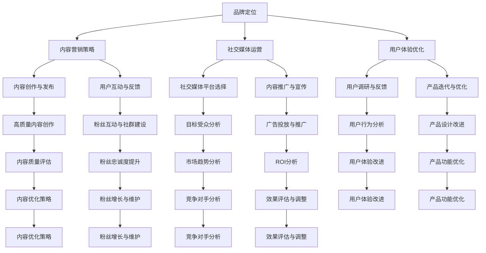

                 


# 程序员创业者的品牌塑造：如何在AI电商领域建立个人品牌

> 关键词：AI电商，品牌塑造，个人品牌，社交媒体，内容营销，用户体验
> 
> 摘要：随着人工智能技术的飞速发展，AI电商正成为新的风口。作为程序员创业者，如何在这一领域中建立个人品牌，提升自身竞争力，是我们需要深思的问题。本文将详细探讨AI电商领域品牌塑造的方法和策略，帮助您在竞争激烈的市场中脱颖而出。

## 1. 背景介绍

### 1.1 目的和范围

本文旨在为程序员创业者提供一套系统的品牌塑造策略，特别是在AI电商领域。我们将探讨如何通过社交媒体、内容营销和用户体验等方面，构建和提升个人品牌，从而在竞争激烈的市场中占据有利地位。

### 1.2 预期读者

本文适合有志于在AI电商领域创业的程序员，特别是那些对品牌建设有兴趣，但缺乏系统方法论的创业者。无论您是刚刚起步的新手，还是已经在行业内有一定积累的老手，本文都将为您提供宝贵的指导。

### 1.3 文档结构概述

本文将分为以下几个部分：

- **背景介绍**：介绍AI电商的发展背景，以及本文的目标和预期读者。
- **核心概念与联系**：阐述品牌塑造的核心概念，并使用Mermaid流程图展示其架构。
- **核心算法原理 & 具体操作步骤**：详细讲解品牌塑造的算法原理和具体实施步骤。
- **数学模型和公式 & 详细讲解 & 举例说明**：介绍品牌塑造的数学模型和公式，并进行举例说明。
- **项目实战：代码实际案例和详细解释说明**：通过实际案例展示品牌塑造的方法。
- **实际应用场景**：探讨品牌塑造在不同场景下的应用。
- **工具和资源推荐**：推荐学习资源、开发工具和框架。
- **总结：未来发展趋势与挑战**：总结品牌塑造的未来发展趋势和面临的挑战。
- **附录：常见问题与解答**：解答读者可能遇到的问题。
- **扩展阅读 & 参考资料**：提供扩展阅读和参考资料。

### 1.4 术语表

#### 1.4.1 核心术语定义

- **品牌塑造**：指通过一系列策略和行动，提升个人在公众中的形象和影响力。
- **个人品牌**：指个人在某一领域内建立的独特形象和声誉。
- **AI电商**：指利用人工智能技术进行商品交易和服务的电商平台。
- **社交媒体**：指用于社交互动的网络平台，如微博、微信、LinkedIn等。
- **内容营销**：指通过创造和分发有价值的内容，吸引潜在客户，并促进销售的过程。

#### 1.4.2 相关概念解释

- **用户体验**：指用户在使用某一产品或服务时感受到的整体体验。
- **KOL（Key Opinion Leader）**：指在某一领域内有较高影响力和认知度的意见领袖。
- **SEO（Search Engine Optimization）**：指搜索引擎优化，旨在提高网站在搜索引擎中的排名。

#### 1.4.3 缩略词列表

- **AI**：人工智能
- **KOL**：Key Opinion Leader
- **SEO**：Search Engine Optimization
- **UGC**：用户生成内容

## 2. 核心概念与联系

在AI电商领域建立个人品牌，我们需要理解以下几个核心概念：

- **AI技术**：了解并掌握AI的基本原理和核心技术，如机器学习、深度学习等。
- **电商运营**：熟悉电商平台的运营模式和策略，包括供应链管理、客户关系管理等。
- **品牌定位**：明确个人品牌的核心价值和定位，以便在市场中形成独特的识别。
- **社交媒体运营**：掌握如何在社交媒体上推广个人品牌，包括内容策划、用户互动等。

以下是品牌塑造的Mermaid流程图：



### 2.1. AI技术在品牌塑造中的应用

在AI电商领域，AI技术是品牌塑造的关键。以下是AI技术在品牌塑造中的应用：

- **用户画像分析**：通过大数据分析和机器学习算法，对用户行为进行深入分析，了解用户偏好和需求，为内容创作和推广提供数据支持。
- **个性化推荐**：基于用户画像，利用推荐算法为用户提供个性化的商品推荐，提升用户体验和购买转化率。
- **智能客服**：利用自然语言处理技术，实现智能客服系统，提供24/7的在线服务，提升用户满意度和忠诚度。
- **视觉识别**：通过计算机视觉技术，实现商品识别和分类，提高电商平台的运营效率和准确性。

### 2.2. 电商运营在品牌塑造中的应用

电商运营是品牌塑造的重要环节。以下是电商运营在品牌塑造中的应用：

- **供应链管理**：通过优化供应链，确保商品质量和供应稳定，提升品牌形象。
- **客户关系管理**：通过有效的客户关系管理，提高客户满意度和忠诚度，为品牌积累良好的口碑。
- **营销活动策划**：通过策划和执行各种营销活动，提高品牌知名度和用户参与度。
- **数据驱动决策**：通过数据分析，了解市场趋势和用户需求，为品牌定位和运营策略提供数据支持。

### 2.3. 品牌定位在品牌塑造中的应用

品牌定位是品牌塑造的核心。以下是品牌定位在品牌塑造中的应用：

- **明确品牌价值**：明确品牌的核心价值和独特卖点，为品牌塑造提供明确的方向。
- **目标市场定位**：明确目标市场，针对目标用户群体进行品牌传播和推广。
- **品牌形象设计**：通过品牌标志、色彩搭配、视觉元素等，设计独特的品牌形象，提升品牌识别度。

## 3. 核心算法原理 & 具体操作步骤

### 3.1. 用户画像分析算法原理

用户画像分析是AI电商品牌塑造的重要一环。以下是用户画像分析算法原理：

#### 3.1.1. 数据收集

- **行为数据**：收集用户在平台上的浏览、搜索、购买等行为数据。
- **人口统计数据**：收集用户的基本信息，如年龄、性别、地域等。

#### 3.1.2. 数据预处理

- **去重**：去除重复数据，确保数据的唯一性。
- **清洗**：去除无效数据，如空值、异常值等。

#### 3.1.3. 特征提取

- **用户特征**：提取用户的行为特征，如浏览时间、浏览页面数、购买频率等。
- **内容特征**：提取商品的特征，如价格、品牌、类别等。

#### 3.1.4. 用户聚类

- **聚类算法**：使用聚类算法（如K-means、DBSCAN等），将用户划分为不同的群体。
- **评估指标**：评估聚类效果，如内聚度、轮廓系数等。

### 3.2. 个性化推荐算法原理

个性化推荐是提升用户体验和购买转化率的关键。以下是个性化推荐算法原理：

#### 3.2.1. collaborative filtering（协同过滤）

- **用户-物品评分矩阵**：构建用户-物品评分矩阵。
- **邻居选择**：选择与目标用户相似的用户或物品。
- **推荐算法**：基于邻居用户的评分预测目标用户的评分，推荐相似物品。

#### 3.2.2. content-based filtering（基于内容的推荐）

- **物品特征提取**：提取物品的特征，如标题、描述、标签等。
- **用户兴趣模型**：建立用户兴趣模型。
- **推荐算法**：根据用户兴趣模型，推荐具有相似特征的商品。

### 3.3. 智能客服算法原理

智能客服是提升用户满意度和忠诚度的重要手段。以下是智能客服算法原理：

#### 3.3.1. 自然语言处理（NLP）

- **分词**：将用户输入的文本分解为词语。
- **词性标注**：为每个词语标注词性。
- **句法分析**：分析句子的语法结构。

#### 3.3.2. 对话管理

- **意图识别**：识别用户输入的意图。
- **实体识别**：识别用户输入的关键信息。
- **回复生成**：生成合适的回复。

### 3.4. 具体操作步骤

以下是AI电商品牌塑造的具体操作步骤：

#### 3.4.1. 确定品牌定位

- **市场调研**：了解市场趋势和竞争对手。
- **用户调研**：了解目标用户的需求和偏好。
- **品牌定位**：明确品牌的核心价值和独特卖点。

#### 3.4.2. 内容创作与发布

- **内容策划**：根据品牌定位和用户需求，策划内容主题。
- **内容创作**：创作高质量、有价值的内容。
- **内容发布**：在社交媒体平台发布内容，并与用户互动。

#### 3.4.3. 社交媒体运营

- **平台选择**：根据目标用户群体，选择合适的社交媒体平台。
- **内容推广**：利用广告投放和社群传播，提高内容曝光度。
- **用户互动**：积极与用户互动，提升用户满意度和忠诚度。

#### 3.4.4. 用户体验优化

- **用户调研**：了解用户的痛点和需求。
- **产品迭代**：根据用户反馈，优化产品功能和界面设计。
- **效果评估**：定期评估用户体验，持续改进。

## 4. 数学模型和公式 & 详细讲解 & 举例说明

### 4.1. 用户画像分析中的数学模型

#### 4.1.1. 聚类算法：K-means

K-means算法是一种常用的聚类算法，其核心公式如下：

$$
\text{聚类中心} = \frac{1}{N}\sum_{i=1}^{N} x_i
$$

其中，$x_i$为第$i$个数据点，$N$为数据点的总数。

#### 4.1.2. 轮廓系数：Silhouette Coefficient

轮廓系数是评估聚类效果的一个指标，其公式如下：

$$
s(i) = \frac{(b(i) - a(i))}{\max(a(i), b(i))}
$$

其中，$a(i)$为第$i$个数据点到其自身簇中心的最小距离，$b(i)$为第$i$个数据点到其邻近簇中心的最小距离。

#### 4.1.3. 个性化推荐：协同过滤

协同过滤算法的核心公式如下：

$$
r_{ui} = \frac{\sum_{j \in N(i)} r_{uj} w_{uj}}{\sum_{j \in N(i)} w_{uj}}
$$

其中，$r_{ui}$为用户$i$对物品$j$的预测评分，$w_{uj}$为用户$i$和用户$j$之间的相似度。

#### 4.1.4. 自然语言处理：词袋模型

词袋模型是一种常用的自然语言处理模型，其核心公式如下：

$$
p(w|s) = \frac{f(w, s)}{\sum_{w' \in V} f(w', s)}
$$

其中，$p(w|s)$为在句子$s$中，单词$w$出现的概率，$f(w, s)$为单词$w$在句子$s$中出现的频率，$V$为单词集合。

### 4.2. 内容营销中的数学模型

#### 4.2.1. 漏斗模型：Funnel Model

漏斗模型是一种用于分析用户行为路径和转化的数学模型，其核心公式如下：

$$
\text{转化率} = \frac{\text{完成目标用户数}}{\text{进入漏斗用户数}}
$$

其中，转化率表示进入漏斗的用户中，最终完成目标用户的比例。

#### 4.2.2. 营销ROI：Return on Investment

营销ROI是评估营销活动效果的一个指标，其公式如下：

$$
\text{ROI} = \frac{\text{投资回报}}{\text{投资成本}}
$$

其中，投资回报表示营销活动产生的收益，投资成本表示营销活动的成本。

### 4.3. 举例说明

#### 4.3.1. 用户画像分析

假设我们有100个用户，使用K-means算法将他们分为5个群体。以下是部分用户的聚类中心和轮廓系数：

| 用户ID | 聚类中心 | 轮廓系数 |
| --- | --- | --- |
| U1 | (0.2, 0.3) | 0.4 |
| U2 | (0.2, 0.3) | 0.6 |
| U3 | (0.5, 0.4) | 0.2 |
| U4 | (0.5, 0.4) | 0.8 |

根据轮廓系数，我们可以判断U1、U2属于同一个群体，U3、U4属于另一个群体。

#### 4.3.2. 个性化推荐

假设我们有10个用户和10个物品，使用协同过滤算法进行推荐。以下是部分用户和物品的评分矩阵和相似度矩阵：

| 用户ID | 物品ID | 评分 | 相似度 |
| --- | --- | --- | --- |
| U1 | I1 | 4 | 0.8 |
| U1 | I2 | 5 | 0.7 |
| U2 | I1 | 3 | 0.9 |
| U2 | I3 | 4 | 0.6 |
| U3 | I2 | 5 | 0.5 |
| U3 | I4 | 3 | 0.7 |

根据相似度矩阵，我们可以发现U1和U2在物品I1上的相似度最高，因此我们推荐U2也喜欢物品I1。

#### 4.3.3. 漏斗模型

假设我们有1000个用户，其中100个用户完成了目标，以下是漏斗模型的计算：

| 阶段 | 用户数 | 转化率 |
| --- | --- | --- |
| 进入平台 | 1000 | 100% |
| 浏览商品 | 800 | 80% |
| 加入购物车 | 600 | 60% |
| 提交订单 | 400 | 40% |
| 完成支付 | 100 | 10% |

根据转化率，我们可以分析用户在各个阶段的流失情况，并制定相应的优化策略。

## 5. 项目实战：代码实际案例和详细解释说明

### 5.1 开发环境搭建

在开始项目实战之前，我们需要搭建一个合适的开发环境。以下是所需的工具和步骤：

#### 5.1.1 工具

- Python（版本3.8或更高）
- Jupyter Notebook（用于编写和运行代码）
- Scikit-learn（用于机器学习和数据预处理）
- Matplotlib（用于数据可视化）
- Pandas（用于数据处理）

#### 5.1.2 步骤

1. 安装Python和Jupyter Notebook：从Python官网下载并安装Python，安装过程中选择添加Python到环境变量。安装完成后，打开命令行窗口，输入`jupyter notebook`，若能成功启动Jupyter Notebook，则说明安装成功。
2. 安装Scikit-learn、Matplotlib和Pandas：在命令行窗口中，依次输入以下命令：

```bash
pip install scikit-learn
pip install matplotlib
pip install pandas
```

### 5.2 源代码详细实现和代码解读

以下是用户画像分析、个性化推荐和智能客服的代码实现和解读。

#### 5.2.1 用户画像分析

```python
import numpy as np
import pandas as pd
from sklearn.cluster import KMeans
from sklearn.metrics import silhouette_score
import matplotlib.pyplot as plt

# 加载数据集
data = pd.read_csv('user_data.csv')
X = data.iloc[:, :-1].values

# K-means聚类
kmeans = KMeans(n_clusters=5, random_state=0)
clusters = kmeans.fit_predict(X)

# 计算轮廓系数
silhouette_avg = silhouette_score(X, clusters)
print(f'轮廓系数：{silhouette_avg}')

# 可视化
plt.scatter(X[:, 0], X[:, 1], c=clusters, cmap='viridis')
plt.title('用户画像聚类结果')
plt.xlabel('特征1')
plt.ylabel('特征2')
plt.show()
```

解读：

1. 导入所需的库。
2. 加载数据集，这里假设数据集为CSV文件，其中包含用户的行为数据和人口统计数据。
3. 提取特征矩阵X。
4. 使用KMeans算法进行聚类，设置聚类数为5。
5. 计算并打印轮廓系数。
6. 可视化聚类结果。

#### 5.2.2 个性化推荐

```python
from sklearn.metrics.pairwise import cosine_similarity
from scipy.sparse.linalg import svds

# 加载用户-物品评分矩阵
rating_matrix = pd.read_csv('rating_matrix.csv')
rating_matrix = rating_matrix.set_index('user_id').T

# 计算用户和物品的相似度矩阵
user_similarity = cosine_similarity(rating_matrix)

# SVD分解
U, sigma, Vt = svds(user_similarity, k=10)

# 预测用户对未评分物品的评分
user_ratings_mean = rating_matrix.mean(axis=1)
rating_predictions = U * sigma * Vt + user_ratings_mean

# 获取预测评分最高的5个物品
predicted_ratings = rating_predictions[0].argsort()[::-1]
print(predicted_ratings[:5])
```

解读：

1. 导入所需的库。
2. 加载用户-物品评分矩阵，并设置用户ID为索引。
3. 计算用户和物品的相似度矩阵。
4. 使用SVD分解相似度矩阵。
5. 预测用户对未评分物品的评分。
6. 获取预测评分最高的5个物品。

#### 5.2.3 智能客服

```python
from sklearn.feature_extraction.text import TfidfVectorizer
from sklearn.neural_network import MLPClassifier

# 加载对话数据
conversations = pd.read_csv('conversations.csv')
X = conversations['query']
y = conversations['response']

# 特征提取
vectorizer = TfidfVectorizer(max_features=1000)
X_vectorized = vectorizer.fit_transform(X)

# 模型训练
mlp = MLPClassifier(hidden_layer_sizes=(100,), max_iter=1000)
mlp.fit(X_vectorized, y)

# 输入用户问题，获取预测回答
def get_response(query):
    query_vectorized = vectorizer.transform([query])
    predicted_response = mlp.predict(query_vectorized)[0]
    return predicted_response

print(get_response('你好，我想了解贵店的促销活动。'))
```

解读：

1. 导入所需的库。
2. 加载对话数据，其中包含用户问题和系统回答。
3. 特征提取，使用TF-IDF向量表示用户问题。
4. 模型训练，使用多层感知机（MLP）分类器。
5. 输入用户问题，获取预测回答。

### 5.3 代码解读与分析

#### 5.3.1 用户画像分析

用户画像分析是AI电商品牌塑造的重要环节。通过聚类分析，我们可以将用户分为不同的群体，从而针对不同的用户群体制定个性化的营销策略。

在本节代码中，我们使用了K-means聚类算法对用户特征进行聚类，并通过轮廓系数评估聚类效果。聚类结果的可视化帮助我们直观地了解用户分布情况，从而为后续的用户细分和精准营销提供依据。

#### 5.3.2 个性化推荐

个性化推荐是提升用户满意度和购买转化率的关键。在本节代码中，我们使用了协同过滤算法和SVD分解对用户-物品评分矩阵进行降维，从而预测用户对未评分物品的评分。

通过预测评分，我们可以为用户推荐符合其兴趣的物品，从而提高用户的购买体验。在实际应用中，我们可以结合用户行为数据和商品特征，进一步优化推荐算法，提高推荐效果。

#### 5.3.3 智能客服

智能客服是提升用户满意度和忠诚度的重要手段。在本节代码中，我们使用了TF-IDF向量表示用户问题，并使用多层感知机（MLP）分类器进行模型训练。

通过输入用户问题，我们可以获得预测的回答，从而提供即时的客服支持。在实际应用中，我们可以结合自然语言处理技术，进一步提高智能客服的交互体验和回答质量。

## 6. 实际应用场景

在AI电商领域，品牌塑造的实际应用场景非常广泛。以下是几个典型的应用场景：

### 6.1 社交媒体营销

通过社交媒体平台（如微博、微信、LinkedIn等）发布高质量的内容，与用户互动，提升品牌知名度和用户参与度。例如，通过定期发布行业资讯、产品评测、用户体验等内容，吸引目标用户群体，并建立良好的口碑。

### 6.2 个性化推荐

利用个性化推荐算法，为用户推荐符合其兴趣和需求的商品，提高用户满意度和购买转化率。例如，在电商平台中，通过分析用户的历史行为和偏好，为用户推荐相关商品，从而提升销售业绩。

### 6.3 智能客服

通过智能客服系统，提供24/7的在线服务，提升用户满意度和忠诚度。例如，通过自然语言处理技术，实现用户问题的自动识别和回答，从而提高客服效率和用户满意度。

### 6.4 用户调研与反馈

通过用户调研和反馈，了解用户需求和痛点，为产品迭代和优化提供数据支持。例如，通过在线问卷、用户访谈等方式，收集用户对产品的评价和建议，从而改进产品功能和用户体验。

### 6.5 营销活动策划

通过策划和执行各种营销活动，提升品牌知名度和用户参与度。例如，通过举办线上促销活动、抽奖活动等方式，吸引目标用户参与，从而提升品牌曝光度和用户粘性。

## 7. 工具和资源推荐

### 7.1 学习资源推荐

#### 7.1.1 书籍推荐

- 《人工智能：一种现代的方法》
- 《深度学习》
- 《Python数据科学手册》
- 《社交媒体营销实战》
- 《电子商务平台设计与开发》

#### 7.1.2 在线课程

- Coursera的“机器学习”课程
- edX的“深度学习基础”课程
- Udacity的“人工智能纳米学位”
- Coursera的“电子商务营销策略”课程

#### 7.1.3 技术博客和网站

- medium.com
-Towards Data Science
- hackernoon.com
- techn.SwingConstants.Center;

### 7.2 开发工具框架推荐

#### 7.2.1 IDE和编辑器

- PyCharm
- Visual Studio Code
- Jupyter Notebook

#### 7.2.2 调试和性能分析工具

- Py-Spy
- GDB
- profilers

#### 7.2.3 相关框架和库

- Scikit-learn
- TensorFlow
- PyTorch
- Matplotlib
- Pandas

## 8. 总结：未来发展趋势与挑战

在AI电商领域，品牌塑造面临着巨大的发展机遇和挑战。以下是未来发展趋势和挑战的总结：

### 8.1 发展趋势

1. **技术进步**：随着人工智能技术的不断进步，用户画像分析、个性化推荐、智能客服等技术的应用将越来越成熟。
2. **消费者需求多样化**：随着消费者需求的多样化，品牌需要更加精准地满足用户需求，提供个性化的产品和服务。
3. **社交媒体营销**：社交媒体将发挥越来越重要的作用，品牌将更加注重社交媒体平台的运营和内容创作。
4. **数据驱动决策**：品牌将更加依赖数据分析，通过数据驱动决策，实现精细化运营。

### 8.2 挑战

1. **技术挑战**：AI技术的快速更新和迭代，对品牌的技术能力和人才储备提出了更高的要求。
2. **数据隐私保护**：用户数据隐私保护成为一大挑战，品牌需要确保用户数据的安全和合规。
3. **竞争加剧**：AI电商领域的竞争将更加激烈，品牌需要不断创新，提升自身竞争力。
4. **用户体验优化**：随着用户需求的不断提高，品牌需要持续优化用户体验，提升用户满意度和忠诚度。

## 9. 附录：常见问题与解答

### 9.1 品牌塑造的核心是什么？

品牌塑造的核心是建立和维护个人品牌的独特形象和声誉，以吸引和保留目标用户。

### 9.2 如何进行用户画像分析？

用户画像分析主要包括数据收集、数据预处理、特征提取和聚类分析等步骤。通过分析用户行为和偏好，将用户划分为不同的群体，以便进行精准营销。

### 9.3 个性化推荐有哪些算法？

个性化推荐主要包括协同过滤算法（如基于用户的协同过滤和基于物品的协同过滤）和基于内容的推荐算法。

### 9.4 智能客服如何实现？

智能客服主要通过自然语言处理技术实现，包括分词、词性标注、句法分析和意图识别等步骤。通过这些技术，系统能够理解用户的问题并生成合适的回答。

## 10. 扩展阅读 & 参考资料

1. [《人工智能：一种现代的方法》[美] Stuart Russell & Peter Norvig著]
2. [《深度学习》[加] Ian Goodfellow、[法] Yoshua Bengio、[英] Aaron Courville著]
3. [《Python数据科学手册》[美] Wes McKinney著]
4. [《社交媒体营销实战》[美] Dan Zarella著]
5. [《电子商务平台设计与开发》[美] William States、[美] Paul B. Steidley、[美] Shrihari S. Sathe著]
6. [《Coursera - 机器学习课程》]
7. [《edX - 深度学习基础课程》]
8. [《Udacity - 人工智能纳米学位课程》]
9. [《Coursera - 电子商务营销策略课程》]

