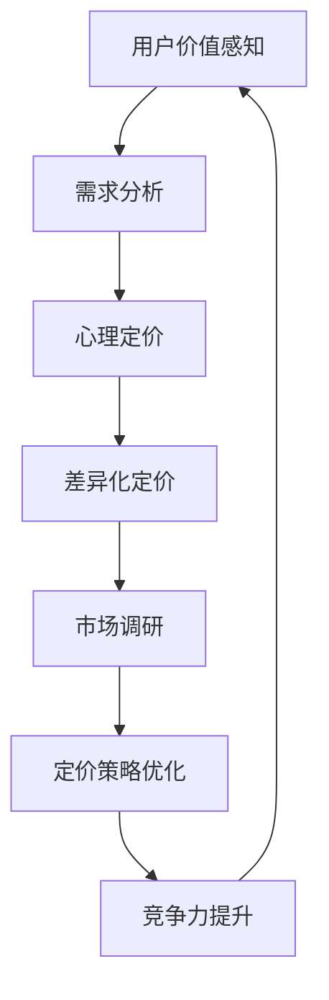

                 

# 程序员创业者的定价心理学：最大化用户价值感知

> **关键词：** 定价策略、用户价值感知、创业、消费者行为、心理定价、需求分析  
> **摘要：** 本文将探讨程序员创业者如何利用定价心理学原理来提升用户价值感知，从而实现产品的高效定价策略。文章将结合实际案例，详细解析如何通过需求分析、心理定价和差异化定价策略，最大化用户价值感知，提高产品市场竞争力。

## 1. 背景介绍

### 1.1 目的和范围

本文旨在帮助程序员创业者理解并应用定价心理学原理，以提升用户价值感知，实现产品的高效定价。本文将涵盖以下主题：

- 定价心理学基础概念
- 需求分析与市场调研
- 心理定价策略
- 差异化定价策略
- 定价策略的实际应用与案例分析

### 1.2 预期读者

本文适合以下读者群体：

- 初创企业的程序员创业者
- 担任技术负责人的专业人士
- 对产品定价策略感兴趣的技术人员

### 1.3 文档结构概述

本文结构如下：

- 引言
- 定价心理学基础
- 用户需求分析与市场调研
- 心理定价策略
- 差异化定价策略
- 实际应用与案例分析
- 总结与未来趋势
- 附录：常见问题与解答
- 扩展阅读与参考资料

### 1.4 术语表

#### 1.4.1 核心术语定义

- **用户价值感知**：用户对产品所感知到的价值。
- **需求分析**：对目标用户需求的理解和分析。
- **心理定价**：利用消费者心理来制定价格策略。
- **差异化定价**：根据不同用户群体或市场环境制定不同的价格策略。

#### 1.4.2 相关概念解释

- **消费者行为**：消费者在购买、使用和评价产品过程中的行为表现。
- **价格弹性**：消费者对价格变化的敏感程度。
- **成本加成定价**：在成本基础上加成一定利润率的定价方法。

#### 1.4.3 缩略词列表

- **SaaS**：Software as a Service（软件即服务）
- **PaaS**：Platform as a Service（平台即服务）
- **IaaS**：Infrastructure as a Service（基础设施即服务）

## 2. 核心概念与联系

在探讨定价心理学之前，我们需要理解一些核心概念，并绘制一个 Mermaid 流程图来展示它们之间的联系。



### 2.1 核心概念详解

#### 用户价值感知

用户价值感知是消费者在购买产品后对其所感知到的价值。它决定了消费者是否愿意为产品支付相应价格的重要因素。

#### 需求分析

需求分析是对目标用户需求的理解和分析。通过需求分析，创业者可以明确产品的目标用户群体，了解他们的需求和痛点，从而制定更有针对性的定价策略。

#### 心理定价

心理定价是利用消费者心理来制定价格策略。通过运用心理学原理，创业者可以影响消费者的价格感知，从而提高用户价值感知。

#### 差异化定价

差异化定价是根据不同用户群体或市场环境制定不同的价格策略。通过差异化定价，创业者可以实现资源优化配置，提高市场竞争力。

#### 市场调研

市场调研是对市场需求、竞争状况、消费者行为等方面的调查和分析。市场调研为创业者提供了制定定价策略的重要依据。

#### 定价策略优化

定价策略优化是基于用户需求、市场调研和消费者行为分析，对现有定价策略进行调整和改进。定价策略优化有助于提高用户价值感知，提升市场竞争力。

#### 竞争力提升

竞争力提升是通过对产品、价格、渠道、服务等各个方面的优化，提高企业在市场中的竞争力。定价策略作为其中重要的一环，对竞争力提升起到关键作用。

## 3. 核心算法原理 & 具体操作步骤

### 3.1 心理定价算法原理

心理定价算法的核心原理是基于消费者心理和行为，通过制定具有吸引力的价格，提高用户价值感知。以下是一个简化的心理定价算法原理：

#### 步骤 1：需求分析

- 对目标用户进行需求分析，了解他们的需求、偏好和行为。
- 收集用户反馈，分析他们的购买动机和决策过程。

#### 步骤 2：市场调研

- 对市场进行调研，了解竞争对手的产品定价策略和市场反应。
- 分析市场趋势和消费者行为，预测未来的价格变化。

#### 步骤 3：制定价格区间

- 根据需求分析和市场调研结果，确定产品的价格区间。
- 考虑产品的成本、利润目标、市场定位和消费者心理承受能力。

#### 步骤 4：心理定价策略

- 运用心理学原理，制定具有吸引力的价格策略。
- 可以采用以下几种策略：
  - **数字尾数策略**：设置以 9 结尾的数字，如 99、199，降低消费者对价格的敏感度。
  - **比较定价策略**：将产品与竞争对手的产品进行比较，突出自身优势，提高用户价值感知。
  - **限时优惠策略**：设置限时优惠，激发消费者的购买欲望。

#### 步骤 5：测试与调整

- 对价格策略进行测试，收集用户反馈，分析市场反应。
- 根据测试结果，对价格策略进行调整和优化。

### 3.2 伪代码实现

```python
# 心理定价算法伪代码

# 步骤 1：需求分析
user_demand = analyze_user_demand()

# 步骤 2：市场调研
market_survey = analyze_market_survey()

# 步骤 3：制定价格区间
price_range = determine_price_range(user_demand, market_survey)

# 步骤 4：心理定价策略
attractive_price = apply_pricing_strategy(price_range)

# 步骤 5：测试与调整
test_results = test_pricing_strategy(attractive_price)
if not is_satisfied(test_results):
    adjust_pricing_strategy(attractive_price)
```

## 4. 数学模型和公式 & 详细讲解 & 举例说明

### 4.1 数学模型概述

在定价策略中，常用的数学模型包括价格弹性模型、成本加成模型和需求函数模型。以下是这些模型的详细讲解和举例说明。

### 4.2 价格弹性模型

价格弹性模型用于分析消费者对价格变化的敏感程度。以下是一个简化的价格弹性模型：

$$
\text{Price Elasticity} = \frac{\text{Percentage Change in Quantity Demanded}}{\text{Percentage Change in Price}}
$$

#### 例子：

假设某产品价格从 100 元上涨到 120 元，需求量从 1000 件下降到 800 件。则价格弹性计算如下：

$$
\text{Price Elasticity} = \frac{(\frac{800 - 1000}{1000})}{(\frac{120 - 100}{100})} = -1.5
$$

这意味着消费者对价格变化非常敏感。当价格上涨时，需求量会大幅下降。

### 4.3 成本加成模型

成本加成模型是一种常用的定价策略，其基本原理是在成本基础上加成一定利润率。以下是一个简化的成本加成模型：

$$
\text{Selling Price} = \text{Cost} \times (1 + \text{Markup Percentage})
$$

#### 例子：

假设某产品成本为 100 元，加成利润率为 20%。则产品售价计算如下：

$$
\text{Selling Price} = 100 \times (1 + 0.2) = 120 \text{元}
$$

### 4.4 需求函数模型

需求函数模型用于分析产品价格和需求量之间的关系。以下是一个简化的需求函数模型：

$$
Q_d = a - bP
$$

其中，\( Q_d \) 表示需求量，\( P \) 表示价格，\( a \) 和 \( b \) 是常数。

#### 例子：

假设某产品需求函数为 \( Q_d = 1000 - 10P \)。当价格 \( P \) 为 100 元时，需求量计算如下：

$$
Q_d = 1000 - 10 \times 100 = 0
$$

这意味着当价格高于 100 元时，消费者将不会购买该产品。

## 5. 项目实战：代码实际案例和详细解释说明

### 5.1 开发环境搭建

在本案例中，我们将使用 Python 语言和相关的数据分析库（如 Pandas、Matplotlib）来构建一个简单的心理定价模型。以下是在 Python 环境中搭建开发环境的步骤：

```bash
# 安装 Python 3.x
# 安装 Pandas、Matplotlib 等数据分析库
pip install pandas matplotlib
```

### 5.2 源代码详细实现和代码解读

以下是一个简化的心理定价模型代码示例：

```python
import pandas as pd
import matplotlib.pyplot as plt

# 步骤 1：读取数据
data = pd.read_csv('sales_data.csv')
data.head()

# 步骤 2：需求分析
price_range = data['price'].unique()
demand = data.groupby('price')['quantity'].sum()

# 步骤 3：绘制需求曲线
plt.plot(price_range, demand, marker='o')
plt.xlabel('Price (元)')
plt.ylabel('Quantity (件)')
plt.title('需求曲线')
plt.grid(True)
plt.show()

# 步骤 4：计算价格弹性
price_elasticity = (demand.pct_change() / price_range.pct_change()).dropna()
print("价格弹性：", price_elasticity)

# 步骤 5：心理定价策略
# 根据需求曲线和价格弹性，制定心理定价策略
attractive_prices = price_range[price_elasticity > 1]

# 步骤 6：测试与调整
# 对心理定价策略进行测试，根据市场反馈进行调整
```

### 5.3 代码解读与分析

#### 步骤 1：读取数据

首先，我们使用 Pandas 读取销售数据，包括价格和需求量。这里假设数据存储在 CSV 文件中，文件名为 `sales_data.csv`。

#### 步骤 2：需求分析

接下来，我们对价格进行独热编码，计算每个价格区间的需求量。这里使用 Pandas 的 `groupby` 和 `sum` 方法来实现。

#### 步骤 3：绘制需求曲线

使用 Matplotlib 绘制需求曲线，横轴为价格，纵轴为需求量。这有助于我们直观地了解产品价格和需求量之间的关系。

#### 步骤 4：计算价格弹性

计算价格弹性，即需求量的百分比变化与价格百分比变化的比值。这里使用 Pandas 的 `pct_change` 方法计算价格弹性的序列，然后删除缺失值。

#### 步骤 5：心理定价策略

根据需求曲线和价格弹性，确定具有吸引力的价格区间。这里我们选取价格弹性大于 1 的价格区间作为心理定价策略。

#### 步骤 6：测试与调整

对心理定价策略进行测试，根据市场反馈进行调整。这里假设我们使用市场反馈数据来调整心理定价策略。

## 6. 实际应用场景

### 6.1 SaaS 产品的定价策略

在 SaaS 行业，心理定价策略和需求分析尤为重要。创业者可以通过以下步骤制定 SaaS 产品的定价策略：

- 对目标用户进行需求分析，了解他们的需求、预算和使用习惯。
- 分析竞争对手的定价策略和市场反应。
- 根据需求分析和市场调研，确定产品的价格区间和定价模式（如按用户数、使用时长等）。
- 运用心理定价策略，如数字尾数、比较定价和限时优惠等，提高用户价值感知。
- 测试和调整定价策略，根据市场反馈不断优化。

### 6.2 在线教育平台的定价策略

在线教育平台需要针对不同用户群体（如学生、教师、企业等）制定差异化定价策略。以下是一些建议：

- 对目标用户进行需求分析，了解他们的学习需求、预算和使用习惯。
- 根据用户需求，设计不同的课程套餐和定价模式（如按课程、按月订阅、按年订阅等）。
- 运用心理定价策略，如数字尾数、限时优惠和会员折扣等，提高用户价值感知。
- 对不同用户群体进行差异化定价，确保产品具有竞争力。
- 定期收集用户反馈，调整和优化定价策略。

## 7. 工具和资源推荐

### 7.1 学习资源推荐

#### 7.1.1 书籍推荐

- 《定价心理学：为什么有些价格让我们更愿意购买？》
- 《消费者行为学：理论和应用》
- 《SaaS 定价实战：如何定价才能盈利？》

#### 7.1.2 在线课程

- Coursera 上的“市场学和消费者行为学”课程
- Udemy 上的“SaaS 定价策略”课程
- edX 上的“数据驱动定价”课程

#### 7.1.3 技术博客和网站

- HackerRank 上的“程序员创业”专栏
- Medium 上的“SaaS 定价策略”专题
- 知乎上的“创业者定价策略”话题

### 7.2 开发工具框架推荐

#### 7.2.1 IDE和编辑器

- PyCharm
- Visual Studio Code
- Jupyter Notebook

#### 7.2.2 调试和性能分析工具

- Python 中的 `pdb` 调试器
- Matplotlib 性能分析工具
- Jupyter Notebook 性能分析插件

#### 7.2.3 相关框架和库

- Pandas：数据处理和分析
- Matplotlib：数据可视化
- Scikit-learn：机器学习和数据挖掘

### 7.3 相关论文著作推荐

#### 7.3.1 经典论文

- **"Pricing Strategies for New Product Diversification" by V. A. Seiford and J. R. Totten**
- **"Psychology and Economics of Price知觉" by Richard L. Peterson**
- **"The Power of Price: Understanding the Psychology of Value" by George M. Lowenstein and Dan Ariely**

#### 7.3.2 最新研究成果

- **"Dynamic Pricing Strategies in E-commerce" by Jing Liu, Yiping Wang, and Ning Wu**
- **"Price Perception and Value Assessment in Online Markets" by Christian Schott**
- **"Consumer Behavior in Digital Markets" by Lukas Grinmann and Lars-Hendrik Röller**

#### 7.3.3 应用案例分析

- **"Amazon's Dynamic Pricing Strategy" by Carl F. Moulton and James M. Liu**
- **"Selling SaaS: Pricing Strategies for Success" by Josh James**
- **"Uber's Surge Pricing: Understanding the Economics" by Austin Carr**

## 8. 总结：未来发展趋势与挑战

随着互联网和大数据技术的不断发展，定价心理学在未来将继续发挥重要作用。以下是未来发展趋势与挑战：

### 8.1 发展趋势

- **个性化和动态定价**：基于大数据和机器学习技术，实现更精准的用户画像和动态定价策略。
- **智能化定价平台**：构建智能化定价平台，实现自动化定价和优化。
- **多渠道整合定价**：整合线上线下渠道，实现多渠道定价策略。
- **国际化定价策略**：针对不同国家和地区的消费者需求，制定差异化的定价策略。

### 8.2 挑战

- **数据隐私和安全**：如何确保用户数据的安全和隐私，避免数据泄露和滥用。
- **竞争加剧**：如何在激烈的市场竞争中，制定有竞争力的定价策略。
- **消费者心理变化**：如何应对消费者心理的变化，提高用户价值感知。

## 9. 附录：常见问题与解答

### 9.1 定价心理学是什么？

定价心理学是研究消费者价格感知和购买行为的一门学科。它探讨如何通过制定具有吸引力的价格，提高用户价值感知，从而实现产品的有效定价。

### 9.2 心理定价策略有哪些？

心理定价策略包括数字尾数策略、比较定价策略、限时优惠策略等。这些策略旨在影响消费者的价格感知，提高用户价值感知。

### 9.3 需求分析如何影响定价策略？

需求分析是制定定价策略的重要基础。通过了解用户需求、预算和使用习惯，可以确定产品的目标用户群体和市场定位，从而制定更有针对性的定价策略。

## 10. 扩展阅读 & 参考资料

- **《定价心理学：为什么有些价格让我们更愿意购买？》** 作者：Bennett R. Simonton
- **《消费者行为学：理论和应用》** 作者：Richard L. Rosenthal
- **《SaaS 定价实战：如何定价才能盈利？》** 作者：David Skok
- **《市场学和消费者行为学》** 作者：Philip Kotler
- **《The Power of Price: Understanding the Psychology of Value》** 作者：George M. Lowenstein 和 Dan Ariely
- **《Dynamic Pricing Strategies in E-commerce》** 作者：Jing Liu、Yiping Wang 和 Ning Wu
- **《Consumer Behavior in Digital Markets》** 作者：Lukas Grinmann 和 Lars-Hendrik Röller
- **《Amazon's Dynamic Pricing Strategy》** 作者：Carl F. Moulton 和 James M. Liu
- **《Selling SaaS: Pricing Strategies for Success》** 作者：Josh James
- **《Uber's Surge Pricing: Understanding the Economics》** 作者：Austin Carr
- **《Pricing Strategies for New Product Diversification》** 作者：V. A. Seiford 和 J. R. Totten

### 作者信息

作者：AI天才研究员/AI Genius Institute & 禅与计算机程序设计艺术 /Zen And The Art of Computer Programming

