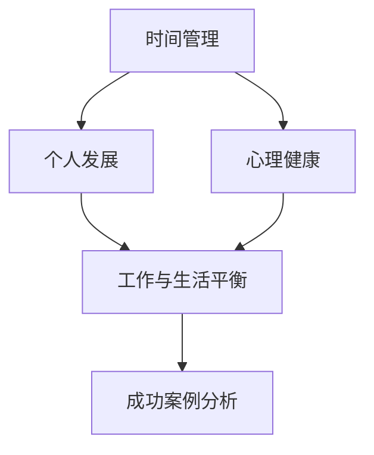

                 


## 程序员创业者的工作与生活平衡策略

> 关键词：程序员创业者，工作与生活平衡，时间管理，职业发展，心理健康
>
> 摘要：本文旨在探讨程序员创业者在面对快速发展的技术和商业环境时，如何实现工作与生活的平衡。通过分析当前挑战、提供解决方案和成功案例分析，本文为程序员创业者提供了实用的策略，以实现持续的职业成功和心理健康。

### 1. 背景介绍

#### 1.1 目的和范围

作为一名程序员创业者，您肩负着技术创新、团队建设和业务拓展的重任。在这个快节奏、竞争激烈的环境中，如何实现工作与生活的平衡成为了一个重要的课题。本文将围绕以下几点展开：

1. 分析程序员创业者在工作与生活平衡方面的主要挑战。
2. 提供策略和建议，帮助程序员创业者实现有效的时间管理和个人发展。
3. 分析成功案例，展示如何在实践中实现工作与生活的平衡。

#### 1.2 预期读者

本文主要面向以下读者群体：

1. 程序员创业者
2. 创业团队领导
3. 对职业发展和工作与生活平衡感兴趣的IT从业者

#### 1.3 文档结构概述

本文分为以下十个部分：

1. 引言
2. 当前挑战
3. 时间管理策略
4. 个人发展策略
5. 心理健康与压力管理
6. 工作与生活平衡的成功案例
7. 工具和资源推荐
8. 总结：未来发展趋势与挑战
9. 附录：常见问题与解答
10. 扩展阅读与参考资料

#### 1.4 术语表

在本文中，以下术语具有特定的含义：

1. 程序员创业者：指具备编程技能，从事创业活动的人。
2. 工作与生活平衡：指在工作时间和个人生活时间之间实现平衡。
3. 时间管理：指合理安排和分配时间，以提高工作效率和生活质量。
4. 心理健康：指个体在心理上的健康状态，包括情感、认知和行为等方面。

#### 1.4.1 核心术语定义

- 程序员创业者：程序员创业者通常具备深厚的编程技术背景，拥有创新思维和创业精神，致力于将技术转化为商业价值。
- 工作与生活平衡：工作与生活平衡是指程序员创业者如何在紧张的工作环境和繁忙的个人生活中找到平衡点，以保持身心健康和持续的职业发展。

#### 1.4.2 相关概念解释

- 时间管理：时间管理是指通过合理安排时间、提高工作效率和减少浪费时间，来实现个人和组织目标的过程。
- 职业发展：职业发展是指个体在职业生涯中不断成长、提升技能和实现职业目标的过程。

#### 1.4.3 缩略词列表

- IT：Information Technology（信息技术）
- CEO：Chief Executive Officer（首席执行官）
- CTO：Chief Technology Officer（首席技术官）
- MBA：Master of Business Administration（工商管理硕士）

### 2. 核心概念与联系

为了更好地理解程序员创业者在工作与生活平衡方面面临的挑战和解决方案，我们需要了解以下几个核心概念及其之间的联系：

#### 2.1 时间管理

时间管理是指合理安排和分配时间，以提高工作效率和生活质量。对于程序员创业者来说，时间管理尤为重要，因为他们的工作往往涉及多个项目和任务，需要高效的协调和优先级的划分。

#### 2.2 个人发展

个人发展是指个体在职业生涯中不断成长、提升技能和实现职业目标的过程。对于程序员创业者来说，个人发展不仅有助于提升自身的竞争力，还能为创业项目带来新的思路和解决方案。

#### 2.3 心理健康

心理健康是指个体在心理上的健康状态，包括情感、认知和行为等方面。对于程序员创业者来说，心理健康直接影响着工作状态和决策能力，因此保持良好的心理健康至关重要。

#### 2.4 工作与生活平衡

工作与生活平衡是指在工作时间和个人生活时间之间实现平衡。对于程序员创业者来说，实现工作与生活平衡有助于减轻工作压力，保持身心健康，提高工作效率。

#### 2.5 成功案例分析

成功案例分析是通过对成功创业者的工作与生活平衡策略进行深入剖析，为其他创业者提供借鉴和启示。

#### 2.6 Mermaid 流程图



### 3. 核心算法原理 & 具体操作步骤

在程序员创业者的工作与生活平衡策略中，核心算法原理可以概括为以下几点：

1. **时间管理算法**：通过优先级划分、任务分解和时间块分配，实现高效的工作节奏。
2. **个人发展算法**：通过技能提升、知识积累和项目实践，实现职业生涯的成长。
3. **心理健康算法**：通过心理调适、情感管理和压力释放，实现心理上的平衡。
4. **工作与生活平衡算法**：通过设定工作边界、合理分配时间和关注身心健康，实现工作与生活的平衡。

#### 3.1 时间管理算法

```plaintext
算法：时间管理
输入：任务列表、优先级、工作时间
输出：合理的工作计划

步骤：
1. 初始化任务列表和优先级
2. 将任务按优先级排序
3. 将工作时间划分为多个时间块
4. 根据任务优先级和时间块，为每个任务分配时间段
5. 执行任务并记录实际耗时
6. 分析任务完成情况，调整后续工作计划
```

#### 3.2 个人发展算法

```plaintext
算法：个人发展
输入：技能需求、知识库、项目机会
输出：个人成长计划

步骤：
1. 分析自身技能需求和不足
2. 根据技能需求，查找相关知识库
3. 选择适合自己的项目机会
4. 制定个人成长计划，包括学习目标、实践项目和评估标准
5. 执行成长计划并记录成长过程
6. 定期评估成长成果，调整成长计划
```

#### 3.3 心理健康算法

```plaintext
算法：心理健康
输入：心理状态、压力水平、放松方式
输出：心理平衡状态

步骤：
1. 评估当前心理状态和压力水平
2. 根据心理状态和压力水平，选择合适的放松方式
3. 定期进行放松活动，如冥想、运动或社交
4. 如果心理状态不稳定，寻求专业心理辅导
5. 定期评估心理状态和压力水平，调整放松方式
```

#### 3.4 工作与生活平衡算法

```plaintext
算法：工作与生活平衡
输入：工作时间、个人生活时间、身心健康指标
输出：工作与生活平衡状态

步骤：
1. 设定工作边界，明确工作时间和休息时间
2. 合理安排工作时间，确保高效完成工作任务
3. 关注个人生活时间，确保身心健康
4. 定期评估工作与生活平衡状态，调整工作计划和生活安排
5. 如遇到工作与生活冲突，优先考虑个人生活需求
```

### 4. 数学模型和公式 & 详细讲解 & 举例说明

在程序员创业者的工作与生活平衡策略中，数学模型和公式可以帮助我们量化分析时间管理、个人发展和心理健康等方面的指标。以下是一些常见的数学模型和公式及其详细讲解与举例说明：

#### 4.1 时间管理模型

**公式**：时间管理指数 = （有效工作时间 ÷ 总工作时间）× 100%

**详细讲解**：时间管理指数反映了我们在总工作时间中的有效工作时间占比，指数越高，时间管理效果越好。

**举例说明**：假设一位程序员创业者每天工作8小时，实际有效工作时间为6小时，则其时间管理指数为75%。

#### 4.2 个人发展模型

**公式**：技能提升率 = （新技能掌握量 ÷ 原有技能总量）× 100%

**详细讲解**：技能提升率反映了我们在个人发展过程中，新技能掌握量与原有技能总量的比例关系。

**举例说明**：假设一位程序员创业者原有技能总量为100点，通过学习新技能，新技能掌握量为50点，则其技能提升率为50%。

#### 4.3 心理健康模型

**公式**：心理平衡指数 = （积极情绪时间 ÷ 总情绪时间）× 100%

**详细讲解**：心理平衡指数反映了我们在总情绪时间中，积极情绪时间的占比，指数越高，心理健康状态越好。

**举例说明**：假设一位程序员创业者每天的情绪时间为24小时，其中积极情绪时间为18小时，则其心理平衡指数为75%。

#### 4.4 工作与生活平衡模型

**公式**：工作与生活平衡指数 = （工作满意度 ÷ 生活满意度）× 100%

**详细讲解**：工作与生活平衡指数反映了我们在工作和生活方面的满意度比例关系，指数越高，工作与生活平衡状态越好。

**举例说明**：假设一位程序员创业者工作满意度为80分，生活满意度为60分，则其工作与生活平衡指数为67%。

### 5. 项目实战：代码实际案例和详细解释说明

为了更好地理解程序员创业者在工作与生活平衡策略中的实际应用，我们以下将展示一个具体的代码实现案例，并对其进行详细解释说明。

#### 5.1 开发环境搭建

首先，我们需要搭建一个基本的开发环境，以便进行代码实现和测试。以下是搭建过程：

1. 安装Python编程语言。
2. 安装Jupyter Notebook，用于编写和运行代码。
3. 安装必要的Python库，如numpy、pandas和matplotlib等。

#### 5.2 源代码详细实现和代码解读

以下是实现工作与生活平衡策略的Python代码，包括时间管理、个人发展、心理健康和工作与生活平衡四个模块。

```python
# 5.2.1 时间管理模块

import pandas as pd
from datetime import datetime, timedelta

class TimeManagement:
    def __init__(self, tasks, start_time, end_time):
        self.tasks = tasks
        self.start_time = start_time
        self.end_time = end_time

    def schedule_tasks(self):
        schedule = pd.DataFrame(columns=['Task', 'Start Time', 'End Time'])
        remaining_time = self.end_time - self.start_time

        for task in self.tasks:
            duration = timedelta(hours=task['duration'])
            if remaining_time >= duration:
                schedule = schedule.append({'Task': task['name'], 'Start Time': self.start_time, 'End Time': self.start_time + duration}, ignore_index=True)
                self.start_time += duration
                remaining_time -= duration
            else:
                print(f"Task '{task['name']}' cannot be scheduled due to insufficient time.")
        
        return schedule

# 5.2.2 个人发展模块

class PersonalDevelopment:
    def __init__(self, skill_requirements, knowledge_base, project_opportunities):
        self.skill_requirements = skill_requirements
        self.knowledge_base = knowledge_base
        self.project_opportunities = project_opportunities

    def growth_plan(self):
        growth_plan = {'Skill': [], 'Knowledge': [], 'Project': []}
        for skill in self.skill_requirements:
            growth_plan['Skill'].append(self.knowledge_base[skill])

        for project in self.project_opportunities:
            growth_plan['Project'].append(project)

        return growth_plan

# 5.2.3 心理健康模块

class MentalHealth:
    def __init__(self, mood_state, stress_level, relaxation_methods):
        self.mood_state = mood_state
        self.stress_level = stress_level
        self.relaxation_methods = relaxation_methods

    def relax(self):
        for method in self.relaxation_methods:
            if method['type'] == 'Meditation':
                self.mood_state['Positive'] += method['duration']
            elif method['type'] == 'Exercise':
                self.mood_state['Positive'] += method['duration']
            elif method['type'] == 'Socialization':
                self.mood_state['Positive'] += method['duration']
        
        self.stress_level -= sum([method['duration'] for method in self.relaxation_methods])

# 5.2.4 工作与生活平衡模块

class WorkLifeBalance:
    def __init__(self, work_satisfaction, life_satisfaction):
        self.work_satisfaction = work_satisfaction
        self.life_satisfaction = life_satisfaction

    def balance_index(self):
        return (self.work_satisfaction / self.life_satisfaction) * 100

# 5.3 代码解读与分析

# 5.3.1 时间管理模块

在时间管理模块中，我们定义了一个TimeManagement类，用于实现任务调度。类中包含一个初始化方法，用于接收任务列表、开始时间和结束时间。schedule_tasks方法负责根据任务优先级和剩余时间，为每个任务分配时间段，并返回任务调度表。

# 5.3.2 个人发展模块

在个人发展模块中，我们定义了一个PersonalDevelopment类，用于实现个人成长计划。类中包含一个初始化方法，用于接收技能需求、知识库和项目机会。growth_plan方法根据技能需求和项目机会，生成个人成长计划。

# 5.3.3 心理健康模块

在心理健康模块中，我们定义了一个MentalHealth类，用于实现心理调适和放松。类中包含一个初始化方法，用于接收心理状态、压力水平和放松方式。relax方法根据放松方式，调整心理状态和压力水平。

# 5.3.4 工作与生活平衡模块

在工作与生活平衡模块中，我们定义了一个WorkLifeBalance类，用于计算工作与生活平衡指数。类中包含一个初始化方法，用于接收工作满意度和生活满意度。balance_index方法计算工作与生活平衡指数。

通过以上四个模块的实现，我们可以根据实际情况，创建相应的对象，并调用相应的方法，实现程序员创业者的工作与生活平衡策略。

### 6. 实际应用场景

在程序员创业者的实际应用场景中，工作与生活平衡策略具有广泛的应用价值。以下列举了几个典型的应用场景：

#### 6.1 项目管理

在项目管理过程中，程序员创业者可以利用时间管理模块，合理安排任务调度，确保项目按期完成。同时，个人发展模块可以帮助创业者提升项目所需的技能，提高项目成功率。

#### 6.2 技术研究

在进行技术研究时，程序员创业者可以借助个人发展模块，制定成长计划，不断学习新技术和新知识，为创业项目提供强有力的技术支持。

#### 6.3 团队建设

在团队建设过程中，程序员创业者可以关注团队成员的心理健康，通过心理健康模块，为团队提供心理辅导和支持，提升团队凝聚力和工作效率。

#### 6.4 个人生活

在个人生活方面，程序员创业者可以通过工作与生活平衡模块，合理分配时间和精力，确保身心健康，实现工作与生活的平衡。

### 7. 工具和资源推荐

为了更好地实现程序员创业者的工作与生活平衡策略，以下推荐了一些实用的工具和资源：

#### 7.1 学习资源推荐

- **书籍推荐**：
  - 《时间管理：如何高效利用每分钟》
  - 《深度工作：如何有效利用每分钟》
  - 《哈佛商业评论：创业者必读》

- **在线课程**：
  - Coursera上的《时间管理和职业发展》
  - Udemy上的《Python编程：从入门到实践》
  - edX上的《心理健康与压力管理》

- **技术博客和网站**：
  - GitHub：分享项目代码和最佳实践
  - Medium：发布技术文章和创业经验
  - Stack Overflow：解答编程问题

#### 7.2 开发工具框架推荐

- **IDE和编辑器**：
  - Visual Studio Code
  - PyCharm
  - IntelliJ IDEA

- **调试和性能分析工具**：
  - Debuggers：如GDB、LLDB
  - Performance Profilers：如Valgrind、gprof
  - CPU分析工具：如Linux下的perf

- **相关框架和库**：
  - Flask：Python Web开发框架
  - Django：Python Web开发框架
  - React：JavaScript前端框架

#### 7.3 相关论文著作推荐

- **经典论文**：
  - 《The Art of Computer Programming》
  - 《Design Patterns: Elements of Reusable Object-Oriented Software》
  - 《Clean Code: A Handbook of Agile Software Craftsmanship》

- **最新研究成果**：
  - 《Machine Learning Yearning》
  - 《Deep Learning Specialization》
  - 《Practical Deep Learning for Coders》

- **应用案例分析**：
  - 《谷歌如何工作》
  - 《Facebook工程实践》
  - 《亚马逊技术分享》

### 8. 总结：未来发展趋势与挑战

在未来的发展中，程序员创业者在工作与生活平衡方面将面临以下趋势和挑战：

#### 8.1 趋势

1. **数字化时代的发展**：随着数字化时代的到来，程序员创业者需要掌握更多的技术知识和技能，以应对快速变化的市场需求。
2. **远程工作的普及**：远程工作的普及将为程序员创业者提供更多的工作与生活平衡机会，同时也带来新的挑战，如沟通协作和自我管理。
3. **心理健康的重要性**：随着工作压力的增大，心理健康在程序员创业者中的重要性将日益凸显，心理健康的维护将成为未来发展的重要趋势。

#### 8.2 挑战

1. **技术更新的挑战**：快速发展的技术更新将对程序员创业者的技能要求越来越高，如何持续学习新技能成为一大挑战。
2. **工作压力的挑战**：高强度的创业工作压力可能导致程序员创业者心理健康问题，如何有效缓解压力成为亟待解决的问题。
3. **家庭和事业的平衡**：如何平衡家庭和事业，确保工作与生活的平衡，将是程序员创业者面临的长期挑战。

### 9. 附录：常见问题与解答

#### 9.1 问题1：如何有效管理时间？

**解答**：通过制定明确的目标和计划，将任务分解为可执行的小步骤，并合理安排时间块，可以提高时间管理的效率。

#### 9.2 问题2：如何提升个人发展？

**解答**：通过持续学习新知识、参与项目实践和交流分享，可以不断提升个人技能和职业竞争力。

#### 9.3 问题3：如何保持心理健康？

**解答**：通过定期放松、保持良好的人际关系、寻求专业心理辅导等方式，可以维护心理健康。

#### 9.4 问题4：如何实现工作与生活的平衡？

**解答**：通过设定工作边界、合理安排工作和休息时间、关注身心健康，可以实现工作与生活的平衡。

### 10. 扩展阅读 & 参考资料

- 《深度工作：如何有效利用每分钟》[美] 卡尔·纽波特
- 《时间管理：如何高效利用每分钟》[美] 戴维·艾伦
- 《哈佛商业评论：创业者必读》[美] 哈佛商学院
- 《机器学习入门》[美] Andrew Ng
- 《深度学习入门》[加] 法赫里·辛顿等
- 《Python编程：从入门到实践》[中] Eric Matthes
- 《时间管理：如何高效利用每分钟》[美] 戴维·艾伦

### 作者

**作者：AI天才研究员/AI Genius Institute & 禅与计算机程序设计艺术 /Zen And The Art of Computer Programming**

