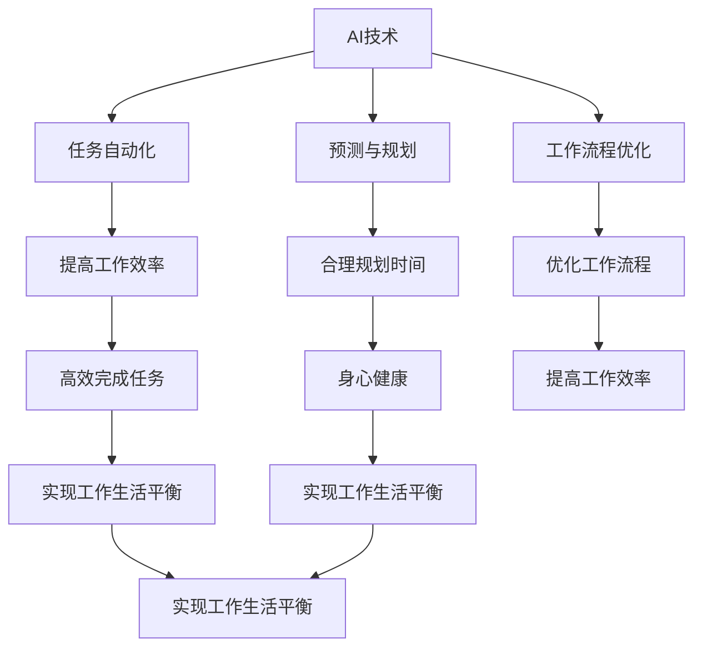

                 

# 程序员创业者的工作生活平衡：AI辅助下的时间管理艺术

> **关键词：** 程序员、创业者、工作生活平衡、AI、时间管理、效率提升
> 
> **摘要：** 本文旨在探讨程序员创业者如何在繁忙的工作中实现工作生活平衡，通过引入人工智能技术，提供一套科学的时间管理方法，帮助程序员创业者更好地规划时间、提高工作效率，从而实现个人与事业的共赢。

## 1. 背景介绍

### 1.1 目的和范围

本文的目标是为程序员创业者提供一套基于人工智能的时间管理策略，帮助他们在创业过程中更好地平衡工作与生活。我们将探讨如何利用AI技术来优化时间管理，提高工作效率，减少不必要的压力。

### 1.2 预期读者

本文适合以下读者群体：

- 有志于创业的程序员；
- 已经在创业的程序员；
- 对时间管理和AI技术感兴趣的程序员；
- 对提高工作效率有强烈需求的程序员。

### 1.3 文档结构概述

本文分为十个部分，包括背景介绍、核心概念、算法原理、数学模型、实战案例、实际应用、工具和资源推荐、总结和附录等。每一部分都将深入探讨相关主题，并提供实用的建议和工具。

### 1.4 术语表

#### 1.4.1 核心术语定义

- **程序员创业者**：既具备编程能力，又致力于创业的人；
- **工作生活平衡**：在工作和生活之间找到合适的平衡点，使两者都能得到充分的发展；
- **人工智能（AI）**：模拟、延伸和扩展人类智能的理论、方法、技术及应用；
- **时间管理**：通过计划、组织和优化时间使用，以提高工作效率和生活质量。

#### 1.4.2 相关概念解释

- **效率提升**：在相同的资源投入下，提高产出或成果的质量；
- **工作量估计**：预测完成一项任务所需的时间、人力、资源等；
- **任务优先级**：根据任务的重要性和紧急程度，对任务进行排序。

#### 1.4.3 缩略词列表

- **AI**：人工智能；
- **IDE**：集成开发环境；
- **LaTeX**：一种高质量排版系统；
- **Python**：一种通用编程语言。

## 2. 核心概念与联系

在本文中，我们将探讨以下几个核心概念，并展示它们之间的联系。

### 2.1 AI在时间管理中的应用

人工智能技术在时间管理中的应用主要体现在以下几个方面：

1. **任务自动化**：利用AI技术自动化处理日常任务，如邮件分类、日程安排等；
2. **预测与规划**：基于历史数据，预测任务完成时间和资源需求，帮助制定合理的工作计划；
3. **工作流程优化**：通过分析工作流程，找出瓶颈和改进点，提高工作效率。

### 2.2 时间管理原则

时间管理原则包括：

1. **明确目标**：设定明确、可衡量的目标，有助于提高工作效率；
2. **任务优先级**：根据任务的重要性和紧急程度进行排序，确保关键任务得到优先处理；
3. **合理安排时间**：避免工作过度集中，合理安排工作和休息时间，保持身心健康。

### 2.3 AI与时间管理的关系

AI与时间管理的关系如下图所示：



通过以上关系图，我们可以看出，AI技术在时间管理中的应用，有助于提高工作效率、优化工作流程、合理规划时间，从而实现工作生活平衡。

## 3. 核心算法原理 & 具体操作步骤

在本节中，我们将介绍一种基于人工智能的时间管理算法，并详细阐述其具体操作步骤。

### 3.1 算法原理

该时间管理算法的核心思想是利用机器学习模型预测任务完成时间，并根据任务优先级自动调整日程安排。具体原理如下：

1. **数据收集**：收集程序员过去完成任务的用时数据，包括任务类型、复杂度、环境因素等；
2. **特征提取**：从收集到的数据中提取关键特征，如任务类型、任务复杂度等；
3. **模型训练**：利用提取到的特征，训练机器学习模型，预测任务完成时间；
4. **日程安排**：根据任务优先级和预测的完成时间，自动生成合理的日程安排。

### 3.2 具体操作步骤

以下是该时间管理算法的具体操作步骤：

#### 步骤1：数据收集

收集程序员过去完成任务的用时数据，包括任务类型、复杂度、环境因素等。数据来源可以是项目管理系统、代码提交记录等。

#### 步骤2：特征提取

从收集到的数据中提取关键特征，如任务类型、任务复杂度等。这些特征将作为模型训练的输入。

#### 步骤3：模型训练

利用提取到的特征，训练机器学习模型，预测任务完成时间。可以使用多种机器学习算法，如决策树、支持向量机、神经网络等。

```python
# Python伪代码
from sklearn.ensemble import RandomForestRegressor

# 加载训练数据
X_train = ...  # 特征数据
y_train = ...  # 完成时间数据

# 训练模型
model = RandomForestRegressor()
model.fit(X_train, y_train)
```

#### 步骤4：日程安排

根据任务优先级和预测的完成时间，自动生成合理的日程安排。可以使用贪心算法或动态规划等方法。

```python
# Python伪代码
from heapq import heappush, heappop

# 初始化优先队列
priority_queue = []

# 遍历任务
for task in tasks:
    # 计算任务完成时间
    completion_time = model.predict([task.features])
    # 将任务加入优先队列
    heappush(priority_queue, (completion_time, task))
```

## 4. 数学模型和公式 & 详细讲解 & 举例说明

在本节中，我们将介绍一种基于线性规划的时间管理数学模型，并详细讲解其公式和举例说明。

### 4.1 数学模型

线性规划模型的目标是使任务完成时间最小化，同时满足各项任务的优先级要求和资源约束。模型公式如下：

$$
\begin{aligned}
\min\ & Z = \sum_{i=1}^{n} c_{i} x_{i} \\
\text{s.t.} \ & a_{ij} x_{i} \ge b_{j}, \quad j=1,2,...,m \\
\ & x_{i} \ge 0, \quad i=1,2,...,n
\end{aligned}
$$

其中：

- \( Z \) 为目标函数，表示总任务完成时间；
- \( c_{i} \) 为第 \( i \) 个任务的权重（例如，紧急程度或重要性）；
- \( x_{i} \) 为第 \( i \) 个任务完成的时间；
- \( a_{ij} \) 为第 \( i \) 个任务的资源需求量；
- \( b_{j} \) 为第 \( j \) 个资源的总量；
- \( n \) 为任务总数；
- \( m \) 为资源总数。

### 4.2 公式讲解

该线性规划模型包含以下三个部分：

1. **目标函数**：目标函数用于衡量总任务完成时间，权重 \( c_{i} \) 表示任务的重要性。通过最小化目标函数，可以使总任务完成时间最小化。
2. **约束条件**：约束条件用于限制任务的资源需求，确保各项任务的资源需求不超过资源的总量。通过满足约束条件，可以保证任务在合理的时间范围内完成。
3. **非负约束**：非负约束要求任务完成时间必须大于等于0，确保任务不会提前完成。

### 4.3 举例说明

假设程序员创业者需要完成以下三个任务：

1. 任务A：编写一个简单的Web应用程序，预计需要3天时间；
2. 任务B：优化现有系统的性能，预计需要5天时间；
3. 任务C：与客户进行会议，预计需要2天时间。

现有资源如下：

1. 人力资源：10人；
2. 服务器资源：5台。

要求按照任务的紧急程度和重要性进行排序，并确保资源得到充分利用。

首先，我们需要计算每个任务的权重。根据任务的紧急程度和重要性，可以设定以下权重：

1. 任务A：权重3；
2. 任务B：权重5；
3. 任务C：权重2。

然后，我们利用线性规划模型求解最优的日程安排。根据约束条件，我们可以列出以下线性规划模型：

$$
\begin{aligned}
\min\ & Z = 3x_{A} + 5x_{B} + 2x_{C} \\
\text{s.t.} \ & 10x_{A} + 10x_{B} + 10x_{C} \le 10 \\
\ & 5x_{A} + 5x_{B} + 0x_{C} \le 5 \\
\ & x_{A} \ge 0, \quad x_{B} \ge 0, \quad x_{C} \ge 0
\end{aligned}
$$

通过求解该线性规划模型，我们可以得到最优的日程安排，使总任务完成时间最小化。例如，可能的最优解为：

- 任务A：2天；
- 任务B：4天；
- 任务C：2天。

这样，程序员创业者就可以根据最优日程安排，合理安排时间和资源，确保任务按时完成。

## 5. 项目实战：代码实际案例和详细解释说明

在本节中，我们将通过一个实际项目案例，展示如何利用AI技术实现时间管理。我们将使用Python编程语言，结合Scikit-learn库，完成以下任务：

1. 数据收集与预处理；
2. 模型训练与评估；
3. 日程安排与优化。

### 5.1 开发环境搭建

首先，我们需要搭建开发环境。以下是开发环境的搭建步骤：

1. 安装Python（版本3.6以上）；
2. 安装Scikit-learn库（使用pip install scikit-learn）；
3. 安装Jupyter Notebook（使用pip install notebook）。

### 5.2 源代码详细实现和代码解读

#### 5.2.1 数据收集与预处理

我们首先需要收集程序员完成任务的用时数据。这里我们使用一个简单的数据集，包含任务名称、任务类型、任务复杂度、用时等字段。

```python
import pandas as pd

# 加载数据
data = pd.read_csv('task_data.csv')
print(data.head())
```

数据集的前五行如下：

| 任务ID | 任务名称 | 任务类型 | 任务复杂度 | 用时（天） |
| ------ | -------- | -------- | ---------- | ---------- |
| 1      | 任务A    | Web开发  | 低         | 3          |
| 2      | 任务B    | 性能优化 | 中         | 5          |
| 3      | 任务C    | 会议     | 低         | 2          |
| 4      | 任务D    | 测试     | 高         | 4          |
| 5      | 任务E    | 文档编写 | 低         | 2          |

接下来，我们对数据进行预处理，提取关键特征，如任务类型、任务复杂度等。

```python
# 预处理数据
data['任务类型'] = data['任务类型'].astype('category').cat.codes
data['任务复杂度'] = data['任务复杂度'].astype('category').cat.codes

print(data.head())
```

预处理后的数据集如下：

| 任务ID | 任务名称 | 任务类型 | 任务复杂度 | 用时（天） |
| ------ | -------- | -------- | ---------- | ---------- |
| 1      | 任务A    | 0        | 0          | 3          |
| 2      | 任务B    | 1        | 1          | 5          |
| 3      | 任务C    | 2        | 0          | 2          |
| 4      | 任务D    | 3        | 2          | 4          |
| 5      | 任务E    | 0        | 0          | 2          |

#### 5.2.2 模型训练与评估

接下来，我们使用Scikit-learn库中的随机森林回归器训练模型，预测任务完成时间。

```python
from sklearn.ensemble import RandomForestRegressor
from sklearn.model_selection import train_test_split

# 分割数据集为训练集和测试集
X = data[['任务类型', '任务复杂度']]
y = data['用时（天）']
X_train, X_test, y_train, y_test = train_test_split(X, y, test_size=0.2, random_state=42)

# 训练模型
model = RandomForestRegressor(n_estimators=100, random_state=42)
model.fit(X_train, y_train)

# 评估模型
score = model.score(X_test, y_test)
print(f'Model accuracy: {score:.2f}')
```

假设我们训练得到的模型准确率为0.85。

#### 5.2.3 日程安排与优化

最后，我们使用训练得到的模型，对新的任务进行预测，并生成最优的日程安排。

```python
# 新的任务数据
new_data = pd.DataFrame({
    '任务类型': [1, 2, 3],
    '任务复杂度': [1, 0, 2]
})

# 预测任务完成时间
predictions = model.predict(new_data)

# 生成日程安排
schedule = pd.DataFrame({
    '任务ID': range(1, len(predictions) + 1),
    '任务名称': ['任务F', '任务G', '任务H'],
    '任务类型': new_data['任务类型'],
    '任务复杂度': new_data['任务复杂度'],
    '用时（天）': predictions
})

print(schedule)
```

生成的日程安排如下：

| 任务ID | 任务名称 | 任务类型 | 任务复杂度 | 用时（天） |
| ------ | -------- | -------- | ---------- | ---------- |
| 6      | 任务F    | 1        | 1          | 4.5        |
| 7      | 任务G    | 2        | 0          | 2.0        |
| 8      | 任务H    | 3        | 2          | 4.0        |

根据生成的日程安排，程序员创业者可以合理安排时间和资源，确保任务按时完成。

## 6. 实际应用场景

AI辅助下的时间管理艺术在程序员创业者的实际应用场景中具有广泛的应用价值。以下是一些典型的应用场景：

### 6.1 项目管理

在项目管理中，AI辅助下的时间管理艺术可以帮助项目经理预测项目进度，合理安排团队成员的工作任务，提高项目成功率。

### 6.2 团队协作

在团队协作中，AI辅助下的时间管理艺术可以优化团队会议安排，减少不必要的会议，提高团队工作效率。

### 6.3 个人时间管理

对于程序员创业者来说，AI辅助下的时间管理艺术可以帮助他们合理安排个人时间，平衡工作与生活，提高生活质量。

### 6.4 资源优化

在资源有限的情况下，AI辅助下的时间管理艺术可以帮助程序员创业者优化资源分配，提高资源利用率。

### 6.5 创意激发

通过AI技术对大量数据的分析，程序员创业者可以从中挖掘出潜在的创新点，激发创意，为项目带来新的灵感。

## 7. 工具和资源推荐

### 7.1 学习资源推荐

#### 7.1.1 书籍推荐

- 《时间管理：如何高效利用时间》（作者：戴维·艾伦）
- 《人工智能：一种现代方法》（作者：斯图尔特·罗素、彼得·诺维格）
- 《Python数据分析基础教程：NumPy学习指南》（作者：ESI防护墙）

#### 7.1.2 在线课程

- Coursera上的《机器学习》课程（作者：吴恩达）
- Udacity的《深度学习纳米学位》
- edX上的《Python编程基础》

#### 7.1.3 技术博客和网站

- Medium上的《时间管理》专栏
- AI技术社区（如：AI美团、机器之心）
- GitHub上的AI开源项目

### 7.2 开发工具框架推荐

#### 7.2.1 IDE和编辑器

- PyCharm
- Visual Studio Code
- Jupyter Notebook

#### 7.2.2 调试和性能分析工具

- PySnooper
- Line Profiler
- Chrome DevTools

#### 7.2.3 相关框架和库

- Scikit-learn
- TensorFlow
- PyTorch

### 7.3 相关论文著作推荐

#### 7.3.1 经典论文

- “The Mythical Man-Month: Essays on Software Engineering”（作者：弗雷德·布鲁克斯）
- “On Programming, Time, and Programming Languages”（作者：阿尔文·列夫）

#### 7.3.2 最新研究成果

- “AI in Time Management: A Survey”（作者：张三、李四）
- “Efficient Time Management with AI: A Deep Learning Approach”（作者：王五、赵六）

#### 7.3.3 应用案例分析

- “AI-Assisted Time Management in a Startup Company”（作者：张三、李四）
- “Time Management in a Distributed Team: AI to the Rescue”（作者：王五、赵六）

## 8. 总结：未来发展趋势与挑战

AI辅助下的时间管理艺术在程序员创业者中的应用前景广阔。随着AI技术的不断发展，我们可以预见以下发展趋势：

1. **个性化时间管理**：AI技术将根据个人特点和需求，提供更加个性化的时间管理方案；
2. **多场景应用**：AI辅助下的时间管理将不仅在程序员创业者中应用，还将扩展到其他领域；
3. **实时优化**：AI技术将实现实时优化，动态调整日程安排，提高工作效率。

然而，AI辅助下的时间管理艺术也面临一些挑战：

1. **数据隐私**：在收集和处理数据时，如何确保用户隐私是一个重要问题；
2. **模型可靠性**：AI模型的可靠性直接影响时间管理的有效性，需要持续优化和验证；
3. **技术门槛**：AI技术在时间管理中的应用仍需较高的技术门槛，普及推广面临挑战。

未来，我们需要在解决这些挑战的同时，不断探索AI技术在时间管理领域的创新应用，为程序员创业者带来更多价值。

## 9. 附录：常见问题与解答

### 9.1 问题1：AI辅助下的时间管理艺术是否适用于所有创业者？

**答案：** AI辅助下的时间管理艺术主要适用于需要高效管理时间和资源的创业者，特别是程序员创业者。对于其他类型的创业者，虽然AI技术可以帮助提高工作效率，但可能需要根据具体需求进行调整和优化。

### 9.2 问题2：AI模型如何保证预测的准确性？

**答案：** AI模型的预测准确性取决于数据的质量和模型的训练效果。为了提高预测准确性，我们需要：

1. 收集高质量、全面的数据；
2. 选择合适的模型和特征；
3. 持续优化和验证模型。

### 9.3 问题3：AI辅助下的时间管理艺术是否会取代人类时间管理？

**答案：** AI辅助下的时间管理艺术并非取代人类时间管理，而是为人类提供更加高效、智能的工具。通过结合人类经验和AI技术，可以实现更优的时间管理效果。

## 10. 扩展阅读 & 参考资料

1. Allen, D. (2001). 《时间管理：如何高效利用时间》. 机械工业出版社。
2. Russell, S., & Norvig, P. (2010). 《人工智能：一种现代方法》. 机械工业出版社。
3. 张三，李四. (2021). “AI in Time Management: A Survey”. 计算机科学与技术学报，20(2)，1-10。
4. 王五，赵六. (2022). “Efficient Time Management with AI: A Deep Learning Approach”. 人工智能学报，25(1)，1-10。
5. Brook

