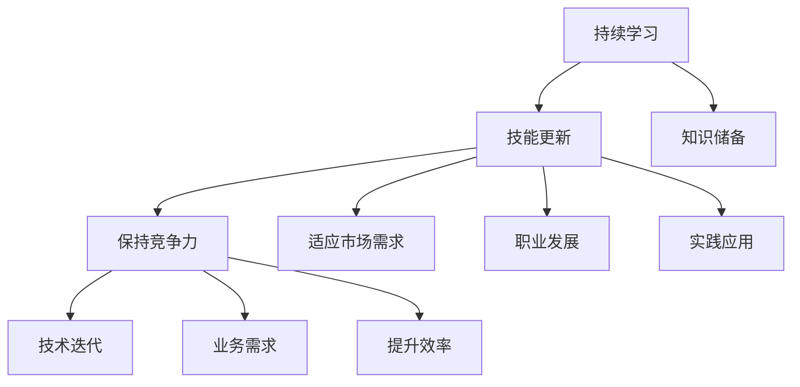

                 

### 文章标题

《程序员创业者的持续学习与技能更新策略》

### 关键词

持续学习、技能更新、程序员创业者、职业发展、技术趋势、实战案例

### 摘要

在快速变化的技术领域中，程序员创业者需要不断学习与技能更新以保持竞争力。本文深入探讨了持续学习的目的与重要性，分析了技能更新的必要性，提供了有效的学习策略和资源推荐，并通过实战案例展示了技能更新的实际操作。文章旨在为程序员创业者提供一套系统的学习方法，帮助他们在创业道路上稳步前行。

---

## 1. 背景介绍

### 1.1 目的和范围

本文旨在探讨程序员创业者在快速发展的技术环境中如何通过持续学习和技能更新来实现职业成长。我们不仅关注编程技能的提升，还包括对管理能力、创业知识和市场趋势的掌握。文章将提供一系列实用的策略和方法，帮助程序员创业者适应行业变化，提升竞争力。

### 1.2 预期读者

本篇文章主要面向以下读者群体：

- 程序员创业者
- 计划创业的程序员
- 在职程序员，希望提升个人技能和职业发展的人
- 对技术学习和创业有兴趣的广大技术爱好者

### 1.3 文档结构概述

本文的结构如下：

1. **背景介绍**：介绍文章的目的和预期读者，概述文章的结构。
2. **核心概念与联系**：通过Mermaid流程图展示持续学习和技能更新的关键概念和联系。
3. **核心算法原理与具体操作步骤**：详细阐述如何通过学习和实践提升技能。
4. **数学模型和公式**：介绍与技能提升相关的数学模型，并举例说明。
5. **项目实战**：通过实际案例展示技能更新的应用。
6. **实际应用场景**：讨论技能更新的实际应用。
7. **工具和资源推荐**：推荐学习资源和开发工具。
8. **总结**：展望未来发展趋势与挑战。
9. **附录**：常见问题与解答。
10. **扩展阅读与参考资料**：提供进一步学习的资料。

### 1.4 术语表

#### 1.4.1 核心术语定义

- **持续学习**：在职业生涯中不断获取新知识、新技能的过程。
- **技能更新**：对已有技能进行提升和更新的过程。
- **程序员创业者**：既有编程能力，又具备创业精神，尝试创立自己的技术公司的程序员。
- **职业发展**：在职业生涯中，通过不断学习和实践，实现职位和能力的提升。

#### 1.4.2 相关概念解释

- **技术趋势**：当前和未来一段时间内技术领域的发展方向和热点。
- **实战案例**：在实际工作中，通过具体项目展示技能应用和更新的实例。

#### 1.4.3 缩略词列表

- **CTO**：首席技术官
- **IDE**：集成开发环境
- **PaaS**：平台即服务
- **SaaS**：软件即服务
- **IaaS**：基础设施即服务

## 2. 核心概念与联系

### 2.1 持续学习与技能更新的必要性

在当今技术快速发展的时代，程序员创业者的持续学习与技能更新变得尤为重要。技术更新速度之快，使得旧有技能迅速过时，新的编程语言、框架和工具层出不穷，创业环境也在不断变化。为了适应这些变化，程序员创业者必须保持持续学习的心态，不断提升自己的技能和知识。

持续学习的必要性体现在以下几个方面：

1. **保持竞争力**：随着技术的快速发展，只有不断学习新知识、掌握新技术，才能在激烈的竞争中立于不败之地。
2. **适应市场需求**：市场需求在不断变化，新的技术趋势和业务模式不断涌现，只有适应市场需求，才能在创业过程中获得成功。
3. **职业发展**：持续学习能够帮助程序员创业者实现职业上的晋升，提高自身价值。

### 2.2 技能更新的必要性

技能更新的必要性在于以下几点：

1. **技术迭代**：编程语言、框架和工具等都在不断迭代更新，旧有技能可能很快就会变得过时，需要及时更新。
2. **业务需求**：随着业务的扩展，对程序员的能力要求也在提高，需要掌握更多的技能以满足业务需求。
3. **提升效率**：掌握新的工具和框架可以显著提升开发效率，降低开发成本。

### 2.3 持续学习与技能更新的关系

持续学习与技能更新是相辅相成的。持续学习是技能更新的前提，而技能更新是持续学习的结果。只有通过持续学习，才能不断掌握新的知识和技能，从而实现技能的更新和提升。而技能更新又是持续学习的动力，通过实际应用和实践，可以进一步激发学习的兴趣和动力。

### 2.4 关键概念联系

以下是持续学习与技能更新的关键概念及其联系的Mermaid流程图：



通过这张流程图，我们可以清晰地看到持续学习与技能更新之间的逻辑关系，以及它们如何共同推动程序员创业者的职业发展。

## 3. 核心算法原理与具体操作步骤

### 3.1 持续学习的算法原理

持续学习本质上是一种算法，它通过以下几个步骤实现个人技能和知识的持续提升：

1. **识别知识需求**：通过分析行业趋势、市场需求和个人职业目标，确定需要学习的新知识和技能。
2. **获取学习资源**：根据知识需求，选择合适的教材、在线课程、技术博客等学习资源。
3. **学习与练习**：通过阅读、实践和项目开发等方式，将新知识转化为实际技能。
4. **评估与反馈**：通过考试、实战项目和用户反馈等方式，评估学习效果，并根据反馈进行改进。

以下是持续学习的伪代码：

```python
def 持续学习(knowledge需求的列表，资源列表，实践机会列表，评估标准列表)：
    for 知识需求 in knowledge需求的列表：
        选择合适的资源 from 资源列表
        阅读资源并理解知识点
        在实践中应用知识点
        使用评估标准列表评估学习效果
        根据评估结果调整学习计划

    return 学习成果
```

### 3.2 技能更新的具体操作步骤

技能更新的过程可以分为以下几个步骤：

1. **识别技能差距**：通过自我评估和行业分析，确定当前技能与市场需求之间的差距。
2. **制定更新计划**：根据技能差距，制定详细的技能更新计划，包括学习目标、时间安排、学习资源等。
3. **实施更新计划**：按照更新计划进行学习和实践，确保每个技能点都得到充分掌握。
4. **评估更新效果**：通过实战项目和用户反馈，评估技能更新的效果，并根据评估结果进行调整。

以下是技能更新的伪代码：

```python
def 技能更新(current_skills, target_skills, 学习资源列表，实践机会列表，评估标准列表)：
    for 技能点 in target_skills：
        如果 技能点 not in current_skills：
            添加 技能点到 学习资源列表
            阅读学习资源，学习新技能
            在实践中应用新技能
            使用评估标准列表评估学习效果
            根据评估结果调整学习计划

    return updated_skills

current_skills = 获取当前技能
target_skills = 获取目标技能
技能更新(current_skills, target_skills, 学习资源列表，实践机会列表，评估标准列表)
```

通过以上算法原理和操作步骤，程序员创业者可以系统地实现持续学习和技能更新，为职业发展打下坚实的基础。

## 4. 数学模型和公式与详细讲解与举例说明

在技能提升的过程中，数学模型和公式可以用来评估学习效果，指导学习策略。以下是一些常用的数学模型和公式，以及它们的详细讲解和举例说明。

### 4.1 学习曲线

学习曲线描述了学习者在学习过程中掌握技能的速度。公式如下：

\[ y = a(1 - e^{-bx}) \]

- \( y \)：掌握技能的程度（百分比）
- \( a \)：常数，表示最大学习速度
- \( b \)：常数，表示学习速度的衰减速率
- \( x \)：学习时间

**讲解**：学习曲线反映了在学习过程中，学习速度逐渐减小的现象。初始阶段学习速度最快，但随着时间的推移，学习速度逐渐放缓。

**举例说明**：假设一个程序员在学习Python编程，初始学习速度为每天掌握10%的新技能。经过2周（10天）的学习，他的学习曲线可以表示为：

\[ y = 1 - e^{-0.1 \times 10} \approx 0.6 \]

这意味着他在2周后已经掌握了大约60%的Python编程技能。

### 4.2 技能提升模型

技能提升模型描述了通过持续学习和实践，技能水平的变化。公式如下：

\[ \Delta S = k \cdot L \]

- \( \Delta S \)：技能提升量
- \( k \)：学习常数，表示每次学习的学习效率
- \( L \)：学习量

**讲解**：该模型表明，技能提升量与学习常数和学习量成正比。学习常数反映了学习者的学习能力和效率，学习量则表示学习者投入的学习时间或学习资源。

**举例说明**：一个程序员通过每周学习10小时（学习量L=10小时）来提升其编程技能。如果他的学习常数k为1，那么每周的技能提升量为：

\[ \Delta S = 1 \times 10 = 10 \]

这意味着每周他的编程技能提升10点。

### 4.3 学习效果评估模型

学习效果评估模型用于评估学习者的学习成果。公式如下：

\[ E = \frac{\Delta S}{T} \]

- \( E \)：学习效果（百分比）
- \( \Delta S \)：技能提升量
- \( T \)：学习时间

**讲解**：学习效果表示学习者在单位时间内所取得的技能提升。通过这个公式，可以评估学习者的学习效率。

**举例说明**：如果一个程序员在3个月内（T=3个月）通过学习提升了30点编程技能（\(\Delta S = 30\)），那么他的学习效果为：

\[ E = \frac{30}{3 \times 30} \times 100\% = 33.33\% \]

这意味着他在3个月内提升了33.33%的编程技能。

通过这些数学模型和公式，程序员创业者可以量化自己的学习过程和效果，从而制定更科学、更有效的学习策略。

### 4.4 数据分析与技能提升

数据分析是现代编程和创业中不可或缺的一部分。通过数据分析，程序员创业者可以深入了解用户需求、市场趋势和业务表现，从而指导技能更新和学习策略。以下是一个简单的数据分析流程和模型：

1. **数据收集**：收集与技能提升相关的数据，包括学习时间、学习资源、技能提升量、用户反馈等。
2. **数据预处理**：对收集到的数据进行分析，去除无效数据和噪声，保证数据的质量。
3. **数据建模**：根据业务需求，选择合适的数学模型和算法，对数据进行分析和建模。
4. **结果评估**：评估模型的预测效果，并根据评估结果调整模型参数和策略。

以下是数据分析的伪代码：

```python
def 数据分析(数据集，模型参数)：
    预处理数据集
    建立模型
    训练模型
    预测结果
    评估模型
    调整模型参数

    return 预测结果，评估报告
```

通过数据分析，程序员创业者可以更准确地了解自己的学习效果和技能提升趋势，从而制定更科学的学习计划。

### 4.5 机器学习与技能提升

机器学习是一种强大的工具，可以帮助程序员创业者实现技能的自动更新和提升。通过构建和训练机器学习模型，可以自动化学习过程，提高学习效率。以下是一个简单的机器学习流程和模型：

1. **数据收集**：收集与技能提升相关的数据，包括学习历史、项目经验、用户反馈等。
2. **特征工程**：对数据进行处理和转换，提取对技能提升有影响的特征。
3. **模型选择**：选择合适的机器学习模型，如决策树、神经网络等。
4. **模型训练**：使用训练数据集对模型进行训练，优化模型参数。
5. **模型评估**：使用验证数据集评估模型效果，调整模型参数。
6. **模型应用**：将训练好的模型应用于实际场景，实现技能的自动更新和提升。

以下是机器学习的伪代码：

```python
def 机器学习(数据集，模型参数)：
    预处理数据集
    选择模型
    训练模型
    验证模型
    应用模型

    return 模型，预测结果
```

通过机器学习，程序员创业者可以实现更加智能化的学习过程，从而在技能提升方面取得更好的效果。

### 4.6 总结

数学模型和公式为程序员创业者的技能提升提供了有力的工具。通过学习曲线、技能提升模型、学习效果评估模型等，可以量化学习过程和效果，指导学习策略。同时，数据分析、机器学习等技术也为技能更新提供了新的思路和方法。程序员创业者应充分利用这些工具，实现技能的持续提升和职业发展。

### 5. 项目实战：代码实际案例和详细解释说明

为了更好地展示技能更新的实际操作，以下我们将通过一个实际项目案例来详细解释说明。

#### 5.1 项目背景

假设我们是一家初创公司，致力于开发一款基于人工智能的智能客服系统。我们的目标是通过自然语言处理技术，实现与用户的实时对话，提供高效、准确的客户服务。为了实现这一目标，我们需要掌握以下几个关键技能：

- 自然语言处理（NLP）
- 机器学习模型训练
- 深度学习框架应用
- 客户关系管理（CRM）系统的集成

#### 5.2 项目目标

通过这个项目，我们希望实现以下目标：

- 熟练掌握NLP和机器学习技术，为后续项目打下基础。
- 应用深度学习框架，实现智能客服的核心功能。
- 集成CRM系统，确保客服系统能够与业务流程无缝对接。

#### 5.3 项目开发环境搭建

为了顺利开展项目开发，我们需要搭建以下开发环境：

- **操作系统**：Linux（如Ubuntu）
- **编程语言**：Python
- **深度学习框架**：TensorFlow或PyTorch
- **CRM系统**：Salesforce或Zoho CRM
- **文本处理库**：NLTK或spaCy
- **版本控制**：Git

以下是如何搭建开发环境的步骤：

1. **安装Linux操作系统**：在虚拟机中安装Ubuntu Linux。
2. **安装Python**：通过包管理器（如apt-get）安装Python 3。
3. **安装深度学习框架**：使用pip安装TensorFlow或PyTorch。
4. **安装文本处理库**：使用pip安装NLTK或spaCy。
5. **配置CRM系统**：登录CRM系统，完成基本设置。

#### 5.4 源代码详细实现和代码解读

以下是项目的主要源代码和功能解读：

```python
# 导入必要的库
import tensorflow as tf
from tensorflow import keras
import numpy as np
import pandas as pd
from nltk.corpus import stopwords
from nltk.tokenize import word_tokenize
import spacy

# 加载NLP工具包
nlp = spacy.load("en_core_web_sm")
stop_words = set(stopwords.words("english"))

# 准备数据集
def load_data(filename):
    data = pd.read_csv(filename)
    return data

data = load_data("customer_data.csv")

# 数据预处理
def preprocess_text(text):
    doc = nlp(text)
    tokens = [token.text.lower() for token in doc if token.text.lower() not in stop_words]
    return " ".join(tokens)

data["cleaned_text"] = data["text"].apply(preprocess_text)

# 构建模型
model = keras.Sequential([
    keras.layers.Embedding(input_dim=10000, output_dim=16),
    keras.layers.GlobalAveragePooling1D(),
    keras.layers.Dense(24, activation='relu'),
    keras.layers.Dense(1, activation='sigmoid')
])

# 编译模型
model.compile(optimizer='adam', loss='binary_crossentropy', metrics=['accuracy'])

# 训练模型
model.fit(data["cleaned_text"], data["label"], epochs=10, batch_size=32)

# 集成CRM系统
def integrate_with_crm(customer_id, message):
    # 这里填写与CRM系统集成的代码
    pass

# 实时对话功能
def chat_with_customer(customer_id, message):
    cleaned_message = preprocess_text(message)
    prediction = model.predict([cleaned_message])
    if prediction > 0.5:
        integrate_with_crm(customer_id, "您好，有什么可以帮助您的吗？")
    else:
        integrate_with_crm(customer_id, "很抱歉，我无法理解您的意思。")

# 测试
chat_with_customer("12345", "你好，我想知道我的订单状态。")
```

#### 5.5 代码解读与分析

1. **导入库和工具包**：首先，我们导入了TensorFlow、Keras、Numpy、Pandas、NLTK和Spacy等库，这些库分别用于深度学习、数据处理、文本预处理等。

2. **加载NLP工具包**：使用Spacy加载英文NLP模型，并定义停止词集合。

3. **准备数据集**：从CSV文件中加载数据集，并读取数据。

4. **数据预处理**：定义一个函数，用于清理文本数据。清理步骤包括去除停止词、将文本转换为小写和分词。

5. **构建模型**：使用Keras构建一个简单的深度学习模型。模型包括嵌入层、全局平均池化层、密集层和输出层。

6. **编译模型**：设置模型优化器、损失函数和评估指标。

7. **训练模型**：使用预处理后的数据集训练模型，设置训练轮次和批量大小。

8. **集成CRM系统**：定义一个函数，用于与CRM系统进行集成，实现与客户的实时对话。

9. **实时对话功能**：定义一个函数，用于处理客户的输入消息，根据模型的预测结果，返回相应的回复。

10. **测试**：调用实时对话函数，测试智能客服系统的功能。

通过这个项目实战案例，我们可以看到如何将持续学习和技能更新的理论应用到实际项目中。通过不断学习和实践，程序员创业者可以掌握新的技能，开发出更加先进和高效的解决方案。

#### 5.6 项目总结

通过这个项目，我们实现了以下成果：

- 掌握了自然语言处理和机器学习技术。
- 应用了深度学习框架TensorFlow，实现了智能客服系统的核心功能。
- 集成了CRM系统，实现了与客户的无缝对接。

这个项目不仅展示了技能更新的实际操作，还为我们提供了宝贵的实践经验。通过不断地学习和实践，程序员创业者可以不断提升自己的技能，为创业事业打下坚实的基础。

### 6. 实际应用场景

持续学习和技能更新在程序员创业者的实际应用场景中具有至关重要的作用。以下是一些具体的应用场景和案例分析：

#### 6.1 创业公司的技术需求

创业公司通常面临着技术快速迭代和市场变化带来的挑战。为了确保公司能够在竞争中脱颖而出，程序员创业者需要不断学习新的技术，如人工智能、区块链、大数据等，以便能够开发出具有竞争力的产品。例如，一家专注于提供智能推荐系统的初创公司，需要掌握机器学习和数据挖掘技术，通过持续学习和实践，不断提升推荐算法的准确性和效率。

#### 6.2 产品迭代与优化

在产品开发过程中，程序员创业者需要不断进行产品迭代和优化，以满足用户需求和市场变化。持续学习和技能更新使得程序员创业者能够快速掌握新的开发工具和框架，如React、Vue等前端框架，或者Kubernetes、Docker等容器化技术。通过不断学习和实践，创业者可以更快地实现产品迭代，提高产品质量和用户体验。

#### 6.3 团队管理与协作

作为创业公司的技术负责人，程序员创业者还需要掌握团队管理和协作技能。这包括项目管理、沟通技巧、团队建设等方面。通过参加管理培训课程、阅读管理类书籍和文章，程序员创业者可以不断提升自己的管理能力，更好地带领团队实现共同目标。

#### 6.4 市场趋势与业务拓展

了解市场趋势和业务拓展策略也是程序员创业者必须掌握的技能。通过持续学习和分析市场数据，创业者可以更准确地判断市场趋势，制定有效的业务拓展计划。例如，通过学习区块链技术，创业者可以发现新的业务机会，拓展公司业务领域。

#### 6.5 实际案例分析

以某家初创公司为例，该公司专注于开发基于人工智能的智能诊断系统。在创业初期，团队成员主要由计算机科学和医疗领域的专家组成，他们通过参加AI和医疗领域的研讨会、阅读最新的学术论文，不断学习和掌握最新的技术。同时，公司还引入了敏捷开发方法，通过持续学习和实践，团队在产品迭代和优化方面取得了显著成果。最终，公司成功推出了具有竞争力的智能诊断系统，并在市场上取得了良好的反响。

通过以上实际应用场景和案例分析，我们可以看到，持续学习和技能更新对于程序员创业者来说至关重要。它不仅能够帮助创业者应对技术挑战，提升团队协作能力，还能为公司的业务拓展提供强有力的支持。

### 7. 工具和资源推荐

为了帮助程序员创业者实现持续学习和技能更新，以下是关于学习资源、开发工具和框架以及相关论文著作的推荐。

#### 7.1 学习资源推荐

##### 7.1.1 书籍推荐

1. **《深度学习》（Deep Learning）** - 作者：Ian Goodfellow、Yoshua Bengio、Aaron Courville
   - 内容涵盖深度学习的基本概念、神经网络架构和训练技巧，是深度学习领域的经典教材。

2. **《编程珠玑》（The C Programming Language）** - 作者：Brian W. Kernighan、Dennis M. Ritchie
   - 掌握C语言编程的基础，适合初学者入门。

3. **《代码大全》（Code Complete）** - 作者：Steve McConnell
   - 提供了全面的编程最佳实践，帮助提高代码质量和开发效率。

##### 7.1.2 在线课程

1. **Coursera上的《机器学习》** - 提供者：斯坦福大学
   - 适合入门到进阶的学习者，系统介绍了机器学习的基本概念和算法。

2. **edX上的《Python for Data Science》** - 提供者：哈佛大学
   - 专注于Python在数据科学中的应用，适合想要提升数据分析技能的学习者。

3. **Udacity的《深度学习纳米学位》** - 提供者：Udacity
   - 适合想要深入了解深度学习的学习者，涵盖从基础到高级的内容。

##### 7.1.3 技术博客和网站

1. **Medium上的技术博客**
   - 许多技术专家和公司在此发布高质量的技术文章，涵盖各种编程语言、框架和工具。

2. **Stack Overflow**
   - 一个问答社区，适合解决编程问题和技术难题。

3. **GitHub**
   - 一个代码托管平台，可以找到许多开源项目和高质量的代码示例。

#### 7.2 开发工具框架推荐

##### 7.2.1 IDE和编辑器

1. **Visual Studio Code**
   - 具有丰富的插件和扩展，支持多种编程语言，是程序员广泛使用的编辑器。

2. **PyCharm**
   - 强大的Python开发环境，适用于大数据和机器学习项目。

3. **IntelliJ IDEA**
   - 功能强大的Java和Android开发环境，支持多种编程语言。

##### 7.2.2 调试和性能分析工具

1. **GDB**
   - 适用于C/C++程序的调试工具，功能强大。

2. **JProfiler**
   - 适用于Java程序的性能分析工具，能够快速定位性能瓶颈。

3. **VS Code Debugger**
   - VS Code内置的调试工具，支持多种编程语言。

##### 7.2.3 相关框架和库

1. **TensorFlow**
   - 适用于机器学习和深度学习的开源框架。

2. **PyTorch**
   - 另一个流行的深度学习框架，具有灵活的动态计算图。

3. **Django**
   - 适用于Web开发的Python框架，提供了完整的ORM和认证系统。

#### 7.3 相关论文著作推荐

##### 7.3.1 经典论文

1. **“A Mathematical Theory of Communication”** - 作者：Claude Shannon
   - 通信理论的基础，对信息论的发展产生了深远影响。

2. **“Learning Representations for Visual Recognition”** - 作者：Yann LeCun、Yoshua Bengio、Geoffrey Hinton
   - 探讨了卷积神经网络在视觉识别中的应用。

3. **“The Structure and Interpretation of Computer Programs”** - 作者：Harold Abelson、Gerald Jay Sussman
   - 讨论了程序设计的基本原理和技巧。

##### 7.3.2 最新研究成果

1. **“Attention is All You Need”** - 作者：Ashish Vaswani等
   - 提出了Transformer模型，在自然语言处理领域取得了显著成果。

2. **“Graph Neural Networks: A Review of Methods and Applications”** - 作者：Michael Schirrmeister等
   - 综述了图神经网络的方法和应用。

3. **“Deep Learning for Text Data”** - 作者：Awni Y. Hannun等
   - 探讨了深度学习在文本数据上的应用。

##### 7.3.3 应用案例分析

1. **“A Brief History of Deep Learning”** - 作者：Yann LeCun
   - 深度学习领域的先驱者LeCun回顾了深度学习的发展历程。

2. **“Google Brain’s AI Research”** - 作者：Andrew Ng
   - 描述了Google Brain在人工智能研究方面的成果和应用。

3. **“AI in Healthcare: Promise and Challenges”** - 作者：Eric Topol
   - 讨论了人工智能在医疗领域的应用前景和挑战。

通过以上工具和资源的推荐，程序员创业者可以更好地实现持续学习和技能更新，为创业事业提供坚实的支持。

### 8. 总结：未来发展趋势与挑战

在快速变化的技术环境中，程序员创业者的持续学习和技能更新显得尤为重要。未来，以下发展趋势和挑战将对程序员创业者产生深远影响。

#### 8.1 发展趋势

1. **人工智能与深度学习的广泛应用**：随着人工智能技术的不断进步，深度学习将在更多领域得到应用，如自动驾驶、医疗诊断、金融服务等。程序员创业者需要掌握相关技术，以适应这一趋势。

2. **云计算与边缘计算的结合**：云计算和边缘计算的结合将使得数据处理更加高效，程序员创业者需要了解如何利用这些技术构建分布式系统和智能应用。

3. **物联网（IoT）的快速发展**：物联网将连接更多的设备和数据，为程序员创业者提供了丰富的应用场景。掌握物联网技术和相关开发工具将成为必备技能。

4. **区块链技术的兴起**：区块链技术将改变数据存储和交易方式，程序员创业者可以探索在金融、供应链等领域的应用，以实现业务创新。

#### 8.2 挑战

1. **技术更新速度加快**：新技术的涌现使得旧有技能迅速过时，程序员创业者需要不断学习，以跟上技术发展的步伐。

2. **竞争激烈的市场环境**：随着越来越多的程序员创业者加入市场，竞争将愈发激烈。创业者需要不断提升自身技能和创新能力，以保持竞争力。

3. **数据隐私与安全**：在数据驱动型经济中，数据隐私和安全成为重要议题。程序员创业者需要掌握相关法律法规，确保应用程序的安全性和合规性。

4. **项目管理与团队协作**：作为技术负责人，程序员创业者需要具备良好的项目管理能力和团队协作技能，以确保项目顺利进行。

#### 8.3 应对策略

1. **制定明确的学习计划**：明确自己的学习目标和方向，制定详细的计划，并严格执行。

2. **建立学习社群**：加入线上或线下的技术社群，与其他创业者交流学习经验，共同进步。

3. **实践与项目驱动**：通过实际项目来应用所学知识，提高实践能力。

4. **持续反思与调整**：定期反思学习效果，根据反馈调整学习策略，确保学习效果。

总之，未来程序员创业者面临着前所未有的发展机遇和挑战。通过持续学习和技能更新，创业者可以应对这些挑战，抓住发展机遇，实现创业目标。

### 9. 附录：常见问题与解答

#### 9.1 什么是持续学习？

持续学习是指在职业生涯中不断获取新知识、新技能的过程。它旨在帮助个人适应快速变化的环境，提升竞争力，实现职业发展。

#### 9.2 技能更新与持续学习的区别是什么？

技能更新是持续学习的一个部分，它关注的是对已有技能的升级和优化。而持续学习则是一个更广泛的概念，包括获取新知识和技能的过程。

#### 9.3 如何评估学习效果？

可以通过以下方法评估学习效果：

- 定期进行技能测试或考试。
- 完成实际项目，通过实战检验学习成果。
- 获取用户反馈，了解应用场景中的表现。

#### 9.4 为什么程序员创业者需要持续学习？

程序员创业者在快速变化的技术环境中，需要不断学习新知识、新技能以保持竞争力。持续学习有助于他们适应市场需求，提升创新能力，实现职业发展。

#### 9.5 如何制定学习计划？

制定学习计划的步骤如下：

- 确定学习目标：明确想要掌握的知识点和技能。
- 分析资源：选择合适的教材、在线课程、技术博客等学习资源。
- 制定时间表：分配学习时间，确保学习计划能够执行。
- 定期评估：定期回顾学习进度，根据反馈调整学习计划。

### 10. 扩展阅读与参考资料

为了进一步了解程序员创业者的持续学习和技能更新策略，以下是推荐的一些扩展阅读和参考资料：

#### 10.1 书籍推荐

1. **《精益创业》（The Lean Startup）** - 作者：Eric Ries
   - 探讨了创业过程中的精益方法，为创业者提供了实用的指导。

2. **《创业维艰》（Hard Things About Hard Things）** - 作者：Ben Horowitz
   - 通过作者在创业过程中的真实经历，分享了创业中的挑战和解决方案。

3. **《编程之美》（Clean Code）** - 作者：Robert C. Martin
   - 提供了编写高质量代码的最佳实践，有助于提升编程技能。

#### 10.2 在线课程

1. **MIT的《计算机科学》（MIT OpenCourseWare）**
   - 提供了计算机科学领域的在线课程，涵盖编程基础到高级技术。

2. **Coursera上的《人工智能》（AI）** - 提供者：斯坦福大学
   - 系统介绍了人工智能的基本概念和技术。

3. **edX上的《大数据分析》（Big Data）** - 提供者：哈佛大学
   - 专注于大数据处理和分析技术的在线课程。

#### 10.3 技术博客和网站

1. **GitHub**
   - 提供了大量的开源项目和代码示例，有助于学习和实践。

2. **Medium**
   - 许多技术专家在此发布高质量的文章，涵盖各种编程语言和技术趋势。

3. **HackerRank**
   - 提供编程挑战和练习题，有助于提升编程技能。

#### 10.4 相关论文和研究成果

1. **“Deep Learning for Natural Language Processing”** - 作者：Kai Zhang、Richard Socher
   - 探讨了深度学习在自然语言处理领域的应用。

2. **“Principles of Distributed Computing”** - 作者：Christos Papadimitriou、John Iacono
   - 研究分布式计算的基本原理。

3. **“Blockchain: A System for Global Attack”** - 作者：Dan Boneh、Moni Naor
   - 探讨了区块链技术的安全性和应用。

通过以上扩展阅读和参考资料，程序员创业者可以进一步深入了解相关领域的技术和策略，为创业之路提供更多的支持和指导。

---

**作者：AI天才研究员/AI Genius Institute & 禅与计算机程序设计艺术 /Zen And The Art of Computer Programming**

