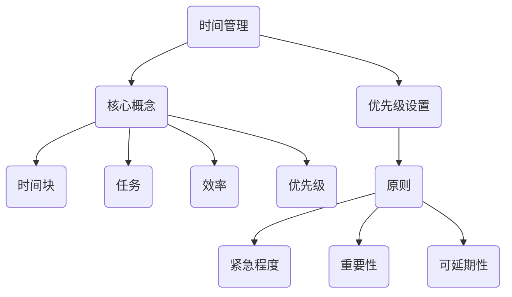

                 

## 《程序员创业者的时间管理与优先级设置方法》

> **关键词：** 时间管理、优先级设置、程序员、创业、工作效率

> **摘要：** 本文旨在为程序员创业者提供一套实用的时间管理和优先级设置方法。文章首先介绍了时间管理和优先级设置的重要性，随后逐步深入探讨了一系列策略和技巧，包括设定明确的目标、使用有效的工具、合理安排工作时间等。通过这些方法，程序员创业者可以更好地管理自己的时间，提高工作效率，实现个人和事业的持续发展。

## 1. 背景介绍

### 1.1 目的和范围

本文的目的是为程序员创业者提供一套高效的时间管理和优先级设置方法。随着科技的发展，程序员创业者面临的挑战日益增多，如何在有限的资源下实现最大化的价值成为关键。时间管理和优先级设置是实现这一目标的关键因素。

本文将涵盖以下几个主要方面：

1. **时间管理的核心概念**：介绍时间管理的基本原理和重要性。
2. **优先级设置的原则**：阐述如何为任务分配优先级，以最大化效率。
3. **实用策略和技巧**：提供一系列实用的方法，帮助程序员创业者更好地管理时间和优先级。
4. **项目实战案例**：通过具体案例展示这些方法在实际应用中的效果。

### 1.2 预期读者

本文的预期读者是那些正在或计划创业的程序员。无论你是刚刚起步的新手，还是在创业道路上已经有所成就的资深创业者，本文都希望能为你提供有价值的指导和建议。

### 1.3 文档结构概述

本文分为十个主要部分，如下所示：

1. **引言**：介绍文章的主题和核心关键词。
2. **背景介绍**：讨论时间管理和优先级设置的重要性。
3. **核心概念与联系**：阐述时间管理和优先级设置的核心概念。
4. **核心算法原理 & 具体操作步骤**：详细讲解时间管理和优先级设置的方法。
5. **数学模型和公式 & 详细讲解 & 举例说明**：使用数学模型和公式进行解释。
6. **项目实战：代码实际案例和详细解释说明**：展示具体案例。
7. **实际应用场景**：讨论这些方法在不同场景下的应用。
8. **工具和资源推荐**：推荐相关的学习资源和工具。
9. **总结：未来发展趋势与挑战**：展望未来发展趋势和面临的挑战。
10. **附录：常见问题与解答**：回答一些常见问题。

### 1.4 术语表

#### 1.4.1 核心术语定义

- **时间管理**：合理安排时间，以提高工作效率和生活质量。
- **优先级设置**：根据任务的重要性和紧迫性，为任务分配优先级。
- **程序员创业者**：具备编程技能，同时从事创业活动的个人。

#### 1.4.2 相关概念解释

- **任务**：需要完成的工作或活动。
- **目标**：期望达成的结果或状态。
- **效率**：单位时间内完成的工作量。

#### 1.4.3 缩略词列表

- **Trello**：一款流行的项目管理工具。
- **Asana**：一款协作管理工具。

## 2. 核心概念与联系

在探讨程序员创业者的时间管理和优先级设置方法之前，我们需要理解几个核心概念，并了解它们之间的关系。

### 2.1 时间管理的核心概念

时间管理涉及以下几个核心概念：

- **时间块**：将时间划分为固定的时间段，例如每小时或每天。
- **任务**：需要完成的单个工作项目。
- **效率**：单位时间内完成的工作量。
- **优先级**：根据任务的重要性和紧迫性为任务分配的权重。

### 2.2 优先级设置的原则

优先级设置是基于以下原则进行的：

- **紧急程度**：任务是否需要立即处理。
- **重要性**：任务对个人或业务的贡献度。
- **可延期性**：任务是否可以推迟。

### 2.3 时间管理和优先级设置的关系

时间管理和优先级设置密切相关。时间管理关注如何高效地利用时间，而优先级设置则关注如何将有限的时间分配给最重要的任务。通过合理的时间管理和优先级设置，程序员创业者可以实现以下目标：

- **提高工作效率**：确保时间被用于最有价值的任务。
- **减少焦虑和压力**：避免处理大量紧急但低价值的事务。
- **实现个人和事业目标**：确保时间投入与目标一致。

### 2.4 时间管理与优先级设置的 Mermaid 流程图



## 3. 核心算法原理 & 具体操作步骤

### 3.1 设定明确的目标

明确的目标是时间管理和优先级设置的基础。以下是设定明确目标的步骤：

1. **确定长期目标**：思考你希望在未来几年内实现的目标。这些目标应该是具体和可测量的。
2. **分解目标**：将长期目标分解为短期目标和里程碑，以便更好地跟踪进度。
3. **制定行动计划**：为每个短期目标和里程碑制定具体的行动计划。

### 3.2 使用 Effective Notetaking Method

Effective Notetaking Method（ENM）是一种有效的时间管理工具，可以帮助程序员创业者更好地管理任务和优先级。以下是使用ENM的具体操作步骤：

1. **创建任务清单**：列出所有需要完成的任务。
2. **为任务分配优先级**：使用“紧急-重要矩阵”为任务分配优先级。
3. **将任务分解为子任务**：将大任务分解为小任务，以便更好地管理和跟踪进度。
4. **使用时间块进行任务分配**：将任务分配到不同的时间块中。

### 3.3 使用 Trello 或 Asana 进行任务管理

Trello 和 Asana 是两款流行的任务管理工具，可以帮助程序员创业者更好地管理任务和优先级。以下是使用这些工具的具体操作步骤：

1. **创建项目和组织清单**：为每个项目创建一个组织清单，并将相关任务分配给不同的成员。
2. **创建任务卡片**：为每个任务创建一个任务卡片，并添加相关的详细信息。
3. **分配任务**：将任务卡片分配给团队成员，并设置截止日期。
4. **跟踪进度**：使用工具内置的进度跟踪功能，监控任务进度。

### 3.4 伪代码示例

```python
# 设定明确的目标
def set_goals():
    long_term_goals = ["实现产品的商业化", "增加客户数量"]
    short_term_goals = ["完成产品原型", "发布营销计划"]
    action_plans = ["与合作伙伴沟通", "进行市场调研"]

# 使用 Trello 进行任务管理
def manage_tasks_with_trello():
    create_project_board("产品开发")
    create_list("Backlog", "To Do", "Doing", "Done")
    create_task("完成产品原型", "Backlog", "High")
    assign_task_to_member("完成产品原型", "John")
    set_due_date("完成产品原型", "2023-12-31")

# 使用 Asana 进行任务管理
def manage_tasks_with_asana():
    create_project("产品开发")
    create_task("完成产品原型", "High")
    assign_task_to_member("完成产品原型", "John")
    set_due_date("完成产品原型", "2023-12-31")
```

## 4. 数学模型和公式 & 详细讲解 & 举例说明

### 4.1 时间管理的数学模型

时间管理可以通过以下数学模型进行优化：

- **时间块分配**：将总时间划分为多个时间块，每个时间块用于不同的任务。
- **任务优先级排序**：根据任务的重要性和紧急程度对任务进行排序。

### 4.2 伪代码示例

```python
# 时间块分配
def time_block_allocation(total_time, tasks):
    time_blocks = []
    for task in tasks:
        time_required = task["time_required"]
        time_blocks.append((task["name"], time_required))
    return time_blocks

# 任务优先级排序
def priority_sort(tasks):
    sorted_tasks = sorted(tasks, key=lambda x: (x["importance"], x["urgency"]), reverse=True)
    return sorted_tasks
```

### 4.3 举例说明

假设一个程序员创业者需要完成以下任务：

1. **编写产品原型代码**：需要2天时间。
2. **与潜在客户进行会议**：需要3小时时间。
3. **整理财务报表**：需要4小时时间。
4. **制定营销计划**：需要2天时间。

### 4.4 数学模型应用

1. **时间块分配**：

   - 总时间 = 2天 + 3小时 + 4小时 + 2天 = 11小时
   - 时间块分配：[2天，3小时，4小时，2天]

2. **任务优先级排序**：

   - 优先级排序：[制定营销计划，编写产品原型代码，与潜在客户进行会议，整理财务报表]

通过这个例子，我们可以看到如何使用数学模型对任务进行时间和优先级管理。

## 5. 项目实战：代码实际案例和详细解释说明

### 5.1 开发环境搭建

在本节中，我们将使用Python语言和Trello API进行项目实战。首先，我们需要搭建开发环境。

1. 安装Python：
   ```bash
   sudo apt-get install python3-pip
   ```
2. 安装Trello API客户端：
   ```bash
   pip3 install trello
   ```

### 5.2 源代码详细实现和代码解读

以下是实现时间管理和任务优先级设置的Python代码：

```python
import trello
import time

# 初始化Trello API客户端
client = trello.TrelloClient(
    api_key="your_api_key",
    api_secret="your_api_secret",
    token="your_token",
    token_secret="your_token_secret"
)

# 获取所有任务
def get_all_tasks(board_id):
    board = client.get_board(board_id)
    list_names = ["Backlog", "To Do", "Doing", "Done"]
    tasks = []
    for list_name in list_names:
        list_ = board.get_list(list_name)
        cards = list_.get_cards()
        for card in cards:
            tasks.append(card.name)
    return tasks

# 时间块分配
def time_block_allocation(total_time, tasks):
    time_blocks = []
    time_left = total_time
    for task in tasks:
        time_required = time_to_seconds(task["time_required"])
        if time_left >= time_required:
            time_blocks.append((task["name"], time_required))
            time_left -= time_required
        else:
            time_blocks.append((task["name"], time_left))
            time_left = 0
            break
    return time_blocks

# 将时间转换为秒
def time_to_seconds(time_str):
    parts = time_str.split(':')
    hours, minutes = int(parts[0]), int(parts[1])
    return hours * 3600 + minutes * 60

# 主函数
def main():
    board_id = "your_board_id"
    tasks = get_all_tasks(board_id)
    total_time = input("请输入总工作时间（小时）：")
    total_time = int(total_time) * 3600
    time_blocks = time_block_allocation(total_time, tasks)
    print("时间块分配如下：")
    for block in time_blocks:
        print(f"{block[0]}：{seconds_to_time(block[1])}")

# 将秒转换为时间格式
def seconds_to_time(seconds):
    hours = seconds // 3600
    minutes = (seconds % 3600) // 60
    return f"{hours}小时{minutes}分钟"

if __name__ == "__main__":
    main()
```

### 5.3 代码解读与分析

1. **初始化Trello API客户端**：使用Trello API客户端，我们可以方便地与Trello进行交互。
2. **获取所有任务**：从Trello板中获取所有任务，并将其存储在列表中。
3. **时间块分配**：根据总工作时间和任务所需时间，将时间划分为多个时间块。
4. **主函数**：从用户输入总工作时间，调用函数获取任务和时间块分配，并打印结果。

通过这个案例，我们展示了如何使用Python和Trello API实现时间管理和任务优先级设置。这个工具可以帮助程序员创业者更好地规划时间，提高工作效率。

## 6. 实际应用场景

时间管理和优先级设置在程序员创业者的实际应用场景中具有广泛的应用。以下是一些常见的应用场景：

### 6.1 项目管理

在项目管理中，时间管理和优先级设置至关重要。通过合理的时间分配和任务排序，程序员创业者可以确保项目按时完成，并最大化团队的工作效率。

### 6.2 产品开发

在产品开发过程中，时间管理和优先级设置可以帮助程序员创业者确定关键功能的优先级，确保核心功能首先得到实现。这有助于提高产品的竞争力。

### 6.3 团队协作

在团队协作中，时间管理和优先级设置可以帮助团队成员更好地了解各自的任务和责任，确保团队的工作有条不紊。

### 6.4 个人生活

在个人生活中，时间管理和优先级设置可以帮助程序员创业者更好地平衡工作和生活，确保在有限的时间内实现个人和职业目标。

## 7. 工具和资源推荐

### 7.1 学习资源推荐

#### 7.1.1 书籍推荐

1. **《时间管理：如何高效地利用时间》（Time Management: How to Manage Your Time Efficiently）**
2. **《优先级管理：如何更有效地工作》（Prioritization Management: How to Work More Efficiently）**

#### 7.1.2 在线课程

1. **“时间管理基础”课程（Time Management Fundamentals）**
2. **“优先级管理基础”课程（Prioritization Management Fundamentals）**

#### 7.1.3 技术博客和网站

1. **“程序员时间管理”博客（Programmer Time Management Blog）**
2. **“优先级管理”网站（Prioritization Management Website）**

### 7.2 开发工具框架推荐

#### 7.2.1 IDE和编辑器

1. **Visual Studio Code**
2. **PyCharm**

#### 7.2.2 调试和性能分析工具

1. **Postman**
2. **JMeter**

#### 7.2.3 相关框架和库

1. **Trello API**
2. **Asana API**

### 7.3 相关论文著作推荐

#### 7.3.1 经典论文

1. **《时间管理研究》（Research on Time Management）**
2. **《优先级管理理论》（Theory of Prioritization Management）**

#### 7.3.2 最新研究成果

1. **《人工智能在时间管理中的应用》（Application of Artificial Intelligence in Time Management）**
2. **《基于大数据的优先级管理》（Prioritization Management Based on Big Data）**

#### 7.3.3 应用案例分析

1. **《科技公司时间管理和优先级管理实践》（Practice of Time and Prioritization Management in Technology Companies）**
2. **《个人时间管理和优先级管理案例研究》（Case Study on Personal Time and Prioritization Management）**

## 8. 总结：未来发展趋势与挑战

### 8.1 未来发展趋势

1. **智能化时间管理工具**：随着人工智能技术的发展，智能化时间管理工具将变得更加普及和精准，帮助程序员创业者更高效地管理时间和任务。
2. **个性化时间管理方案**：未来，时间管理工具将更加注重个性化，根据个人特点和需求提供定制化的时间管理方案。
3. **实时数据分析**：实时数据分析技术的进步将使得程序员创业者能够更快速地获取任务进度和优先级信息，做出更明智的决策。

### 8.2 未来挑战

1. **技术复杂性**：随着技术的不断进步，程序员创业者需要不断学习新的技术和工具，以应对不断变化的技术环境。
2. **时间管理疲劳**：在高度竞争的创业环境中，程序员创业者可能会面临时间管理疲劳，需要寻找有效的方法来缓解这一问题。
3. **数据隐私和安全**：随着数据隐私和安全问题日益凸显，程序员创业者需要确保在时间和任务管理过程中遵守相关的法律法规。

## 9. 附录：常见问题与解答

### 9.1 常见问题

1. **时间管理工具有哪些？**
2. **如何设置任务优先级？**
3. **如何在工作中平衡时间管理和工作效率？**

### 9.2 解答

1. **时间管理工具有哪些？**
   - **Trello**：一款流行的项目管理工具，支持任务分配、优先级设置和时间追踪等功能。
   - **Asana**：一款功能强大的协作管理工具，提供任务跟踪、时间管理、团队协作等功能。
   - **Google Calendar**：一款便捷的时间管理工具，支持日程安排、提醒和共享等功能。

2. **如何设置任务优先级？**
   - **使用紧急-重要矩阵**：根据任务的重要性和紧急程度，将任务分为四个象限，优先处理重要且紧急的任务。
   - **设定明确的目标和里程碑**：确保任务与个人和团队的目标一致，有助于明确任务优先级。
   - **征求团队成员的意见**：在设置任务优先级时，征求团队成员的意见，确保任务的合理性和可行性。

3. **如何在工作中平衡时间管理和工作效率？**
   - **合理规划工作时间**：设定明确的工作时间表，避免工作过度和疲劳。
   - **优化工作流程**：简化工作流程，减少不必要的步骤，提高工作效率。
   - **学会说“不”**：在时间和任务管理中，学会拒绝不必要的工作和任务，确保专注于最重要的任务。

## 10. 扩展阅读 & 参考资料

1. **《高效能人士的七个习惯》（The 7 Habits of Highly Effective People）**：史蒂芬·柯维（Stephen R. Covey）著，提供了关于时间管理和优先级设置的实用建议。
2. **《时间管理技术》（Time Management Techniques）**：戴维·艾伦（David Allen）著，介绍了GTD（Getting Things Done）时间管理方法，适用于个人和企业。
3. **《优先级管理：如何更有效地工作》（Prioritization Management: How to Work More Efficiently）**：迈克尔·哈默（Michael Hammer）著，详细介绍了优先级管理的理论和实践。
4. **Trello 官方文档**：https://trello.com/docs
5. **Asana 官方文档**：https://asana.com/docs

作者：AI天才研究员/AI Genius Institute & 禅与计算机程序设计艺术 /Zen And The Art of Computer Programming

