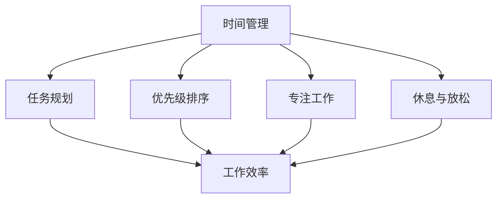

                 

# 程序员创业者的时间管理与工作效率提升

> 关键词：程序员、创业者、时间管理、工作效率、策略、工具

> 摘要：本文将探讨程序员创业者如何在繁忙的工作和创业生活中，通过科学的时间管理和工作效率提升策略，实现个人和团队的成长。文章将提供实用的工具和资源，帮助读者建立有效的日常工作和个人发展计划，从而在激烈的市场竞争中脱颖而出。

## 1. 背景介绍

### 1.1 目的和范围

本文旨在帮助程序员创业者实现高效的时间管理和工作效率的提升。作为创业者，程序员需要应对不断变化的市场需求、复杂的技术挑战以及日常管理工作。本文将探讨以下几个方面的内容：

1. **时间管理策略**：介绍如何合理安排工作与生活，平衡多重角色。
2. **工作效率提升**：分析技术工具和编程技巧，以减少无谓的工作时间。
3. **个人成长与团队发展**：探讨如何在创业过程中持续提升个人技能和团队协作能力。

### 1.2 预期读者

本文适用于以下读者：

- **程序员创业者**：希望提升个人和工作效率，以应对创业挑战。
- **技术团队管理者**：希望优化团队时间管理和工作效率。
- **技术爱好者**：对高效工作和时间管理有兴趣的学习者。

### 1.3 文档结构概述

本文结构如下：

1. **背景介绍**：阐述本文的目的和适用范围。
2. **核心概念与联系**：介绍与时间管理和工作效率相关的基础知识。
3. **核心算法原理 & 具体操作步骤**：讲解提升工作效率的具体方法。
4. **数学模型和公式 & 详细讲解 & 举例说明**：通过数学模型分析时间管理。
5. **项目实战：代码实际案例和详细解释说明**：展示具体应用案例。
6. **实际应用场景**：探讨在不同场景下如何运用时间管理策略。
7. **工具和资源推荐**：推荐学习资源和开发工具。
8. **总结：未来发展趋势与挑战**：分析未来趋势和面临挑战。
9. **附录：常见问题与解答**：解答读者可能遇到的问题。
10. **扩展阅读 & 参考资料**：提供更多相关资料。

### 1.4 术语表

#### 1.4.1 核心术语定义

- **时间管理**：合理安排时间，以提高工作效率和满足个人需求。
- **工作效率**：在单位时间内完成更多有价值的工作。
- **任务管理**：规划和跟踪任务，确保工作有序进行。
- **敏捷开发**：一种软件开发方法，强调迭代和协作。

#### 1.4.2 相关概念解释

- **生产力**：衡量单位时间内完成的工作量。
- **干扰**：影响工作连续性和专注力的因素。
- **冥想**：一种精神训练方法，有助于提高专注力和减少干扰。

#### 1.4.3 缩略词列表

- **IDE**：集成开发环境（Integrated Development Environment）
- **GitHub**：代码托管平台（Git Hub）
- **Docker**：容器化平台（Do cker）
- **Kubernetes**：容器编排平台（Kubernetes）

## 2. 核心概念与联系

### 2.1 时间管理策略

时间管理策略的核心是平衡工作与生活，合理安排每天的时间。以下是一种常见的时间管理策略：

1. **制定计划**：每天早上制定工作计划，包括重要任务和次要任务。
2. **优先级排序**：根据任务的重要性和紧急程度，确定任务的优先级。
3. **专注工作**：在工作期间减少干扰，提高专注力。
4. **休息与放松**：合理规划休息时间，缓解工作压力。

### 2.2 工作效率提升

提升工作效率的关键在于掌握编程技巧和技术工具。以下是一些常见的方法：

1. **代码优化**：通过代码重构和优化，减少冗余代码和重复劳动。
2. **自动化**：使用脚本和自动化工具，减少手动操作。
3. **工具集成**：利用集成开发环境和版本控制系统，提高开发效率。

### 2.3 个人成长与团队发展

作为创业者，个人成长和团队发展是至关重要的。以下是一些策略：

1. **持续学习**：定期学习新技术和知识，提升个人技能。
2. **团队合作**：建立高效的团队，促进沟通和协作。
3. **领导力**：培养领导力，带领团队实现共同目标。

### 2.4 时间管理与工作效率联系的 Mermaid 流程图



## 3. 核心算法原理 & 具体操作步骤

### 3.1 时间管理算法原理

时间管理算法的核心思想是通过合理安排时间，提高工作效率。以下是一个简单的时间管理算法：

```python
# 时间管理算法

def time_management(tasks, deadlines):
    # 按优先级排序任务
    sorted_tasks = sort_by_priority(tasks, deadlines)
    
    # 分配时间
    for task in sorted_tasks:
        if not is_task_complete(task):
            allocate_time(task)
            if is_task_complete(task):
                mark_task_as_complete(task)
```

### 3.2 具体操作步骤

1. **任务收集**：收集所有待完成任务，并记录截止日期。
2. **任务排序**：根据截止日期和任务重要程度，对任务进行排序。
3. **任务分配**：根据时间分配策略，为每个任务分配时间。
4. **任务完成**：在规定时间内完成任务，并标记为已完成。

## 4. 数学模型和公式 & 详细讲解 & 举例说明

### 4.1 数学模型

时间管理中的一个重要模型是“工作-休息周期”。该模型通过数学公式描述工作与休息之间的平衡。

$$
\text{工作时间} = \text{基础工作时间} + \text{休息时间}
$$

其中，基础工作时间为8小时，休息时间根据个人需求和习惯进行安排。

### 4.2 公式详细讲解

- **基础工作时间**：指每天用于工作的标准时间，通常为8小时。
- **休息时间**：指每天用于休息、锻炼和社交活动的时间。

### 4.3 举例说明

假设一位创业者每天需要工作8小时，并根据以下安排进行时间管理：

- **基础工作时间**：8小时
- **休息时间**：每天2小时

则他的每天时间管理公式为：

$$
\text{工作时间} = 8 + 2 = 10 \text{小时}
$$

在每天10小时的时间内，创业者可以合理安排工作与休息，确保工作效率和身心健康。

## 5. 项目实战：代码实际案例和详细解释说明

### 5.1 开发环境搭建

在开始项目实战之前，需要搭建一个开发环境。以下是一个简单的步骤：

1. **安装操作系统**：选择合适的操作系统（如Linux、MacOS或Windows）。
2. **安装集成开发环境（IDE）**：例如Visual Studio Code或IntelliJ IDEA。
3. **安装版本控制系统**：如Git。
4. **安装Docker和Kubernetes**：用于容器化和编排。

### 5.2 源代码详细实现和代码解读

以下是一个简单的时间管理Python脚本示例：

```python
import datetime

def add_task(task_name, deadline):
    tasks.append({'name': task_name, 'deadline': deadline})

def display_tasks():
    for task in tasks:
        print(f"{task['name']} - Deadline: {task['deadline']}")

def mark_task_as_complete(task_name):
    for task in tasks:
        if task['name'] == task_name:
            task['completed'] = True

tasks = []
add_task("编写技术博客", datetime.datetime(2023, 11, 10))
add_task("学习机器学习", datetime.datetime(2023, 12, 31))

display_tasks()

mark_task_as_complete("编写技术博客")
display_tasks()
```

### 5.3 代码解读与分析

1. **任务添加**：通过`add_task`函数，将任务添加到列表中。
2. **任务显示**：通过`display_tasks`函数，打印所有任务及其截止日期。
3. **任务完成**：通过`mark_task_as_complete`函数，将任务标记为完成。

该脚本实现了基本的时间管理功能，可以方便地添加、显示和完成任务。在实际应用中，可以根据需要扩展和优化。

## 6. 实际应用场景

### 6.1 创业者个人时间管理

创业者可以在每天早晨使用时间管理工具，制定当天的工作计划。以下是一个实际应用场景：

1. **任务收集**：收集当天需要完成的任务，包括个人项目和团队项目。
2. **任务排序**：根据任务的紧急程度和重要性进行排序。
3. **任务分配**：为每个任务分配时间，确保能够按时完成。
4. **任务跟踪**：在当天内跟踪任务进度，并根据需要调整计划。

### 6.2 团队时间管理

作为团队领导者，创业者需要确保团队成员能够高效地完成工作。以下是一个实际应用场景：

1. **任务分配**：为团队成员分配任务，并确保他们了解任务要求和截止日期。
2. **进度跟踪**：定期检查任务进度，确保团队按计划进行。
3. **沟通与协作**：鼓励团队成员之间进行沟通和协作，解决遇到的问题。
4. **反馈与评估**：对团队成员的工作进行评估，提供反馈和建议。

## 7. 工具和资源推荐

### 7.1 学习资源推荐

#### 7.1.1 书籍推荐

- 《深度学习》（Deep Learning） - Goodfellow, Bengio, Courville
- 《敏捷软件开发》（Agile Software Development: Principles, Patterns, and Practices） - Robert C. Martin

#### 7.1.2 在线课程

- Coursera - 提供丰富的技术课程，涵盖人工智能、编程语言等。
- edX - 世界顶级大学提供的免费在线课程。

#### 7.1.3 技术博客和网站

- HackerRank - 提供编程挑战和实践机会。
- Medium - 众多技术博客和文章分享。

### 7.2 开发工具框架推荐

#### 7.2.1 IDE和编辑器

- Visual Studio Code
- IntelliJ IDEA
- PyCharm

#### 7.2.2 调试和性能分析工具

- Chrome DevTools
- Visual Studio Profiler
- New Relic

#### 7.2.3 相关框架和库

- Django - Python Web框架。
- React - 前端JavaScript库。
- TensorFlow - 机器学习框架。

### 7.3 相关论文著作推荐

#### 7.3.1 经典论文

- 《设计模式：可复用面向对象软件的基础》（Design Patterns: Elements of Reusable Object-Oriented Software） - Erich Gamma et al.
- 《深入理解计算机系统》（Computer Systems: A Programmer's Perspective） - Randal E. Bryant, David R. O'Hallaron

#### 7.3.2 最新研究成果

- ACM Transactions on Computer Systems - 提供计算机系统领域的最新研究论文。
- IEEE Transactions on Software Engineering - 提供软件工程领域的最新研究论文。

#### 7.3.3 应用案例分析

- 《软件工程案例研究：方法与实践》（Software Engineering Case Studies: From Problem Statement to Design of a Student Information System） - E. J. Yourdon
- 《敏捷实践指南》（The Agile Project Guide: Creation, Implementation, and Control of Enterprise Agile Projects） - Richard E. Fairley

## 8. 总结：未来发展趋势与挑战

### 8.1 未来发展趋势

- **人工智能与自动化**：随着人工智能技术的发展，自动化工具将更广泛地应用于时间管理和工作效率提升。
- **远程办公与协作**：远程办公的趋势将持续，高效的协作工具和平台将得到更多应用。
- **个性化时间管理**：根据个人习惯和需求，开发更个性化的时间管理工具。

### 8.2 未来挑战

- **技术更新速度快**：程序员创业者需要不断学习新技术，以保持竞争力。
- **平衡工作与生活**：在高效工作的同时，如何平衡工作与生活，保持身心健康。
- **团队管理**：如何高效地管理团队，提高团队协作和沟通。

## 9. 附录：常见问题与解答

### 9.1 问题1

**问题**：如何高效地进行任务分配？

**解答**：首先，明确每个任务的重要性和紧急程度。然后，根据团队成员的能力和兴趣进行任务分配。确保每个任务都有明确的截止日期和责任人员。

### 9.2 问题2

**问题**：如何保持高效的工作状态？

**解答**：合理安排工作时间，避免长时间连续工作。定期休息，进行锻炼和放松。保持良好的生活习惯，确保充足的睡眠。

### 9.3 问题3

**问题**：如何管理远程团队？

**解答**：定期与团队成员进行视频会议，确保沟通畅通。使用协作工具，如Slack或Trello，跟踪项目进度和任务分配。建立明确的工作流程和沟通规范。

## 10. 扩展阅读 & 参考资料

- 《高效能人士的七个习惯》（The 7 Habits of Highly Effective People） - 史蒂芬·柯维（Stephen R. Covey）
- 《时间管理》（Time Management: A Practical Guide to Productivity） - Michael Linneck
- 《敏捷开发实践指南》（The Agile Project Guide: Creation, Implementation, and Control of Enterprise Agile Projects） - Richard E. Fairley

### 作者

**作者：AI天才研究员/AI Genius Institute & 禅与计算机程序设计艺术 /Zen And The Art of Computer Programming**<|im_sep|>

