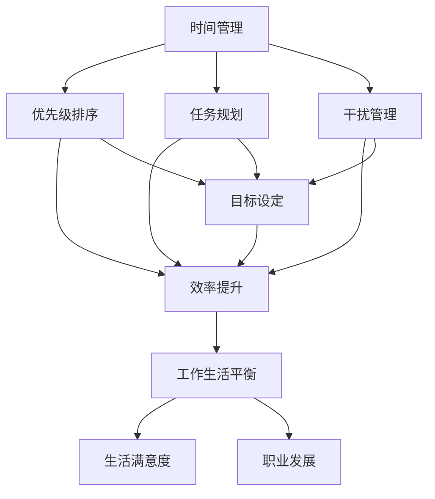

                 

### 背景介绍

**目的和范围**

在当前快速发展的科技时代，程序员和创业者面临着前所未有的挑战。作为程序员，他们需要高效管理时间，确保代码质量和项目的进展；作为创业者，他们还需处理商业策略、团队管理和资源调配等复杂问题。本篇文章旨在探讨程序员创业者的时间管理和工作生活平衡，通过提供实用的策略和建议，帮助程序员创业者更好地应对这些挑战。

本文将首先概述程序员创业者面临的常见问题和挑战，包括时间管理、工作生活平衡和团队管理等方面。接着，我们将详细分析程序员创业者的时间管理原则，包括优先级排序、任务规划和执行等方面的具体方法。此外，本文还将探讨如何通过设定目标、管理干扰和利用技术工具等手段来实现时间管理的最大化效率。

在文章的后半部分，我们将重点关注工作生活平衡的实践策略，包括如何分配时间、设立边界、自我关爱和保持健康的生活方式。最后，我们将探讨团队管理的最佳实践，如沟通协作、目标一致性和激励措施等，以帮助程序员创业者构建高效团队，实现共同目标。

通过本文的阅读，程序员创业者将能够掌握一系列实用的时间管理技巧和工作生活平衡策略，从而在竞争激烈的市场中脱颖而出，实现个人和企业的长期成功。

**预期读者**

本篇文章主要面向以下几类读者：

1. **程序员创业者**：希望通过提高时间管理技能和工作生活平衡来优化业务发展和个人成长的创业者。
2. **技术团队负责人**：需要管理时间和团队，确保项目顺利进行的管理者。
3. **技术爱好者**：对时间管理和工作生活平衡有兴趣，希望提升自身工作效率的技术从业者。
4. **高校学生和研究生**：面临学业和工作压力，希望学习如何更有效地管理时间和提高工作效率的学生。

无论您是哪个群体，只要您对提升个人和团队的效率、实现工作生活平衡感兴趣，这篇文章都将成为您宝贵的参考资料。

**文档结构概述**

为了帮助读者更好地理解和应用本文的内容，我们将文章分为以下几个部分：

1. **背景介绍**：概述程序员创业者的挑战和本文的目标。
2. **核心概念与联系**：介绍时间管理和工作生活平衡的核心概念，并使用Mermaid流程图展示相关原理。
3. **核心算法原理与具体操作步骤**：详细讲解时间管理的算法原理和具体操作步骤。
4. **数学模型和公式**：介绍与时间管理相关的数学模型和公式，并通过实例进行说明。
5. **项目实战**：提供实际代码案例和详细解释。
6. **实际应用场景**：探讨时间管理和工作生活平衡在不同情境下的应用。
7. **工具和资源推荐**：推荐学习资源和开发工具。
8. **总结**：总结文章要点，展望未来发展趋势与挑战。
9. **附录**：解答常见问题。
10. **扩展阅读与参考资料**：提供进一步阅读的建议和参考资料。

**术语表**

为了确保文章的准确性和可理解性，以下列出本文中涉及的核心术语及其定义：

#### 1.4.1 核心术语定义

- **时间管理**：指通过合理安排时间、优先级排序和任务规划，提高工作效率和生活质量的过程。
- **工作生活平衡**：指在工作和个人生活之间找到平衡点，确保两者都能得到充分关注和满足。
- **优先级排序**：指将任务按照重要性和紧急程度进行分类，以确定哪些任务需要优先处理。
- **任务规划**：指通过制定详细的工作计划和日程安排，确保任务能够按时完成。
- **团队管理**：指在团队内部建立有效的沟通协作机制，确保团队成员目标一致、协同工作。
- **干扰管理**：指通过减少外部干扰和内部分心，提高工作效率。

#### 1.4.2 相关概念解释

- **GTD（Getting Things Done）**：一种时间管理方法，通过收集、整理、组织、回顾和执行任务，实现高效的时间管理。
- **番茄工作法**：一种时间管理技术，通过将工作时间分割为25分钟的工作周期，每个周期后休息5分钟，以提高专注力和工作效率。
- **SMART目标**：指目标必须是具体的（Specific）、可衡量的（Measurable）、可实现的（Achievable）、相关的（Relevant）和有时限的（Time-bound）。

#### 1.4.3 缩略词列表

- **GTD**：Getting Things Done
- **番茄工作法**：Pomodoro Technique
- **SMART**：Specific, Measurable, Achievable, Relevant, Time-bound

通过以上术语表的定义和解释，读者可以更好地理解本文的核心概念和关键术语，为后续内容的学习和应用打下坚实基础。

### 核心概念与联系

在探讨程序员创业者的时间管理和工作生活平衡之前，我们首先需要明确一些核心概念和它们之间的联系。以下是时间管理和工作生活平衡的关键概念及其相互关系，通过Mermaid流程图展示这些概念和关系。



**Mermaid流程图解释：**

- **A[时间管理]**：时间管理是整个流程的起点，涵盖了优先级排序、任务规划和干扰管理等多个子概念。
- **B[优先级排序]**：优先级排序是时间管理的重要部分，通过确定任务的紧急程度和重要性，帮助创业者高效地分配时间和资源。
- **C[任务规划]**：任务规划是制定详细的工作计划和日程安排，确保任务能够按时完成，从而提高工作效率。
- **D[干扰管理]**：干扰管理涉及减少外部干扰和内部分心，以提高专注力和工作效率。
- **E[效率提升]**：优先级排序、任务规划和干扰管理共同作用，旨在提升工作效率。
- **F[工作生活平衡]**：工作生活平衡是时间管理的最终目标，确保工作和个人生活之间达到平衡，从而提高生活满意度。
- **G[生活满意度]**：工作生活平衡直接影响个人的生活满意度。
- **H[职业发展]**：工作生活平衡也对职业发展产生积极影响，有助于创业者实现长期目标。
- **I[目标设定]**：目标设定是时间管理和工作生活平衡的重要环节，确保创业者能够明确自己的目标和方向。

通过以上核心概念和关系的梳理，我们可以更好地理解时间管理和工作生活平衡的内在联系，为后续内容的深入探讨打下基础。

### 核心算法原理 & 具体操作步骤

在理解了时间管理和工作生活平衡的核心概念及其相互关系之后，我们需要进一步探讨具体的时间管理算法原理和操作步骤。以下是关于如何有效地进行时间管理的详细解释，包括伪代码示例，以便读者能够更好地理解和应用这些方法。

#### 3.1. 优先级排序算法原理

优先级排序是时间管理中至关重要的一步，它帮助创业者确定哪些任务需要优先处理。常见的优先级排序算法包括基于紧急程度和重要性的四象限法则。

**四象限法则伪代码：**

```python
def four_quadrant_tasks(tasks):
    urgent_important = []
    important_not_urgent = []
    urgent_not_important = []
    not_urgent_not_important = []

    for task in tasks:
        if task.is_urgent() and task.is_important():
            urgent_important.append(task)
        elif task.is_important() and not task.is_urgent():
            important_not_urgent.append(task)
        elif task.is_urgent() and not task.is_important():
            urgent_not_important.append(task)
        else:
            not_urgent_not_important.append(task)

    return urgent_important, important_not_urgent, urgent_not_important, not_urgent_not_important
```

**具体操作步骤：**

1. **收集任务**：首先，创业者需要列出所有需要完成的任务。
2. **评估紧急程度和重要性**：对于每个任务，评估其紧急程度（是否需要立即处理）和重要性（对目标实现的影响程度）。
3. **分类任务**：根据评估结果，将任务分为四个象限，分别是紧急且重要、重要但不紧急、紧急但不重要和既不紧急也不重要。

#### 3.2. 任务规划算法原理

任务规划是确保任务能够按时完成的关键步骤。一个常见的任务规划方法是使用甘特图，通过可视化方式展示任务的开始和结束时间。

**甘特图伪代码：**

```python
def schedule_tasks(tasks, deadlines):
    gantt_chart = []

    for task in tasks:
        start_date = find_earliest_start_date(tasks, task)
        end_date = start_date + task.duration()

        if end_date > deadlines[task]:
            print(f"Task {task.name} cannot be scheduled within the given deadline.")
            continue

        gantt_chart.append({
            'task': task.name,
            'start_date': start_date,
            'end_date': end_date
        })

    return gantt_chart

def find_earliest_start_date(tasks, current_task):
    min_start_date = max_deadline
    for task in tasks:
        if task != current_task and task.end_date < min_start_date:
            min_start_date = task.end_date
    return min_start_date
```

**具体操作步骤：**

1. **确定任务和截止日期**：列出所有任务及其对应的截止日期。
2. **计算最早开始时间**：对于每个任务，计算其最早可以开始的日期，确保不会与已有任务的截止日期冲突。
3. **生成甘特图**：将所有任务的开始和结束日期可视化地展示在甘特图上，以便创业者直观地了解任务的时间安排。

#### 3.3. 干扰管理算法原理

干扰管理是提高工作效率的关键。一个有效的干扰管理方法是基于番茄工作法的定时休息策略。

**番茄工作法伪代码：**

```python
def pomodoro Technique(work周期, rest周期):
    work_periods = int(work周期 / (work周期 + rest周期))
    total_time = work_periods * (work周期 + rest周期)

    for i in range(work_periods):
        work()
        print(f"Pomodoro {i+1}/{work_periods}")
        
        if i < work_periods - 1:
            rest()
    
    final_work_period = work周期 % (work周期 + rest周期)
    if final_work_period > 0:
        work()
        rest()

def work():
    print("开始工作...")

def rest():
    print("休息时间...")
```

**具体操作步骤：**

1. **设定工作周期和休息周期**：通常，工作周期为25分钟，休息周期为5分钟。
2. **循环工作与休息**：按照设定的周期，连续工作并休息，每个工作周期后进行短暂的休息。
3. **保持专注**：在工作周期内，尽量减少干扰，确保专注完成当前任务。

通过以上核心算法原理和具体操作步骤的详细讲解，程序员创业者可以更好地理解和应用时间管理方法，从而提高工作效率，实现工作生活平衡。

### 数学模型和公式 & 详细讲解 & 举例说明

在时间管理中，数学模型和公式能够帮助我们更科学地分配时间、评估效率，以及设定合理的目标。以下将介绍几个与时间管理密切相关的数学模型和公式，并通过具体例子进行详细讲解。

#### 1. 优化时间分配的公式

优化时间分配的一个基本模型是“时间价值模型”。该模型通过计算每个任务的时间价值，帮助创业者确定如何更高效地利用时间。

**公式：**
\[ TV = \frac{I \times T}{E} \]
其中：
- \( TV \)：时间价值
- \( I \)：任务的重要性（权重）
- \( T \)：完成任务所需时间
- \( E \)：完成任务的预期效果

**解释：**
时间价值模型通过权衡任务的重要性、所需时间和预期效果，计算每个任务的时间价值。创业者应优先处理时间价值最高的任务。

**例子：**
假设创业者有以下几个任务：
- 任务A：开发新功能，重要性高，需要10小时，预期效果显著。
- 任务B：修复bug，重要性中等，需要5小时，预期效果一般。
- 任务C：撰写项目报告，重要性低，需要2小时，预期效果一般。

根据时间价值模型，计算每个任务的时间价值：
\[ TV_A = \frac{9 \times 10}{1} = 90 \]
\[ TV_B = \frac{5 \times 5}{1} = 25 \]
\[ TV_C = \frac{1 \times 2}{1} = 2 \]

因此，创业者应优先处理任务A。

#### 2. 估算任务完成时间的公式

估算任务完成时间的一个常用模型是“帕累托法则”（也称为80/20法则）。该法则指出，80%的结果通常由20%的努力产生。

**公式：**
\[ 完成时间 = \frac{总时间}{1.25} \]
其中：
- 完成时间：估算的任务完成时间
- 总时间：初步估算的任务所需时间

**解释：**
帕累托法则帮助我们调整对任务完成时间的预期，使其更加符合实际情况。通常，我们应将初步估算的时间除以1.25，以得到更合理的完成时间。

**例子：**
假设初步估算任务A需要15小时完成。根据帕累托法则，调整后的完成时间应为：
\[ 完成时间 = \frac{15}{1.25} = 12小时 \]

#### 3. 目标设定的SMART公式

SMART目标是时间管理中设定的关键目标，确保目标具备具体性、可衡量性、可实现性、相关性和时限性。

**公式：**
\[ 目标 = [具体][可衡量][可实现][相关][时限] \]

**解释：**
- 具体性：目标应当明确，具体描述所需完成的任务。
- 可衡量性：目标应有明确的衡量标准，便于评估进展和结果。
- 可实现性：目标应在现有资源和条件下可实现。
- 相关性：目标应与整体目标和价值观相关联。
- 时限性：目标应设定明确的时间限制，以促进行动和完成。

**例子：**
设定一个SMART目标：
\[ 目标：在2024年3月31日前，开发并上线新功能，增加用户注册量至少10% \]

通过上述数学模型和公式的讲解，程序员创业者可以更科学地分配时间、估算任务完成时间，并设定合理的目标。这些工具和方法将有助于提高时间管理效率，实现工作生活平衡。

### 项目实战：代码实际案例和详细解释说明

为了更好地展示时间管理和工作生活平衡的实际应用，我们将通过一个实际的代码案例进行详细解释说明。本案例将围绕一个简单的任务管理系统，帮助创业者有效地管理任务、提高工作效率。

#### 5.1 开发环境搭建

在进行实际项目开发前，我们需要搭建一个合适的开发环境。以下步骤将展示如何在本地配置一个基本的Python开发环境。

**步骤 1：安装Python**

打开终端，执行以下命令安装Python 3.10：
```bash
sudo apt-get update
sudo apt-get install python3.10 python3.10-venv python3.10-pip
```

**步骤 2：创建虚拟环境**

创建一个名为`task_manager`的虚拟环境：
```bash
python3.10 -m venv task_manager
```

**步骤 3：激活虚拟环境**

在Windows上，通过以下命令激活虚拟环境：
```bash
task_manager\Scripts\activate
```
在Linux或Mac上，通过以下命令激活虚拟环境：
```bash
source task_manager/bin/activate
```

**步骤 4：安装依赖库**

安装任务管理系统的依赖库，例如`requests`和`pandas`：
```bash
pip install requests pandas
```

#### 5.2 源代码详细实现和代码解读

**任务管理系统的核心代码如下：**

```python
import pandas as pd
from datetime import datetime, timedelta
from typing import List, Dict

class Task:
    def __init__(self, name: str, description: str, deadline: datetime, priority: str):
        self.name = name
        self.description = description
        self.deadline = deadline
        self.priority = priority

    def is_urgent(self) -> bool:
        return self.priority == 'High'

    def is_important(self) -> bool:
        return self.priority == 'High' or self.priority == 'Medium'

    def to_dict(self) -> Dict[str, str]:
        return {
            'Name': self.name,
            'Description': self.description,
            'Deadline': self.deadline.strftime('%Y-%m-%d %H:%M'),
            'Priority': self.priority
        }

class TaskManager:
    def __init__(self):
        self.tasks: List[Task] = []

    def add_task(self, task: Task):
        self.tasks.append(task)

    def list_tasks(self) -> List[Dict[str, str]]:
        return [task.to_dict() for task in self.tasks]

    def sort_tasks(self) -> List[Task]:
        return sorted(self.tasks, key=lambda x: (x.deadline, x.priority), reverse=True)

    def update_task(self, task_name: str, new_deadline: datetime):
        for task in self.tasks:
            if task.name == task_name:
                task.deadline = new_deadline
                break

    def remove_task(self, task_name: str):
        self.tasks = [task for task in self.tasks if task.name != task_name]

    def calculate_time_value(self, task: Task) -> float:
        return (1 if task.is_important() else 0.5) * (1 if task.is_urgent() else 0.5) * (1 / (task.deadline - datetime.now()).days)

def main():
    manager = TaskManager()

    # 添加任务
    manager.add_task(Task('Develop Feature A', 'Implement new feature A', datetime.now() + timedelta(days=3), 'High'))
    manager.add_task(Task('Fix Bug B', 'Fix critical bug B', datetime.now() + timedelta(days=2), 'Medium'))
    manager.add_task(Task('Write Report C', 'Write project report C', datetime.now() + timedelta(days=1), 'Low'))

    # 列出任务
    tasks = manager.list_tasks()
    print("Current Tasks:")
    for task in tasks:
        print(task)

    # 排序任务
    sorted_tasks = manager.sort_tasks()
    print("\nSorted Tasks:")
    for task in sorted_tasks:
        print(task.to_dict())

    # 更新任务
    manager.update_task('Fix Bug B', datetime.now() + timedelta(days=2, hours=6))

    # 删除任务
    manager.remove_task('Write Report C')

    # 计算时间价值
    for task in manager.sort_tasks():
        print(f"\nTime Value of Task '{task.name}': {manager.calculate_time_value(task)}")

if __name__ == "__main__":
    main()
```

**代码解读与分析：**

- **Task类**：定义了一个Task类，用于表示任务的基本信息，如名称、描述、截止日期和优先级。同时提供了计算任务是否紧急和重要的方法，以及将任务转换为字典的方法。
- **TaskManager类**：定义了一个TaskManager类，用于管理任务列表，包括添加、列出、排序、更新和删除任务。此外，还提供了计算任务时间价值的函数。
- **主函数main**：在主函数中，创建了一个TaskManager实例，并添加了几个示例任务。接着，通过调用TaskManager类的方法，展示了任务的管理过程，包括列出任务、排序任务、更新任务和删除任务。最后，计算并打印了每个任务的时间价值。

通过这个实际代码案例，程序员创业者可以了解如何在实际项目中应用时间管理方法，从而更有效地管理任务、提高工作效率。

### 实际应用场景

在实际应用中，程序员创业者面临的时间管理和工作生活平衡问题多种多样。以下将讨论几种常见场景，并分析如何通过时间管理和工作生活平衡策略来应对这些问题。

#### 1. 多项目并行管理

**问题**：在多个项目同时进行的情况下，程序员创业者往往难以有效分配时间，导致任务拖延和项目进度受到影响。

**解决方案**：

- **任务优先级排序**：采用四象限法则对任务进行优先级排序，确保高紧急高重要的任务优先处理。
- **甘特图规划**：使用甘特图来可视化任务的时间安排，确保任务之间的时间冲突得到合理解决。
- **时间块管理**：将工作时间划分为不同时间块，每个时间块专注于一个任务，避免任务切换造成的效率损失。

#### 2. 高强度开发周期

**问题**：在高强度开发周期中，程序员创业者常常面临长时间工作，导致身心疲惫，影响工作效率和生活质量。

**解决方案**：

- **番茄工作法**：采用番茄工作法进行时间管理，通过设定25分钟的工作周期和5分钟的休息时间，保持专注和提高工作效率。
- **定期休息**：确保每天有充足的休息时间，避免过度劳累。
- **时间管理工具**：使用时间管理工具，如Trello或Asana，来跟踪任务进度和提醒，减少手动管理的负担。

#### 3. 远程工作与团队协作

**问题**：远程工作和团队协作的挑战使得程序员创业者难以保持高效的沟通和协作。

**解决方案**：

- **明确沟通协议**：设定明确的沟通协议，如每日站立会议、每周项目回顾等，确保团队成员及时了解项目进展。
- **使用协作工具**：使用Slack、Zoom等协作工具，提高团队沟通效率。
- **任务分解与分工**：将任务分解为具体的小任务，明确每个团队成员的职责，确保工作有序进行。

#### 4. 个人时间管理与家庭生活平衡

**问题**：个人时间管理与家庭生活平衡是程序员创业者面临的另一个重要挑战。

**解决方案**：

- **设立工作边界**：明确工作时间和个人时间的界限，避免工作侵占个人时间。
- **家庭活动安排**：与家人共同规划家庭活动，确保家庭生活丰富多彩。
- **自我关爱**：定期进行锻炼、休息和娱乐活动，保持身心健康。

通过以上实际应用场景的分析和解决方案，程序员创业者可以在面对各种挑战时，通过有效的时间管理和工作生活平衡策略，实现个人和团队的长期成功。

### 工具和资源推荐

为了帮助程序员创业者更好地进行时间管理和工作生活平衡，以下推荐几种学习资源和开发工具，这些工具将有助于提升工作效率和生活质量。

#### 7.1 学习资源推荐

##### 7.1.1 书籍推荐

1. **《深度工作：如何有效利用每一点脑力》（Deep Work: Rules for Focused Success in a Distracted World）** - 作者：Cal Newport
   - 内容概述：本书介绍了如何在充满干扰的环境中保持专注，提高工作效率。
   - 推荐理由：适合所有希望提高专注力和工作效率的人。

2. **《高效能人士的七个习惯》（The 7 Habits of Highly Effective People）** - 作者：Stephen R. Covey
   - 内容概述：提供了一套全面的个人管理原则，帮助人们实现工作和生活的平衡。
   - 推荐理由：经典著作，适合希望全面提升个人能力的人。

##### 7.1.2 在线课程

1. **《时间管理：如何更有效地利用时间》（Time Management: How to Get More Done in Less Time）** - Coursera
   - 内容概述：涵盖时间管理的基础知识和实用技巧，帮助学员提高工作效率。
   - 推荐理由：课程内容丰富，实用性高。

2. **《番茄工作法实践课》（Pomodoro Technique Practice Course）** - Udemy
   - 内容概述：详细讲解番茄工作法的原理和实践，帮助学员提高专注力和工作效率。
   - 推荐理由：适合初学者和希望深入理解番茄工作法的人。

##### 7.1.3 技术博客和网站

1. **Lifehacker**
   - 网址：[https://lifehacker.com/](https://lifehacker.com/)
   - 内容概述：提供各种生活和工作技巧，包括时间管理、效率提升等。
   - 推荐理由：内容丰富，覆盖面广。

2. **Productivityist**
   - 网址：[https://www.productivityist.com/](https://www.productivityist.com/)
   - 内容概述：专注于时间管理和个人生产力，提供实用的方法和策略。
   - 推荐理由：专业性高，适合专业人士阅读。

#### 7.2 开发工具框架推荐

##### 7.2.1 IDE和编辑器

1. **Visual Studio Code**
   - 优点：轻量级、高度可扩展、支持多种编程语言。
   - 推荐理由：适合各种开发任务，是程序员广泛使用的IDE。

2. **PyCharm**
   - 优点：强大的Python支持、代码智能提示、调试功能。
   - 推荐理由：特别适合Python开发者，提供丰富的开发工具。

##### 7.2.2 调试和性能分析工具

1. **VSCode Debugger**
   - 优点：支持多种编程语言、易于配置和使用。
   - 推荐理由：是VSCode内置的调试工具，非常适合日常开发调试。

2. **New Relic**
   - 优点：全面的性能监控、自动错误跟踪、性能优化建议。
   - 推荐理由：适合监控和优化Web应用程序的性能。

##### 7.2.3 相关框架和库

1. **Trello**
   - 优点：简单易用的项目管理工具、支持多种视图模式。
   - 推荐理由：适合团队协作，帮助管理任务和项目进度。

2. **Asana**
   - 优点：功能全面的项目管理工具、支持任务分配和进度跟踪。
   - 推荐理由：适合大型团队和复杂项目，提供强大的协作功能。

通过以上推荐的学习资源和开发工具，程序员创业者可以更好地掌握时间管理和工作生活平衡的技能，从而提升工作效率和生活质量。

### 总结：未来发展趋势与挑战

随着科技的快速发展，程序员创业者的时间管理和工作生活平衡面临新的机遇和挑战。以下是未来发展趋势和潜在挑战的简要概述。

#### 发展趋势

1. **远程工作的普及**：随着远程工作技术的不断成熟，程序员创业者可以更灵活地管理时间和工作地点，提高工作效率。
2. **人工智能与自动化**：人工智能和自动化技术的应用将显著减少重复性工作，使创业者能够专注于更有价值的工作，提高整体效率。
3. **可穿戴设备的普及**：智能手表、健康监测设备等可穿戴设备的普及，将帮助创业者更好地监控和管理自己的健康状况，实现工作生活平衡。
4. **个性化时间管理**：随着对时间管理需求的增加，个性化时间管理工具和应用将变得更加普遍，为创业者提供更加贴合自身需求的管理方案。

#### 挑战

1. **信息过载**：随着信息的不断增加，程序员创业者面临的信息过载问题将更加严重，如何有效筛选和利用信息成为一个挑战。
2. **心理健康问题**：长时间高强度的编程和创业压力可能导致心理健康问题，如焦虑、抑郁等，如何平衡工作与心理健康是一个关键挑战。
3. **团队管理复杂性**：随着团队的扩大和项目的复杂度增加，团队管理将变得更加复杂，如何确保团队成员目标一致、高效协作成为一个挑战。
4. **技术更新速度**：技术更新速度越来越快，程序员创业者需要不断学习新技能和知识，保持竞争力，这对时间和资源管理提出了更高的要求。

综上所述，未来程序员创业者需要在快速变化的环境中保持灵活性和适应性，同时关注心理健康和团队管理，以应对新的机遇和挑战，实现长期成功。

### 附录：常见问题与解答

**1. 如何处理任务优先级排序中的冲突？**

当任务优先级出现冲突时，可以采用以下策略：

- **四象限法则**：重新评估任务，将其归类到四个象限中，优先处理紧急且重要的任务。
- **时间价值模型**：计算每个任务的时间价值，选择时间价值最高的任务优先处理。
- **协商与调整**：与团队成员或上级沟通，协商调整任务优先级，确保关键任务得到优先处理。

**2. 如何应对信息过载？**

应对信息过载的方法包括：

- **筛选关键信息**：优先关注与当前项目或目标相关的信息，忽略无关或次要的信息。
- **信息分类整理**：使用标签、文件夹或笔记应用整理信息，方便后续查找和使用。
- **定期清理**：定期清理不再需要的信息，减少信息负担。

**3. 如何平衡工作与心理健康？**

平衡工作与心理健康的方法包括：

- **定期休息**：确保每天有足够的休息时间，避免长时间高强度的编程。
- **运动与健康饮食**：定期锻炼和健康饮食有助于保持身体和心理健康。
- **心理咨询**：遇到心理健康问题时，及时寻求心理咨询师的帮助。

**4. 如何管理远程团队的沟通与协作？**

管理远程团队的沟通与协作可以采用以下方法：

- **明确沟通协议**：设定每日或每周的沟通时间，确保团队成员及时了解项目进展。
- **使用协作工具**：使用Trello、Asana等协作工具，帮助团队更好地管理和跟踪任务。
- **定期回顾与反馈**：定期进行项目回顾和反馈会议，确保团队成员目标一致，及时调整工作方向。

通过以上策略和工具，程序员创业者可以更有效地管理时间、提高工作效率，实现工作生活平衡。

### 扩展阅读 & 参考资料

为了帮助读者深入了解时间管理和工作生活平衡的相关知识，以下是推荐的一些扩展阅读和参考资料。

**书籍推荐：**

1. **《深度工作：如何有效利用每一点脑力》（Deep Work: Rules for Focused Success in a Distracted World）** - 作者：Cal Newport
   - 网络书店链接：[Amazon](https://www.amazon.com/Deep-Work-Rules-Focused-Distraction/dp/0143126883)

2. **《高效能人士的七个习惯》（The 7 Habits of Highly Effective People）** - 作者：Stephen R. Covey
   - 网络书店链接：[Amazon](https://www.amazon.com/7-Habits-Highly-Effective-People/dp/0785244572)

3. **《时间管理的艺术》（The Time Management Matrix: Getting More Done in Less Time）** - 作者：Mark Forster
   - 网络书店链接：[Amazon](https://www.amazon.com/Time-Management-Matrix-Done-Less-Time/dp/189213715X)

**在线课程推荐：**

1. **《时间管理：如何更有效地利用时间》（Time Management: How to Get More Done in Less Time）** - Coursera
   - 课程链接：[Coursera](https://www.coursera.org/learn/time-management-get-more-done)

2. **《番茄工作法实践课》（Pomodoro Technique Practice Course）** - Udemy
   - 课程链接：[Udemy](https://www.udemy.com/course/the-pomodoro-technique-course/)

**技术博客和网站推荐：**

1. **Lifehacker**
   - 网址：[https://lifehacker.com/](https://lifehacker.com/)
   - 内容概述：提供各种生活和工作技巧，包括时间管理、效率提升等。

2. **Productivityist**
   - 网址：[https://www.productivityist.com/](https://www.productivityist.com/)
   - 内容概述：专注于时间管理和个人生产力，提供实用的方法和策略。

3. **Fast Company**
   - 网址：[https://www.fastcompany.com/](https://www.fastcompany.com/)
   - 内容概述：报道最新的商业、科技和设计趋势，包括工作生活平衡相关内容。

**相关论文著作推荐：**

1. **"The Pomodoro Technique: Using intervals to improve productivity"** - 作者：Francesco Cirillo
   - 网络资源：[https://pomodorotechnique.com/](https://pomodorotechnique.com/)

2. **"Getting Things Done: The Art of Stress-Free Productivity"** - 作者：David Allen
   - 网络资源：[https://gettingthingsdone.com/](https://gettingthingsdone.com/)

3. **"Time Management for Creative People"** - 作者：Mike Griffiths
   - 网络资源：[https://www.atlantic.com/magazine/penguin-random-house/2020/10/time-management-creative-people-mike-griffiths-book-review/](https://www.atlantic.com/magazine/penguin-random-house/2020/10/time-management-for-creative-people-mike-griffiths-book-review/)

通过阅读这些书籍、课程、博客和论文，读者可以进一步深入了解时间管理和工作生活平衡的理论和实践，提升自身的时间管理技能和整体工作效率。

