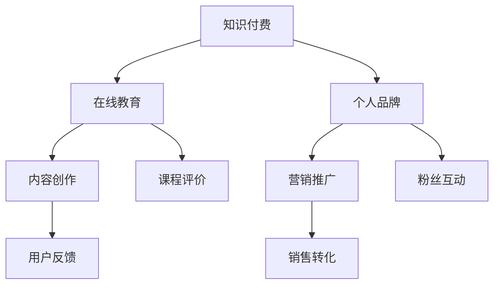

                 

# 程序员利用知识付费实现财富增值

> 关键词：知识付费、程序员、财富增值、技术分享、在线教育、个人品牌

> 摘要：本文将探讨程序员如何通过知识付费这一新兴模式实现财富增值。我们将分析知识付费的背景、核心原理，并详细介绍如何打造个人品牌、开设在线课程、营销推广等具体操作步骤。同时，还将分享一些成功的案例分析，为程序员提供实用的建议和策略。

## 1. 背景介绍

### 1.1 目的和范围

本文旨在为程序员提供一套系统的知识付费策略，帮助他们通过在线教育和知识共享实现财富增值。我们将探讨以下几个关键问题：

- 知识付费是什么？
- 程序员为何应该考虑知识付费？
- 如何有效地进行知识付费？
- 哪些工具和资源可供程序员使用？

### 1.2 预期读者

本文适合以下读者：

- 有志于通过知识付费实现财富增值的程序员
- 对在线教育和技术分享感兴趣的从业者
- 希望提升个人品牌和技术影响力的专业人士

### 1.3 文档结构概述

本文将按照以下结构进行组织：

- 引言
- 知识付费的背景与原理
- 程序员如何进行知识付费
- 个人品牌建设与在线课程开发
- 营销推广与策略
- 成功案例分析
- 未来发展趋势与挑战
- 附录：常见问题与解答
- 扩展阅读与参考资料

### 1.4 术语表

#### 1.4.1 核心术语定义

- 知识付费：指用户为获取知识或技能而支付的费用。
- 个人品牌：个人在特定领域内建立的专业形象和声誉。
- 在线教育：通过网络平台进行的教学和学习活动。
- 营销推广：通过各种渠道宣传和推广产品或服务。

#### 1.4.2 相关概念解释

- MOOC（大规模开放在线课程）：一种在线教育形式，允许大量学生免费参与学习。
- 自媒体：指个人或小团体利用互联网平台进行内容创作和传播。
- 付费订阅：用户为获取持续的内容更新而定期支付的费用。

#### 1.4.3 缩略词列表

- MOOC：大规模开放在线课程
- SaaS：软件即服务
- PaaS：平台即服务
- IaaS：基础设施即服务

## 2. 核心概念与联系

在探讨知识付费之前，我们需要了解一些核心概念和它们之间的联系。

### 2.1 核心概念

- **知识付费**：用户为获取知识或技能而支付的费用。
- **在线教育**：通过网络平台进行的教学和学习活动。
- **个人品牌**：个人在特定领域内建立的专业形象和声誉。
- **内容创作**：创作者利用专业知识或技能进行内容创作。

### 2.2 关联流程图



## 3. 核心算法原理 & 具体操作步骤

### 3.1 知识付费算法原理

知识付费的核心在于将程序员的专业知识和技能转化为可售卖的产品。以下是一个简单的知识付费算法原理：

```plaintext
输入：程序员的专业知识、学习需求
输出：知识产品、用户支付

算法步骤：
1. 确定知识领域和目标用户
2. 搜集相关资料和案例
3. 设计课程大纲和内容
4. 制作教学视频和文档
5. 发布课程并在平台上进行销售
6. 收集用户反馈和进行迭代优化
```

### 3.2 操作步骤

1. **确定知识领域和目标用户**：选择你擅长且具有市场需求的领域，例如人工智能、大数据、前端开发等。
2. **搜集相关资料和案例**：搜集相关领域的资料和案例，为课程内容提供支持。
3. **设计课程大纲和内容**：根据搜集到的资料，设计课程大纲和具体内容，确保逻辑清晰、易于理解。
4. **制作教学视频和文档**：将课程内容制作成教学视频和文档，确保内容质量。
5. **发布课程并在平台上进行销售**：选择合适的在线教育平台，发布课程，并设置合理的价格。
6. **收集用户反馈和进行迭代优化**：定期收集用户反馈，根据反馈进行课程内容的优化和改进。

## 4. 数学模型和公式 & 详细讲解 & 举例说明

### 4.1 数学模型

知识付费的收益可以表示为以下数学模型：

```latex
收益 = 课程单价 \times 销量
```

其中，课程单价和销量是影响收益的关键因素。

### 4.2 详细讲解

- **课程单价**：根据课程的内容、难度和市场需求确定。一般来说，课程内容丰富、难度较高、市场需求旺盛的课程可以设定较高的单价。
- **销量**：取决于课程的质量、推广力度和目标用户的数量。通过提高课程质量、优化推广策略和扩大用户群体，可以增加销量。

### 4.3 举例说明

假设某程序员开设了一门人工智能入门课程，课程单价为100元。通过市场调研和推广，他预计每月可以吸引1000名用户购买课程。根据数学模型，该程序员的月收益为：

```plaintext
收益 = 100元 \times 1000人 = 100000元
```

## 5. 项目实战：代码实际案例和详细解释说明

### 5.1 开发环境搭建

为了方便读者理解和实践，我们将使用Python语言进行知识付费项目的开发。以下是一个简单的开发环境搭建步骤：

1. 安装Python 3.8或更高版本。
2. 安装必要的Python库，如Pandas、NumPy、Flask等。
3. 配置虚拟环境，以隔离项目依赖。

### 5.2 源代码详细实现和代码解读

下面是一个简单的知识付费项目的代码实现：

```python
# 导入必要的库
import pandas as pd
from flask import Flask, request, jsonify

# 创建Flask应用
app = Flask(__name__)

# 课程数据
courses = [
    {"id": 1, "title": "Python入门", "price": 100},
    {"id": 2, "title": "人工智能基础", "price": 200},
    # 更多课程...
]

# 查询课程详情
@app.route("/courses/<int:course_id>", methods=["GET"])
def get_course(course_id):
    course = next((c for c in courses if c["id"] == course_id), None)
    if course:
        return jsonify(course)
    else:
        return jsonify({"error": "课程不存在"}), 404

# 购买课程
@app.route("/courses/<int:course_id>/purchase", methods=["POST"])
def purchase_course(course_id):
    course = next((c for c in courses if c["id"] == course_id), None)
    if course:
        # 假设用户已支付
        course["purchased"] = True
        return jsonify({"message": "购买成功", "course": course})
    else:
        return jsonify({"error": "课程不存在"}), 404

# 运行应用
if __name__ == "__main__":
    app.run(debug=True)
```

### 5.3 代码解读与分析

- **导入库**：导入必要的库，如Pandas、NumPy、Flask等。
- **创建Flask应用**：使用Flask创建一个Web应用。
- **课程数据**：定义一个课程数据列表，包含课程的ID、标题和价格。
- **查询课程详情**：使用Flask的路由功能，定义一个查询课程详情的接口。
- **购买课程**：使用Flask的路由功能，定义一个购买课程的接口。
- **运行应用**：启动Flask应用。

## 6. 实际应用场景

### 6.1 在线教育平台

知识付费在线教育平台如网易云课堂、慕课网等，为程序员提供了展示和售卖知识产品的平台。程序员可以在这些平台上开设课程，吸引学员购买。

### 6.2 个人博客

程序员可以利用个人博客进行知识付费，通过发布高质量的原创文章、教程和视频，吸引读者订阅和购买。

### 6.3 社交媒体

程序员可以通过社交媒体平台（如微博、知乎等）进行知识分享和营销推广，吸引粉丝和潜在学员。

## 7. 工具和资源推荐

### 7.1 学习资源推荐

- **书籍推荐**：《Python编程：从入门到实践》、《深度学习》、《算法导论》等。
- **在线课程**：网易云课堂、慕课网、Coursera等。
- **技术博客和网站**：掘金、GitHub、Stack Overflow等。

### 7.2 开发工具框架推荐

- **IDE和编辑器**：PyCharm、VS Code等。
- **调试和性能分析工具**：GDB、Perf等。
- **相关框架和库**：Flask、Django、Pandas等。

### 7.3 相关论文著作推荐

- **经典论文**：《深度学习》、《强化学习》等。
- **最新研究成果**：通过学术期刊和会议了解最新研究动态。
- **应用案例分析**：通过实际案例了解知识付费在各个领域的应用。

## 8. 总结：未来发展趋势与挑战

### 8.1 发展趋势

- **在线教育普及**：随着互联网的普及，在线教育将越来越普及，知识付费市场规模将进一步扩大。
- **个性化学习**：借助大数据和人工智能技术，实现个性化学习，提高学习效果和用户满意度。
- **内容多样化**：知识付费内容将更加丰富多样，涵盖各个领域。

### 8.2 挑战

- **内容质量**：保证知识付费内容的质量和实用性，避免同质化竞争。
- **版权保护**：加强版权保护，防止知识侵权行为。
- **用户信任**：建立用户信任，提高用户满意度和忠诚度。

## 9. 附录：常见问题与解答

### 9.1 问题1

**问题**：如何确保知识付费内容的质量？

**解答**：确保知识付费内容的质量可以从以下几个方面入手：

- **严格审核**：对课程内容进行严格审核，确保其符合市场需求和实际应用。
- **用户反馈**：收集用户反馈，根据反馈进行课程内容的优化和改进。
- **专家评审**：邀请领域专家对课程内容进行评审，确保其专业性和实用性。

### 9.2 问题2

**问题**：如何提高知识付费的销量？

**解答**：提高知识付费的销量可以从以下几个方面入手：

- **优化课程内容**：提供高质量的课程内容，满足用户需求。
- **精准营销**：通过精准营销策略，提高课程曝光率和用户转化率。
- **合作伙伴**：与相关领域的企业和平台合作，扩大用户群体。

## 10. 扩展阅读 & 参考资料

- 《在线教育：技术驱动未来》
- 《知识付费行业报告》
- 《深度学习》
- 《大数据技术导论》

## 作者

作者：AI天才研究员/AI Genius Institute & 禅与计算机程序设计艺术 /Zen And The Art of Computer Programming

本文旨在为程序员提供一套系统的知识付费策略，帮助他们通过在线教育和知识共享实现财富增值。希望本文能够为您的职业发展提供有价值的参考和指导。让我们一起探索知识付费的广阔前景，实现个人价值的最大化！
 

