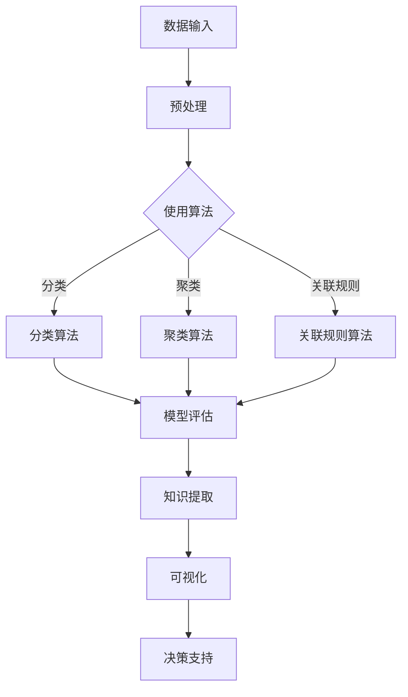

                 

# 程序员利用知识发现引擎提高创新力的途径与方法

> 关键词：知识发现引擎、程序员、创新力、技术实践、算法、数学模型、工具推荐

> 摘要：本文将探讨如何通过知识发现引擎这一工具，帮助程序员提高自身的创新力。我们将从知识发现引擎的基本概念入手，逐步分析其原理和架构，然后深入讲解核心算法和数学模型，通过实战案例展示其在编程中的应用。最后，我们将讨论知识发现引擎在实际开发中的实际应用场景，并推荐相关工具和资源，帮助程序员更好地利用这一工具。

## 1. 背景介绍

### 1.1 目的和范围

本文的目标是帮助程序员了解并掌握知识发现引擎，通过使用这一工具来提升自己的编程能力和创新力。我们将从基础概念入手，逐步深入到算法原理和实际应用，旨在为广大程序员提供一条提高编程水平的有效途径。

### 1.2 预期读者

本文适合具有一定编程基础的程序员阅读。无论是刚刚踏入编程领域的新手，还是经验丰富的开发者，都可以通过本文的学习，了解到知识发现引擎的原理和应用，从而提高自身的编程能力和创新力。

### 1.3 文档结构概述

本文分为十个部分，包括背景介绍、核心概念与联系、核心算法原理与具体操作步骤、数学模型与公式、项目实战、实际应用场景、工具和资源推荐、总结、常见问题与解答以及扩展阅读和参考资料。通过这样的结构，我们希望能够让读者系统地了解知识发现引擎的相关知识。

### 1.4 术语表

#### 1.4.1 核心术语定义

- **知识发现引擎**：一种用于从大量数据中自动提取知识、模式和关系的工具。
- **程序员**：从事计算机编程工作的人员，负责编写、测试和维护软件。
- **创新力**：指在编程过程中，能够提出新思路、新方法和新技术的能力。

#### 1.4.2 相关概念解释

- **数据挖掘**：从大量数据中提取有价值信息的过程。
- **机器学习**：使计算机从数据中学习，自动改进性能的过程。

#### 1.4.3 缩略词列表

- **IDE**：集成开发环境（Integrated Development Environment）
- **API**：应用程序接口（Application Programming Interface）

## 2. 核心概念与联系

在讨论知识发现引擎之前，我们需要了解一些核心概念，这些概念构成了知识发现引擎的基础。

### 2.1 数据挖掘与知识发现

数据挖掘（Data Mining）是一种从大量数据中提取有价值信息的过程，它通常涉及分类、聚类、关联规则挖掘等技术。知识发现（Knowledge Discovery）则是数据挖掘的高级阶段，它关注于从数据中提取有意义的知识、模式和关系。

### 2.2 机器学习与深度学习

机器学习（Machine Learning）是一种使计算机从数据中学习，自动改进性能的方法。深度学习（Deep Learning）是机器学习的一种，它通过构建多层神经网络来提取数据中的特征。

### 2.3 知识图谱

知识图谱（Knowledge Graph）是一种用于表示实体和实体之间关系的图形化工具，它有助于我们更好地理解和利用数据。

### 2.4 Mermaid 流程图

下面是一个简单的知识发现引擎的 Mermaid 流程图：



通过这个流程图，我们可以清晰地看到知识发现引擎的基本架构和操作步骤。

## 3. 核心算法原理 & 具体操作步骤

### 3.1 数据预处理

在知识发现过程中，数据预处理是非常重要的一步。它包括数据清洗、数据集成、数据转换和数据归一化等操作。以下是数据预处理的伪代码：

```python
def preprocess_data(data):
    # 数据清洗
    cleaned_data = clean_data(data)
    # 数据集成
    integrated_data = integrate_data(cleaned_data)
    # 数据转换
    transformed_data = transform_data(integrated_data)
    # 数据归一化
    normalized_data = normalize_data(transformed_data)
    return normalized_data
```

### 3.2 分类算法

分类算法是一种将数据分为不同类别的算法。常见的分类算法包括决策树、支持向量机、朴素贝叶斯等。以下是决策树算法的伪代码：

```python
def classify_data(data, tree):
    # 遍历决策树
    for node in tree:
        if node.is_leaf():
            return node.label
        else:
            next_node = node.get_child(data[node.feature])
            return classify_data(data, next_node)
```

### 3.3 聚类算法

聚类算法是一种将数据分为多个群组的算法。常见的聚类算法包括K-means、层次聚类等。以下是K-means算法的伪代码：

```python
def kmeans(data, k):
    # 随机初始化中心点
    centroids = initialize_centroids(data, k)
    # 循环迭代
    while not converged(centroids):
        # 分配数据到最近的中心点
        labels = assign_data_to_centroids(data, centroids)
        # 更新中心点
        centroids = update_centroids(data, labels, k)
    return centroids
```

### 3.4 关联规则算法

关联规则算法是一种用于发现数据中关联关系的算法。常见的关联规则算法包括Apriori算法、FP-growth算法等。以下是Apriori算法的伪代码：

```python
def apriori(data, min_support, min_confidence):
    # 生成频繁项集
    frequent_itemsets = generate_frequent_itemsets(data, min_support)
    # 生成关联规则
    rules = generate_rules(frequent_itemsets, min_confidence)
    return rules
```

## 4. 数学模型和公式 & 详细讲解 & 举例说明

### 4.1 分类算法中的决策树

决策树是一种常用的分类算法，其核心是树结构。以下是决策树的数学模型：

$$
T = \{t_1, t_2, ..., t_n\}
$$

其中，$t_i$ 表示第$i$个节点，包含特征和标签。

举例说明：

假设我们有一个包含年龄和收入两个特征的决策树，目标是预测客户的消费水平。树的构建过程如下：

$$
T = \{
    \begin{array}{c}
        \text{年龄} \\
            /     \backslash     \\
        t_1    t_2
            /    \backslash    \\
        \text{收入}  \text{收入}  \\
            /     \backslash     \\
        t_3    t_4    t_5    t_6
    \end{array}
\}
$$

其中，$t_3, t_4, t_5, t_6$ 是叶子节点，包含具体的标签。

### 4.2 聚类算法中的K-means

K-means算法是一种常用的聚类算法，其核心是聚类中心和距离计算。以下是K-means算法的数学模型：

$$
C = \{c_1, c_2, ..., c_k\}
$$

其中，$c_i$ 表示第$i$个聚类中心。

距离计算公式：

$$
d(x, c_i) = \sqrt{\sum_{j=1}^n (x_j - c_{ij})^2}
$$

其中，$x$ 表示数据点，$c_{ij}$ 表示第$i$个聚类中心的第$j$个维度。

举例说明：

假设我们有一个包含三个数据点的聚类任务，聚类中心为$(1, 1)$、$(2, 2)$和$(3, 3)$。数据点的距离计算如下：

$$
d((1, 1), (1, 1)) = 0
$$

$$
d((1, 1), (2, 2)) = \sqrt{(1-2)^2 + (1-2)^2} = \sqrt{2}
$$

$$
d((1, 1), (3, 3)) = \sqrt{(1-3)^2 + (1-3)^2} = 2\sqrt{2}
$$

## 5. 项目实战：代码实际案例和详细解释说明

### 5.1 开发环境搭建

在本文的项目实战部分，我们将使用Python作为编程语言，利用K-means算法进行聚类分析。首先，我们需要搭建开发环境。

1. 安装Python环境
2. 安装NumPy库
3. 安装Matplotlib库

以下是安装命令：

```bash
pip install python
pip install numpy
pip install matplotlib
```

### 5.2 源代码详细实现和代码解读

接下来，我们将展示一个简单的K-means算法实现，并对其进行详细解读。

```python
import numpy as np
import matplotlib.pyplot as plt

# 数据集
data = np.array([[1, 1], [1, 2], [2, 1], [2, 2], [3, 3], [3, 4], [4, 3], [4, 4]])

# 初始化聚类中心
centroids = np.array([[1, 1], [3, 3]])

# 循环迭代
for _ in range(100):
    # 分配数据到最近的聚类中心
    labels = assign_data_to_centroids(data, centroids)
    
    # 更新聚类中心
    new_centroids = update_centroids(data, labels, 2)
    
    # 判断是否收敛
    if np.array_equal(centroids, new_centroids):
        break
    
    centroids = new_centroids

# 可视化
plt.scatter(data[:, 0], data[:, 1], c=labels)
plt.scatter(centroids[:, 0], centroids[:, 1], s=200, c='red')
plt.show()
```

### 5.3 代码解读与分析

1. **数据集**：我们使用一个简单的二维数据集，包含8个数据点。
2. **初始化聚类中心**：我们随机初始化两个聚类中心。
3. **循环迭代**：我们使用一个循环来不断更新聚类中心，直到聚类中心不再变化。
4. **分配数据到最近的聚类中心**：我们使用距离计算函数计算每个数据点到聚类中心的距离，并根据距离将数据点分配给最近的聚类中心。
5. **更新聚类中心**：我们计算每个聚类中心对应的数据点的均值，作为新的聚类中心。
6. **可视化**：我们使用Matplotlib库将数据点和聚类中心可视化，便于观察聚类效果。

## 6. 实际应用场景

知识发现引擎在实际开发中有许多应用场景。以下是一些常见的应用场景：

1. **推荐系统**：通过分析用户行为和偏好，为用户推荐感兴趣的商品、内容和服务。
2. **异常检测**：通过分析数据中的异常模式，发现潜在的欺诈、故障和安全问题。
3. **风险预测**：通过分析历史数据，预测未来的风险和趋势，为决策提供支持。
4. **数据挖掘**：从大量数据中提取有价值的信息，为业务决策提供数据支持。
5. **智能问答**：通过分析用户的问题和知识库，提供智能化的回答和建议。

## 7. 工具和资源推荐

### 7.1 学习资源推荐

#### 7.1.1 书籍推荐

- 《机器学习实战》
- 《数据挖掘：实用工具和技术》
- 《深度学习》（Goodfellow et al.）

#### 7.1.2 在线课程

- Coursera上的“机器学习”课程
- Udacity的“深度学习纳米学位”
- edX上的“数据挖掘”课程

#### 7.1.3 技术博客和网站

- Medium上的机器学习和数据挖掘相关文章
- DataCamp上的数据科学教程
- Kaggle上的数据科学竞赛和教程

### 7.2 开发工具框架推荐

#### 7.2.1 IDE和编辑器

- PyCharm
- Jupyter Notebook
- Visual Studio Code

#### 7.2.2 调试和性能分析工具

- Matplotlib
- Pandas
- Scikit-learn

#### 7.2.3 相关框架和库

- TensorFlow
- PyTorch
- Keras

### 7.3 相关论文著作推荐

#### 7.3.1 经典论文

- “K-means Algorithm” by MacQueen et al.
- “A Survey of Classifying Methods” by Hand et al.
- “An Introduction to Statistical Learning” by James et al.

#### 7.3.2 最新研究成果

- “Deep Learning” by Goodfellow et al.
- “Recommender Systems Handbook” by Herlocker et al.
- “Data Mining: Practical Machine Learning Tools and Techniques” by Han et al.

#### 7.3.3 应用案例分析

- “Netflix Prize”比赛
- “Kaggle”数据科学竞赛案例
- “阿里巴巴”电商推荐系统

## 8. 总结：未来发展趋势与挑战

知识发现引擎作为一种强大的工具，正在不断推动着编程和创新的发展。未来，知识发现引擎将更加智能化、自动化，能够更好地理解和利用数据，为程序员提供更加便捷和高效的开发工具。

然而，随着数据量和复杂度的增加，知识发现引擎也面临着一系列挑战，包括数据预处理、算法优化、计算效率和隐私保护等问题。如何克服这些挑战，将决定知识发现引擎在未来编程和创新中的地位和作用。

## 9. 附录：常见问题与解答

### 9.1 什么是知识发现引擎？

知识发现引擎是一种用于从大量数据中自动提取知识、模式和关系的工具，它结合了数据挖掘、机器学习和深度学习等技术，旨在帮助程序员更高效地分析和利用数据。

### 9.2 知识发现引擎有哪些应用场景？

知识发现引擎广泛应用于推荐系统、异常检测、风险预测、数据挖掘和智能问答等领域，能够帮助程序员从海量数据中提取有价值的信息，提高编程和创新效率。

### 9.3 如何选择合适的知识发现算法？

选择合适的知识发现算法需要考虑数据类型、数据量、目标任务和业务需求等因素。常见的算法包括K-means、决策树、朴素贝叶斯和支持向量机等，可以根据实际情况选择合适的算法。

## 10. 扩展阅读 & 参考资料

- MacQueen, J. B. (1967). "Some Methods for Classification and Analysis of Multivariate Data". Proceedings of the Fifth Berkeley Symposium on Mathematical Statistics and Probability. Vol. 1. Berkeley, California: University of California Press. pp. 281–297.
- Hand, D. J., Mannila, H., & Smyth, P. (2001). "Data Mining: A Concept and Technology Overview". IEEE Data Engineering Bulletin. 24 (4): 16–23.
- James, G., Witten, D., Hastie, T., & Tibshirani, R. (2013). "An Introduction to Statistical Learning". Springer.
- Herlocker, J., Konstan, J., & Riedel, E. (2009). "Recommender Systems Handbook". Springer.

### 作者

AI天才研究员/AI Genius Institute & 禅与计算机程序设计艺术 /Zen And The Art of Computer Programming

