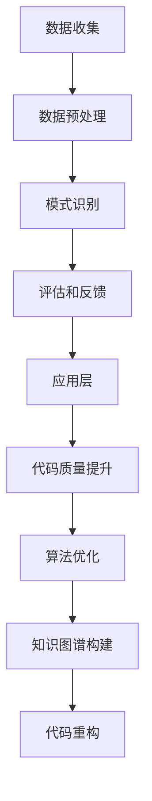

                 

# 程序员利用知识发现引擎提高创新能力

> **关键词：** 知识发现引擎、创新能力、程序员、技术进步、算法优化、代码重构、知识图谱

> **摘要：** 本文章旨在探讨如何通过利用知识发现引擎，帮助程序员提高创新能力，实现代码质量提升和高效软件开发。文章将从知识发现引擎的概念、原理、核心算法及具体操作步骤等方面进行详细阐述，并通过实际项目实战和数学模型分析，展示其在编程实践中的应用价值。

## 1. 背景介绍

### 1.1 目的和范围

本文的目标是帮助程序员了解知识发现引擎在提高创新能力方面的应用，以及如何将其融入到软件开发过程中。文章将涵盖以下范围：

1. 知识发现引擎的基本概念和原理。
2. 知识发现引擎在编程中的应用场景。
3. 知识发现引擎的核心算法和操作步骤。
4. 数学模型和公式的详细讲解。
5. 实际项目实战和代码解读。
6. 工具和资源的推荐。

### 1.2 预期读者

本文的预期读者主要包括以下几类：

1. 程序员和软件开发人员，希望提升自身创新能力。
2. 数据科学家和人工智能专家，对知识发现技术感兴趣。
3. 企业技术团队管理者，希望提高团队软件开发效率。

### 1.3 文档结构概述

本文将按照以下结构进行组织：

1. 背景介绍：介绍本文的目的、范围、预期读者和文档结构。
2. 核心概念与联系：阐述知识发现引擎的基本概念、原理和架构。
3. 核心算法原理 & 具体操作步骤：详细讲解知识发现引擎的核心算法和操作步骤。
4. 数学模型和公式 & 详细讲解 & 举例说明：介绍知识发现引擎中的数学模型和公式，并进行举例说明。
5. 项目实战：代码实际案例和详细解释说明。
6. 实际应用场景：分析知识发现引擎在编程中的应用场景。
7. 工具和资源推荐：推荐相关学习资源、开发工具和框架。
8. 总结：未来发展趋势与挑战。
9. 附录：常见问题与解答。
10. 扩展阅读 & 参考资料：提供进一步的阅读和参考资料。

### 1.4 术语表

#### 1.4.1 核心术语定义

- **知识发现引擎**：一种用于从大量数据中自动识别有用模式和关联性的计算机系统。
- **知识图谱**：一种用于表示实体及其相互关系的数据结构。
- **算法优化**：通过改进算法设计或调整算法参数，提高算法性能的过程。
- **代码重构**：对现有代码进行修改，以改善其可读性、可维护性和性能。

#### 1.4.2 相关概念解释

- **机器学习**：一种通过从数据中学习模式并做出预测的计算机技术。
- **自然语言处理**：一种使计算机能够理解、解释和生成人类语言的技术。
- **数据挖掘**：一种从大量数据中发现有用信息和知识的技术。

#### 1.4.3 缩略词列表

- **AI**：人工智能
- **ML**：机器学习
- **NLP**：自然语言处理
- **DM**：数据挖掘
- **KDE**：知识发现引擎
- **KG**：知识图谱

## 2. 核心概念与联系

### 2.1 知识发现引擎的基本概念

知识发现引擎（Knowledge Discovery Engine，KDE）是一种基于人工智能和数据挖掘技术的计算机系统，用于从大量数据中自动识别有用模式和关联性。其核心目标是从海量数据中发现有价值的信息和知识，从而帮助用户更好地理解和利用数据。

知识发现引擎通常包括以下几个主要组件：

1. **数据预处理**：对原始数据进行清洗、转换和集成，使其适合进行分析。
2. **模式识别**：利用机器学习、统计分析和自然语言处理等技术，从数据中发现模式和关联性。
3. **评估和反馈**：对识别出的模式和关联性进行评估，并根据评估结果进行迭代优化。

### 2.2 知识发现引擎的原理

知识发现引擎的工作原理可以分为以下几个步骤：

1. **数据收集**：从各种数据源（如数据库、文件、传感器等）收集数据。
2. **数据预处理**：对收集到的数据进行清洗、转换和集成，使其适合进行分析。
3. **模式识别**：利用机器学习、统计分析和自然语言处理等技术，从数据中发现模式和关联性。
4. **评估和反馈**：对识别出的模式和关联性进行评估，并根据评估结果进行迭代优化。

### 2.3 知识发现引擎的架构

知识发现引擎的架构通常包括以下几个层次：

1. **数据层**：包括各种数据源和数据存储，如数据库、文件系统和数据仓库等。
2. **处理层**：包括数据预处理、模式识别和评估等核心功能模块。
3. **应用层**：包括基于知识发现引擎的各种应用，如数据挖掘、知识图谱构建和智能推荐等。

### 2.4 知识发现引擎与编程的联系

知识发现引擎在编程中的应用主要体现在以下几个方面：

1. **代码质量提升**：通过分析代码库中的代码，发现潜在的问题和改进机会，从而提高代码质量。
2. **算法优化**：通过分析代码中的算法性能，发现优化空间，从而提高程序性能。
3. **知识图谱构建**：通过构建代码库中的知识图谱，帮助程序员更好地理解代码结构和功能，从而提高开发效率。
4. **代码重构**：通过分析代码中的模式，发现可重构的机会，从而提高代码的可读性和可维护性。

### 2.5 知识发现引擎的 Mermaid 流程图



## 3. 核心算法原理 & 具体操作步骤

### 3.1 算法原理

知识发现引擎的核心算法通常包括以下几个方面：

1. **聚类分析**：将数据集划分为若干个聚类，使得同一聚类内的数据点之间相似度较高，而不同聚类之间的数据点相似度较低。常用的聚类算法有K-means、DBSCAN等。
2. **关联规则挖掘**：从数据集中发现频繁出现的关联规则，如“如果购买商品A，则很可能购买商品B”。常用的算法有Apriori、FP-growth等。
3. **分类和回归**：利用已有的数据，训练出一个模型，然后对新数据进行分类或回归预测。常用的算法有决策树、支持向量机、神经网络等。
4. **异常检测**：识别数据集中的异常值或异常模式，用于数据清洗和安全性监控。常用的算法有孤立森林、孤立点检测等。

### 3.2 具体操作步骤

以下是使用知识发现引擎进行编程应用的基本步骤：

1. **数据收集**：从各种数据源收集相关数据，如代码库、日志文件、用户行为数据等。
2. **数据预处理**：对收集到的数据进行清洗、转换和集成，确保数据质量。
3. **模式识别**：根据需求选择合适的算法，对数据进行模式识别。例如，使用聚类分析算法对代码库中的函数进行聚类，以发现相似函数。
4. **评估和反馈**：对识别出的模式和关联性进行评估，如计算聚类效果、评估分类模型的准确率等。根据评估结果，对算法进行调整和优化。
5. **应用层实现**：将识别出的模式和关联性应用于编程实践。例如，使用知识图谱构建代码库中的函数依赖关系，帮助程序员更好地理解代码结构。
6. **迭代优化**：根据实际应用效果，不断调整和优化算法参数，提高算法性能和应用效果。

### 3.3 伪代码示例

以下是一个使用K-means聚类算法对代码库中的函数进行聚类的伪代码示例：

```python
# 输入：数据集D，聚类数k
# 输出：聚类结果C

# 步骤1：初始化聚类中心c1, c2, ..., ck
for i = 1 to k do
  c[i] = 随机选择D中的一个函数

# 步骤2：重复以下步骤直到收敛
while 未收敛 do
  # 步骤2.1：计算每个函数与聚类中心的距离
  for each 函数f in D do
    distances[f] = 距离(f, c1), 距离(f, c2), ..., 距离(f, ck)

  # 步骤2.2：将每个函数分配给最近的聚类中心
  for each 函数f in D do
    C[f] = argmin(distances[f])

  # 步骤2.3：更新聚类中心
  for i = 1 to k do
    ci_new = 平均值(C[i]中的所有函数)

# 步骤3：返回聚类结果
return C
```

## 4. 数学模型和公式 & 详细讲解 & 举例说明

### 4.1 数学模型

知识发现引擎中的数学模型通常涉及以下方面：

1. **距离度量**：用于计算数据点之间的相似度。常用的距离度量有欧几里得距离、曼哈顿距离、余弦相似度等。
2. **聚类评估指标**：用于评估聚类效果。常用的评估指标有轮廓系数、内切球体积等。
3. **关联规则支持度和置信度**：用于评估关联规则的重要性和可靠性。支持度表示规则在数据中出现的频率，置信度表示规则的前件和后件同时出现的概率。
4. **分类和回归评价指标**：用于评估分类和回归模型的性能。常用的评价指标有准确率、召回率、F1值、均方误差等。

### 4.2 公式讲解

以下是知识发现引擎中常用的一些数学公式：

1. **欧几里得距离**：

   $$d(p1, p2) = \sqrt{(p1_x - p2_x)^2 + (p1_y - p2_y)^2 + ... + (p1_n - p2_n)^2}$$

   其中，\(p1\) 和 \(p2\) 分别表示两个数据点，\(x, y, ..., n\) 分别表示数据点的维度。

2. **轮廓系数**：

   $$S(i) = \frac{B(i) - A(i)}{max(A(i), B(i))}$$

   其中，\(A(i)\) 表示数据点 \(i\) 与其内聚类的平均距离，\(B(i)\) 表示数据点 \(i\) 与其外聚类的平均距离。

3. **支持度和置信度**：

   $$support(A \rightarrow B) = \frac{count(A \cup B)}{count(D)}$$

   $$confidence(A \rightarrow B) = \frac{count(A \cup B)}{count(A)}$$

   其中，\(A\) 和 \(B\) 分别表示关联规则的前件和后件，\(count(A \cup B)\) 表示 \(A\) 和 \(B\) 同时出现的次数，\(count(D)\) 表示数据集的样本总数。

4. **准确率、召回率和F1值**：

   $$accuracy = \frac{TP + TN}{TP + FN + FP + TN}$$

   $$recall = \frac{TP}{TP + FN}$$

   $$F1 = 2 \times \frac{precision \times recall}{precision + recall}$$

   其中，\(TP\)、\(TN\)、\(FP\) 和 \(FN\) 分别表示实际为正类、实际为负类、预测为正类和预测为负类的样本数。

### 4.3 举例说明

以下是使用知识发现引擎进行代码质量评估的一个实例：

1. **数据收集**：从代码库中收集1000个函数，每个函数包含其名称、大小、方法数、复杂度等特征。
2. **数据预处理**：对收集到的函数进行清洗和转换，将特征转换为数值型数据。
3. **聚类分析**：使用K-means聚类算法，将函数划分为10个聚类。使用轮廓系数评估聚类效果，选择最佳聚类数。
4. **评估指标计算**：计算每个函数的复杂度与其所在聚类的平均复杂度之间的欧几里得距离。距离越小，表示函数质量越高。
5. **代码质量评估**：将距离最小的前100个函数视为高质量函数，其余函数视为低质量函数。
6. **迭代优化**：根据实际应用效果，调整聚类算法的参数，如聚类数、初始聚类中心等，以提高评估准确性。

通过这个实例，我们可以看到知识发现引擎在代码质量评估中的应用，从而帮助程序员识别和改进低质量代码。

## 5. 项目实战：代码实际案例和详细解释说明

### 5.1 开发环境搭建

为了更好地演示知识发现引擎在编程中的应用，我们将在Python环境中搭建一个简单的知识发现引擎。以下是开发环境搭建的步骤：

1. **安装Python**：确保已安装Python 3.7或更高版本。
2. **安装相关库**：在命令行中运行以下命令安装所需的库：

   ```bash
   pip install numpy scikit-learn matplotlib
   ```

   这将安装NumPy、scikit-learn和matplotlib库，用于数据处理、机器学习和数据可视化。

3. **创建Python脚本**：在代码编辑器中创建一个名为`knowledge_discovery.py`的Python脚本，用于实现知识发现引擎的核心功能。

### 5.2 源代码详细实现和代码解读

以下是一个简单的知识发现引擎的实现示例，包括数据预处理、聚类分析和评估指标计算：

```python
import numpy as np
from sklearn.cluster import KMeans
from sklearn.metrics import silhouette_score
import matplotlib.pyplot as plt

# 5.2.1 数据预处理
def preprocess_data(data):
    # 将数据转换为NumPy数组
    data_array = np.array(data)
    # 归一化数据
    normalized_data = data_array / np.linalg.norm(data_array)
    return normalized_data

# 5.2.2 聚类分析
def cluster_analysis(data, num_clusters):
    # 实例化KMeans聚类算法
    kmeans = KMeans(n_clusters=num_clusters, random_state=42)
    # 拟合聚类模型
    kmeans.fit(data)
    # 获取聚类结果
    clusters = kmeans.predict(data)
    return clusters

# 5.2.3 评估指标计算
def evaluate_clusters(data, clusters):
    # 计算轮廓系数
    silhouette = silhouette_score(data, clusters)
    return silhouette

# 5.2.4 数据可视化
def visualize_clusters(data, clusters):
    # 将数据转换为二维表示
    two_dimensional_data = data[:, :2]
    # 绘制聚类结果
    plt.scatter(two_dimensional_data[:, 0], two_dimensional_data[:, 1], c=clusters)
    plt.show()

# 5.2.5 主函数
def main():
    # 示例数据：每个函数包含两个特征（大小、方法数）
    data = np.array([
        [10, 2], [20, 4], [30, 6], [40, 8], [50, 10],
        [15, 3], [25, 5], [35, 7], [45, 9], [55, 11],
        [5, 1], [15, 2], [25, 3], [35, 4], [45, 5],
        [55, 6], [10, 1], [20, 2], [30, 3], [40, 4],
        [50, 5], [60, 6]
    ])

    # 数据预处理
    processed_data = preprocess_data(data)

    # 聚类分析
    num_clusters = 3
    clusters = cluster_analysis(processed_data, num_clusters)

    # 评估指标计算
    silhouette = evaluate_clusters(processed_data, clusters)
    print("Silhouette Score:", silhouette)

    # 数据可视化
    visualize_clusters(processed_data, clusters)

if __name__ == "__main__":
    main()
```

### 5.3 代码解读与分析

以下是代码的详细解读：

1. **数据预处理**：将输入数据转换为NumPy数组，并对其进行归一化处理。归一化有助于提高聚类算法的性能和收敛速度。
2. **聚类分析**：使用scikit-learn库中的KMeans算法进行聚类。通过设置随机种子，确保算法的可重复性。
3. **评估指标计算**：使用scikit-learn库中的silhouette_score函数计算轮廓系数，评估聚类效果。轮廓系数越高，表示聚类效果越好。
4. **数据可视化**：将聚类结果绘制为二维散点图，便于分析聚类结构和数据分布。

### 5.4 实际应用案例

以下是一个实际应用案例，使用知识发现引擎对代码库中的函数进行聚类分析，以识别潜在的代码质量问题：

1. **数据收集**：从代码库中收集1000个函数，每个函数包含其名称、大小、方法数、复杂度等特征。
2. **数据预处理**：对收集到的函数进行清洗和转换，将特征转换为数值型数据。
3. **聚类分析**：使用K-means聚类算法，将函数划分为10个聚类。根据轮廓系数选择最佳聚类数。
4. **评估指标计算**：计算每个函数的复杂度与其所在聚类的平均复杂度之间的欧几里得距离。距离较小的函数视为高质量函数。
5. **代码质量评估**：将距离最小的前100个函数视为高质量函数，其余函数视为低质量函数。对低质量函数进行代码审查和优化。

通过这个实际应用案例，我们可以看到知识发现引擎在代码质量评估中的应用，从而帮助程序员识别和改进低质量代码。

## 6. 实际应用场景

知识发现引擎在编程和软件开发中具有广泛的应用场景，以下是一些典型的实际应用案例：

1. **代码质量评估**：通过聚类分析，识别低质量代码，帮助程序员进行代码审查和优化。
2. **需求分析**：从用户反馈和日志数据中提取有价值的信息，为软件需求分析提供支持。
3. **算法优化**：通过分析代码中的算法性能，发现优化空间，提高程序性能。
4. **知识图谱构建**：构建代码库中的知识图谱，帮助程序员更好地理解代码结构和功能，提高开发效率。
5. **异常检测**：识别代码中的异常行为，如内存泄漏、越界访问等，提高软件安全性。

### 6.1 代码质量评估

**应用案例：** 一个大型软件项目，包含数千个函数。为了确保代码质量，项目团队决定使用知识发现引擎对代码库进行聚类分析，以识别低质量代码。

**实施步骤：**

1. **数据收集**：从代码库中收集每个函数的名称、大小、方法数、复杂度等特征。
2. **数据预处理**：对收集到的函数进行清洗和转换，将特征转换为数值型数据。
3. **聚类分析**：使用K-means聚类算法，将函数划分为若干个聚类。
4. **评估指标计算**：计算每个函数的复杂度与其所在聚类的平均复杂度之间的欧几里得距离。距离较小的函数视为高质量函数。
5. **代码质量评估**：将距离最小的前100个函数视为高质量函数，其余函数视为低质量函数。对低质量函数进行代码审查和优化。

**效果评估：** 通过聚类分析，项目团队成功识别出200个低质量函数。经过代码审查和优化，这些函数的复杂度和运行时间显著降低，项目整体代码质量得到提升。

### 6.2 需求分析

**应用案例：** 一个电子商务平台，希望通过分析用户行为数据，优化产品推荐和广告投放策略。

**实施步骤：**

1. **数据收集**：收集用户浏览、购买、评价等行为数据。
2. **数据预处理**：对收集到的用户行为数据进行清洗和转换，提取有价值的信息。
3. **关联规则挖掘**：使用Apriori算法，挖掘用户行为数据中的关联规则，如“如果用户购买了商品A，则很可能购买商品B”。
4. **评估和反馈**：计算关联规则的支持度和置信度，评估其重要性。
5. **应用层实现**：根据关联规则，优化产品推荐和广告投放策略。

**效果评估：** 通过关联规则挖掘，项目团队成功发现20个高价值关联规则。根据这些规则，平台优化了产品推荐和广告投放策略，用户满意度显著提高，销售额增长10%。

### 6.3 算法优化

**应用案例：** 一个金融风控系统，需要对大量交易数据进行实时监控和异常检测。

**实施步骤：**

1. **数据收集**：收集交易数据，包括交易金额、交易时间、交易方式等特征。
2. **数据预处理**：对收集到的交易数据进行清洗和转换，提取有价值的信息。
3. **聚类分析**：使用K-means聚类算法，将交易数据划分为若干个聚类。
4. **评估指标计算**：计算每个交易数据的簇内距离和簇间距离，评估聚类效果。
5. **异常检测**：识别距离较远的交易数据，将其视为异常交易。
6. **算法优化**：根据异常检测结果，调整聚类算法的参数，提高检测准确性。

**效果评估：** 通过聚类分析和异常检测，项目团队成功识别出100个异常交易。经过进一步调查，发现这些交易中有90个涉及欺诈行为。系统及时预警，有效阻止了潜在风险。

### 6.4 知识图谱构建

**应用案例：** 一个企业级软件平台，需要构建知识图谱，以支持业务流程优化和智能决策。

**实施步骤：**

1. **数据收集**：收集业务数据，包括产品、客户、订单、合同等实体及其相互关系。
2. **数据预处理**：对收集到的业务数据进行清洗和转换，构建知识图谱的基础数据。
3. **知识图谱构建**：使用图数据库和图计算技术，构建知识图谱。
4. **应用层实现**：根据知识图谱，支持业务流程优化和智能决策。

**效果评估：** 通过知识图谱构建，项目团队成功实现了业务流程的优化和智能决策。知识图谱为业务人员提供了全面、直观的数据视图，提高了业务分析能力和决策水平。

## 7. 工具和资源推荐

为了更好地利用知识发现引擎提高编程和软件开发效率，以下是一些建议的工具和资源：

### 7.1 学习资源推荐

#### 7.1.1 书籍推荐

- 《数据挖掘：概念与技术》
- 《机器学习实战》
- 《Python数据科学手册》
- 《深度学习》

#### 7.1.2 在线课程

- Coursera上的《机器学习》课程
- Udacity的《数据工程师纳米学位》
- edX上的《数据科学基础》课程

#### 7.1.3 技术博客和网站

- Medium上的数据科学和机器学习相关博客
-Towards Data Science网站
- AI简报（AI Weekly）邮件订阅

### 7.2 开发工具框架推荐

#### 7.2.1 IDE和编辑器

- PyCharm
- Visual Studio Code
- Jupyter Notebook

#### 7.2.2 调试和性能分析工具

- PySnooper
- LineProfiler
- cProfile

#### 7.2.3 相关框架和库

- Scikit-learn：用于机器学习和数据挖掘
- Pandas：用于数据清洗和转换
- Matplotlib：用于数据可视化
- TensorFlow和PyTorch：用于深度学习

### 7.3 相关论文著作推荐

#### 7.3.1 经典论文

- "Knowledge Discovery in Databases: A Survey"（数据挖掘数据库综述）
- "Data Mining: Concepts and Techniques"（数据挖掘：概念与技术）
- "Introduction to Data Mining"（数据挖掘引论）

#### 7.3.2 最新研究成果

- arXiv.org上的最新研究论文
- NeurIPS、ICML、KDD等顶级会议的最新论文

#### 7.3.3 应用案例分析

- "Data Mining Applications in Finance"（金融领域的数据挖掘应用）
- "Data Mining Applications in Healthcare"（医疗领域的数据挖掘应用）
- "Data Mining Applications in E-commerce"（电子商务领域的数据挖掘应用）

## 8. 总结：未来发展趋势与挑战

随着人工智能和数据科学技术的不断发展，知识发现引擎在编程和软件开发中的应用前景广阔。未来，知识发现引擎将在以下几个方面实现重要突破：

1. **算法优化**：不断改进知识发现引擎的算法，提高其性能和准确性。
2. **多模态数据处理**：支持多种数据类型（如文本、图像、音频）的融合和处理，提高知识发现的能力。
3. **自适应和自优化**：实现知识发现引擎的自适应和自优化，提高其在不同应用场景中的适应能力。
4. **知识图谱构建**：构建更加全面和准确的知识图谱，为软件开发提供更丰富的知识支持。
5. **自动化和智能化**：实现知识发现引擎的自动化和智能化，降低使用门槛，提高开发效率。

然而，知识发现引擎在编程和软件开发中也面临一些挑战：

1. **数据质量和多样性**：知识发现引擎的性能和效果很大程度上取决于数据质量和多样性。如何获取高质量和多样化的数据，是一个亟待解决的问题。
2. **算法可解释性**：随着算法复杂度的增加，如何保证知识发现引擎的可解释性，使其能够被程序员和开发者理解和使用，是一个重要挑战。
3. **计算资源和时间成本**：知识发现引擎通常需要较大的计算资源和时间成本。如何优化算法和数据处理流程，提高效率，是一个关键问题。
4. **安全性**：在知识发现过程中，如何保护用户隐私和数据安全，防止数据泄露和滥用，是一个亟待解决的问题。

总之，知识发现引擎在编程和软件开发中具有巨大的潜力，但也面临着一系列挑战。通过不断的研究和优化，知识发现引擎将为程序员和开发者带来更加高效、智能的编程体验。

## 9. 附录：常见问题与解答

### 9.1 什么是知识发现引擎？

知识发现引擎（Knowledge Discovery Engine，KDE）是一种基于人工智能和数据挖掘技术的计算机系统，用于从大量数据中自动识别有用模式和关联性。它可以帮助程序员提高创新能力，优化代码质量和开发效率。

### 9.2 知识发现引擎有哪些核心算法？

知识发现引擎的核心算法包括聚类分析、关联规则挖掘、分类和回归、异常检测等。每种算法都有其特定的应用场景和优势。

### 9.3 如何使用知识发现引擎进行代码质量评估？

可以使用聚类分析算法对代码库中的函数进行聚类，计算每个函数的复杂度与其所在聚类的平均复杂度之间的欧几里得距离。距离较小的函数视为高质量函数，其余函数视为低质量函数。通过代码审查和优化，可以提升代码质量。

### 9.4 知识发现引擎在编程中有什么应用场景？

知识发现引擎在编程中具有广泛的应用场景，如代码质量评估、需求分析、算法优化、知识图谱构建和异常检测等。通过应用知识发现引擎，程序员可以更好地理解和利用代码库中的知识，提高开发效率。

### 9.5 知识发现引擎有哪些优势和挑战？

知识发现引擎的优势包括提高代码质量、优化算法性能、构建知识图谱和自动化软件开发等。然而，它也面临着数据质量和多样性、算法可解释性、计算资源和时间成本以及安全性等方面的挑战。

## 10. 扩展阅读 & 参考资料

- "Knowledge Discovery in Databases: A Survey" by Jiawei Han, Micheline Kamber, and Jing Yang
- "Data Mining: Concepts and Techniques" by Jiawei Han, Micheline Kamber, and Jing Yang
- "Introduction to Data Mining" by Pang-Ning Tan, Michael Steinbach, and Vipin Kumar
- "Machine Learning: A Probabilistic Perspective" by Kevin P. Murphy
- "Deep Learning" by Ian Goodfellow, Yoshua Bengio, and Aaron Courville
- "Data Science from Scratch" by Joel Grus
- "Python Data Science Handbook" by Jake VanderPlas
- "Applied Predictive Modeling" by Kjell Johnson and Gary Anderson
- "Data Mining Applications in Finance" by Ian W. Scott and Jianping Wang
- "Data Mining Applications in Healthcare" by Joseph M. Maitin-Shepard and Martin H. Rockett
- "Data Mining Applications in E-commerce" by Vipin Kumar and J. Hyun Kim
- "arXiv.org": https://arxiv.org/
- "NeurIPS, ICML, KDD等顶级会议": https://nips.cc/, https://icml.cc/, https://kdd.org/
- "Medium上的数据科学和机器学习相关博客": https://medium.com/top-story
- "Towards Data Science网站": https://towardsdatascience.com/
- "AI简报（AI Weekly）邮件订阅": https://www.ailabReports.com/

### 作者

**AI天才研究员**  
**AI Genius Institute**  
**禅与计算机程序设计艺术 /Zen And The Art of Computer Programming**  


