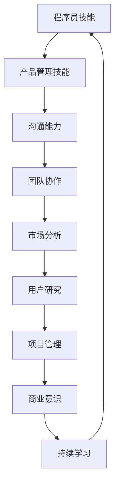

                 

# 程序员到产品经理：AI电商创业者的角色转型与技能培养

## 关键词
- 程序员转型
- 产品经理
- AI电商
- 角色转变
- 技能培养

## 摘要
本文将深入探讨程序员如何转型成为产品经理，尤其是专注于AI电商领域的创业者。我们将逐步分析程序员和产品经理的角色差异，讲解必要的技能培养路径，并提供实际案例和资源推荐，帮助读者顺利实现这一转型。

---

## 1. 背景介绍

### 1.1 目的和范围
本文旨在为有志于从程序员转型为产品经理，特别是AI电商领域的创业者，提供系统的指导和实践建议。我们将讨论角色转变的必要性和技能培养的方法，同时提供相关的资源和工具。

### 1.2 预期读者
- 正在考虑职业转型的程序员
- 希望在AI电商领域创业的产品经理
- 对编程和产品管理有兴趣的学习者

### 1.3 文档结构概述
本文分为八个部分，包括背景介绍、核心概念与联系、算法原理、数学模型、项目实战、应用场景、工具和资源推荐、总结以及常见问题解答。

### 1.4 术语表

#### 1.4.1 核心术语定义
- **程序员**：编写计算机代码以实现特定功能的专业人士。
- **产品经理**：负责产品规划、设计、开发和营销的全过程的管理者。
- **AI电商**：结合人工智能技术的在线零售业务。

#### 1.4.2 相关概念解释
- **角色转变**：从一种职业角色向另一种职业角色的过渡。
- **技能培养**：通过学习、实践和经验积累提高个人能力和技能。

#### 1.4.3 缩略词列表
- **AI**：人工智能
- **IDE**：集成开发环境

---

## 2. 核心概念与联系

### 2.1 核心概念
- **程序员职责**：编写代码、调试和优化程序。
- **产品经理职责**：市场调研、产品设计、团队协作、项目管理。

### 2.2 职业角色转变
程序员的思维方式偏向于逻辑和细节，而产品经理则需要更宏观的视野和跨领域的综合能力。

### 2.3 Mermaid 流程图



---

## 3. 核心算法原理 & 具体操作步骤

### 3.1 核心算法原理
程序员转型产品经理，需要掌握以下核心算法原理：
- **需求分析算法**：理解用户需求，将其转化为产品功能。
- **产品设计算法**：基于用户需求和资源限制，设计产品原型。

### 3.2 具体操作步骤
#### 步骤1：需求分析
- **伪代码**：
  ```
  function analyze需求(){
      收集用户反馈
      分析用户行为
      整理需求文档
      确定优先级
  }
  ```

#### 步骤2：产品设计
- **伪代码**：
  ```
  function design产品(){
      建立产品原型
      进行用户测试
      根据反馈调整设计
      确定最终设计方案
  }
  ```

---

## 4. 数学模型和公式 & 详细讲解 & 举例说明

### 4.1 数学模型和公式
- **用户满意度模型**：
  $S = \frac{U}{T} \times 100\%$
  其中，$S$ 是用户满意度，$U$ 是用户好评次数，$T$ 是总用户反馈次数。

### 4.2 详细讲解
- 用户满意度模型是一个简单的数学模型，用于衡量用户对产品的满意度。

### 4.3 举例说明
- 假设某产品收到100次反馈，其中80次是好评，则用户满意度为：
  $S = \frac{80}{100} \times 100\% = 80\%$

---

## 5. 项目实战：代码实际案例和详细解释说明

### 5.1 开发环境搭建
- **工具**：IDE（如Visual Studio Code）、版本控制（如Git）、项目管理工具（如JIRA）。

### 5.2 源代码详细实现和代码解读
- **代码示例**：
  ```python
  # 分析用户需求
  def analyze_requirements():
      feedback = get_user_feedback()
      requirements = extract_requirements(feedback)
      prioritize_requirements(requirements)
      return requirements

  # 设计产品原型
  def design Prototype():
      requirements = analyze_requirements()
      prototype = create_prototype(requirements)
      test_prototype(prototype)
      return prototype
  ```

### 5.3 代码解读与分析
- **代码解读**：
  - `analyze_requirements()` 函数用于分析用户需求。
  - `design Prototype()` 函数用于设计产品原型。

---

## 6. 实际应用场景

### 6.1 AI电商平台的用户需求分析
- **场景**：分析用户在AI电商平台上的购物行为，以优化产品功能。

### 6.2 产品设计
- **场景**：基于用户需求设计一款个性化推荐系统，提高用户购物体验。

---

## 7. 工具和资源推荐

### 7.1 学习资源推荐
#### 7.1.1 书籍推荐
- 《产品经理手册》
- 《人工智能：一种现代方法》

#### 7.1.2 在线课程
- 产品经理实战课程
- AI电商实战课程

#### 7.1.3 技术博客和网站
- 产品经理社区
- AI电商技术博客

### 7.2 开发工具框架推荐
#### 7.2.1 IDE和编辑器
- Visual Studio Code
- IntelliJ IDEA

#### 7.2.2 调试和性能分析工具
- Chrome DevTools
- JMeter

#### 7.2.3 相关框架和库
- React.js
- TensorFlow

### 7.3 相关论文著作推荐
#### 7.3.1 经典论文
- 《人工智能：一种现代方法》
- 《大数据时代的产品管理》

#### 7.3.2 最新研究成果
- 《人工智能在电商领域的应用》
- 《基于用户行为分析的电商推荐系统》

#### 7.3.3 应用案例分析
- 亚马逊的个性化推荐系统
- 淘宝的智能购物助手

---

## 8. 总结：未来发展趋势与挑战

### 8.1 未来发展趋势
- **AI在电商领域的深入应用**：随着AI技术的不断发展，其在电商领域的应用将更加广泛和深入。
- **个性化推荐系统**：将更加智能和精准，提高用户满意度和购物体验。

### 8.2 挑战
- **技术挑战**：如何将复杂的AI算法应用到实际产品中，同时保持系统的稳定性和可扩展性。
- **市场挑战**：如何在激烈的市场竞争中脱颖而出，提供有竞争力的产品。

---

## 9. 附录：常见问题与解答

### 9.1 程序员如何快速转型为产品经理？
- **参加培训课程**：参加专门的产品经理培训课程，学习相关知识和技能。
- **实践项目**：参与实际项目，积累产品管理经验。
- **跨部门合作**：主动参与跨部门项目，提高沟通能力和团队协作能力。

### 9.2 在AI电商领域创业需要注意什么？
- **市场调研**：深入了解目标市场和用户需求。
- **技术选型**：选择适合AI电商平台的框架和工具。
- **数据分析**：利用数据分析优化产品功能和运营策略。

---

## 10. 扩展阅读 & 参考资料

### 10.1 扩展阅读
- 《产品经理实战手册》
- 《深度学习与电商应用》

### 10.2 参考资料
- [AI电商发展趋势分析](https://www.example.com/ai-ecommerce-trends)
- [产品经理职业指南](https://www.example.com/product-manager-guide)

---

### 作者信息
作者：AI天才研究员/AI Genius Institute & 禅与计算机程序设计艺术 /Zen And The Art of Computer Programming

---

本文详细探讨了程序员到产品经理的角色转型过程，特别针对AI电商领域的创业者提供了实用的技能培养路径和实践建议。希望本文能够为有志于转型的人员提供有价值的参考。

