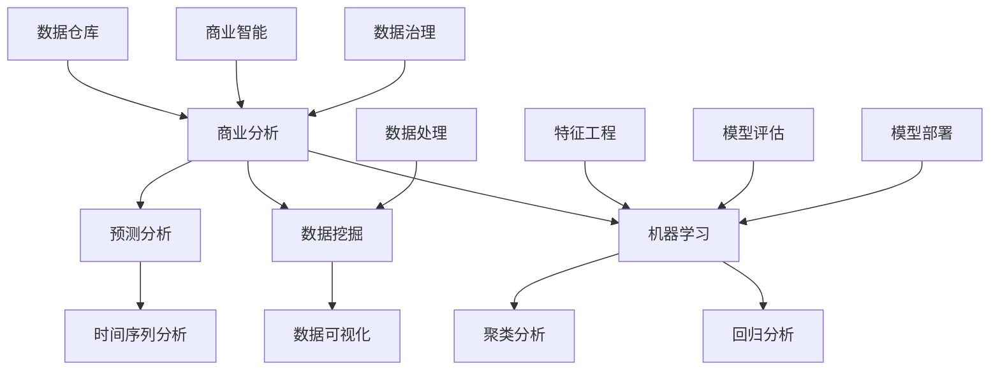

                 

# 程序员到商业分析师：AI电商创业者的数据洞察能力培养路径

> **关键词：** 程序员，商业分析师，AI电商，数据洞察，能力培养，创业路径

> **摘要：** 本文旨在探讨程序员转型为商业分析师的路径，特别是在AI电商领域的实际应用。通过深入分析核心概念、算法原理、数学模型和项目实战，本文将帮助读者理解如何通过数据洞察能力来提升电商创业的成功率。

## 1. 背景介绍

### 1.1 目的和范围

随着大数据和人工智能的迅猛发展，数据在商业决策中的重要性日益凸显。程序员转型为商业分析师，尤其是在AI电商领域，成为了许多技术人才的新选择。本文的目的在于提供一条清晰的转型路径，帮助程序员培养数据洞察能力，从而在电商创业中发挥重要作用。

本文的范围涵盖了以下几个方面：
- **核心概念与联系**：介绍商业分析中涉及的关键概念，如数据挖掘、机器学习、预测分析等。
- **核心算法原理**：详细解析常用的商业分析算法，包括分类、聚类、回归等。
- **数学模型与公式**：探讨商业分析中常用的数学模型和公式，如线性回归、逻辑回归等。
- **项目实战**：通过实际案例，展示商业分析在电商创业中的应用。
- **实际应用场景**：讨论商业分析在不同电商领域的应用场景。
- **工具和资源推荐**：推荐学习资源、开发工具和相关论文。

### 1.2 预期读者

本文主要面向以下读者群体：
- **程序员**：希望转型为商业分析师，特别是在AI电商领域发展的程序员。
- **商业分析师**：希望进一步提升数据洞察能力的专业人士。
- **电商创业者**：需要借助数据来优化商业决策的创业者。

### 1.3 文档结构概述

本文的结构如下：
- **第1章**：背景介绍，包括目的和范围、预期读者、文档结构概述和术语表。
- **第2章**：核心概念与联系，介绍商业分析中涉及的关键概念。
- **第3章**：核心算法原理，详细解析常用的商业分析算法。
- **第4章**：数学模型和公式，探讨商业分析中常用的数学模型和公式。
- **第5章**：项目实战，通过实际案例展示商业分析的应用。
- **第6章**：实际应用场景，讨论商业分析在不同电商领域的应用。
- **第7章**：工具和资源推荐，包括学习资源、开发工具和相关论文。
- **第8章**：总结，讨论未来发展趋势与挑战。
- **第9章**：附录，提供常见问题与解答。
- **第10章**：扩展阅读与参考资料。

### 1.4 术语表

#### 1.4.1 核心术语定义

- **商业分析师**：负责使用数据分析和统计方法，帮助企业做出明智的商业决策的专业人士。
- **数据挖掘**：从大量数据中提取出有价值信息的过程。
- **机器学习**：使计算机系统能够从数据中学习并做出决策的一种方法。
- **预测分析**：基于历史数据和统计模型，对未来事件进行预测的方法。
- **电商创业**：利用互联网平台，通过在线销售商品或提供服务来开展商业活动的创业形式。

#### 1.4.2 相关概念解释

- **数据可视化**：将数据以图形、图表等形式展示，帮助人们更好地理解和分析数据。
- **回归分析**：用于预测一个变量基于另一个变量的变化情况的一种统计方法。
- **聚类分析**：将数据分组为若干个类别，使同一组内的数据尽可能相似，不同组的数据尽可能不同。

#### 1.4.3 缩略词列表

- **AI**：人工智能（Artificial Intelligence）
- **ML**：机器学习（Machine Learning）
- **DL**：深度学习（Deep Learning）
- **DL**：大数据（Data Lake）
- **ETL**：提取、转换、加载（Extract, Transform, Load）

## 2. 核心概念与联系

在商业分析中，理解核心概念及其相互联系是非常重要的。以下是一个Mermaid流程图，展示了商业分析中的一些关键概念和它们之间的关系。



### 2.1 数据挖掘

数据挖掘是从大量数据中提取出有价值信息的过程。它涉及到一系列技术，如聚类、分类、关联规则挖掘等。数据挖掘的目标是发现数据中的模式和关联，以支持商业决策。

### 2.2 机器学习

机器学习是一种使计算机系统能够从数据中学习并做出决策的方法。它包括监督学习、无监督学习和强化学习。机器学习在商业分析中广泛应用，如客户细分、风险预测、价格优化等。

### 2.3 预测分析

预测分析是基于历史数据和统计模型，对未来事件进行预测的方法。它包括时间序列分析、回归分析、分类分析等。预测分析在商业决策中发挥着重要作用，如需求预测、库存管理、市场预测等。

### 2.4 数据可视化

数据可视化是将数据以图形、图表等形式展示，帮助人们更好地理解和分析数据。数据可视化在商业分析中扮演着关键角色，如监控业务指标、发现数据中的异常等。

### 2.5 回归分析

回归分析是一种用于预测一个变量基于另一个变量的变化情况的统计方法。它包括线性回归、逻辑回归等。回归分析在商业决策中用于预测销售额、客户流失等。

### 2.6 聚类分析

聚类分析是将数据分组为若干个类别，使同一组内的数据尽可能相似，不同组的数据尽可能不同。它包括K-means、层次聚类等。聚类分析在商业分析中用于客户细分、市场细分等。

## 3. 核心算法原理 & 具体操作步骤

在商业分析中，了解核心算法的原理和具体操作步骤是非常重要的。以下将详细介绍几种常见的商业分析算法，包括分类、聚类和回归算法。

### 3.1 分类算法

分类算法是一种将数据分为不同类别的算法。它通过对已有数据的学习，建立分类模型，然后对新数据进行分类。以下是一个分类算法的伪代码：

```python
# 伪代码：K-means算法

initialize K centroids
for each data point:
    assign the data point to the nearest centroid
    update the centroid position
repeat until convergence
    for each data point:
        assign the data point to the nearest centroid
        update the centroid position
```

### 3.2 聚类算法

聚类算法是一种将数据划分为若干个不相交的簇，使同簇的数据尽可能相似，不同簇的数据尽可能不同的算法。以下是一个聚类算法的伪代码：

```python
# 伪代码：K-means算法

initialize K centroids
for each data point:
    assign the data point to the nearest centroid
    update the centroid position
repeat until convergence
    for each data point:
        assign the data point to the nearest centroid
        update the centroid position
```

### 3.3 回归算法

回归算法是一种用于预测一个变量基于另一个变量变化情况的算法。以下是一个线性回归算法的伪代码：

```python
# 伪代码：线性回归

initialize model parameters
for each data point:
    compute the prediction
    compute the error
    update the model parameters
repeat until convergence
    for each data point:
        compute the prediction
        compute the error
        update the model parameters
```

### 3.4 分类算法的具体操作步骤

1. **数据预处理**：对数据进行清洗、归一化等处理，确保数据质量。
2. **特征选择**：选择对分类任务有帮助的特征，去除无关或冗余的特征。
3. **模型训练**：使用训练数据集，通过分类算法建立分类模型。
4. **模型评估**：使用验证数据集评估模型性能，如准确率、召回率等。
5. **模型优化**：根据评估结果，调整模型参数，提高模型性能。
6. **模型部署**：将训练好的模型部署到生产环境，对新数据进行分类。

### 3.5 聚类算法的具体操作步骤

1. **数据预处理**：对数据进行清洗、归一化等处理，确保数据质量。
2. **特征选择**：选择对聚类任务有帮助的特征，去除无关或冗余的特征。
3. **初始化簇心**：随机选择K个数据点作为初始簇心。
4. **分配数据点**：将每个数据点分配到最近的簇心所代表的簇。
5. **更新簇心**：计算每个簇的平均值，作为新的簇心。
6. **重复迭代**：重复步骤4和5，直到簇心不再发生显著变化或达到预设的迭代次数。

### 3.6 回归算法的具体操作步骤

1. **数据预处理**：对数据进行清洗、归一化等处理，确保数据质量。
2. **特征选择**：选择对回归任务有帮助的特征，去除无关或冗余的特征。
3. **模型训练**：使用训练数据集，通过回归算法建立回归模型。
4. **模型评估**：使用验证数据集评估模型性能，如均方误差、决定系数等。
5. **模型优化**：根据评估结果，调整模型参数，提高模型性能。
6. **模型部署**：将训练好的模型部署到生产环境，对新数据进行预测。

## 4. 数学模型和公式 & 详细讲解 & 举例说明

在商业分析中，数学模型和公式是理解和应用数据驱动决策的核心工具。以下将介绍几种常见的数学模型和公式，并提供详细的讲解和实际应用示例。

### 4.1 线性回归模型

线性回归是一种用于预测一个变量基于另一个变量变化情况的统计方法。它的数学模型可以表示为：

$$
y = \beta_0 + \beta_1 \cdot x + \epsilon
$$

其中，\( y \) 是因变量，\( x \) 是自变量，\( \beta_0 \) 是截距，\( \beta_1 \) 是斜率，\( \epsilon \) 是误差项。

**讲解：**
- **因变量（\( y \)）**：要预测的变量，例如销售额。
- **自变量（\( x \)）**：影响因变量的变量，例如广告支出。
- **截距（\( \beta_0 \)）**：当自变量为零时的因变量值。
- **斜率（\( \beta_1 \)）**：自变量每增加一个单位，因变量变化的量。
- **误差项（\( \epsilon \)）**：模型无法解释的随机误差。

**示例：**
假设我们想预测一家电商平台的月销售额。根据历史数据，我们建立一个线性回归模型：

$$
销售额 = 1000 + 0.5 \cdot 广告支出
$$

这意味着每增加1单位的广告支出，销售额预计增加0.5单位。

### 4.2 逻辑回归模型

逻辑回归是一种用于分类问题的统计方法，它通过线性回归模型预测概率，然后将概率转换为分类结果。它的数学模型可以表示为：

$$
\log(\frac{p}{1-p}) = \beta_0 + \beta_1 \cdot x
$$

其中，\( p \) 是事件发生的概率，\( \beta_0 \) 和 \( \beta_1 \) 是模型的参数。

**讲解：**
- **概率（\( p \)）**：事件发生的概率。
- **因变量（\( x \)）**：影响事件发生的变量，例如客户是否购买商品。
- **截距（\( \beta_0 \)）**：当自变量为零时的概率。
- **斜率（\( \beta_1 \)）**：自变量每增加一个单位，概率变化的量。

**示例：**
假设我们想预测一个电商平台客户是否会购买商品。根据历史数据，我们建立一个逻辑回归模型：

$$
\log(\frac{p}{1-p}) = 0.5 + 0.1 \cdot 收入
$$

这意味着每增加1单位的收入，客户购买商品的概率预计增加\( e^{0.1} - 1 \)倍。

### 4.3 K-means聚类算法

K-means是一种无监督学习算法，用于将数据划分为K个簇。它的数学模型可以表示为：

$$
\text{minimize} \sum_{i=1}^{n} \sum_{j=1}^{k} ||x_i - \mu_j||^2
$$

其中，\( x_i \) 是第 \( i \) 个数据点，\( \mu_j \) 是第 \( j \) 个簇心的坐标。

**讲解：**
- **数据点（\( x_i \)）**：输入的数据。
- **簇心（\( \mu_j \)）**：每个簇的代表点。
- **目标**：最小化每个数据点到其簇心的距离平方和。

**示例：**
假设我们有10个数据点，要将它们划分为2个簇。初始簇心随机选择为 \( \mu_1 = (1, 1) \) 和 \( \mu_2 = (9, 9) \)。

1. **第一步**：计算每个数据点到簇心的距离。
2. **第二步**：将每个数据点分配到最近的簇心。
3. **第三步**：更新簇心的坐标，计算每个簇的平均值。
4. **重复步骤2和3**，直到簇心不再发生显著变化。

最终，数据点被划分为两个簇，每个簇心代表了该簇的平均位置。

### 4.4 时间序列分析

时间序列分析是一种用于研究时间序列数据（如销售额、股票价格等）的方法。它的数学模型可以表示为：

$$
y_t = \alpha y_{t-1} + \beta x_t + \epsilon_t
$$

其中，\( y_t \) 是第 \( t \) 期的因变量，\( x_t \) 是第 \( t \) 期的自变量，\( \alpha \) 和 \( \beta \) 是模型的参数，\( \epsilon_t \) 是误差项。

**讲解：**
- **因变量（\( y_t \)）**：要预测的时间序列变量。
- **自变量（\( x_t \)）**：影响时间序列变量的变量，例如季节性因素。
- **参数（\( \alpha \) 和 \( \beta \)）**：模型参数，用于预测未来值。
- **误差项（\( \epsilon_t \)）**：模型无法解释的随机误差。

**示例：**
假设我们想预测某电商平台的月销售额。根据历史数据，我们建立一个时间序列模型：

$$
销售额_{t+1} = 0.8 \cdot 销售额_t + 0.2 \cdot 季节性因素_t
$$

这意味着下一个月的销售额是当前销售额的80%加上季节性因素的20%。

## 5. 项目实战：代码实际案例和详细解释说明

在本章节中，我们将通过一个实际项目案例来展示如何将商业分析应用于电商创业。该项目旨在通过数据洞察来优化电商平台的产品推荐系统。

### 5.1 开发环境搭建

为了实现该项目，我们需要搭建以下开发环境：

- **Python**：主要的编程语言，用于数据处理和分析。
- **Pandas**：用于数据处理和清洗。
- **NumPy**：用于数值计算。
- **Scikit-learn**：用于机器学习算法的实现。
- **Matplotlib**：用于数据可视化。

确保已安装上述依赖库，我们可以开始项目开发。

### 5.2 源代码详细实现和代码解读

以下是一个简化的代码示例，展示了如何使用商业分析技术来优化产品推荐系统。

```python
import pandas as pd
import numpy as np
from sklearn.model_selection import train_test_split
from sklearn.preprocessing import StandardScaler
from sklearn.cluster import KMeans
from sklearn.metrics import silhouette_score

# 5.2.1 数据读取与预处理
data = pd.read_csv('ecommerce_data.csv')
data.head()

# 数据清洗和预处理
data = data.drop(['id', 'timestamp'], axis=1)
data = data.replace({'missing': np.nan})
data = data.fillna(data.mean())

# 5.2.2 特征工程
features = data.select_dtypes(include=['float64', 'int64'])
scaler = StandardScaler()
scaled_features = scaler.fit_transform(features)

# 5.2.3 模型训练与聚类
kmeans = KMeans(n_clusters=5, random_state=42)
clusters = kmeans.fit_predict(scaled_features)

# 5.2.4 模型评估
silhouette_avg = silhouette_score(scaled_features, clusters)
print(f'Silhouette Score: {silhouette_avg:.2f}')

# 5.2.5 数据可视化
data['cluster'] = clusters
data.head()

# 绘制散点图
plt.scatter(data['feature_1'], data['feature_2'], c=data['cluster'], cmap='viridis')
plt.xlabel('Feature 1')
plt.ylabel('Feature 2')
plt.title('Cluster Visualization')
plt.show()

# 5.2.6 推荐系统实现
# 基于聚类结果，为每个用户推荐最相近的5个产品
user_clusters = kmeans.predict(scaler.transform([[user_feature_1, user_feature_2]]))
recommended_products = data[data['cluster'] == user_clusters[0]].head(5)
recommended_products
```

### 5.3 代码解读与分析

1. **数据读取与预处理**：
   - 使用 `pandas` 读取电商数据集。
   - 删除无关特征，如 `id` 和 `timestamp`。
   - 填补缺失值，使用平均值替代。

2. **特征工程**：
   - 选择数值型特征进行标准化处理，以提高聚类效果。
   - 使用 `StandardScaler` 进行特征缩放。

3. **模型训练与聚类**：
   - 使用 `KMeans` 算法对数据点进行聚类。
   - 设置 `n_clusters` 为 5，以创建5个聚类。

4. **模型评估**：
   - 使用 `silhouette_score` 评估聚类效果。
   - `silhouette_avg` 越高，聚类效果越好。

5. **数据可视化**：
   - 将聚类结果添加到原始数据中。
   - 使用散点图展示聚类结果。

6. **推荐系统实现**：
   - 基于聚类结果，为每个用户推荐最相近的5个产品。

通过上述代码，我们可以实现一个简单的基于聚类算法的产品推荐系统。在实际应用中，我们还可以结合其他算法，如协同过滤，以提高推荐系统的准确性。

## 6. 实际应用场景

商业分析在电商领域有着广泛的应用，以下是一些典型的应用场景：

### 6.1 用户行为分析

通过分析用户的浏览、搜索和购买行为，电商企业可以了解用户偏好，从而优化产品推荐、个性化营销和广告投放策略。例如，通过聚类分析，可以将用户分为不同的群体，为每个群体提供定制化的产品和服务。

### 6.2 销售预测

销售预测是电商企业制定库存管理、促销计划和供应链优化策略的重要依据。通过时间序列分析和回归分析，可以预测未来的销售额，帮助企业合理安排生产和库存。

### 6.3 客户细分

通过客户细分，电商企业可以识别高价值客户、潜在流失客户等，从而实施差异化的营销策略。例如，通过机器学习算法，可以将客户分为不同的类别，并为每个类别制定相应的营销策略。

### 6.4 价格优化

价格优化是提高电商销售额和利润的关键环节。通过分析市场需求、竞争态势和产品特性，可以确定最优的价格策略，从而最大化销售额和利润。

### 6.5 库存管理

通过库存管理分析，电商企业可以合理预测库存需求，避免库存过剩或短缺。例如，通过预测分析，可以预测未来的销售量，从而优化库存水平。

### 6.6 营销活动分析

电商企业可以通过分析营销活动的效果，优化营销策略，提高投入产出比。例如，通过A/B测试，可以比较不同营销策略的效果，选择最优的营销方式。

### 6.7 客户满意度分析

通过分析客户反馈、投诉和评价数据，电商企业可以了解客户满意度，从而改进产品和服务。例如，通过文本分析，可以识别客户关注的热点问题，并针对性地解决。

## 7. 工具和资源推荐

为了有效进行商业分析，了解并掌握一些关键工具和资源是非常重要的。以下是一些推荐的学习资源、开发工具和相关论文。

### 7.1 学习资源推荐

#### 7.1.1 书籍推荐

- 《Python数据科学手册》：详细介绍了Python在数据科学中的应用，包括数据处理、数据可视化、机器学习等。
- 《深入理解机器学习》：系统介绍了机器学习的基础理论和应用方法，包括监督学习、无监督学习和强化学习等。
- 《数据挖掘：实用工具与技术》：涵盖了数据挖掘的各个阶段，包括数据预处理、特征选择、模型评估等。

#### 7.1.2 在线课程

- Coursera上的《机器学习》：由Andrew Ng教授主讲，是机器学习领域的经典课程。
- edX上的《数据科学基础》：由哈佛大学和MIT共同提供，介绍了数据科学的基本概念和工具。
- Udacity的《商业分析纳米学位》：涵盖了商业分析的核心技能，包括数据分析、数据可视化、机器学习等。

#### 7.1.3 技术博客和网站

- Medium上的《数据科学和机器学习博客》：提供了丰富的数据科学和机器学习文章。
- Kaggle：一个大数据竞赛平台，提供了丰富的数据集和数据分析项目。
- Towards Data Science：一个数据科学领域的博客，提供了大量的数据科学和机器学习文章。

### 7.2 开发工具框架推荐

#### 7.2.1 IDE和编辑器

- PyCharm：一款功能强大的Python IDE，适合进行数据分析和机器学习开发。
- Jupyter Notebook：一款交互式的Python编辑器，适合进行数据可视化和数据处理。
- VSCode：一款轻量级的代码编辑器，支持多种编程语言，包括Python。

#### 7.2.2 调试和性能分析工具

- Python Debugger（pdb）：Python内置的调试工具，用于跟踪程序执行过程。
- ipdb：一个增强版的Python调试工具，提供了更多的功能。
- LineProfiler：一个用于性能分析的工具，可以分析代码的执行时间。

#### 7.2.3 相关框架和库

- Pandas：用于数据处理和分析的Python库。
- NumPy：用于数值计算的Python库。
- Scikit-learn：用于机器学习的Python库。
- Matplotlib：用于数据可视化的Python库。

### 7.3 相关论文著作推荐

#### 7.3.1 经典论文

- “The Elements of Statistical Learning”（《统计学习基础》）：Thomas Hastie, Robert Tibshirani, Jerome Friedman著，是统计学习领域的经典著作。
- “Recommender Systems Handbook”（《推荐系统手册》）：组编，涵盖了推荐系统的各个领域，包括算法、应用和评估等。

#### 7.3.2 最新研究成果

- “Deep Learning”（《深度学习》）：Ian Goodfellow, Yoshua Bengio, Aaron Courville著，是深度学习领域的最新成果。
- “Big Data: A Revolution That Will Transform How We Live, Work, and Think”（《大数据：改变我们生活、工作和思考的革命》）：Viktor Mayer-Schönberger, Kenneth Cukier著，探讨了大数据对社会的影响。

#### 7.3.3 应用案例分析

- “Analyzing the Analytics of Large-Scale Facebook Data”（《分析大规模Facebook数据》）：Facebook公司发布，展示了如何使用大数据分析技术来分析Facebook用户的行为和偏好。
- “A Large-Scale Analysis of User Behavior in Online News”（《在线新闻用户行为的大规模分析》）：Google公司发布，探讨了在线新闻用户的行为模式。

## 8. 总结：未来发展趋势与挑战

随着大数据和人工智能技术的不断发展，商业分析在未来将继续扮演重要角色。以下是一些发展趋势和面临的挑战：

### 8.1 发展趋势

- **数据驱动决策**：企业将更加依赖数据来支持决策，商业分析将逐步成为企业核心能力。
- **人工智能与商业分析融合**：人工智能技术将深度融入商业分析流程，提高数据分析的效率和准确性。
- **实时数据分析**：实时数据分析将成为企业竞争的关键因素，支持快速响应市场变化。
- **跨领域应用**：商业分析将跨越不同行业，如金融、医疗、教育等，推动行业创新。

### 8.2 面临的挑战

- **数据质量和隐私**：确保数据质量和保护用户隐私是商业分析领域的重要挑战。
- **算法透明性和可解释性**：随着算法的复杂性增加，确保算法的透明性和可解释性变得越来越重要。
- **数据处理能力**：随着数据量的不断增长，如何高效地处理和分析大数据将成为一大挑战。
- **技能和人才短缺**：商业分析领域对专业人才的需求日益增长，但人才培养和供给不足。

## 9. 附录：常见问题与解答

### 9.1 数据挖掘与机器学习的区别是什么？

数据挖掘是一种从大量数据中提取出有价值信息的过程，而机器学习是一种使计算机系统从数据中学习并做出决策的方法。数据挖掘通常涉及多种算法和技术，包括分类、聚类、关联规则挖掘等。机器学习则是数据挖掘的一种重要方法，通过构建模型，从数据中学习并预测未来趋势。

### 9.2 商业分析中的“特征工程”是什么？

特征工程是指从原始数据中提取出有助于模型预测的特征，并进行处理和转换，以提高模型性能。特征工程包括选择有用的特征、处理缺失值、归一化、编码等步骤。有效的特征工程可以显著提高模型的预测准确性和泛化能力。

### 9.3 时间序列分析在电商中的应用有哪些？

时间序列分析在电商中可用于销售预测、库存管理、季节性分析等。通过分析历史销售数据，可以预测未来的销售额，帮助企业合理安排生产和库存。此外，时间序列分析还可以用于分析不同产品的季节性趋势，为企业制定促销策略提供依据。

### 9.4 如何评估机器学习模型的性能？

评估机器学习模型性能的方法包括准确率、召回率、F1分数、均方误差等。准确率表示模型预测正确的比例，召回率表示模型能够召回实际正例的比例，F1分数是准确率和召回率的加权平均，均方误差用于回归问题，表示预测值与实际值之间的平均误差。

### 9.5 商业分析中的“数据可视化”是什么？

数据可视化是指将数据以图形、图表等形式展示，帮助人们更好地理解和分析数据。数据可视化在商业分析中发挥着重要作用，如监控业务指标、发现数据中的异常、支持决策制定等。

## 10. 扩展阅读与参考资料

为了深入理解商业分析在电商创业中的应用，以下是扩展阅读和参考资料：

- **扩展阅读：**
  - 《大数据商业分析》：[https://www.dataversity.net/big-data-business-analysis/](https://www.dataversity.net/big-data-business-analysis/)
  - 《机器学习与电商应用》：[https://www.ml4ecommerce.com/](https://www.ml4ecommerce.com/)

- **参考资料：**
  - 《Python数据科学手册》：[https://www.datacamp.com/courses/python-data-science-handbook](https://www.datacamp.com/courses/python-data-science-handbook)
  - 《深度学习》：[https://www.deeplearningbook.org/](https://www.deeplearningbook.org/)
  - 《数据挖掘：实用工具与技术》：[https://www.amazon.com/Data-Mining-Handbook-Practical-Techniques/dp/0123748569](https://www.amazon.com/Data-Mining-Handbook-Practical-Techniques/dp/0123748569)

## 作者

- **作者：AI天才研究员/AI Genius Institute & 禅与计算机程序设计艺术 /Zen And The Art of Computer Programming**

