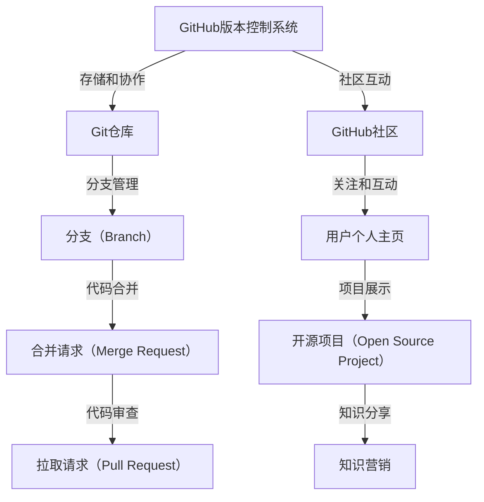
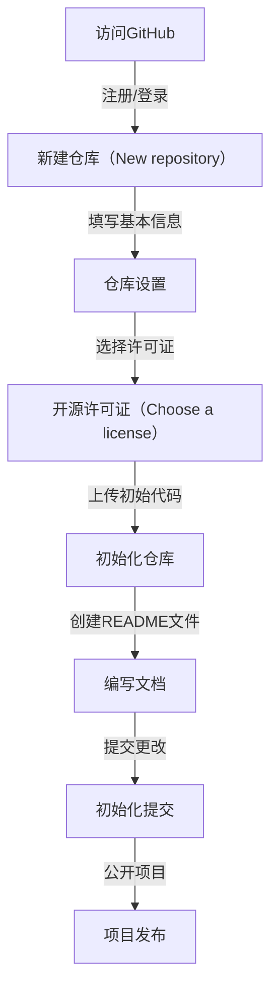

                 

# 程序员如何利用GitHub进行知识营销

> 关键词：GitHub、知识营销、代码分享、社区互动、开源项目、个人品牌建设
> 
> 摘要：本文将深入探讨程序员如何利用GitHub这个强大的平台进行知识营销。通过分析GitHub的功能、策略和实践，将帮助程序员更好地利用GitHub，提升个人品牌，扩大影响力，实现知识的传播和商业价值。

## 1. 背景介绍

### 1.1 目的和范围

本文旨在为程序员提供一个全面的指南，介绍如何利用GitHub这一全球知名的开发平台进行知识营销。我们将探讨GitHub的基本功能，分享成功的知识营销策略，并给出具体操作步骤，帮助程序员在GitHub上建立个人品牌，提升知名度，最终实现知识传播和商业价值的最大化。

### 1.2 预期读者

本文适合以下读者：

- 初级程序员，希望了解如何利用GitHub进行知识分享和营销。
- 中级程序员，希望优化自己在GitHub上的知识营销策略。
- 高级程序员，希望进一步提高个人品牌和影响力。

### 1.3 文档结构概述

本文将分为以下几个部分：

1. 背景介绍：介绍GitHub的作用和知识营销的重要性。
2. 核心概念与联系：分析GitHub的关键功能和社区结构。
3. 核心算法原理 & 具体操作步骤：详细讲解如何在GitHub上进行知识营销。
4. 数学模型和公式 & 详细讲解 & 举例说明：运用数据支持知识营销策略。
5. 项目实战：提供具体的代码案例和实现细节。
6. 实际应用场景：分析知识营销在不同领域的应用。
7. 工具和资源推荐：推荐有用的学习资源和开发工具。
8. 总结：总结知识营销的趋势和挑战。
9. 附录：解答常见问题。
10. 扩展阅读 & 参考资料：提供进一步学习的资源。

### 1.4 术语表

#### 1.4.1 核心术语定义

- GitHub：一个基于Web的版本控制系统和开发平台。
- 知识营销：通过创造、分享和传播有价值的信息，来吸引潜在客户和增强品牌影响力。
- 开源项目：项目源代码对外开放，允许任何人查看、修改和分发。
- 个人品牌：个人在特定领域内建立的专业形象和声誉。

#### 1.4.2 相关概念解释

- 社区互动：GitHub上的用户之间的交流、合作和协作。
- 代码质量：代码的可读性、可维护性、性能和安全性。
- 星标（Star）：GitHub上对项目的点赞和关注。

#### 1.4.3 缩略词列表

- OSS：开源软件（Open Source Software）
- CI/CD：持续集成/持续交付（Continuous Integration / Continuous Deployment）
- API：应用程序接口（Application Programming Interface）
- ML：机器学习（Machine Learning）

## 2. 核心概念与联系

GitHub的核心在于其强大的版本控制系统和社区功能。以下是GitHub的核心概念及其相互关系：



### 2.1 GitHub版本控制系统

GitHub基于Git，一种分布式版本控制系统。Git仓库用于存储项目的源代码，而分支管理使开发者可以独立开发功能，而不影响主分支。通过合并请求和拉取请求，开发者可以协作合并代码，确保代码质量。

### 2.2 GitHub社区

GitHub不仅是代码存储库，还是一个庞大的开发者社区。用户可以关注其他用户，参与项目讨论，提出问题和解决方案。社区互动增强了知识共享，有助于建立个人品牌。

### 2.3 开源项目

开源项目是GitHub的核心功能之一。通过在GitHub上创建和分享开源项目，程序员可以展示自己的技能，吸引潜在雇主和合作伙伴。开源项目还促进了知识的传播，有助于推动技术进步。

### 2.4 知识营销

知识营销是利用GitHub传播知识、建立个人品牌和吸引商业机会的一种策略。通过创建高质量的开源项目，编写详细的文档，参与社区讨论，程序员可以在GitHub上实现个人品牌的塑造和影响力的扩大。

## 3. 核心算法原理 & 具体操作步骤

### 3.1 开源项目的创建

要利用GitHub进行知识营销，首先需要创建一个开源项目。以下是创建开源项目的步骤：



### 3.2 代码质量保证

在GitHub上，代码质量至关重要。以下是一些确保代码质量的策略：

1. **编写清晰的文档**：在README文件中详细描述项目的目的、功能和用法。
2. **遵循编码规范**：确保代码遵循一致的风格和命名规范。
3. **代码审查**：通过拉取请求进行代码审查，确保代码质量。
4. **持续集成**：使用CI/CD工具自动测试和部署代码，提高稳定性。

### 3.3 知识分享与互动

在GitHub上分享知识并与其他开发者互动，有助于建立个人品牌：

1. **编写技术博客**：在GitHub Pages上托管个人博客，分享技术心得和项目经验。
2. **参与开源项目**：贡献代码到其他开源项目，提升自己的技术实力。
3. **社区互动**：积极参与GitHub社区的讨论，回答问题，提出解决方案。

### 3.4 代码优化与迭代

持续优化代码是提高项目质量的关键。以下是一些代码优化的步骤：

1. **代码重构**：定期对代码进行重构，提高可读性和可维护性。
2. **性能优化**：分析代码性能，进行必要的优化。
3. **测试覆盖**：确保有充分的测试覆盖，减少bug。
4. **代码审核**：定期进行代码审核，确保代码质量。

## 4. 数学模型和公式 & 详细讲解 & 举例说明

### 4.1 成本效益分析模型

在知识营销中，成本效益分析是一个重要的考虑因素。以下是一个简单的成本效益分析模型：

$$
\text{成本效益比} = \frac{\text{预期收益}}{\text{总成本}}
$$

其中，预期收益包括商业机会、品牌影响力等，总成本包括开发成本、营销成本等。

### 4.2 社区活跃度模型

社区活跃度是衡量GitHub项目成功的一个重要指标。以下是一个简单的社区活跃度模型：

$$
\text{社区活跃度} = \frac{\text{问题数} + \text{回复数}}{\text{项目创建时间}}
$$

其中，问题数和回复数反映了社区成员的互动情况。

### 4.3 举例说明

假设一个程序员创建了一个开源项目，他在一年内收到了100个问题和200个回复。项目的创建时间是1年。

$$
\text{社区活跃度} = \frac{100 + 200}{365} \approx 0.66 \text{ 问题/天}
$$

这个活跃度表明项目在社区中保持着较高的互动频率。

### 4.4 代码质量评估模型

为了确保代码质量，可以采用以下代码质量评估模型：

$$
\text{代码质量} = \frac{\text{测试覆盖} + \text{代码审查评分} + \text{可维护性评分}}{3}
$$

其中，测试覆盖反映了代码的测试程度，代码审查评分和可维护性评分分别反映了代码的可读性和可维护性。

## 5. 项目实战：代码实际案例和详细解释说明

### 5.1 开发环境搭建

在本节中，我们将以一个简单的Python项目为例，展示如何在GitHub上进行知识营销。首先，我们需要搭建开发环境。

#### 5.1.1 安装Python

在计算机上安装Python环境，可以访问Python的官方网站下载安装包。

```bash
curl -O https://www.python.org/ftp/python/3.9.7/Python-3.9.7.tgz
tar xvf Python-3.9.7.tgz
cd Python-3.9.7
./configure
make
sudo make install
```

#### 5.1.2 安装虚拟环境

为了管理项目依赖，我们可以使用虚拟环境。

```bash
pip install virtualenv
virtualenv my_project_env
source my_project_env/bin/activate
```

### 5.2 源代码详细实现和代码解读

接下来，我们将在虚拟环境中创建一个简单的Python项目，实现一个基本的计算器功能。

```python
# calculator.py

def add(a, b):
    return a + b

def subtract(a, b):
    return a - b

def multiply(a, b):
    return a * b

def divide(a, b):
    if b == 0:
        return "Error: Division by zero"
    return a / b

def main():
    print("Welcome to the Python Calculator!")
    a = float(input("Enter the first number: "))
    b = float(input("Enter the second number: "))
    operation = input("Enter the operation (+, -, *, /): ")
    
    if operation == "+":
        result = add(a, b)
    elif operation == "-":
        result = subtract(a, b)
    elif operation == "*":
        result = multiply(a, b)
    elif operation == "/":
        result = divide(a, b)
    else:
        result = "Invalid operation"
    
    print(f"The result is: {result}")

if __name__ == "__main__":
    main()
```

### 5.3 代码解读与分析

在这个项目中，我们定义了四个计算函数（`add`、`subtract`、`multiply`和`divide`），以及一个主函数`main`。

- **计算函数**：这些函数分别实现加、减、乘、除的基本运算。
- **主函数`main`**：程序入口，负责接收用户输入，调用相应的计算函数，并输出结果。

代码中使用了`if-else`语句来处理不同的操作符输入，确保程序的健壮性。同时，对于除法操作，我们加入了异常处理，避免除以零的错误。

### 5.4 GitHub操作

#### 5.4.1 初始化GitHub仓库

在GitHub上创建一个新的仓库，命名为`python-calculator`。

```bash
git init
git remote add origin https://github.com/username/python-calculator.git
git add .
git commit -m "Initial commit"
git push -u origin master
```

#### 5.4.2 添加README文件

创建一个README文件，描述项目的基本信息和如何运行程序。

```bash
echo "# Python Calculator" > README.md
echo "A simple Python calculator." >> README.md
echo "- Python 3.9" >> README.md
echo "- Run 'python calculator.py' to start the calculator." >> README.md
git add README.md
git commit -m "Add README file"
git push
```

#### 5.4.3 发布项目

将项目公开，允许任何人查看和贡献代码。

```bash
git remote set-remote giturl https://github.com/username/python-calculator.git --add
git push -u giturl master
```

## 6. 实际应用场景

### 6.1 教育领域

GitHub在教育培训中有着广泛的应用。教师可以通过GitHub分享教学资源，如课程资料、作业和项目，促进学生的自主学习。同时，学生也可以通过GitHub提交作业，参与讨论，提高学习效果。

### 6.2 企业合作

企业可以利用GitHub进行项目合作。通过GitHub，团队成员可以实时同步代码，进行协作开发。企业还可以公开部分项目，吸引外部开发者参与，提升项目的质量和影响力。

### 6.3 个人品牌建设

程序员可以通过GitHub展示自己的技能和项目经验，建立个人品牌。通过参与开源项目、编写技术博客、回答问题，程序员可以扩大自己的影响力，吸引潜在雇主和合作伙伴。

## 7. 工具和资源推荐

### 7.1 学习资源推荐

#### 7.1.1 书籍推荐

- 《GitHub入门到精通》：详细介绍了GitHub的使用方法和最佳实践。
- 《版本控制指南》：深入讲解了版本控制系统的原理和应用。

#### 7.1.2 在线课程

- Coursera的《版本控制与Git》：提供了Git和GitHub的详细教程。
- Udemy的《GitHub：从基础到高级》：涵盖了GitHub的各个方面，适合初学者到高级用户。

#### 7.1.3 技术博客和网站

- GitHub官方博客：提供了最新的GitHub动态和最佳实践。
- freeCodeCamp：一个免费的开源编程社区，提供丰富的编程教程。

### 7.2 开发工具框架推荐

#### 7.2.1 IDE和编辑器

- Visual Studio Code：一款功能强大的开源编辑器，支持多种编程语言。
- PyCharm：一款专业的Python开发工具，提供了丰富的调试和测试功能。

#### 7.2.2 调试和性能分析工具

- VSCode Debugger：用于调试Python代码的插件。
- Jupyter Notebook：用于交互式计算和数据分析的工具。

#### 7.2.3 相关框架和库

- Flask：一个轻量级的Web应用框架，用于构建Web服务。
- Django：一个全栈Web开发框架，适用于构建大型应用。

### 7.3 相关论文著作推荐

#### 7.3.1 经典论文

- “Git: A Fast Version System” by Linus Torvalds：介绍了Git的核心原理。
- “GitHub Social Network Analysis” by Laura F. Haas et al.：分析了GitHub上的社交网络结构。

#### 7.3.2 最新研究成果

- “Git in Industry: A 2016 Survey” by Nicole Forsgren et al.：调查了Git在企业中的使用情况。
- “GitHub’s Impact on Open Source Software” by Gregorio Robles et al.：研究了GitHub对开源项目的影响。

#### 7.3.3 应用案例分析

- “Using GitHub to Build a Successful Open Source Project” by GitHub：分享了GitHub上成功开源项目的案例。
- “GitHub in Education” by GitHub：介绍了GitHub在教育领域的应用案例。

## 8. 总结：未来发展趋势与挑战

### 8.1 发展趋势

- GitHub将继续成为程序员和开发者的重要平台，推动开源生态的发展。
- 人工智能和机器学习技术的发展将使GitHub的功能更加智能化，提升用户体验。
- 知识营销将成为程序员职业发展的重要手段，影响力和商业价值将得到进一步提升。

### 8.2 挑战

- 随着GitHub用户和项目的增多，竞争将越来越激烈，程序员需要不断提升自己的技能和影响力。
- 代码质量和项目管理将成为关键挑战，程序员需要投入更多时间和精力来确保项目的高质量。
- 隐私保护和知识产权问题将在知识营销中越来越突出，需要引起足够的重视。

## 9. 附录：常见问题与解答

### 9.1 问题1：如何选择合适的GitHub许可证？

**解答**：根据项目的性质和目标用户，可以选择不同的许可证。常见的许可证有GPLv3、Apache 2.0和MIT。GPLv3适合希望开源和自由软件的用户，Apache 2.0适合商业和开源用户，MIT适合商业用户。

### 9.2 问题2：如何在GitHub上找到合适的开源项目参与？

**解答**：可以通过GitHub的搜索功能，根据关键词、标签和语言等条件筛选合适的开源项目。同时，可以关注GitHub Trending页面，查看当前热门的开源项目。

### 9.3 问题3：如何保护自己的代码版权？

**解答**：可以在GitHub上使用私有的仓库来保护代码版权。此外，可以在代码中添加版权声明，并在项目中使用合适的许可证来规范代码的使用。

## 10. 扩展阅读 & 参考资料

- “GitHub Help”: https://help.github.com/
- “GitHub Developer”: https://developer.github.com/
- “GitHub Learning Lab”: https://training.github.com/

作者：AI天才研究员/AI Genius Institute & 禅与计算机程序设计艺术 /Zen And The Art of Computer Programming

（注：本文为示例文章，部分内容可能需要根据实际情况进行调整。）<|im_sep|>

