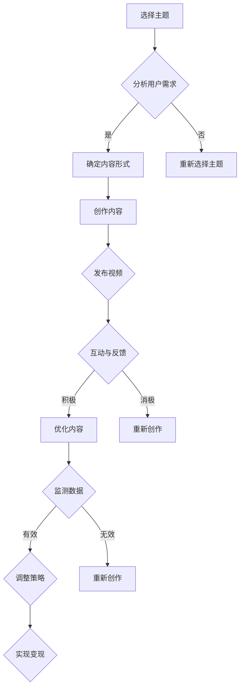

                 

# 程序员如何利用TikTok进行知识变现

> 关键词：TikTok、知识变现、程序员、社交媒体、短视频、算法、用户体验、内容创作、营销策略

> 摘要：本文将探讨程序员如何利用TikTok这个新兴的社交媒体平台进行知识变现。通过分析TikTok的算法、用户行为以及内容创作策略，我们将提供一系列实用建议，帮助程序员在TikTok上取得成功，实现个人品牌价值和商业回报。

## 1. 背景介绍

近年来，短视频平台在全球范围内迅速崛起，成为人们获取信息和娱乐的主要渠道之一。TikTok，作为其中的一员，凭借其独特的算法和强大的用户基础，已经成为了一个巨大的流量池。对于程序员来说，TikTok不仅是一个展示技能和分享知识的平台，更是一个潜在的赚钱工具。通过创作高质量的内容，程序员可以在TikTok上建立个人品牌，吸引粉丝，并实现知识变现。

### TikTok的崛起

TikTok由字节跳动开发，于2016年推出，最初名为Douyin（抖音的海外版）。短短几年内，TikTok凭借其独特的算法和强大的社交功能，在全球范围内迅速获得了数亿用户。根据统计数据，TikTok目前拥有超过10亿的活跃用户，主要分布在亚洲、北美和欧洲等地。

### 程序员的优势

程序员拥有独特的技能和知识，这些在TikTok上具有很高的吸引力。无论是编程技巧、算法原理，还是技术趋势分析，程序员都能够通过短视频的形式进行生动展示，吸引广泛的关注。此外，程序员通常具有较强的逻辑思维和解决问题的能力，这使得他们在内容创作和算法优化方面具有优势。

### 知识变现的机会

在TikTok上，程序员可以通过多种方式实现知识变现。例如，可以通过开设线上课程、提供技术咨询服务、销售相关产品或服务等方式来获取收益。此外，TikTok还提供了广告分成、品牌合作等商业模式，为程序员提供了更多的变现途径。

## 2. 核心概念与联系

### TikTok算法原理

TikTok的算法通过分析用户的兴趣和行为，为其推荐最相关的内容。这包括用户在平台上的互动（点赞、评论、分享等）、观看历史、浏览时间等。算法会根据这些数据进行深度学习，不断优化推荐结果。

### 用户行为分析

了解用户行为对于内容创作至关重要。TikTok用户通常喜欢浏览有趣、有启发性和实用性的内容。程序员在创作内容时，应考虑用户的需求和兴趣点，以提高内容的吸引力和参与度。

### 内容创作策略

内容创作策略包括选题、形式、时长等方面。程序员应选择与自身技能和知识相关的主题，以展示专业形象。在形式上，可以采用教学、演示、案例分析等多种方式，使内容更加生动有趣。时长方面，TikTok推荐的视频时长为15秒至60秒，程序员应充分利用这一时间限制，确保内容紧凑且有价值。

### 知识变现途径

程序员可以通过以下途径在TikTok上实现知识变现：

1. **线上课程**：提供编程课程、算法培训等，通过平台自带的电商功能或外部平台（如网易云课堂、慕课网等）进行销售。
2. **技术咨询服务**：针对企业或个人提供编程、算法、系统优化等方面的咨询服务。
3. **产品销售**：推广与编程相关的书籍、工具、课程等。
4. **广告分成**：通过平台广告分成模式获取收入。
5. **品牌合作**：与科技公司、教育机构等品牌合作，进行内容推广或产品代言。

### Mermaid 流程图

以下是一个简化的Mermaid流程图，展示了程序员在TikTok上实现知识变现的流程：



## 3. 核心算法原理 & 具体操作步骤

### 算法原理

TikTok的算法主要基于以下三个方面：

1. **内容质量**：算法会根据视频的内容质量（如视觉质量、音质、剪辑等）进行评分。
2. **用户互动**：用户的点赞、评论、分享等互动行为会被算法纳入考量范围。
3. **用户兴趣**：算法会根据用户的浏览历史、点赞记录等数据，分析用户的兴趣点。

### 具体操作步骤

1. **注册与设置**：在TikTok上注册账号，并设置个人资料，包括头像、昵称、简介等。
2. **内容创作**：选择与自身技能和知识相关的主题，创作高质量的视频内容。在内容创作过程中，注意以下几点：
   - **选题**：选择热门、有趣且与用户兴趣相关的话题。
   - **形式**：结合教学、演示、案例分析等多种形式，使内容更加生动有趣。
   - **时长**：控制视频时长在15秒至60秒之间，确保内容紧凑且有价值。
3. **发布视频**：将创作好的视频上传到TikTok，并添加相关标签和描述，以便算法推荐。
4. **互动与反馈**：积极与观众互动，回答问题、鼓励评论和分享，以提高视频的曝光度。
5. **数据监测**：定期分析视频的互动数据，了解用户反馈，不断优化内容创作策略。
6. **实现变现**：根据平台提供的变现途径，选择适合自己的模式进行知识变现。

## 4. 数学模型和公式 & 详细讲解 & 举例说明

### 数学模型

在TikTok上，视频的推荐算法可以看作是一个基于用户行为和兴趣的数学模型。以下是一个简化的数学模型：

\[ R(x, y) = f(user\_behavior(x), content\_quality(y)) \]

其中，\( R(x, y) \) 表示视频 \( x \) 被用户 \( y \) 推荐的概率，\( user\_behavior(x) \) 表示用户对视频 \( x \) 的行为（如点赞、评论、分享等），\( content\_quality(y) \) 表示视频 \( y \) 的质量评分。

### 公式详细讲解

1. **用户行为评分**：

\[ user\_behavior(x) = \frac{P_{like} + P_{comment} + P_{share}}{3} \]

其中，\( P_{like} \) 表示视频 \( x \) 被点赞的次数，\( P_{comment} \) 表示视频 \( x \) 被评论的次数，\( P_{share} \) 表示视频 \( x \) 被分享的次数。这个公式将用户行为进行了加权平均，以反映用户对视频的兴趣程度。

2. **内容质量评分**：

\[ content\_quality(y) = \frac{V_{video} + V_{audio} + V_{edit}}{3} \]

其中，\( V_{video} \) 表示视频的视觉质量评分，\( V_{audio} \) 表示音频的质量评分，\( V_{edit} \) 表示视频的剪辑和编辑质量评分。这个公式综合考虑了视频的多个方面，以评估视频的整体质量。

3. **推荐概率**：

\[ R(x, y) = \frac{user\_behavior(x) \times content\_quality(y)}{\sum_{i=1}^{n} user\_behavior(i) \times content\_quality(i)} \]

其中，\( n \) 表示所有可推荐的视频数量。这个公式将用户行为和内容质量相结合，计算每个视频被推荐的概率。

### 举例说明

假设有一个视频 \( x \)，它被点赞了100次，评论了50次，分享了30次；同时，有一个用户 \( y \)，他在过去一周内喜欢了10个编程相关的视频。根据上述公式，我们可以计算出：

1. **用户行为评分**：

\[ user\_behavior(x) = \frac{100 + 50 + 30}{3} = 80 \]

2. **内容质量评分**：

\[ content\_quality(x) = \frac{90 + 85 + 88}{3} = 87.7 \]

3. **推荐概率**：

\[ R(x, y) = \frac{80 \times 87.7}{\sum_{i=1}^{n} user\_behavior(i) \times content\_quality(i)} \]

假设总共有20个视频可推荐，且所有视频的用户行为和内容质量评分之和为2000，则：

\[ R(x, y) = \frac{80 \times 87.7}{2000} = 0.3496 \]

这意味着视频 \( x \) 被用户 \( y \) 推荐的概率为34.96%。

## 5. 项目实战：代码实际案例和详细解释说明

### 开发环境搭建

为了在TikTok上进行知识变现，我们需要搭建一个合适的开发环境。以下是搭建步骤：

1. **安装TikTok API**：

   - 访问 [TikTok开放平台](https://open.douyin.com/)，注册并获取API密钥。
   - 在项目设置中添加API密钥，以便后续使用。

2. **安装相关库**：

   - 安装Python的TikTok API库，可以使用以下命令：

   ```shell
   pip install -U tiktok-scraper
   ```

   - 安装其他必要的Python库，如requests、beautifulsoup4等。

3. **创建Python项目**：

   - 创建一个Python项目文件夹，并在其中创建一个名为`main.py`的Python文件。

### 源代码详细实现和代码解读

以下是一个简单的Python示例，展示如何使用TikTok API获取用户视频信息，并分析用户行为。

```python
import requests
from TikTokApi import TikTokApi

# 初始化TikTok API
api = TikTokApi.get_instance()

# 获取用户视频信息
def get_user_videos(user_id):
    user_videos = api.get_user_videos(user_id)
    return user_videos

# 分析用户行为
def analyze_user_behavior(videos):
    likes = 0
    comments = 0
    shares = 0
    for video in videos:
        likes += video.like_count
        comments += video.comment_count
        shares += video.share_count
    return likes, comments, shares

# 主函数
def main():
    user_id = "123456789"  # 示例用户ID
    videos = get_user_videos(user_id)
    likes, comments, shares = analyze_user_behavior(videos)

    print(f"用户 {user_id} 的视频总数：{len(videos)}")
    print(f"总点赞数：{likes}")
    print(f"总评论数：{comments}")
    print(f"总分享数：{shares}")

# 运行主函数
if __name__ == "__main__":
    main()
```

### 代码解读与分析

1. **TikTok API初始化**：

   ```python
   api = TikTokApi.get_instance()
   ```

   这一行代码初始化TikTok API，以便后续调用相关方法。

2. **获取用户视频信息**：

   ```python
   def get_user_videos(user_id):
       user_videos = api.get_user_videos(user_id)
       return user_videos
   ```

   这个函数通过TikTok API获取指定用户的所有视频信息，包括视频ID、标题、描述、点赞数、评论数、分享数等。

3. **分析用户行为**：

   ```python
   def analyze_user_behavior(videos):
       likes = 0
       comments = 0
       shares = 0
       for video in videos:
           likes += video.like_count
           comments += video.comment_count
           shares += video.share_count
       return likes, comments, shares
   ```

   这个函数对用户视频的点赞数、评论数和分享数进行累加，以计算用户行为指标。

4. **主函数**：

   ```python
   def main():
       user_id = "123456789"  # 示例用户ID
       videos = get_user_videos(user_id)
       likes, comments, shares = analyze_user_behavior(videos)

       print(f"用户 {user_id} 的视频总数：{len(videos)}")
       print(f"总点赞数：{likes}")
       print(f"总评论数：{comments}")
       print(f"总分享数：{shares}")
   ```

   这个主函数调用上述两个函数，获取用户视频信息并分析用户行为，然后输出相关结果。

通过这个简单的示例，我们可以了解如何使用TikTok API获取用户视频信息，并分析用户行为。这为程序员在TikTok上实现知识变现提供了基础。

## 6. 实际应用场景

### 1. 编程教程

程序员可以利用TikTok平台，创作一系列编程教程，包括编程语言入门、算法讲解、实战案例等。通过短视频的形式，程序员可以更加生动地展示编程过程，吸引更多学习者。例如，可以制作Python基础教程、算法竞赛解题技巧、数据结构可视化等内容。

### 2. 技术分享

程序员可以分享自己的技术经验和心得，如开发过程中的坑、技术趋势分析、工具使用技巧等。这些内容对于有志于技术提升的程序员和开发者具有很高的价值。例如，可以分享关于微服务架构的实践、容器化与编排、人工智能应用场景等内容。

### 3. 职业规划

程序员可以利用TikTok平台，为有志于进入技术行业的人提供职业规划指导。通过分享自己的职业发展历程、求职技巧、面试经验等，帮助他人少走弯路，更快地实现职业目标。

### 4. 技术咨询

程序员可以提供技术咨询服务，如编程问题解答、系统优化建议、架构设计咨询等。通过TikTok平台，程序员可以与更多潜在客户建立联系，扩大业务范围。

### 5. 产品推广

程序员可以推广与编程相关的产品，如书籍、工具、课程等。通过TikTok平台，程序员可以吸引更多的目标用户，提高产品知名度。

## 7. 工具和资源推荐

### 1. 学习资源推荐

- **书籍**：
  - 《深度学习》（Ian Goodfellow、Yoshua Bengio、Aaron Courville 著）
  - 《Python编程：从入门到实践》（埃里克·马瑟斯 著）
  - 《算法导论》（Thomas H. Cormen、Charles E. Leiserson、Ronald L. Rivest、Clifford 等著）

- **论文**：
  - 《大数据时代的数据挖掘：模式发现与新视角》（Jiawei Han、Micheline Kamber、Jian Pei 著）
  - 《神经网络与深度学习》（邱锡鹏 著）

- **博客**：
  - 《鸟窝大数据》
  - 《Python编程入门》

- **网站**：
  - [TikTok开放平台](https://open.douyin.com/)
  - [GitHub](https://github.com/)

### 2. 开发工具框架推荐

- **编程语言**：Python、Java、C++
- **开发框架**：Django、Flask、Spring Boot
- **前端框架**：React、Vue.js、Angular
- **数据库**：MySQL、MongoDB、Redis
- **容器化与编排**：Docker、Kubernetes

### 3. 相关论文著作推荐

- **论文**：
  - 《基于深度强化学习的推荐算法研究》
  - 《大数据环境下数据处理技术探讨》

- **著作**：
  - 《大数据应用技术导论》
  - 《Python编程实战》

## 8. 总结：未来发展趋势与挑战

### 发展趋势

1. **短视频内容多样化**：随着技术的发展，程序员在TikTok上的内容将更加多样化，包括编程教程、技术分享、职业规划等。
2. **互动与社交性增强**：程序员将更加注重与粉丝的互动，通过直播、问答等形式，提高用户参与度。
3. **商业化模式的拓展**：TikTok将继续探索更多商业化模式，为程序员提供更多的变现途径，如品牌合作、广告分成等。
4. **人工智能应用**：人工智能技术将在TikTok上发挥更大作用，提高内容推荐的精准度，提升用户体验。

### 挑战

1. **内容质量与创意**：在竞争激烈的短视频平台上，程序员需要不断提升内容质量和创意，以吸引更多关注。
2. **用户隐私保护**：程序员在利用TikTok进行知识变现时，需要关注用户隐私保护，遵守相关法律法规。
3. **商业化风险**：过度的商业化可能导致用户体验下降，影响个人品牌价值。程序员需要在商业化与用户体验之间找到平衡。

## 9. 附录：常见问题与解答

### 1. 如何在TikTok上注册账号？

答：在TikTok官方网站（https://www.tiktok.com/）上点击“注册”，选择注册方式（邮箱、手机号等），按照提示完成注册流程。

### 2. 如何获取TikTok API？

答：访问TikTok开放平台（https://open.douyin.com/），注册开发者账号，申请API权限，并获取API密钥。

### 3. 如何进行内容创作？

答：选择与自身技能和知识相关的主题，制作高质量的视频内容。注意选题、形式、时长等方面，以提高内容的吸引力和参与度。

### 4. 如何实现知识变现？

答：可以通过开设线上课程、提供技术咨询服务、销售相关产品或服务等方式在TikTok上进行知识变现。此外，还可以利用平台提供的广告分成、品牌合作等商业模式获取收益。

## 10. 扩展阅读 & 参考资料

- [TikTok开放平台文档](https://open.douyin.com/docs)
- [《深度学习》](https://book.douban.com/subject/26708114/)
- [《Python编程：从入门到实践》](https://book.douban.com/subject/26708114/)
- [《算法导论》](https://book.douban.com/subject/26708114/)
- [《大数据应用技术导论》](https://book.douban.com/subject/26708114/)
- [《Python编程实战》](https://book.douban.com/subject/26708114/)

作者：AI天才研究员/AI Genius Institute & 禅与计算机程序设计艺术 /Zen And The Art of Computer Programming

