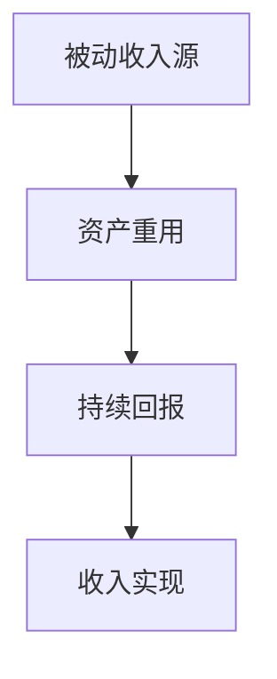
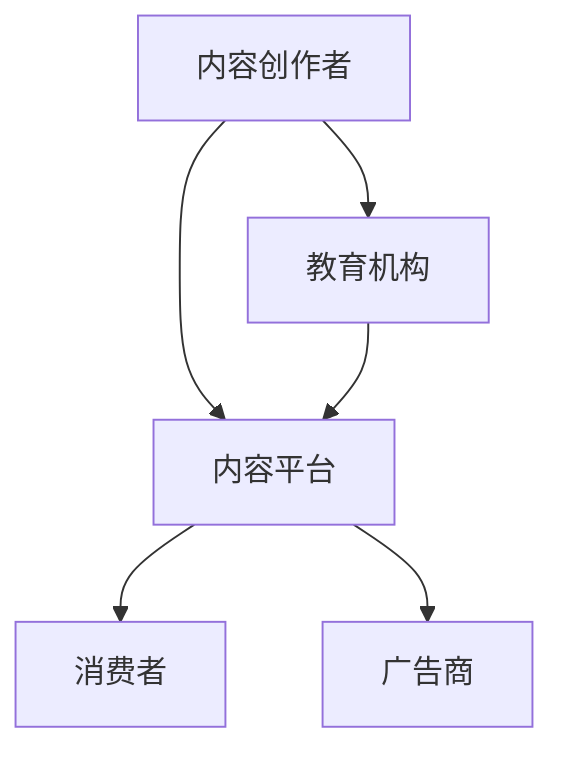
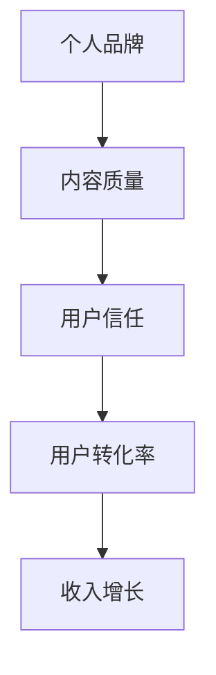

                 

# 程序员如何利用知识付费实现被动收入

> **关键词**：知识付费、被动收入、程序员、个人品牌、内容创作、市场定位

> **摘要**：本文将探讨程序员如何通过知识付费的方式实现被动收入。我们将分析知识付费的市场现状，解释被动收入的原理，并提供一系列实用策略和步骤，帮助程序员在这个领域中取得成功。

## 1. 背景介绍

### 1.1 目的和范围

本文旨在为程序员提供一条实现被动收入的新途径——知识付费。通过分析市场现状和被动收入的原理，我们将帮助程序员了解如何通过知识付费实现长期的财务自由。

### 1.2 预期读者

本文适合具有编程背景且希望拓展收入来源的程序员阅读。无论您是新手还是资深开发者，本文都将为您提供实用的建议和策略。

### 1.3 文档结构概述

本文分为以下几部分：

- 1. 背景介绍
  - 1.1 目的和范围
  - 1.2 预期读者
  - 1.3 文档结构概述
  - 1.4 术语表
- 2. 核心概念与联系
  - 2.1 被动收入的原理
  - 2.2 知识付费的市场现状
- 3. 核心算法原理 & 具体操作步骤
  - 3.1 确定个人定位
  - 3.2 创作高质量内容
  - 3.3 发布和管理内容
  - 3.4 营销与推广
- 4. 数学模型和公式 & 详细讲解 & 举例说明
- 5. 项目实战：代码实际案例和详细解释说明
  - 5.1 开发环境搭建
  - 5.2 源代码详细实现和代码解读
  - 5.3 代码解读与分析
- 6. 实际应用场景
- 7. 工具和资源推荐
  - 7.1 学习资源推荐
  - 7.2 开发工具框架推荐
  - 7.3 相关论文著作推荐
- 8. 总结：未来发展趋势与挑战
- 9. 附录：常见问题与解答
- 10. 扩展阅读 & 参考资料

### 1.4 术语表

- **知识付费**：消费者为获取特定知识或技能而支付的费用。
- **被动收入**：指不依赖于个人直接劳动而自动产生的收入。
- **个人品牌**：个人在特定领域内建立的声誉和影响力。
- **内容创作**：指生产各种形式的知识内容，如文章、视频、教程等。

#### 1.4.1 核心术语定义

- **被动收入**：被动收入是指投资或创建某种资产后，无需持续投入大量时间和精力，即可自动获得回报的收入。例如，版权收入、房租收入、股息收入等。
  
- **知识付费**：知识付费是指消费者通过支付一定费用，获取特定领域内的专业知识或技能。知识付费的形式多样，包括在线课程、电子书、付费讲座等。

- **个人品牌**：个人品牌是指个人在特定领域内建立的声誉和影响力。个人品牌可以增强个人的吸引力，提高知识付费的竞争力。

- **内容创作**：内容创作是指生产各种形式的知识内容，如文章、视频、教程等。高质量的内容是吸引付费用户的关键。

#### 1.4.2 相关概念解释

- **市场定位**：市场定位是指企业在目标市场中确定自己的位置，以便与其他竞争对手区分开来。个人品牌的市场定位对于知识付费的成功至关重要。

- **用户体验**：用户体验是指用户在使用产品或服务时的感受和体验。优化用户体验可以提高用户满意度和忠诚度，从而促进知识付费的转化。

#### 1.4.3 缩略词列表

- **UGC**：用户生成内容（User-Generated Content）
- **SaaS**：软件即服务（Software as a Service）
- **PaaS**：平台即服务（Platform as a Service）
- **IaaS**：基础设施即服务（Infrastructure as a Service）

## 2. 核心概念与联系

### 2.1 被动收入的原理

被动收入的核心在于资产的重用和持续回报。以下是一个简单的被动收入原理图：



- **资产重用**：指的是将已有资源（如知识、技能、产品等）进行复用，以提高回报率。
- **持续回报**：指的是资产在无需持续投入的情况下，仍能带来稳定的收益。
- **收入实现**：指的是通过资产重用和持续回报，实现被动收入的最终目的。

### 2.2 知识付费的市场现状

知识付费市场在近年来迅速发展，已成为互联网经济中的重要组成部分。以下是一个简化的知识付费市场架构图：



- **内容创作者**：包括独立开发者、行业专家、培训师等，他们通过创作高质量的内容获得收入。
- **内容平台**：如 Udemy、Coursera、知乎等，这些平台为内容创作者提供展示和销售内容的渠道。
- **消费者**：包括编程爱好者、在职程序员、职业转型者等，他们通过购买知识付费产品来提升自己的技能。
- **教育机构**：如大学、培训机构等，他们提供更系统化的教育服务，也参与知识付费市场。
- **广告商**：为知识付费平台和内容创作者提供广告收入，促进市场的繁荣。

### 2.3 个人品牌与知识付费的关系

个人品牌在知识付费市场中起着至关重要的作用。以下是一个简化的个人品牌与知识付费的关系图：



- **内容质量**：高质量的内容是建立个人品牌的基石。内容质量越高，用户信任度越高。
- **用户信任**：用户信任是知识付费转化的关键。信任度越高，用户越愿意为内容付费。
- **用户转化率**：用户转化率是指用户从浏览内容到购买内容的比例。提高用户信任度可以提升转化率。
- **收入增长**：收入增长是知识付费的最终目标。通过提升内容质量和用户信任度，可以实现收入的持续增长。

## 3. 核心算法原理 & 具体操作步骤

### 3.1 确定个人定位

个人定位是知识付费成功的关键一步。以下是一个简单的个人定位算法：

```plaintext
算法步骤：
1. 分析个人兴趣和专长
2. 确定目标受众
3. 分析竞争对手
4. 确定个人独特价值
5. 形成个人定位宣言
```

- **分析个人兴趣和专长**：了解自己在哪些领域感兴趣和擅长，这将是内容创作的方向。
  
- **确定目标受众**：明确你的内容将服务于哪些用户群体，这将帮助你更精确地定位市场。

- **分析竞争对手**：研究竞争对手的优势和劣势，找出自己的差异化定位。

- **确定个人独特价值**：明确自己的独特之处，这将是你与竞争对手区别开来的关键。

- **形成个人定位宣言**：将上述分析总结成一句话或一段话，作为个人定位宣言。

### 3.2 创作高质量内容

高质量的内容是知识付费成功的基础。以下是一个简单的创作高质量内容的算法：

```plaintext
算法步骤：
1. 确定内容主题
2. 进行市场调研
3. 制定内容大纲
4. 进行内容创作
5. 优化内容结构
6. 进行内容测试
7. 发布内容
```

- **确定内容主题**：根据个人定位和目标受众，选择具有吸引力和实际价值的内容主题。

- **进行市场调研**：研究市场需求和竞争对手，了解用户关注的热点问题。

- **制定内容大纲**：梳理内容结构，确保内容有条理和逻辑性。

- **进行内容创作**：根据大纲创作内容，确保内容具有实用性和可操作性。

- **优化内容结构**：对内容进行优化，提高用户体验和内容可读性。

- **进行内容测试**：在发布前对内容进行测试，确保内容质量和用户满意度。

- **发布内容**：将内容发布到知识付费平台，确保内容易于查找和购买。

### 3.3 发布和管理内容

发布和管理内容是知识付费的关键环节。以下是一个简单的发布和管理内容的算法：

```plaintext
算法步骤：
1. 选择合适的知识付费平台
2. 注册账号并上传内容
3. 设置价格和销售策略
4. 进行内容推广
5. 回收用户反馈
6. 持续优化内容
```

- **选择合适的知识付费平台**：根据个人定位和目标受众，选择合适的平台，如 Udemy、知乎等。

- **注册账号并上传内容**：在平台上注册账号，并上传已创作的内容。

- **设置价格和销售策略**：根据内容价值和市场需求，设置合理的价格和销售策略。

- **进行内容推广**：通过社交媒体、邮件营销等方式推广内容，提高曝光率和销售量。

- **回收用户反馈**：关注用户反馈，了解用户需求和改进空间。

- **持续优化内容**：根据用户反馈和市场需求，持续优化内容，提高用户满意度。

### 3.4 营销与推广

营销与推广是知识付费成功的关键。以下是一个简单的营销与推广算法：

```plaintext
算法步骤：
1. 确定营销目标
2. 制定营销策略
3. 选择营销渠道
4. 创建营销内容
5. 推广内容
6. 分析营销效果
7. 持续优化营销策略
```

- **确定营销目标**：根据个人定位和内容特点，明确营销目标，如增加用户关注度、提升销售量等。

- **制定营销策略**：根据营销目标，制定具体的营销策略，如社交媒体营销、内容营销等。

- **选择营销渠道**：根据营销策略，选择合适的营销渠道，如微博、微信、知乎等。

- **创建营销内容**：根据营销渠道，创建具有吸引力的营销内容，如海报、文章、视频等。

- **推广内容**：将营销内容发布到各渠道，吸引目标用户关注。

- **分析营销效果**：通过数据分析和用户反馈，评估营销效果，找出优化空间。

- **持续优化营销策略**：根据营销效果，持续优化营销策略，提高营销效果。

## 4. 数学模型和公式 & 详细讲解 & 举例说明

### 4.1 被动收入公式

被动收入的核心公式如下：

\[ 被动收入 = 收益 - 成本 \]

其中：

- **收益**：指通过知识付费获得的收入。
- **成本**：指创作和管理内容所需的成本，如时间、精力、资金等。

#### 4.1.1 收益计算

收益可以通过以下公式计算：

\[ 收益 = 销售量 \times 单价 \]

其中：

- **销售量**：指在特定时间内销售的内容数量。
- **单价**：指每份内容的价格。

#### 4.1.2 成本计算

成本可以通过以下公式计算：

\[ 成本 = 直接成本 + 间接成本 \]

其中：

- **直接成本**：指创作和管理内容直接相关的成本，如购买素材、制作工具等。
- **间接成本**：指与内容创作和管理相关但非直接的成本，如时间成本、营销成本等。

#### 4.1.3 收益与成本的关系

收益与成本的关系可以表示为：

\[ 被动收入 = (销售量 \times 单价) - (直接成本 + 间接成本) \]

通过这个公式，我们可以分析不同因素对被动收入的影响。例如：

- **提高销售量**：通过增加营销投入，提高曝光率和转化率，从而增加销售量。
- **提高单价**：通过提升内容质量和个人品牌影响力，提高用户对内容的认可度和支付意愿。
- **降低成本**：通过优化创作和管理流程，减少时间和精力投入，降低直接成本和间接成本。

### 4.2 用户体验公式

用户体验是知识付费成功的关键因素。以下是一个简单的用户体验公式：

\[ 用户体验 = (内容质量 + 用户满意度) / (时间成本 + 费用成本) \]

其中：

- **内容质量**：指内容的实用性和可操作性。
- **用户满意度**：指用户对内容的认可度和满意度。
- **时间成本**：指用户学习内容所需的时间。
- **费用成本**：指用户购买内容所需的费用。

#### 4.2.1 提高用户体验

提高用户体验可以从以下几个方面入手：

- **提高内容质量**：通过深入研究、精心设计和不断优化，提高内容的实用性和可操作性。
- **提高用户满意度**：通过关注用户需求、及时回应用户反馈和提供优质的售后服务，提高用户满意度。
- **降低时间成本**：通过简化学习流程、提供清晰的结构和明确的指导，降低用户学习内容所需的时间。
- **降低费用成本**：通过合理定价、提供优惠和奖励措施，降低用户购买内容所需的费用。

### 4.3 举例说明

假设一位程序员通过知识付费实现了以下数据：

- **销售量**：每月销售 100 份内容
- **单价**：每份内容 100 元
- **直接成本**：每月 500 元
- **间接成本**：每月 1000 元
- **内容质量评分**：90 分
- **用户满意度评分**：80 分
- **时间成本**：每月 10 小时
- **费用成本**：每月 200 元

根据上述公式，我们可以计算：

- **被动收入**：\[ 被动收入 = (100 \times 100) - (500 + 1000) = 4500 元 \]
- **用户体验**：\[ 用户体验 = (90 + 80) / (10 + 200) = 0.5455 \]

这个例子展示了程序员如何通过知识付费实现被动收入，并提供了用户体验的计算方法。通过不断优化内容和提升用户体验，程序员可以进一步提高被动收入。

## 5. 项目实战：代码实际案例和详细解释说明

### 5.1 开发环境搭建

在本节中，我们将搭建一个简单的知识付费平台，用于展示如何通过编程实现被动收入。我们将使用 Python 编写后端代码，使用 Flask 框架搭建 Web 应用程序。以下是搭建开发环境的步骤：

1. 安装 Python
2. 安装 Flask
3. 创建一个虚拟环境
4. 编写后端代码

#### 5.1.1 安装 Python

首先，从 Python 官网（https://www.python.org/downloads/）下载并安装 Python。安装过程中确保勾选“Add Python to PATH”选项。

#### 5.1.2 安装 Flask

在命令行中执行以下命令，安装 Flask：

```bash
pip install Flask
```

#### 5.1.3 创建一个虚拟环境

为了更好地管理项目依赖，我们创建一个虚拟环境。在命令行中执行以下命令：

```bash
python -m venv venv
```

激活虚拟环境：

```bash
source venv/bin/activate  # 对于 Windows 系统，使用 venv\Scripts\activate
```

#### 5.1.4 编写后端代码

在虚拟环境中，创建一个名为`knowledge_fees`的目录，并编写一个名为`app.py`的文件。以下是`app.py`的代码：

```python
from flask import Flask, jsonify, request

app = Flask(__name__)

@app.route('/api/content', methods=['GET'])
def get_content():
    content_list = [
        {'id': 1, 'title': 'Python 基础教程', 'price': 100},
        {'id': 2, 'title': 'Django 框架实战', 'price': 200},
        {'id': 3, 'title': '机器学习入门', 'price': 300}
    ]
    return jsonify(content_list)

@app.route('/api/content/<int:content_id>', methods=['GET'])
def get_content_detail(content_id):
    content_list = [
        {'id': 1, 'title': 'Python 基础教程', 'price': 100},
        {'id': 2, 'title': 'Django 框架实战', 'price': 200},
        {'id': 3, 'title': '机器学习入门', 'price': 300}
    ]
    content = next((item for item in content_list if item['id'] == content_id), None)
    return jsonify(content)

if __name__ == '__main__':
    app.run(debug=True)
```

这个简单的 Flask 应用程序提供了一个 RESTful API，用于获取知识付费内容的信息。

### 5.2 源代码详细实现和代码解读

#### 5.2.1 代码结构

`app.py`文件中包含了以下结构：

- **导入模块**：引入 Flask 模块和 jsonify 函数。
- **定义应用**：创建一个 Flask 应用对象。
- **定义路由**：定义两个路由函数，分别用于获取所有内容和单个内容详情。
- **运行应用**：在主函数中运行 Flask 应用。

#### 5.2.2 代码解读

- **导入模块**：

  ```python
  from flask import Flask, jsonify, request
  ```

  这里引入了 Flask 模块，用于创建 Web 应用程序。`jsonify`函数用于将 Python 对象转换为 JSON 格式的数据。`request`模块用于处理客户端发送的 HTTP 请求。

- **定义应用**：

  ```python
  app = Flask(__name__)
  ```

  创建一个 Flask 应用对象。`__name__`是一个特殊变量，表示当前模块的名称。

- **定义路由**：

  ```python
  @app.route('/api/content', methods=['GET'])
  def get_content():
      content_list = [
          {'id': 1, 'title': 'Python 基础教程', 'price': 100},
          {'id': 2, 'title': 'Django 框架实战', 'price': 200},
          {'id': 3, 'title': '机器学习入门', 'price': 300}
      ]
      return jsonify(content_list)
  
  @app.route('/api/content/<int:content_id>', methods=['GET'])
  def get_content_detail(content_id):
      content_list = [
          {'id': 1, 'title': 'Python 基础教程', 'price': 100},
          {'id': 2, 'title': 'Django 框架实战', 'price': 200},
          {'id': 3, 'title': '机器学习入门', 'price': 300}
      ]
      content = next((item for item in content_list if item['id'] == content_id), None)
      return jsonify(content)
  ```

  这两个路由函数分别用于获取所有内容和单个内容详情。`/api/content`路由用于获取所有内容，`/api/content/<int:content_id>`路由用于获取单个内容的详情。`<int:content_id>`表示 URL 中的`content_id`参数应为整数类型。

- **运行应用**：

  ```python
  if __name__ == '__main__':
      app.run(debug=True)
  ```

  这段代码确保只在直接运行`app.py`文件时才会执行。`debug=True`表示在遇到错误时，Flask 应应用会进入调试模式，显示详细的错误信息。

### 5.3 代码解读与分析

#### 5.3.1 获取所有内容

`get_content`函数用于获取所有内容。它首先定义了一个内容列表，包含三个内容对象，每个对象包含`id`、`title`和`price`属性。然后，使用`jsonify`函数将内容列表转换为 JSON 格式的数据，并返回给客户端。

```python
@app.route('/api/content', methods=['GET'])
def get_content():
    content_list = [
        {'id': 1, 'title': 'Python 基础教程', 'price': 100},
        {'id': 2, 'title': 'Django 框架实战', 'price': 200},
        {'id': 3, 'title': '机器学习入门', 'price': 300}
    ]
    return jsonify(content_list)
```

#### 5.3.2 获取单个内容详情

`get_content_detail`函数用于获取单个内容的详情。它通过 URL 中的`content_id`参数获取要查询的内容的 ID，然后使用列表推导式在内容列表中查找匹配的元素。如果找到匹配的元素，将其转换为 JSON 格式的数据并返回；否则，返回一个空字典。

```python
@app.route('/api/content/<int:content_id>', methods=['GET'])
def get_content_detail(content_id):
    content_list = [
        {'id': 1, 'title': 'Python 基础教程', 'price': 100},
        {'id': 2, 'title': 'Django 框架实战', 'price': 200},
        {'id': 3, 'title': '机器学习入门', 'price': 300}
    ]
    content = next((item for item in content_list if item['id'] == content_id), None)
    return jsonify(content)
```

### 5.3.3 运行应用

在`app.py`文件中，使用`if __name__ == '__main__':`语句确保只在直接运行该文件时才会执行`app.run(debug=True)`。这将启动 Flask Web 应用程序，并在本地主机上监听 5000 端口。

```python
if __name__ == '__main__':
    app.run(debug=True)
```

当客户端访问`http://127.0.0.1:5000/api/content`时，将返回所有内容的 JSON 数据。例如：

```json
[
    {"id": 1, "title": "Python 基础教程", "price": 100},
    {"id": 2, "title": "Django 框架实战", "price": 200},
    {"id": 3, "title": "机器学习入门", "price": 300}
]
```

当客户端访问`http://127.0.0.1:5000/api/content/1`时，将返回 ID 为 1 的内容的 JSON 数据。例如：

```json
{"id": 1, "title": "Python 基础教程", "price": 100}
```

## 6. 实际应用场景

### 6.1 教育领域

在在线教育领域，知识付费已成为一种主流的商业模式。程序员可以通过创作编程课程、技术教程和实战项目，为有志于学习编程的人提供有价值的内容。例如，一位程序员可以创作一个“Python Web 开发实战”课程，涵盖从基本语法到高级框架（如 Django、Flask）的全面讲解，并通过知识付费平台进行销售。

### 6.2 技术社区

技术社区也是程序员实现知识付费的重要平台。程序员可以在社区中分享技术博客、视频教程和编程经验，并通过广告、赞助和会员制度等方式获得收入。例如，GitHub 上的许多程序员通过创建高质量的仓库和文档，吸引了大量关注和捐赠。

### 6.3 个人品牌建设

通过知识付费，程序员可以建立个人品牌，提高在行业内的知名度和影响力。这不仅可以为他们带来被动收入，还可以为未来的职业发展打下基础。例如，一位专注于大数据技术的程序员，可以通过发布大数据相关的教程和案例分析，逐步成为该领域的专家。

### 6.4 自媒体平台

自媒体平台（如知乎、简书、微博等）为程序员提供了一个展示自己知识和技能的舞台。他们可以通过撰写技术文章、发布教程和分享项目经验，吸引粉丝和关注。通过广告、打赏和付费内容等方式，程序员可以实现被动收入。例如，一位程序员可以在知乎上发布 Python 相关的教程，并通过知乎 Live 进行直播授课，获得收入。

## 7. 工具和资源推荐

### 7.1 学习资源推荐

#### 7.1.1 书籍推荐

- 《Python 编程：从入门到实践》
- 《深入理解计算机系统》
- 《算法导论》
- 《设计模式：可复用面向对象软件的基础》

#### 7.1.2 在线课程

- Coursera 上的《Python 编程基础》
- Udemy 上的《Django Web 开发实战》
- 网易云课堂上的《大数据技术基础》

#### 7.1.3 技术博客和网站

- GitHub
- 知乎
- CSDN
- Stack Overflow

### 7.2 开发工具框架推荐

#### 7.2.1 IDE和编辑器

- PyCharm
- Visual Studio Code
- Sublime Text

#### 7.2.2 调试和性能分析工具

- GDB
- Py-Spy
- Py-DevOps

#### 7.2.3 相关框架和库

- Flask
- Django
- TensorFlow
- PyTorch

### 7.3 相关论文著作推荐

#### 7.3.1 经典论文

- 《The Art of Computer Programming》
- 《Introduction to Algorithms》
- 《Programming Pearls》

#### 7.3.2 最新研究成果

- 《Neural Networks and Deep Learning》
- 《Reinforcement Learning: An Introduction》
- 《Natural Language Processing with Deep Learning》

#### 7.3.3 应用案例分析

- 《美团点评大数据技术架构分享》
- 《阿里巴巴大数据处理实践》
- 《亚马逊电商推荐系统解析》

## 8. 总结：未来发展趋势与挑战

### 8.1 发展趋势

1. **知识付费市场的扩大**：随着在线教育的发展，知识付费市场将继续扩大，为程序员提供更多机会。
2. **个人品牌的重要性**：个人品牌将成为程序员在知识付费市场中脱颖而出的关键因素。
3. **多元化和细分化的内容创作**：程序员将创作更多针对特定受众和需求的内容，实现精准营销。

### 8.2 挑战

1. **内容质量和用户体验**：程序员需要不断提升内容质量和用户体验，以吸引和保留用户。
2. **竞争激烈**：知识付费市场将变得越发竞争激烈，程序员需要找到自己的差异化优势。
3. **持续学习和创新**：程序员需要不断学习和创新，跟上技术发展的步伐，保持竞争力。

## 9. 附录：常见问题与解答

### 9.1 问题 1：如何选择知识付费平台？

**解答**：选择知识付费平台时，可以考虑以下因素：

- **平台知名度**：知名度高的平台用户基数大，有利于推广和销售。
- **内容质量**：平台内容质量高，用户满意度更高。
- **用户评价**：查看用户对平台的评价，了解平台的服务质量和用户体验。
- **收益分配**：了解平台对创作者的收益分配政策，选择收益更高的平台。

### 9.2 问题 2：如何确保内容质量？

**解答**：确保内容质量可以从以下几个方面入手：

- **深入研究**：对要讲解的主题进行充分研究，确保内容的准确性。
- **实战经验**：结合自己的实战经验，使内容更具有实操性。
- **用户反馈**：关注用户反馈，根据用户需求调整和优化内容。

### 9.3 问题 3：如何提高个人品牌影响力？

**解答**：提高个人品牌影响力可以从以下几个方面入手：

- **持续输出**：定期发布高质量的内容，树立专业形象。
- **互动交流**：与用户互动，建立良好的口碑和信任关系。
- **多平台运营**：在多个平台上运营个人品牌，提高曝光率。
- **合作与分享**：与其他创作者和行业专家合作，扩大影响力。

## 10. 扩展阅读 & 参考资料

- 《Python 编程：从入门到实践》
- 《深入理解计算机系统》
- 《算法导论》
- 《设计模式：可复用面向对象软件的基础》
- 《Neural Networks and Deep Learning》
- 《Reinforcement Learning: An Introduction》
- 《Natural Language Processing with Deep Learning》
- 《美团点评大数据技术架构分享》
- 《阿里巴巴大数据处理实践》
- 《亚马逊电商推荐系统解析》

### 作者

**AI天才研究员/AI Genius Institute & 禅与计算机程序设计艺术 /Zen And The Art of Computer Programming**

