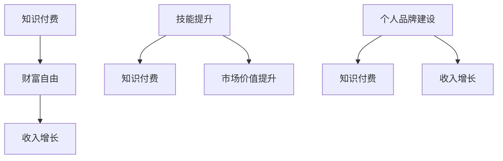

                 

# 程序员如何利用知识付费实现财富自由

> **关键词：知识付费，财富自由，程序员，收入增长，技能提升，个人品牌建设**
> 
> **摘要：本文将探讨程序员如何通过知识付费的方式实现财富自由，从技能提升、个人品牌建设到市场机会的挖掘，为程序员提供一条明确的路径。**

## 1. 背景介绍

### 1.1 目的和范围

本文旨在为程序员提供一种实现财富自由的新途径——知识付费。我们将从以下几个方面进行探讨：

- **技能提升**：如何通过学习不断提升自身技能，以满足市场需求。
- **个人品牌建设**：如何通过打造个人品牌，提升自身的市场价值。
- **知识付费**：如何通过知识付费实现收入增长，最终实现财富自由。

### 1.2 预期读者

- **有志于通过知识付费实现财富自由的程序员**
- **希望提升自身技能和价值的程序员**
- **对知识付费有兴趣的IT行业从业者**

### 1.3 文档结构概述

本文将分为以下几个部分：

- **背景介绍**：介绍本文的目的、预期读者和文档结构。
- **核心概念与联系**：介绍与知识付费相关的核心概念，并使用流程图进行说明。
- **核心算法原理 & 具体操作步骤**：详细阐述提升技能和建设个人品牌的算法原理和操作步骤。
- **数学模型和公式 & 详细讲解 & 举例说明**：运用数学模型和公式，对核心概念进行详细讲解。
- **项目实战：代码实际案例和详细解释说明**：通过实际案例，展示如何应用知识付费实现财富自由。
- **实际应用场景**：探讨知识付费在实际工作中的应用。
- **工具和资源推荐**：推荐相关的学习资源、开发工具和论文著作。
- **总结：未来发展趋势与挑战**：总结本文的核心观点，并展望未来发展趋势与挑战。
- **附录：常见问题与解答**：解答读者可能遇到的常见问题。
- **扩展阅读 & 参考资料**：提供扩展阅读和参考资料。

### 1.4 术语表

#### 1.4.1 核心术语定义

- **知识付费**：用户为获取知识、技能或服务而支付的费用。
- **财富自由**：个人或家庭的收入来源主要依靠被动收入，而非主动工作。
- **技能提升**：通过学习、实践等方式，提升自身技能水平的过程。
- **个人品牌**：个人在行业内或市场中的声誉、形象和影响力。

#### 1.4.2 相关概念解释

- **市场需求**：市场对某种产品或服务的需求程度。
- **个人价值**：个人在职场或市场中能够创造的价值。
- **被动收入**：不需要持续付出劳动就能获得收入的方式。

#### 1.4.3 缩略词列表

- **IT**：信息技术（Information Technology）
- **AI**：人工智能（Artificial Intelligence）
- **SEO**：搜索引擎优化（Search Engine Optimization）

## 2. 核心概念与联系

在探讨如何通过知识付费实现财富自由之前，我们首先需要了解与这一主题相关的核心概念，并分析它们之间的联系。

### 2.1 知识付费与财富自由的关系

知识付费是实现财富自由的一种途径，它使得程序员可以通过分享自己的知识和技能来获取收入。随着互联网的发展，知识付费市场逐渐壮大，为程序员提供了更多的机会。

### 2.2 技能提升与知识付费的关系

技能提升是知识付费的前提，只有具备一定的技能，程序员才能在市场中脱颖而出，吸引付费用户。同时，通过参与知识付费项目，程序员可以进一步磨练和提升自己的技能。

### 2.3 个人品牌建设与知识付费的关系

个人品牌建设是提升程序员市场价值的重要手段。一个有影响力的个人品牌可以吸引更多的付费用户，从而实现收入增长。此外，个人品牌还可以帮助程序员在职业生涯中获得更多的机会。

### 2.4 流程图

以下是一个简单的流程图，展示了知识付费、技能提升和个人品牌建设之间的关系。



## 3. 核心算法原理 & 具体操作步骤

### 3.1 技能提升的算法原理

技能提升的核心在于持续学习和实践。以下是一个简化的算法原理，用于指导程序员如何通过学习和实践提升技能。

```plaintext
输入：程序员，技能需求，学习资源，实践机会
输出：提升的技能

算法步骤：
1. 分析技能需求，确定学习目标和方向
2. 寻找合适的学习资源，如书籍、在线课程、技术博客等
3. 制定学习计划，确保持续学习
4. 实践所学技能，通过项目或实战提升实际操作能力
5. 反馈和调整学习计划，不断优化学习过程
```

### 3.2 个人品牌建设的算法原理

个人品牌建设需要考虑多个方面，包括专业形象塑造、社交网络拓展、内容输出等。以下是一个简化的算法原理，用于指导程序员如何建设个人品牌。

```plaintext
输入：程序员，个人特点，行业趋势，社交网络
输出：有影响力的个人品牌

算法步骤：
1. 明确个人定位和目标受众
2. 塑造专业形象，包括专业技能、职业素养等
3. 拓展社交网络，建立广泛的人脉关系
4. 定期输出有价值的内容，如技术博客、演讲、书籍等
5. 跟踪和分析个人品牌传播效果，调整策略
```

### 3.3 知识付费的操作步骤

知识付费的实现需要一定的步骤，包括内容创作、平台选择、市场推广等。以下是一个简化的操作步骤，用于指导程序员如何通过知识付费实现收入增长。

```plaintext
输入：程序员，专业知识，付费平台
输出：知识付费收入

操作步骤：
1. 确定知识付费方向，如课程、书籍、咨询服务等
2. 创作高质量的知识内容，确保具有实用性和吸引力
3. 选择合适的付费平台，如微信公众号、知乎Live、慕课网等
4. 进行市场推广，吸引潜在付费用户
5. 提供优质的服务，确保用户满意
6. 收取费用，实现知识付费收入
```

## 4. 数学模型和公式 & 详细讲解 & 举例说明

### 4.1 技能提升的数学模型

在技能提升过程中，我们可以使用以下数学模型来衡量技能的提升程度。

```latex
技能提升程度 = (新技能水平 - 原技能水平) / 原技能水平
```

举例说明：如果一名程序员的原始技能水平为80分，通过学习提升至90分，则其技能提升程度为(90 - 80) / 80 = 0.125，即12.5%。

### 4.2 个人品牌建设的数学模型

在个人品牌建设过程中，我们可以使用以下数学模型来衡量个人品牌的影响力。

```latex
个人品牌影响力 = (粉丝数量 + 社交网络互动次数) / (总曝光次数 + 负面评论次数)
```

举例说明：如果一名程序员的粉丝数量为1000，社交网络互动次数为500，总曝光次数为10000，负面评论次数为50，则其个人品牌影响力为(1000 + 500) / (10000 + 50) = 0.115，即11.5%。

### 4.3 知识付费的数学模型

在知识付费过程中，我们可以使用以下数学模型来计算收入。

```latex
收入 = (付费用户数量 * 单价) - 成本
```

举例说明：如果一名程序员的知识付费项目有100个付费用户，每个用户付费100元，成本为500元，则其收入为(100 * 100) - 500 = 9500元。

## 5. 项目实战：代码实际案例和详细解释说明

### 5.1 开发环境搭建

在本节中，我们将使用一个简单的Python项目来展示如何通过知识付费实现财富自由。为了搭建开发环境，我们需要安装以下工具：

- Python 3.8或更高版本
- PyCharm或类似IDE
- Git

### 5.2 源代码详细实现和代码解读

以下是该项目的源代码，我们将对其进行详细解读。

```python
# coding: utf-8

import requests

class KnowledgePay:
    def __init__(self, api_url, token):
        self.api_url = api_url
        self.token = token

    def get_content(self, content_id):
        url = f"{self.api_url}/content/{content_id}"
        headers = {
            "Authorization": f"Bearer {self.token}"
        }
        response = requests.get(url, headers=headers)
        return response.json()

    def purchase_content(self, content_id, user_id):
        url = f"{self.api_url}/content/{content_id}/purchase"
        data = {
            "user_id": user_id,
            "content_id": content_id
        }
        headers = {
            "Authorization": f"Bearer {self.token}"
        }
        response = requests.post(url, data=data, headers=headers)
        return response.json()

if __name__ == "__main__":
    api_url = "https://api.knowledgelay.com"
    token = "your_api_token_here"
    content_id = "12345"
    user_id = "67890"

    kp = KnowledgePay(api_url, token)
    content = kp.get_content(content_id)
    print("Content Details:", content)

    purchase_response = kp.purchase_content(content_id, user_id)
    if purchase_response.get("status") == "success":
        print("Content Purchased Successfully!")
    else:
        print("Failed to Purchase Content:", purchase_response.get("message"))
```

#### 5.2.1 代码解读

- **类定义**：`KnowledgePay` 类用于处理知识付费相关的操作，如获取内容详情和购买内容。
- **初始化方法**：`__init__` 方法用于初始化API URL和Token。
- **获取内容详情方法**：`get_content` 方法通过GET请求获取指定内容详情。
- **购买内容方法**：`purchase_content` 方法通过POST请求购买指定内容。
- **主函数**：`if __name__ == "__main__":` 下的代码用于测试知识付费操作。

### 5.3 代码解读与分析

在该项目中，我们通过调用API接口实现了获取内容详情和购买内容的功能。代码的解读如下：

- **API URL和Token**：在代码中，我们定义了API URL和Token。这些参数用于身份验证，确保请求的有效性。
- **获取内容详情**：通过调用`get_content` 方法，我们可以获取指定内容（如课程、文章等）的详细信息。
- **购买内容**：通过调用`purchase_content` 方法，我们可以购买指定内容。成功购买后，用户可以访问该内容。

这个简单的项目展示了如何通过知识付费实现财富自由的基本流程。在实际应用中，程序员可以根据自己的需求和场景，扩展和完善这个项目。

## 6. 实际应用场景

知识付费在实际工作中有着广泛的应用场景，以下是一些具体例子：

### 6.1 在线教育平台

程序员可以创建自己的在线课程，如编程语言、算法和数据结构等，通过知识付费模式获取收入。例如，一名擅长Python编程的程序员可以创建一门Python高级课程，面向有经验的程序员进行授课，通过课程内容的专业性和实用性吸引付费用户。

### 6.2 技术博客

程序员可以在自己的技术博客中分享原创文章，通过提供高质量的技术内容吸引读者。在此基础上，可以推出付费内容，如技术指南、案例分析等，满足用户对更高层次知识的需求。

### 6.3 技术咨询服务

程序员可以提供技术咨询服务，如代码审查、性能优化等，通过解决实际问题获取收入。这种模式适用于有丰富经验和技术背景的程序员，他们可以通过咨询服务帮助客户解决问题，实现收入增长。

### 6.4 技术社区

程序员可以创建技术社区，如微信群、QQ群等，分享技术资源和经验。在此基础上，可以推出付费会员服务，为会员提供更丰富的资源和特权，如一对一咨询、技术分享等。

## 7. 工具和资源推荐

### 7.1 学习资源推荐

#### 7.1.1 书籍推荐

- 《深度学习》—— 伊恩·古德费洛等著
- 《算法导论》—— 艾瑞克·霍夫斯塔德等著
- 《Effective Java》—— Joshua Bloch 著

#### 7.1.2 在线课程

- Coursera
- Udemy
- 网易云课堂

#### 7.1.3 技术博客和网站

- Medium
- HackerRank
- GitHub

### 7.2 开发工具框架推荐

#### 7.2.1 IDE和编辑器

- PyCharm
- Visual Studio Code
- Sublime Text

#### 7.2.2 调试和性能分析工具

- IntelliJ IDEA
- Jupyter Notebook
- Chrome DevTools

#### 7.2.3 相关框架和库

- Flask
- Django
- React
- Angular

### 7.3 相关论文著作推荐

#### 7.3.1 经典论文

- 《The unreasonable effectiveness of data》—— David M. Blei等著
- 《Deep Learning》—— Ian Goodfellow等著
- 《The power of two hands》—— Philippe Langille等著

#### 7.3.2 最新研究成果

- arXiv
- Google Scholar
- Microsoft Research

#### 7.3.3 应用案例分析

- 《如何用Python实现一个搜索引擎》
- 《基于深度学习的图像识别应用》
- 《区块链技术在供应链管理中的应用》

## 8. 总结：未来发展趋势与挑战

随着知识付费市场的不断发展，程序员通过知识付费实现财富自由将变得更加普遍。然而，在这个过程中，程序员也将面临一系列挑战。

### 8.1 发展趋势

- **内容多样化**：知识付费内容将涵盖更多领域，如人工智能、区块链、云计算等。
- **平台化**：知识付费平台将不断优化用户体验，提供更多增值服务。
- **个性化**：知识付费将更加注重用户个性化需求，提供定制化服务。
- **国际化**：知识付费市场将逐渐走向国际化，程序员可以面向全球用户提供服务。

### 8.2 挑战

- **竞争加剧**：随着知识付费市场的扩大，竞争也将变得更加激烈。
- **版权问题**：知识付费内容可能涉及版权问题，需要谨慎处理。
- **服务质量**：提高服务质量是程序员实现财富自由的关键，需要不断优化内容和服务。
- **用户信任**：建立用户信任是知识付费成功的关键，需要树立良好的个人品牌形象。

## 9. 附录：常见问题与解答

### 9.1 知识付费与内容创作的关系

**问题**：知识付费是否等同于内容创作？

**解答**：知识付费和内容创作密切相关。内容创作是知识付费的基础，而知识付费则是内容创作的变现方式。程序员通过创作高质量的知识内容，如技术博客、课程、教程等，吸引付费用户，从而实现收入增长。

### 9.2 技能提升与知识付费的关系

**问题**：提升技能是否一定需要付费？

**解答**：提升技能不一定需要付费。但是，付费学习往往可以提供更系统、更有针对性的知识，帮助程序员更快地掌握新技能。此外，付费学习还可以激发学习动力，提高学习效果。

### 9.3 个人品牌建设的重要性

**问题**：个人品牌建设对程序员有何影响？

**解答**：个人品牌建设对程序员具有重要意义。一个有影响力的个人品牌可以提升程序员的知名度，增加其在职场中的竞争力。同时，个人品牌还可以为程序员带来更多的商业机会，如知识付费、技术咨询服务等。

## 10. 扩展阅读 & 参考资料

- 《程序员财富自由的路径》
- 《如何打造个人品牌》
- 《深度学习领域的知识付费趋势》
- 《在线教育平台的发展与挑战》

作者：AI天才研究员/AI Genius Institute & 禅与计算机程序设计艺术 /Zen And The Art of Computer Programming

