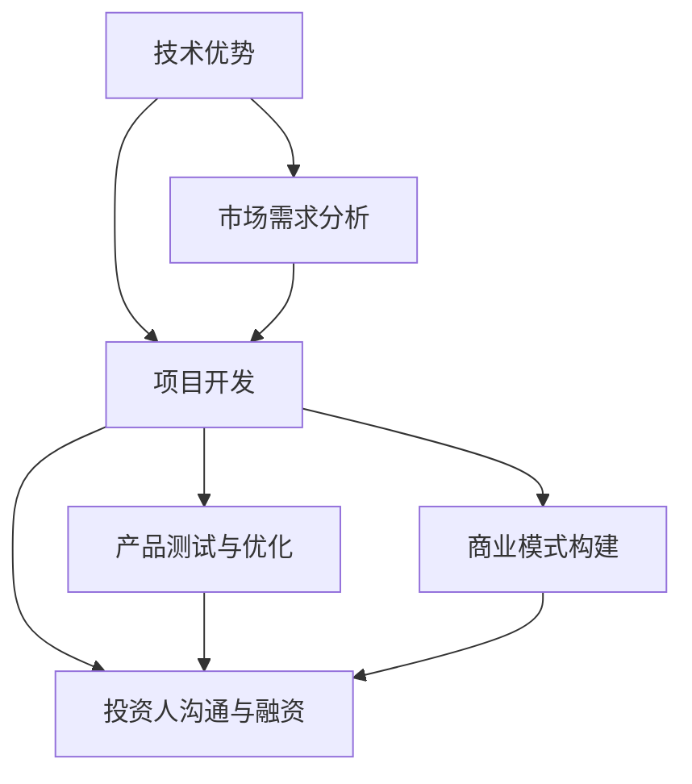

                 

# 程序员如何将技术优势转化为创业资本

> 关键词：技术优势、创业资本、项目开发、市场需求、投资人、商业模式

> 摘要：本文将探讨程序员如何充分利用自身的技术优势，将之转化为创业资本，实现个人价值和商业成功。我们将分析技术优势在创业中的具体应用，探讨如何找准市场需求，构建有效的商业模式，并最终获得投资人的青睐。希望通过本文的分享，能够为程序员朋友们提供一些实用的创业思路和实战经验。

## 1. 背景介绍

### 1.1 目的和范围

本文旨在帮助程序员朋友们更好地理解如何将自身的技术优势转化为创业资本。我们不仅会探讨技术优势的具体内涵，还会深入分析市场需求、商业模式构建以及投资人沟通等方面的关键因素。

### 1.2 预期读者

本文适合具有一定编程基础，并对创业有兴趣的程序员朋友阅读。无论您是初级程序员还是有丰富经验的开发者，本文都将为您提供有益的启示和指导。

### 1.3 文档结构概述

本文分为十个部分，主要包括以下内容：

1. 背景介绍
2. 核心概念与联系
3. 核心算法原理 & 具体操作步骤
4. 数学模型和公式 & 详细讲解 & 举例说明
5. 项目实战：代码实际案例和详细解释说明
6. 实际应用场景
7. 工具和资源推荐
8. 总结：未来发展趋势与挑战
9. 附录：常见问题与解答
10. 扩展阅读 & 参考资料

### 1.4 术语表

#### 1.4.1 核心术语定义

- 技术优势：指程序员在编程、算法、系统设计等方面的专业能力和经验。
- 创业资本：指用于创业项目的资金、资源、人力等。
- 市场需求：指消费者对某种产品或服务的需求程度。
- 商业模式：指企业通过提供产品或服务获取利润的方式。
- 投资人：指为创业项目提供资金的人或机构。

#### 1.4.2 相关概念解释

- 项目开发：指从需求分析、设计、编码到测试等一系列环节，实现一个软件项目的过程。
- 技术栈：指程序员在编程领域所掌握的技术、框架、工具等的集合。

#### 1.4.3 缩略词列表

- IDE：集成开发环境（Integrated Development Environment）
- API：应用程序编程接口（Application Programming Interface）
- MVP：最小可行性产品（Minimum Viable Product）
- ROI：投资回报率（Return on Investment）

## 2. 核心概念与联系

程序员的技术优势在创业中扮演着至关重要的角色。技术优势不仅可以帮助程序员更好地理解市场需求，还可以在项目开发过程中提供强大的技术支持。为了更好地阐述技术优势在创业中的具体应用，我们可以通过以下Mermaid流程图来展示其核心概念与联系：



### 2.1 技术优势在市场需求分析中的应用

在市场需求分析过程中，程序员可以利用自己的技术背景，快速理解并分析消费者需求。例如，通过数据挖掘和分析技术，程序员可以识别出潜在的市场机会，为项目开发提供有力支持。

### 2.2 技术优势在项目开发中的应用

项目开发是程序员展示技术优势的重要环节。熟练掌握多种编程语言、框架和工具的程序员，可以在短时间内完成高质量的软件项目。此外，优秀的系统设计能力和编程能力还可以提高项目的可维护性和可扩展性。

### 2.3 技术优势在产品测试与优化中的应用

在产品测试与优化过程中，程序员可以利用自己的技术优势，发现并修复潜在的问题。通过自动化测试和性能优化等技术手段，程序员可以确保产品的稳定性和可靠性。

### 2.4 技术优势在商业模式构建中的应用

技术优势有助于程序员更好地理解商业模式，从而为项目的发展提供方向。例如，程序员可以利用自己的技术背景，设计出具有创新性和竞争力的商业模式，提高项目的成功率。

### 2.5 技术优势在投资人沟通与融资中的应用

在投资人沟通与融资过程中，程序员需要展示自己的技术实力，以赢得投资人的信任。通过详尽的技术方案和项目规划，程序员可以增加投资人的投资信心，从而获得更多的创业资本。

## 3. 核心算法原理 & 具体操作步骤

在将技术优势转化为创业资本的过程中，程序员需要掌握一系列核心算法原理和具体操作步骤。以下是一个简单的伪代码，用于阐述如何通过技术优势分析市场需求，构建具有竞争力的商业模式：

```python
# 技术优势分析伪代码

# 步骤1：收集技术背景信息
collect_technical_background()

# 步骤2：分析市场需求
def analyze市场需求():
    data = collect_market_data()
    insights = data_mining(data)
    return insights

# 步骤3：构建商业模式
def build_business_model(insights):
    model = create_model(insights)
    validate_model(model)
    return model

# 步骤4：编写项目规划
def write_project_plan(model):
    plan = create_plan(model)
    optimize_plan(plan)
    return plan

# 步骤5：展示技术方案
def present_technical_solution(plan):
    presentation = create_presentation(plan)
    communicate_solution(presentation)
    return presentation
```

### 3.1 技术背景信息收集

在项目启动之初，程序员需要收集自己的技术背景信息，包括所掌握的编程语言、框架、工具等。这些信息将为后续的技术分析提供基础。

### 3.2 市场需求分析

市场需求分析是创业项目成功的关键环节。程序员需要通过数据挖掘和分析技术，了解消费者的需求、偏好和痛点，从而为项目开发提供方向。

### 3.3 构建商业模式

根据市场需求分析结果，程序员需要构建具有竞争力的商业模式。这包括确定产品定位、定价策略、市场推广策略等。

### 3.4 编写项目规划

项目规划是确保项目顺利进行的重要步骤。程序员需要根据市场需求和商业模式，编写详细的项目规划，包括项目目标、时间表、资源分配等。

### 3.5 展示技术方案

在投资人沟通与融资过程中，程序员需要展示自己的技术方案。这包括项目的技术架构、关键技术、项目实施计划等。通过详尽的技术方案，程序员可以赢得投资人的信任和支持。

## 4. 数学模型和公式 & 详细讲解 & 举例说明

在创业过程中，程序员可以利用数学模型和公式来分析市场需求、预测项目收益、评估风险等。以下是一个简单的线性回归模型，用于预测市场需求：

### 4.1 线性回归模型

线性回归模型是一种常用的预测方法，用于分析自变量（技术优势）和因变量（市场需求）之间的关系。其数学公式如下：

$$
Y = \beta_0 + \beta_1X + \epsilon
$$

其中：

- \(Y\)：因变量（市场需求）
- \(X\)：自变量（技术优势）
- \(\beta_0\)：截距
- \(\beta_1\)：斜率
- \(\epsilon\)：误差项

### 4.2 模型参数估计

为了使用线性回归模型，我们需要估计模型参数\(\beta_0\)和\(\beta_1\)。通常，我们可以使用最小二乘法来估计这些参数。最小二乘法的核心思想是找到一组参数，使得实际观测值与模型预测值之间的误差平方和最小。

### 4.3 模型预测

一旦我们估计出模型参数，就可以使用线性回归模型来预测市场需求。具体步骤如下：

1. 收集历史数据，包括技术优势和市场需求。
2. 使用最小二乘法估计模型参数\(\beta_0\)和\(\beta_1\)。
3. 使用估计的参数计算市场需求预测值。

### 4.4 举例说明

假设我们收集到以下历史数据：

| 技术优势（X） | 市场需求（Y） |
| ------------- | ------------- |
| 5             | 8             |
| 10            | 12            |
| 15            | 16            |

使用最小二乘法，我们可以估计出模型参数：

$$
\beta_0 = 2, \quad \beta_1 = 1
$$

根据估计的模型参数，我们可以预测当技术优势为20时，市场需求为22。

## 5. 项目实战：代码实际案例和详细解释说明

为了更好地展示程序员如何将技术优势转化为创业资本，我们将通过一个实际案例来进行分析。以下是一个简单的Web应用程序，用于在线销售书籍。

### 5.1 开发环境搭建

在开始项目开发之前，我们需要搭建一个合适的技术栈。以下是所需的技术栈：

- 编程语言：Python、JavaScript、HTML
- 框架：Flask（Python Web 框架）、React（JavaScript 库）
- 数据库：SQLite（轻量级数据库）
- 开发工具：Visual Studio Code、PyCharm

### 5.2 源代码详细实现和代码解读

#### 5.2.1 后端代码（Python）

以下是一个简单的Flask后端代码示例，用于处理书籍的增删改查操作。

```python
from flask import Flask, request, jsonify
from models import Book

app = Flask(__name__)

@app.route('/books', methods=['GET', 'POST'])
def handle_books():
    if request.method == 'GET':
        books = Book.query.all()
        return jsonify(books)
    elif request.method == 'POST':
        book_data = request.get_json()
        book = Book(title=book_data['title'], author=book_data['author'], price=book_data['price'])
        db.session.add(book)
        db.session.commit()
        return jsonify(book), 201

if __name__ == '__main__':
    app.run(debug=True)
```

这段代码定义了一个 Flask 应用程序，用于处理与书籍相关的HTTP请求。当接收到GET请求时，应用程序会查询数据库并返回所有书籍的信息。当接收到POST请求时，应用程序会解析请求体中的书籍数据，并将新的书籍信息存储到数据库中。

#### 5.2.2 前端代码（React）

以下是一个简单的React前端代码示例，用于显示书籍列表并提供添加书籍的功能。

```javascript
import React, { useState, useEffect } from 'react';
import axios from 'axios';

const Books = () => {
  const [books, setBooks] = useState([]);
  const [newBook, setNewBook] = useState({ title: '', author: '', price: '' });

  useEffect(() => {
    fetchBooks();
  }, []);

  const fetchBooks = async () => {
    const response = await axios.get('/books');
    setBooks(response.data);
  };

  const handleInputChange = (e) => {
    setNewBook({ ...newBook, [e.target.name]: e.target.value });
  };

  const handleBookSubmit = async (e) => {
    e.preventDefault();
    await axios.post('/books', newBook);
    setNewBook({ title: '', author: '', price: '' });
  };

  return (
    <div>
      <h1>Books</h1>
      <ul>
        {books.map((book) => (
          <li key={book.id}>
            <h2>{book.title}</h2>
            <p>{book.author}</p>
            <p>${book.price}</p>
          </li>
        ))}
      </ul>
      <form onSubmit={handleBookSubmit}>
        <label>Title:</label>
        <input
          type="text"
          name="title"
          value={newBook.title}
          onChange={handleInputChange}
        />
        <label>Author:</label>
        <input
          type="text"
          name="author"
          value={newBook.author}
          onChange={handleInputChange}
        />
        <label>Price:</label>
        <input
          type="number"
          name="price"
          value={newBook.price}
          onChange={handleInputChange}
        />
        <button type="submit">Add Book</button>
      </form>
    </div>
  );
};

export default Books;
```

这段代码定义了一个 React 组件，用于显示书籍列表并提供添加书籍的功能。组件使用 useEffect 钩子来初始化书籍数据，并使用 axios 客户端来与 Flask 后端进行数据交互。当用户提交书籍表单时，组件会将新的书籍信息发送到 Flask 后端，并在数据库中存储。

### 5.3 代码解读与分析

这个简单的Web应用程序展示了如何将技术优势应用于实际项目。以下是关键步骤的解读：

1. **后端代码解读**：Flask后端代码负责处理书籍的增删改查操作。通过定义一个简单的路由和相应的HTTP处理函数，我们可以轻松实现书籍的CRUD操作。

2. **前端代码解读**：React前端代码提供了用户界面，用于显示书籍列表并允许用户添加新的书籍。通过使用React的状态管理和效果钩子，我们可以实现动态的数据更新和交互。

3. **技术优势应用**：在这个案例中，程序员利用了Python、Flask、React和SQLite等技术的优势，快速构建了一个功能齐全的在线书店应用程序。技术优势在这里体现在以下几个方面：

   - **快速开发**：使用Flask和React可以快速启动项目，并实现所需的功能。
   - **高效数据存储**：SQLite提供了轻量级、易于使用的数据库解决方案。
   - **用户友好的界面**：React提供了灵活的前端开发框架，使得应用程序具有响应式和动态的用户界面。

通过这个实际案例，我们可以看到程序员如何将技术优势转化为实际的创业项目。通过合理利用技术栈和工具，程序员可以快速开发出具有市场竞争力的高质量应用程序。

## 6. 实际应用场景

将技术优势转化为创业资本在现实生活中有着广泛的应用场景。以下是一些典型的实际应用场景：

### 6.1 在线教育平台

随着在线教育的兴起，许多程序员利用自己的技术优势开发了各种在线教育平台。例如，通过使用React和Node.js，程序员可以构建一个功能齐全的在线教育平台，提供课程管理、视频播放、互动交流等功能。这种平台不仅满足了市场需求，还为程序员提供了广阔的创业机会。

### 6.2 医疗健康领域

医疗健康领域一直是创业的热门方向。程序员可以利用自己的技术背景，开发医疗健康应用程序，如电子病历系统、远程医疗咨询平台等。这些应用程序可以改善医疗服务的效率和质量，满足医疗领域的需求。

### 6.3 物流配送

随着电子商务的快速发展，物流配送成为了一个重要的领域。程序员可以通过开发物流管理软件，优化配送流程，提高物流效率。例如，使用Python和Django可以构建一个智能物流管理系统，实现实时监控、路径优化等功能。

### 6.4 金融科技

金融科技（FinTech）是近年来快速发展的领域。程序员可以利用自己的技术优势，开发金融科技产品，如移动支付系统、区块链解决方案等。这些产品不仅为金融行业带来了新的机遇，也为程序员提供了丰富的创业机会。

### 6.5 智能家居

智能家居市场正在迅速扩大，程序员可以通过开发智能设备应用程序，为消费者提供便捷的智能家居体验。例如，使用Python和OpenCV可以开发一个智能安防系统，实现人脸识别、异常检测等功能。

通过以上实际应用场景，我们可以看到程序员如何将技术优势转化为创业资本。通过找准市场需求，利用技术优势，程序员可以开发出具有竞争力的产品，实现个人价值和商业成功。

## 7. 工具和资源推荐

在将技术优势转化为创业资本的过程中，选择合适的工具和资源至关重要。以下是一些建议的资源和工具，包括学习资源、开发工具框架以及相关论文著作。

### 7.1 学习资源推荐

#### 7.1.1 书籍推荐

- 《Python编程：从入门到实践》
- 《深入理解计算机系统》
- 《设计模式：可复用面向对象软件的基础》
- 《机器学习实战》

#### 7.1.2 在线课程

- Coursera（提供计算机科学、数据科学等领域的课程）
- edX（提供MIT、Harvard等名校的课程）
- Udemy（提供各种编程和技术课程）

#### 7.1.3 技术博客和网站

- HackerRank（提供编程挑战和竞赛）
- Medium（众多技术博客和文章）
- Stack Overflow（编程问题解答社区）

### 7.2 开发工具框架推荐

#### 7.2.1 IDE和编辑器

- Visual Studio Code（跨平台、功能强大的编辑器）
- PyCharm（Python开发的首选IDE）
- IntelliJ IDEA（支持多种编程语言）

#### 7.2.2 调试和性能分析工具

- Chrome DevTools（Web开发调试工具）
- JMeter（性能测试工具）
- Postman（API调试工具）

#### 7.2.3 相关框架和库

- Flask（Python Web开发框架）
- React（JavaScript库，用于前端开发）
- Django（Python Web开发框架）

### 7.3 相关论文著作推荐

#### 7.3.1 经典论文

- 《数据挖掘：概念与技术》
- 《深度学习》
- 《区块链：分布式账本技术》
- 《人工智能：一种现代方法》

#### 7.3.2 最新研究成果

- 《机器学习在金融中的应用》
- 《区块链技术的未来发展趋势》
- 《物联网：理论与实践》
- 《自动驾驶汽车的技术挑战》

#### 7.3.3 应用案例分析

- 《在线教育平台的设计与实现》
- 《医疗健康领域的创新应用》
- 《金融科技产品的开发与运营》
- 《智能家居系统的构建与优化》

通过以上工具和资源的推荐，程序员可以不断提升自己的技术能力，为将技术优势转化为创业资本奠定坚实的基础。

## 8. 总结：未来发展趋势与挑战

随着科技的快速发展，程序员将迎来更多的创业机会和挑战。以下是未来发展趋势和挑战的概述：

### 8.1 发展趋势

- **技术融合**：人工智能、大数据、物联网等技术的不断融合，将为程序员提供更多创新机会。
- **云原生应用**：云原生技术的发展，使得程序员可以更加灵活地构建和管理应用程序。
- **区块链应用**：区块链技术的应用逐渐扩展到金融、供应链等领域，为程序员提供了广阔的市场空间。
- **智能合约开发**：智能合约的兴起，使得程序员可以在区块链平台上开发去中心化的应用程序。

### 8.2 挑战

- **技术更新快速**：程序员需要不断学习新技术，以保持竞争力。
- **市场竞争激烈**：市场上的竞争日益激烈，程序员需要不断提高产品质量和创新能力。
- **数据安全和隐私**：随着数据隐私问题的日益突出，程序员需要确保应用程序的安全性和合规性。
- **项目管理复杂**：在创业过程中，程序员需要承担项目管理、团队协作等多重职责，这对程序员的综合素质提出了更高要求。

总之，未来程序员在将技术优势转化为创业资本的过程中，需要抓住技术发展的机遇，应对市场竞争的挑战，不断创新和提升自己的能力。

## 9. 附录：常见问题与解答

### 9.1 如何确定市场需求？

确定市场需求是创业项目成功的关键。以下是一些常见的方法：

- **市场调研**：通过问卷调查、访谈等方式收集消费者需求。
- **数据分析**：使用数据挖掘和分析技术，分析市场趋势和消费者行为。
- **竞争分析**：研究竞争对手的产品和市场策略，找到市场机会。

### 9.2 技术优势如何转化为商业模式？

将技术优势转化为商业模式需要以下几个步骤：

- **明确技术优势**：确定自己在技术方面的优势和特长。
- **市场定位**：根据市场需求，为技术优势找到合适的应用场景。
- **商业模式设计**：设计具有创新性和竞争力的商业模式，确保技术优势能够带来商业价值。

### 9.3 如何与投资人沟通？

与投资人沟通需要注意以下几点：

- **准备好技术方案**：详细阐述项目的技术方案和优势。
- **展示市场前景**：向投资人展示项目的市场潜力和竞争优势。
- **提供数据支持**：使用数据和案例来证明项目的可行性和盈利能力。
- **保持诚实和透明**：诚实回答投资人的问题，展示项目的真实情况。

## 10. 扩展阅读 & 参考资料

为了深入了解程序员如何将技术优势转化为创业资本，以下是一些建议的扩展阅读和参考资料：

- 《硅谷创业之父保罗·格雷厄姆的创业建议》
- 《创业维艰：硅谷顶级CEO的创业故事与心得》
- 《创业家：从0到1打造亿万级公司的秘密》
- 《程序员创业指南：如何将技术优势转化为商业成功》

此外，以下是一些相关的学术论文和著作：

- 《人工智能在商业中的应用》
- 《大数据时代的商业模式创新》
- 《区块链技术的商业应用与未来趋势》
- 《物联网技术：原理、应用与未来发展》

通过阅读这些书籍和论文，您可以获得更多关于程序员如何将技术优势转化为创业资本的理论和实践知识。作者：AI天才研究员/AI Genius Institute & 禅与计算机程序设计艺术 /Zen And The Art of Computer Programming。

