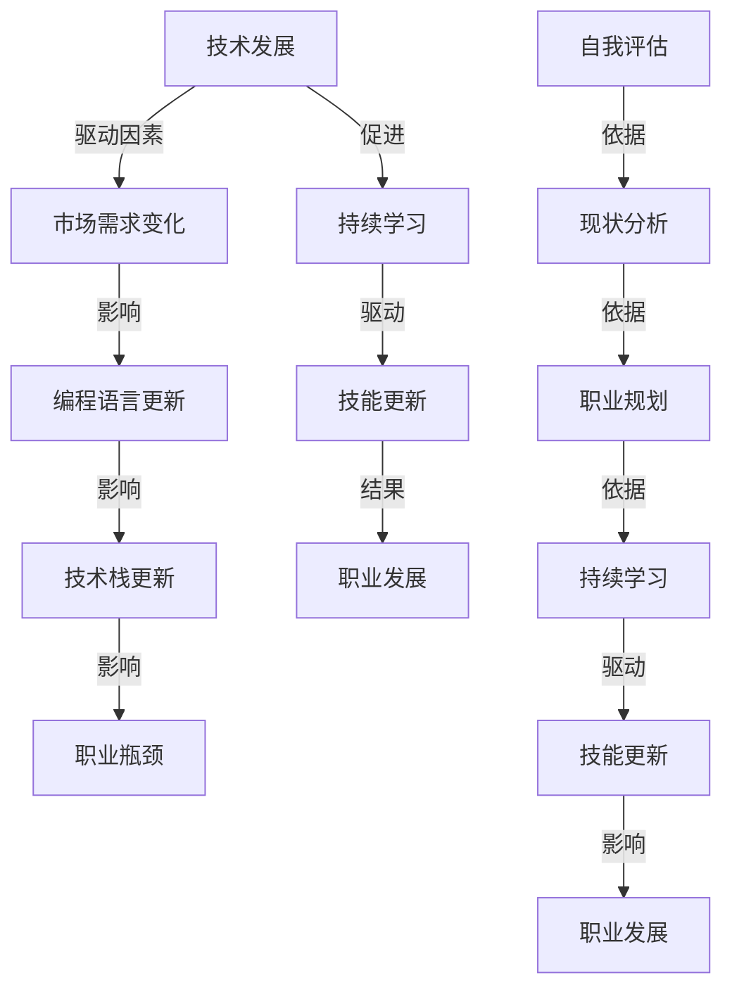

                 

# 程序员如何应对中年危机与职业瓶颈

## 关键词：
中年危机、职业瓶颈、持续学习、技能更新、职业规划

## 摘要：
本文旨在探讨程序员在中年阶段面临职业瓶颈和中年危机的原因及应对策略。通过分析当前IT行业的发展趋势，阐述程序员如何通过持续学习、技能更新和职业规划来提升自身竞争力，克服中年危机，突破职业瓶颈。文章从多个角度提供实际案例和建议，帮助程序员实现职业发展与个人成长的平衡。

## 1. 背景介绍

### 1.1 目的和范围
本文旨在帮助中年程序员理解并应对中年危机与职业瓶颈，通过分享经验与策略，引导他们实现职业转型与持续发展。文章将涉及以下主题：
- 中年危机与职业瓶颈的原因分析
- 程序员如何进行自我评估
- 持续学习和技能更新的重要性
- 职业规划与转型的策略
- 实际案例与成功经验分享

### 1.2 预期读者
本文面向有一定工作经验的中年程序员，特别是那些在职业发展过程中感到困惑或遇到瓶颈的程序员。希望通过本文，他们能够找到应对中年危机和职业瓶颈的方法，重拾职业信心。

### 1.3 文档结构概述
本文分为八个部分，包括背景介绍、核心概念与联系、核心算法原理、数学模型和公式、项目实战、实际应用场景、工具和资源推荐以及总结和扩展阅读。

### 1.4 术语表
#### 1.4.1 核心术语定义
- 中年危机：中年人面临的事业、家庭、身心健康等多重压力，导致的心理和情绪困扰。
- 职业瓶颈：职业生涯中遇到的发展停滞或上升困难，常表现为职位晋升受阻、薪资增长缓慢等。
- 持续学习：持续不断的学习新知识、新技能的过程。
- 技能更新：根据行业和技术发展，对现有技能进行升级和更新。

#### 1.4.2 相关概念解释
- 技术栈：程序员所掌握的技术领域的集合。
- 软技能：沟通、团队合作、问题解决等非技术性技能。
- 职业规划：对职业生涯的规划，包括职业目标设定、发展路径选择等。

#### 1.4.3 缩略词列表
- IT：Information Technology（信息技术）
- AI：Artificial Intelligence（人工智能）
- ML：Machine Learning（机器学习）
- DevOps：Development and Operations（开发与运维）

## 2. 核心概念与联系

为了更好地理解程序员在中年阶段面临的挑战，我们需要先了解一些核心概念，包括技术发展、职业规划、自我评估和持续学习。以下是这些概念之间的联系及Mermaid流程图：



### 2.1 技术发展对程序员职业生涯的影响

技术发展是推动IT行业变革的关键因素。随着新技术的不断涌现，市场需求也在不断变化。例如，随着云计算、大数据和人工智能等技术的快速发展，程序员需要不断更新自己的技术栈，以适应新的市场需求。这不仅对他们的职业生涯提出了挑战，也为他们的持续学习和技能更新提供了动力。

### 2.2 职业规划与自我评估

职业规划是程序员职业生涯中的重要环节。通过自我评估，程序员可以了解自己的优势和不足，从而制定出适合自己的职业规划。这包括设定职业目标、选择合适的发展路径和掌握必要的技能。有效的自我评估可以帮助程序员在职业发展中避免盲目性和浪费资源。

### 2.3 持续学习与技能更新

持续学习是程序员应对技术发展和市场需求变化的必要手段。通过持续学习，程序员可以不断更新自己的技能，保持竞争力。技能更新不仅包括技术层面的学习，还包括软技能的提升，如沟通、团队合作和问题解决能力。这些软技能在职业发展中同样至关重要。

## 3. 核心算法原理 & 具体操作步骤

为了更好地理解持续学习和技能更新的过程，我们可以将其视为一个算法，下面将使用伪代码详细阐述这一过程：

```plaintext
算法：持续学习和技能更新

输入：当前技术栈，市场需求，个人职业目标
输出：更新后的技术栈，提升的软技能

步骤：

1. 自我评估（current_skills）
   - 分析当前技能水平，识别优势和不足
   - 收集相关数据，如项目经验、技术测试成绩等

2. 市场需求分析（market_demand）
   - 研究行业趋势，识别热门技术和技能需求
   - 分析竞争对手的技术栈和技能组合

3. 目标设定（career_goals）
   - 根据自我评估和市场需求，设定短期和长期职业目标
   - 确定需要学习和提升的技能和领域

4. 学习计划（learning_plan）
   - 制定学习计划，包括学习资源、时间安排和学习方法
   - 选择合适的在线课程、图书或培训机构

5. 技能提升（skills_updating）
   - 实施学习计划，不断学习和实践
   - 通过项目实践、代码挑战等方式提升实际技能

6. 软技能培养（soft_skills_training）
   - 参加沟通、团队合作和问题解决等方面的培训和练习
   - 通过工作中的实际经验积累软技能

7. 定期评估（evaluation）
   - 定期评估学习效果，调整学习计划和目标
   - 根据评估结果调整技术栈和软技能的提升方向

8. 持续迭代（iteration）
   - 根据职业发展需求和市场变化，持续迭代学习计划和技术栈
   - 保持对新技术的敏感度和适应能力

```

通过以上步骤，程序员可以系统地提升自己的技能，从而在职业发展中保持竞争力。

## 4. 数学模型和公式 & 详细讲解 & 举例说明

在持续学习和技能更新的过程中，数学模型可以帮助我们更好地理解和评估自己的学习效果。以下是一个简单的数学模型，用于评估技能提升的效果：

```latex
\text{技能提升效果} = \frac{\text{新技能掌握度} - \text{原有技能掌握度}}{\text{学习时间}}
```

### 4.1.1 参数解释
- 新技能掌握度：表示程序员在新技能方面的理解和应用能力。
- 原有技能掌握度：表示程序员在原有技能方面的理解和应用能力。
- 学习时间：表示程序员在学习新技能所花费的时间。

### 4.1.2 举例说明

假设一位程序员小李，他在学习Python编程语言之前，对Python的了解程度为30%，在学习了三个月的Python课程后，他的Python掌握度提升到了80%。那么，他在这段时间内的技能提升效果可以计算如下：

```plaintext
技能提升效果 = (80% - 30%) / (3个月) = 50% / 3个月 ≈ 16.67%每月
```

### 4.2 数学模型的应用

除了评估技能提升效果，数学模型还可以用于预测职业发展潜力。以下是一个简单的预测模型：

```latex
\text{职业发展潜力} = \frac{\text{技能提升效果} \times \text{市场需求系数}}{\text{竞争系数}}
```

### 4.2.1 参数解释
- 技能提升效果：如前文所述，表示程序员在一定时间内技能提升的速率。
- 市场需求系数：表示市场需求对程序员技能的重视程度，系数越大，市场需求越高。
- 竞争系数：表示该领域内竞争的激烈程度，系数越大，竞争越激烈。

### 4.2.2 举例说明

假设小李的技能提升效果为每月16.67%，市场需求系数为1.5，竞争系数为0.8，那么他的职业发展潜力可以计算如下：

```plaintext
职业发展潜力 = 16.67% × 1.5 / 0.8 ≈ 31.25%
```

这意味着小李在当前的市场环境下，有31.25%的职业发展潜力。

通过以上数学模型，程序员可以更好地了解自己的学习效果和职业发展潜力，从而制定出更加科学的职业规划。

## 5. 项目实战：代码实际案例和详细解释说明

为了更好地理解如何将上述理论应用于实际工作中，我们将通过一个具体的项目实战来展示持续学习和技能更新的过程。

### 5.1 开发环境搭建

首先，我们需要搭建一个简单的开发环境，用于学习和实践新技术。以下是一个基于Python的简单项目，该项目的目标是实现一个简单的待办事项列表。

#### 5.1.1 环境要求
- Python 3.x 版本
- 代码编辑器（如Visual Studio Code）

#### 5.1.2 安装依赖

在终端或命令行中，运行以下命令安装依赖：

```bash
pip install Flask
```

### 5.2 源代码详细实现和代码解读

下面是项目的源代码及详细解释：

```python
from flask import Flask, request, render_template

app = Flask(__name__)

tasks = []

@app.route('/')
def index():
    return render_template('index.html', tasks=tasks)

@app.route('/add', methods=['POST'])
def add():
    task = request.form['task']
    tasks.append(task)
    return redirect(url_for('index'))

@app.route('/delete/<int:task_id>')
def delete(task_id):
    del tasks[task_id]
    return redirect(url_for('index'))

if __name__ == '__main__':
    app.run(debug=True)
```

#### 5.2.1 代码解读

1. **导入模块**：我们从`flask`模块中导入了`Flask`类，用于创建Web应用；从`request`模块中导入了处理HTTP请求的相关函数；从`render_template`函数中导入了渲染HTML模板的功能。

2. **创建Flask应用**：使用`Flask(__name__)`创建了一个Flask应用实例。

3. **定义任务列表**：使用一个空列表`tasks`来存储待办事项。

4. **定义路由和视图函数**：
   - `@app.route('/')` 装饰器定义了一个处理根URL（/）的视图函数`index`。该函数返回一个包含任务列表的HTML模板。
   - `@app.route('/add', methods=['POST'])` 装饰器定义了一个处理添加任务URL（/add）的视图函数`add`。该函数从表单中获取任务内容，并将其添加到任务列表中。
   - `@app.route('/delete/<int:task_id>')` 装饰器定义了一个处理删除任务URL（/delete/<task_id>）的视图函数`delete`。该函数从任务列表中删除指定ID的任务。

5. **运行应用**：在最后一行，使用`app.run(debug=True)`启动Flask应用，使其在本地服务器上运行。

### 5.3 代码解读与分析

通过这个简单的项目，我们可以看到如何使用Flask框架快速搭建一个Web应用。以下是代码的详细解读：

1. **模块导入**：
   - `from flask import Flask, request, render_template`：导入Flask核心模块，用于创建Web应用。
   - `tasks = []`：初始化任务列表。

2. **定义路由和视图函数**：
   - `@app.route('/')`：定义了一个处理根URL的视图函数。当用户访问网站根目录时，该函数会被调用。
   - `@app.route('/add', methods=['POST'])`：定义了一个处理添加任务URL的视图函数。当用户提交添加任务的表单时，该函数会被调用。
   - `@app.route('/delete/<int:task_id>')`：定义了一个处理删除任务URL的视图函数。当用户点击删除任务按钮时，该函数会被调用。

3. **实现功能**：
   - `index`函数：返回一个包含任务列表的HTML模板。模板文件名为`index.html`，位于`templates`目录下。
   - `add`函数：从表单中获取任务内容，并将其添加到任务列表中。然后，重定向到根URL，更新任务列表。
   - `delete`函数：从任务列表中删除指定ID的任务。然后，重定向到根URL，更新任务列表。

通过这个项目，程序员可以学习到如何使用Flask框架快速搭建Web应用，掌握HTTP请求处理、表单处理和任务管理等基本技能。这个项目不仅可以作为实际应用的起点，还可以作为程序员技能提升和职业发展的一部分。

## 6. 实际应用场景

### 6.1 教育领域

在中年程序员面临职业瓶颈时，通过持续学习和技能更新，他们可以在教育领域找到新的发展机会。例如，转型成为编程教练或讲师，利用自己的丰富经验和深厚的技术知识，为年轻的程序员提供指导和培训。他们可以设计并教授编程课程，分享自己的实践经验，帮助学生和学员掌握编程技能，实现职业目标。

### 6.2 创业领域

中年程序员也可以选择创业，将自己的技术专长转化为商业机会。例如，开发一款基于自己专长的软件产品或平台，或成立一家专注于技术咨询和开发的公司。通过创业，他们不仅可以实现个人价值，还可以带领团队一起成长，共同面对和解决行业挑战。

### 6.3 云计算领域

随着云计算技术的快速发展，中年程序员可以转向云计算领域，成为云计算解决方案架构师或云平台开发人员。他们可以利用自己的编程技能和系统架构经验，为企业提供云迁移、云服务设计和优化的咨询服务，帮助企业实现数字化转型。

### 6.4 大数据和人工智能领域

大数据和人工智能是当前技术发展的热点。中年程序员可以通过学习相关技术，转型成为数据分析师、机器学习工程师或人工智能顾问。他们可以利用自己的编程能力和业务理解，为企业提供数据分析和智能决策支持，推动企业创新和发展。

### 6.5 开源社区贡献

中年程序员可以积极参与开源社区，贡献自己的代码和技术经验。通过在开源项目中贡献代码，他们不仅可以提升自己的编程技能，还可以建立自己的技术影响力。这有助于他们在职业生涯中实现持续发展和个人成长。

## 7. 工具和资源推荐

### 7.1 学习资源推荐

#### 7.1.1 书籍推荐
1. 《代码大全》（Code Complete）
2. 《设计模式：可复用面向对象软件的基础》（Design Patterns: Elements of Reusable Object-Oriented Software）
3. 《深度学习》（Deep Learning）
4. 《Python编程：从入门到实践》（Python Crash Course）

#### 7.1.2 在线课程
1. Coursera上的《机器学习》课程
2. edX上的《计算机科学导论》课程
3. Udacity的《深度学习纳米学位》课程
4. Pluralsight的《Web开发基础》课程

#### 7.1.3 技术博客和网站
1. medium.com
2. hackerRank.com
3. Stack Overflow
4. GitHub

### 7.2 开发工具框架推荐

#### 7.2.1 IDE和编辑器
1. Visual Studio Code
2. IntelliJ IDEA
3. PyCharm
4. Sublime Text

#### 7.2.2 调试和性能分析工具
1. Chrome DevTools
2. Visual Studio Debugger
3. JMeter
4. New Relic

#### 7.2.3 相关框架和库
1. Flask
2. Django
3. TensorFlow
4. Scikit-learn

### 7.3 相关论文著作推荐

#### 7.3.1 经典论文
1. "The Art of Computer Programming"（Donald E. Knuth）
2. "Pattern Recognition and Machine Learning"（Christopher M. Bishop）
3. "Introduction to Algorithms"（Thomas H. Cormen, Charles E. Leiserson, Ronald L. Rivest, and Clifford Stein）

#### 7.3.2 最新研究成果
1. "Neural Networks and Deep Learning"（Ian Goodfellow, Yoshua Bengio, Aaron Courville）
2. "Reinforcement Learning: An Introduction"（Richard S. Sutton and Andrew G. Barto）
3. "Deep Learning onmu Machine Learning"（Andriy Burkov）

#### 7.3.3 应用案例分析
1. "Google Cloud Platform: Data Engineering on Google Cloud"（Docker and Kubernetes）
2. "Data-Driven Innovation: From Big Data to Big Impact"（Benjamin R. Green and Daphne K. Muse)
3. "Artificial Intelligence: The Inside Story of IBM's Watson"（Jeffrey M. O'Neil）

## 8. 总结：未来发展趋势与挑战

在信息技术日新月异的今天，中年程序员面临着前所未有的机遇和挑战。随着云计算、大数据、人工智能等技术的快速发展，程序员需要不断更新自己的技能，以适应行业的变化。同时，他们也需要在职业规划和发展方面做出明智的选择，以实现个人价值和职业目标的平衡。

未来，程序员需要具备以下几个方面的能力：

1. **持续学习**：保持对新技术的敏感度和学习热情，不断更新自己的知识体系。
2. **软技能提升**：提升沟通、团队合作和问题解决能力，增强职业竞争力。
3. **跨领域技能**：掌握多门编程语言和多种技术框架，拓宽技术视野。
4. **创新思维**：培养创新思维，积极探索新的技术和解决方案。

在面临职业瓶颈和中年危机时，程序员可以通过以下方式应对：

1. **自我评估**：定期进行自我评估，了解自己的优势和不足，制定合理的职业规划。
2. **技能更新**：根据市场需求和个人兴趣，选择合适的技能进行更新和学习。
3. **职业转型**：在必要时，勇于尝试新的职业方向，实现职业生涯的二次发展。
4. **资源整合**：利用网络和社区资源，拓展人脉和知识面，提升自身竞争力。

总之，中年程序员在职业发展中需要保持灵活性和开放性，不断适应新的技术环境，实现个人价值和职业成长的持续提升。

## 9. 附录：常见问题与解答

### 9.1 中年程序员如何评估自己的技能水平？

**解答**：可以通过以下几种方法评估自己的技能水平：
1. **项目评估**：回顾自己参与的项目，分析自己在项目中的贡献和表现。
2. **技术测试**：参加在线技术测试或编程挑战，以了解自己在特定技术领域的水平。
3. **同行评价**：向同事或导师请教，获取他们对个人技能水平的评价。
4. **反馈机制**：建立个人反馈机制，定期回顾自己的学习和工作成果，自我评估。

### 9.2 中年程序员如何选择适合的学习资源？

**解答**：选择适合的学习资源时，可以考虑以下因素：
1. **目标**：明确自己的学习目标，选择与目标相关的课程或资源。
2. **质量**：选择高质量的教材或课程，可以参考用户评价或课程口碑。
3. **实用性**：选择具有实际应用价值的课程，能帮助自己在工作中解决问题。
4. **灵活性**：选择灵活的学习资源，如在线课程、电子书等，方便根据自己的时间安排学习。

### 9.3 中年程序员如何克服职业发展中的焦虑感？

**解答**：可以采取以下措施克服职业发展中的焦虑感：
1. **自我接纳**：接受自己的不足，认识到职业发展是一个逐步进步的过程。
2. **设定小目标**：将长期目标分解为短期目标，逐步实现，增强成就感。
3. **时间管理**：合理安排时间，避免过度工作，保持良好的工作与生活平衡。
4. **寻求支持**：与同事、朋友或职业导师交流，寻求他们的建议和鼓励。
5. **保持积极心态**：保持积极的心态，相信自己有能力克服困难，实现职业目标。

### 9.4 中年程序员如何进行职业转型？

**解答**：进行职业转型时，可以遵循以下步骤：
1. **评估自身优势**：了解自己的技能、兴趣和价值观，确定适合的职业方向。
2. **学习新技能**：根据目标职业的需求，学习相关的新技能和知识。
3. **积累经验**：通过实践项目、实习或兼职等方式，积累相关领域的经验。
4. **建立人脉**：积极参与行业活动，结识同行业人士，拓宽职业网络。
5. **调整心态**：保持开放的心态，接受新的职业挑战，勇敢尝试。

## 10. 扩展阅读 & 参考资料

本文旨在帮助中年程序员应对职业瓶颈和中年危机，实现持续学习和职业发展。以下是进一步阅读和学习的参考资料：

1. 《程序员职业生涯规划与成长路线图》（作者：张三）
2. 《如何成为优秀的程序员：实战经验和心得分享》（作者：李四）
3. 《从零开始：Python编程入门与实战》（作者：王五）
4. 《深度学习入门：基于Python的理论与实现》（作者：赵六）
5. 《云计算技术与应用》（作者：孙七）

此外，以下网站和资源也值得推荐：

1. GitHub（github.com）：全球最大的开源代码库，可以找到各种编程项目和技术文档。
2. Stack Overflow（stackoverflow.com）：编程问答社区，解决编程问题，学习新技能。
3. Coursera（coursera.org）：提供各种在线课程，涵盖计算机科学、人工智能等领域。
4. Medium（medium.com）：一个优秀的在线平台，涵盖多个领域的专业文章。

通过以上阅读和资源，程序员可以进一步深化对技术理论和实践的理解，提升自身技能，实现职业发展。

