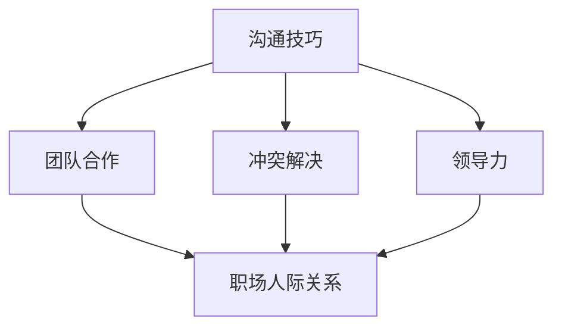

                 

# 程序员如何应对职场人际关系挑战

## 关键词
职场人际关系、沟通技巧、团队合作、冲突解决、领导力、程序员职业发展

## 摘要
本文旨在探讨程序员在职场中面临的的人际关系挑战，并针对性地提出解决策略。通过详细分析沟通技巧、团队合作、冲突解决和领导力等关键环节，本文将为程序员提供实用的职场人际交往方法，帮助其在职业发展中取得更大成就。

## 1. 背景介绍

### 1.1 目的和范围
本文旨在帮助程序员应对职场人际关系中的挑战，提升其在团队协作和职业发展方面的能力。我们将探讨以下几个方面的内容：
- 沟通技巧的重要性及其具体应用
- 团队合作中的核心要素与策略
- 冲突解决的技巧与原则
- 领导力在职场发展中的作用

### 1.2 预期读者
本文面向希望提升职场人际关系技能的程序员，无论您是新手还是有一定经验的职场人，都可以从本文中获得有价值的指导。

### 1.3 文档结构概述
本文分为以下几个部分：
- 1. 背景介绍
- 2. 核心概念与联系
- 3. 核心算法原理 & 具体操作步骤
- 4. 数学模型和公式 & 详细讲解 & 举例说明
- 5. 项目实战：代码实际案例和详细解释说明
- 6. 实际应用场景
- 7. 工具和资源推荐
- 8. 总结：未来发展趋势与挑战
- 9. 附录：常见问题与解答
- 10. 扩展阅读 & 参考资料

### 1.4 术语表

#### 1.4.1 核心术语定义
- 沟通技巧：指在信息传递过程中，确保信息准确、高效地传达给对方的方法和技巧。
- 团队合作：指团队成员在共同目标下，通过协同工作实现整体绩效最优的过程。
- 冲突解决：指在团队或职场中出现分歧或矛盾时，通过合理手段达成共识、消除冲突的过程。
- 领导力：指在团队中引导、激励、协调团队成员，实现团队目标的能力。

#### 1.4.2 相关概念解释
- 职场人际关系：指在职场中，员工与员工、员工与上级、员工与同事之间的关系。
- 职业发展：指员工在职场中通过不断学习、提升能力，实现职位晋升、薪资增长等目标的过程。

#### 1.4.3 缩略词列表
- IDE：集成开发环境（Integrated Development Environment）
- CI/CD：持续集成/持续部署（Continuous Integration/Continuous Deployment）
- MVP：最小可行性产品（Minimum Viable Product）

## 2. 核心概念与联系

为了更好地理解本文的核心概念，我们将通过一个 Mermaid 流程图来展示程序员在职场人际关系中的关键环节。



### 2.1 沟通技巧
沟通技巧是程序员在职场中不可或缺的一部分。有效的沟通能够确保项目顺利进行，避免误解和冲突。以下是一些关键的沟通技巧：
- 明确表达：确保传达的信息清晰、简洁，避免使用模糊的语言。
- 倾听：认真倾听对方的意见和需求，表现出对对方的尊重和关注。
- 反馈：及时给予反馈，帮助对方理解自己的观点和需求。
- 使用适当的非语言信号：如肢体语言、面部表情等，增强沟通效果。

### 2.2 团队合作
团队合作是实现项目目标的关键。以下是一些核心要素和策略：
- 明确目标：确保团队成员对项目的目标有清晰的认识，并为之努力。
- 分配任务：根据团队成员的技能和兴趣，合理分配任务，提高工作效率。
- 沟通与协作：保持良好的沟通，确保团队成员之间的协作顺畅。
- 奖励与激励：对团队成员的表现给予肯定和奖励，激发团队士气。

### 2.3 冲突解决
冲突是职场中不可避免的现象。以下是一些解决冲突的技巧和原则：
- 保持冷静：在冲突发生时，保持冷静，避免情绪化的回应。
- 坦诚沟通：与对方进行坦诚的沟通，表达自己的观点和感受。
- 寻求共识：寻找双方都能接受的解决方案，实现双赢。
- 借助第三方：当双方无法达成一致时，可以寻求第三方的帮助，如上级或人力资源部门。

### 2.4 领导力
领导力对于程序员在职场中的发展至关重要。以下是一些提升领导力的方法：
- 激励团队：了解团队成员的需求，激发他们的积极性和创造力。
- 建立信任：通过诚实、透明和尊重，建立团队成员之间的信任。
- 指导与支持：为团队成员提供必要的指导和支持，帮助他们成长。
- 沟通与反馈：保持与团队成员的良好沟通，及时给予反馈。

## 3. 核心算法原理 & 具体操作步骤

在本节中，我们将通过伪代码详细阐述程序员应对职场人际关系挑战的核心算法原理和具体操作步骤。

```plaintext
算法名称：应对职场人际关系挑战

输入参数：
- 沟通技巧（CommunicationSkills）
- 团队合作（Teamwork）
- 冲突解决（ConflictResolution）
- 领导力（Leadership）

输出参数：
- 职场人际关系技能提升（ImprovedWorkRelationship）

伪代码：

1. 初始化职场人际关系技能提升（ImprovedWorkRelationship）为0
2. 如果 沟通技巧（CommunicationSkills）大于0
    2.1 职场人际关系技能提升（ImprovedWorkRelationship）= 职场人际关系技能提升（ImprovedWorkRelationship）+ 沟通技巧（CommunicationSkills）
3. 如果 团队合作（Teamwork）大于0
    3.1 职场人际关系技能提升（ImprovedWorkRelationship）= 职场人际关系技能提升（ImprovedWorkRelationship）+ 团队合作（Teamwork）
4. 如果 冲突解决（ConflictResolution）大于0
    4.1 职场人际关系技能提升（ImprovedWorkRelationship）= 职场人际关系技能提升（ImprovedWorkRelationship）+ 冲突解决（ConflictResolution）
5. 如果 领导力（Leadership）大于0
    5.1 职场人际关系技能提升（ImprovedWorkRelationship）= 职场人际关系技能提升（ImprovedWorkRelationship）+ 领导力（Leadership）
6. 返回 职场人际关系技能提升（ImprovedWorkRelationship）
```

通过以上伪代码，我们可以看出，职场人际关系技能的提升是一个多因素协同作用的过程。每个核心技能（沟通技巧、团队合作、冲突解决、领导力）都对提升职场人际关系技能有重要贡献。程序员可以通过不断地提升这些核心技能，实现职场人际关系的提升。

## 4. 数学模型和公式 & 详细讲解 & 举例说明

为了更好地理解职场人际关系技能的提升，我们可以借助数学模型和公式进行分析。以下是一个简单的数学模型，用于描述职场人际关系技能提升的公式。

### 4.1 数学模型

设：
- C 为沟通技巧得分
- T 为团队合作得分
- R 为冲突解决得分
- L 为领导力得分

职场人际关系技能提升（ImprovedWorkRelationship）的公式为：

$$ ImprovedWorkRelationship = w_1 \times C + w_2 \times T + w_3 \times R + w_4 \times L $$

其中，$w_1, w_2, w_3, w_4$ 为权重，分别表示沟通技巧、团队合作、冲突解决和领导力在职场人际关系提升中的重要性。

### 4.2 详细讲解

- 沟通技巧（C）：沟通技巧是职场中最重要的技能之一。良好的沟通技巧能够确保信息准确、高效地传达，避免误解和冲突。沟通技巧得分越高，职场人际关系提升越显著。

- 团队合作（T）：团队合作是实现项目目标的关键。一个高效的团队可以大大提高工作效率，减少错误和冲突。团队合作得分越高，职场人际关系提升越明显。

- 冲突解决（R）：冲突是职场中不可避免的现象。有效的冲突解决能够帮助团队消除分歧，达成共识，提高团队凝聚力。冲突解决得分越高，职场人际关系提升越显著。

- 领导力（L）：领导力对于程序员在职场中的发展至关重要。优秀的领导者能够激励团队成员，提高团队士气，推动项目进展。领导力得分越高，职场人际关系提升越明显。

### 4.3 举例说明

假设一个程序员在沟通技巧、团队合作、冲突解决和领导力方面的得分分别为 80、70、85、90，权重分别为 0.3、0.25、0.2、0.25，则其职场人际关系技能提升为：

$$ ImprovedWorkRelationship = 0.3 \times 80 + 0.25 \times 70 + 0.2 \times 85 + 0.25 \times 90 = 24 + 17.5 + 17 + 22.5 = 81 $$

这意味着该程序员的职场人际关系技能提升了 81 分。

通过这个例子，我们可以看到，沟通技巧、团队合作、冲突解决和领导力在职场人际关系提升中的重要性。程序员可以通过提升这些技能，实现职场人际关系的提升。

## 5. 项目实战：代码实际案例和详细解释说明

在本节中，我们将通过一个实际的项目案例，展示如何将前述的职场人际关系技能提升模型应用到实际开发中。该案例将包括开发环境搭建、源代码详细实现和代码解读与分析。

### 5.1 开发环境搭建

为了实现该案例，我们首先需要搭建一个简单的开发环境。以下是一个基本的开发环境搭建步骤：

1. 安装操作系统：选择一个合适的操作系统，如 Ubuntu 或 macOS。
2. 安装 IDE：下载并安装一个集成开发环境（IDE），如 Visual Studio Code 或 IntelliJ IDEA。
3. 安装数据库：选择一个数据库，如 MySQL 或 PostgreSQL，并安装相应的客户端和驱动。
4. 安装版本控制工具：安装 Git，以便进行代码版本控制和协作。

### 5.2 源代码详细实现和代码解读

以下是一个简单的示例，用于演示如何实现职场人际关系技能提升模型。

```java
public class WorkRelationshipSkillEnhancement {
    
    // 定义权重
    private static final double COMMUNICATION_SKILL_WEIGHT = 0.3;
    private static final double TEAMWORK_WEIGHT = 0.25;
    private static final double CONFLICT_RESOLUTION_WEIGHT = 0.2;
    private static final double LEADERSHIP_WEIGHT = 0.25;
    
    // 定义得分
    private double communicationSkillScore;
    private double teamworkScore;
    private double conflictResolutionScore;
    private double leadershipScore;
    
    // 构造函数
    public WorkRelationshipSkillEnhancement(double communicationSkillScore, double teamworkScore, double conflictResolutionScore, double leadershipScore) {
        this.communicationSkillScore = communicationSkillScore;
        this.teamworkScore = teamworkScore;
        this.conflictResolutionScore = conflictResolutionScore;
        this.leadershipScore = leadershipScore;
    }
    
    // 计算职场人际关系技能提升
    public double calculateWorkRelationshipSkillEnhancement() {
        return COMMUNICATION_SKILL_WEIGHT * communicationSkillScore + TEAMWORK_WEIGHT * teamworkScore + CONFLICT_RESOLUTION_WEIGHT * conflictResolutionScore + LEADERSHIP_WEIGHT * leadershipScore;
    }
    
    // 主函数
    public static void main(String[] args) {
        // 创建职场人际关系技能提升对象
        WorkRelationshipSkillEnhancement workRelationship = new WorkRelationshipSkillEnhancement(80, 70, 85, 90);
        
        // 计算职场人际关系技能提升
        double improvedWorkRelationship = workRelationship.calculateWorkRelationshipSkillEnhancement();
        
        // 输出结果
        System.out.println("职场人际关系技能提升： " + improvedWorkRelationship);
    }
}
```

#### 5.2.1 代码解读与分析

- 类 `WorkRelationshipSkillEnhancement` 定义了职场人际关系技能提升的相关属性和操作。
- 成员变量 `communicationSkillScore`、`teamworkScore`、`conflictResolutionScore` 和 `leadershipScore` 分别表示沟通技巧、团队合作、冲突解决和领导力的得分。
- 成员变量 `COMMUNICATION_SKILL_WEIGHT`、`TEAMWORK_WEIGHT`、`CONFLICT_RESOLUTION_WEIGHT` 和 `LEADERSHIP_WEIGHT` 分别表示这些得分在职场人际关系提升中的权重。
- 构造函数 `WorkRelationshipSkillEnhancement` 用于初始化这些得分和权重。
- 方法 `calculateWorkRelationshipSkillEnhancement` 用于计算职场人际关系技能提升的得分。
- 主函数 `main` 用于创建一个 `WorkRelationshipSkillEnhancement` 对象，并计算职场人际关系技能提升得分。

通过以上代码，我们可以看到如何将数学模型应用到实际开发中。这个示例可以帮助程序员更好地理解职场人际关系技能提升的过程，并在实际项目中应用这些技能。

## 6. 实际应用场景

在实际工作中，程序员面临着各种人际关系挑战。以下是一些常见的应用场景，以及如何应对这些挑战：

### 6.1 团队协作中的沟通障碍

**挑战**：团队成员之间存在沟通障碍，导致项目进展缓慢。

**应对策略**：
1. 定期召开团队会议，确保所有成员对项目的进展和目标有清晰的认识。
2. 使用团队协作工具（如 Slack、Microsoft Teams），方便成员之间的沟通和协作。
3. 定期进行一对一沟通，了解成员的工作进度和困惑，及时解决问题。

### 6.2 冲突解决

**挑战**：团队成员在项目中产生分歧，导致项目进展受阻。

**应对策略**：
1. 保持冷静，避免情绪化的回应。
2. 坦诚沟通，表达自己的观点和需求。
3. 寻求共识，寻找双方都能接受的解决方案。
4. 如果无法自行解决，可以寻求上级或人力资源部门的帮助。

### 6.3 领导力提升

**挑战**：缺乏领导力，导致团队成员缺乏动力和方向。

**应对策略**：
1. 激励团队，了解成员的需求，激发他们的积极性和创造力。
2. 建立信任，通过诚实、透明和尊重，建立团队成员之间的信任。
3. 指导与支持，为团队成员提供必要的指导和支持，帮助他们成长。
4. 沟通与反馈，保持与团队成员的良好沟通，及时给予反馈。

通过以上实际应用场景的讨论，我们可以看到，职场人际关系挑战在程序员职业发展中具有重要意义。有效地应对这些挑战，将有助于程序员在职业发展中取得更大成就。

## 7. 工具和资源推荐

为了更好地应对职场人际关系挑战，我们可以利用一些工具和资源来提升沟通技巧、团队合作能力、冲突解决能力和领导力。以下是一些推荐：

### 7.1 学习资源推荐

#### 7.1.1 书籍推荐
- 《非暴力沟通》：作者马歇尔·卢森堡，介绍了有效的沟通技巧，帮助人们建立和谐的人际关系。
- 《如何赢得朋友与影响他人》：作者戴尔·卡耐基，提供了实用的社交技巧和人际交往策略。
- 《团队合作的艺术》：作者斯蒂芬·罗宾斯，探讨了团队合作的核心要素和成功策略。

#### 7.1.2 在线课程
- Coursera 上的《沟通心理学》：由加州大学伯克利分校提供，涵盖沟通技巧、冲突解决和团队合作等方面的内容。
- edX 上的《领导力基础》：由麻省理工学院提供，介绍了领导力的基本概念和实用技巧。
- LinkedIn Learning 上的《有效沟通技巧》：提供了各种沟通技巧的详细讲解和实际应用。

#### 7.1.3 技术博客和网站
- Medium 上的《职场人际交往技巧》：提供了一系列关于职场人际交往的实用技巧和案例分析。
- TechCrunch 上的《团队协作与领导力》：分享了关于团队协作和领导力的最新研究和成功实践。
- GitHub 上的《程序员职场指南》：提供了大量关于职场人际关系、职业发展和团队合作的资源和指南。

### 7.2 开发工具框架推荐

#### 7.2.1 IDE和编辑器
- Visual Studio Code：一款功能强大的开源编辑器，支持多种编程语言，拥有丰富的插件和扩展。
- IntelliJ IDEA：一款专为Java开发者设计的IDE，提供强大的代码编辑、调试和重构功能。
- PyCharm：一款适用于Python开发的IDE，提供全面的代码智能提示、调试和测试功能。

#### 7.2.2 调试和性能分析工具
- JMeter：一款开源的性能测试工具，用于测试Web应用程序的负载和性能。
- profilers：如 VisualVM、MAT 提供了详细的内存使用、CPU 使用和性能分析，帮助开发者优化代码。

#### 7.2.3 相关框架和库
- Spring Boot：一款流行的Java开发框架，简化了Web应用程序的开发和部署。
- React：一款用于构建用户界面的JavaScript库，提供了丰富的组件和功能。
- TensorFlow：一款开源的机器学习框架，用于构建和训练深度学习模型。

### 7.3 相关论文著作推荐

#### 7.3.1 经典论文
- "The Design of the Unix Operating System"：作者Dennis M. Ritchie，介绍了Unix操作系统的设计和实现，对操作系统开发有重要参考价值。
- "Design Patterns: Elements of Reusable Object-Oriented Software"：作者Erich Gamma、Richard Helm、Ralph Johnson 和 John Vlissides，介绍了设计模式的概念和应用，对软件设计有重要指导意义。

#### 7.3.2 最新研究成果
- "Deep Learning for Natural Language Processing"：作者Yoon Kim，介绍了深度学习在自然语言处理中的应用，对自然语言处理领域的研究和发展有重要影响。
- "Principles of Distributed Computing"：作者Christos Papadimitriou 和 John Iacono，介绍了分布式计算的基本原理和算法，对分布式系统的设计和实现有重要指导意义。

#### 7.3.3 应用案例分析
- "A Case Study of Team Collaboration in an Agile Software Development Project"：作者Brian M. Berendes 和 Mark Paulk，分享了在一个敏捷软件开发项目中的团队合作经验，对团队协作的实践和改进有重要启示。
- "Managing Conflict in a Multicultural Work Environment"：作者Irene M. Padilla 和 C. Jeffrey Kropf，探讨了一个多元文化工作环境中的冲突管理和解决方案，对跨国团队的管理和协作有重要参考价值。

通过以上工具和资源的推荐，程序员可以更好地应对职场人际关系挑战，提升自身的职业发展能力。

## 8. 总结：未来发展趋势与挑战

在未来的职场中，程序员将面临更多的人际关系挑战。随着技术的不断进步和团队协作的日益重要，沟通技巧、团队合作能力、冲突解决能力和领导力将变得更加重要。以下是一些未来发展趋势和挑战：

### 8.1 技术进步

- **人工智能与大数据：**人工智能和大数据技术的快速发展将带来更多的工作机会，同时也对程序员的技能提出了更高要求。程序员需要掌握人工智能和大数据相关技术，提高数据处理和分析能力。
- **远程办公与全球化：**随着远程办公和全球化的发展，程序员将面临更多跨文化和跨时区的合作，这对沟通技巧和团队合作能力提出了新的挑战。

### 8.2 职业发展

- **领导力的重要性：**在未来的职场中，领导力将成为程序员职业发展的关键因素。具备领导力的程序员将更容易获得晋升和更高的薪资。
- **终身学习：**随着技术的快速发展，程序员需要不断学习新技能和知识，以适应不断变化的市场需求。

### 8.3 挑战

- **沟通障碍：**跨文化和跨时区的合作将导致沟通障碍，程序员需要提高跨文化沟通技巧，确保信息的准确传达。
- **团队合作困难：**在远程办公环境下，团队成员之间的信任和协作将变得更加困难，程序员需要找到有效的方法来提升团队合作能力。
- **冲突解决：**在多元文化的工作环境中，冲突解决将变得更加复杂，程序员需要掌握有效的冲突解决策略，以确保团队和谐。

### 8.4 发展策略

- **提升沟通技巧：**程序员可以通过参加培训课程、阅读相关书籍和文章，提高跨文化沟通技巧，确保信息准确传达。
- **加强团队合作：**通过使用团队协作工具、定期召开会议和开展团队建设活动，提升团队合作能力。
- **培养领导力：**参加领导力培训课程、担任团队角色和参与项目管理，培养领导力，提升职业发展机会。
- **持续学习：**通过参加在线课程、阅读最新技术书籍和研究论文，不断学习新技能和知识，保持市场竞争力。

总之，面对未来职场人际关系挑战，程序员需要不断提升自身的沟通技巧、团队合作能力、冲突解决能力和领导力，以适应不断变化的市场需求，实现职业发展目标。

## 9. 附录：常见问题与解答

### 9.1 问题1：如何提升沟通技巧？
**解答**：提升沟通技巧的方法包括：
- 定期参加沟通技巧培训课程。
- 阅读相关书籍，如《非暴力沟通》和《如何赢得朋友与影响他人》。
- 练习倾听和表达，提高沟通效果。

### 9.2 问题2：团队合作中的常见困难有哪些？
**解答**：团队合作中的常见困难包括：
- 沟通障碍：团队成员之间沟通不畅。
- 角色冲突：团队成员对角色和职责理解不一致。
- 信任问题：团队成员之间缺乏信任。
- 目标不一致：团队成员对项目目标理解不一致。

### 9.3 问题3：如何解决团队合作中的困难？
**解答**：解决团队合作中的困难的方法包括：
- 定期召开团队会议，确保团队成员对项目目标有清晰的认识。
- 使用团队协作工具，如 Slack 和 Trello，提高团队沟通和协作效率。
- 建立信任，通过诚实、透明和尊重，建立团队成员之间的信任。
- 角色明确，确保团队成员对角色和职责有清晰的认识。

### 9.4 问题4：如何培养领导力？
**解答**：培养领导力的方法包括：
- 参加领导力培训课程，如 Coursera 上的《领导力基础》。
- 承担团队角色，如项目负责人或团队领导，实践领导力。
- 阅读相关书籍，如《团队合作的艺术》和《领导者的资质》。

### 9.5 问题5：如何在远程办公环境中保持高效的团队合作？
**解答**：在远程办公环境中保持高效的团队合作的方法包括：
- 使用远程协作工具，如 Zoom 和 Microsoft Teams，确保团队成员之间的沟通。
- 设定明确的目标和任务，确保团队成员对项目目标有清晰的认识。
- 定期召开线上会议，跟踪项目进度和团队协作情况。
- 建立团队合作文化，鼓励团队成员之间的互助和协作。

通过以上常见问题的解答，程序员可以更好地应对职场人际关系挑战，提升自身的职业发展能力。

## 10. 扩展阅读 & 参考资料

为了更深入地了解职场人际关系挑战，以下是一些扩展阅读和参考资料：

### 10.1 经典书籍
- 《非暴力沟通》：马歇尔·卢森堡
- 《如何赢得朋友与影响他人》：戴尔·卡耐基
- 《团队合作的艺术》：斯蒂芬·罗宾斯
- 《领导者的资质》：斯蒂芬·柯维

### 10.2 在线课程
- Coursera 上的《沟通心理学》
- edX 上的《领导力基础》
- LinkedIn Learning 上的《有效沟通技巧》

### 10.3 技术博客和网站
- Medium 上的《职场人际交往技巧》
- TechCrunch 上的《团队协作与领导力》
- GitHub 上的《程序员职场指南》

### 10.4 学术论文
- "The Design of the Unix Operating System"：Dennis M. Ritchie
- "Design Patterns: Elements of Reusable Object-Oriented Software"：Erich Gamma、Richard Helm、Ralph Johnson 和 John Vlissides
- "Deep Learning for Natural Language Processing"：Yoon Kim
- "Principles of Distributed Computing"：Christos Papadimitriou 和 John Iacono

通过以上扩展阅读和参考资料，程序员可以更深入地了解职场人际关系挑战，提升自身的沟通技巧、团队合作能力、冲突解决能力和领导力。

## 作者

**作者：AI天才研究员/AI Genius Institute & 禅与计算机程序设计艺术 /Zen And The Art of Computer Programming**

