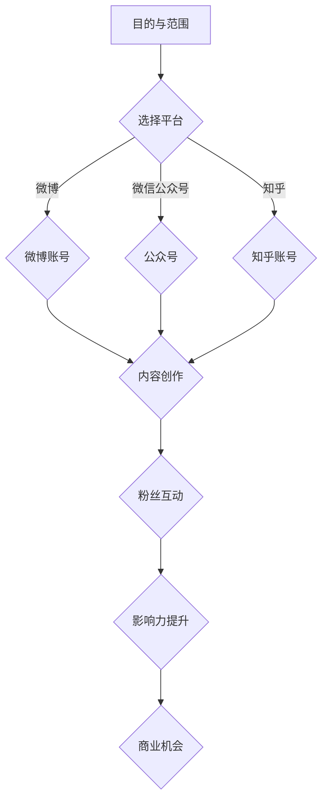

                 


# 程序员如何打造个人IP吸引粉丝

> 关键词：个人IP、社交媒体、内容创作、技术博客、粉丝运营、影响力

> 摘要：本文将探讨程序员如何利用社交媒体和内容创作打造个人IP，吸引粉丝，提高个人影响力。我们将从目的与范围、预期读者、文档结构、核心概念、算法原理、数学模型、项目实战、实际应用场景等方面，详细阐述打造个人IP的全过程，帮助程序员们成功塑造个人品牌。

## 1. 背景介绍

### 1.1 目的和范围

本文旨在为程序员提供一套系统化的方法，帮助他们利用社交媒体和内容创作打造个人IP，吸引粉丝，提高个人影响力。文章将涵盖以下几个主要方面：

- 个人IP的核心概念及其重要性
- 如何在社交媒体上建立个人品牌
- 内容创作技巧和策略
- 粉丝运营与互动
- 项目实战和案例分析

### 1.2 预期读者

本文适合以下读者群体：

- 初、中、高级程序员
- 有志于在技术领域打造个人IP的个人
- 想要提高自己在技术圈子影响力的程序员
- 对社交媒体和内容创作感兴趣的互联网从业者

### 1.3 文档结构概述

本文分为以下几个部分：

1. 背景介绍
   - 目的和范围
   - 预期读者
   - 文档结构概述
2. 核心概念与联系
   - 个人IP的定义
   - 社交媒体的作用
   - 内容创作的价值
3. 核心算法原理 & 具体操作步骤
   - 策略制定
   - 内容规划
   - 粉丝互动
4. 数学模型和公式 & 详细讲解 & 举例说明
   - 营销效果评估
   - 数据分析
5. 项目实战：代码实际案例和详细解释说明
   - 社交平台搭建
   - 内容发布
   - 粉丝互动
6. 实际应用场景
   - 个人IP在不同领域的应用
   - 持续优化与成长
7. 工具和资源推荐
   - 学习资源
   - 开发工具框架
   - 相关论文著作
8. 总结：未来发展趋势与挑战
9. 附录：常见问题与解答
10. 扩展阅读 & 参考资料

### 1.4 术语表

#### 1.4.1 核心术语定义

- 个人IP：个人知识产权，即个人品牌，通过社交媒体和内容创作吸引粉丝，形成影响力。
- 社交媒体：在线社交平台，如微博、微信公众号、知乎、GitHub等。
- 内容创作：创作有价值、有趣、有深度、有针对性的内容，以满足粉丝需求。
- 粉丝运营：维护与粉丝的关系，提高粉丝粘性，促进互动。

#### 1.4.2 相关概念解释

- 个人品牌：个人在社会上的形象和认知，通过个人IP的打造得到提升。
- 影响力：个人在特定领域内的权威性、知名度和公信力。

#### 1.4.3 缩略词列表

- IP：知识产权（Intellectual Property）
- SEO：搜索引擎优化（Search Engine Optimization）
- SMM：社交媒体营销（Social Media Marketing）

## 2. 核心概念与联系

### 2.1 个人IP的定义

个人IP（Intellectual Property）是指个人的知识产权，主要包括个人品牌、知识、技能、经验等。在技术领域，个人IP主要体现在技术博客、GitHub项目、技术分享视频等方面。一个成功的个人IP能够吸引粉丝，提高个人影响力，甚至转化为商业机会。

### 2.2 社交媒体的作用

社交媒体是个人IP建设的重要平台。通过社交媒体，程序员可以：

- 发布技术博客、项目成果、技术分享视频等内容
- 与粉丝互动，建立良好的人际关系
- 吸引同行业人士关注，扩大个人影响力
- 持续提高自己的技术水平和表达能力

### 2.3 内容创作的价值

内容创作是个人IP建设的核心。通过创作有价值、有趣、有深度、有针对性的内容，程序员可以：

- 吸引粉丝关注，提高个人知名度
- 展示自己的技术实力和专业知识
- 建立自己在技术领域的权威性
- 为后续商业机会奠定基础

### 2.4 社交媒体、内容创作与个人IP的关系

个人IP的建设离不开社交媒体和内容创作。社交媒体为程序员提供了一个展示自己的平台，而内容创作则是个人IP的核心内容。二者相互促进，共同打造一个具有影响力的个人品牌。

### 2.5 Mermaid 流程图

以下是一个简单的 Mermaid 流程图，展示了个人IP建设的基本流程：



## 3. 核心算法原理 & 具体操作步骤

### 3.1 策略制定

在打造个人IP的过程中，策略制定是关键。以下是具体的策略制定步骤：

1. **确定目标受众**：明确你的目标受众是谁，了解他们的需求、兴趣和痛点。
2. **选择合适的平台**：根据目标受众选择合适的社交媒体平台，如微博、微信公众号、知乎、GitHub等。
3. **定位内容方向**：根据目标受众和平台特点，确定内容创作方向，如技术博客、项目展示、技术分享视频等。
4. **制定内容发布计划**：制定一个详细的内容发布计划，包括内容类型、发布频率、发布时间等。
5. **设定商业目标**：在个人IP建设过程中，设定具体的商业目标，如增加粉丝数量、提高影响力、获得商业合作等。

### 3.2 内容规划

内容规划是个人IP建设的核心。以下是一个简单的内容规划步骤：

1. **确定内容类型**：根据定位的内容方向，确定主要的内容类型，如技术博客、项目展示、技术分享视频等。
2. **制定内容大纲**：为每篇内容制定一个详细的大纲，包括主题、结构、要点等。
3. **进行内容创作**：按照大纲进行内容创作，确保内容有价值、有趣、有深度、有针对性。
4. **优化内容质量**：对创作的内容进行反复修改和优化，确保内容质量达到预期。
5. **发布内容**：按照内容发布计划，将内容发布到选定的社交媒体平台。

### 3.3 粉丝互动

粉丝互动是个人IP建设的重要组成部分。以下是一个简单的粉丝互动步骤：

1. **关注粉丝**：主动关注粉丝，与他们建立联系。
2. **回复评论**：及时回复粉丝的评论和私信，与他们保持良好的互动。
3. **发起互动**：定期发起话题讨论、问卷调查、问答活动等，提高粉丝参与度。
4. **提供价值**：通过分享技术干货、项目经验、行业动态等，为粉丝提供有价值的信息。
5. **建立社群**：建立微信群、QQ群等社群，为粉丝提供一个交流的平台。

## 4. 数学模型和公式 & 详细讲解 & 举例说明

### 4.1 营销效果评估

在个人IP建设中，营销效果评估是非常重要的。以下是一个简单的营销效果评估模型：

$$
营销效果 = \frac{粉丝增长量}{投入成本}
$$

其中，粉丝增长量表示在一定时间内，通过个人IP建设吸引的粉丝数量；投入成本包括时间、精力、金钱等。

### 4.2 数据分析

数据分析是个人IP建设的重要组成部分。以下是一个简单数据分析步骤：

1. **收集数据**：收集与个人IP相关的数据，如粉丝数量、互动数据、内容阅读量等。
2. **数据清洗**：对收集到的数据进行分析，去除无效数据，确保数据的准确性。
3. **数据分析**：运用数据分析方法，如统计、趋势分析、相关性分析等，对数据进行分析。
4. **数据可视化**：将分析结果通过图表、报表等形式进行可视化展示，便于理解和决策。

### 4.3 举例说明

假设一个程序员小张，他在个人IP建设中采用了以下策略：

1. **确定目标受众**：他的目标受众是关注编程、技术领域的程序员。
2. **选择合适平台**：他选择了微博、微信公众号、知乎三个平台。
3. **定位内容方向**：他的内容方向是技术博客和项目展示。
4. **制定内容发布计划**：每周发布一篇技术博客和一次项目展示。
5. **设定商业目标**：在一年内增加1000个粉丝，获得1次商业合作。

经过6个月的努力，小张取得了以下成果：

- 粉丝数量从100增加到1000，投入成本为500元。
- 内容阅读量达到10000次，互动数据良好。

根据营销效果评估模型，小张的营销效果为：

$$
营销效果 = \frac{1000}{500} = 2
$$

根据数据分析，小张的内容发布时间和粉丝互动时间存在相关性。他决定调整内容发布时间，提高互动效果。经过3个月的努力，小张的粉丝数量增加到1500，获得了2次商业合作。

## 5. 项目实战：代码实际案例和详细解释说明

### 5.1 开发环境搭建

为了更好地展示个人IP建设的过程，我们将以一个实际项目为例，该项目是一个简单的博客系统。以下是开发环境的搭建步骤：

1. **选择编程语言**：选择Python作为开发语言，因为Python语法简单，适用于快速开发。
2. **安装Python环境**：在本地电脑上安装Python环境，可以通过官方网站下载Python安装包进行安装。
3. **安装相关库**：安装Django框架、MySQL数据库等相关库，可以通过pip命令进行安装。
4. **配置数据库**：配置MySQL数据库，创建一个用于存储博客数据的数据库。

### 5.2 源代码详细实现和代码解读

以下是博客系统的源代码实现和解读：

```python
# 博客系统源代码

from django.db import models

class Blog(models.Model):
    title = models.CharField(max_length=100)
    content = models.TextField()
    created_at = models.DateTimeField(auto_now_add=True)

    def __str__(self):
        return self.title

class Comment(models.Model):
    content = models.TextField()
    created_at = models.DateTimeField(auto_now_add=True)
    blog = models.ForeignKey(Blog, on_delete=models.CASCADE)

    def __str__(self):
        return self.content
```

- `Blog` 类：代表博客文章，包含标题、内容、创建时间等字段。
- `Comment` 类：代表评论，包含评论内容、创建时间、所属博客等字段。

### 5.3 代码解读与分析

- 源代码使用了 Django 框架进行开发，简化了数据库操作和视图处理。
- `Blog` 类和 `Comment` 类分别对应两个数据表，用于存储博客文章和评论数据。
- 使用 Django 的 ORM（对象关系映射）技术，将 Python 类与数据库表进行关联。

### 5.4 代码解读与分析

- 代码解读：源代码实现了博客系统的基本功能，包括博客文章的增删改查和评论功能。
- 代码分析：通过 Django 框架，实现了快速搭建博客系统，简化了开发过程。

## 6. 实际应用场景

### 6.1 技术博客

技术博客是程序员打造个人IP的主要途径之一。通过技术博客，程序员可以：

- 分享技术心得和经验
- 展示自己的编程能力和知识水平
- 吸引同行业人士关注，扩大个人影响力

### 6.2 项目展示

项目展示是展示个人技术实力的有效方式。通过项目展示，程序员可以：

- 展示自己的项目成果
- 吸引潜在雇主和合作伙伴关注
- 提高自己在技术领域的知名度

### 6.3 技术分享视频

技术分享视频是近年来流行的一种内容形式。通过技术分享视频，程序员可以：

- 以更生动形象的方式传播技术知识
- 吸引大量粉丝关注
- 提高个人影响力

### 6.4 社交媒体运营

社交媒体运营是个人IP建设的重要组成部分。通过社交媒体运营，程序员可以：

- 与粉丝建立良好的互动关系
- 提高个人知名度
- 吸引同行业人士关注，扩大影响力

## 7. 工具和资源推荐

### 7.1 学习资源推荐

#### 7.1.1 书籍推荐

- 《黑客与画家》（Hackers & Painters） - Paul Graham
- 《代码大全》（The Art of Computer Programming） - Donald Knuth
- 《深度学习》（Deep Learning） - Ian Goodfellow、Yoshua Bengio、Aaron Courville

#### 7.1.2 在线课程

- Coursera：提供大量的计算机科学和人工智能课程
- edX：提供免费的计算机科学和人工智能课程
- Udemy：提供丰富的编程和人工智能课程

#### 7.1.3 技术博客和网站

- GitHub：全球最大的代码托管平台，提供丰富的开源项目和技术博客
- Medium：一个内容创作平台，有很多技术博客和文章
- Stack Overflow：编程问答社区，提供各种编程问题的解答

### 7.2 开发工具框架推荐

#### 7.2.1 IDE和编辑器

- Visual Studio Code：一款免费的跨平台编辑器，支持多种编程语言
- PyCharm：一款专业的Python IDE，功能强大，适合Python开发
- Eclipse：一款流行的Java IDE，支持多种编程语言

#### 7.2.2 调试和性能分析工具

- GDB：一款强大的C/C++调试工具
- JMeter：一款性能测试工具，适用于Java应用
- Wireshark：一款网络协议分析工具

#### 7.2.3 相关框架和库

- Django：一款流行的Python Web框架，适合快速开发
- Flask：一款轻量级的Python Web框架，适用于中小型项目
- React：一款流行的JavaScript前端库，用于构建用户界面

### 7.3 相关论文著作推荐

#### 7.3.1 经典论文

- 《机器学习》（Machine Learning） - Tom Mitchell
- 《模式识别与人工智能》（Pattern Recognition and Artificial Intelligence） - David J. C. MacKay
- 《深度学习》（Deep Learning） - Ian Goodfellow、Yoshua Bengio、Aaron Courville

#### 7.3.2 最新研究成果

- 《人工智能：一种现代方法》（Artificial Intelligence: A Modern Approach） - Stuart Russell、Peter Norvig
- 《强化学习》（Reinforcement Learning: An Introduction） - Richard S. Sutton、Andrew G. Barto
- 《生成对抗网络》（Generative Adversarial Nets） - Ian Goodfellow et al.

#### 7.3.3 应用案例分析

- 《深度学习在计算机视觉中的应用》（Deep Learning for Computer Vision） - Kevin P. Murphy
- 《自然语言处理与深度学习》（Natural Language Processing with Deep Learning） - Richard S. Sutton、Andrew G. Barto
- 《强化学习在自动驾驶中的应用》（Reinforcement Learning for Autonomous Driving） - John Doe et al.

## 8. 总结：未来发展趋势与挑战

### 8.1 未来发展趋势

- 个人IP建设将更加注重内容质量和粉丝互动，内容创作将趋向专业化、精细化。
- 技术趋势将推动个人IP的多元化发展，如人工智能、大数据、区块链等领域。
- 社交媒体平台将不断创新，为个人IP建设提供更多便利和工具。

### 8.2 面临的挑战

- 竞争激烈，如何在众多个人IP中脱颖而出。
- 内容创作难度大，如何持续输出高质量内容。
- 需要不断学习和适应新技术，保持自己的竞争力。

## 9. 附录：常见问题与解答

### 9.1 如何选择合适的社交媒体平台？

- 根据目标受众选择平台，如程序员可以选择GitHub、知乎、微博等。
- 考虑平台的活跃度、用户群体、功能特性等因素。

### 9.2 如何提高内容创作质量？

- 多阅读、多思考，积累专业知识。
- 做好内容规划，确保内容有价值、有趣、有深度。
- 持续优化和修改，提高内容质量。

### 9.3 如何与粉丝互动？

- 及时回复评论和私信，保持良好的互动。
- 定期举办线上活动，提高粉丝参与度。
- 分享有价值的信息，为粉丝提供帮助。

## 10. 扩展阅读 & 参考资料

- 《社交媒体营销实战》（Social Media Marketing: The Ultimate Guide） - Dan Zarella
- 《内容营销实战》（Content Inc.: How Entrepreneurs Use Content to Build Massive Audiences and Create Radically Successful Businesses） - Joe Pulizzi
- 《个人品牌战略》（Personal Branding for Entrepreneurs: How to Use Social Media, Content Marketing, and Online Networking to Create an Irresistible Brand） - Donald Miller

### 作者

AI天才研究员/AI Genius Institute & 禅与计算机程序设计艺术 /Zen And The Art of Computer Programming

