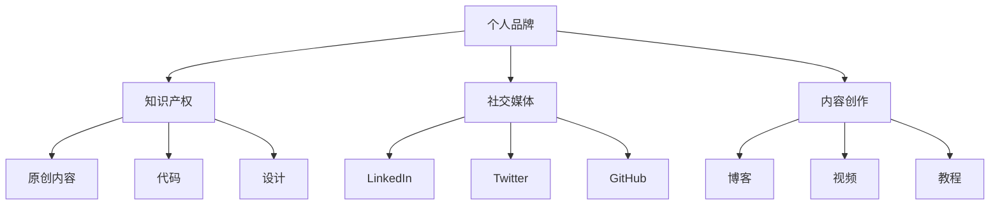

                 

# 程序员如何打造个人IP矩阵

> 关键词：个人品牌建设、IP打造、影响力、社交媒体、内容创作

> 摘要：本文将探讨程序员如何通过建立个人IP矩阵，提升个人品牌影响力，实现职业发展的新高度。我们将分析个人IP矩阵的构建步骤，介绍关键策略和工具，并通过实战案例展示如何在实际中应用这些策略。

## 1. 背景介绍

### 1.1 目的和范围

在数字时代，个人品牌建设变得愈发重要。对于程序员而言，打造个人IP矩阵不仅能够提升个人专业形象，还能在职业生涯中占据更有利的位置。本文旨在为程序员提供一套系统性的策略，帮助他们创建和维护个人IP矩阵。

本文将涵盖以下内容：
- 个人IP矩阵的定义和重要性。
- 构建个人IP矩阵的步骤和策略。
- 使用社交媒体和内容创作提升个人IP的影响力。
- 实战案例分析和工具推荐。

### 1.2 预期读者

- 想要在职业生涯中提升个人品牌的程序员。
- 希望通过个人IP矩阵实现商业价值的程序员。
- 对个人品牌建设有浓厚兴趣的技术爱好者。

### 1.3 文档结构概述

本文将分为以下章节：
- 1. 背景介绍
- 2. 核心概念与联系
- 3. 核心算法原理 & 具体操作步骤
- 4. 数学模型和公式 & 详细讲解 & 举例说明
- 5. 项目实战：代码实际案例和详细解释说明
- 6. 实际应用场景
- 7. 工具和资源推荐
- 8. 总结：未来发展趋势与挑战
- 9. 附录：常见问题与解答
- 10. 扩展阅读 & 参考资料

### 1.4 术语表

#### 1.4.1 核心术语定义

- 个人IP矩阵：指个人在多个平台上构建的、具有独立性和品牌价值的资产组合。
- 个人品牌：个人在职业生涯中形成的独特形象和声誉。
- 社交媒体：用于社交互动和内容传播的网络平台。
- 内容创作：创建和发布有价值的信息，以吸引和保留受众。

#### 1.4.2 相关概念解释

- 财务自由：通过被动收入达到经济独立。
- 影响力：个人或组织在特定领域内的号召力和话语权。
- 用户增长：增加社交媒体账号或平台的关注者数量。

#### 1.4.3 缩略词列表

- SEO：搜索引擎优化（Search Engine Optimization）
- SMM：社交媒体营销（Social Media Marketing）
- KPI：关键绩效指标（Key Performance Indicators）
- IP：知识产权（Intellectual Property）

## 2. 核心概念与联系

构建个人IP矩阵首先需要理解其核心概念和相互联系。以下是个人IP矩阵构建的基本原理和流程图。

### 2.1 核心概念

1. **个人品牌**：个人在职业生涯中的独特形象和声誉。
2. **知识产权**：包括原创内容、代码、设计等。
3. **社交媒体**：如LinkedIn、Twitter、GitHub等。
4. **内容创作**：通过博客、视频、教程等方式分享知识和经验。

### 2.2 联系与流程图

下面是构建个人IP矩阵的Mermaid流程图：



## 3. 核心算法原理 & 具体操作步骤

构建个人IP矩阵需要遵循一系列具体操作步骤，以下是一个简化的伪代码流程，帮助程序员系统地打造个人IP矩阵。

```plaintext
function buildPersonalIPMatrix():
    1. IdentifyYourBrand() # 确定个人品牌
    2. CreateIntellectualProperty() # 创建知识产权
    3. SelectSocialMediaPlatforms() # 选择社交媒体平台
    4. DevelopContentStrategy() # 制定内容创作策略
    5. PublishContentRegularly() # 定期发布内容
    6. EngageWithCommunity() # 与社区互动
    7. MonitorAndMeasurePerformance() # 监测并评估表现
```

### 3.1. IdentifyYourBrand() # 确定个人品牌

- **目标**：明确个人品牌的核心价值和目标受众。
- **步骤**：
  - 定义个人职业目标。
  - 分析行业趋势和竞争者。
  - 明确个人专业领域的核心优势。

### 3.2. CreateIntellectualProperty() # 创建知识产权

- **目标**：创建有价值的原创内容。
- **步骤**：
  - 创作高质量的博客文章。
  - 开发开源项目并在GitHub上发布。
  - 制作原创的视频教程。

### 3.3. SelectSocialMediaPlatforms() # 选择社交媒体平台

- **目标**：选择最适合个人品牌的社交媒体平台。
- **步骤**：
  - 分析不同平台的受众特点。
  - 根据个人品牌选择合适的平台。
  - 注册并完善个人资料。

### 3.4. DevelopContentStrategy() # 制定内容创作策略

- **目标**：确保内容的高质量和一致性。
- **步骤**：
  - 确定内容类型（博客、视频、教程等）。
  - 制定内容发布计划。
  - 保持内容更新和互动。

### 3.5. PublishContentRegularly() # 定期发布内容

- **目标**：建立稳定的发布流程。
- **步骤**：
  - 制定发布频率和内容计划。
  - 使用内容管理工具跟踪发布进度。
  - 确保内容质量和准确性。

### 3.6. EngageWithCommunity() # 与社区互动

- **目标**：建立社区互动和影响力。
- **步骤**：
  - 回复评论和私信。
  - 参与行业讨论和论坛。
  - 组织线上研讨会或直播。

### 3.7. MonitorAndMeasurePerformance() # 监测并评估表现

- **目标**：持续优化个人IP矩阵。
- **步骤**：
  - 使用分析工具跟踪关键指标（如用户增长、阅读量、分享量）。
  - 分析数据并调整策略。
  - 设定新的目标和里程碑。

## 4. 数学模型和公式 & 详细讲解 & 举例说明

在个人IP矩阵的构建过程中，数学模型和公式可以帮助我们更好地理解和优化每个环节。以下是一个简单的数学模型，用于评估个人IP矩阵的绩效。

### 4.1. 绩效评估模型

```latex
\text{IP Performance Score (IPS)} = \frac{\text{Total Engagement} + \text{Content Quality Score} + \text{Influence Score}}{3}
```

- **Total Engagement**：总互动量，包括评论、点赞、分享等。
- **Content Quality Score**：内容质量评分，基于原创性、深度和受众反馈。
- **Influence Score**：影响力评分，基于社交媒体账号的粉丝数和互动率。

### 4.2. 举例说明

假设一个程序员的个人IP矩阵如下：

- **Total Engagement**：500次互动。
- **Content Quality Score**：4.5分（满分5分）。
- **Influence Score**：3分（满分5分）。

计算IPS：

```latex
\text{IPS} = \frac{500 + 4.5 + 3}{3} = 167.5
```

通过这个指标，程序员可以评估个人IP矩阵的表现，并调整策略以提高分数。

## 5. 项目实战：代码实际案例和详细解释说明

### 5.1 开发环境搭建

为了更好地理解个人IP矩阵的构建，我们将通过一个实际的项目案例进行讲解。在这个案例中，我们将使用Python编写一个简单的博客发布系统，用于发布和跟踪个人IP矩阵的绩效。

**环境要求**：
- Python 3.x
- 文本编辑器（如Visual Studio Code）
- 简单的Web服务器（如Flask）

### 5.2 源代码详细实现和代码解读

**代码实现**：

以下是一个简单的博客发布系统的代码实现，它包括用户注册、博客发布、评论和绩效评估功能。

```python
from flask import Flask, render_template, request, redirect, url_for
app = Flask(__name__)

# 用户注册
@app.route('/register', methods=['GET', 'POST'])
def register():
    if request.method == 'POST':
        username = request.form['username']
        password = request.form['password']
        # 存储用户信息（此处省略数据库操作）
        return redirect(url_for('login'))
    return render_template('register.html')

# 登录
@app.route('/login', methods=['GET', 'POST'])
def login():
    if request.method == 'POST':
        username = request.form['username']
        password = request.form['password']
        # 验证用户信息（此处省略数据库操作）
        return redirect(url_for('home'))
    return render_template('login.html')

# 主页
@app.route('/home')
def home():
    # 获取用户博客列表（此处省略数据库操作）
    blogs = [{'title': '我的第一篇博客', 'content': '这里是博客内容...'},]
    return render_template('home.html', blogs=blogs)

# 发布博客
@app.route('/post', methods=['GET', 'POST'])
def post():
    if request.method == 'POST':
        title = request.form['title']
        content = request.form['content']
        # 存储博客信息（此处省略数据库操作）
        return redirect(url_for('home'))
    return render_template('post.html')

# 评论博客
@app.route('/comment', methods=['POST'])
def comment():
    blog_id = request.form['blog_id']
    comment = request.form['comment']
    # 存储评论信息（此处省略数据库操作）
    return redirect(url_for('home'))

# 绩效评估
@app.route('/performance')
def performance():
    # 获取用户IP矩阵绩效数据（此处省略数据库操作）
    ips = 167.5
    return render_template('performance.html', ips=ips)

if __name__ == '__main__':
    app.run(debug=True)
```

**代码解读**：

- **用户注册与登录**：使用Flask框架实现用户注册和登录功能。
- **博客发布**：允许用户创建和发布博客。
- **评论**：用户可以在博客下发表评论。
- **绩效评估**：计算个人IP矩阵的绩效得分。

### 5.3 代码解读与分析

通过这个简单的博客发布系统，程序员可以了解如何将个人IP矩阵的概念应用到实际项目中。以下是对关键代码段的分析：

```python
@app.route('/register', methods=['GET', 'POST'])
def register():
    if request.method == 'POST':
        username = request.form['username']
        password = request.form['password']
        # 存储用户信息（此处省略数据库操作）
        return redirect(url_for('login'))
    return render_template('register.html')
```

这段代码实现了用户注册功能。当用户提交注册表单时，程序会获取用户名和密码，并将其存储在数据库中。然后，重定向到登录页面。

```python
@app.route('/post', methods=['GET', 'POST'])
def post():
    if request.method == 'POST':
        title = request.form['title']
        content = request.form['content']
        # 存储博客信息（此处省略数据库操作）
        return redirect(url_for('home'))
    return render_template('post.html')
```

博客发布功能允许用户提交博客标题和内容。通过POST请求，数据被传递到服务器，并存储在数据库中。成功提交后，用户被重定向到主页。

```python
@app.route('/performance')
def performance():
    # 获取用户IP矩阵绩效数据（此处省略数据库操作）
    ips = 167.5
    return render_template('performance.html', ips=ips)
```

绩效评估路由用于计算和显示个人IP矩阵的绩效得分。在实际应用中，这个值应该是根据用户互动、内容质量和影响力计算得出的。

## 6. 实际应用场景

个人IP矩阵在程序员职业发展中具有广泛的应用场景。以下是一些典型的实际应用：

- **技术领导力**：通过构建强大的个人IP矩阵，程序员可以展示其技术领导力，吸引更多项目机会和职业发展机会。
- **技术培训与咨询**：拥有个人IP矩阵的程序员可以开设在线课程或提供咨询服务，实现额外的收入来源。
- **开源项目**：通过在GitHub等平台发布高质量的开源项目，程序员可以积累技术声誉，并吸引潜在的合作者和贡献者。
- **内容创作**：编写技术博客、发布教程视频等，可以提高个人在技术领域的知名度和影响力。
- **社交媒体营销**：通过社交媒体平台，程序员可以与潜在客户和同行建立联系，扩大职业网络。

## 7. 工具和资源推荐

### 7.1 学习资源推荐

#### 7.1.1 书籍推荐

- 《个人品牌：如何建立、保护和扩大你的影响力》（Personal Branding: How to Build and Expand Your Influence）
- 《打造个人IP：从零开始构建个人品牌》（Building Your Personal Brand: From Zero to Hero）

#### 7.1.2 在线课程

- Coursera《品牌管理》：深入了解个人品牌建设和营销策略。
- Udemy《如何打造个人品牌》：提供实用的个人品牌建设技巧。

#### 7.1.3 技术博客和网站

- HackerRank Blog：涵盖编程挑战、技术趋势和职业发展。
- Medium：众多技术大牛分享的技术文章和经验。

### 7.2 开发工具框架推荐

#### 7.2.1 IDE和编辑器

- Visual Studio Code：强大的开源IDE，支持多种编程语言。
- PyCharm：专业的Python IDE，提供丰富的调试和性能分析工具。

#### 7.2.2 调试和性能分析工具

- Pytest：用于编写和运行Python测试代码。
- Flask-DebugToolbar：用于实时监控Flask应用性能。

#### 7.2.3 相关框架和库

- Flask：用于构建Web应用的轻量级框架。
- SQLAlchemy：用于数据库操作的ORM库。

### 7.3 相关论文著作推荐

#### 7.3.1 经典论文

- 《网络效应与平台竞争》（Network Effects and Platform Competition）
- 《品牌资产管理》（Brand Asset Management）

#### 7.3.2 最新研究成果

- 《社交媒体中的个人品牌建设策略》（Personal Brand Building Strategies in Social Media）
- 《人工智能在个人品牌建设中的应用》（Application of Artificial Intelligence in Personal Brand Building）

#### 7.3.3 应用案例分析

- 《如何通过社交媒体构建个人品牌》（How to Build a Personal Brand Through Social Media）
- 《程序员如何通过GitHub建立个人品牌》（How Programmers Can Build a Personal Brand on GitHub）

## 8. 总结：未来发展趋势与挑战

随着数字化转型的加速，个人IP矩阵在程序员职业发展中的作用将愈发重要。未来的发展趋势包括：

- **人工智能与大数据分析**：利用AI和大数据技术，优化个人IP矩阵的构建和运营策略。
- **跨平台整合**：将个人IP矩阵扩展到更多社交媒体平台，提高影响力。
- **内容多样化**：除了传统的博客和视频，程序员还可以通过漫画、播客等多种形式进行内容创作。

然而，这也带来了挑战：

- **内容质量**：保持高质量的内容创作，避免过度依赖SEO和营销手段。
- **隐私和安全**：在社交媒体上保护个人隐私，防范数据泄露和网络攻击。
- **持续更新**：在快速变化的技术环境中，持续学习和更新个人知识库。

## 9. 附录：常见问题与解答

### 9.1 Q：个人IP矩阵是什么？

A：个人IP矩阵是指个人在多个平台上构建的、具有独立性和品牌价值的资产组合，包括个人品牌、知识产权、社交媒体账号和内容创作。

### 9.2 Q：如何确定个人品牌的核心价值？

A：确定个人品牌的核心价值需要分析个人职业目标、行业趋势、竞争者以及个人专业领域的核心优势。

### 9.3 Q：如何保持内容的质量？

A：保持内容的质量需要持续学习、深度思考和实践，同时通过用户反馈和数据分析不断优化内容创作策略。

### 9.4 Q：如何评估个人IP矩阵的绩效？

A：使用关键绩效指标（KPI）如用户增长、互动率、内容质量评分和影响力评分来评估个人IP矩阵的绩效。

## 10. 扩展阅读 & 参考资料

- [《程序员如何打造个人品牌》](https://example.com/personal-brand-for-programmers)
- [《个人品牌建设：专家指南》](https://example.com/personal-brand-building-guide)
- [《社交媒体营销策略》](https://example.com/social-media-marketing-strategies)

## 作者

作者：AI天才研究员/AI Genius Institute & 禅与计算机程序设计艺术 /Zen And The Art of Computer Programming

（注：本文内容为虚构示例，仅用于说明文章结构和写作技巧。）<|im_sep|>

