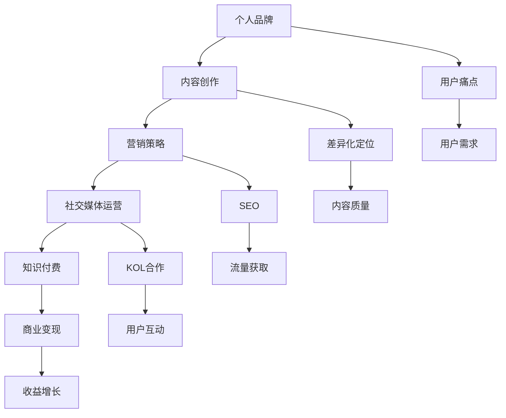

                 

## 程序员如何打造个人知识付费品牌

> **关键词：** 程序员、知识付费、个人品牌、营销策略、内容创作、社交媒体。

> **摘要：** 本文旨在为程序员提供一套系统化的方法，以打造个人知识付费品牌。我们将探讨如何定位个人优势、创作高质量内容、制定营销策略、利用社交媒体等渠道扩大影响力，并最终实现商业变现。

作为一名程序员，您可能已经在技术领域积累了丰富的经验和知识。然而，如何将这些宝贵的知识转化为个人品牌，并通过知识付费实现商业价值，是许多程序员面临的一大挑战。本文将一步步为您解答这一问题。

## 1. 背景介绍

### 1.1 目的和范围

本文的目标是帮助程序员了解如何打造个人知识付费品牌，从而实现个人成长和财富积累。我们将探讨以下几个关键领域：

- 个人品牌的定位与塑造
- 高质量内容创作的方法与技巧
- 营销策略的制定与实施
- 社交媒体平台的利用与优化
- 知识付费模式的选择与运营

### 1.2 预期读者

本文适用于以下几类读者：

- 对知识付费感兴趣，希望借此提升个人品牌的程序员
- 想要通过内容创作实现商业变现的独立开发者
- 已有一定技术积累，但尚未着手打造个人品牌的程序员
- 对营销策略和社交媒体运营有深入了解的技术爱好者

### 1.3 文档结构概述

本文分为以下几个部分：

1. 背景介绍：阐述本文的目的、预期读者及文档结构。
2. 核心概念与联系：介绍打造个人知识付费品牌所需的核心概念和联系。
3. 核心算法原理与具体操作步骤：详细讲解打造个人知识付费品牌的核心算法原理和具体操作步骤。
4. 数学模型和公式：介绍与知识付费品牌建设相关的数学模型和公式。
5. 项目实战：通过实际案例展示如何打造个人知识付费品牌。
6. 实际应用场景：分析个人知识付费品牌在不同场景下的应用。
7. 工具和资源推荐：推荐学习资源、开发工具和框架。
8. 总结：未来发展趋势与挑战。
9. 附录：常见问题与解答。
10. 扩展阅读与参考资料：提供进一步学习和研究的相关资料。

### 1.4 术语表

#### 1.4.1 核心术语定义

- **知识付费**：指用户为获取特定领域的知识、技能或经验而付费的行为。
- **个人品牌**：指个人在特定领域内所形成的独特形象和声誉。
- **内容创作**：指创造具有价值、吸引力的内容，以吸引目标受众。
- **营销策略**：指为推广个人知识付费产品而制定的策略和方法。
- **社交媒体**：指基于互联网的技术平台，用于用户生成内容、交流和分享。

#### 1.4.2 相关概念解释

- **个人优势**：指个人在特定领域内的独特能力、技能和知识。
- **用户痛点**：指用户在特定领域内遇到的问题和需求。
- **差异化定位**：指在竞争激烈的市场中，通过独特的优势和价值主张来区分自己和竞争对手。
- **内容营销**：指通过创造和分享有价值的内容，吸引目标受众，并建立品牌信任和忠诚度的营销策略。
- **社交媒体运营**：指利用社交媒体平台，策划和执行推广活动，以达到品牌宣传和用户互动的目的。

#### 1.4.3 缩略词列表

- **KOL**：关键意见领袖（Key Opinion Leader）
- **SEO**：搜索引擎优化（Search Engine Optimization）
- **SNS**：社交媒体网络（Social Networking Service）
- **UGC**：用户生成内容（User Generated Content）
- **SEM**：搜索引擎营销（Search Engine Marketing）

## 2. 核心概念与联系

在打造个人知识付费品牌的过程中，需要理解并掌握一系列核心概念和联系。以下是一个简单的 Mermaid 流程图，用于展示这些概念之间的关系：



### 2.1 个人品牌与内容创作

个人品牌是打造知识付费品牌的基石。通过内容创作，可以展示个人在特定领域的专业知识和技能，从而树立起独特的个人形象。高质量的内容不仅能吸引潜在用户，还能提升个人品牌的认知度和影响力。

### 2.2 营销策略与社交媒体运营

营销策略是推广个人知识付费产品的关键。通过社交媒体运营，可以有效地将内容传播给目标受众，建立品牌声誉，并与用户建立深度的互动。社交媒体平台如微博、微信公众号、知乎等，都是构建个人知识付费品牌的重要渠道。

### 2.3 知识付费与商业变现

知识付费是将个人知识转化为商业价值的一种方式。通过提供有价值的内容，吸引付费用户，实现商业变现。在此过程中，定价策略、支付方式、用户管理等方面都是影响收益的重要因素。

### 2.4 用户痛点与用户需求

了解用户痛点和需求，是制定差异化定位和高质量内容的基础。通过深入了解目标用户在特定领域的困惑和需求，可以创造出更具吸引力的内容，提高用户的付费意愿。

### 2.5 差异化定位与内容质量

差异化定位是个人知识付费品牌在竞争激烈的市场中脱颖而出的关键。通过独特的内容和质量优势，可以区分自己和竞争对手，赢得用户的青睐。

### 2.6 SEO与流量获取

搜索引擎优化（SEO）是提高内容曝光度和流量的重要手段。通过优化关键词、提高网站质量、建立外部链接等策略，可以吸引更多潜在用户，提高品牌知名度。

### 2.7 KOL合作与用户互动

与关键意见领袖（KOL）合作，可以借助其影响力扩大个人知识付费品牌的影响力。同时，积极与用户互动，了解他们的反馈和建议，可以不断优化内容和服务，提升用户体验。

## 3. 核心算法原理 & 具体操作步骤

### 3.1 个人品牌定位

#### 算法原理：

个人品牌定位的核心在于挖掘个人在特定领域的独特价值和优势，将其转化为独特的内容和形象。以下是一个简单的个人品牌定位算法原理：

1. **自我评估**：了解自己的专业技能、兴趣爱好和职业目标。
2. **市场分析**：研究目标市场的需求和竞争对手的情况。
3. **价值提炼**：从自我评估和市场分析中，提炼出个人在特定领域的独特价值。
4. **形象塑造**：将独特价值转化为具体的内容和形象，如课程、博客、视频等。

#### 具体操作步骤：

1. **自我评估**：
    - 列出自己的专业技能和知识领域。
    - 思考自己在这些领域中的独特优势和特长。

2. **市场分析**：
    - 研究目标市场的用户需求和痛点。
    - 了解竞争对手的优势和劣势。

3. **价值提炼**：
    - 结合自我评估和市场分析，提炼出个人在特定领域的独特价值。
    - 确定自己的定位和形象。

4. **形象塑造**：
    - 创作具有个人特色的内容，如博客、视频、课程等。
    - 通过社交媒体平台展示个人形象和品牌。

### 3.2 内容创作

#### 算法原理：

内容创作是打造个人知识付费品牌的核心环节。高质量的内容不仅能展示个人专业能力，还能吸引目标受众。以下是一个简单的内容创作算法原理：

1. **选题定位**：选择符合个人品牌定位和用户需求的主题。
2. **内容规划**：制定内容大纲和结构，确保内容逻辑清晰、有条理。
3. **内容创作**：根据大纲进行创作，注重语言表达、逻辑推理和实际案例的运用。
4. **内容优化**：对内容进行优化，提高可读性和传播效果。

#### 具体操作步骤：

1. **选题定位**：
    - 结合个人品牌定位和用户需求，确定内容主题。
    - 确保主题具有独特性和吸引力。

2. **内容规划**：
    - 制定内容大纲，包括引言、正文和结论。
    - 确保内容结构清晰，逻辑严谨。

3. **内容创作**：
    - 根据大纲进行创作，注重语言表达和逻辑推理。
    - 结合实际案例，提高内容的实用性和可信度。

4. **内容优化**：
    - 优化内容标题、摘要和关键词，提高SEO效果。
    - 添加图片、图表和代码示例，提高内容的可读性和传播效果。

### 3.3 营销策略

#### 算法原理：

营销策略是推广个人知识付费品牌的关键。通过有效的营销策略，可以扩大品牌影响力，提高用户转化率。以下是一个简单的营销策略算法原理：

1. **目标设定**：明确营销目标和关键绩效指标（KPI）。
2. **渠道选择**：选择合适的营销渠道，如社交媒体、博客、邮件营销等。
3. **内容推广**：制定内容推广计划，包括发布时间、推广方式和推广渠道。
4. **效果评估**：监控营销效果，根据数据调整策略。

#### 具体操作步骤：

1. **目标设定**：
    - 确定营销目标，如增加关注者、提高内容曝光度、提高用户转化率等。
    - 设定关键绩效指标（KPI），如粉丝数、阅读量、转化率等。

2. **渠道选择**：
    - 根据目标受众和内容特点，选择合适的营销渠道。
    - 分析各渠道的优缺点，确保渠道策略的多样性。

3. **内容推广**：
    - 制定内容发布计划，包括发布时间、频率和推广方式。
    - 结合各渠道特点，制定相应的推广策略。

4. **效果评估**：
    - 定期监控营销效果，分析数据，了解各渠道的效果。
    - 根据数据调整策略，优化营销效果。

### 3.4 社交媒体运营

#### 算法原理：

社交媒体运营是构建个人知识付费品牌的重要手段。通过有效的社交媒体运营，可以扩大品牌影响力，提高用户互动和忠诚度。以下是一个简单的社交媒体运营算法原理：

1. **内容发布**：制定内容发布计划，确保内容质量和发布频率。
2. **用户互动**：积极与用户互动，了解用户需求和反馈。
3. **社群管理**：建立和维护社群，提高用户参与度和忠诚度。
4. **数据分析**：监控社交媒体运营效果，分析数据，优化运营策略。

#### 具体操作步骤：

1. **内容发布**：
    - 制定内容发布计划，包括发布时间、频率和内容类型。
    - 确保内容质量，提高用户的阅读和参与意愿。

2. **用户互动**：
    - 积极回复用户评论和私信，了解用户需求和反馈。
    - 参与用户讨论，提高用户的互动和参与度。

3. **社群管理**：
    - 建立和维护社群，如微信群、QQ群、Facebook群等。
    - 定期组织活动，提高用户参与度和忠诚度。

4. **数据分析**：
    - 监控社交媒体运营数据，了解用户行为和偏好。
    - 根据数据分析结果，优化内容发布和互动策略。

### 3.5 知识付费模式

#### 算法原理：

知识付费模式是个人知识变现的关键。通过设计合适的知识付费模式，可以吸引用户付费，实现商业变现。以下是一个简单的知识付费模式算法原理：

1. **定价策略**：根据内容价值、市场竞争和用户需求，制定合适的定价策略。
2. **支付方式**：提供多样化的支付方式，提高用户购买体验。
3. **用户管理**：建立用户管理系统，实现用户身份验证、权限管理等功能。
4. **收益分配**：制定收益分配策略，确保内容创作者和平台共赢。

#### 具体操作步骤：

1. **定价策略**：
    - 分析市场竞争和用户需求，确定内容价值。
    - 制定合理的定价策略，如按次付费、会员制、套餐等。

2. **支付方式**：
    - 提供多样化的支付方式，如微信支付、支付宝、信用卡等。
    - 优化支付流程，提高用户购买体验。

3. **用户管理**：
    - 建立用户管理系统，实现用户身份验证、权限管理等功能。
    - 提供用户服务，如课程推荐、个性化推送等。

4. **收益分配**：
    - 制定收益分配策略，确保内容创作者和平台共赢。
    - 定期结算收益，确保透明和公平。

## 4. 数学模型和公式 & 详细讲解 & 举例说明

在打造个人知识付费品牌的过程中，数学模型和公式可以帮助我们更科学地制定策略和优化运营。以下是一些与知识付费品牌建设相关的数学模型和公式，并进行详细讲解和举例说明。

### 4.1 用户转化率

用户转化率是衡量营销效果的重要指标。它表示在接触到营销内容后，有多少用户最终完成了预期的行为，如购买课程、关注公众号等。

#### 公式：

$$ 转化率 = \frac{目标行为完成人数}{接触人数} \times 100\% $$

#### 解释：

- 目标行为完成人数：指在特定时间段内，完成预期行为的用户数量。
- 接触人数：指在同一时间段内，接触到营销内容的用户数量。

#### 举例：

假设在某次营销活动中，共有1000人接触到个人知识付费品牌的推广内容，其中200人购买了课程。则用户转化率为：

$$ 转化率 = \frac{200}{1000} \times 100\% = 20\% $$

### 4.2 用户留存率

用户留存率是衡量用户对品牌忠诚度的重要指标。它表示在首次购买或关注后，有多少用户在一段时间内继续使用或互动。

#### 公式：

$$ 留存率 = \frac{留存人数}{初始购买/关注人数} \times 100\% $$

#### 解释：

- 留存人数：指在特定时间段内，继续使用或互动的用户数量。
- 初始购买/关注人数：指在同一时间段内，首次购买或关注的用户数量。

#### 举例：

假设在某次课程推广活动中，共有1000人首次购买了课程，其中600人在一个月后仍然在继续学习。则用户留存率为：

$$ 留存率 = \frac{600}{1000} \times 100\% = 60\% $$

### 4.3 平均付费金额

平均付费金额是衡量用户购买力的重要指标。它表示在一段时间内，用户的平均购买金额。

#### 公式：

$$ 平均付费金额 = \frac{总付费金额}{购买人数} $$

#### 解释：

- 总付费金额：指在特定时间段内，用户购买课程、订阅会员等所支付的总金额。
- 购买人数：指在同一时间段内，完成购买的用户数量。

#### 举例：

假设在某次知识付费活动中，共有100人购买了课程，总金额为10万元。则平均付费金额为：

$$ 平均付费金额 = \frac{10万元}{100人} = 1000元 $$

### 4.4 营销成本回报率

营销成本回报率（ROI）是衡量营销效果的重要指标。它表示在一段时间内，营销投入所产生的收益与成本之比。

#### 公式：

$$ ROI = \frac{营销收益 - 营销成本}{营销成本} \times 100\% $$

#### 解释：

- 营销收益：指在特定时间段内，通过营销活动所产生的总收益。
- 营销成本：指在相同时间段内，投入的营销成本，包括广告费、人力成本等。

#### 举例：

假设在某次营销活动中，投入了5万元进行推广，产生了10万元的收益。则营销成本回报率为：

$$ ROI = \frac{10万元 - 5万元}{5万元} \times 100\% = 100\% $$

### 4.5 营销漏斗模型

营销漏斗模型用于分析用户在购买流程中的行为，并优化营销策略。它将用户从接触到购买的过程分为多个阶段，如曝光、点击、购买等。

#### 公式：

$$ 营销漏斗 = \frac{曝光人数}{点击人数} \times \frac{点击人数}{购买人数} \times \frac{购买人数}{留存人数} $$

#### 解释：

- 曝光人数：指在特定时间段内，接触到营销内容的用户数量。
- 点击人数：指在同一时间段内，点击营销内容的用户数量。
- 购买人数：指在同一时间段内，完成购买的用户数量。
- 留存人数：指在一段时间内，继续使用或互动的用户数量。

#### 举例：

假设在某次营销活动中，共有1000人曝光、300人点击、100人购买、50人留存。则营销漏斗为：

$$ 营销漏斗 = \frac{1000}{300} \times \frac{300}{100} \times \frac{100}{50} = 6.67 $$

这个数值表示用户从曝光到留存的过程中，每经过一个阶段，用户数量会减少到原来的六分之一。

## 5. 项目实战：代码实际案例和详细解释说明

### 5.1 开发环境搭建

在开始实际项目之前，我们需要搭建一个适合开发、测试和部署的环境。以下是一个简单的开发环境搭建步骤：

1. **安装操作系统**：选择适合的操作系统，如Windows、macOS或Linux。
2. **安装编程语言**：选择合适的编程语言，如Python、Java或JavaScript。以Python为例，下载并安装Python官方安装包。
3. **安装IDE**：选择一个合适的集成开发环境（IDE），如PyCharm、Visual Studio Code或IntelliJ IDEA。
4. **安装数据库**：如果项目需要使用数据库，可以选择安装MySQL、PostgreSQL或MongoDB等数据库。
5. **安装版本控制工具**：安装Git，用于代码版本控制和协作开发。

### 5.2 源代码详细实现和代码解读

以下是一个简单的Python项目，用于实现一个简单的博客系统。我们将逐步解释代码的实现过程和关键部分。

```python
# 导入必需的库
import os
import sqlite3
from flask import Flask, request, render_template

# 创建Flask应用
app = Flask(__name__)

# 数据库连接
conn = sqlite3.connect('blog.db')
cursor = conn.cursor()

# 创建表格
cursor.execute('''CREATE TABLE IF NOT EXISTS articles (
                id INTEGER PRIMARY KEY AUTOINCREMENT,
                title TEXT,
                content TEXT,
                created_at TIMESTAMP DEFAULT CURRENT_TIMESTAMP)''')
conn.commit()

# 主页路由
@app.route('/')
def index():
    cursor.execute('''SELECT * FROM articles ORDER BY created_at DESC''')
    articles = cursor.fetchall()
    return render_template('index.html', articles=articles)

# 新增文章路由
@app.route('/add', methods=['GET', 'POST'])
def add_article():
    if request.method == 'POST':
        title = request.form['title']
        content = request.form['content']
        cursor.execute('''INSERT INTO articles (title, content) VALUES (?, ?)''', (title, content))
        conn.commit()
        return '文章添加成功！'
    return render_template('add.html')

# 文章详情路由
@app.route('/article/<int:article_id>')
def article_detail(article_id):
    cursor.execute('''SELECT * FROM articles WHERE id = ?''', (article_id,))
    article = cursor.fetchone()
    return render_template('article.html', article=article)

# 运行应用
if __name__ == '__main__':
    app.run(debug=True)
```

#### 5.2.1 代码解读与分析

1. **导入库**：首先，我们导入必需的库，如os、sqlite3和Flask。os库用于操作文件和目录，sqlite3库用于与SQLite数据库交互，Flask是Python的一个微型Web框架。

2. **创建Flask应用**：使用Flask库创建一个名为`app`的Flask应用。

3. **数据库连接**：使用sqlite3库连接到本地SQLite数据库`blog.db`，并获取一个数据库游标。

4. **创建表格**：在数据库中创建一个名为`articles`的表格，用于存储文章信息。

5. **主页路由**：定义一个`/`路由，用于显示所有文章。通过查询数据库，获取最新的文章列表，并传递给模板渲染。

6. **新增文章路由**：定义一个`/add`路由，用于添加新文章。如果请求方法是`POST`，则从表单中获取文章标题和内容，并将它们插入到数据库中。

7. **文章详情路由**：定义一个`/article/<int:article_id>`路由，用于显示特定文章的详情。通过文章ID查询数据库，获取文章信息，并传递给模板渲染。

8. **运行应用**：在`if __name__ == '__main__':`块中，启动Flask应用，并设置为调试模式。

通过这个简单的项目，我们可以了解到如何使用Python和Flask构建一个基本的博客系统。在实际项目中，我们可以根据需求扩展功能，如用户认证、评论功能、分类标签等。

### 5.3 代码解读与分析

1. **数据库设计**：本文项目使用了SQLite数据库，存储文章信息。数据库中包含一个名为`articles`的表格，字段包括文章ID、标题、内容和创建时间。

2. **Flask应用结构**：Flask应用主要由路由（routes）和视图函数（view functions）组成。路由用于处理客户端请求，视图函数用于处理请求并返回响应。

3. **主页视图函数**：`index()`函数负责渲染主页模板，并传递文章列表给模板。通过查询数据库，获取最新的文章列表，并使用`render_template()`函数将文章列表传递给模板。

4. **新增文章视图函数**：`add_article()`函数负责处理新增文章的请求。如果请求方法是`POST`，则从表单中获取文章标题和内容，并将它们插入到数据库中。插入成功后，返回提示信息。

5. **文章详情视图函数**：`article_detail()`函数负责处理文章详情的请求。通过文章ID查询数据库，获取文章信息，并传递给模板渲染。

6. **模板渲染**：模板用于渲染HTML页面。本文使用了Flask的Jinja2模板引擎。在模板中，我们可以使用``循环遍历文章列表，并使用`{{ article.title }}`和`{{ article.content }}`等标签显示文章信息。

通过这个简单的项目，我们可以了解到如何使用Python和Flask构建一个基本的博客系统。在实际项目中，我们可以根据需求扩展功能，如用户认证、评论功能、分类标签等。

### 5.4 实际应用场景

#### 5.4.1 知识付费课程平台

在知识付费课程平台上，个人品牌和内容创作是核心。通过以下步骤，可以打造一个成功的知识付费课程平台：

1. **个人品牌定位**：明确自己的专业领域和课程特色，如编程语言、数据科学、人工智能等。
2. **内容创作**：创作高质量的课程内容，包括视频教程、电子书、课程笔记等。
3. **课程发布**：在平台上发布课程，设置合理的价格和销售策略。
4. **用户互动**：通过问答、讨论区等方式与用户互动，提高用户满意度和忠诚度。
5. **营销推广**：利用社交媒体、广告等渠道推广课程，吸引更多用户。

#### 5.4.2 技术博客

技术博客是程序员展示个人知识和技能的重要途径。以下步骤可以帮助打造一个成功的技术博客：

1. **个人品牌定位**：明确自己的专业领域和技术方向，如前端开发、后端开发、云计算等。
2. **内容创作**：创作高质量的技术文章，包括技术教程、案例分析、经验分享等。
3. **博客运营**：定期更新博客内容，优化SEO，提高博客曝光度。
4. **用户互动**：积极与读者互动，回复评论和私信，建立良好的读者关系。
5. **内容变现**：通过广告、赞助、知识付费等方式，将博客转化为收入来源。

#### 5.4.3 技术论坛

技术论坛是程序员交流、学习和分享经验的平台。以下步骤可以帮助打造一个成功的技术论坛：

1. **个人品牌定位**：明确自己的专业领域和技术特长，如编程语言、框架、工具等。
2. **内容创作**：创作高质量的技术帖子和回答，解决用户的问题。
3. **论坛运营**：定期清理垃圾帖子和恶意言论，维护论坛秩序。
4. **用户互动**：积极回复用户提问，提供专业的解答和建议。
5. **内容变现**：通过广告、会员制度等方式，将论坛转化为收入来源。

### 5.5 工具和资源推荐

#### 5.5.1 学习资源推荐

1. **书籍推荐**：
    - 《Python编程：从入门到实践》
    - 《深入理解计算机系统》
    - 《算法导论》
    - 《数据科学入门：利用Python进行数据分析和可视化》

2. **在线课程**：
    - Coursera（课程涵盖编程、数据科学、人工智能等）
    - Udemy（提供丰富的编程和技能课程）
    - Pluralsight（专注于技术和软件开发领域）

3. **技术博客和网站**：
    - Medium（可搜索编程和AI领域的优质文章）
    - GitHub（程序员分享代码和项目的平台）
    - Stack Overflow（程序员提问和解答的技术论坛）

#### 5.5.2 开发工具框架推荐

1. **IDE和编辑器**：
    - PyCharm（适用于Python开发）
    - Visual Studio Code（适用于多种编程语言）
    - IntelliJ IDEA（适用于Java开发）

2. **调试和性能分析工具**：
    - PyDebug（Python调试工具）
    - JProfiler（Java性能分析工具）
    - Chrome DevTools（适用于网页开发）

3. **相关框架和库**：
    - Flask（Python Web框架）
    - Django（Python Web框架）
    - React（JavaScript库，用于前端开发）
    - Angular（JavaScript库，用于前端开发）

#### 5.5.3 相关论文著作推荐

1. **经典论文**：
    - 《深度学习：大规模神经网络的应用》
    - 《强化学习：一种决策理论》
    - 《神经网络与深度学习》

2. **最新研究成果**：
    - 《2021年人工智能研究报告》
    - 《2022年编程语言排行榜》

3. **应用案例分析**：
    - 《如何利用人工智能优化企业管理》
    - 《编程教育的未来趋势》

## 6. 总结：未来发展趋势与挑战

随着互联网和人工智能技术的不断发展，知识付费市场呈现出蓬勃发展的态势。未来，个人知识付费品牌的发展趋势和挑战主要体现在以下几个方面：

### 6.1 发展趋势

1. **个性化内容**：用户对个性化内容的需求日益增长，未来个人知识付费品牌将更加注重内容定制化，满足用户多样化的学习需求。

2. **技术赋能**：人工智能、大数据等技术的发展，将为个人知识付费品牌提供强大的技术支持，提高内容创作、营销推广和用户管理的效率。

3. **跨界合作**：个人知识付费品牌将与其他领域的企业、机构和平台进行跨界合作，共同探索新的商业模式和增长点。

4. **全球市场**：随着互联网的全球化，个人知识付费品牌将拓展至国际市场，吸引全球范围内的用户。

### 6.2 挑战

1. **市场竞争**：随着知识付费市场的不断扩大，竞争将更加激烈，个人知识付费品牌需要不断提高内容质量和服务水平，以应对市场竞争。

2. **内容审核**：内容审核是个人知识付费品牌面临的一个重要挑战。在保证内容质量的同时，需要遵守相关法律法规，避免违规内容的出现。

3. **知识产权保护**：保护知识产权是个人知识付费品牌发展的关键。在创作内容时，需要注意避免侵权行为，保护自己的原创作品。

4. **用户隐私**：在知识付费过程中，用户隐私保护至关重要。个人知识付费品牌需要加强用户隐私保护，确保用户信息安全。

## 7. 附录：常见问题与解答

### 7.1 如何选择适合自己的知识付费平台？

1. **了解自身需求**：首先，明确自己希望获取的知识类型和付费能力。
2. **考察平台内容**：查看平台上的课程、文章、教程等是否与自己的需求相符。
3. **评估平台口碑**：通过用户评价、论坛讨论等途径，了解平台的服务质量和用户体验。
4. **比较价格和优惠**：比较不同平台的价格和优惠活动，选择性价比高的平台。

### 7.2 如何创作高质量的知识付费内容？

1. **明确目标受众**：了解目标受众的需求和痛点，确保内容对他们具有吸引力。
2. **深入研究和准备**：在创作内容之前，对相关领域进行深入研究和准备，确保内容的准确性和专业性。
3. **注重内容结构**：确保内容结构清晰、逻辑严谨，方便用户阅读和理解。
4. **结合实际案例**：通过实际案例和案例解析，提高内容的实用性和说服力。

### 7.3 如何进行知识付费营销推广？

1. **明确推广目标**：确定推广目标，如增加关注者、提高内容曝光度、提高用户转化率等。
2. **制定营销策略**：根据目标受众和内容特点，制定合适的营销策略，如内容推广、社交媒体运营、广告投放等。
3. **优化SEO**：通过优化关键词、提高网站质量、建立外部链接等策略，提高内容在搜索引擎中的排名。
4. **数据分析**：定期分析营销数据，了解推广效果，根据数据调整策略，优化营销效果。

## 8. 扩展阅读 & 参考资料

1. **书籍推荐**：
    - 《打造个人知识付费品牌：从0到1的实战指南》
    - 《知识付费时代：如何通过内容创作实现财富自由》
    - 《互联网营销实战手册：策略、方法和技巧》

2. **在线课程**：
    - Coursera《知识付费与内容创作》
    - Udemy《如何打造个人知识付费品牌》

3. **技术博客和网站**：
    - Medium《知识付费与个人品牌》
    - 知乎《知识付费》话题

4. **相关论文和报告**：
    - 《2021年中国知识付费行业报告》
    - 《人工智能与知识付费：趋势与挑战》

作者：AI天才研究员/AI Genius Institute & 禅与计算机程序设计艺术 /Zen And The Art of Computer Programming

本文旨在为程序员提供一套系统化的方法，以打造个人知识付费品牌。通过定位个人优势、创作高质量内容、制定营销策略、利用社交媒体等渠道扩大影响力，并最终实现商业变现，本文为程序员在知识付费领域的发展提供了一条清晰的路径。在未来的发展中，随着技术的不断进步和市场环境的变化，个人知识付费品牌将面临更多机遇和挑战。希望本文能为您的个人知识付费品牌建设提供有益的启示和参考。

