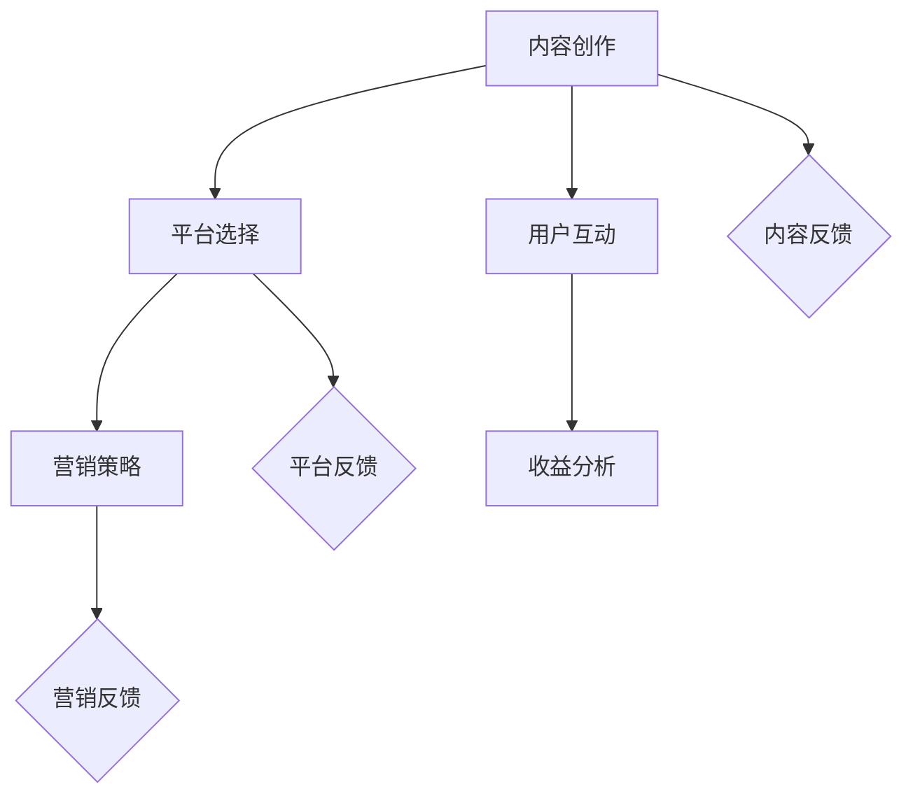

                 

# 程序员如何打造知识付费的专栏

> **关键词：** 知识付费，专栏，内容创作，平台选择，营销策略，用户互动，收益分析

> **摘要：** 本文将引导程序员们如何打造一个知识付费的专栏，从选题策划、内容创作、平台选择、营销推广、用户互动到收益分析，提供全面而实用的指导。文章旨在帮助程序员们利用自己的专业知识和技能，通过知识付费平台，实现知识变现，同时提升个人品牌影响力。

## 1. 背景介绍

### 1.1 目的和范围

本文的目的是为程序员提供一套系统化的知识付费专栏打造指南。我们将探讨如何选择合适的话题，如何撰写高质量的内容，如何选择适合的平台，以及如何通过有效的营销策略和用户互动，来实现知识的传播和变现。

### 1.2 预期读者

预期读者包括有志于通过知识付费平台分享知识和技能的程序员，以及对知识付费行业感兴趣的从业者。

### 1.3 文档结构概述

本文分为十个部分：

1. 背景介绍
2. 核心概念与联系
3. 核心算法原理 & 具体操作步骤
4. 数学模型和公式 & 详细讲解 & 举例说明
5. 项目实战：代码实际案例和详细解释说明
6. 实际应用场景
7. 工具和资源推荐
8. 总结：未来发展趋势与挑战
9. 附录：常见问题与解答
10. 扩展阅读 & 参考资料

### 1.4 术语表

#### 1.4.1 核心术语定义

- 知识付费：用户为获取特定知识或技能而付费的行为。
- 专栏：在知识付费平台上，由一个内容创作者发布的系列化、持续更新的内容。
- 内容创作：生产、编写、制作内容的过程。
- 平台选择：根据个人需求和目标，选择合适的知识付费平台。
- 营销策略：通过各种手段，提高专栏知名度，吸引潜在用户。
- 用户互动：创作者与用户之间的互动，包括评论、问答、投票等。

#### 1.4.2 相关概念解释

- **知识变现**：将个人知识和技能转化为经济收益的过程。
- **个人品牌**：个人在特定领域的专业形象和声誉。

#### 1.4.3 缩略词列表

- KFC：知识付费
- UP：内容创作者
- MC：营销策略

## 2. 核心概念与联系

在打造知识付费专栏的过程中，我们需要理解以下几个核心概念及其相互关系：

1. **内容创作**：专栏的核心是内容。内容质量直接影响专栏的受欢迎程度和用户的忠诚度。因此，内容创作是知识付费专栏成功的关键。

2. **平台选择**：选择一个合适的平台，可以极大地影响专栏的曝光率和用户数量。不同的平台有不同的特点和用户群体，需要根据个人需求和目标进行选择。

3. **营销策略**：有效的营销策略能够提高专栏的知名度，吸引更多的潜在用户。常见的营销策略包括社交媒体推广、SEO优化、合作推广等。

4. **用户互动**：与用户的互动是提升专栏质量的重要途径。通过用户的反馈，可以不断优化内容，提高用户体验。

5. **收益分析**：通过分析收益数据，可以了解专栏的运营效果，为后续的内容创作和营销策略提供依据。

以下是一个简化的Mermaid流程图，展示了这些核心概念之间的联系：



## 3. 核心算法原理 & 具体操作步骤

### 3.1 内容创作算法原理

内容创作是知识付费专栏的核心，其算法原理可以概括为以下几点：

1. **选题精准**：选择用户感兴趣、市场需求大的主题。
2. **内容结构**：合理组织内容结构，确保条理清晰。
3. **内容质量**：保证内容的深度、广度和准确性。
4. **持续更新**：定期更新内容，保持用户的持续关注。

### 3.2 内容创作具体操作步骤

1. **选题**：

   - 调研市场需求，通过数据分析、用户反馈等方式，确定热门主题。
   - 确保选题符合个人专长和兴趣，以提高创作积极性。

2. **结构规划**：

   - 制定大纲，明确内容模块和逻辑关系。
   - 使用图表、代码示例等辅助工具，提高内容的可读性和易懂性。

3. **内容编写**：

   - 保持逻辑清晰，避免冗余和重复。
   - 使用简洁明了的语言，避免过于专业化的术语。

4. **内容优化**：

   - 校对、编辑，确保内容无误。
   - 调整格式，优化排版，提高视觉效果。

5. **持续更新**：

   - 制定更新计划，确保内容的持续性和连贯性。
   - 根据用户反馈，及时调整和优化内容。

### 3.3 伪代码示例

以下是一个简单的伪代码示例，用于描述内容创作的具体步骤：

```plaintext
function contentCreation(主题，结构，内容质量，更新频率) {
    // 步骤1：选题
    主题 = selectTopicFromMarketResearch()

    // 步骤2：结构规划
    结构 = planContentStructure()

    // 步骤3：内容编写
    内容质量 = writeContentWithClearLogic()

    // 步骤4：内容优化
    内容质量 = optimizeContentForReadability()

    // 步骤5：持续更新
    while (true) {
        更新频率 = updateContentRegularly()
        内容质量 = checkAndUpdateContentQuality()
    }
}
```

## 4. 数学模型和公式 & 详细讲解 & 举例说明

### 4.1 数学模型

在知识付费专栏的运营过程中，我们可以使用一些数学模型来分析收益和用户行为。以下是一个简化的收益分析模型：

$$
收益 = 订阅量 \times 订阅价格 - 成本
$$

其中，订阅量和订阅价格可以通过市场调研和用户反馈来估算，成本包括内容创作成本、平台使用费用等。

### 4.2 详细讲解

1. **订阅量**：订阅量是收益分析的关键指标。我们可以通过以下公式来估算订阅量：

$$
订阅量 = 用户数 \times 订阅转化率
$$

其中，用户数可以通过平台统计获取，订阅转化率则依赖于内容的吸引力和平台的推广效果。

2. **订阅价格**：订阅价格通常取决于内容的价值和市场定位。我们可以使用以下公式来估算订阅价格：

$$
订阅价格 = 内容价值 \times 市场价格
$$

其中，内容价值可以通过用户反馈和市场调研来评估，市场价格则取决于同类型内容的价格水平。

3. **成本**：成本包括内容创作成本、平台使用费用、营销推广费用等。我们可以使用以下公式来估算成本：

$$
成本 = 内容创作成本 + 平台使用费用 + 营销推广费用
$$

### 4.3 举例说明

假设一个知识付费专栏的订阅价格为100元/年，用户数为1000人，订阅转化率为10%，内容创作成本为5000元/年，平台使用费用为2000元/年，营销推广费用为3000元/年。根据上述公式，我们可以计算出该专栏的年度收益如下：

$$
收益 = 1000 \times 10\% \times 100 - (5000 + 2000 + 3000) = 8000 - 10000 = -2000
$$

这意味着该专栏在第一年运营中可能会出现亏损。为了改善这一情况，我们可以考虑提高订阅价格、增加用户数、降低成本等方法。

## 5. 项目实战：代码实际案例和详细解释说明

### 5.1 开发环境搭建

在本项目实战中，我们将使用Python作为主要编程语言，结合Jupyter Notebook进行内容创作和演示。以下是搭建开发环境的基本步骤：

1. 安装Python：从官方网站（https://www.python.org/downloads/）下载并安装Python，选择最新版本。
2. 安装Jupyter Notebook：在命令行中执行以下命令安装Jupyter Notebook：
   ```shell
   pip install notebook
   ```
3. 启动Jupyter Notebook：在命令行中执行以下命令启动Jupyter Notebook：
   ```shell
   jupyter notebook
   ```
4. 配置必要库：在Jupyter Notebook中，创建一个新的笔记本，并安装必要的库，如NumPy、Pandas等：
   ```python
   !pip install numpy pandas matplotlib
   ```

### 5.2 源代码详细实现和代码解读

以下是一个简单的Python示例，用于演示如何使用NumPy库进行数据分析和可视化：

```python
import numpy as np
import pandas as pd
import matplotlib.pyplot as plt

# 示例数据
data = np.array([1, 2, 3, 4, 5, 6, 7, 8, 9, 10])

# 数据分析
mean = np.mean(data)
median = np.median(data)
std_dev = np.std(data)

# 数据可视化
plt.figure(figsize=(10, 5))

# 直方图
plt.hist(data, bins=10, alpha=0.5, label='Histogram')

# 直线图
plt.plot(data, 'ro', label='Mean: {:.2f}, Median: {:.2f}, STD: {:.2f}'.format(mean, median, std_dev))

# 标签和标题
plt.xlabel('Value')
plt.ylabel('Frequency')
plt.title('Data Analysis')

# 显示图例
plt.legend()

# 显示图形
plt.show()
```

### 5.3 代码解读与分析

1. **数据导入**：
   - 使用NumPy库导入示例数据，数据类型为NumPy数组。

2. **数据分析**：
   - 计算数据的平均值（`np.mean`）、中位数（`np.median`）和标准差（`np.std`）。

3. **数据可视化**：
   - 使用matplotlib库绘制直方图和直线图，以可视化数据分布和关键统计指标。

4. **标签和标题**：
   - 为图形添加标签和标题，提高可读性。

5. **显示图例**：
   - 添加图例，以便用户理解图形内容。

6. **显示图形**：
   - 使用`plt.show()`显示图形。

通过这个简单的示例，我们可以看到如何使用Python进行数据分析和可视化，这对于知识付费专栏中的技术讲解非常有用。

## 6. 实际应用场景

知识付费专栏的应用场景非常广泛，以下是一些典型的应用实例：

1. **技术培训**：程序员可以创建关于特定编程语言、框架或技术的专栏，为有志于学习新技术的程序员提供系统化的学习资源。

2. **项目实战**：通过分享实际项目的开发经验和技术细节，帮助读者更好地理解项目开发流程和关键技术。

3. **行业分析**：针对特定行业或领域，分析行业趋势、技术发展动态，为从业人员提供有价值的参考。

4. **职业规划**：分享职业发展经验、求职技巧、面试准备等内容，帮助读者规划职业道路。

5. **学术研究**：发布学术论文、研究进展和技术报告，为学术研究人员提供交流平台。

在这些应用场景中，知识付费专栏不仅可以为作者带来经济收益，还可以帮助读者提升技能、拓展视野，实现知识的共享和传递。

## 7. 工具和资源推荐

### 7.1 学习资源推荐

#### 7.1.1 书籍推荐

1. **《代码大全》**：作者：Steve McConnell
   - 内容详实，适合程序员提升编程技能。
2. **《深度学习》**：作者：Ian Goodfellow、Yoshua Bengio、Aaron Courville
   - 适合对深度学习感兴趣的学习者，内容全面深入。

#### 7.1.2 在线课程

1. **Coursera**：提供丰富的计算机科学课程，包括编程、数据结构、算法等。
2. **Udemy**：涵盖各种编程语言和技术，课程种类繁多。

#### 7.1.3 技术博客和网站

1. **GitHub**：可以找到各种开源项目和编程资源。
2. **Stack Overflow**：程序员常用的问答社区，可以解决编程中的各种问题。

### 7.2 开发工具框架推荐

#### 7.2.1 IDE和编辑器

1. **Visual Studio Code**：强大的开源编辑器，支持多种编程语言。
2. **PyCharm**：专为Python设计的IDE，功能全面。

#### 7.2.2 调试和性能分析工具

1. **GDB**：用于调试C/C++程序的强大工具。
2. **Profiling Tools**：如Python的cProfile，用于分析程序性能。

#### 7.2.3 相关框架和库

1. **Flask**：Python微框架，适用于Web开发。
2. **TensorFlow**：用于机器学习和深度学习的开源库。

### 7.3 相关论文著作推荐

#### 7.3.1 经典论文

1. **《深度学习：本质发现与进展》**：综述了深度学习的发展历程和关键进展。
2. **《计算机程序设计艺术》**：被誉为计算机科学领域的“圣经”，对算法设计进行了全面探讨。

#### 7.3.2 最新研究成果

1. **《生成对抗网络》（GANs）**：探讨了GANs的原理和应用。
2. **《强化学习：原理与应用》**：介绍了强化学习的最新研究成果。

#### 7.3.3 应用案例分析

1. **《金融科技中的深度学习应用》**：分析了深度学习在金融科技领域的应用案例。
2. **《人工智能在医疗健康领域的应用》**：探讨了人工智能在医疗健康领域的应用前景。

## 8. 总结：未来发展趋势与挑战

随着互联网技术的发展和知识付费意识的提高，知识付费专栏在未来有望继续快速增长。然而，也面临以下挑战：

1. **内容同质化**：随着越来越多的创作者加入，如何确保内容的独特性和高质量成为关键。
2. **用户获取成本**：随着竞争加剧，用户获取成本可能会上升。
3. **内容审查和版权**：内容创作者需要遵守相关法律法规，避免侵权和不良内容。
4. **技术更新迭代**：技术领域更新迅速，创作者需要不断学习和更新知识。

未来，通过不断提升内容质量、创新营销策略和积极应对挑战，知识付费专栏有望实现可持续发展。

## 9. 附录：常见问题与解答

### 9.1 创建专栏时需要考虑的问题

- **Q：如何选择合适的话题？**
  - **A**：通过市场调研、用户反馈和自身专长，选择热门且自己熟悉的领域。

- **Q：内容创作有哪些技巧？**
  - **A**：确保内容结构清晰、逻辑严密，使用图表、代码示例等辅助工具。

- **Q：如何选择平台？**
  - **A**：根据内容类型、用户群体和平台特点进行选择。

### 9.2 推广和营销策略

- **Q：如何提高专栏知名度？**
  - **A**：通过社交媒体、SEO优化、合作推广等方式。

- **Q：营销策略有哪些？**
  - **A**：包括内容推广、用户互动、口碑营销等。

### 9.3 收益分析和优化

- **Q：如何计算收益？**
  - **A**：收益 = 订阅量 × 订阅价格 - 成本。

- **Q：如何优化内容？**
  - **A**：根据用户反馈，调整内容策略，提高用户体验。

## 10. 扩展阅读 & 参考资料

- **扩展阅读**：
  - [《知识付费行业报告》](https://www.bibao360.com/report/knowledge-paying-report/)
  - [《程序员如何进行知识管理》](https://www.cnblogs.com/branty/p/11351054.html)

- **参考资料**：
  - [Python官方文档](https://docs.python.org/3/)
  - [matplotlib官方文档](https://matplotlib.org/stable/)
  - [Jupyter Notebook官方文档](https://jupyter.org/)

## 作者信息

**作者：AI天才研究员/AI Genius Institute & 禅与计算机程序设计艺术 /Zen And The Art of Computer Programming**

