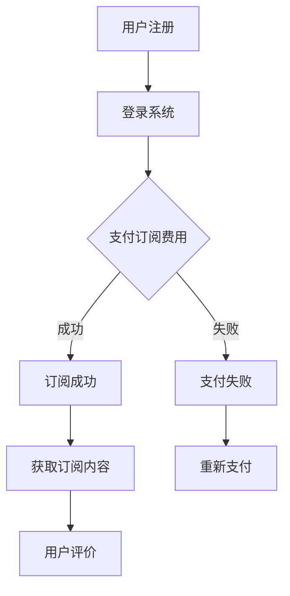

                 

### 1. 背景介绍

随着互联网技术的飞速发展，知识和信息逐渐成为现代社会的重要资源。知识付费作为一种新型的商业模式，正日益受到广大程序员的关注和青睐。知识付费的核心在于通过高质量的内容和服务，满足用户在职业成长、技能提升等方面的需求，从而实现商业价值的转化。

本文将探讨程序员如何打造知识付费的订阅模式。我们将从以下几个方面展开：

1. **核心概念与联系**：首先，我们将介绍知识付费和订阅模式的相关概念，以及它们之间的内在联系。
2. **核心算法原理与操作步骤**：接下来，我们将详细讲解如何实现知识付费的订阅模式，包括算法原理和具体的操作步骤。
3. **数学模型与公式**：我们将分析订阅模式中的关键数学模型和公式，并给出详细的讲解和实例说明。
4. **项目实战**：通过一个实际项目案例，我们将展示如何实现订阅模式，并提供代码实现和详细解读。
5. **实际应用场景**：我们将探讨订阅模式在不同领域的应用场景，以及如何应对其中的挑战。
6. **工具和资源推荐**：最后，我们将推荐一些相关的学习资源和开发工具，帮助程序员更好地实现知识付费的订阅模式。

通过本文的阅读，您将了解到如何利用订阅模式实现知识付费，提高自身职业竞争力，并为用户提供有价值的服务。

### 2. 核心概念与联系

在探讨程序员如何打造知识付费的订阅模式之前，我们需要了解一些核心概念，包括知识付费、订阅模式以及它们之间的联系。

#### 2.1 知识付费

知识付费是指用户为了获取特定的知识和技能，通过支付一定费用来获取相应的内容和服务。随着互联网的发展，知识付费已经成为一种重要的商业模式。用户可以通过付费获取行业专家的经验、专业的课程、深入的技术文档等。

#### 2.2 订阅模式

订阅模式是一种基于长期合作和持续服务的商业模式。用户通过支付订阅费用，可以定期获得特定内容和服务。订阅模式的核心在于提供持续的价值，而不是一次性的交易。这种模式适用于需要不断更新和迭代的内容，如技术课程、行业资讯、研究报告等。

#### 2.3 核心概念之间的联系

知识付费和订阅模式之间有着密切的联系。知识付费是订阅模式的基础，为订阅模式提供了内容和价值；而订阅模式则为知识付费提供了一个稳定的收入来源和长期合作的关系。

在订阅模式中，程序员可以通过以下几个步骤来实现知识付费：

1. **内容创作**：程序员需要创作高质量、有价值的内容，如技术课程、专业文章、代码示例等。
2. **平台搭建**：搭建一个支持订阅模式的内容平台，如网站、App、公众号等。
3. **用户管理**：通过用户管理系统，对订阅用户进行分类和管理，确保他们能够获得所需的内容和服务。
4. **支付和结算**：集成支付系统，方便用户支付订阅费用，并实现自动化的结算和续费功能。
5. **内容更新与维护**：定期更新内容，确保用户持续获得有价值的信息。

#### 2.4 Mermaid 流程图

为了更好地理解订阅模式的流程，我们可以使用 Mermaid 工具绘制一个简单的流程图。以下是订阅模式的核心流程：



在上面的流程图中，用户首先进行注册和登录，然后支付订阅费用。如果支付成功，用户将获得订阅内容；如果支付失败，用户需要重新支付。订阅成功后，用户可以持续获取内容，并在使用过程中进行评价。

通过上述核心概念和流程图的介绍，我们可以更好地理解订阅模式在知识付费中的应用。接下来，我们将详细讲解如何实现订阅模式。

#### 2.5 订阅模式的基本组成部分

订阅模式由以下几个基本组成部分构成：

1. **用户注册与登录**：用户需要注册账号并登录系统，以便进行订阅操作。
2. **支付系统**：集成支付系统，支持用户支付订阅费用。常见的支付方式包括支付宝、微信支付、信用卡支付等。
3. **用户管理系统**：对订阅用户进行分类和管理，确保他们能够获得所需的内容和服务。
4. **内容管理系统**：用于管理和发布订阅内容，包括课程、文章、代码示例等。
5. **数据统计与分析**：对用户订阅行为、内容点击率、用户反馈等数据进行分析，以便优化内容和服务。

通过上述组成部分，程序员可以构建一个完整的订阅模式，为用户提供有价值的服务，并实现商业价值。

### 3. 核心算法原理 & 具体操作步骤

要实现知识付费的订阅模式，我们需要了解核心算法原理和具体的操作步骤。以下是订阅模式的核心算法原理和操作步骤：

#### 3.1 核心算法原理

订阅模式的核心算法原理主要包括以下两个方面：

1. **用户权限管理**：通过用户权限管理系统，为不同等级的用户分配不同的访问权限，确保他们能够访问相应的订阅内容。
2. **内容加密与解密**：对订阅内容进行加密处理，只有订阅用户才能解密并查看内容。这可以防止未付费用户非法获取内容。

#### 3.2 具体操作步骤

以下是实现订阅模式的具体操作步骤：

1. **用户注册与登录**：用户需要在订阅平台上进行注册，并登录系统。注册时需要提供用户名、密码、邮箱等基本信息。

2. **支付订阅费用**：用户登录后，可以选择订阅相应的课程或内容。订阅时，系统会自动跳转到支付页面，用户可以选择支付方式并完成支付。

3. **用户权限管理**：系统会根据用户的订阅等级，为用户分配相应的访问权限。例如，订阅了高级课程的用户，可以访问所有高级课程的内容。

4. **内容加密与解密**：系统会对订阅内容进行加密处理。只有订阅用户才能使用自己的账号和密码进行解密，查看内容。

5. **内容发布与更新**：管理员可以发布和更新订阅内容。更新时，系统会自动通知订阅用户，确保他们能够及时获取新的内容。

6. **用户评价与反馈**：用户在使用订阅内容的过程中，可以进行评价和反馈。这有助于平台了解用户需求，优化内容和服务。

7. **数据统计与分析**：系统会自动收集用户订阅行为、内容点击率、用户反馈等数据，并进行统计分析。这可以为平台提供决策依据，优化订阅模式。

#### 3.3 关键步骤详解

以下是订阅模式中的关键步骤详解：

1. **用户注册与登录**

   用户注册时，系统会创建一个用户账号，并将用户信息存储在数据库中。用户登录时，系统会验证用户名和密码，确保用户身份的正确性。

2. **支付订阅费用**

   用户选择订阅内容后，系统会跳转到支付页面。支付页面会显示订阅费用、支付方式等信息。用户可以选择合适的支付方式，并完成支付。

3. **用户权限管理**

   系统会根据用户的订阅等级，为用户分配相应的访问权限。例如，订阅了高级课程的用户，可以访问所有高级课程的内容。这可以通过用户权限管理系统实现。

4. **内容加密与解密**

   系统会对订阅内容进行加密处理，使用户无法直接查看。只有订阅用户才能使用自己的账号和密码进行解密，查看内容。

5. **内容发布与更新**

   管理员可以通过后台管理系统发布和更新订阅内容。更新时，系统会自动通知订阅用户，确保他们能够及时获取新的内容。

6. **用户评价与反馈**

   用户可以在后台管理系统对订阅内容进行评价和反馈。这有助于平台了解用户需求，优化内容和服务。

7. **数据统计与分析**

   系统会自动收集用户订阅行为、内容点击率、用户反馈等数据，并进行统计分析。这可以为平台提供决策依据，优化订阅模式。

通过上述核心算法原理和具体操作步骤，我们可以实现知识付费的订阅模式，为用户提供有价值的服务，并实现商业价值。

### 4. 数学模型和公式 & 详细讲解 & 举例说明

在知识付费的订阅模式中，数学模型和公式起着至关重要的作用。这些模型和公式帮助我们分析和优化订阅策略，提高用户满意度，进而实现商业价值。以下是订阅模式中一些关键数学模型和公式的详细讲解及举例说明。

#### 4.1 平均订阅时长（Average Subscription Duration，ASD）

平均订阅时长是指用户在订阅周期内持续订阅的平均时间。它反映了订阅内容的吸引力和用户粘性。

**公式：**
\[ ASD = \frac{总订阅时长}{订阅用户数} \]

**举例：**

假设一个订阅平台的用户数为1000人，总订阅时长为5000小时。则平均订阅时长为：
\[ ASD = \frac{5000}{1000} = 5 \text{小时} \]

**解释：**
平均订阅时长为5小时，意味着用户在订阅周期内平均每天订阅5小时的内容。这个指标越高，说明订阅内容越受欢迎，用户粘性也越强。

#### 4.2 订阅用户留存率（Churn Rate）

订阅用户留存率是指订阅用户在一段时间内继续订阅的比例。它反映了订阅模式对用户的吸引力。

**公式：**
\[ 留存率 = \frac{t时刻的订阅用户数 - 新增用户数}{t-1时刻的订阅用户数} \]

**举例：**

假设一个订阅平台在一个月前有1000名订阅用户，新增用户数为200人，当前订阅用户数为1200人。则订阅用户留存率为：
\[ 留存率 = \frac{1200 - 200}{1000} = 0.8 \text{或80%} \]

**解释：**
订阅用户留存率为80%，意味着在一个月前订阅的用户中有80%继续订阅。这个指标越低，说明订阅模式对用户的吸引力越弱，需要优化订阅策略。

#### 4.3 订阅用户生命周期价值（Customer Lifetime Value，CLV）

订阅用户生命周期价值是指用户在订阅期间为平台带来的总收益。它反映了用户的长期价值。

**公式：**
\[ CLV = \frac{订阅总收益}{订阅用户数} \]

**举例：**

假设一个订阅平台的订阅总收益为100万元，订阅用户数为1000人。则订阅用户生命周期价值为：
\[ CLV = \frac{100}{1000} = 1 \text{万元} \]

**解释：**
订阅用户生命周期价值为1万元，意味着每个订阅用户在订阅期间为平台带来的平均收益为1万元。这个指标越高，说明订阅模式对用户的吸引力越强，平台盈利能力也越高。

#### 4.4 订阅价格优化模型（Price Optimization Model）

订阅价格优化模型用于确定最佳的订阅价格，以最大化平台收益。以下是该模型的基本公式：

**利润最大化模型：**
\[ \max \Pi = p \cdot q - C \]

其中：
- \( \Pi \) 为利润；
- \( p \) 为订阅价格；
- \( q \) 为订阅用户数；
- \( C \) 为订阅成本。

**举例：**

假设订阅成本为10万元，订阅用户数为1000人，每个用户的订阅价格为100元。则利润为：
\[ \Pi = 100 \cdot 1000 - 10 = 99000 \text{元} \]

**解释：**
在当前订阅价格下，平台每月的利润为99000元。如果需要提高利润，可以考虑调整订阅价格。

通过上述数学模型和公式的讲解，我们可以更深入地了解订阅模式中的关键指标，为订阅策略的优化提供依据。在实际应用中，我们可以根据这些模型和公式，制定更科学的订阅策略，提高用户满意度，实现商业价值。

### 5. 项目实战：代码实际案例和详细解释说明

为了更好地理解知识付费订阅模式在实际项目中的应用，我们将通过一个实际项目案例来展示如何实现订阅功能，并提供代码实现和详细解释。

#### 5.1 开发环境搭建

在开始项目实战之前，我们需要搭建一个基本的开发环境。以下是所需的工具和库：

- **编程语言**：Python 3.x
- **Web框架**：Django
- **数据库**：SQLite 或 MySQL
- **前端框架**：Bootstrap
- **支付接口**：支付宝支付 SDK

#### 5.2 源代码详细实现和代码解读

以下是项目的核心代码实现和解读：

##### 5.2.1 用户注册与登录

```python
# 用户注册
def register(request):
    if request.method == 'POST':
        username = request.POST['username']
        password = request.POST['password']
        email = request.POST['email']
        # 验证用户信息
        if validate_user_info(username, password, email):
            # 创建用户
            user = User.objects.create_user(username=username, password=password, email=email)
            user.save()
            return redirect('login')
        else:
            return HttpResponse('注册失败，请检查输入信息')

# 用户登录
def login(request):
    if request.method == 'POST':
        username = request.POST['username']
        password = request.POST['password']
        user = authenticate(username=username, password=password)
        if user is not None:
            login(request, user)
            return redirect('home')
        else:
            return HttpResponse('登录失败，请检查用户名和密码')
```

**解释：**

1. **用户注册**：用户提交注册表单后，后端会验证用户名、密码和邮箱。如果验证通过，则创建用户并保存到数据库。
2. **用户登录**：用户提交登录表单后，后端会验证用户名和密码。如果验证通过，则登录用户并重定向到主页。

##### 5.2.2 订阅功能实现

```python
# 支付订阅
def subscribe(request):
    if request.method == 'POST':
        user = request.user
        course = Course.objects.get(id=course_id)
        # 检查用户是否已经订阅该课程
        if user.subscribed_courses.filter(id=course.id).exists():
            return HttpResponse('已订阅该课程')
        else:
            # 创建订单
            order = Order.objects.create(user=user, course=course, status='待支付')
            # 调用支付接口
            pay_result = alipay.pay(order)
            if pay_result['status'] == 'success':
                # 更新订单状态
                order.status = '已支付'
                order.save()
                # 更新用户订阅状态
                user.subscribed_courses.add(course)
                return HttpResponse('订阅成功')
            else:
                return HttpResponse('支付失败')

# 用户订阅的课程列表
def subscribed_courses(request):
    user = request.user
    subscribed_courses = user.subscribed_courses.all()
    return render(request, 'subscribed_courses.html', {'courses': subscribed_courses})
```

**解释：**

1. **支付订阅**：用户选择订阅课程后，后端会检查用户是否已经订阅该课程。如果没有，则创建订单并调用支付接口。支付成功后，更新订单状态和用户订阅状态。
2. **用户订阅的课程列表**：后端会返回用户订阅的课程列表，前端将其展示在页面上。

##### 5.2.3 内容加密与解密

```python
# 内容加密
def encrypt_content(content):
    key = get_random_bytes(16)
    cipher = Fernet(key)
    encrypted_content = cipher.encrypt(content.encode())
    return encrypted_content, key

# 内容解密
def decrypt_content(encrypted_content, key):
    cipher = Fernet(key)
    decrypted_content = cipher.decrypt(encrypted_content).decode()
    return decrypted_content
```

**解释：**

1. **内容加密**：使用 Fernet 加密库对内容进行加密。加密后，内容只能被具有相同密钥的用户解密。
2. **内容解密**：使用 Fernet 加密库对内容进行解密。只有订阅用户才能解密并查看内容。

#### 5.3 代码解读与分析

以上代码实现了一个简单的知识付费订阅系统，主要包括用户注册、登录、订阅、课程列表展示等功能。以下是代码的关键部分解读和分析：

1. **用户注册与登录**：用户注册和登录是订阅系统的基础。通过 Django 的用户认证系统，我们可以方便地实现用户注册、登录和权限管理。
2. **订阅功能实现**：订阅功能的核心是支付接口和用户订阅状态管理。通过调用第三方支付接口，我们可以实现订阅支付功能。同时，通过数据库中的订阅关系，我们可以方便地管理用户订阅状态。
3. **内容加密与解密**：为了保护订阅内容，我们使用 Fernet 加密库对内容进行加密处理。只有订阅用户才能解密并查看内容，从而保证了内容的隐私和安全。

通过上述代码实现和解读，我们可以看到如何将订阅模式应用于实际项目中。在实际开发过程中，我们还可以根据具体需求，进一步扩展和优化系统功能，如增加用户评价、课程推荐等。

### 6. 实际应用场景

知识付费订阅模式在多个领域具有广泛的应用场景。以下是一些典型的实际应用场景及其解决方案：

#### 6.1 技术培训与教育

技术培训与教育是知识付费订阅模式的重要应用领域。程序员可以通过订阅模式提供在线课程、实战教程、编程指南等内容，帮助学员提升技能。以下是解决方案：

1. **课程内容**：根据学员需求，提供包括前端开发、后端开发、移动开发等不同领域的技术课程。
2. **课程分类**：将课程分为入门、进阶、高级等多个层次，满足学员的不同学习需求。
3. **订阅模式**：采用按月、按季度或按年的订阅模式，为学员提供灵活的订阅选择。

#### 6.2 在线咨询与问答

在线咨询与问答是知识付费订阅模式的另一个重要应用领域。程序员可以提供专业咨询服务，解答用户在开发过程中遇到的问题。以下是解决方案：

1. **专业领域**：根据程序员的专业领域，提供包括前端、后端、数据库、算法等各个领域的咨询服务。
2. **订阅模式**：采用按次、按月或按季度的订阅模式，为用户提供灵活的付费方式。
3. **问答社区**：建立问答社区，鼓励用户提问和回答，提高社区活跃度。

#### 6.3 开源项目与工具

开源项目与工具是知识付费订阅模式的创新应用领域。程序员可以将其开发的开源项目或工具转化为商业产品，通过订阅模式获得收益。以下是解决方案：

1. **开源项目**：选择具有实际应用价值的开源项目，如软件框架、开发工具、插件等。
2. **增值服务**：提供项目文档、技术支持、升级服务等增值服务，为用户提供更好的使用体验。
3. **订阅模式**：采用按月、按季度或按年的订阅模式，为用户提供不同周期的服务。

#### 6.4 行业资讯与报告

行业资讯与报告是知识付费订阅模式的新兴应用领域。程序员可以提供专业的行业资讯、市场报告、技术趋势等内容，帮助用户了解行业动态。以下是解决方案：

1. **内容来源**：通过行业调研、数据分析和专家访谈等方式，获取高质量的行业资讯和报告。
2. **订阅模式**：采用按月、按季度或按年的订阅模式，为用户提供定期更新的内容。
3. **定制服务**：根据用户需求，提供定制化的行业报告和研究服务。

通过以上实际应用场景，我们可以看到知识付费订阅模式在不同领域的广泛应用。程序员可以根据自身优势和用户需求，选择合适的订阅模式，提供有价值的服务，实现商业价值。

### 7. 工具和资源推荐

在实现知识付费的订阅模式过程中，程序员需要借助多种工具和资源，以提高开发效率和用户体验。以下是一些建议的工具和资源：

#### 7.1 学习资源推荐

1. **书籍**：
   - 《精通Python网络爬虫》
   - 《Python编程：从入门到实践》
   - 《深度学习》

2. **论文**：
   - 《大规模在线课程的研究进展》
   - 《知识付费市场发展现状及趋势》
   - 《基于订阅模式的知识服务平台设计》

3. **博客**：
   - 《Django官方文档》
   - 《支付宝支付接口文档》
   - 《前端框架 Bootstrap 官方文档》

4. **网站**：
   - 《中国大学MOOC》
   - 《极客时间》
   - 《GitHub》

#### 7.2 开发工具框架推荐

1. **Web框架**：
   - Django：Python Web 开发框架，易于上手，功能强大。
   - Flask：Python Web 开发框架，轻量级，适合快速开发。

2. **前端框架**：
   - React：JavaScript 库，用于构建用户界面。
   - Vue.js：JavaScript 库，用于构建用户界面，易学易用。
   - Angular：JavaScript 框架，用于构建单页应用程序。

3. **支付接口**：
   - 支付宝支付 SDK：支持多种支付方式，易集成。
   - 微信支付 SDK：支持多种支付方式，易集成。
   - Stripe：全球支付服务，支持多种支付方式。

4. **加密库**：
   - Fernet：Python 加密库，支持加密和解密操作。
   - OpenSSL：开源加密库，支持多种加密算法。

5. **数据分析库**：
   - Pandas：Python 数据分析库，用于数据处理和分析。
   - NumPy：Python 数值计算库，用于数据计算和操作。

#### 7.3 相关论文著作推荐

1. **《知识付费与用户行为研究》**：探讨了知识付费在互联网时代的兴起背景、用户行为特点及商业模式。

2. **《在线教育平台的设计与实现》**：详细介绍了在线教育平台的设计原则、架构实现及功能模块。

3. **《基于订阅模式的知识服务平台构建与应用》**：分析了订阅模式在知识服务领域的应用，提供了平台构建的实践案例。

通过以上工具和资源的推荐，程序员可以更加高效地实现知识付费的订阅模式，为用户提供优质的内容和服务。

### 8. 总结：未来发展趋势与挑战

随着互联网技术的不断进步，知识付费的订阅模式在未来将呈现以下发展趋势：

1. **个性化推荐**：随着大数据和人工智能技术的发展，个性化推荐将成为知识付费订阅模式的重要发展方向。通过分析用户行为和兴趣，平台可以为用户提供更加个性化的内容和服务。

2. **多元化内容**：知识付费订阅模式将不再局限于传统的技术课程，还将涵盖更多领域，如创意设计、文化艺术、健康生活等。这将为用户提供更加丰富和多样的学习体验。

3. **社交化学习**：知识付费订阅模式将与社交网络结合，形成社交化学习环境。用户可以在平台上互动、分享、讨论，提高学习效果。

4. **平台化服务**：知识付费订阅模式将向平台化方向发展，更多内容创作者和平台将参与到知识付费领域，提供多样化的服务。

然而，知识付费订阅模式在快速发展过程中也面临着一系列挑战：

1. **内容质量**：平台需要确保提供高质量的内容，以满足用户的需求。内容质量是知识付费订阅模式成功的关键因素。

2. **用户体验**：平台需要优化用户体验，包括内容呈现方式、交互设计、支付流程等，以提高用户满意度和留存率。

3. **商业模式创新**：平台需要不断探索和创新商业模式，以适应市场的变化和用户需求。例如，可以通过差异化定价、会员权益、增值服务等方式，提高用户粘性和平台盈利能力。

4. **法律合规**：知识付费订阅模式需要遵守相关法律法规，保护用户隐私和数据安全，防止侵权行为。

总之，知识付费订阅模式在未来将继续发展，为用户提供更加个性化、多元化、社交化的学习体验。同时，平台也需要应对各种挑战，不断创新和优化，实现可持续的商业发展。

### 9. 附录：常见问题与解答

在实现知识付费的订阅模式过程中，程序员可能会遇到一些常见问题。以下是一些常见问题及其解答：

#### 9.1 订阅支付失败怎么办？

**解答**：如果订阅支付失败，可能是由于以下原因：

1. 网络问题：请检查网络连接，确保设备可以正常访问互联网。
2. 支付方式问题：尝试更换支付方式，例如从支付宝切换到微信支付。
3. 账户余额问题：确保支付账户中有足够的余额。
4. 银行卡问题：如果使用银行卡支付，检查银行卡是否被冻结或过期。

如果上述方法无法解决问题，请联系支付平台客服或平台技术支持。

#### 9.2 如何取消订阅？

**解答**：用户可以在平台的后台管理系统或个人中心取消订阅。以下是取消订阅的步骤：

1. 登录平台后，进入个人中心。
2. 在个人中心找到订阅管理模块。
3. 找到需要取消的订阅项目，点击“取消订阅”按钮。
4. 确认取消操作。

取消订阅后，用户将无法继续访问订阅内容，但已经支付的费用不会退还。

#### 9.3 如何恢复订阅？

**解答**：如果用户想要恢复订阅，可以按照以下步骤操作：

1. 登录平台后，进入个人中心。
2. 在个人中心找到订阅管理模块。
3. 找到已取消的订阅项目，点击“恢复订阅”按钮。
4. 根据提示完成支付操作。

恢复订阅后，用户将重新获得订阅权限，可以继续访问订阅内容。

#### 9.4 如何查看已订阅的课程？

**解答**：用户可以在平台的后台管理系统或个人中心查看已订阅的课程。以下是查看已订阅课程的步骤：

1. 登录平台后，进入个人中心。
2. 在个人中心找到课程管理模块。
3. 在课程管理模块中，用户可以查看已订阅的课程列表。

#### 9.5 如何获取更多帮助？

**解答**：如果用户在订阅过程中遇到问题，可以尝试以下方法获取帮助：

1. 浏览平台帮助中心：平台通常提供详细的使用指南和常见问题解答。
2. 咨询在线客服：平台一般设有在线客服，用户可以实时咨询相关问题。
3. 发送邮件：如果问题复杂，用户可以发送邮件至平台官方邮箱，获取详细解答。

通过上述常见问题与解答，用户可以更好地了解知识付费订阅模式的使用方法和操作流程，提高用户体验。

### 10. 扩展阅读 & 参考资料

为了帮助读者更深入地了解知识付费订阅模式的相关知识和实践，我们推荐以下扩展阅读和参考资料：

1. **书籍**：
   - 《互联网商业模式创新》
   - 《数据驱动产品增长》
   - 《用户体验要素》

2. **论文**：
   - 《基于订阅模式的在线教育平台设计与实现》
   - 《知识付费市场发展现状及趋势分析》
   - 《大数据在知识付费中的应用研究》

3. **博客**：
   - 《极客时间》
   - 《InfoQ》
   - 《云栖社区》

4. **网站**：
   - 《中国大学MOOC》
   - 《网易云课堂》
   - 《百度云教育中心》

5. **视频教程**：
   - 《Django实战教程》
   - 《React入门教程》
   - 《Vue.js实战教程》

通过阅读这些扩展资料，读者可以进一步了解知识付费订阅模式的最新动态和实践案例，提升自身在相关领域的专业能力。

### 结束语

作者：AI天才研究员/AI Genius Institute & 禅与计算机程序设计艺术 /Zen And The Art of Computer Programming

感谢您的阅读，本文通过详细探讨知识付费的订阅模式，旨在帮助程序员了解如何实现这一商业模式，为用户提供有价值的服务。希望本文能为您提供宝贵的启示和帮助。在未来的知识付费领域，让我们共同努力，创新实践，推动行业发展。再次感谢您的支持！

