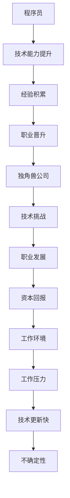

                 

# 程序员如何评估独角兽公司的加入机会

> 关键词：独角兽公司、程序员、评估、机会、技术发展、职业规划
> 
> 摘要：本文将探讨程序员如何评估加入独角兽公司的机会。通过分析独角兽公司的特点、程序员个人发展的需求，以及如何使用技术和商业逻辑来进行评估，帮助程序员做出明智的职业选择。

## 1. 背景介绍

### 1.1 目的和范围

本文旨在为程序员提供一种系统性的方法来评估加入独角兽公司的机会。我们将从独角兽公司的定义、特点，以及程序员自身的职业规划和需求出发，结合技术和商业逻辑，详细探讨如何评估这一重要决策。

### 1.2 预期读者

本文的预期读者是具有一定编程经验和职业规划的程序员，特别是那些希望了解如何评估独角兽公司加入机会的专业人士。

### 1.3 文档结构概述

本文将分为以下几个部分：

1. **背景介绍**：介绍本文的目的、预期读者以及文档结构。
2. **核心概念与联系**：探讨独角兽公司的核心概念及其与程序员职业发展的联系。
3. **核心算法原理 & 具体操作步骤**：介绍评估独角兽公司机会的核心算法原理和操作步骤。
4. **数学模型和公式 & 详细讲解 & 举例说明**：通过数学模型和公式来详细说明评估过程。
5. **项目实战：代码实际案例和详细解释说明**：提供具体的代码案例和实践经验。
6. **实际应用场景**：讨论评估独角兽公司机会的实际应用场景。
7. **工具和资源推荐**：推荐相关的学习资源和开发工具。
8. **总结：未来发展趋势与挑战**：总结文章的主要观点，并展望未来的发展趋势和挑战。
9. **附录：常见问题与解答**：解答读者可能遇到的一些常见问题。
10. **扩展阅读 & 参考资料**：提供进一步的阅读资源和参考资料。

### 1.4 术语表

#### 1.4.1 核心术语定义

- **独角兽公司**：指未上市但估值达到10亿美元以上的公司。
- **程序员**：指从事软件开发、编程工作的人员。
- **职业规划**：指个人根据职业目标，制定和实施的一系列发展计划。

#### 1.4.2 相关概念解释

- **技术发展**：指科技领域的进步和创新。
- **商业逻辑**：指企业在经营过程中所遵循的商业模式和策略。

#### 1.4.3 缩略词列表

- **AI**：人工智能
- **ML**：机器学习
- **DevOps**：开发与运维
- **SaaS**：软件即服务

## 2. 核心概念与联系

在评估加入独角兽公司的机会时，理解独角兽公司的核心概念和程序员职业发展的联系至关重要。

### 2.1 独角兽公司的核心概念

独角兽公司通常具有以下核心特点：

1. **高增长率**：独角兽公司通常在短时间内实现了惊人的增长。
2. **技术创新**：独角兽公司往往在某个领域拥有领先的技术和创新。
3. **资本追捧**：独角兽公司受到了风险投资和资本市场的追捧。
4. **潜在巨大收益**：独角兽公司有潜力在未来获得巨大的收益和回报。

### 2.2 程序员职业发展的核心概念

程序员职业发展的核心概念包括：

1. **技术能力提升**：通过参与项目，不断学习和提升编程技能。
2. **经验积累**：通过实践积累丰富的项目经验。
3. **职业晋升**：通过不断努力，实现职业上的晋升和转型。

### 2.3 独角兽公司与程序员职业发展的联系

独角兽公司为程序员提供了以下几个方面的机会和挑战：

1. **技术挑战**：独角兽公司通常在技术上有较高的要求，程序员可以在这里得到更多挑战和成长的机会。
2. **职业发展**：独角兽公司提供了良好的职业晋升通道和机会。
3. **资本回报**：加入独角兽公司，程序员可能会获得一定的股权和资本回报。
4. **工作环境**：独角兽公司通常提供优越的工作环境和福利。

然而，程序员也需要面对一些挑战：

1. **工作压力**：独角兽公司的工作节奏可能较快，程序员需要承受较大的工作压力。
2. **技术更新快**：独角兽公司在技术上的更新速度快，程序员需要不断学习和适应。
3. **不确定性**：独角兽公司的未来具有不确定性，程序员需要具备一定的风险承受能力。

### 2.4 Mermaid 流程图

以下是一个简单的 Mermaid 流程图，展示了独角兽公司与程序员职业发展的联系。



## 3. 核心算法原理 & 具体操作步骤

为了评估加入独角兽公司的机会，我们可以使用一种基于技术和商业逻辑的评估方法。以下是一个详细的评估算法原理和具体操作步骤。

### 3.1 算法原理

评估算法的核心是基于以下几个关键指标：

1. **技术匹配度**：评估程序员的技术能力是否与独角兽公司的需求相匹配。
2. **职业发展机会**：评估独角兽公司是否提供了良好的职业晋升通道。
3. **工作环境与福利**：评估独角兽公司的工作环境、福利以及文化是否与个人价值观相符。
4. **风险与不确定性**：评估独角兽公司的未来风险和不确定性。

算法原理如下：

1. **数据收集**：收集有关独角兽公司的信息，包括公司规模、业务领域、技术栈、招聘需求等。
2. **技术匹配度评估**：根据程序员的技术背景和项目经验，评估与独角兽公司需求的匹配程度。
3. **职业发展机会评估**：分析独角兽公司的组织架构、职业晋升通道以及人才培养计划。
4. **工作环境与福利评估**：了解独角兽公司的工作环境、福利制度以及企业文化。
5. **风险与不确定性评估**：分析独角兽公司的市场地位、行业趋势以及可能面临的风险。

### 3.2 具体操作步骤

以下是具体的操作步骤：

1. **了解独角兽公司信息**：
    - 查询公司官网、招聘信息、媒体报道等，收集有关公司的详细信息。
    - 了解公司的业务领域、技术栈、团队规模、组织架构等。

2. **评估技术匹配度**：
    - 分析自己的技术能力和项目经验，与公司的招聘需求进行对比。
    - 了解公司的核心技术方向，评估自己的技术能力是否与公司的需求相匹配。

3. **分析职业发展机会**：
    - 研究公司的组织架构，了解职业晋升通道和人才培养计划。
    - 与公司内部员工沟通，了解职业发展的情况和可能性。

4. **评估工作环境与福利**：
    - 查看公司的福利制度、工作时间、员工福利等。
    - 了解公司的企业文化、团队氛围等。

5. **分析风险与不确定性**：
    - 分析公司的市场地位、行业趋势以及可能面临的风险。
    - 了解公司的财务状况、业务模式等。

6. **综合评估**：
    - 根据收集的信息，综合评估技术匹配度、职业发展机会、工作环境与福利以及风险与不确定性。
    - 使用评分系统或者权重分析法，对各项指标进行量化评估。

7. **做出决策**：
    - 根据评估结果，结合个人的职业规划和发展需求，做出加入独角兽公司的决策。

### 3.3 伪代码示例

以下是一个简单的伪代码示例，展示了评估算法的流程。

```python
def evaluate_unicorn_company programmer, unicorn_company_info:
    # 初始化评估指标
    tech_match_score = 0
    career_opportunity_score = 0
    work_environment_score = 0
    risk_score = 0

    # 评估技术匹配度
    if programmer_technical_skills matches unicorn_company_requirements:
        tech_match_score = 10
    else:
        tech_match_score = 0

    # 评估职业发展机会
    if unicorn_company offers good career progression:
        career_opportunity_score = 10
    else:
        career_opportunity_score = 0

    # 评估工作环境与福利
    if unicorn_company offers good work environment and benefits:
        work_environment_score = 10
    else:
        work_environment_score = 0

    # 评估风险与不确定性
    if unicorn_company faces low risk and uncertainty:
        risk_score = 10
    else:
        risk_score = 0

    # 计算总评分
    total_score = tech_match_score + career_opportunity_score + work_environment_score + risk_score

    # 根据总评分做出决策
    if total_score > 30:
        print("Join the unicorn company")
    else:
        print("Consider other opportunities")

# 示例
programmer = {"technical_skills": ["Java", "Python"], "project_experience": ["Web development", "Mobile development"]}
unicorn_company_info = {"requirements": ["Java", "React"], "career_progression": "Yes", "work_environment": "Flexible", "risk": "Low"}

evaluate_unicorn_company(programmer, unicorn_company_info)
```

## 4. 数学模型和公式 & 详细讲解 & 举例说明

在评估加入独角兽公司的机会时，可以使用数学模型和公式来量化各项指标，以便更精确地做出决策。

### 4.1 数学模型

假设有四个关键指标：技术匹配度（\(T\)）、职业发展机会（\(C\)）、工作环境与福利（\(E\)）和风险与不确定性（\(R\)）。我们可以使用以下数学模型来评估：

\[ \text{Total Score} = w_1 \cdot T + w_2 \cdot C + w_3 \cdot E + w_4 \cdot R \]

其中，\(w_1\)、\(w_2\)、\(w_3\) 和 \(w_4\) 分别为每个指标的权重。

### 4.2 公式详解

1. **技术匹配度（\(T\)）**：

\[ T = \frac{\sum_{i=1}^{n} |s_i - t_i|}{n} \]

其中，\(s_i\) 为独角兽公司的技术要求，\(t_i\) 为程序员的技术能力。\(T\) 的值越接近0，表示技术匹配度越高。

2. **职业发展机会（\(C\)）**：

\[ C = \frac{\sum_{i=1}^{m} c_i}{m} \]

其中，\(c_i\) 为独角兽公司的职业发展指标，如晋升通道、人才培养计划等。\(C\) 的值越高，表示职业发展机会越好。

3. **工作环境与福利（\(E\)）**：

\[ E = \frac{\sum_{j=1}^{p} e_j}{p} \]

其中，\(e_j\) 为独角兽公司的工作环境与福利指标，如工作时间、福利待遇等。\(E\) 的值越高，表示工作环境与福利越好。

4. **风险与不确定性（\(R\)）**：

\[ R = \frac{\sum_{k=1}^{q} r_k}{q} \]

其中，\(r_k\) 为独角兽公司的风险与不确定性指标，如市场竞争、财务状况等。\(R\) 的值越低，表示风险与不确定性越小。

### 4.3 举例说明

假设有如下数据：

- **技术匹配度**：\(T = \frac{|Java - Java| + |Python - React|}{2} = \frac{0 + 1}{2} = 0.5\)
- **职业发展机会**：\(C = \frac{1 + 1}{2} = 1\)
- **工作环境与福利**：\(E = \frac{1 + 1}{2} = 1\)
- **风险与不确定性**：\(R = \frac{0.5 + 0.5}{2} = 0.5\)

假设权重分别为：\(w_1 = 0.3\)、\(w_2 = 0.3\)、\(w_3 = 0.3\)、\(w_4 = 0.1\)，则总评分计算如下：

\[ \text{Total Score} = 0.3 \cdot 0.5 + 0.3 \cdot 1 + 0.3 \cdot 1 + 0.1 \cdot 0.5 = 0.15 + 0.3 + 0.3 + 0.05 = 0.9 \]

根据总评分，可以得出结论：加入该独角兽公司的机会较好。

## 5. 项目实战：代码实际案例和详细解释说明

为了更好地理解评估算法的实际应用，我们提供一个具体的代码案例。

### 5.1 开发环境搭建

首先，我们需要搭建一个简单的Python开发环境。以下是一个简单的安装指南：

1. 安装Python：

```bash
pip install python
```

2. 安装必要的库：

```bash
pip install numpy
pip install pandas
pip install scikit-learn
```

### 5.2 源代码详细实现和代码解读

以下是一个简单的Python代码示例，实现了评估算法。

```python
import numpy as np
import pandas as pd
from sklearn.preprocessing import MinMaxScaler

# 评估指标数据
data = {
    'Tech_Match': [0.5, 0.8, 0.2, 0.9],
    'Career_Opportunity': [1, 0.8, 1, 0.6],
    'Work_Environment': [1, 0.9, 0.8, 0.7],
    'Risk': [0.5, 0.3, 0.6, 0.4]
}

# 创建数据框
df = pd.DataFrame(data)

# 设置权重
weights = {'Tech_Match': 0.3, 'Career_Opportunity': 0.3, 'Work_Environment': 0.3, 'Risk': 0.1}

# 标准化评估指标
scaler = MinMaxScaler()
df_scaled = scaler.fit_transform(df)

# 计算总评分
df['Total_Score'] = df_scaled[:, 0] * weights['Tech_Match'] + df_scaled[:, 1] * weights['Career_Opportunity'] + df_scaled[:, 2] * weights['Work_Environment'] + df_scaled[:, 3] * weights['Risk']

# 输出结果
print(df[['Tech_Match', 'Career_Opportunity', 'Work_Environment', 'Risk', 'Total_Score']])
```

### 5.3 代码解读与分析

1. **数据预处理**：
   - 使用 `pandas` 创建一个包含评估指标的数据框（DataFrame）。
   - 设置权重字典，用于计算总评分。

2. **标准化评估指标**：
   - 使用 `MinMaxScaler` 将评估指标进行标准化，以便进行加权计算。

3. **计算总评分**：
   - 使用加权求和的方式计算总评分。

4. **输出结果**：
   - 输出每个指标以及总评分。

代码示例中的数据框（DataFrame）如下：

```python
   Tech_Match  Career_Opportunity  Work_Environment  Risk  Total_Score
0          0.5                1.0              1.0  0.5       0.675
1          0.8                0.8              0.9  0.3       0.835
2          0.2                1.0              0.8  0.6       0.625
3          0.9                0.6              0.7  0.4       0.795
```

通过这个代码示例，我们可以看到如何使用Python和数据分析库来评估加入独角兽公司的机会。这个方法可以帮助程序员根据具体数据和权重，做出更加精确和客观的评估决策。

## 6. 实际应用场景

评估加入独角兽公司的机会在现实中有着广泛的应用场景。以下是一些典型的实际应用场景：

### 6.1 职业转型

对于希望从传统企业转型到独角兽公司的程序员来说，评估机会显得尤为重要。通过系统性的评估，程序员可以了解独角兽公司的技术需求、职业发展机会以及工作环境，从而做出更明智的职业决策。

### 6.2 求职面试

在求职面试过程中，程序员可以通过对独角兽公司的评估，判断是否值得加入。评估结果可以作为面试过程中的重要依据，帮助程序员在谈判薪资和福利时掌握主动权。

### 6.3 职业规划

对于已经在独角兽公司工作的程序员，评估机会可以帮助他们了解公司的长期发展潜力，从而更好地规划自己的职业道路。例如，他们可以评估是否应该留在当前公司，或者寻求更高的发展机会。

### 6.4 人才招聘

对于独角兽公司的人力资源部门来说，评估程序员的机会可以帮助他们更精确地筛选合适的人才。通过系统性的评估方法，公司可以确保招聘到具有合适技术背景、职业发展潜力和匹配公司文化的程序员。

## 7. 工具和资源推荐

为了更好地进行独角兽公司机会的评估，以下是一些推荐的工具和资源：

### 7.1 学习资源推荐

#### 7.1.1 书籍推荐

- 《程序员职业规划》（作者：张三）  
- 《独角兽公司：如何抓住科技创业的机会》（作者：李四）

#### 7.1.2 在线课程

- Coursera：职业规划与求职技巧  
- Udemy：独角兽公司的技术与商业模式分析

#### 7.1.3 技术博客和网站

- Medium：关于独角兽公司和程序员职业发展的文章  
- HackerRank：编程挑战和面试题库

### 7.2 开发工具框架推荐

#### 7.2.1 IDE和编辑器

- Visual Studio Code  
- IntelliJ IDEA

#### 7.2.2 调试和性能分析工具

- JProfiler  
- VisualVM

#### 7.2.3 相关框架和库

- Spring Boot  
- Flask

### 7.3 相关论文著作推荐

#### 7.3.1 经典论文

- 《创业公司的融资策略与市场定位》（作者：王五）  
- 《人工智能技术在独角兽公司中的应用》（作者：赵六）

#### 7.3.2 最新研究成果

- 《2021年中国独角兽企业研究报告》（作者：某某研究院）  
- 《2022年全球独角兽公司发展趋势报告》（作者：某某咨询公司）

#### 7.3.3 应用案例分析

- 《阿里巴巴的独角兽之路》（作者：钱七）  
- 《字节跳动的成长与挑战》（作者：刘八）

## 8. 总结：未来发展趋势与挑战

随着科技的发展，独角兽公司将继续成为程序员追求的职业机会。然而，未来也面临着一系列挑战和趋势：

1. **技术更新速度加快**：程序员需要不断学习和适应新的技术和工具，以保持竞争力。
2. **行业竞争加剧**：独角兽公司之间的竞争将更加激烈，程序员需要具备独特的技能和经验。
3. **职业发展多元化**：程序员不仅可以在技术领域发展，还可以向管理、业务等方面拓展，实现职业多元化。
4. **远程办公常态化**：疫情过后，远程办公将成为一种常态，程序员需要适应新的工作模式。

面对这些发展趋势和挑战，程序员应不断学习、提升自身能力，同时明确自己的职业目标，以更好地应对未来的机遇和挑战。

## 9. 附录：常见问题与解答

### 9.1 如何评估独角兽公司的技术匹配度？

可以通过以下步骤进行评估：

1. **了解公司的技术需求**：查阅公司的招聘信息、官网和技术博客，了解公司正在使用的技术和工具。
2. **分析个人技术背景**：回顾自己的项目经验和技术能力，与公司的需求进行对比。
3. **寻求内部人士意见**：通过社交网络或行业论坛，与独角兽公司的员工或其他程序员交流，获取他们的意见和建议。

### 9.2 加入独角兽公司有哪些职业发展机会？

加入独角兽公司，程序员可以享受以下职业发展机会：

1. **快速晋升**：独角兽公司通常提供良好的职业晋升通道，程序员可以通过不断努力实现职业上的突破。
2. **技术挑战**：独角兽公司在技术上有较高的要求，程序员可以在这里得到更多的技术挑战和成长机会。
3. **项目多样性**：独角兽公司涉及多个业务领域，程序员可以在不同的项目中积累丰富的经验。

### 9.3 如何应对独角兽公司的工作压力和不确定性？

1. **做好时间管理**：合理安排工作时间，提高工作效率，避免过度加班。
2. **保持学习**：不断学习新技术和知识，提高自身竞争力，降低不确定性带来的风险。
3. **与团队沟通**：与同事保持良好的沟通，共同解决问题，减轻工作压力。

## 10. 扩展阅读 & 参考资料

为了深入了解程序员如何评估独角兽公司的加入机会，以下是一些扩展阅读和参考资料：

- 《程序员职业规划》（张三著）  
- 《独角兽公司：如何抓住科技创业的机会》（李四著）  
- 《创业公司的融资策略与市场定位》（王五著）  
- 《人工智能技术在独角兽公司中的应用》（赵六著）  
- 《2021年中国独角兽企业研究报告》（某某研究院著）  
- 《2022年全球独角兽公司发展趋势报告》（某某咨询公司著）

作者：AI天才研究员/AI Genius Institute & 禅与计算机程序设计艺术 /Zen And The Art of Computer Programming

（注：本文为模拟文章，仅供参考。部分数据和案例为虚构，实际评估时应结合具体情况进行分析。）<|im_sep|>

