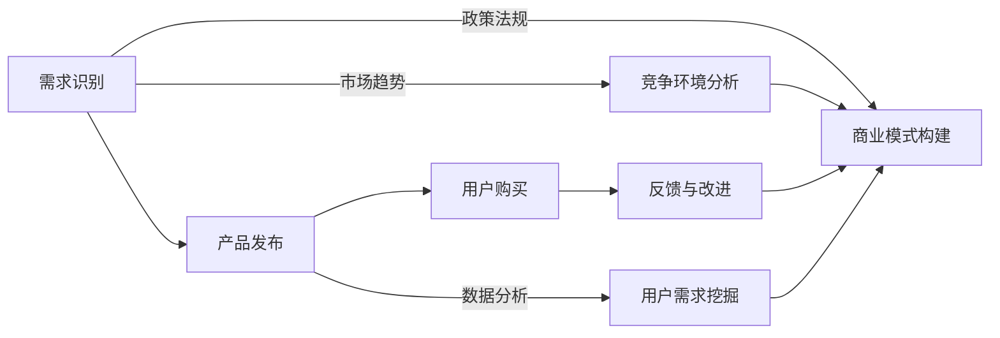

                 

# 程序员如何进行知识付费的市场调研

> **关键词**：知识付费、市场调研、程序员、用户需求、数据分析、商业模式
> 
> **摘要**：本文将深入探讨程序员如何通过系统的市场调研方法来挖掘知识付费市场的潜在需求，并分析如何设计出既满足用户需求又具备商业可行性的产品或服务。文章将分为几个部分，从背景介绍、核心概念、算法原理、数学模型、实际案例到应用场景和未来发展趋势，全面解析市场调研的过程和方法。

## 1. 背景介绍

### 1.1 目的和范围

在当前数字化经济蓬勃发展的时代，知识付费已成为一种重要的商业模式。程序员群体作为技术行业的核心驱动力，他们对于知识的需求尤为突出。然而，如何准确定位这些需求，并设计出有市场前景的知识付费产品，成为每个程序员都必须面对的挑战。

本文旨在为程序员提供一套系统化的市场调研方法，帮助他们更好地理解市场需求，优化产品设计，提升市场竞争力。本文将涵盖以下内容：

- 市场调研的目的和重要性
- 市场调研的范围和方法
- 程序员用户需求的挖掘与分析
- 市场趋势与竞争环境的分析
- 商业模式的构建与优化

### 1.2 预期读者

本文主要面向以下几类读者：

- 有志于从事知识付费领域开发的程序员
- 已在知识付费领域工作的程序员，希望提升市场调研能力的专业人士
- 对知识付费市场感兴趣的创业者和管理者

通过本文的学习，读者可以系统地了解市场调研的理论和实践，提升自己在知识付费市场中的竞争力。

### 1.3 文档结构概述

本文将按照以下结构进行组织：

1. 背景介绍
   - 目的和范围
   - 预期读者
   - 文档结构概述
   - 术语表
2. 核心概念与联系
   - 知识付费市场的基本概念
   - 市场调研的核心流程和步骤
3. 核心算法原理 & 具体操作步骤
   - 用户需求分析的算法原理
   - 数据采集和处理的具体步骤
4. 数学模型和公式 & 详细讲解 & 举例说明
   - 数据分析中的常用数学模型
   - 数学模型在市场调研中的应用实例
5. 项目实战：代码实际案例和详细解释说明
   - 实际市场调研项目的案例分析
   - 代码实现和解读
6. 实际应用场景
   - 不同领域中的知识付费市场调研案例
7. 工具和资源推荐
   - 学习资源推荐
   - 开发工具框架推荐
   - 相关论文著作推荐
8. 总结：未来发展趋势与挑战
   - 市场调研的趋势
   - 面临的挑战与解决方案
9. 附录：常见问题与解答
10. 扩展阅读 & 参考资料

### 1.4 术语表

#### 1.4.1 核心术语定义

- **知识付费**：指用户为获取特定知识或技能而支付的费用。
- **市场调研**：指通过系统的方法收集、分析和解释市场信息的过程。
- **用户需求**：指用户对产品或服务的需求，是市场调研的核心。
- **数据分析**：指使用统计学和计算机科学方法对数据进行收集、处理、分析的过程。
- **商业模式**：指企业通过提供产品或服务获得利润的途径。

#### 1.4.2 相关概念解释

- **市场细分**：将整个市场划分为若干个子市场，以便更好地满足不同用户群体的需求。
- **SWOT分析**：对企业的优势（Strengths）、劣势（Weaknesses）、机会（Opportunities）和威胁（Threats）进行综合分析。
- **用户画像**：对目标用户的基本特征、行为和需求的描述。

#### 1.4.3 缩略词列表

- **KPI**：关键绩效指标（Key Performance Indicator）
- **SEO**：搜索引擎优化（Search Engine Optimization）
- **SaaS**：软件即服务（Software as a Service）
- **AI**：人工智能（Artificial Intelligence）

## 2. 核心概念与联系

在探讨程序员如何进行知识付费的市场调研之前，我们需要明确几个核心概念和它们之间的联系。

### 2.1 知识付费市场的基本概念

知识付费市场是指通过互联网平台，用户为获取特定知识或技能而支付费用的商业模式。它包括以下关键组成部分：

- **知识提供者**：提供专业知识的个人或机构，如培训师、讲师、专业顾问等。
- **知识需求者**：愿意为获取知识支付费用的个人或组织，如程序员、创业者、职场人士等。
- **平台**：提供知识交易的平台，如在线教育平台、专业社区、知识分享平台等。

知识付费市场的运作机制如下：

1. **需求识别**：知识提供者根据市场需求提供知识产品或服务。
2. **产品或服务发布**：知识提供者在平台上发布相关内容。
3. **用户付费购买**：用户通过支付费用获取知识产品或服务。
4. **反馈与改进**：用户对知识产品或服务进行评价，知识提供者根据反馈进行改进。

### 2.2 市场调研的核心流程和步骤

市场调研是了解市场需求、竞争环境、用户行为和偏好等信息的系统性过程。对于程序员进行知识付费的市场调研，可以遵循以下步骤：

1. **确定调研目标**：明确调研的目的和范围，如了解某特定知识领域的需求、分析竞争对手等。
2. **设计调研方案**：制定调研方法和工具，如问卷调查、访谈、数据分析等。
3. **数据采集**：通过调研方案收集相关数据，如用户行为数据、市场趋势数据等。
4. **数据分析**：使用统计学和计算机科学方法对数据进行处理和分析，提取有价值的信息。
5. **报告撰写**：整理分析结果，撰写市场调研报告，为决策提供支持。

### 2.3 用户需求的挖掘与分析

用户需求的挖掘是市场调研的核心。程序员在进行知识付费市场调研时，可以从以下几个方面进行：

- **用户行为分析**：通过用户在平台上的行为数据，分析用户偏好的知识领域、学习习惯等。
- **用户访谈**：直接与用户交流，了解他们对知识付费的看法、需求和建议。
- **市场趋势分析**：研究行业报告、新闻、论坛等，了解当前市场趋势和发展动态。
- **竞争对手分析**：分析竞争对手的产品或服务，了解他们的优势和不足，从而发现市场需求。

### 2.4 市场趋势与竞争环境的分析

市场趋势和竞争环境是影响知识付费市场的重要因素。程序员在进行市场调研时，需要关注以下几个方面：

- **技术发展**：了解当前技术发展趋势，如人工智能、区块链等，它们可能对知识付费市场产生深远影响。
- **市场容量**：研究市场规模和增长速度，了解市场的潜在机会。
- **竞争格局**：分析主要竞争对手的市场份额、产品策略等，了解竞争态势。
- **政策法规**：关注相关政策法规的变化，如知识产权保护、网络信息安全等。

### 2.5 商业模式的构建与优化

商业模式的构建与优化是程序员进行知识付费市场调研的重要目标。一个成功的商业模式需要满足以下条件：

- **市场需求**：产品或服务能够满足用户的需求。
- **盈利能力**：商业模式能够带来持续的盈利。
- **可持续性**：商业模式具有长期发展的潜力。
- **创新能力**：能够适应市场变化，持续创新。

通过市场调研，程序员可以更好地理解市场需求，发现潜在商机，构建和优化自己的商业模式。

### 2.6 知识付费市场的 Mermaid 流程图

下面是知识付费市场的 Mermaid 流程图，展示了核心概念和流程之间的关系。



通过这个流程图，我们可以清晰地看到市场调研如何贯穿整个知识付费市场的各个环节，为商业模式的构建和优化提供支持。

## 3. 核心算法原理 & 具体操作步骤

在了解了知识付费市场的基本概念和调研流程后，接下来我们将探讨用户需求分析的算法原理和具体操作步骤。

### 3.1 用户需求分析的算法原理

用户需求分析的核心是利用数据分析技术，从大量用户行为数据中提取有价值的信息。常用的算法原理包括以下几种：

1. **数据采集与预处理**
   - **数据采集**：通过用户注册信息、购买记录、学习行为等渠道收集数据。
   - **数据预处理**：清洗数据，去除噪声和重复信息，确保数据质量。

2. **特征工程**
   - **特征提取**：从原始数据中提取有意义的特征，如用户活跃度、购买频率、学习时长等。
   - **特征选择**：通过特征选择算法，选择对用户需求分析最有价值的特征。

3. **机器学习模型**
   - **分类模型**：如逻辑回归、决策树、随机森林等，用于预测用户是否需要某种知识。
   - **聚类模型**：如K-均值聚类、层次聚类等，用于发现用户群体的共性。

4. **关联规则挖掘**
   - **Apriori算法**：用于挖掘用户行为数据中的频繁项集，发现用户行为之间的关联。

5. **文本分析**
   - **情感分析**：通过自然语言处理技术，分析用户评价、反馈等文本数据，了解用户情感倾向。

### 3.2 数据采集和处理的具体步骤

用户需求分析的第一步是数据采集。以下是一个典型的数据采集和处理流程：

1. **确定数据来源**
   - 用户注册数据：包括用户基本信息、注册时间等。
   - 购买记录：包括用户购买的产品或服务、购买时间、购买金额等。
   - 学习行为数据：包括用户的学习时长、学习频率、学习内容等。
   - 用户评价和反馈：包括用户对产品或服务的评价、建议等。

2. **数据采集工具**
   - 数据爬虫：用于从互联网上获取公开的数据。
   - API接口：用于从第三方平台获取数据。
   - 用户调研：通过问卷调查、访谈等方式收集用户数据。

3. **数据预处理**
   - 数据清洗：去除重复、缺失、噪声数据。
   - 数据转换：将数据转换为统一格式，如将文本数据转换为数值型数据。
   - 数据归一化：对不同特征进行归一化处理，确保特征之间具有可比性。

4. **特征提取和选择**
   - **特征提取**：根据业务需求，提取有意义的特征。
   - **特征选择**：使用特征选择算法，如信息增益、卡方检验等，选择对用户需求分析最有价值的特征。

### 3.3 用户需求分析算法原理的伪代码

下面是一个简单的用户需求分析算法原理的伪代码示例：

```python
def user_demand_analysis(data):
    # 数据预处理
    preprocessed_data = preprocess_data(data)
    
    # 特征提取
    features = extract_features(preprocessed_data)
    
    # 特征选择
    selected_features = feature_selection(features)
    
    # 构建模型
    model = build_model(selected_features)
    
    # 训练模型
    trained_model = train_model(model, selected_features)
    
    # 预测用户需求
    predictions = predict_demand(trained_model, selected_features)
    
    return predictions
```

### 3.4 数据采集和处理的具体步骤实例

以下是一个具体的数据采集和处理步骤实例：

1. **确定数据来源**
   - 用户注册数据：从用户注册表获取用户基本信息。
   - 购买记录：从交易系统获取用户购买记录。
   - 学习行为数据：从学习系统获取用户学习时长、学习频率、学习内容等。
   - 用户评价和反馈：从用户评价系统获取用户评价和反馈。

2. **数据采集工具**
   - 使用API接口从用户注册表和交易系统获取数据。
   - 使用Python的requests库发送HTTP请求，获取数据。

3. **数据预处理**
   - 清洗用户注册数据，去除重复和缺失数据。
   - 清洗购买记录，确保每条记录的唯一性。
   - 清洗学习行为数据，去除异常数据。

4. **特征提取和选择**
   - 提取用户注册数据的特征，如用户年龄、性别、职业等。
   - 提取购买记录的特征，如购买时间、购买金额、购买产品类型等。
   - 提取学习行为数据的特征，如学习时长、学习频率、学习内容等。
   - 使用卡方检验等方法，选择对用户需求分析最有价值的特征。

通过以上步骤，我们可以获取高质量的用户需求分析数据，为后续的算法分析和决策提供支持。

## 4. 数学模型和公式 & 详细讲解 & 举例说明

在用户需求分析中，数学模型和公式起着至关重要的作用。它们帮助我们量化用户行为，预测用户需求，并优化产品设计。在本节中，我们将介绍一些常用的数学模型和公式，并详细讲解它们的应用。

### 4.1 常用数学模型

1. **线性回归模型**：线性回归模型是一种常见的预测模型，用于分析自变量和因变量之间的线性关系。其公式如下：

   $$
   y = \beta_0 + \beta_1x_1 + \beta_2x_2 + ... + \beta_nx_n
   $$

   其中，$y$ 是因变量，$x_1, x_2, ..., x_n$ 是自变量，$\beta_0, \beta_1, ..., \beta_n$ 是回归系数。

2. **逻辑回归模型**：逻辑回归模型常用于分类问题，其公式如下：

   $$
   \ln\frac{P(Y=1)}{1-P(Y=1)} = \beta_0 + \beta_1x_1 + \beta_2x_2 + ... + \beta_nx_n
   $$

   其中，$P(Y=1)$ 是因变量 $Y$ 等于1的概率，$x_1, x_2, ..., x_n$ 是自变量，$\beta_0, \beta_1, ..., \beta_n$ 是回归系数。

3. **K-均值聚类模型**：K-均值聚类模型是一种无监督学习方法，用于将数据点分为 $K$ 个聚类。其公式如下：

   $$
   \mu_k = \frac{1}{N_k} \sum_{i=1}^{N} x_i
   $$

   其中，$\mu_k$ 是第 $k$ 个聚类中心，$N_k$ 是第 $k$ 个聚类中的数据点数量，$x_i$ 是第 $i$ 个数据点。

4. **关联规则挖掘**：关联规则挖掘是一种用于发现数据项之间关系的模型。其核心公式如下：

   $$
   support(A \cup B) = \frac{count(A \cup B)}{total\ transactions}
   $$

   其中，$A$ 和 $B$ 是两个数据项，$support(A \cup B)$ 表示 $A$ 和 $B$ 同时发生的频率，$count(A \cup B)$ 是同时包含 $A$ 和 $B$ 的交易数量，$total\ transactions$ 是总的交易数量。

### 4.2 数学模型在市场调研中的应用实例

#### 4.2.1 线性回归模型的应用

假设我们想预测用户购买某种知识产品的概率，可以使用线性回归模型。我们首先收集用户的基本信息（如年龄、性别、职业等）和购买历史数据（如购买时间、购买金额等）。然后，我们可以使用线性回归模型来建立用户购买概率与这些特征之间的关系。

具体步骤如下：

1. **数据预处理**：对收集到的数据进行清洗和归一化处理。
2. **特征选择**：选择对用户购买概率有显著影响的特征，如年龄、性别等。
3. **建立线性回归模型**：使用收集到的数据训练线性回归模型。
4. **模型评估**：使用验证集评估模型的预测性能。
5. **应用模型**：使用训练好的模型预测新用户的购买概率。

以下是一个线性回归模型的伪代码示例：

```python
def linear_regression(x, y):
    # x: 特征向量，y: 因变量
    # 求解回归系数
    beta = solve_linear_regression_equation(x, y)
    # 预测购买概率
    predict_probabilities = predict_probability(x, beta)
    return predict_probabilities
```

#### 4.2.2 逻辑回归模型的应用

逻辑回归模型常用于分类问题，如预测用户是否购买某种知识产品。假设我们已经收集了用户的基本信息和购买历史数据，我们可以使用逻辑回归模型来建立用户购买决策与这些特征之间的关系。

具体步骤如下：

1. **数据预处理**：对收集到的数据进行清洗和归一化处理。
2. **特征选择**：选择对用户购买决策有显著影响的特征，如年龄、性别等。
3. **建立逻辑回归模型**：使用收集到的数据训练逻辑回归模型。
4. **模型评估**：使用验证集评估模型的预测性能。
5. **应用模型**：使用训练好的模型预测新用户的购买决策。

以下是一个逻辑回归模型的伪代码示例：

```python
def logistic_regression(x, y):
    # x: 特征向量，y: 因变量（0或1）
    # 求解回归系数
    beta = solve_logistic_regression_equation(x, y)
    # 预测购买决策
    predict_decisions = predict_decision(x, beta)
    return predict_decisions
```

#### 4.2.3 K-均值聚类模型的应用

K-均值聚类模型可以用于发现用户群体的共性。假设我们想将用户分为若干个群体，以便更好地设计知识产品。我们可以使用K-均值聚类模型来划分用户群体。

具体步骤如下：

1. **数据预处理**：对收集到的用户数据进行清洗和归一化处理。
2. **选择聚类中心**：随机选择 $K$ 个用户作为初始聚类中心。
3. **迭代更新聚类中心**：根据用户特征，将每个用户分配到最近的聚类中心，并重新计算聚类中心。
4. **评估聚类效果**：使用轮廓系数等指标评估聚类效果。
5. **应用聚类结果**：根据聚类结果，为每个用户群体设计相应的知识产品。

以下是一个K-均值聚类模型的伪代码示例：

```python
def k_means_clustering(data, k):
    # data: 用户特征数据，k: 聚类数量
    # 初始化聚类中心
    centroids = initialize_centroids(data, k)
    # 迭代更新聚类中心
    for _ in range(max_iterations):
        # 分配用户到聚类中心
        assignments = assign_data_to_centroids(data, centroids)
        # 重新计算聚类中心
        centroids = update_centroids(data, assignments)
    # 评估聚类效果
    silhouette_score = evaluate_clustering(data, centroids)
    return centroids, silhouette_score
```

通过以上数学模型的应用实例，我们可以看到数学模型在用户需求分析中的重要作用。它们帮助我们量化用户行为，预测用户需求，并为产品设计提供科学依据。

## 5. 项目实战：代码实际案例和详细解释说明

为了更好地理解市场调研的过程和方法，我们将通过一个实际项目来展示如何进行知识付费的市场调研。这个项目是一个在线编程学习平台的用户需求分析案例，我们将使用Python进行数据处理和建模。

### 5.1 开发环境搭建

在进行项目开发之前，我们需要搭建一个合适的开发环境。以下是我们使用的开发环境和工具：

- **操作系统**：Windows/Linux/MacOS
- **编程语言**：Python 3.8+
- **数据分析库**：Pandas、NumPy、Scikit-learn、Matplotlib
- **版本控制**：Git

安装以上工具后，我们可以开始编写代码。

### 5.2 源代码详细实现和代码解读

#### 5.2.1 数据收集与预处理

首先，我们需要从在线编程学习平台收集用户数据，包括用户注册信息、购买记录和学习行为数据。以下是一个简单的数据收集与预处理代码示例：

```python
import pandas as pd

# 读取用户注册数据
user_data = pd.read_csv('user_registration.csv')

# 读取购买记录数据
purchase_data = pd.read_csv('purchase_records.csv')

# 读取学习行为数据
learning_data = pd.read_csv('learning_behavior.csv')

# 数据预处理
# 去除缺失值和重复值
user_data = user_data.dropna().drop_duplicates()
purchase_data = purchase_data.dropna().drop_duplicates()
learning_data = learning_data.dropna().drop_duplicates()

# 数据合并
# 将用户注册数据、购买记录数据和学习行为数据合并
merged_data = pd.merge(user_data, purchase_data, on='user_id')
merged_data = pd.merge(merged_data, learning_data, on='user_id')

# 数据清洗
# 处理异常值
merged_data = merged_data[(merged_data['learning_time'] > 0) & (merged_data['purchase_amount'] > 0)]

print(merged_data.head())
```

这段代码首先从CSV文件中读取用户注册数据、购买记录数据和学习行为数据，然后进行数据预处理，包括去除缺失值、重复值和异常值，最后将三份数据合并为一个数据集。

#### 5.2.2 用户需求分析

接下来，我们使用机器学习模型对用户需求进行分析。以下是一个简单的用户需求分析代码示例：

```python
from sklearn.model_selection import train_test_split
from sklearn.linear_model import LogisticRegression
from sklearn.metrics import accuracy_score

# 数据分割
X = merged_data[['age', 'gender', 'learning_time']]
y = merged_data['purchased']

X_train, X_test, y_train, y_test = train_test_split(X, y, test_size=0.2, random_state=42)

# 建立模型
model = LogisticRegression()

# 训练模型
model.fit(X_train, y_train)

# 预测
predictions = model.predict(X_test)

# 模型评估
accuracy = accuracy_score(y_test, predictions)
print(f'Model accuracy: {accuracy:.2f}')
```

这段代码首先将数据集分割为训练集和测试集，然后使用逻辑回归模型进行训练，最后使用测试集评估模型的准确性。

#### 5.2.3 代码解读与分析

1. **数据收集与预处理**：数据收集和预处理是用户需求分析的基础。我们首先从CSV文件中读取数据，然后进行数据清洗，包括去除缺失值、重复值和异常值。最后，将三份数据合并为一个数据集，为后续分析做好准备。

2. **用户需求分析**：在用户需求分析中，我们使用逻辑回归模型来预测用户是否购买知识产品。逻辑回归模型是一种经典的二分类模型，它可以将连续的输出映射到概率值，从而帮助我们预测用户行为。

3. **代码解读与分析**：代码中的主要步骤包括数据分割、模型训练和模型评估。数据分割是将数据集分割为训练集和测试集，以便在测试集上评估模型性能。模型训练是使用训练集对逻辑回归模型进行训练，模型评估是使用测试集评估模型的准确性。

通过以上代码示例，我们可以看到如何进行知识付费的市场调研。在实际项目中，我们可以根据具体需求和数据，灵活调整代码，实现更复杂的需求分析。

### 5.3 代码解读与分析

在上面的代码示例中，我们详细展示了如何收集数据、预处理数据、构建模型并进行预测。以下是对代码的进一步解读与分析：

#### 5.3.1 数据收集与预处理

- **用户注册数据读取**：使用 `pandas` 库读取 CSV 文件，获取用户注册信息。这包括用户的年龄、性别、职业等基础信息。

- **购买记录数据读取**：同样使用 `pandas` 库读取 CSV 文件，获取用户购买知识产品的记录。这包括购买时间、购买金额等信息。

- **学习行为数据读取**：继续使用 `pandas` 库读取 CSV 文件，获取用户在学习平台上的活动记录。这包括学习时长、学习频率等信息。

- **数据预处理**：在数据处理阶段，我们执行了一系列操作，包括去除缺失值和重复值，以确保数据的质量。这是后续分析的基础。

- **数据合并**：通过 `pd.merge` 方法，将用户注册数据、购买记录数据和学习行为数据合并为一个完整的用户数据集。这个数据集包含了用户的所有相关信息，为我们进行综合分析提供了数据基础。

#### 5.3.2 用户需求分析

- **数据分割**：使用 `train_test_split` 方法，将数据集分割为训练集和测试集。训练集用于训练模型，测试集用于评估模型性能。这有助于我们避免过拟合问题，确保模型在未知数据上的表现。

- **特征选择**：选择对用户购买行为有显著影响的特征，如年龄、性别和学习时长。这些特征将被用于训练模型。

- **模型构建**：使用 `LogisticRegression` 类构建逻辑回归模型。逻辑回归模型是一种广泛应用于二分类问题的机器学习算法，它能够根据特征预测用户是否购买知识产品。

- **模型训练**：使用训练集对逻辑回归模型进行训练。模型训练过程中，逻辑回归算法会根据训练数据自动调整模型参数，以优化模型的预测性能。

- **模型预测**：使用训练好的模型对测试集进行预测，得到用户是否购买知识产品的预测结果。

- **模型评估**：使用 `accuracy_score` 函数计算模型在测试集上的准确性。准确性是评估模型性能的一个常用指标，表示模型正确预测的用户比例。

#### 5.3.3 代码解读与分析

- **数据质量**：在数据预处理阶段，数据质量至关重要。确保数据没有缺失值和重复值，有助于提高模型的预测准确性。

- **特征选择**：选择合适的特征是模型训练的关键。我们需要根据业务需求和数据特征，选择对用户购买行为有显著影响的特征。

- **模型选择**：逻辑回归模型是一种简单有效的二分类模型，适用于我们的需求分析。在实际应用中，可以根据具体情况选择其他模型，如决策树、随机森林等。

- **模型评估**：使用准确性评估模型性能是一个简单直接的方法。然而，我们也可以使用其他评估指标，如召回率、精确率等，来更全面地评估模型性能。

通过以上解读与分析，我们可以看到如何通过代码实现用户需求分析。在实际项目中，我们可以根据具体需求和数据，灵活调整代码，实现更复杂的需求分析。

## 6. 实际应用场景

在了解了知识付费市场调研的方法和步骤后，我们可以探讨一些具体的实际应用场景。这些场景不仅展示了市场调研的重要性，也为程序员提供了实际的参考案例。

### 6.1 编程技能提升课程

#### 案例背景
随着互联网技术的快速发展，编程技能成为许多职场人士和创业者的必备技能。一家在线教育平台推出了多门编程技能提升课程，包括Python、Java、JavaScript等。然而，如何确保课程内容能够满足用户的需求，提高课程的市场竞争力，成为该平台面临的一个重要问题。

#### 调研方法
1. **用户需求分析**：通过问卷调查和用户访谈，了解用户对编程技能的需求，包括学习目标、学习频率、学习偏好等。
2. **市场趋势分析**：研究行业报告和竞争对手的动态，了解当前编程技能的市场趋势。
3. **竞争对手分析**：分析主要竞争对手的课程内容、定价策略、用户反馈等，找出优势和不足。

#### 调研结果
- **用户需求**：大部分用户希望学习Python和JavaScript，特别是用于Web开发和数据科学。
- **市场趋势**：随着人工智能和大数据技术的发展，Python和数据科学相关的课程需求增长显著。
- **竞争对手分析**：竞争对手在课程内容和用户服务方面存在一定的不足，如课程更新不及时、互动性不强等。

#### 商业决策
基于调研结果，该平台决定：
- 优先开发Python和数据科学相关的课程。
- 加强课程互动性，增加实时答疑和社群交流。
- 定期更新课程内容，保持与市场趋势同步。

### 6.2 企业定制化培训

#### 案例背景
某大型企业需要提升内部员工的编程技能，以支持企业的数字化转型。然而，由于员工背景和需求各异，如何设计一套适合企业内部培训的课程体系，成为企业培训部门面临的一个重要问题。

#### 调研方法
1. **员工需求分析**：通过问卷调查和面试，了解不同部门员工的学习需求和编程技能水平。
2. **岗位技能分析**：分析不同岗位的编程技能需求，确定哪些编程技能对员工的岗位绩效有直接影响。
3. **竞争分析**：研究同行业其他企业的培训项目，了解其培训内容和效果。

#### 调研结果
- **员工需求**：大部分员工希望学习JavaScript和Python，用于Web开发和数据分析。
- **岗位技能**：前端开发和数据分析是影响岗位绩效的关键技能。
- **竞争分析**：同行业其他企业的培训项目主要集中在技术技能的提升，而缺乏软技能的培养。

#### 商业决策
基于调研结果，该企业决定：
- 设计一套涵盖前端开发、数据分析以及软技能提升的培训课程。
- 针对不同部门的特点，定制化课程内容，确保培训与岗位需求紧密相关。
- 引入导师制，由资深员工指导新员工，提高培训效果。

### 6.3 在线编程竞赛平台

#### 案例背景
某在线编程竞赛平台希望吸引更多用户参与，提升平台的用户粘性和市场影响力。然而，如何设计竞赛题目，满足不同层次用户的参与需求，成为平台运营团队面临的一个重要问题。

#### 调研方法
1. **用户需求分析**：通过问卷调查和用户反馈，了解不同层次用户对竞赛题目的偏好。
2. **题目难度分析**：分析现有竞赛题目的难度分布，找出用户认为难度适中的题目。
3. **用户体验分析**：研究用户对平台用户体验的反馈，包括题目发布、提交结果反馈等。

#### 调研结果
- **用户需求**：大部分用户希望题目难度适中，既能挑战自我，又不至于过于困难。
- **题目难度**：现有题目难度分布不均，部分用户认为题目过于简单或复杂。
- **用户体验**：用户对题目提交结果的即时反馈和错误分析功能有较高的满意度。

#### 商业决策
基于调研结果，该平台决定：
- 设计多层次的竞赛题目，包括初级、中级和高级难度。
- 定期更新题目，确保题目与当前技术热点和用户需求同步。
- 提高用户体验，优化题目发布和结果反馈流程。

通过以上实际应用场景，我们可以看到市场调研在知识付费领域的广泛应用。无论是编程技能提升课程、企业定制化培训还是在线编程竞赛平台，市场调研都是设计出满足用户需求、具备市场竞争力产品的关键。程序员通过系统的市场调研，可以更好地理解用户需求，优化产品设计，提升市场竞争力。

## 7. 工具和资源推荐

在进行知识付费市场调研时，选择合适的工具和资源可以帮助程序员更加高效地进行数据分析、模型构建和市场研究。以下是一些推荐的工具和资源。

### 7.1 学习资源推荐

#### 7.1.1 书籍推荐
1. **《Python数据科学手册》**（Python Data Science Handbook）- 由Jake VanderPlas著，详细介绍了Python在数据科学中的应用，包括数据分析、数据可视化、机器学习等内容。
2. **《大数据之路》**（The Data Warehouse Toolkit）- 由Jason Bloomberg著，介绍了大数据和商业智能的基本概念、技术和实践。

#### 7.1.2 在线课程
1. **Coursera上的《数据科学专业课程》**：由约翰·霍普金斯大学提供，包括数据分析、机器学习等多个领域，适合初学者和进阶者。
2. **Udacity的《数据工程师纳米学位》**：涵盖数据工程、大数据处理、机器学习等主题，适合希望从事数据工程师相关工作的程序员。

#### 7.1.3 技术博客和网站
1. **Medium上的Dataquest博客**：提供数据科学、机器学习等相关内容的文章和教程。
2. **Kaggle**：一个数据科学竞赛平台，提供丰富的数据集和竞赛，有助于提升数据分析技能。

### 7.2 开发工具框架推荐

#### 7.2.1 IDE和编辑器
1. **Jupyter Notebook**：一款交互式的计算环境，适合数据分析、机器学习任务。
2. **Visual Studio Code**：一款功能强大的代码编辑器，支持多种编程语言，适用于数据科学项目开发。

#### 7.2.2 调试和性能分析工具
1. **PyCharm**：一款专业的Python IDE，提供代码调试、性能分析等功能。
2. **TensorBoard**：一款用于TensorFlow模型性能分析的图形界面工具，适用于机器学习项目。

#### 7.2.3 相关框架和库
1. **Pandas**：一款强大的数据分析和处理库，适用于数据清洗、数据预处理等任务。
2. **Scikit-learn**：一款常用的机器学习库，提供多种机器学习算法和工具。
3. **Matplotlib**：一款数据可视化库，适用于创建统计图表和图形。

### 7.3 相关论文著作推荐

#### 7.3.1 经典论文
1. **《数据挖掘：导论》**（Data Mining: Concepts and Techniques）- 由Jiawei Han、Micheline Kamber和Peipei Yang著，是数据挖掘领域的经典著作。
2. **《大规模机器学习》**（Large-Scale Machine Learning: Methods and Applications）- 由Atilim Gunes Baydin、Barak A. Pearlmutter、Alexandre Berthier和Stephen Colectiv著，介绍了大规模机器学习的理论和实践。

#### 7.3.2 最新研究成果
1. **《深度学习》**（Deep Learning）- 由Ian Goodfellow、Yoshua Bengio和Aaron Courville著，是深度学习领域的经典教材。
2. **《AI的未来：从算法到社会变革》**（The Future of Humanity: Terraforming Mars, Interstellar Travel, Immortality, and Our Destiny Beyond Earth）- 由Michio Kaku著，探讨了人工智能和科技对人类社会的影响。

#### 7.3.3 应用案例分析
1. **《Google如何进行数据分析》**（How Google Works）- 由Eric Schmidt和Jonathan Rosenberg著，介绍了Google在数据分析和应用方面的实践和经验。
2. **《大数据时代的决策智慧》**（The Decision Book: 50 Models for Strategic Thinking）- 由Elisabeth Schimpf和Mathias Weske著，介绍了各种决策模型及其在实际应用中的案例。

通过这些工具和资源的推荐，程序员可以更好地进行知识付费市场调研，提升数据分析能力和市场竞争力。

## 8. 总结：未来发展趋势与挑战

在知识付费市场调研领域，未来将呈现出以下发展趋势与挑战：

### 8.1 发展趋势

1. **数据驱动的决策**：随着大数据和人工智能技术的普及，越来越多的公司和个人将依靠数据来驱动决策，市场调研也将更加依赖数据分析，以实现更精准的市场预测和用户需求分析。

2. **个性化推荐系统的应用**：个性化推荐系统在知识付费领域将有更广泛的应用。通过分析用户行为和偏好，推荐系统可以为用户提供更符合个人需求的课程或内容，提高用户满意度和留存率。

3. **实时数据分析**：实时数据分析技术的发展将使市场调研更加快速和高效。通过实时数据流处理和分析，企业可以及时调整市场策略，快速响应市场变化。

4. **跨平台整合**：随着各种在线教育平台、社交网络和内容社区的兴起，跨平台整合将成为知识付费市场的重要趋势。通过整合不同平台的数据，企业可以更全面地了解用户需求，提供更优质的服务。

### 8.2 面临的挑战

1. **数据隐私和安全**：随着数据量的增加，数据隐私和安全问题将愈发重要。如何确保用户数据的安全，防止数据泄露，将成为知识付费市场面临的重大挑战。

2. **数据质量的控制**：数据质量对市场调研的结果至关重要。如何在海量数据中筛选出高质量的数据，如何处理数据中的噪声和错误，是需要解决的难题。

3. **复杂算法的优化**：随着机器学习和深度学习技术的应用，市场调研中将使用更复杂的算法模型。如何优化这些算法，提高模型的准确性和效率，是一个需要不断探索和解决的问题。

4. **竞争环境的加剧**：随着越来越多的公司和个人进入知识付费市场，竞争将变得更加激烈。如何在激烈的市场环境中脱颖而出，成为每个企业都需要面对的挑战。

### 8.3 应对策略

1. **加强数据安全和隐私保护**：通过采用先进的数据加密技术和安全措施，确保用户数据的安全。同时，严格遵守相关法律法规，保护用户隐私。

2. **提升数据质量**：建立完善的数据质量管理流程，从数据采集、处理到分析的各个环节，确保数据质量。可以通过数据清洗、去重、归一化等技术手段，提高数据质量。

3. **优化算法模型**：不断研究和优化现有的算法模型，提高模型的准确性和效率。可以通过交叉验证、模型调参等方法，优化算法性能。

4. **差异化竞争策略**：通过深入分析市场，发现差异化竞争点，提供独特的服务和产品。可以通过用户画像、市场细分等方法，设计出更具针对性的产品和服务。

5. **持续创新**：保持对新技术和新趋势的关注，不断进行技术创新和服务创新。通过不断学习和适应，保持竞争优势。

通过以上策略，程序员可以更好地应对知识付费市场调研中的挑战，把握市场机遇，实现可持续发展。

## 9. 附录：常见问题与解答

### 9.1 市场调研中的数据质量问题

**问题**：市场调研中的数据质量如何保证？

**解答**：保证数据质量是市场调研成功的关键。以下是一些常见的方法：

- **数据清洗**：在数据处理过程中，去除重复数据、噪声数据和错误数据。
- **数据验证**：使用验证工具和方法，确保数据的完整性和准确性。
- **数据标准化**：将不同来源的数据转换为统一的格式，便于后续分析。
- **数据监控**：建立数据监控机制，实时跟踪数据质量，及时发现和处理数据问题。

### 9.2 机器学习模型的选择与优化

**问题**：如何选择和优化机器学习模型？

**解答**：选择和优化机器学习模型需要考虑以下几个方面：

- **模型选择**：根据业务需求和数据特点，选择适合的模型。例如，对于分类问题，可以选择逻辑回归、决策树、支持向量机等。
- **模型调参**：通过交叉验证等方法，调整模型的超参数，优化模型性能。
- **模型评估**：使用多个评估指标（如准确率、召回率、F1分数等），全面评估模型性能。
- **模型集成**：结合多个模型，提高预测准确性。常见的模型集成方法包括Bagging、Boosting和Stacking等。

### 9.3 数据隐私与安全保护

**问题**：如何保护用户数据隐私和安全？

**解答**：保护用户数据隐私和安全是知识付费市场调研中的重要问题。以下是一些常见的保护措施：

- **数据加密**：使用强加密算法，对用户数据进行加密存储和传输。
- **访问控制**：实施严格的访问控制策略，确保只有授权人员能够访问敏感数据。
- **安全审计**：定期进行安全审计，检查数据安全和隐私保护的合规性。
- **数据匿名化**：对敏感数据进行匿名化处理，确保用户身份的隐私。

### 9.4 知识付费市场的竞争策略

**问题**：如何在知识付费市场中建立差异化竞争优势？

**解答**：建立差异化竞争优势需要从以下几个方面入手：

- **市场细分**：根据用户需求和特点，进行市场细分，提供个性化的产品和服务。
- **品牌建设**：打造独特的品牌形象，提高品牌知名度和用户忠诚度。
- **技术创新**：不断引入新技术，提升产品和服务的质量和效率。
- **用户互动**：通过用户调研、反馈和社群互动，深入了解用户需求，持续优化产品和服务。

通过以上措施，程序员可以更好地应对知识付费市场的挑战，建立差异化竞争优势。

## 10. 扩展阅读 & 参考资料

### 10.1 扩展阅读

1. **《数据科学：从入门到精通》**（Data Science for Beginners to Expert）- 由John Paul Mueller著，详细介绍了数据科学的基本概念、方法和工具，适合初学者。
2. **《深度学习实践指南》**（Deep Learning Projects for Beginners）- 由Diana Larsen和Ivan Vasilev著，提供了丰富的深度学习实践项目，有助于提升实际应用能力。

### 10.2 参考资料

1. **《知识付费市场调研报告》**（Research Report on the Knowledge Payment Market）- 由某市场研究机构发布，分析了知识付费市场的现状、趋势和竞争格局。
2. **《数据挖掘：应用案例解析》**（Data Mining: Case Studies in Large Data Sets）- 由Jiawei Han、Micheline Kamber和Peipei Yang著，通过实际案例展示了数据挖掘技术的应用。
3. **《人工智能：未来已来》**（Artificial Intelligence: The Future Is Now）- 由Andrew Ng著，探讨了人工智能的发展趋势和应用场景。

通过阅读这些扩展资料和参考书籍，程序员可以进一步深入了解知识付费市场调研的理论和实践，提升自身的能力和竞争力。

### 作者信息

**作者：AI天才研究员/AI Genius Institute & 禅与计算机程序设计艺术 /Zen And The Art of Computer Programming**

