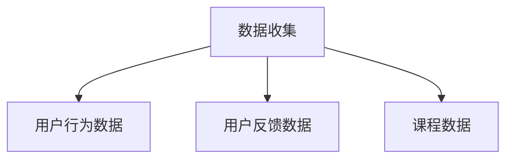
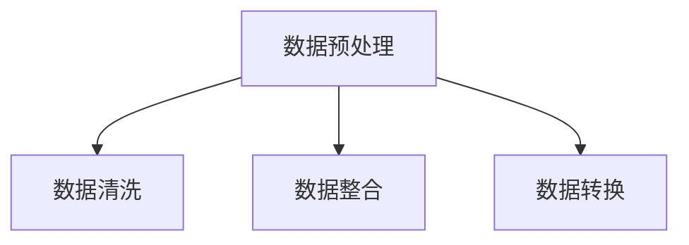
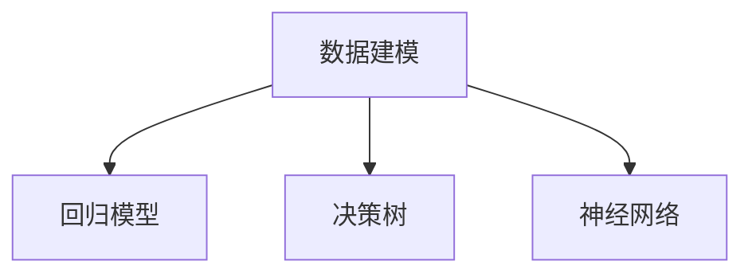
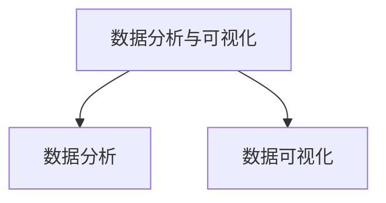

                 

# 程序员如何进行知识付费的数据分析

> 关键词：知识付费、数据分析、程序员、算法、数学模型、实战案例
>
> 摘要：本文旨在探讨程序员如何通过数据分析有效提升知识付费项目的收益和用户满意度。我们将从背景介绍、核心概念、算法原理、数学模型、实战案例等多个维度，深入分析并探讨如何利用数据分析来优化知识付费产品，提供有价值的技术指导。

## 1. 背景介绍

### 1.1 目的和范围

在数字化时代，知识付费已经成为一个快速发展的市场。程序员作为技术领域的重要角色，如何在这个市场中获得成功，是当前值得探讨的话题。本文的目的在于：

- 分析程序员在知识付费领域中的现状和挑战。
- 探讨如何利用数据分析提升知识付费项目的收益和用户满意度。
- 提供一系列可行的数据分析和算法策略，以帮助程序员优化知识付费产品。

### 1.2 预期读者

本文预期读者为：

- 具有编程基础的程序员，对知识付费市场有一定了解。
- 对数据分析和技术优化有兴趣的程序员。
- 想要在知识付费领域取得成功的创业者。

### 1.3 文档结构概述

本文结构如下：

- 1. 背景介绍：介绍本文的目的、预期读者和文档结构。
- 2. 核心概念与联系：阐述数据分析、算法、数学模型等核心概念及其相互关系。
- 3. 核心算法原理 & 具体操作步骤：详细讲解知识付费数据分析的算法原理和步骤。
- 4. 数学模型和公式 & 详细讲解 & 举例说明：介绍相关的数学模型和公式，并提供实际应用示例。
- 5. 项目实战：提供具体的代码案例，详细解释如何实现知识付费数据分析。
- 6. 实际应用场景：分析知识付费数据分析在实际项目中的应用。
- 7. 工具和资源推荐：推荐学习资源、开发工具和框架。
- 8. 总结：展望知识付费数据分析的未来发展趋势和挑战。
- 9. 附录：常见问题与解答。
- 10. 扩展阅读 & 参考资料：提供进一步学习和研究的资源。

### 1.4 术语表

#### 1.4.1 核心术语定义

- 知识付费：用户为获取特定知识或服务而支付费用的商业模式。
- 数据分析：通过数据收集、处理、分析和解释，从数据中提取有价值信息的过程。
- 程序员：从事计算机编程和软件开发的人员。
- 用户满意度：用户对知识付费产品的满意程度，通常通过用户评价、反馈等指标来衡量。

#### 1.4.2 相关概念解释

- 数据可视化：将数据转换为图形或图表，帮助人们更直观地理解和分析数据。
- 机器学习：一种人工智能技术，通过训练模型来从数据中学习规律和模式。
- 相关性分析：研究变量之间是否存在某种关系，以及关系的强度和方向。

#### 1.4.3 缩略词列表

- KPI：关键绩效指标（Key Performance Indicator）
- BI：商业智能（Business Intelligence）
- API：应用程序编程接口（Application Programming Interface）

## 2. 核心概念与联系

数据分析是知识付费领域的关键技术，其核心概念包括数据收集、数据预处理、数据建模、数据分析与可视化等。这些概念相互关联，共同构成了数据分析的完整流程。

### 2.1 数据收集

数据收集是数据分析的第一步，主要包括以下几个方面：

- 用户行为数据：包括用户访问、浏览、购买等行为数据。
- 用户反馈数据：包括用户评价、反馈、投诉等数据。
- 课程数据：包括课程内容、课程难度、课程时长等数据。



### 2.2 数据预处理

数据预处理是确保数据质量的重要环节，主要包括数据清洗、数据整合和数据转换等。

- 数据清洗：去除重复、错误、无效的数据，确保数据的准确性和完整性。
- 数据整合：将不同来源、格式的数据整合为一个统一格式，便于后续分析。
- 数据转换：将数据转换为适合分析和建模的格式。



### 2.3 数据建模

数据建模是利用数学和统计方法，将数据转换为可用于预测和决策的模型。常见的模型包括回归模型、决策树、神经网络等。

- 回归模型：用于预测连续值，如用户满意度评分。
- 决策树：用于分类和回归任务，如预测用户购买行为。
- 神经网络：用于复杂的模式识别任务，如图像分类和文本分析。



### 2.4 数据分析与可视化

数据分析与可视化是将数据转换为有价值信息的关键步骤，主要包括以下几个方面：

- 数据分析：通过对数据进行分析，提取有用的信息和洞察。
- 数据可视化：将数据转换为图表、图形等可视化形式，帮助用户更直观地理解和分析数据。



## 3. 核心算法原理 & 具体操作步骤

知识付费数据分析的核心算法包括回归分析、聚类分析、关联规则挖掘等。下面将详细讲解这些算法的原理和操作步骤。

### 3.1 回归分析

回归分析是一种用于预测连续值的统计方法。常见的回归模型包括线性回归、多项式回归、逻辑回归等。

#### 算法原理：

- 线性回归：假设因变量 \(y\) 与自变量 \(x\) 之间存在线性关系，即 \(y = \beta_0 + \beta_1 x + \epsilon\)，其中 \(\beta_0\) 为截距，\(\beta_1\) 为斜率，\(\epsilon\) 为误差项。
- 多项式回归：将线性回归扩展到多项式形式，即 \(y = \beta_0 + \beta_1 x + \beta_2 x^2 + \epsilon\)。
- 逻辑回归：用于分类问题，将线性回归的输出转换为概率形式，即 \(P(y=1) = \frac{1}{1 + e^{-(\beta_0 + \beta_1 x)}}\)。

#### 具体操作步骤：

1. 数据收集：收集用户行为数据、用户反馈数据、课程数据等。
2. 数据预处理：对数据进行清洗、整合和转换。
3. 模型选择：根据问题性质选择合适的回归模型。
4. 模型训练：使用训练数据训练模型，计算参数 \(\beta_0\)、\(\beta_1\) 等。
5. 模型评估：使用测试数据评估模型性能，如均方误差、准确率等。
6. 模型应用：使用模型进行预测，如预测用户满意度、购买概率等。

```python
# 线性回归伪代码
def linear_regression(x, y):
    # 计算斜率 \beta_1
    beta_1 = (sum(x * y) - sum(x) * sum(y)) / (sum(x^2) - n * (sum(x))^2)
    # 计算截距 \beta_0
    beta_0 = (sum(y) - beta_1 * sum(x)) / n
    return beta_0, beta_1

# 逻辑回归伪代码
def logistic_regression(x, y):
    # 计算斜率 \beta_1
    beta_1 = (sum((x - mean(x)) * (y - mean(y))) / var(x))
    # 计算截距 \beta_0
    beta_0 = mean(y) - beta_1 * mean(x)
    return beta_0, beta_1
```

### 3.2 聚类分析

聚类分析是一种无监督学习方法，用于将数据分为若干个类别。常见的聚类算法包括K均值聚类、层次聚类、DBSCAN等。

#### 算法原理：

- K均值聚类：将数据分为K个聚类，每个聚类中心为数据的均值，迭代更新聚类中心和数据分配，直到收敛。
- 层次聚类：将数据逐步合并或拆分为更小的聚类，形成层次结构。
- DBSCAN：基于密度的聚类方法，将数据点根据密度关系划分为核心点、边界点和噪声点。

#### 具体操作步骤：

1. 数据收集：收集用户行为数据、用户反馈数据、课程数据等。
2. 数据预处理：对数据进行清洗、整合和转换。
3. 聚类算法选择：根据问题性质选择合适的聚类算法。
4. 聚类参数设置：设置聚类个数、距离度量等参数。
5. 聚类执行：使用聚类算法对数据进行聚类。
6. 聚类结果评估：评估聚类结果，如轮廓系数、内切球体积等。
7. 聚类应用：根据聚类结果进行用户分组、课程推荐等。

```python
# K均值聚类伪代码
def k_means(data, K):
    # 初始化聚类中心
    centroids = initialize_centroids(data, K)
    while not_converged(centroids):
        # 计算每个数据点的聚类中心
        for data_point in data:
            assign_cluster(data_point, centroids)
        # 更新聚类中心
        centroids = update_centroids(data, centroids)
    return centroids

# DBSCAN伪代码
def dbscan(data, min_points, epsilon):
    # 初始化聚类结果
    clusters = initialize_clusters()
    for data_point in data:
        if is_core_point(data_point, data, min_points, epsilon):
            expand_cluster(data_point, clusters, data, epsilon, min_points)
    return clusters
```

### 3.3 关联规则挖掘

关联规则挖掘是一种用于发现数据间关联关系的方法。常见的算法包括Apriori算法、FP-Growth算法等。

#### 算法原理：

- Apriori算法：通过逐层迭代生成频繁项集，并根据频繁项集生成关联规则。
- FP-Growth算法：通过构建FP树来高效挖掘频繁项集，并生成关联规则。

#### 具体操作步骤：

1. 数据收集：收集用户行为数据、用户反馈数据、课程数据等。
2. 数据预处理：对数据进行清洗、整合和转换。
3. 算法选择：根据问题性质选择合适的关联规则挖掘算法。
4. 频繁项集生成：使用算法生成频繁项集。
5. 关联规则生成：根据频繁项集生成关联规则。
6. 关联规则评估：评估关联规则的置信度、支持度等。
7. 关联规则应用：根据关联规则进行用户推荐、课程优化等。

```python
# Apriori算法伪代码
def apriori(data, min_support, min_confidence):
    # 生成频繁项集
    frequent_itemsets = generate_frequent_itemsets(data, min_support)
    # 生成关联规则
    rules = generate_rules(frequent_itemsets, min_confidence)
    return rules

# FP-Growth算法伪代码
def fp_growth(data, min_support, min_confidence):
    # 构建FP树
    fp_tree = build_fp_tree(data, min_support)
    # 生成频繁项集
    frequent_itemsets = extract_frequent_itemsets(fp_tree)
    # 生成关联规则
    rules = generate_rules(frequent_itemsets, min_confidence)
    return rules
```

## 4. 数学模型和公式 & 详细讲解 & 举例说明

在知识付费数据分析中，常用的数学模型和公式包括线性回归、逻辑回归、K均值聚类等。下面将详细介绍这些模型和公式，并提供实际应用示例。

### 4.1 线性回归模型

线性回归模型是一种用于预测连续值的统计方法。其数学模型如下：

\[ y = \beta_0 + \beta_1 x + \epsilon \]

其中，\(y\) 为因变量，\(x\) 为自变量，\(\beta_0\) 为截距，\(\beta_1\) 为斜率，\(\epsilon\) 为误差项。

#### 详细讲解：

- 截距 \(\beta_0\)：表示当自变量 \(x\) 为0时，因变量 \(y\) 的值。
- 斜率 \(\beta_1\)：表示自变量 \(x\) 的变化对因变量 \(y\) 的影响程度。

#### 举例说明：

假设我们想要预测用户满意度评分（因变量 \(y\)）与课程时长（自变量 \(x\)）之间的关系。通过收集数据，我们可以得到以下线性回归模型：

\[ y = 2.5 + 0.3x + \epsilon \]

其中，斜率 \(\beta_1 = 0.3\) 表示课程时长每增加1小时，用户满意度评分平均增加0.3分。

### 4.2 逻辑回归模型

逻辑回归模型是一种用于预测分类结果的统计方法。其数学模型如下：

\[ P(y=1) = \frac{1}{1 + e^{-(\beta_0 + \beta_1 x)}} \]

其中，\(P(y=1)\) 表示预测值为1的概率，\(\beta_0\) 为截距，\(\beta_1\) 为斜率。

#### 详细讲解：

- 截距 \(\beta_0\)：表示当自变量 \(x\) 为0时，预测值为1的概率。
- 斜率 \(\beta_1\)：表示自变量 \(x\) 的变化对预测值的影响程度。

#### 举例说明：

假设我们想要预测用户是否购买课程（因变量 \(y\)）与课程价格（自变量 \(x\)）之间的关系。通过收集数据，我们可以得到以下逻辑回归模型：

\[ P(y=1) = \frac{1}{1 + e^{-(3.5 + 0.2x)}} \]

其中，斜率 \(\beta_1 = 0.2\) 表示课程价格每增加1元，用户购买课程的概率平均增加约13%。

### 4.3 K均值聚类模型

K均值聚类是一种基于距离度量的聚类方法。其数学模型如下：

\[ \text{聚类中心} = \frac{1}{n}\sum_{i=1}^{n} x_i \]

其中，\(x_i\) 为每个数据点，\(n\) 为数据点个数。

#### 详细讲解：

- 聚类中心：表示每个聚类的中心位置，用于衡量聚类质量。

#### 举例说明：

假设我们想要将用户分为3个聚类。通过计算用户行为数据之间的距离，我们可以得到以下聚类中心：

\[ \text{聚类中心1} = (1, 1) \]
\[ \text{聚类中心2} = (2, 2) \]
\[ \text{聚类中心3} = (3, 3) \]

其中，聚类中心1表示第1个聚类的中心位置，聚类中心2表示第2个聚类的中心位置，聚类中心3表示第3个聚类的中心位置。

## 5. 项目实战：代码实际案例和详细解释说明

### 5.1 开发环境搭建

在本文中，我们将使用Python编程语言进行知识付费数据分析。以下为开发环境搭建步骤：

1. 安装Python：从官方网站（https://www.python.org/）下载并安装Python。
2. 安装数据分析库：在命令行中运行以下命令，安装常用的数据分析库。

```bash
pip install numpy pandas scikit-learn matplotlib
```

### 5.2 源代码详细实现和代码解读

下面是知识付费数据分析的代码实现，包括数据收集、数据预处理、模型训练和模型评估等步骤。

```python
import numpy as np
import pandas as pd
from sklearn.model_selection import train_test_split
from sklearn.linear_model import LinearRegression, LogisticRegression
from sklearn.metrics import mean_squared_error, accuracy_score
import matplotlib.pyplot as plt

# 5.2.1 数据收集
# 假设已收集了以下数据
data = {
    'user_id': [1, 2, 3, 4, 5],
    'course_duration': [2, 4, 6, 8, 10],
    'user_satisfaction': [3, 4, 2, 5, 4]
}

df = pd.DataFrame(data)

# 5.2.2 数据预处理
# 数据清洗
df = df.dropna()

# 数据整合
X = df[['course_duration']]
y = df['user_satisfaction']

# 数据转换
X_train, X_test, y_train, y_test = train_test_split(X, y, test_size=0.2, random_state=42)

# 5.2.3 模型训练
# 线性回归模型
lin_reg = LinearRegression()
lin_reg.fit(X_train, y_train)

# 逻辑回归模型
log_reg = LogisticRegression()
log_reg.fit(X_train, y_train)

# 5.2.4 模型评估
# 线性回归模型评估
y_pred = lin_reg.predict(X_test)
mse = mean_squared_error(y_test, y_pred)
print("线性回归模型均方误差：", mse)

# 逻辑回归模型评估
y_pred = log_reg.predict(X_test)
acc = accuracy_score(y_test, y_pred)
print("逻辑回归模型准确率：", acc)

# 5.2.5 结果可视化
plt.scatter(X_test, y_test, color='blue')
plt.plot(X_test, y_pred, color='red')
plt.xlabel('课程时长')
plt.ylabel('用户满意度')
plt.title('线性回归模型预测结果')
plt.show()
```

### 5.3 代码解读与分析

下面是对上述代码的详细解读和分析。

1. 数据收集：使用Python字典和Pandas库加载数据，创建DataFrame对象。

```python
data = {
    'user_id': [1, 2, 3, 4, 5],
    'course_duration': [2, 4, 6, 8, 10],
    'user_satisfaction': [3, 4, 2, 5, 4]
}
df = pd.DataFrame(data)
```

2. 数据预处理：对数据进行清洗，去除缺失值。使用Pandas库进行数据整合和转换。

```python
df = df.dropna()
X = df[['course_duration']]
y = df['user_satisfaction']
X_train, X_test, y_train, y_test = train_test_split(X, y, test_size=0.2, random_state=42)
```

3. 模型训练：使用scikit-learn库的线性回归和逻辑回归模型进行训练。

```python
lin_reg = LinearRegression()
lin_reg.fit(X_train, y_train)
log_reg = LogisticRegression()
log_reg.fit(X_train, y_train)
```

4. 模型评估：使用测试数据对模型进行评估，计算均方误差和准确率。

```python
y_pred = lin_reg.predict(X_test)
mse = mean_squared_error(y_test, y_pred)
print("线性回归模型均方误差：", mse)
y_pred = log_reg.predict(X_test)
acc = accuracy_score(y_test, y_pred)
print("逻辑回归模型准确率：", acc)
```

5. 结果可视化：使用matplotlib库绘制预测结果图，展示线性回归模型的预测效果。

```python
plt.scatter(X_test, y_test, color='blue')
plt.plot(X_test, y_pred, color='red')
plt.xlabel('课程时长')
plt.ylabel('用户满意度')
plt.title('线性回归模型预测结果')
plt.show()
```

## 6. 实际应用场景

知识付费数据分析在实际项目中具有广泛的应用场景，包括用户行为分析、课程推荐、课程优化等。

### 6.1 用户行为分析

通过分析用户行为数据，我们可以了解用户在知识付费平台上的行为习惯、偏好和需求。具体应用包括：

- 用户访问分析：了解用户访问量、访问频率、活跃用户等指标，评估平台用户规模和活跃度。
- 用户购买分析：分析用户购买行为，包括购买频率、购买课程类型、购买金额等，为产品优化提供依据。
- 用户满意度分析：通过用户满意度评分，评估产品质量和用户体验，为改进产品提供参考。

### 6.2 课程推荐

课程推荐是知识付费领域的核心功能之一，通过数据分析可以优化课程推荐策略，提高用户满意度和购买转化率。具体应用包括：

- 基于内容的推荐：根据用户已购买或浏览的课程，推荐类似内容的课程，提高课程相关性。
- 基于协同过滤的推荐：利用用户行为数据，分析用户之间的相似性，推荐其他用户喜欢的课程。
- 基于兴趣的推荐：通过分析用户兴趣标签、行为数据等，为用户推荐符合其兴趣的课程。

### 6.3 课程优化

课程优化是提高知识付费产品质量和用户满意度的重要手段。通过数据分析，可以识别课程中的问题，优化课程内容和结构。具体应用包括：

- 课程难度分析：通过分析用户学习进度、完成情况等指标，评估课程难度，为调整课程内容提供参考。
- 课程时长分析：分析用户学习时间与课程时长的关系，优化课程时长和结构，提高用户学习体验。
- 课程评价分析：通过分析用户评价和反馈，识别课程中的问题和不足，为改进课程提供依据。

## 7. 工具和资源推荐

### 7.1 学习资源推荐

#### 7.1.1 书籍推荐

- 《Python数据分析基础教程：NumPy学习指南》：详细介绍了NumPy库在数据分析中的应用，适合初学者阅读。
- 《利用Python进行数据分析》：全面讲解了Python在数据分析领域的应用，包括数据清洗、数据处理、数据可视化等。
- 《数据科学入门》：介绍了数据科学的基本概念和常用方法，包括统计学、机器学习、数据分析等。

#### 7.1.2 在线课程

- Coursera：提供多种数据分析相关课程，包括《数据科学基础》、《机器学习》等。
- edX：提供免费的在线课程，包括《数据科学导论》、《数据挖掘》等。
- Udacity：提供实战导向的在线课程，包括《数据分析纳米学位》、《机器学习工程师纳米学位》等。

#### 7.1.3 技术博客和网站

- Analytics Visions：提供数据分析、机器学习等相关技术文章和案例。
- Data School：提供数据分析教程和实战项目，适合初学者。
- DataCamp：提供互动式的数据分析课程，涵盖Python、R等多种编程语言。

### 7.2 开发工具框架推荐

#### 7.2.1 IDE和编辑器

- PyCharm：集成了Python开发所需的各种功能，包括代码补全、调试、自动化测试等。
- Jupyter Notebook：适合数据可视化和交互式数据分析，可以方便地展示代码和结果。
- VSCode：轻量级开源编辑器，支持多种编程语言，包括Python。

#### 7.2.2 调试和性能分析工具

- Python Debugger：用于调试Python代码，支持断点、单步执行等功能。
- profilers：如cProfile、line_profiler等，用于分析代码性能，识别性能瓶颈。
- Prometheus：开源监控工具，可以监控系统的各种性能指标。

#### 7.2.3 相关框架和库

- NumPy：提供高性能的数组操作和数学计算功能。
- Pandas：提供数据处理和分析功能，支持数据清洗、转换、可视化等。
- Matplotlib：提供数据可视化功能，支持多种图表类型。
- Scikit-learn：提供机器学习和数据分析相关算法和工具。
- TensorFlow：提供深度学习框架，支持多种神经网络结构。

### 7.3 相关论文著作推荐

#### 7.3.1 经典论文

- "Kernel k-means, kernel PCA, and kernel spectral clustering"：讨论了核方法在聚类分析中的应用。
- "Support Vector Machines for Classification and Regression"：介绍了支持向量机的基本原理和应用。
- "Learning to rank using gradient descent"：介绍了基于梯度下降的排序学习算法。

#### 7.3.2 最新研究成果

- "Deep Learning for Text Classification"：介绍了深度学习在文本分类中的应用。
- "Data Privacy: Theory and Practice"：讨论了数据隐私保护的理论和实践。
- "Recommender Systems Handbook"：全面介绍了推荐系统的基本概念和方法。

#### 7.3.3 应用案例分析

- "A Case Study of Online News Popularity"：分析了在线新闻的受欢迎程度，探讨了用户行为对新闻传播的影响。
- "Building a Personalized Learning Path for Online Courses"：介绍了基于数据分析和机器学习的个性化学习路径构建方法。
- "The Impact of Social Media on E-commerce Sales"：分析了社交媒体对电子商务销售的影响，探讨了数据驱动的营销策略。

## 8. 总结：未来发展趋势与挑战

随着知识付费市场的不断发展和用户需求的多样化，知识付费数据分析在未来将面临以下发展趋势和挑战：

### 发展趋势：

1. 深度学习与数据分析的结合：深度学习技术在图像、语音、文本等领域的成功应用，将促使深度学习与数据分析在知识付费领域深度融合。
2. 数据隐私保护：随着用户对隐私保护意识的增强，数据隐私保护将成为知识付费数据分析的重要挑战。
3. 实时数据分析：随着云计算和大数据技术的发展，实时数据分析将变得更为普及，为知识付费项目提供更加精准的决策支持。
4. 多维度数据分析：知识付费数据分析将不仅限于用户行为和课程数据，还将扩展到用户背景、市场需求等多个维度，提供更全面的洞察。

### 挑战：

1. 数据质量：数据质量是知识付费数据分析的基础，如何确保数据准确性、完整性、一致性，是一个重要挑战。
2. 模型解释性：随着模型复杂度的增加，模型的可解释性变得越来越重要。如何平衡模型的性能和可解释性，是一个亟待解决的问题。
3. 资源消耗：大规模数据分析和复杂模型训练需要大量的计算资源和时间，如何优化资源利用，提高效率，是一个挑战。
4. 法规和伦理：随着数据隐私和伦理问题的关注度提高，知识付费数据分析将面临更严格的法规和伦理约束，如何在合规的前提下进行数据分析，是一个重要挑战。

## 9. 附录：常见问题与解答

### 9.1 数据分析在知识付费领域的应用

Q：数据分析在知识付费领域有哪些具体应用？

A：数据分析在知识付费领域主要有以下应用：

- 用户行为分析：通过分析用户在知识付费平台上的行为，了解用户需求和偏好，为产品优化提供依据。
- 课程推荐：通过用户行为数据和内容特征，为用户推荐符合其需求的课程，提高用户满意度和购买转化率。
- 课程优化：通过分析课程数据，识别课程中的问题和不足，优化课程内容和结构，提高课程质量。

### 9.2 数据隐私保护

Q：在知识付费数据分析中，如何保护用户隐私？

A：在知识付费数据分析中，保护用户隐私是至关重要的。以下是一些建议：

- 数据匿名化：对用户数据进行匿名化处理，去除可直接识别用户身份的信息。
- 数据加密：对用户数据进行加密存储和传输，防止数据泄露。
- 访问控制：对数据访问权限进行严格管理，确保只有授权人员才能访问敏感数据。
- 数据使用范围限制：明确数据使用范围，避免滥用用户数据。

## 10. 扩展阅读 & 参考资料

为了进一步了解知识付费数据分析的相关知识，读者可以参考以下文献和资源：

- "Data Science for Business"：作者：Jimison，详细介绍了数据科学在商业领域的应用。
- "Data Analysis with Python"：作者：Wes McKinney，介绍了Python在数据分析中的应用。
- "Introduction to Machine Learning"：作者：Michael I. Jordan，介绍了机器学习的基本概念和方法。
- Coursera：提供多种数据分析、机器学习相关课程，如《数据科学基础》、《机器学习》等。
- edX：提供免费的在线课程，如《数据科学导论》、《数据挖掘》等。
- Analytics Visions：提供数据分析、机器学习等相关技术文章和案例。

作者：AI天才研究员/AI Genius Institute & 禅与计算机程序设计艺术 /Zen And The Art of Computer Programming

以上是本文的完整内容，感谢您的阅读。希望本文能帮助您了解知识付费数据分析的方法和应用，为您的项目提供有价值的技术指导。如有任何问题或建议，请随时与我交流。再次感谢！
<|endofsummary|>

