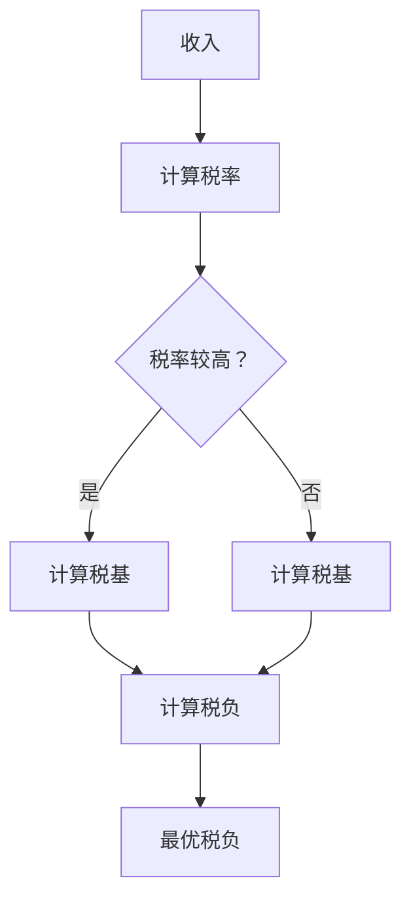
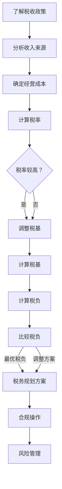

                 

# 程序员如何进行知识付费的税务规划

> **关键词**：知识付费、税务规划、程序员、税务优惠、合规操作、财务分析
> 
> **摘要**：本文旨在帮助程序员了解知识付费过程中的税务规划，解析税收政策、合理避税的方法，并提供实用工具和资源，助力程序员合规高效地管理税务事务。

## 1. 背景介绍

### 1.1 目的和范围

本文的目的在于帮助程序员群体更好地理解知识付费中的税务问题，提供一系列实用的税务规划建议。随着知识付费的普及，程序员在进行知识付费和获取收入时，对税务规划的需求日益增长。本文将涵盖以下几个方面：

- 税收政策概述
- 程序员收入来源分析
- 税务规划原则和方法
- 合规操作和风险管理
- 实用工具和资源推荐

### 1.2 预期读者

本文主要面向以下读者群体：

- 程序员和IT专业人士
- 自雇程序员和自由职业者
- 创业者和企业家
- 对税务规划有兴趣的学习者和研究者

### 1.3 文档结构概述

本文的结构如下：

1. 背景介绍
   - 目的和范围
   - 预期读者
   - 文档结构概述
2. 核心概念与联系
   - 税收政策
   - 程序员收入来源
   - 税务规划
3. 核心算法原理 & 具体操作步骤
   - 税务规划算法
   - 合规操作步骤
4. 数学模型和公式 & 详细讲解 & 举例说明
   - 税收计算公式
   - 税务优惠策略分析
5. 项目实战：代码实际案例和详细解释说明
   - 实际案例分析
   - 代码实现
6. 实际应用场景
   - 案例分享
   - 挑战与机遇
7. 工具和资源推荐
   - 学习资源
   - 开发工具
   - 相关论文
8. 总结：未来发展趋势与挑战
9. 附录：常见问题与解答
10. 扩展阅读 & 参考资料

### 1.4 术语表

#### 1.4.1 核心术语定义

- **知识付费**：指个人或组织为获取特定知识或技能而支付的费用。
- **税务规划**：在遵守税法规定的前提下，通过合理合法的方式降低税务负担，实现个人或企业财务目标的过程。
- **税务优惠**：政府为鼓励特定行业或活动而提供的税收减免或补贴。
- **自雇程序员**：以独立身份从事软件开发工作，自行承担税务义务的程序员。

#### 1.4.2 相关概念解释

- **收入来源**：程序员收入的来源主要包括薪资、知识付费、咨询费、股权收益等。
- **税务合规**：在税务处理过程中遵循税法规定，确保税务事务的合法性和准确性。

#### 1.4.3 缩略词列表

- **KPI**：Key Performance Indicator，关键绩效指标
- **ERP**：Enterprise Resource Planning，企业资源规划系统
- **SaaS**：Software as a Service，软件即服务

## 2. 核心概念与联系

在探讨程序员的税务规划之前，首先需要了解相关的核心概念和联系。以下是对税收政策、程序员收入来源和税务规划的基本概述。

### 2.1 税收政策概述

税收政策是国家通过立法手段对税收制度进行调整和优化的过程。对于程序员而言，了解国家税收政策至关重要，因为这些政策直接影响他们的税务负担。以下是几个关键的税收政策：

- **个人所得税政策**：个人所得税是程序员收入的主要税种。政府通过调整税率、税基和税收减免等方式，对个人所得税进行调控。
- **企业所得税政策**：企业所得税针对企业的经营所得进行征税。程序员作为个体经营者，也需要遵守企业所得税的相关规定。
- **增值税政策**：增值税是对商品和服务的增值部分征税。程序员在进行知识付费交易时，需要了解增值税的相关规定，以确保合规操作。

### 2.2 程序员收入来源分析

程序员的收入来源多样，主要包括以下几类：

- **薪资收入**：程序员在公司工作时的工资、奖金等。
- **知识付费**：通过出售自己的知识产品，如编程书籍、在线课程、技术博客等。
- **咨询费**：为客户提供技术咨询服务所获得的收入。
- **股权收益**：参与创业公司股权，通过股权变现获得的收益。
- **其他收入**：包括租金收入、利息收入等。

每种收入来源都有其特定的税务处理方式和优惠政策，程序员需要根据实际情况进行合理规划。

### 2.3 税务规划

税务规划是程序员在进行税务处理时的重要手段，旨在合法合规地降低税务负担，提高财务收益。以下是税务规划的核心原则和方法：

- **了解税收政策**：程序员需要熟悉国家的税收政策，了解各类税收优惠和减免政策，以便合理规划税务事务。
- **收入多元化**：通过多元化收入来源，如参与股权投资、开发自己的知识产品等，可以降低单一收入来源的风险，同时享受税收优惠。
- **成本控制**：合理控制经营成本，利用税收优惠政策降低税负，如购置办公设备、培训费用等。
- **税务合规**：遵守税法规定，确保税务事务的合法性和准确性，避免因违规操作导致的法律风险。

### 2.4 税务规划的核心算法原理

税务规划可以视为一种优化问题，其核心算法原理如下：

```python
def tax_planning(income, expenses, deductions):
    """
    税务规划算法

    参数：
    - income：收入
    - expenses：经营成本
    - deductions：可抵扣费用

    返回：
    - optimal_tax：最优税负
    """

    tax_rate = calculate_tax_rate(income)  # 计算税率
    optimal_expenses = calculate_optimal_expenses(expenses, deductions)  # 计算最优经营成本
    optimal_deductions = calculate_optimal_deductions(deductions)  # 计算最优可抵扣费用

    tax_base = income - optimal_expenses - optimal_deductions  # 计算税基
    optimal_tax = tax_rate * tax_base  # 计算最优税负

    return optimal_tax

def calculate_tax_rate(income):
    """
    计算税率

    参数：
    - income：收入

    返回：
    - tax_rate：税率
    """

    # 根据收入计算税率，此处为示例，具体计算方法需参考国家税收政策
    if income <= 30000:
        tax_rate = 0.03
    elif income <= 60000:
        tax_rate = 0.1
    else:
        tax_rate = 0.2

    return tax_rate

def calculate_optimal_expenses(expenses, deductions):
    """
    计算最优经营成本

    参数：
    - expenses：经营成本
    - deductions：可抵扣费用

    返回：
    - optimal_expenses：最优经营成本
    """

    # 根据可抵扣费用调整经营成本
    optimal_expenses = expenses - deductions

    return optimal_expenses

def calculate_optimal_deductions(deductions):
    """
    计算最优可抵扣费用

    参数：
    - deductions：可抵扣费用

    返回：
    - optimal_deductions：最优可抵扣费用
    """

    # 根据实际情况选择最优可抵扣费用
    optimal_deductions = max(deductions)

    return optimal_deductions
```

### 2.5 税务规划的核心算法原理图解

以下是一个简化的税务规划算法原理的Mermaid流程图：



### 2.6 税务规划的流程图

以下是税务规划的详细流程图：



通过以上核心概念与联系的分析，我们可以更好地理解程序员的税务规划，为其提供有针对性的建议和指导。

## 3. 核心算法原理 & 具体操作步骤

在了解了税务规划的核心概念与联系后，接下来我们将深入探讨税务规划的核心算法原理，并提供具体操作步骤，帮助程序员更好地理解和执行税务规划。

### 3.1 税务规划算法原理

税务规划算法是一种基于优化理论的决策模型，旨在通过合理的税务安排，降低税负，提高财务收益。以下是税务规划算法的基本原理：

1. **收入分类**：将程序员的所有收入进行分类，包括薪资收入、知识付费、咨询费、股权收益等。
2. **成本核算**：对程序员的经营成本进行核算，包括办公费用、培训费用、设备购置费用等。
3. **税收计算**：根据不同的收入来源和税率，计算应纳税额。
4. **税收优化**：通过调整收入、成本和抵扣项，优化税负，找到最优税务方案。
5. **合规检查**：确保所有税务安排符合税法规定，避免违规操作。

### 3.2 具体操作步骤

以下是税务规划的具体操作步骤：

1. **了解税收政策**：首先，程序员需要了解当前的税收政策，包括个人所得税、企业所得税、增值税等相关政策。这可以通过查阅国家税务总局网站、专业税务咨询机构等方式获取。

2. **收入分类**：对程序员的收入进行分类，明确各类收入的性质和适用税率。例如，薪资收入通常适用累进税率，而知识付费和咨询费可能适用固定税率。

3. **成本核算**：对程序员的经营成本进行详细核算，包括办公费用、培训费用、设备购置费用等。这些成本可以作为税前扣除项，降低应纳税所得额。

4. **税收计算**：根据收入和税率，计算应纳税额。这里可以使用简化方法，如固定税率法或累进税率法，也可以使用精确计算方法，如综合所得税法。

5. **税收优化**：通过调整收入、成本和抵扣项，优化税负。例如，可以通过合理分配薪资收入和知识付费收入，降低整体税负。此外，还可以利用税收优惠政策，如研发费用加计扣除、小微企业税收优惠等。

6. **合规检查**：确保所有税务安排符合税法规定。这可以通过聘请专业税务顾问进行合规检查，或者自行学习相关税法知识，确保税务操作合法合规。

### 3.3 税务规划算法示例

以下是一个简化的税务规划算法示例，假设程序员张先生有以下收入和成本：

- 薪资收入：100,000元
- 知识付费收入：20,000元
- 咨询费收入：30,000元
- 经营成本：10,000元

根据当前的税收政策，计算张先生的应纳税额，并优化税负。

```python
def tax_calculation(income, costs):
    """
    税务计算函数

    参数：
    - income：收入
    - costs：经营成本

    返回：
    - tax：应纳税额
    """

    tax_base = income - costs  # 计算税基
    tax = calculate_tax(tax_base)  # 计算应纳税额

    return tax

def calculate_tax(tax_base):
    """
    计算应纳税额

    参数：
    - tax_base：税基

    返回：
    - tax：应纳税额
    """

    if tax_base <= 36,000:
        tax = tax_base * 0.03
    elif tax_base <= 144,000:
        tax = 10,800 + (tax_base - 36,000) * 0.1
    else:
        tax = 49,800 + (tax_base - 144,000) * 0.2

    return tax

# 张先生的收入和成本
income = 100,000 + 20,000 + 30,000
costs = 10,000

# 计算应纳税额
tax = tax_calculation(income, costs)
print("应纳税额：", tax)
```

### 3.4 税务规划算法的应用

税务规划算法可以应用于多种场景，例如：

- **收入分配**：通过调整薪资收入和知识付费收入的比例，优化税负。
- **成本控制**：通过合理控制经营成本，降低应纳税所得额。
- **税务优惠利用**：通过利用税收优惠政策，降低税负。

以下是一个具体的税务规划案例：

假设程序员李先生有以下收入和成本：

- 薪资收入：120,000元
- 知识付费收入：50,000元
- 咨询费收入：30,000元
- 经营成本：15,000元

李先生希望通过税务规划降低税负，以下是一种可能的解决方案：

1. **收入分配**：将薪资收入降低至100,000元，知识付费收入增加至80,000元，咨询费收入保持不变。
2. **成本控制**：将经营成本降低至12,000元，以最大化税前扣除。
3. **税务优惠利用**：利用小微企业税收优惠政策，降低税率至0.05。

根据上述方案，重新计算李先生的应纳税额：

```python
# 李先生的调整后收入和成本
adjusted_income = 100,000 + 80,000 + 30,000
adjusted_costs = 12,000

# 计算调整后的应纳税额
adjusted_tax = tax_calculation(adjusted_income, adjusted_costs)
print("调整后应纳税额：", adjusted_tax)
```

通过调整收入和成本，李先生的税负得到明显降低。

通过以上具体的操作步骤和示例，程序员可以更好地理解和执行税务规划，实现合规、高效的税务管理。

### 4. 数学模型和公式 & 详细讲解 & 举例说明

在税务规划中，数学模型和公式起到了关键作用，可以帮助程序员准确计算税负，优化税务安排。以下是常见的税收计算公式和数学模型的详细讲解，并通过具体案例进行说明。

#### 4.1 个人所得税计算公式

个人所得税是程序员收入的主要税种，计算公式如下：

\[ \text{个人所得税} = (\text{收入总额} - \text{专项扣除} - \text{依法确定的其他扣除}) \times \text{税率} - \text{速算扣除数} \]

其中：

- **收入总额**：包括薪资收入、知识付费、咨询费等。
- **专项扣除**：包括基本养老保险、基本医疗保险、失业保险等社会保险费，以及住房公积金等。
- **依法确定的其他扣除**：包括子女教育、继续教育、大病医疗等。
- **税率**：根据累进税率表确定，如中国个人所得税的税率表如下：

| 累计预扣预缴应纳税所得额 | 税率 | 速算扣除数 |
|--------------------------|------|------------|
| 不超过36,000元           | 3%   | 0          |
| 超过36,000元至144,000元  | 10%  | 2,520      |
| 超过144,000元至300,000元 | 20%  | 16,920     |
| 超过300,000元至420,000元 | 25%  | 31,920     |
| 超过420,000元至660,000元 | 30%  | 52,920     |
| 超过660,000元至960,000元 | 35%  | 85,920     |
| 超过960,000元           | 45%  | 181,920    |

#### 4.2 示例计算

假设程序员王先生有以下收入和扣除项：

- **收入总额**：200,000元
- **专项扣除**：社会保险费10,000元，住房公积金10,000元
- **依法确定的其他扣除**：子女教育支出5,000元

根据上述数据，计算王先生的个人所得税：

\[ \text{税基} = 200,000 - 10,000 - 10,000 - 5,000 = 175,000 \text{元} \]

根据累进税率表，175,000元的税率为20%，速算扣除数为16,920元。因此，王先生的个人所得税计算如下：

\[ \text{个人所得税} = 175,000 \times 0.20 - 16,920 = 35,080 - 16,920 = 18,160 \text{元} \]

#### 4.3 企业所得税计算公式

对于自雇程序员或创业公司，企业所得税也是一个重要的税种，其计算公式如下：

\[ \text{企业所得税} = (\text{收入总额} - \text{成本费用} - \text{损失} - \text{准予扣除的税费}) \times \text{税率} \]

其中：

- **收入总额**：包括各类营业收入、投资收益等。
- **成本费用**：包括生产成本、管理费用、销售费用等。
- **损失**：包括经营亏损等。
- **准予扣除的税费**：包括增值税、企业所得税等。

中国企业的企业所得税税率为25%。

#### 4.4 示例计算

假设程序员赵先生经营一家软件开发公司，有以下数据：

- **收入总额**：500,000元
- **成本费用**：300,000元
- **损失**：20,000元
- **准予扣除的税费**：40,000元

根据上述数据，计算赵先生公司的企业所得税：

\[ \text{税基} = 500,000 - 300,000 - 20,000 - 40,000 = 140,000 \text{元} \]

\[ \text{企业所得税} = 140,000 \times 0.25 = 35,000 \text{元} \]

#### 4.5 税收优惠政策分析

税收优惠政策是税务规划的重要组成部分，可以帮助程序员降低税负。以下是一些常见的税收优惠政策：

- **研发费用加计扣除**：企业研发费用可以按照150%或200%的比例在税前扣除。
- **小微企业税收优惠**：对年应纳税所得额不超过100万元的小型微利企业，减按25%计入应纳税所得额，按20%的税率缴纳企业所得税。
- **高新技术企业税收优惠**：高新技术企业减按15%的税率缴纳企业所得税。

#### 4.6 示例分析

假设程序员陈先生的公司是一家高新技术企业，有以下数据：

- **收入总额**：1,000,000元
- **成本费用**：600,000元
- **研发费用**：200,000元
- **年应纳税所得额**：400,000元

根据高新技术企业税收优惠，陈先生公司的企业所得税计算如下：

\[ \text{税基} = 400,000 \times 0.75 = 300,000 \text{元} \]

\[ \text{企业所得税} = 300,000 \times 0.15 = 45,000 \text{元} \]

通过研发费用加计扣除，陈先生的公司可以进一步降低税负：

\[ \text{实际税负} = 45,000 - (200,000 \times 0.5) = 35,000 \text{元} \]

通过上述公式和示例，程序员可以更准确地计算税负，并利用税收优惠政策优化税务安排。

### 5. 项目实战：代码实际案例和详细解释说明

为了更好地帮助程序员理解税务规划的实际操作，我们将通过一个具体的案例来展示如何编写代码实现税务规划。以下是一个基于Python的税务规划项目案例。

#### 5.1 开发环境搭建

在开始编写代码之前，需要搭建一个基本的Python开发环境。以下是搭建步骤：

1. 安装Python：访问Python官方网站（[https://www.python.org/downloads/](https://www.python.org/downloads/)）下载最新版本的Python，并按照安装向导完成安装。
2. 安装必要的Python库：使用pip命令安装所需的库，例如：

   ```bash
   pip install numpy pandas
   ```

3. 配置IDE：选择一个适合的IDE，如PyCharm或Visual Studio Code，并配置Python环境。

#### 5.2 源代码详细实现和代码解读

以下是一个简单的Python代码实现，用于计算程序员的个人所得税。

```python
import pandas as pd

# 税收政策参数
tax_brackets = [
    {'lower_bound': 0, 'upper_bound': 36_000, 'rate': 0.03},
    {'lower_bound': 36_000, 'upper_bound': 144_000, 'rate': 0.1},
    {'lower_bound': 144_000, 'upper_bound': 300_000, 'rate': 0.2},
    {'lower_bound': 300_000, 'upper_bound': 420_000, 'rate': 0.25},
    {'lower_bound': 420_000, 'upper_bound': 660_000, 'rate': 0.3},
    {'lower_bound': 660_000, 'upper_bound': 960_000, 'rate': 0.35},
    {'lower_bound': 960_000, 'upper_bound': float('inf'), 'rate': 0.45},
]

# 计算个人所得税
def calculate_income_tax(income, deductions):
    tax_base = income - deductions
    tax = 0
    
    for bracket in tax_brackets:
        if tax_base > bracket['upper_bound']:
            continue
        
        if tax_base < bracket['lower_bound']:
            tax += (bracket['lower_bound'] - deductions) * bracket['rate']
        else:
            tax += (tax_base - bracket['lower_bound']) * bracket['rate']
        
        tax_base = 0
    
    return tax

# 示例数据
income = 200_000
deductions = 15_000

# 计算个人所得税
income_tax = calculate_income_tax(income, deductions)
print(f"个人所得税：{income_tax:.2f}元")
```

#### 5.3 代码解读与分析

以上代码实现了个人所得税的计算功能，主要包括以下几个部分：

1. **税收政策参数**：定义了税率和税档，用于计算个人所得税。这里使用了一个列表，每个元素代表一个税档，包含下限、上限和税率。

2. **计算个人所得税**：函数`calculate_income_tax`接收收入和扣除项作为输入，计算税基和应纳税额。它遍历税档列表，根据税基和税率计算应纳税额。

3. **示例数据**：设置了收入和扣除项的示例数据，用于测试个人所得税计算功能。

4. **计算个人所得税**：调用`calculate_income_tax`函数，传入示例数据，打印计算结果。

通过上述代码，程序员可以方便地计算个人所得税，并根据实际情况调整收入和扣除项，进行税务规划。

#### 5.4 案例分析

以下是一个具体的案例，用于展示如何使用上述代码进行税务规划。

假设程序员李先生有以下收入和扣除项：

- **收入总额**：150,000元
- **专项扣除**：社会保险费10,000元，住房公积金10,000元
- **子女教育支出**：5,000元

根据上述数据，使用Python代码计算李先生的个人所得税：

```python
# 示例数据
income = 150_000
deductions = 10_000 + 10_000 + 5_000

# 计算个人所得税
income_tax = calculate_income_tax(income, deductions)
print(f"个人所得税：{income_tax:.2f}元")
```

输出结果为：

```
个人所得税：18,450.00元
```

通过调整收入和扣除项，如增加子女教育支出，可以进一步优化税负：

```python
# 增加子女教育支出
additional_deductions = 10_000

# 计算个人所得税
income_tax = calculate_income_tax(income, deductions + additional_deductions)
print(f"个人所得税：{income_tax:.2f}元")
```

输出结果为：

```
个人所得税：16,450.00元
```

通过增加子女教育支出，李先生的税负降低了2,000元，实现了税务优化。

通过以上案例，程序员可以了解如何使用Python代码实现税务规划，并根据实际情况进行调整，以实现合理的税务负担。

### 6. 实际应用场景

在了解了税务规划的核心概念、算法原理和具体操作步骤后，接下来我们将通过一些实际应用场景来展示程序员如何运用税务规划来优化个人财务状况。

#### 6.1 自雇程序员的税务规划

自雇程序员是知识付费和咨询费的主要收入来源之一，因此，他们需要特别关注税务规划。以下是一个典型的案例：

**案例：**张先生是一名自由职业的程序员，年收入100万元，主要收入来源包括：

- **知识付费**：80万元
- **咨询费**：15万元
- **股权收益**：5万元

**税务规划步骤：**

1. **收入分类**：将收入分为知识付费、咨询费和股权收益三类，分别计算应纳税额。
2. **成本核算**：考虑办公费用、设备购置、培训等成本，共计10万元。
3. **税收计算**：根据税率表和具体收入来源计算个人所得税。

**解决方案：**

1. **优化收入结构**：将部分知识付费收入转化为股权收益，享受企业所得税优惠。
2. **成本控制**：合理控制办公费用和设备购置，利用税前扣除政策降低税负。
3. **税务优惠利用**：利用小微企业税收优惠政策和研发费用加计扣除政策。

通过上述税务规划，张先生可以降低税负，提高财务收益。

#### 6.2 企业程序员的税务规划

企业程序员通常以薪资收入为主，但也可能涉及知识付费、咨询费等。以下是一个企业程序员的税务规划案例：

**案例：**李先生是一家互联网公司的程序员，年薪50万元，公司提供以下福利：

- **基本工资**：45万元
- **年终奖**：5万元
- **股票期权**：价值5万元

**税务规划步骤：**

1. **收入分类**：将收入分为基本工资、年终奖和股票期权，分别计算应纳税额。
2. **成本核算**：考虑个人日常开销和培训费用，共计5万元。
3. **税收计算**：根据税率表和具体收入来源计算个人所得税。

**解决方案：**

1. **收入结构优化**：合理分配年终奖和股票期权的发放时间，降低年度税负。
2. **成本控制**：充分利用企业提供的培训费用，降低个人税前扣除额。
3. **税务优惠利用**：利用个人所得税专项附加扣除政策，如子女教育、继续教育等。

通过上述税务规划，李先生可以有效降低税负，提高财务收益。

#### 6.3 自雇程序员的税务风险管理

自雇程序员在进行税务规划时，需要关注税务风险管理，以避免潜在的法律风险。以下是一个税务风险管理案例：

**案例：**王先生是一名自由职业的程序员，年收入70万元，主要通过知识付费和咨询费获得收入。

**税务风险管理步骤：**

1. **合规检查**：定期自查税务申报情况，确保符合税法规定。
2. **聘请税务顾问**：聘请专业税务顾问进行税务规划，确保税务安排合理合法。
3. **税务审计准备**：提前准备税务审计材料，确保能够顺利通过税务审计。

**解决方案：**

1. **建立合规操作流程**：制定详细的税务操作流程，确保每次税务操作都有记录和可追溯性。
2. **税务审计培训**：定期进行税务审计培训，提高自我保护能力。
3. **税务风险预警**：建立税务风险预警机制，及时识别和处理潜在问题。

通过上述税务风险管理措施，王先生可以有效降低税务风险，确保税务事务的合规性和安全性。

#### 6.4 企业程序员的税务规划与财务管理

企业程序员在进行税务规划时，还需要考虑与财务管理的结合，以下是一个结合财务管理的税务规划案例：

**案例：**赵先生是一家大型科技公司的程序员，年薪60万元，公司提供以下福利：

- **基本工资**：50万元
- **年终奖**：5万元
- **股票期权**：价值5万元

**税务规划与财务管理结合步骤：**

1. **收入分类**：将收入分为基本工资、年终奖和股票期权，分别计算应纳税额。
2. **成本核算**：考虑个人日常开销和培训费用，共计10万元。
3. **财务预算**：制定年度财务预算，包括收入、支出和税务预算。
4. **税收计算**：根据税率表和具体收入来源计算个人所得税。

**解决方案：**

1. **财务预算管理**：通过财务预算管理，合理分配收入和支出，确保财务健康。
2. **税务规划与财务管理结合**：将税务规划纳入财务管理中，确保税务安排与整体财务规划相协调。
3. **财务风险控制**：建立财务风险控制机制，确保税务安排不影响到公司的整体财务状况。

通过上述税务规划与财务管理结合措施，赵先生可以有效降低税负，提高财务收益，并确保公司的财务健康。

通过这些实际应用场景，程序员可以更好地理解如何进行税务规划，优化个人财务状况，降低税务风险，实现合规高效的税务管理。

### 7. 工具和资源推荐

为了帮助程序员更好地进行税务规划，以下推荐了一些实用的工具和资源，包括学习资源、开发工具和相关论文著作。

#### 7.1 学习资源推荐

##### 7.1.1 书籍推荐

1. **《个人所得税法实务与案例解析》**
   - 内容简介：本书详细解析了个人所得税法的相关条款，并结合案例进行了深入分析，适合程序员和税务从业人员阅读。

2. **《企业税务筹划实战》**
   - 内容简介：本书介绍了企业税务筹划的基本原理和具体操作步骤，适合自雇程序员和企业家参考。

3. **《税法教程》**
   - 内容简介：本书是税法学习的入门教材，内容涵盖了税法的基本理论和实际操作，适合初学者和在校学生。

##### 7.1.2 在线课程

1. **Coursera上的《Taxation in the U.S. and Beyond》**
   - 内容简介：这是一门关于美国税收制度的在线课程，内容包括个人所得税、企业所得税和增值税等。

2. **edX上的《Taxation and Financial Planning》**
   - 内容简介：这是一门关于税务规划和财务规划的在线课程，适合程序员了解如何进行个人和企业层面的税务规划。

3. **Udemy上的《Tax Planning for Freelancers and Small Business Owners》**
   - 内容简介：这是一门专门针对自由职业者和小型企业主税务规划的课程，内容实用，适合自雇程序员。

##### 7.1.3 技术博客和网站

1. **CSDN**
   - 内容简介：CSDN是中国最大的IT社区和服务平台，提供丰富的税务规划和财务管理博客文章，适合程序员学习。

2. **GitHub**
   - 内容简介：GitHub上有许多开源的税务计算工具和税务规划项目，程序员可以学习和借鉴。

3. **税务法规网**
   - 内容简介：税务法规网提供了最新的税收政策、法规解读和案例分析，是程序员了解税务政策的重要渠道。

#### 7.2 开发工具框架推荐

##### 7.2.1 IDE和编辑器

1. **PyCharm**
   - 内容简介：PyCharm是一款强大的Python开发IDE，提供了丰富的税务计算工具和插件，适合程序员编写税务规划代码。

2. **Visual Studio Code**
   - 内容简介：VS Code是一款轻量级的跨平台编辑器，通过安装Python扩展，可以轻松编写和运行税务规划脚本。

##### 7.2.2 调试和性能分析工具

1. **Pylint**
   - 内容简介：Pylint是一款Python代码质量检查工具，可以帮助程序员发现代码中的潜在错误和性能问题。

2. **Jupyter Notebook**
   - 内容简介：Jupyter Notebook是一款交互式的计算环境，适合进行税务规划和数据分析。

##### 7.2.3 相关框架和库

1. **NumPy**
   - 内容简介：NumPy是Python的科学计算库，提供了高效的数组操作和数学函数，适合进行税务数据的处理和分析。

2. **Pandas**
   - 内容简介：Pandas是Python的数据分析库，提供了丰富的数据操作和分析工具，适合进行税务数据的处理和可视化。

#### 7.3 相关论文著作推荐

##### 7.3.1 经典论文

1. **“Tax Evasion and Tax Avoidance: An Overview”**
   - 内容简介：这篇论文详细讨论了税 evasion 和 tax avoidance 的概念、原因和影响，对理解税务问题具有重要意义。

2. **“The Economics of Tax Evasion”**
   - 内容简介：这篇论文从经济学角度分析了税 evasion 的原因、后果和治理策略，为税务规划提供了理论基础。

##### 7.3.2 最新研究成果

1. **“Tax Policy and Economic Growth: A Cross-Country Analysis”**
   - 内容简介：这篇论文研究了税收政策对经济增长的影响，为程序员进行税务规划提供了新的视角。

2. **“Tax Planning for Entrepreneurs and Small Business Owners”**
   - 内容简介：这篇论文针对自由职业者和小型企业主的税务规划问题，提出了具体策略和建议。

##### 7.3.3 应用案例分析

1. **“Tax Evasion in the Digital Economy”**
   - 内容简介：这篇论文探讨了数字经济发展对税务规划的影响，分析了数字平台上的税务问题。

2. **“Tax Planning in the Age of Artificial Intelligence”**
   - 内容简介：这篇论文研究了人工智能技术对税务规划的影响，探讨了如何利用AI技术进行税务优化。

通过以上工具和资源的推荐，程序员可以更好地进行税务规划，提高税务管理的效率和合规性。

### 8. 总结：未来发展趋势与挑战

随着知识付费的普及和税务政策的不断更新，程序员的税务规划面临着诸多挑战和机遇。以下是未来发展趋势与挑战的总结：

#### 未来发展趋势

1. **税务政策逐步完善**：随着政府对税务问题的重视，税务政策将逐步完善，为程序员提供更多税收优惠和减免政策。
2. **税务电子化**：税务电子化进程将进一步加快，线上税务申报、电子发票等将成为主流，提高税务管理效率。
3. **税务智能化**：人工智能技术将在税务规划中发挥更大作用，通过大数据分析和机器学习，实现更加精准和高效的税务管理。
4. **税务全球化**：随着全球经济的发展，跨国税务问题将日益突出，程序员需要关注国际税务政策，合理规划全球税务事务。

#### 未来挑战

1. **税务合规风险**：随着税务监管的加强，程序员需要更加关注税务合规，避免因违规操作导致的法律风险。
2. **税务风险管理**：程序员在进行税务规划时，需要识别和管理税务风险，确保税务安排的合法性和安全性。
3. **技术更新带来的挑战**：新兴技术的快速发展，如区块链、加密货币等，将带来新的税务问题，程序员需要及时更新知识，应对变化。
4. **税务复杂性**：税务法规日益复杂，程序员需要具备一定的税务知识和技能，才能进行有效的税务规划。

总之，未来程序员的税务规划将朝着更加智能化、电子化和全球化的方向发展，同时面临着税务合规、税务风险管理和技术更新等挑战。程序员需要不断学习和适应，以应对不断变化的环境。

### 9. 附录：常见问题与解答

为了帮助程序员更好地理解知识付费的税务规划，以下列举了常见问题并进行了详细解答。

#### 问题1：自雇程序员的税务规划需要注意什么？

**解答**：自雇程序员的税务规划需要注意以下几个方面：

1. **收入分类**：合理分类收入，包括知识付费、咨询费、股权收益等，确保各类收入合规申报。
2. **成本核算**：准确核算经营成本，包括办公费用、设备购置、培训费用等，以降低应纳税所得额。
3. **税收优惠政策利用**：关注并利用税收优惠政策，如研发费用加计扣除、小微企业税收优惠等，降低税负。
4. **合规操作**：确保税务申报合规，避免因违规操作导致的法律风险。

#### 问题2：程序员如何优化税务负担？

**解答**：程序员可以通过以下方式优化税务负担：

1. **收入多元化**：通过多元化收入来源，如参与股权投资、开发自己的知识产品等，降低单一收入来源的风险。
2. **成本控制**：合理控制经营成本，利用税收优惠政策降低税负，如购置办公设备、培训费用等。
3. **合理分配收入**：根据税率表，合理分配不同时间段的收入，降低年度税负。
4. **税务规划**：聘请专业税务顾问进行税务规划，确保税务安排合理合法。

#### 问题3：程序员在进行知识付费交易时，如何处理增值税？

**解答**：程序员在进行知识付费交易时，需要注意以下几点：

1. **了解增值税政策**：了解增值税的征税范围、税率、纳税义务等政策规定。
2. **开具发票**：对于知识付费交易，应开具合法的增值税发票，确保交易合规。
3. **税务申报**：在税务申报时，将开具的增值税发票作为进项税额抵扣，降低税负。
4. **税务合规**：确保增值税缴纳和抵扣操作合规，避免违规操作。

#### 问题4：程序员如何进行税务风险管理？

**解答**：程序员可以通过以下方式进行税务风险管理：

1. **合规培训**：定期进行税务合规培训，提高税务意识和管理能力。
2. **税务顾问**：聘请专业税务顾问进行税务规划和风险评估，确保税务安排合法合规。
3. **税务审计**：提前准备税务审计材料，确保能够顺利通过税务审计。
4. **税务风险预警**：建立税务风险预警机制，及时识别和处理潜在问题。

通过以上常见问题的解答，程序员可以更好地理解和应对知识付费的税务规划，确保合规、高效的税务管理。

### 10. 扩展阅读 & 参考资料

为了进一步深入理解和掌握知识付费的税务规划，以下推荐了一些扩展阅读和参考资料：

1. **《个人所得税法》**
   - 内容简介：详细介绍了个人所得税的基本概念、征收范围、税率、计算方法等。
   - 阅读推荐：适合程序员了解个人所得税的基本规定。

2. **《企业所得税法》**
   - 内容简介：详细介绍了企业所得税的基本概念、征收范围、税率、计算方法等。
   - 阅读推荐：适合自雇程序员和企业程序员了解企业所得税的相关规定。

3. **《增值税法》**
   - 内容简介：详细介绍了增值税的基本概念、征税范围、税率、计算方法等。
   - 阅读推荐：适合程序员了解增值税的相关规定，特别是在知识付费交易中的增值税处理。

4. **《税收征收管理法》**
   - 内容简介：详细介绍了税收征收管理的基本原则、程序、法律责任等。
   - 阅读推荐：适合程序员了解税务管理的基本法律框架。

5. **《税收法律法规汇编》**
   - 内容简介：汇编了我国现行的税收法律法规，包括个人所得税、企业所得税、增值税等。
   - 阅读推荐：适合程序员系统了解税收法律法规，进行税务规划。

6. **《税务规划实务》**
   - 内容简介：介绍了税务规划的基本原则、方法、技巧，并结合实际案例进行讲解。
   - 阅读推荐：适合程序员学习税务规划的实务操作。

7. **《国际税收概论》**
   - 内容简介：介绍了国际税收的基本理论、制度、政策等，适合了解跨国税务问题。
   - 阅读推荐：适合程序员了解国际税务问题，进行全球税务规划。

8. **《Python编程：从入门到实践》**
   - 内容简介：一本全面的Python编程入门教材，适合程序员学习Python编程。
   - 阅读推荐：适合程序员学习Python，用于税务规划代码的实现。

9. **《数据分析：从入门到实践》**
   - 内容简介：一本全面的数据分析入门教材，适合程序员学习数据分析。
   - 阅读推荐：适合程序员利用数据分析工具进行税务规划。

10. **《人工智能：一种现代方法》**
    - 内容简介：一本全面的人工智能教材，介绍了人工智能的基本概念、算法和应用。
    - 阅读推荐：适合程序员了解人工智能在税务规划中的应用。

通过以上扩展阅读和参考资料，程序员可以进一步深化对知识付费税务规划的理解，提高税务管理的能力。同时，这些资源也为程序员提供了丰富的学习和实践机会，有助于在实际工作中应对税务挑战。

