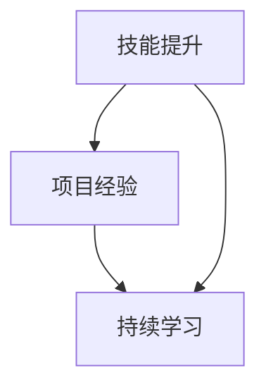

                 


# 程序员如何进行长期职业规划

> 关键词：程序员、职业规划、技能提升、项目经验、持续学习

> 摘要：本文将探讨程序员如何进行长期职业规划，从技能提升、项目经验积累、持续学习等多个方面进行详细分析，帮助程序员实现职业生涯的持续发展和成功。

## 1. 背景介绍

### 1.1 目的和范围

本文旨在为程序员提供一份实用的长期职业规划指南，帮助他们明确自己的职业发展方向，实现职业成长和成功。我们将从以下几个方面进行探讨：

1. 技能提升：介绍程序员应该掌握的核心技能，以及如何通过学习和实践不断提升自己的技术能力。
2. 项目经验：探讨如何通过参与各种项目积累经验，提高自己在实际工作中的能力。
3. 持续学习：分享一些持续学习的策略和方法，帮助程序员跟上技术发展的步伐。

### 1.2 预期读者

本文适合以下读者：

1. 有一定编程基础，希望进行长期职业规划的程序员。
2. 想要提升自己技术能力的程序员。
3. 对于职业规划有困惑的程序员。

### 1.3 文档结构概述

本文分为十个部分，结构如下：

1. 背景介绍：介绍本文的目的、范围和预期读者。
2. 核心概念与联系：介绍程序员职业规划中的核心概念及其相互关系。
3. 核心算法原理 & 具体操作步骤：阐述如何通过技能提升、项目经验和持续学习实现职业规划。
4. 数学模型和公式 & 详细讲解 & 举例说明：讲解相关的数学模型和公式。
5. 项目实战：提供实际案例和代码实现。
6. 实际应用场景：讨论程序员职业规划在不同场景下的应用。
7. 工具和资源推荐：介绍学习资源和开发工具。
8. 总结：总结未来发展趋势与挑战。
9. 附录：常见问题与解答。
10. 扩展阅读 & 参考资料：提供进一步学习的资源。

### 1.4 术语表

#### 1.4.1 核心术语定义

- 职业规划：指个人根据自己的兴趣、能力和市场需求，制定长期职业发展计划的过程。
- 技能提升：指通过学习和实践不断提高自己在特定领域的技能水平。
- 项目经验：指参与实际项目过程中积累的经验和知识。
- 持续学习：指不断学习新知识、新技术，以保持自己在职业领域的竞争力。

#### 1.4.2 相关概念解释

- 编程技能：指程序员使用编程语言进行软件开发的能力。
- 项目管理：指对项目进行规划、执行、监控和控制的过程。
- 技术栈：指程序员在特定领域所掌握的技术集合。

#### 1.4.3 缩略词列表

- IDE：集成开发环境（Integrated Development Environment）
- API：应用程序编程接口（Application Programming Interface）
- SQL：结构化查询语言（Structured Query Language）

## 2. 核心概念与联系

为了更好地进行程序员长期职业规划，我们需要理解以下几个核心概念及其相互关系：

1. 技能提升
2. 项目经验
3. 持续学习

下面是这些核心概念之间的 Mermaid 流程图（图 1）：



### 2.1 技能提升

技能提升是程序员职业规划的基础。程序员需要不断提升自己的编程技能、项目管理能力以及其他相关技能，以适应不断变化的技术和市场环境。

#### 2.1.1 编程技能

编程技能是程序员的核心竞争力。程序员需要熟练掌握一种或多种编程语言，如 Java、Python、C++ 等。同时，了解编程语言背后的原理和设计模式也非常重要。

#### 2.1.2 项目管理能力

项目管理能力对于程序员来说同样重要。程序员需要学会如何制定项目计划、分配任务、监控进度、沟通协作等。

#### 2.1.3 其他相关技能

除了编程技能和项目管理能力，程序员还需要掌握其他相关技能，如数据库管理、前端开发、云计算等。这些技能可以帮助程序员在特定领域发挥作用。

### 2.2 项目经验

项目经验是程序员在职业生涯中不可或缺的一部分。通过参与实际项目，程序员可以积累丰富的实践经验，提高自己的解决问题的能力。

#### 2.2.1 项目类型

程序员可以参与不同类型的项目，如：

1. 企业内部项目：为公司或企业提供定制化的软件开发解决方案。
2. 开源项目：参与开源社区，贡献代码，提升自己的编程技能。
3. 个人项目：通过个人项目锻炼自己的编程能力，积累实践经验。

#### 2.2.2 项目经验积累

在参与项目过程中，程序员需要学会如何：

1. 分析需求：理解客户需求，确定项目目标。
2. 制定计划：制定详细的项目计划，分配任务。
3. 编码实现：编写高质量的代码，实现项目功能。
4. 测试与部署：对项目进行测试，确保其稳定运行，并部署上线。
5. 持续迭代：根据用户反馈，不断优化项目功能。

### 2.3 持续学习

持续学习是程序员保持竞争力的关键。技术领域发展迅速，程序员需要不断学习新技术、新工具，以适应不断变化的市场环境。

#### 2.3.1 学习资源

程序员可以通过以下途径学习：

1. 书籍：阅读专业书籍，掌握核心技术知识。
2. 在线课程：参加在线课程，学习新技术和新工具。
3. 技术博客：关注技术博客，了解业界动态。
4. 实践项目：通过实践项目，提升自己的技能。

#### 2.3.2 学习策略

1. 定期复习：定期复习已学知识，巩固基础。
2. 分享交流：参加技术分享活动，与同行交流，拓宽视野。
3. 持续关注：关注新技术、新工具的发展，及时调整自己的学习计划。

## 3. 核心算法原理 & 具体操作步骤

在程序员职业规划中，核心算法原理和具体操作步骤同样重要。以下将详细阐述如何通过技能提升、项目经验和持续学习实现职业规划。

### 3.1 技能提升

#### 3.1.1 编程技能提升

**算法原理：**

编程技能的提升主要依赖于对编程语言的理解和运用。程序员可以通过以下步骤提升编程技能：

1. **数据结构和算法基础知识：** 熟悉常见的数据结构（如数组、链表、栈、队列、树、图等）和算法（如排序、查找、动态规划等）。
2. **编程语言语法：** 掌握编程语言的基本语法和特性。
3. **编程技巧：** 学习编程技巧，如代码优化、代码规范等。

**具体操作步骤：**

1. **学习资源：** 阅读专业书籍，如《算法导论》、《编程珠玑》等。
2. **在线课程：** 参加在线课程，如 Coursera、edX 等。
3. **实践项目：** 参与实际项目，运用所学知识解决实际问题。
4. **编程练习：** 在 LeetCode、牛客网等平台上进行编程练习。

#### 3.1.2 项目管理能力提升

**算法原理：**

项目管理能力的提升主要依赖于对项目管理方法的理解和应用。程序员可以通过以下步骤提升项目管理能力：

1. **项目管理知识：** 学习项目管理的基本概念和方法，如敏捷开发、迭代开发等。
2. **沟通协作：** 提高沟通协作能力，确保项目顺利进行。
3. **风险控制：** 学会识别和应对项目风险。

**具体操作步骤：**

1. **学习资源：** 阅读项目管理相关书籍，如《敏捷开发实践指南》、《项目风险管理》等。
2. **在线课程：** 参加项目管理相关课程，如 PMP 认证课程。
3. **实践经验：** 参与实际项目，担任项目经理或团队成员，积累项目管理经验。
4. **工具使用：** 学习使用项目管理工具，如 Jira、Trello 等。

### 3.2 项目经验积累

**算法原理：**

项目经验积累主要通过参与实际项目，解决实际问题来实现。以下是一些常见的项目类型和参与方式：

1. **企业内部项目：** 参与公司内部的软件开发项目，担任开发人员或项目经理。
2. **开源项目：** 参与开源社区项目，为开源项目贡献代码。
3. **个人项目：** 自己发起或参与个人项目，锻炼编程能力和项目管理能力。

**具体操作步骤：**

1. **项目选择：** 根据个人兴趣和技能，选择合适的项目。
2. **需求分析：** 了解项目需求，明确项目目标。
3. **项目规划：** 制定详细的项目计划，包括任务分配、时间安排等。
4. **编码实现：** 根据项目计划，编写代码，实现项目功能。
5. **测试与部署：** 对项目进行测试，确保其稳定运行，并部署上线。
6. **持续迭代：** 根据用户反馈，不断优化项目功能。

### 3.3 持续学习

**算法原理：**

持续学习主要通过以下几种方式实现：

1. **知识积累：** 学习新技术、新工具，积累专业知识。
2. **实践应用：** 将所学知识应用于实际项目中，提高技能水平。
3. **经验分享：** 与同行交流，分享学习经验和心得。

**具体操作步骤：**

1. **学习资源：** 阅读专业书籍、在线课程、技术博客等。
2. **实践项目：** 参与实际项目，运用所学知识解决实际问题。
3. **技术交流：** 参加技术沙龙、研讨会等活动，与同行交流。
4. **写作分享：** 撰写技术文章，分享学习经验和心得。

## 4. 数学模型和公式 & 详细讲解 & 举例说明

在程序员职业规划中，数学模型和公式可以帮助我们更好地理解和分析问题。以下将介绍一些常见的数学模型和公式，并进行详细讲解和举例说明。

### 4.1 时间管理模型

**算法原理：**

时间管理模型可以帮助程序员合理安排工作和学习时间，提高效率。常见的有时间管理四象限模型和 80/20 定律。

**具体操作步骤：**

1. **四象限模型：** 将任务分为重要紧急、重要不紧急、不重要紧急、不重要不紧急四个象限，按照优先级安排时间和任务。
2. **80/20 定律：** 识别重要任务，将主要精力投入到 20% 的关键任务上，以达到 80% 的效果。

**举例说明：**

- 假设程序员需要完成以下任务：

  1. 完成公司项目的开发工作（重要紧急）
  2. 学习新技术（重要不紧急）
  3. 回复同事的邮件（不重要紧急）
  4. 完成个人项目（不重要不紧急）

  根据四象限模型和时间管理四象限模型，程序员可以将主要精力投入到完成公司项目的开发工作和学习新技术上。

### 4.2 技能成长模型

**算法原理：**

技能成长模型可以帮助程序员了解自己的技能水平，制定合理的成长计划。常见的有技能成长曲线模型和技能树模型。

**具体操作步骤：**

1. **技能成长曲线模型：** 根据自己的学习进度和实际工作表现，绘制技能成长曲线，了解自己的技能水平。
2. **技能树模型：** 分析自己的技能树，了解自己在不同领域的技能水平和潜力。

**举例说明：**

- 假设程序员目前的主要技能包括：

  1. Java（熟练）
  2. Python（了解）
  3. 前端开发（熟练）
  4. 数据库（了解）

  根据技能成长曲线模型和技能树模型，程序员可以制定以下成长计划：

  1. 提高Python技能水平，达到熟练程度。
  2. 学习数据库相关技术，如MySQL、MongoDB等。

### 4.3 项目评估模型

**算法原理：**

项目评估模型可以帮助程序员评估项目的风险和收益，做出合理的决策。常见的有 SWOT 分析模型和 ROI 分析模型。

**具体操作步骤：**

1. **SWOT 分析模型：** 分析项目的优势、劣势、机会和威胁，评估项目风险。
2. **ROI 分析模型：** 计算项目的投资回报率，评估项目的收益。

**举例说明：**

- 假设程序员需要评估一个新项目的可行性：

  1. 项目优势：市场前景好，市场需求大。
  2. 项目劣势：技术难度较高，需要投入大量人力和物力。
  3. 项目机会：可以扩大公司业务范围，提高市场竞争力。
  4. 项目威胁：竞争对手较多，市场竞争激烈。

  根据SWOT分析模型和ROI分析模型，程序员可以得出以下结论：

  1. 项目优势明显，但风险较大。
  2. 需要投入大量资源和精力，但有望获得较高回报。

## 5. 项目实战：代码实际案例和详细解释说明

为了更好地理解程序员如何进行长期职业规划，我们将通过一个实际项目案例进行讲解。本案例将涉及编程技能提升、项目经验和持续学习的应用。

### 5.1 开发环境搭建

在开始项目之前，我们需要搭建一个合适的开发环境。以下是所需工具和步骤：

1. **IDE（集成开发环境）：** 使用 IntelliJ IDEA 或 Visual Studio Code。
2. **数据库：** 安装 MySQL 或 PostgreSQL。
3. **版本控制：** 使用 Git 进行代码管理。
4. **开发框架：** 选择 Spring Boot 作为后端框架，Vue.js 作为前端框架。

**具体操作步骤：**

1. 安装 IntelliJ IDEA 或 Visual Studio Code。
2. 安装 MySQL 或 PostgreSQL，并设置数据库名和密码。
3. 在 Git Bash 中执行以下命令，初始化 Git 仓库：

   ```bash
   git init
   git remote add origin https://github.com/your-username/your-project.git
   git add .
   git commit -m "initial commit"
   git push -u origin master
   ```

### 5.2 源代码详细实现和代码解读

以下是一个简单的用户注册与登录系统的源代码实现，涵盖后端和前端部分。

#### 后端代码（Spring Boot）

**Controller 层：**

```java
@RestController
@RequestMapping("/api")
public class UserController {

    @Autowired
    private UserService userService;

    @PostMapping("/register")
    public ResponseEntity<?> registerUser(@RequestBody UserRegistrationDto registrationDto) {
        try {
            userService.registerUser(registrationDto);
            return ResponseEntity.ok("User registered successfully!");
        } catch (Exception e) {
            return ResponseEntity.status(HttpStatus.BAD_REQUEST).body("Error registering user: " + e.getMessage());
        }
    }

    @PostMapping("/login")
    public ResponseEntity<?> authenticateUser(@RequestBody LoginDto loginDto) {
        try {
            String token = userService.authenticateUser(loginDto);
            return ResponseEntity.ok(token);
        } catch (Exception e) {
            return ResponseEntity.status(HttpStatus.UNAUTHORIZED).body("Invalid credentials");
        }
    }
}
```

**Service 层：**

```java
@Service
public class UserService {

    @Autowired
    private UserRepository userRepository;

    @Autowired
    private AuthenticationManager authenticationManager;

    @Autowired
    private JwtProvider jwtProvider;

    public void registerUser(UserRegistrationDto registrationDto) {
        User user = new User();
        user.setUsername(registrationDto.getUsername());
        user.setPassword(passwordEncoder.encode(registrationDto.getPassword()));
        userRepository.save(user);
    }

    public String authenticateUser(LoginDto loginDto) {
        Authentication authentication = authenticationManager.authenticate(new UsernamePasswordAuthenticationToken(loginDto.getUsername(), loginDto.getPassword()));
        SecurityContextHolder.getContext().setAuthentication(authentication);
        String jwt = jwtProvider.generateToken(authentication);
        return jwt;
    }
}
```

**Repository 层：**

```java
@Repository
public interface UserRepository extends JpaRepository<User, Long> {
}
```

**代码解读：**

- **Controller 层：** 处理用户注册和登录请求，调用 UserService 完成相关操作。
- **Service 层：** 实现用户注册和登录逻辑，包括用户存储、密码加密和 JWT 生成。
- **Repository 层：** 暴露基本的 CRUD 操作，用于数据库操作。

#### 前端代码（Vue.js）

**注册页面（RegisterComponent.vue）：**

```vue
<template>
  <div>
    <h2>Register</h2>
    <form @submit.prevent="register()">
      <div>
        <label for="username">Username:</label>
        <input type="text" id="username" v-model="username" required />
      </div>
      <div>
        <label for="password">Password:</label>
        <input type="password" id="password" v-model="password" required />
      </div>
      <button type="submit">Register</button>
    </form>
  </div>
</template>

<script>
import axios from "axios";

export default {
  data() {
    return {
      username: "",
      password: ""
    };
  },
  methods: {
    register() {
      axios
        .post("/api/register", {
          username: this.username,
          password: this.password
        })
        .then(response => {
          alert(response.data);
          this.$router.push("/login");
        })
        .catch(error => {
          alert("Error registering user: " + error.response.data.message);
        });
    }
  }
};
</script>
```

**登录页面（LoginComponent.vue）：**

```vue
<template>
  <div>
    <h2>Login</h2>
    <form @submit.prevent="login()">
      <div>
        <label for="username">Username:</label>
        <input type="text" id="username" v-model="username" required />
      </div>
      <div>
        <label for="password">Password:</label>
        <input type="password" id="password" v-model="password" required />
      </div>
      <button type="submit">Login</button>
    </form>
  </div>
</template>

<script>
import axios from "axios";

export default {
  data() {
    return {
      username: "",
      password: ""
    };
  },
  methods: {
    login() {
      axios
        .post("/api/login", {
          username: this.username,
          password: this.password
        })
        .then(response => {
          localStorage.setItem("token", response.data);
          this.$router.push("/");
        })
        .catch(error => {
          alert("Invalid credentials");
        });
    }
  }
};
</script>
```

**代码解读：**

- **注册页面：** 提供用户注册表单，通过 axios 发送 POST 请求到后端进行注册。
- **登录页面：** 提供用户登录表单，通过 axios 发送 POST 请求到后端进行登录，并将 JWT 令牌存储在本地存储中。

### 5.3 代码解读与分析

通过上述项目实战，我们可以看到如何将编程技能、项目经验和持续学习应用于实际开发中。以下是代码解读与分析：

1. **后端架构：** 项目采用 Spring Boot 作为后端框架，实现 RESTful API。通过 UserRepository 进行数据库操作，使用 BCryptPasswordEncoder 对用户密码进行加密，使用 JWTProvider 生成 JWT 令牌。
2. **前端架构：** 项目采用 Vue.js 作为前端框架，实现用户注册和登录页面。通过 axios 与后端 API 进行交互，使用 Vuex 进行状态管理。
3. **项目流程：** 用户通过前端页面进行注册或登录，后端 API 处理用户请求，进行用户认证和 JWT 生成，前端页面展示结果。
4. **经验积累：** 在项目开发过程中，程序员可以积累以下经验：

   - 熟悉 Spring Boot 框架的使用，了解其核心技术概念。
   - 学习 Vue.js 前端框架，掌握其基本用法和组件开发。
   - 了解 JWT 技术，掌握其生成和验证方法。
   - 学习前后端分离的开发模式，提高开发效率和项目可维护性。

## 6. 实际应用场景

程序员进行长期职业规划的实际应用场景非常广泛，以下是一些典型的应用场景：

### 6.1 企业级开发

在企业级开发中，程序员需要进行大量的系统设计、开发和维护工作。长期职业规划可以帮助程序员：

1. 提升技术能力：学习各种编程语言、框架和工具，提高开发效率。
2. 掌握项目管理：学习项目管理方法和工具，提高项目交付能力。
3. 持续学习：关注行业动态，学习新技术和新工具，跟上行业发展。

### 6.2 开源项目参与

参与开源项目是程序员提升技能和影响力的一种有效途径。通过长期职业规划，程序员可以实现以下目标：

1. 学习编程技能：参与开源项目，学习各种编程语言和框架。
2. 提高沟通协作：与其他开发者合作，提高沟通协作能力。
3. 建立个人品牌：通过在开源项目中的贡献，提高自己在业界的知名度。

### 6.3 教育培训

作为教育培训工作者，程序员可以通过长期职业规划提升自己的教学能力，包括：

1. 深入学习：掌握多种编程语言和教育理论，提高教学质量。
2. 编写教材：撰写专业教材，分享自己的教学经验。
3. 开展研究：关注教育领域的前沿研究，提高学术水平。

### 6.4 创业

对于有创业意向的程序员，长期职业规划可以帮助他们：

1. 拓展业务领域：学习不同行业的业务知识和技能，为创业项目做好准备。
2. 提升管理能力：学习企业管理知识，提高团队管理能力。
3. 建立人脉网络：参加行业会议、活动，建立人脉关系。

## 7. 工具和资源推荐

为了帮助程序员更好地进行长期职业规划，我们推荐以下工具和资源：

### 7.1 学习资源推荐

#### 7.1.1 书籍推荐

- 《编程珠玑》
- 《算法导论》
- 《深入理解计算机系统》
- 《代码大全》

#### 7.1.2 在线课程

- Coursera（提供各种编程和技术课程）
- edX（提供各种编程和技术课程）
- Pluralsight（提供各种编程和技术课程）

#### 7.1.3 技术博客和网站

- Medium（关注技术博客，了解最新技术动态）
- HackerRank（提供编程挑战和练习）
- Stack Overflow（解决编程问题，交流技术）

### 7.2 开发工具框架推荐

#### 7.2.1 IDE和编辑器

- IntelliJ IDEA
- Visual Studio Code
- Eclipse

#### 7.2.2 调试和性能分析工具

- JMeter
- Charles
- Fiddler

#### 7.2.3 相关框架和库

- Spring Boot
- Vue.js
- React
- Angular

### 7.3 相关论文著作推荐

#### 7.3.1 经典论文

- "An Empirical Study of Software Engineers' Professional Development"（软件工程师职业发展的实证研究）
- "The Design of the UNIX Operating System"（UNIX 操作系统的设计与实现）

#### 7.3.2 最新研究成果

- "A Study on Software Engineering Education"（软件工程教育研究）
- "The Future of Software Engineering"（软件工程的发展趋势）

#### 7.3.3 应用案例分析

- "A Case Study on Agile Development in a Large Enterprise"（敏捷开发在大企业中的应用案例）
- "A Case Study on Blockchain in the Financial Industry"（区块链在金融行业的应用案例）

## 8. 总结：未来发展趋势与挑战

### 8.1 未来发展趋势

1. **技术多样化：** 随着人工智能、云计算、大数据等技术的发展，程序员需要掌握更多技术。
2. **持续学习：** 技术更新换代速度加快，程序员需要不断学习新知识、新技能。
3. **数字化转型：** 企业和行业将更加注重数字化转型，程序员在数字化转型中将发挥重要作用。

### 8.2 挑战

1. **技术压力：** 程序员需要不断学习新技术，面对技术压力。
2. **工作与生活平衡：** 高强度的工作可能会影响工作与生活的平衡。
3. **竞争压力：** 市场竞争激烈，程序员需要不断提升自己的竞争力。

## 9. 附录：常见问题与解答

### 9.1 如何选择学习资源？

**解答：** 根据自己的兴趣和需求选择学习资源。可以参考书籍推荐、在线课程推荐、技术博客和网站推荐，选择适合自己的资源。

### 9.2 如何提升编程技能？

**解答：** 提升编程技能的方法包括：

1. **学习编程基础知识：** 掌握编程语言的基本语法和概念。
2. **实践项目：** 通过实践项目，运用所学知识解决实际问题。
3. **参加竞赛和挑战：** 参加编程竞赛和挑战，提高自己的编程能力。

### 9.3 如何进行职业规划？

**解答：** 进行职业规划的方法包括：

1. **自我评估：** 分析自己的兴趣、能力和市场需求。
2. **设定目标：** 根据自我评估结果，设定明确的职业目标。
3. **制定计划：** 制定实现职业目标的计划，包括学习、实践和拓展。

## 10. 扩展阅读 & 参考资料

### 10.1 扩展阅读

1. 《程序员修炼之道》
2. 《敏捷开发实践指南》
3. 《软件架构设计：模式、原则与实践》

### 10.2 参考资料

1. 《IEEE Software》
2. 《ACM Transactions on Computer Systems》
3. 《Journal of Software Engineering》

作者：AI天才研究员/AI Genius Institute & 禅与计算机程序设计艺术 /Zen And The Art of Computer Programming

