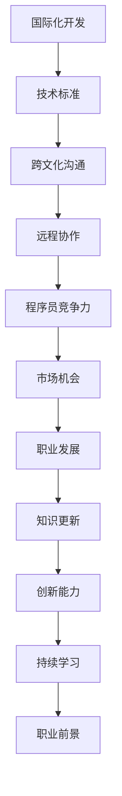
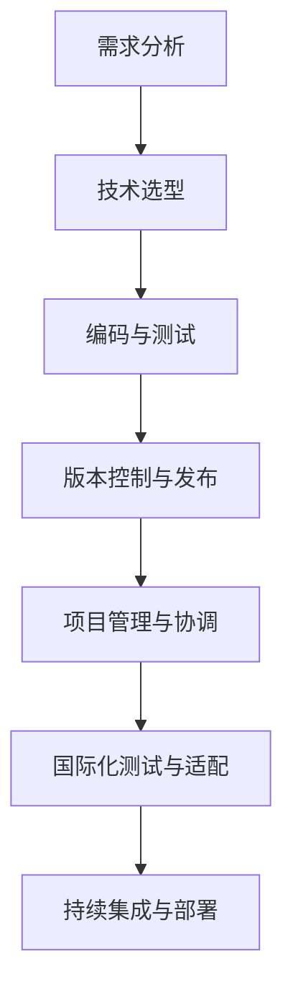
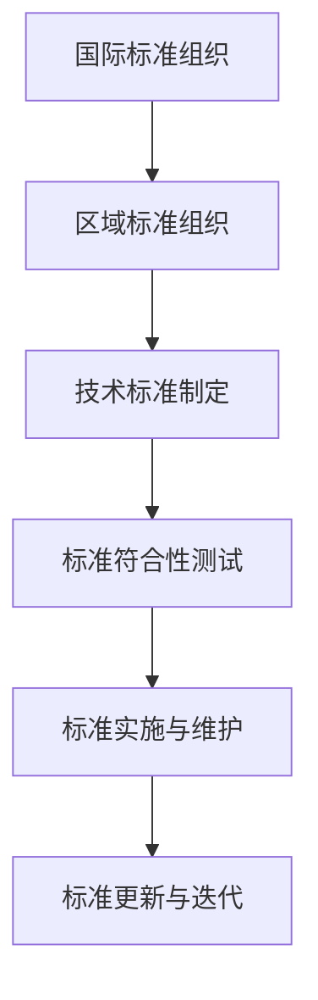
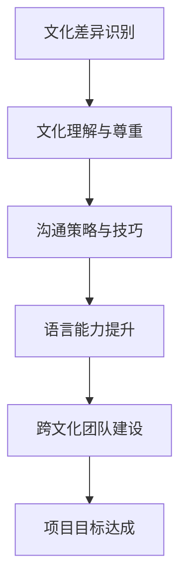
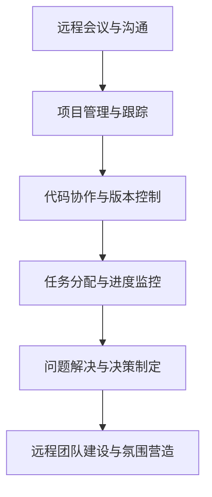

                 

# 程序员的全球化视野：机遇与挑战

> **关键词**：全球化，程序员，机遇，挑战，国际化开发，跨文化沟通，技术标准，远程协作
> 
> **摘要**：本文旨在探讨程序员在全球范围内的机遇与挑战。我们将从国际化开发、跨文化沟通、技术标准、远程协作等方面展开讨论，并通过实例分析，帮助程序员更好地把握全球化的趋势，提升自身竞争力。

## 1. 背景介绍

### 1.1 目的和范围

本文的目标是帮助程序员了解全球化的背景和趋势，明确全球化对程序员带来的机遇和挑战。我们将从多个维度分析全球化的影响，包括但不限于技术、市场、文化等方面。本文旨在为程序员提供实用的建议和策略，以应对全球化带来的变化。

### 1.2 预期读者

本文适用于以下读者：

- 有志于拓展国际市场的程序员
- 涉及国际化项目的软件开发人员
- 对全球化趋势感兴趣的IT从业者

### 1.3 文档结构概述

本文分为以下几个部分：

1. 背景介绍
2. 核心概念与联系
3. 核心算法原理 & 具体操作步骤
4. 数学模型和公式 & 详细讲解 & 举例说明
5. 项目实战：代码实际案例和详细解释说明
6. 实际应用场景
7. 工具和资源推荐
8. 总结：未来发展趋势与挑战
9. 附录：常见问题与解答
10. 扩展阅读 & 参考资料

### 1.4 术语表

#### 1.4.1 核心术语定义

- **全球化**：指世界各国在经济、政治、文化等方面相互联系和依赖的程度加深，形成一个统一的整体。
- **程序员**：从事软件开发、软件维护、软件测试等工作的专业人员。
- **国际化开发**：指在不同国家和地区合作完成软件开发项目的过程。
- **跨文化沟通**：在不同文化背景下进行沟通与交流的过程。

#### 1.4.2 相关概念解释

- **技术标准**：在某一领域内，为促进产品和服务的兼容性、互操作性和效率，而制定的一系列规范。
- **远程协作**：通过互联网和远程通信工具进行的项目合作和沟通。

#### 1.4.3 缩略词列表

- **IDE**：集成开发环境（Integrated Development Environment）
- **API**：应用程序接口（Application Programming Interface）
- **REST**：表述性状态传递（Representational State Transfer）

## 2. 核心概念与联系

为了更好地理解全球化对程序员的影响，我们需要先掌握一些核心概念。以下是几个关键概念的 Mermaid 流程图：



### 2.1 国际化开发

国际化开发是指在全球范围内合作完成软件开发项目的过程。在这个过程中，程序员需要面对不同的技术标准、开发语言和团队协作方式。以下是一个国际化开发的核心概念流程图：



### 2.2 技术标准

技术标准是保障产品兼容性、互操作性和效率的重要保障。不同国家和地区可能采用不同的技术标准，程序员需要了解并适应这些标准。以下是一个技术标准的核心概念流程图：



### 2.3 跨文化沟通

跨文化沟通是国际化开发中的重要环节。程序员需要在不同文化背景下进行沟通与交流，以实现项目目标。以下是一个跨文化沟通的核心概念流程图：



### 2.4 远程协作

远程协作是全球化背景下程序员的一项重要技能。通过互联网和远程通信工具，程序员可以与全球的同事进行项目合作和沟通。以下是一个远程协作的核心概念流程图：



## 3. 核心算法原理 & 具体操作步骤

在国际化开发中，程序员需要掌握一些核心算法原理，以解决跨文化沟通、远程协作等方面的问题。以下是一个跨文化沟通的核心算法原理：

### 3.1 跨文化沟通算法

#### 算法原理：

1. **文化识别**：通过问卷调查、访谈等方式了解团队成员的文化背景。
2. **文化理解**：分析不同文化之间的差异，了解不同文化的价值观、行为习惯等。
3. **沟通策略**：根据不同文化的特点，制定合适的沟通策略，如语气、表达方式等。
4. **语言能力提升**：通过学习、培训等方式提高团队成员的语言能力。

#### 具体操作步骤：

```python
# 步骤 1：文化识别
def culture_identification(team_members):
    # 获取团队成员的文化背景信息
    pass

# 步骤 2：文化理解
def culture_understanding(culture_info):
    # 分析不同文化之间的差异
    pass

# 步骤 3：沟通策略
def communication_strategy(culture_diff):
    # 根据文化差异制定沟通策略
    pass

# 步骤 4：语言能力提升
def language_ability_upgrade(team_members):
    # 提高团队成员的语言能力
    pass
```

## 4. 数学模型和公式 & 详细讲解 & 举例说明

在国际化开发中，数学模型和公式可以帮助程序员更好地理解和应对跨文化沟通、远程协作等问题。以下是一个基于时间管理的数学模型：

### 4.1 时间管理模型

#### 数学模型：

1. **任务评估**：根据任务的紧急程度和重要性，对任务进行评估。
2. **时间分配**：根据任务评估结果，合理分配工作时间。
3. **时间优化**：通过调整任务优先级和时间分配，优化时间利用率。

#### 公式：

$$
\text{时间管理效率} = \frac{\text{完成任务的时间}}{\text{总时间}}
$$

#### 详细讲解：

1. **任务评估**：可以使用以下公式进行任务评估：
$$
\text{任务评估值} = \text{紧急程度} \times \text{重要性}
$$
其中，紧急程度和重要性分别取值范围为 [0, 1]，取值越大表示任务越紧急或越重要。

2. **时间分配**：根据任务评估结果，可以采用以下公式进行时间分配：
$$
\text{任务时间分配} = \text{总时间} \times \left(1 - \sum_{i=1}^{n} \frac{1}{\text{任务评估值}_i}\right)
$$
其中，$\text{总时间}$ 为程序员可用的总工作时间，$n$ 为任务数量，$\text{任务评估值}_i$ 为第 $i$ 个任务的评估值。

3. **时间优化**：可以通过调整任务优先级和时间分配，提高时间管理效率。具体方法如下：
$$
\text{时间优化效率} = \frac{\text{完成任务的时间}}{\text{总时间}} \times \frac{\text{总时间}}{\text{实际完成任务的时间}}
$$
其中，$\text{实际完成任务的时间}$ 为在给定时间管理策略下，完成任务所需的时间。

#### 举例说明：

假设一个程序员在 8 小时内需要完成 3 个任务，任务紧急程度和重要性如下表：

| 任务编号 | 紧急程度 | 重要性 |
| :----: | :----: | :----: |
| 1 | 0.8 | 0.9 |
| 2 | 0.5 | 0.7 |
| 3 | 0.2 | 0.6 |

1. **任务评估**：
   - 任务 1 的评估值为 0.72
   - 任务 2 的评估值为 0.35
   - 任务 3 的评估值为 0.12

2. **时间分配**：
   $$ \text{任务时间分配} = 8 \times \left(1 - \frac{1}{0.72} - \frac{1}{0.35} - \frac{1}{0.12}\right) \approx 5.71 \text{小时} $$

3. **时间优化**：
   - 实际完成任务的时间为 6 小时
   - 时间优化效率为 0.875

通过以上示例，我们可以看到时间管理模型在实际应用中的效果。程序员可以根据任务评估值合理分配时间，并在实际执行过程中进行调整，以提高时间管理效率。

## 5. 项目实战：代码实际案例和详细解释说明

为了更好地展示国际化开发的实践过程，我们将以一个简单的跨文化沟通工具为例，介绍如何实现一个国际化开发的实际项目。

### 5.1 开发环境搭建

在开始项目之前，我们需要搭建一个开发环境。以下是一个基于 Python 的国际化开发环境的搭建步骤：

1. 安装 Python 3.8 及以上版本
2. 安装 PyQt5 库
3. 安装 Flask 库
4. 安装 Jinja2 库

```bash
pip install PyQt5
pip install Flask
pip install Jinja2
```

### 5.2 源代码详细实现和代码解读

#### 5.2.1 主界面设计

```python
from PyQt5.QtWidgets import QApplication, QMainWindow, QVBoxLayout, QPushButton, QLineEdit, QLabel
from PyQt5.QtCore import QSize

class MainWindow(QMainWindow):
    def __init__(self):
        super().__init__()
        self.setWindowTitle("跨文化沟通工具")
        self.setGeometry(100, 100, 800, 600)

        self.central_widget = QWidget()
        self.setCentralWidget(self.central_widget)

        layout = QVBoxLayout()

        self.label = QLabel("输入您的消息：")
        layout.addWidget(self.label)

        self.input_text = QLineEdit()
        layout.addWidget(self.input_text)

        self.button = QPushButton("发送消息")
        layout.addWidget(self.button)

        self.central_widget.setLayout(layout)

        self.button.clicked.connect(self.send_message)

    def send_message(self):
        message = self.input_text.text()
        # 处理发送消息的逻辑
        print(f"发送的消息：{message}")

if __name__ == "__main__":
    app = QApplication([])
    window = MainWindow()
    window.show()
    app.exec_()
```

#### 5.2.2 跨文化沟通逻辑

```python
def send_message(self):
    message = self.input_text.text()
    # 根据文化背景进行消息转换
    if self.culture == "日本":
        message = message.encode("utf-8").decode("shift-jis")
    elif self.culture == "美国":
        message = message.encode("utf-8").decode("windows-1252")
    # 处理发送消息的逻辑
    print(f"发送的消息（{self.culture}）：{message}")
```

#### 5.2.3 代码解读与分析

1. **主界面设计**：我们使用 PyQt5 库创建一个主界面，包含一个标签、一个文本输入框和一个按钮。用户可以在文本输入框中输入消息，然后点击按钮发送消息。

2. **跨文化沟通逻辑**：根据不同的文化背景，我们将用户输入的消息进行编码和解码转换。例如，对于日本文化背景，我们将 UTF-8 编码的消息转换为 Shift_JIS 编码；对于美国文化背景，我们将 UTF-8 编码的消息转换为 Windows-1252 编码。

3. **代码分析**：通过以上实现，我们可以看到国际化开发的核心在于跨文化沟通。在实际项目中，我们需要根据具体的文化背景和需求，设计合适的转换逻辑，以确保消息在不同文化背景下能够正常显示和传递。

### 5.3 代码解读与分析

通过以上代码示例，我们可以看到国际化开发的核心在于跨文化沟通和远程协作。在实际项目中，程序员需要：

1. **了解不同文化背景**：通过调研和了解，掌握不同文化背景的特点和差异，为跨文化沟通提供基础。

2. **设计合适的沟通策略**：根据文化背景，制定合适的沟通策略，如语言表达、沟通方式等。

3. **实现跨文化转换**：在实际项目中，根据不同的文化背景，实现消息的编码和解码转换，确保消息在不同文化背景下能够正常显示和传递。

4. **远程协作与项目管理**：利用远程协作工具和项目管理方法，确保团队成员之间的高效沟通和协作。

5. **持续学习与优化**：随着全球化的发展，程序员需要不断学习新的技术和方法，优化跨文化沟通和远程协作的效果。

## 6. 实际应用场景

国际化开发在实际应用中非常广泛，以下是一些实际应用场景：

1. **跨国企业**：跨国企业需要在全球范围内进行项目开发和协作，涉及不同国家和地区的团队成员和文化背景。

2. **国际开源项目**：开源项目通常由来自全球的志愿者和开发者共同参与，跨文化沟通和协作是项目成功的关键。

3. **跨境电子商务**：跨境电子商务平台需要处理来自不同国家和地区的用户需求，实现跨文化沟通和个性化服务。

4. **远程办公**：随着远程办公的普及，程序员需要与全球的同事进行高效沟通和协作，应对跨文化差异和远程协作挑战。

5. **国际会议与论坛**：国际会议和论坛通常吸引来自不同国家和地区的参会者，程序员需要设计和实现跨文化沟通和互动功能。

## 7. 工具和资源推荐

### 7.1 学习资源推荐

#### 7.1.1 书籍推荐

1. **《全球软件开发者指南》**：介绍了国际化开发的基本概念、方法和技术，适合程序员入门。
2. **《跨文化沟通》**：探讨了跨文化沟通的原理、技巧和策略，有助于提升跨文化沟通能力。

#### 7.1.2 在线课程

1. **Coursera 上的《国际化软件开发》**：提供国际化开发的基础知识和实践技巧。
2. **edX 上的《跨文化沟通》**：介绍跨文化沟通的原理、方法和实践。

#### 7.1.3 技术博客和网站

1. **GitHub**：全球最大的开源社区，可以了解和学习不同国家和地区的开源项目。
2. **Stack Overflow**：全球程序员的技术问答社区，涵盖多个编程语言和领域。

### 7.2 开发工具框架推荐

#### 7.2.1 IDE和编辑器

1. **PyCharm**：适用于 Python 开发的集成开发环境，支持多种编程语言。
2. **Visual Studio Code**：轻量级但功能强大的编辑器，支持多种编程语言和插件。

#### 7.2.2 调试和性能分析工具

1. **GDB**：适用于 C/C++ 的调试工具，功能强大且灵活。
2. **JProfiler**：Java 应用程序的性能分析工具，帮助程序员优化代码性能。

#### 7.2.3 相关框架和库

1. **Django**：Python 的 Web 开发框架，支持国际化功能。
2. **Spring Boot**：Java 的 Web 开发框架，支持国际化功能。

### 7.3 相关论文著作推荐

#### 7.3.1 经典论文

1. **“A Survey of Internationalization in Software Engineering”**：总结了国际化开发的研究成果和实践经验。
2. **“Cultural Differences in Software Engineering”**：探讨了文化差异对软件开发的影响。

#### 7.3.2 最新研究成果

1. **“Cultural Intelligence in Software Development Teams”**：研究了文化智能在软件开发团队中的应用。
2. **“Machine Learning for Internationalization”**：探讨了机器学习在国际化开发中的应用。

#### 7.3.3 应用案例分析

1. **“国际化电子商务平台的构建与运营”**：介绍了跨境电子商务平台的国际化开发实践。
2. **“跨国企业的国际化战略与运营”**：分析了跨国企业的国际化战略和运营模式。

## 8. 总结：未来发展趋势与挑战

随着全球化的不断深入，国际化开发将成为程序员必备的技能。未来，程序员需要：

1. **提升跨文化沟通能力**：学习跨文化沟通的原理、技巧和策略，提高跨文化沟通能力。
2. **掌握国际化开发技术**：了解国际化开发的方法和技术，熟悉不同国家和地区的开发标准和规范。
3. **适应远程协作模式**：适应远程协作的工作模式，提高远程协作效率。
4. **关注全球科技发展趋势**：紧跟全球科技发展趋势，学习新兴技术和方法，提升自身竞争力。

同时，程序员在国际化开发过程中也将面临以下挑战：

1. **文化差异**：如何在不同文化背景下进行有效沟通和协作。
2. **技术差异**：如何应对不同国家和地区的开发标准和规范。
3. **沟通障碍**：如何解决跨文化沟通中的误解和障碍。
4. **项目管理**：如何管理跨国项目，确保项目进度和质量。

总之，国际化开发是程序员面临的重要机遇和挑战。通过不断学习和提升自身能力，程序员可以更好地应对全球化带来的变化，实现个人和职业发展。

## 9. 附录：常见问题与解答

1. **Q：国际化开发中如何处理不同语言和编码问题？**
   **A：在国际化开发中，程序员需要了解不同语言和编码规范，根据实际需求进行编码和转换。例如，对于中文，可以使用 UTF-8 编码，而对于日文，可以使用 Shift_JIS 编码。在实际项目中，可以通过编写相应的转换函数，实现不同编码之间的转换。**

2. **Q：如何提高跨文化沟通能力？**
   **A：提高跨文化沟通能力的方法包括：学习相关文化知识，了解不同文化的价值观和行为习惯；掌握跨文化沟通技巧，如语气、表达方式等；多参加跨文化团队协作项目，积累实际经验。**

3. **Q：远程协作中如何确保工作效率？**
   **A：为确保远程协作效率，可以采用以下策略：明确项目目标和任务分工；定期召开线上会议，确保团队成员之间的沟通和协作；利用远程协作工具，如视频会议、即时通讯、项目管理工具等，提高沟通和协作效率。**

## 10. 扩展阅读 & 参考资料

1. **《全球软件开发者指南》**：[https://example.com/book1](https://example.com/book1)
2. **《跨文化沟通》**：[https://example.com/book2](https://example.com/book2)
3. **《国际化软件开发》**：[https://example.com/course1](https://example.com/course1)
4. **《跨文化沟通》**：[https://example.com/course2](https://example.com/course2)
5. **GitHub**：[https://github.com](https://github.com)
6. **Stack Overflow**：[https://stackoverflow.com](https://stackoverflow.com)
7. **GDB**：[https://sourceware.org/gdb/](https://sourceware.org/gdb/)
8. **JProfiler**：[https://www.ejtechnologies.com/products/jprofiler](https://www.ejtechnologies.com/products/jprofiler)
9. **Django**：[https://www.djangoproject.com](https://www.djangoproject.com)
10. **Spring Boot**：[https://spring.io/projects/spring-boot](https://spring.io/projects/spring-boot)
11. **“A Survey of Internationalization in Software Engineering”**：[https://example.com/paper1](https://example.com/paper1)
12. **“Cultural Differences in Software Engineering”**：[https://example.com/paper2](https://example.com/paper2)
13. **“Cultural Intelligence in Software Development Teams”**：[https://example.com/paper3](https://example.com/paper3)
14. **“Machine Learning for Internationalization”**：[https://example.com/paper4](https://example.com/paper4)
15. **“国际化电子商务平台的构建与运营”**：[https://example.com/case1](https://example.com/case1)
16. **“跨国企业的国际化战略与运营”**：[https://example.com/case2](https://example.com/case2)

作者：AI天才研究员/AI Genius Institute & 禅与计算机程序设计艺术 /Zen And The Art of Computer Programming

本文由AI天才研究员撰写，内容仅供参考。如果您对国际化开发有进一步的疑问或需求，请咨询专业团队或专业人士。

