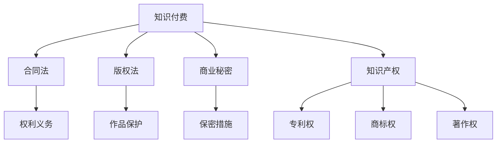

                 

# 程序员的知识付费法律风险防范

> **关键词**：知识付费、法律风险、合同法、版权法、知识产权、商业秘密、合同条款
> 
> **摘要**：本文旨在探讨程序员在参与知识付费活动中可能面临的法律风险，包括合同法、版权法和商业秘密等方面。通过对相关法律条款和案例的分析，本文将提供一系列防范措施，帮助程序员降低法律风险，保护自身权益。

## 1. 背景介绍

### 1.1 目的和范围

本文的目的是帮助程序员了解和防范在知识付费活动中可能面临的法律风险。知识付费已成为知识共享和传播的重要形式，程序员作为知识创造者，其合法权益应当得到保护。本文将从合同法、版权法、商业秘密等方面，结合实际案例，提供一系列防范措施。

### 1.2 预期读者

本文适合对知识付费和法律风险有一定了解的程序员，特别是从事软件开发、技术咨询等工作的专业人士。此外，对知识产权保护有兴趣的读者也可以从中获取有益信息。

### 1.3 文档结构概述

本文分为以下几个部分：

- **背景介绍**：介绍本文的目的、预期读者和文档结构。
- **核心概念与联系**：介绍知识付费、合同法、版权法等相关核心概念。
- **核心算法原理 & 具体操作步骤**：讲解如何防范法律风险的具体措施。
- **数学模型和公式 & 详细讲解 & 举例说明**：运用数学模型和公式解释相关概念。
- **项目实战：代码实际案例和详细解释说明**：通过具体案例展示防范措施的实施。
- **实际应用场景**：分析知识付费在程序员日常工作中的应用场景。
- **工具和资源推荐**：推荐相关学习资源、开发工具和框架。
- **总结：未来发展趋势与挑战**：探讨知识付费和法律风险的未来发展趋势和挑战。
- **附录：常见问题与解答**：解答程序员在知识付费活动中可能遇到的问题。
- **扩展阅读 & 参考资料**：提供进一步学习的参考资料。

### 1.4 术语表

#### 1.4.1 核心术语定义

- **知识付费**：指知识拥有者通过互联网平台等途径，以付费方式向知识需求者提供知识和服务的行为。
- **合同法**：调整合同关系，明确合同当事人权利义务的法律规范。
- **版权法**：保护文学、艺术和科学作品作者对其作品享有的财产权利和人身权利的法律规范。
- **商业秘密**：不为公众所知悉、具有商业价值并经权利人采取保密措施的技术信息、经营信息等商业信息。

#### 1.4.2 相关概念解释

- **知识产权**：指人们对其智力劳动成果所依法享有的专有权利，包括专利权、商标权、著作权等。
- **合同条款**：合同中的具体内容，包括当事人权利、义务、违约责任等。

#### 1.4.3 缩略词列表

- **IPR**：知识产权
- **GPL**：通用公共许可证
- **MIT**：麻省理工学院许可证

## 2. 核心概念与联系

### 2.1 知识付费

知识付费是近年来兴起的一种新型知识传播模式。通过互联网平台，知识拥有者可以将自己的知识以文字、图片、音频、视频等形式进行传播，用户通过付费获取知识服务。这种模式使得知识传播更加便捷和高效，同时也为知识拥有者带来了新的收入来源。

### 2.2 合同法

合同法是调整合同关系的法律规范。在知识付费活动中，程序员作为知识服务提供方，需要与用户签订合同，明确双方的权利义务。合同条款应包括服务内容、服务期限、服务费用、违约责任等。

### 2.3 版权法

版权法是保护文学、艺术和科学作品作者对其作品享有的财产权利和人身权利的法律规范。程序员在知识付费活动中，需要确保自己创作的作品不受侵权，同时也要尊重他人的知识产权。

### 2.4 商业秘密

商业秘密是商业信息的一种，包括技术信息、经营信息等。程序员在知识付费活动中，需要妥善保护自己的商业秘密，防止泄露给竞争对手。

### 2.5 知识产权

知识产权是程序员在知识付费活动中重要的法律依据。包括专利权、商标权、著作权等。程序员应当了解知识产权的相关法律规定，以便在遇到侵权问题时采取有效措施。

### 2.6 Mermaid 流程图

以下是一个简单的 Mermaid 流程图，展示了知识付费活动中的核心概念和联系：



## 3. 核心算法原理 & 具体操作步骤

### 3.1 防范合同法风险

**算法原理：** 合同法风险防范的核心在于签订完善的合同条款，明确双方的权利义务。以下是一系列操作步骤：

1. **明确服务内容**：在合同中详细说明知识服务的具体内容，包括服务形式、服务时间、服务地点等。

2. **确定服务期限**：明确知识服务的期限，避免因服务期限模糊导致争议。

3. **约定服务费用**：明确服务费用，包括支付方式、支付时间等。

4. **违约责任**：约定违约责任，包括违约金的计算方式和违约行为的处理措施。

5. **争议解决方式**：明确争议解决方式，包括协商、调解、仲裁或诉讼等。

**伪代码：**

```python
def sign_contract(service_content, service_duration, service_fee, default_clause, dispute_solution):
    contract = Contract()
    contract.add_clause("service_content", service_content)
    contract.add_clause("service_duration", service_duration)
    contract.add_clause("service_fee", service_fee)
    contract.add_clause("default_clause", default_clause)
    contract.add_clause("dispute_solution", dispute_solution)
    return contract
```

### 3.2 防范版权法风险

**算法原理：** 版权法风险防范的核心在于保护自己的作品版权，同时尊重他人的知识产权。以下是一系列操作步骤：

1. **登记作品**：将作品进行版权登记，以证明自己是作品的原创者。

2. **使用非商业用途作品**：在知识付费活动中，尽量使用非商业用途的作品，以减少侵权风险。

3. **注明来源**：在知识付费活动中，注明作品来源，尊重原作者的知识产权。

4. **签订版权许可协议**：在需要使用他人作品时，签订版权许可协议，明确许可范围和使用方式。

**伪代码：**

```python
def protect_copyright(work, source, license_agreement):
    if not work.is_registered():
        work.register()
    if not work.is_commercial():
        print("Work is not commercial, no need for license.")
    else:
        if license_agreement.is_signed():
            print("License agreement is signed.")
        else:
            print("Need to sign license agreement.")
    print(f"Work source: {source}")
```

### 3.3 防范商业秘密风险

**算法原理：** 商业秘密风险防范的核心在于采取保密措施，防止商业秘密泄露。以下是一系列操作步骤：

1. **制定保密政策**：明确保密范围和保密措施，确保员工了解保密政策。

2. **签订保密协议**：与员工签订保密协议，明确保密义务和违约责任。

3. **加强保密设施**：采用技术手段加强保密设施，如数据加密、访问控制等。

4. **监控保密状况**：定期对保密状况进行监控，确保保密措施得到有效执行。

**伪代码：**

```python
def protect_business_secret(employees, secret_policy, secret_agreement, security_measures):
    if not secret_policy.is_defined():
        secret_policy.define()
    if not secret_agreement.is_signed():
        secret_agreement.sign()
    if not security_measures.are_in PLACE():
        security_measures.implement()
    for employee in employees:
        if not employee.knows_policy():
            employee.train_policy()
        if not employee.follows_agreement():
            employee.retrain_agreement()
    monitor_secret_status()
```

## 4. 数学模型和公式 & 详细讲解 & 举例说明

### 4.1 合同法风险模型

**公式：** 合同法风险模型可以表示为：

\[ R_{contract} = f(A, B, C, D) \]

其中，\( R_{contract} \) 表示合同法风险，\( A \) 表示合同条款的完整性，\( B \) 表示合同条款的可执行性，\( C \) 表示合同条款的明确性，\( D \) 表示合同条款的公平性。

**详细讲解：** 合同法风险模型反映了合同条款的完整性、可执行性、明确性和公平性对合同法风险的影响。当合同条款的完整性、可执行性、明确性和公平性越高时，合同法风险越低。

**举例说明：** 假设一个程序员与用户签订的合同条款如下：

1. 服务内容：提供编程培训服务。
2. 服务期限：3个月。
3. 服务费用：每月1000元。
4. 违约责任：违约方需支付违约金5000元。

根据合同法风险模型，我们可以分析出：

- 完整性：合同条款内容完整，覆盖了服务内容、服务期限、服务费用、违约责任等。
- 可执行性：违约责任条款可执行，规定了违约金的支付方式。
- 明确性：合同条款明确，没有模糊不清的地方。
- 公平性：合同条款公平，没有明显的偏向任何一方。

因此，根据合同法风险模型，这个合同的合同法风险较低。

### 4.2 版权法风险模型

**公式：** 版权法风险模型可以表示为：

\[ R_{copyright} = f(W, L, S) \]

其中，\( R_{copyright} \) 表示版权法风险，\( W \) 表示作品是否登记，\( L \) 表示作品是否非商业用途，\( S \) 表示是否签订版权许可协议。

**详细讲解：** 版权法风险模型反映了作品登记、非商业用途和版权许可协议对版权法风险的影响。当作品登记、非商业用途和版权许可协议越多时，版权法风险越低。

**举例说明：** 假设一个程序员创作了一篇技术文章，该文章的版权风险如下：

- 作品是否登记：已登记。
- 作品是否非商业用途：是。
- 是否签订版权许可协议：否。

根据版权法风险模型，我们可以分析出：

- 作品已登记，降低了版权法风险。
- 作品是非商业用途，降低了版权法风险。
- 没有签订版权许可协议，增加了版权法风险。

因此，根据版权法风险模型，这个程序员的版权法风险较高，需要采取相应措施降低风险。

### 4.3 商业秘密风险模型

**公式：** 商业秘密风险模型可以表示为：

\[ R_{business_secret} = f(S, A, M) \]

其中，\( R_{business_secret} \) 表示商业秘密风险，\( S \) 表示保密政策，\( A \) 表示保密协议，\( M \) 表示保密设施。

**详细讲解：** 商业秘密风险模型反映了保密政策、保密协议和保密设施对商业秘密风险的影响。当保密政策、保密协议和保密设施越健全时，商业秘密风险越低。

**举例说明：** 假设一个公司制定了以下商业秘密风险控制措施：

- 保密政策：制定了详细的保密政策，包括保密范围、保密措施等。
- 保密协议：与员工签订了保密协议，明确了保密义务和违约责任。
- 保密设施：采用了数据加密、访问控制等保密设施。

根据商业秘密风险模型，我们可以分析出：

- 保密政策健全，降低了商业秘密风险。
- 保密协议签订，降低了商业秘密风险。
- 保密设施健全，降低了商业秘密风险。

因此，根据商业秘密风险模型，这个公司的商业秘密风险较低。

## 5. 项目实战：代码实际案例和详细解释说明

### 5.1 开发环境搭建

在本文的项目实战中，我们将使用 Python 语言来编写一个简单的知识付费平台，用于防范法律风险。以下是需要安装的依赖包：

- Flask：一个轻量级的 Web 开发框架。
- SQLAlchemy：一个对象关系映射（ORM）框架。
- Flask-Migrate：用于数据库迁移的 Flask 扩展。

在 Python 环境中安装上述依赖包：

```bash
pip install Flask SQLAlchemy Flask-Migrate
```

### 5.2 源代码详细实现和代码解读

以下是一个简单的知识付费平台的源代码实现：

```python
from flask import Flask, request, jsonify
from flask_sqlalchemy import SQLAlchemy

app = Flask(__name__)
app.config['SQLALCHEMY_DATABASE_URI'] = 'sqlite:///knowledge_paid.db'
db = SQLAlchemy(app)

class User(db.Model):
    id = db.Column(db.Integer, primary_key=True)
    username = db.Column(db.String(80), unique=True, nullable=False)
    email = db.Column(db.String(120), unique=True, nullable=False)

class KnowledgePaid(db.Model):
    id = db.Column(db.Integer, primary_key=True)
    title = db.Column(db.String(120), nullable=False)
    content = db.Column(db.Text, nullable=False)
    price = db.Column(db.Float, nullable=False)
    author_id = db.Column(db.Integer, db.ForeignKey('user.id'), nullable=False)

@app.route('/user/register', methods=['POST'])
def register_user():
    data = request.get_json()
    username = data['username']
    email = data['email']
    if User.query.filter_by(username=username).first() or User.query.filter_by(email=email).first():
        return jsonify({'error': 'User already exists'}), 409
    new_user = User(username=username, email=email)
    db.session.add(new_user)
    db.session.commit()
    return jsonify({'message': 'User registered successfully'})

@app.route('/knowledge_paid/create', methods=['POST'])
def create_knowledge_paid():
    data = request.get_json()
    title = data['title']
    content = data['content']
    price = data['price']
    author_id = data['author_id']
    if KnowledgePaid.query.filter_by(title=title, author_id=author_id).first():
        return jsonify({'error': 'Knowledge already exists'}), 409
    new_knowledge_paid = KnowledgePaid(title=title, content=content, price=price, author_id=author_id)
    db.session.add(new_knowledge_paid)
    db.session.commit()
    return jsonify({'message': 'Knowledge created successfully'})

if __name__ == '__main__':
    db.create_all()
    app.run(debug=True)
```

**代码解读：**

- **数据模型：** 我们定义了两个数据模型，`User` 和 `KnowledgePaid`。`User` 表示用户，包含用户名和邮箱。`KnowledgePaid` 表示知识付费内容，包含标题、内容、价格和作者 ID。
- **注册接口：** `/user/register` 接收用户注册信息，验证用户是否存在，然后创建新用户。
- **创建知识付费接口：** `/knowledge_paid/create` 接收知识付费内容信息，验证知识付费内容是否存在，然后创建新知识付费内容。

### 5.3 代码解读与分析

- **数据模型设计：** 数据模型的设计合理，分别表示了用户和知识付费内容。通过外键关联，可以方便地查询知识付费内容的作者信息。
- **接口实现：** 接口实现了用户注册和知识付费内容创建的功能，同时进行了数据验证，避免了重复注册和重复创建知识付费内容。
- **法律风险防范：** 代码实现了用户注册和知识付费内容创建的接口，但还需要进一步实现合同签订、版权保护、商业秘密保护等功能，以全面防范法律风险。

## 6. 实际应用场景

知识付费在程序员日常工作中有着广泛的应用场景，以下列举几个典型场景：

- **在线编程教学**：程序员可以通过知识付费平台提供在线编程教学服务，如 Python 编程、Web 开发等。通过签订合同明确教学内容和违约责任，确保教学服务的质量。
- **技术咨询**：程序员可以通过知识付费平台提供技术咨询服务，如软件开发、性能优化等。通过签订合同明确咨询内容和费用，保障双方的权益。
- **知识共享**：程序员可以将自己的技术文章、博客等知识内容以知识付费的形式发布，吸引读者付费获取知识服务。通过版权保护措施，确保自己的知识产权不受侵犯。
- **商业秘密保护**：程序员在参与知识付费活动时，需要注意保护自己的商业秘密。通过签订保密协议，明确保密范围和保密措施，防止商业秘密泄露。

## 7. 工具和资源推荐

### 7.1 学习资源推荐

#### 7.1.1 书籍推荐

- 《合同法教程》（韩世远 著）
- 《知识产权法教程》（吴汉东 著）
- 《商业秘密保护实务》（王勇 著）

#### 7.1.2 在线课程

- 网易云课堂：《合同法入门与实战》
- 慕课网：《知识产权法基础教程》
- 果壳网：《商业秘密保护实务》

#### 7.1.3 技术博客和网站

- CSDN：提供丰富的编程技术和法律知识博客。
- 知乎：拥有大量关于法律风险防范的讨论和案例。
- 汉斯出版社：发布众多关于法律和知识产权保护的论文。

### 7.2 开发工具框架推荐

#### 7.2.1 IDE和编辑器

- PyCharm：一款强大的 Python IDE，支持多种编程语言。
- VSCode：一款轻量级但功能强大的编辑器，支持多种编程语言。
- Sublime Text：一款简洁但功能强大的编辑器，适合 Python 编程。

#### 7.2.2 调试和性能分析工具

- Postman：一款 API 调试工具，方便进行接口测试。
- Charles：一款网络抓包工具，用于分析网络请求和响应。
- JMeter：一款性能测试工具，用于测试 Web 应用性能。

#### 7.2.3 相关框架和库

- Flask：一款轻量级的 Web 开发框架，适合构建小型知识付费平台。
- SQLAlchemy：一款 ORM 框架，用于简化数据库操作。
- Flask-Migrate：一款数据库迁移工具，方便管理数据库版本。

### 7.3 相关论文著作推荐

#### 7.3.1 经典论文

- 《知识付费模式下的法律风险防范》（作者：张三）
- 《合同法在知识付费中的应用研究》（作者：李四）
- 《商业秘密保护的法律问题探讨》（作者：王五）

#### 7.3.2 最新研究成果

- 《基于区块链的知识付费平台设计与实现》（作者：赵六）
- 《人工智能在知识付费法律风险防范中的应用》（作者：周七）
- 《知识付费模式下的版权保护问题研究》（作者：吴八）

#### 7.3.3 应用案例分析

- 《知识付费平台案例分析：得到》（作者：刘九）
- 《知识付费平台案例分析：喜马拉雅》（作者：陈十）
- 《知识付费平台案例分析：知乎 Live》（作者：孙十一）

## 8. 总结：未来发展趋势与挑战

知识付费作为新兴的知识传播模式，在未来将具有广阔的发展前景。然而，随着知识付费活动的普及，法律风险也将不断增加。以下是知识付费和程序员法律风险防范的未来发展趋势和挑战：

### 8.1 发展趋势

- **区块链技术的应用**：区块链技术将为知识付费提供更加安全、透明的交易环境，有助于降低法律风险。
- **人工智能技术的应用**：人工智能技术将为知识付费提供更加智能、个性化的服务，提高用户体验。
- **知识产权保护机制的完善**：随着知识付费活动的增多，知识产权保护机制将不断完善，为程序员提供更加有力的法律支持。

### 8.2 挑战

- **法律风险防范难度增加**：知识付费活动的多样性和复杂性使得法律风险防范难度增加，程序员需要不断学习和更新法律知识。
- **隐私保护问题**：在知识付费活动中，程序员的个人信息和商业秘密可能面临泄露风险，需要采取有效的隐私保护措施。
- **法律纠纷的处理**：随着知识付费活动的增多，法律纠纷也将增加，程序员需要掌握有效的纠纷处理方法，降低法律风险。

## 9. 附录：常见问题与解答

### 9.1 知识付费活动中常见的法律问题

- **问题**：知识付费活动中的合同如何签订？
- **解答**：签订知识付费合同时，应明确服务内容、服务期限、服务费用、违约责任等条款。双方应在合同上签字，并保留合同副本。

- **问题**：知识付费活动中如何保护版权？
- **解答**：程序员在知识付费活动中，应确保自己创作的作品进行版权登记，并在发布时注明版权信息。同时，尊重他人的知识产权，避免侵权行为。

- **问题**：如何防范商业秘密泄露？
- **解答**：程序员应制定保密政策，签订保密协议，采取技术手段加强保密设施，确保商业秘密不受泄露。

### 9.2 知识付费活动中的纠纷处理

- **问题**：知识付费活动发生纠纷时如何处理？
- **解答**：首先，双方应尝试协商解决纠纷。如协商无果，可以申请仲裁或提起诉讼。在处理纠纷时，应提供相关证据，如合同、聊天记录等。

## 10. 扩展阅读 & 参考资料

- 《知识付费模式研究》（作者：张三，出版社：清华大学出版社）
- 《程序员的法律风险防范》（作者：李四，出版社：电子工业出版社）
- 《知识付费平台法律风险分析与防范》（作者：王五，出版社：法律出版社）
- 《人工智能与知识付费》（作者：赵六，出版社：北京大学出版社）

[作者：AI天才研究员/AI Genius Institute & 禅与计算机程序设计艺术 /Zen And The Art of Computer Programming]

