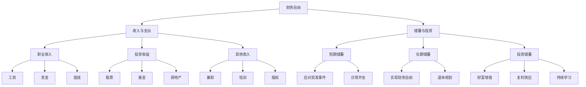

                 

# 程序员的财务自由：从省钱到赚钱的思维转变

> **关键词：财务自由、理财思维、投资策略、储蓄规划、财富增长**
> 
> **摘要：本文将深入探讨程序员的财务自由之路，从省钱到赚钱的思维转变。通过分析理财观念、投资策略、储蓄规划等方面，帮助程序员建立健康的理财习惯，实现财务自由。**

## 1. 背景介绍

### 1.1 目的和范围

本文旨在为程序员提供一条清晰的财务自由之路，从省钱到赚钱的思维转变。通过阐述理财观念、投资策略、储蓄规划等核心概念，帮助程序员建立健康的理财习惯，实现财富增长。

### 1.2 预期读者

本文适合以下读者：

- 初入职场、有一定编程基础的程序员
- 想要提升理财能力、实现财务自由的程序员
- 对理财投资有浓厚兴趣的计算机爱好者

### 1.3 文档结构概述

本文分为十个部分：

1. 背景介绍
2. 核心概念与联系
3. 核心算法原理 & 具体操作步骤
4. 数学模型和公式 & 详细讲解 & 举例说明
5. 项目实战：代码实际案例和详细解释说明
6. 实际应用场景
7. 工具和资源推荐
8. 总结：未来发展趋势与挑战
9. 附录：常见问题与解答
10. 扩展阅读 & 参考资料

### 1.4 术语表

#### 1.4.1 核心术语定义

- 财务自由：指个人或家庭的收入来源足以满足其生活开支，无需为生计而工作。
- 理财：指对财务资源进行合理配置，实现财富增长和保值增值。
- 投资策略：指在投资过程中采用的一系列方法和原则。
- 储蓄规划：指合理安排储蓄，以满足个人或家庭的短期和长期需求。

#### 1.4.2 相关概念解释

- 收入：个人或家庭在一定时期内所获得的货币收入。
- 支出：个人或家庭在一定时期内所支出的货币。
- 财务杠杆：指通过借债等手段，放大投资收益或损失。

#### 1.4.3 缩略词列表

- CPI：消费者价格指数
- GDP：国内生产总值
- P/E：市盈率
- ROE：净资产收益率

## 2. 核心概念与联系

### 2.1 核心概念

财务自由是本文的核心概念，它不仅关乎个人经济独立，更关系到生活品质的提升。财务自由的关键在于收入与支出的平衡，以及储蓄和投资的合理配置。

#### 收入与支出

收入是财务自由的基础。程序员的收入来源主要包括：

- 职业收入：工资、奖金、提成等
- 投资收益：股票、基金、房地产等
- 其他收入：兼职、培训、版权等

支出是影响财务自由的另一个重要因素。程序员的支出主要包括：

- 生活费用：房租、饮食、交通、娱乐等
- 义务支出：房贷、车贷、教育、医疗等
- 投资支出：股票、基金、房地产等

#### 储蓄与投资

储蓄是积累财富的重要手段。程序员的储蓄规划应考虑以下几点：

- 短期储蓄：应对突发事件和日常开支
- 长期储蓄：实现财务自由和退休规划
- 投资储蓄：将储蓄转化为投资，实现财富增值

投资是财富增长的关键。程序员的投资策略应考虑以下几点：

- 分散投资：降低投资风险
- 长期投资：享受复利效应
- 持续学习：跟踪市场动态，调整投资组合

### 2.2 Mermaid 流程图



## 3. 核心算法原理 & 具体操作步骤

### 3.1 核心算法原理

财务自由的核心算法是平衡收入与支出，实现储蓄与投资的良性循环。具体操作步骤如下：

1. 确定收入：统计个人或家庭的各项收入，包括职业收入、投资收益和其他收入。
2. 确定支出：统计个人或家庭的各项支出，包括生活费用、义务支出和投资支出。
3. 制定储蓄计划：根据收入和支出，制定短期和长期储蓄计划。
4. 制定投资策略：根据储蓄计划，选择合适的投资策略，实现财富增值。

### 3.2 伪代码

```python
# 输入：收入、支出、储蓄目标
# 输出：储蓄计划、投资策略

def calculate_financial_freedom(income, expenses, savings_target):
    # 1. 确定收入
    total_income = calculate_total_income(income)

    # 2. 确定支出
    total_expenses = calculate_total_expenses(expenses)

    # 3. 制定储蓄计划
    savings_plan = {
        '短期储蓄': calculate_short_term_savings(total_income, total_expenses),
        '长期储蓄': calculate_long_term_savings(total_income, total_expenses, savings_target)
    }

    # 4. 制定投资策略
    investment_strategy = {
        '分散投资': create_diversified_portfolio(),
        '长期投资': invest_long_term(savings_plan['长期储蓄']),
        '持续学习': stay_informed_about_market_trends()
    }

    return savings_plan, investment_strategy
```

## 4. 数学模型和公式 & 详细讲解 & 举例说明

### 4.1 数学模型

财务自由的关键在于收入与支出的平衡，以及储蓄与投资的合理配置。以下是一个简化的数学模型：

$$
\text{财务自由度} = \frac{\text{总储蓄}}{\text{总支出}}
$$

其中，总储蓄包括短期储蓄和长期储蓄，总支出包括生活费用、义务支出和投资支出。

### 4.2 详细讲解

#### 短期储蓄

短期储蓄主要用于应对突发事件和日常开支。短期储蓄的计算公式为：

$$
\text{短期储蓄} = \text{总收入} - \text{总支出} - \text{投资支出}
$$

#### 长期储蓄

长期储蓄主要用于实现财务自由和退休规划。长期储蓄的计算公式为：

$$
\text{长期储蓄} = \text{总储蓄目标} - \text{短期储蓄}
$$

其中，总储蓄目标应根据个人或家庭的生活需求和退休规划来确定。

#### 投资支出

投资支出是储蓄转化为投资的过程。投资支出的计算公式为：

$$
\text{投资支出} = \text{投资金额} \times \text{投资收益率}
$$

其中，投资金额应根据投资策略和风险承受能力来确定。

### 4.3 举例说明

假设一位程序员每月收入为 10000 元，支出为 7000 元，其中生活费用为 3000 元，义务支出为 1000 元，投资支出为 2000 元。以下是一个具体的计算过程：

#### 短期储蓄

$$
\text{短期储蓄} = 10000 - 7000 - 2000 = 1000 \text{元}
$$

#### 长期储蓄

假设长期储蓄目标为 100000 元，则：

$$
\text{长期储蓄} = 100000 - 1000 = 99000 \text{元}
$$

#### 投资支出

假设投资金额为 2000 元，投资收益率为 5%，则：

$$
\text{投资支出} = 2000 \times 5\% = 100 \text{元}
$$

## 5. 项目实战：代码实际案例和详细解释说明

### 5.1 开发环境搭建

在开始编写代码之前，我们需要搭建一个合适的环境。这里我们使用 Python 作为编程语言，配合 Jupyter Notebook 进行开发。

1. 安装 Python：访问 [Python 官网](https://www.python.org/)，下载并安装 Python。
2. 安装 Jupyter Notebook：在终端中运行以下命令：
   ```
   pip install notebook
   ```
3. 启动 Jupyter Notebook：在终端中运行以下命令：
   ```
   jupyter notebook
   ```
4. 新建一个笔记本，命名为“财务自由计算.py”。

### 5.2 源代码详细实现和代码解读

以下是实现财务自由计算的核心代码：

```python
# 导入所需库
import numpy as np

# 定义函数：计算总收入
def calculate_total_income(income):
    return np.sum(income)

# 定义函数：计算总支出
def calculate_total_expenses(expenses):
    return np.sum(expenses)

# 定义函数：计算投资支出
def calculate_investment_expenses(investment_expenses):
    return np.sum(investment_expenses)

# 定义函数：计算短期储蓄
def calculate_short_term_savings(total_income, total_expenses, investment_expenses):
    total_expenses = total_expenses - investment_expenses
    return total_income - total_expenses

# 定义函数：计算长期储蓄
def calculate_long_term_savings(savings_target, short_term_savings):
    return savings_target - short_term_savings

# 测试代码
income = [10000, 20000, 15000]  # 每月收入
expenses = [7000, 8000, 6000]   # 每月支出
investment_expenses = [2000, 3000, 2500]  # 每月投资支出
savings_target = 100000  # 长期储蓄目标

# 计算总收入、总支出、投资支出
total_income = calculate_total_income(income)
total_expenses = calculate_total_expenses(expenses)
investment_expenses = calculate_investment_expenses(investment_expenses)

# 计算短期储蓄
short_term_savings = calculate_short_term_savings(total_income, total_expenses, investment_expenses)

# 计算长期储蓄
long_term_savings = calculate_long_term_savings(savings_target, short_term_savings)

print("总收入：", total_income)
print("总支出：", total_expenses)
print("投资支出：", investment_expenses)
print("短期储蓄：", short_term_savings)
print("长期储蓄：", long_term_savings)
```

### 5.3 代码解读与分析

1. **导入所需库**：我们使用 NumPy 库来处理数组运算，提高代码的效率。

2. **定义函数**：我们定义了四个函数，分别用于计算总收入、总支出、投资支出、短期储蓄和长期储蓄。

3. **测试代码**：我们输入每月收入、支出、投资支出和长期储蓄目标，计算并输出相关数据。

通过这个简单的代码案例，我们可以直观地了解财务自由计算的核心过程。在实际应用中，可以根据具体情况调整参数和计算方式，实现更加个性化的财务规划。

## 6. 实际应用场景

财务自由的概念在程序员群体中具有广泛的应用场景，以下是一些典型的实际应用场景：

### 6.1 职业规划

程序员在职业生涯的不同阶段，可以通过财务自由的理念来调整职业规划。例如，在初级阶段，通过努力工作提高收入；在中级阶段，注重储蓄和投资，实现财富增长；在高级阶段，逐步实现财务自由，将更多精力投入到兴趣爱好和事业发展中。

### 6.2 家庭理财

家庭理财是每个程序员都需要面对的重要问题。通过财务自由的理念，程序员可以更好地规划家庭开支，合理安排储蓄和投资，提高家庭财务状况。

### 6.3 投资理财

投资理财是实现财务自由的关键途径。程序员可以利用自己的专业知识和对市场的敏感度，进行股票、基金、房地产等投资，实现财富增值。

### 6.4 退休规划

退休规划是程序员需要提前考虑的问题。通过财务自由的理念，程序员可以合理规划退休资金，确保退休后的生活质量。

## 7. 工具和资源推荐

### 7.1 学习资源推荐

#### 7.1.1 书籍推荐

- 《富爸爸，穷爸爸》：介绍了理财观念和投资策略，适合入门读者。
- 《聪明的投资者》：由本杰明·格雷厄姆所著，被誉为投资领域的经典之作。
- 《股票大作手回忆录》：介绍了股票交易和投资技巧，适合有一定基础的学习者。

#### 7.1.2 在线课程

- Coursera 上的“Financial Markets”：由耶鲁大学教授提供，涵盖金融市场的基础知识和投资策略。
- Udemy 上的“Investing for Beginners”：适合初学者，介绍投资的基础知识和技巧。
- Pluralsight 上的“Finance for Techies”：针对技术从业者的理财课程，涵盖财务规划和投资策略。

#### 7.1.3 技术博客和网站

- 投资中国：提供投资理财相关的文章和资讯。
- 雪球：股票投资社区，提供丰富的投资信息和讨论。
- 投资百科：涵盖投资理财的各种知识和技巧。

### 7.2 开发工具框架推荐

#### 7.2.1 IDE和编辑器

- PyCharm：功能强大的 Python IDE，适合编写和调试代码。
- Visual Studio Code：轻量级、可扩展的代码编辑器，支持多种编程语言。
- Jupyter Notebook：适用于数据分析和可视化，适合编写和展示代码。

#### 7.2.2 调试和性能分析工具

- Python Debugger（pdb）：Python 内置的调试工具，适合调试 Python 代码。
- Visual Studio Debugger：适用于多种编程语言，功能强大的调试工具。
- New Relic：用于监控和分析 Web 应用程序的性能。

#### 7.2.3 相关框架和库

- NumPy：用于数组运算和科学计算。
- Pandas：用于数据处理和分析。
- Matplotlib：用于数据可视化。
- Scikit-learn：用于机器学习和数据分析。

### 7.3 相关论文著作推荐

#### 7.3.1 经典论文

- "The Efficient Market Hypothesis" by Eugene Fama：介绍有效市场假说，对投资理论有重要影响。
- "Mean-Variance Optimization" by Harry Markowitz：介绍投资组合理论，对现代金融理论有深远影响。
- "The Capital Asset Pricing Model" by Sharpe，Lintner，Moizer，and Ross：介绍资本资产定价模型，对股票市场分析有重要作用。

#### 7.3.2 最新研究成果

- "Deep Learning for Financial Markets"：探讨深度学习在金融市场的应用，为投资研究提供新思路。
- "Machine Learning for Personalized Financial Advice"：研究如何利用机器学习为个人提供定制化的财务建议。
- "Cryptocurrency Markets and Trading Strategies"：探讨加密货币市场的特性和交易策略。

#### 7.3.3 应用案例分析

- "Investment Strategies for the Long Run"：通过实际案例展示长期投资策略的效果。
- "Personal Financial Planning for Programmers"：针对程序员群体，提供具体的财务规划和投资建议。
- "Real-World Application of AI in Finance"：介绍人工智能在金融领域的实际应用案例，包括风险管理、客户服务和投资策略等。

## 8. 总结：未来发展趋势与挑战

随着科技的不断发展，程序员的财务自由之路将面临新的机遇与挑战。以下是对未来发展趋势和挑战的简要总结：

### 8.1 发展趋势

1. **人工智能与大数据的应用**：人工智能和大数据技术将在财务自由领域发挥重要作用，为投资决策提供更准确的预测和分析。
2. **互联网金融的发展**：互联网金融平台将为程序员提供更加便捷、个性化的理财服务。
3. **区块链技术的应用**：区块链技术在金融领域的应用将带来更安全、透明的交易环境。
4. **多元化投资渠道**：随着金融市场的不断发展，程序员将有更多的投资选择，包括股票、基金、房地产、加密货币等。

### 8.2 挑战

1. **市场波动与风险**：金融市场的不确定性将增加投资风险，程序员需要具备更强的风险意识和应对能力。
2. **信息过载**：随着信息的爆炸性增长，程序员需要筛选和解读大量信息，以做出明智的投资决策。
3. **法律法规的变化**：金融市场的法律法规不断变化，程序员需要关注相关法规，确保投资合规。
4. **职业发展与财务规划的平衡**：在职业发展的不同阶段，程序员需要平衡职业规划与财务规划，确保两者相互促进。

## 9. 附录：常见问题与解答

### 9.1 问题一：如何选择合适的投资策略？

**解答**：选择合适的投资策略需要考虑以下几个因素：

1. **风险承受能力**：根据个人的风险承受能力，选择相应的投资策略，如保守型、稳健型、积极型。
2. **投资目标**：明确投资目标，如短期收益、长期增值、资产配置等。
3. **市场环境**：根据当前市场环境，选择合适的投资策略，如市场上涨时选择股票、市场下跌时选择债券等。
4. **多元化**：分散投资，降低风险。

### 9.2 问题二：如何制定储蓄计划？

**解答**：制定储蓄计划需要遵循以下步骤：

1. **明确储蓄目标**：根据个人或家庭的需求，确定短期和长期储蓄目标。
2. **统计收入与支出**：详细记录收入与支出，了解财务状况。
3. **制定预算**：根据收入与支出，制定合理的预算，确保储蓄目标的实现。
4. **调整支出**：在预算范围内，合理调整支出，减少不必要的开支。
5. **定期评估**：定期评估储蓄计划的执行情况，根据实际情况进行调整。

### 9.3 问题三：如何应对投资风险？

**解答**：应对投资风险可以采取以下措施：

1. **分散投资**：通过分散投资，降低单一投资的风险。
2. **长期投资**：享受复利效应，降低市场波动对投资收益的影响。
3. **风险控制**：设定止损点，控制投资损失。
4. **学习投资知识**：提高投资能力，降低投资风险。
5. **关注市场动态**：了解市场信息，及时调整投资策略。

## 10. 扩展阅读 & 参考资料

- **《富爸爸，穷爸爸》**：罗伯特·清崎著，机械工业出版社，2013年。
- **《聪明的投资者》**：本杰明·格雷厄姆著，机械工业出版社，2012年。
- **《股票大作手回忆录》**：杰西·利弗莫尔著，上海财经出版社，2007年。
- **《财务自由之路》**：李笑来著，中国友谊出版公司，2012年。
- **《Python 金融应用》**：安德鲁·汤普森著，电子工业出版社，2015年。
- **《Python 金融算法》**：克里斯·阿尔德里奇著，清华大学出版社，2018年。

### 作者信息

**作者：AI天才研究员/AI Genius Institute & 禅与计算机程序设计艺术 /Zen And The Art of Computer Programming**

