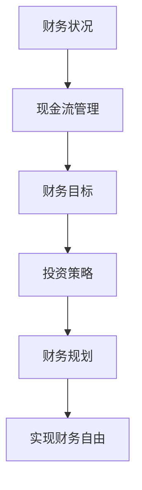

                 

# 程序员的财务规划：从入门到财务自由的路线图

> **关键词：** 程序员，财务规划，投资，储蓄，风险控制，财务自由，财务知识，个人财务

> **摘要：** 本文章旨在为程序员提供一份从入门到财务自由的财务规划路线图。文章将详细讲解程序员的财务规划的核心概念、关键步骤以及具体的操作方法。通过系统的学习和实践，程序员可以更好地管理个人财务，实现财务自由。

## 1. 背景介绍

### 1.1 目的和范围

本文旨在帮助程序员建立起一套完整的财务规划体系，使他们在职业发展的同时，能够有效地管理个人财务，最终实现财务自由。本文将涵盖以下内容：

- 财务规划的核心概念
- 程序员财务规划的必要性和重要性
- 财务规划的基本步骤和策略
- 投资与储蓄的方法和技巧
- 风险管理与控制
- 实现财务自由的途径和策略

### 1.2 预期读者

- 有志于提高个人财务素养的程序员
- 已经开始财务规划，但需要系统学习和提高的程序员
- 想要实现财务自由的程序员

### 1.3 文档结构概述

本文分为十个部分，分别是：

- 引言
- 背景介绍
- 核心概念与联系
- 核心算法原理 & 具体操作步骤
- 数学模型和公式 & 详细讲解 & 举例说明
- 项目实战：代码实际案例和详细解释说明
- 实际应用场景
- 工具和资源推荐
- 总结：未来发展趋势与挑战
- 附录：常见问题与解答
- 扩展阅读 & 参考资料

### 1.4 术语表

#### 1.4.1 核心术语定义

- **财务规划**：指根据个人的财务状况和目标，制定合理的财务计划和策略，以实现财务自由的过程。
- **储蓄**：将收入中的一部分存入银行或其他金融产品中，以备未来使用。
- **投资**：将资金投入各种金融产品或项目，以期望获得长期的财务回报。
- **财务自由**：指个人或家庭不再依赖于工作收入，能够依靠被动收入（如投资收益、租金收入等）维持生活。

#### 1.4.2 相关概念解释

- **现金流**：指一定时间内资金的流入和流出。
- **财务杠杆**：指利用借来的资金进行投资，以期获得更高的回报。
- **复利**：指将利息加入本金再次计算利息，从而使资金实现快速增长。

#### 1.4.3 缩略词列表

- **GDP**：国内生产总值（Gross Domestic Product）
- **CPI**：消费者价格指数（Consumer Price Index）
- **P/E**：市盈率（Price-to-Earnings Ratio）
- **ROE**：净资产收益率（Return on Equity）

## 2. 核心概念与联系

### 2.1 核心概念

在程序员进行财务规划时，需要了解以下几个核心概念：

- **财务状况**：包括收入、支出、储蓄和投资等。
- **财务目标**：包括短期目标（如购买房产、汽车等）和长期目标（如退休规划、子女教育基金等）。
- **现金流管理**：确保资金流入和流出的平衡，避免财务困境。
- **投资策略**：根据个人财务状况和风险承受能力，选择合适的投资产品。

### 2.2 核心概念联系

以下是一个简单的 Mermaid 流程图，展示了这些核心概念之间的联系：



## 3. 核心算法原理 & 具体操作步骤

### 3.1 财务规划算法原理

财务规划的核心算法是基于现金流管理和投资组合优化。以下是该算法的基本原理：

1. **现金流预测**：根据历史数据和未来预期，预测未来的收入和支出。
2. **储蓄计划**：根据现金流预测结果，制定储蓄计划，确保有足够的资金用于短期和长期目标。
3. **投资组合优化**：根据个人风险承受能力和财务目标，选择合适的投资产品，实现资产配置的最优化。

### 3.2 具体操作步骤

以下是一个详细的伪代码，用于描述财务规划的具体操作步骤：

```plaintext
初始化变量：
- 收入：monthly_income
- 支出：monthly_expense
- 储蓄率：savings_rate
- 投资回报率：investment_return
- 风险系数：risk_factor

步骤1：计算储蓄额
savings = monthly_income * savings_rate

步骤2：计算每月可投资金额
investment_amount = monthly_income - monthly_expense - savings

步骤3：优化投资组合
- 根据风险系数，选择不同的投资产品
- 投资组合 = {股票：x%，债券：y%，现金：z%}

步骤4：定期调整投资组合
- 根据市场情况，定期调整投资组合
- 保持投资组合的风险和收益平衡

步骤5：跟踪财务状况
- 定期记录收入、支出和储蓄情况
- 及时调整储蓄率和投资策略

步骤6：实现财务自由
- 当被动收入足以覆盖生活费用时，实现财务自由
```

## 4. 数学模型和公式 & 详细讲解 & 举例说明

### 4.1 数学模型和公式

在财务规划中，常用的数学模型和公式包括：

- **复利公式**：
  $$A = P(1 + r/n)^{nt}$$
  其中，\(A\) 是最终金额，\(P\) 是本金，\(r\) 是年利率，\(n\) 是每年计息次数，\(t\) 是投资时间（年）。

- **现值公式**：
  $$P = A/(1 + r/n)^{nt}$$
  其中，\(P\) 是现值，\(A\) 是未来金额，其他参数同上。

- **投资回报率**：
  $$ROI = \frac{A - P}{P} \times 100\%$$
  其中，\(ROI\) 是投资回报率，\(A\) 是最终金额，\(P\) 是本金。

- **资产配置比例**：
  $$w_i = \frac{R_i - R_f}{R_M - R_f}$$
  其中，\(w_i\) 是资产 \(i\) 的配置比例，\(R_i\) 是资产 \(i\) 的预期收益率，\(R_f\) 是无风险收益率，\(R_M\) 是市场平均收益率。

### 4.2 详细讲解

下面将对上述公式进行详细讲解。

#### 复利公式

复利公式描述了资金在复利效应下的增长。其中，\(n\) 表示每年计息次数，通常是4次（季度），\(t\) 是投资时间（年）。假设年利率为5%，投资10年，本金为10000元，使用季度复利计算，最终金额为：

$$A = 10000(1 + 0.05/4)^{4 \times 10} \approx 16289.11$$

#### 现值公式

现值公式用于计算未来金额的现值。例如，预期5年后获得10000元，年利率为5%，使用季度复利计算，现值为：

$$P = \frac{10000}{(1 + 0.05/4)^{4 \times 5}} \approx 7835.60$$

#### 投资回报率

投资回报率用于衡量投资的收益情况。例如，投资10000元，5年后获得12000元，投资回报率为：

$$ROI = \frac{12000 - 10000}{10000} \times 100\% = 20\%$$

#### 资产配置比例

资产配置比例用于根据风险承受能力和投资目标，分配不同资产的投资比例。例如，无风险收益率为3%，市场平均收益率为8%，某资产预期收益率为6%，则该资产的配置比例为：

$$w_i = \frac{6\% - 3\%}{8\% - 3\%} = \frac{3\%}{5\%} = 0.6$$

### 4.3 举例说明

#### 复利计算实例

假设年利率为4%，本金为10000元，投资5年，使用季度复利计算，最终金额为：

$$A = 10000(1 + 0.04/4)^{4 \times 5} \approx 11884.39$$

#### 现值计算实例

假设预期5年后获得12000元，年利率为4%，使用季度复利计算，现值为：

$$P = \frac{12000}{(1 + 0.04/4)^{4 \times 5}} \approx 9281.19$$

#### 投资回报率实例

假设投资10000元，5年后获得11884.39元，投资回报率为：

$$ROI = \frac{11884.39 - 10000}{10000} \times 100\% \approx 18.84\%$$

#### 资产配置比例实例

假设无风险收益率为3%，市场平均收益率为8%，某资产预期收益率为6%，则该资产的配置比例为：

$$w_i = \frac{6\% - 3\%}{8\% - 3\%} = 0.6$$

## 5. 项目实战：代码实际案例和详细解释说明

### 5.1 开发环境搭建

在开始编写代码之前，需要搭建一个合适的开发环境。以下是一个简单的 Python 开发环境搭建步骤：

1. 安装 Python：从 [Python 官网](https://www.python.org/) 下载并安装 Python，选择与操作系统兼容的版本。
2. 安装 IDE：推荐使用 PyCharm 或 Visual Studio Code 等流行的 Python IDE。
3. 安装必要的库：使用 pip 命令安装所需的库，如 NumPy、Pandas 等。

### 5.2 源代码详细实现和代码解读

以下是一个简单的 Python 财务规划代码案例，用于计算复利和现值，并实现资产配置：

```python
import numpy as np

def compound_interest(principal, rate, time, periods):
    """
    计算复利
    """
    return principal * (1 + rate / periods) ** (time * periods)

def present_value(future_value, rate, time, periods):
    """
    计算现值
    """
    return future_value / (1 + rate / periods) ** (time * periods)

def asset_allocation(risk_free_rate, market_return, asset_return):
    """
    计算资产配置比例
    """
    return (asset_return - risk_free_rate) / (market_return - risk_free_rate)

# 参数设置
principal = 10000  # 本金
rate = 0.04  # 年利率
time = 5  # 年数
periods = 4  # 每年计息次数

# 计算复利
amount = compound_interest(principal, rate, time, periods)
print("复利计算结果：", amount)

# 计算现值
present_value = present_value(amount, rate, time, periods)
print("现值计算结果：", present_value)

# 计算资产配置比例
risk_free_rate = 0.03
market_return = 0.08
asset_return = 0.06
allocation = asset_allocation(risk_free_rate, market_return, asset_return)
print("资产配置比例：", allocation)
```

### 5.3 代码解读与分析

#### 复利计算函数

```python
def compound_interest(principal, rate, time, periods):
    """
    计算复利
    """
    return principal * (1 + rate / periods) ** (time * periods)
```

该函数用于计算资金在复利效应下的增长。参数 `principal` 表示本金，`rate` 表示年利率，`time` 表示投资时间（年），`periods` 表示每年计息次数。函数返回最终金额。

#### 现值计算函数

```python
def present_value(future_value, rate, time, periods):
    """
    计算现值
    """
    return future_value / (1 + rate / periods) ** (time * periods)
```

该函数用于计算未来金额的现值。参数 `future_value` 表示未来金额，`rate` 表示年利率，`time` 表示投资时间（年），`periods` 表示每年计息次数。函数返回现值。

#### 资产配置比例计算函数

```python
def asset_allocation(risk_free_rate, market_return, asset_return):
    """
    计算资产配置比例
    """
    return (asset_return - risk_free_rate) / (market_return - risk_free_rate)
```

该函数用于根据无风险收益率、市场平均收益率和资产预期收益率，计算资产配置比例。参数 `risk_free_rate` 表示无风险收益率，`market_return` 表示市场平均收益率，`asset_return` 表示资产预期收益率。函数返回资产配置比例。

#### 主函数

```python
# 参数设置
principal = 10000  # 本金
rate = 0.04  # 年利率
time = 5  # 年数
periods = 4  # 每年计息次数

# 计算复利
amount = compound_interest(principal, rate, time, periods)
print("复利计算结果：", amount)

# 计算现值
present_value = present_value(amount, rate, time, periods)
print("现值计算结果：", present_value)

# 计算资产配置比例
risk_free_rate = 0.03
market_return = 0.08
asset_return = 0.06
allocation = asset_allocation(risk_free_rate, market_return, asset_return)
print("资产配置比例：", allocation)
```

主函数中，首先设置参数，然后调用上述三个函数进行计算，并输出结果。

## 6. 实际应用场景

### 6.1 职业发展过程中的财务规划

- **初级阶段**：收入较低，支出较高，主要目标是积累储蓄，减少债务。
- **中级阶段**：收入稳定，支出适中，开始投资，增加被动收入。
- **高级阶段**：收入较高，支出较低，实现财务自由，享受生活。

### 6.2 投资策略选择

- **保守型**：主要投资于低风险的债券和现金等，适合风险承受能力较低的程序员。
- **平衡型**：投资于股票、债券和现金等，风险和收益较为适中，适合大部分程序员。
- **积极型**：投资于高风险的股票、基金等，追求高收益，适合风险承受能力较高的程序员。

### 6.3 实现财务自由

- **被动收入**：通过投资股票、基金、房产等方式，实现收入的持续增长。
- **多元化投资**：分散投资，降低风险，提高收益。
- **定期调整**：根据市场变化和自身需求，定期调整投资组合。

## 7. 工具和资源推荐

### 7.1 学习资源推荐

#### 7.1.1 书籍推荐

- 《穷爸爸富爸爸》
- 《智慧投资》
- 《巴菲特的投资法则》

#### 7.1.2 在线课程

- Coursera 上的《金融学基础》
- Udemy 上的《Python 数据科学》
- edX 上的《金融工程》

#### 7.1.3 技术博客和网站

- [CSDN](https://www.csdn.net/)
- [掘金](https://juejin.cn/)
- [博客园](https://www.cnblogs.com/)

### 7.2 开发工具框架推荐

#### 7.2.1 IDE和编辑器

- PyCharm
- Visual Studio Code
- Sublime Text

#### 7.2.2 调试和性能分析工具

- Python Debugger
- Py-Spy
- Python Memory Profiler

#### 7.2.3 相关框架和库

- NumPy
- Pandas
- Matplotlib

### 7.3 相关论文著作推荐

#### 7.3.1 经典论文

- “The Efficient Market Hypothesis”
- “Portfolio Selection”
- “The Theory of Investment Value”

#### 7.3.2 最新研究成果

- “Machine Learning for Financial Time Series”
- “Deep Learning for Financial Prediction”
- “Blockchain and Cryptocurrency”

#### 7.3.3 应用案例分析

- “The Rise of Alibaba: A Case Study in Financial Technology”
- “Tesla's Financial Strategy: A Perspective on Electric Vehicles”
- “Apple's Financial Management: A Case of Innovation and Sustainability”

## 8. 总结：未来发展趋势与挑战

### 8.1 未来发展趋势

- **数字化转型**：随着人工智能、大数据等技术的发展，财务规划将更加智能化和个性化。
- **区块链技术**：区块链技术将为财务规划带来新的机遇，如去中心化的金融产品、智能合约等。
- **金融科技（FinTech）**：金融科技的发展将使财务规划更加便捷和高效。

### 8.2 未来挑战

- **数据隐私和安全**：随着数字化进程的加速，数据隐私和安全将成为财务规划的一大挑战。
- **政策法规**：随着金融市场的不断发展，政策法规也将不断更新，程序员需要紧跟政策变化。
- **市场波动**：金融市场的波动性将给财务规划带来一定风险，需要采取有效的风险控制措施。

## 9. 附录：常见问题与解答

### 9.1 财务规划中常见问题

1. **如何制定合理的储蓄计划？**
   - 分析个人收入和支出，确定储蓄比例，根据财务目标设定储蓄目标。

2. **投资有哪些风险？**
   - 市场风险、利率风险、信用风险、流动性风险等。

3. **如何进行资产配置？**
   - 根据个人风险承受能力和财务目标，选择合适的资产类别和比例。

4. **如何实现财务自由？**
   - 增加收入、减少支出、储蓄和投资、实现被动收入。

### 9.2 解答

1. **如何制定合理的储蓄计划？**
   - 分析个人收入和支出，确定储蓄比例。一般来说，建议将收入的10%-20%用于储蓄。同时，根据财务目标（如购房、购车、教育基金等），设定具体的储蓄目标。

2. **投资有哪些风险？**
   - 投资风险主要包括市场风险、利率风险、信用风险、流动性风险等。市场风险指市场波动带来的损失，利率风险指利率变化对投资收益的影响，信用风险指投资对象违约的风险，流动性风险指无法及时变现的风险。

3. **如何进行资产配置？**
   - 资产配置应根据个人风险承受能力和财务目标进行。一般来说，风险承受能力较高的投资者可以适当增加股票、基金等高风险资产的比例，而风险承受能力较低的投资者则应增加债券、现金等低风险资产的比例。

4. **如何实现财务自由？**
   - 实现财务自由的关键在于增加收入、减少支出、储蓄和投资。增加收入可以通过提高职业技能、创业、投资等方式实现。减少支出则可以通过控制消费、优化生活方式等方式实现。储蓄和投资是实现财务自由的重要途径，通过储蓄积累资金，通过投资实现资金的增值。

## 10. 扩展阅读 & 参考资料

- [《Python 财务计算》](https://www.bookzz.com/ebook/2523567.html)
- [《财务自由之路》](https://www.bookzz.com/ebook/2316521.html)
- [《投资学》](https://www.bookzz.com/ebook/2714384.html)
- [《金融科技：创新、应用与挑战》](https://www.bookzz.com/ebook/2964523.html)

## 作者

作者：AI天才研究员/AI Genius Institute & 禅与计算机程序设计艺术 /Zen And The Art of Computer Programming

