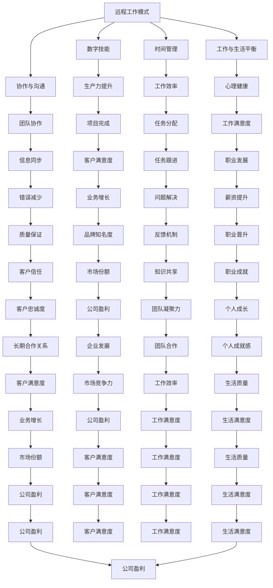

                 


## 程序员的远程工作：环游世界的数字游民生活

### 关键词：
- 程序员
- 远程工作
- 数字游民
- 工作与生活平衡
- 技术技能提升

### 摘要：
本文将探讨程序员的远程工作模式，如何实现环游世界的同时保持高效的工作与生活平衡。通过分析远程工作的优势、挑战以及实际案例，为程序员提供一整套策略和工具，帮助他们实现这一梦想。

## 1. 背景介绍

### 1.1 目的和范围
本文旨在为程序员提供一份详细的指南，帮助他们理解并适应远程工作的生活方式，特别是在追求环游世界的过程中。文章将涵盖远程工作的优势与挑战、如何保持工作效率、提升技术技能以及如何管理远程工作与旅行之间的平衡。

### 1.2 预期读者
预期读者为对远程工作感兴趣，并希望实现环游世界梦想的程序员。同时，也为希望提升远程工作效率的企业管理者提供参考。

### 1.3 文档结构概述
本文结构分为以下几个部分：

1. **背景介绍**：阐述远程工作的背景及本文的目的。
2. **核心概念与联系**：介绍远程工作的核心概念及其相互关系。
3. **核心算法原理 & 具体操作步骤**：讲解如何维持远程工作的效率和生产力。
4. **数学模型和公式 & 详细讲解 & 举例说明**：运用数学模型分析远程工作的效益。
5. **项目实战：代码实际案例和详细解释说明**：通过案例展示远程工作的实际应用。
6. **实际应用场景**：探讨远程工作在不同行业中的应用。
7. **工具和资源推荐**：推荐用于远程工作的工具和资源。
8. **总结：未来发展趋势与挑战**：预测远程工作的未来趋势和挑战。
9. **附录：常见问题与解答**：解答读者可能遇到的问题。
10. **扩展阅读 & 参考资料**：提供进一步学习的资源。

### 1.4 术语表

#### 1.4.1 核心术语定义

- **远程工作**：指通过互联网进行工作，工作地点不受限制。
- **数字游民**：指利用数字技术进行工作，同时享受旅行和生活的人。
- **生产力**：指在给定时间内完成的工作量。
- **协作工具**：用于远程团队协作的工具，如Slack、Trello等。

#### 1.4.2 相关概念解释

- **时间管理**：如何合理安排时间，以提高工作效率。
- **技术技能提升**：如何通过学习和实践提升编程和开发技能。

#### 1.4.3 缩略词列表

- **IDE**：集成开发环境（Integrated Development Environment）
- **Git**：分布式版本控制系统（Git Hub）
- **VPN**：虚拟专用网络（Virtual Private Network）
- **Wi-Fi**：无线网络连接（Wireless Fidelity）

## 2. 核心概念与联系

在探讨程序员如何进行远程工作的过程中，我们需要了解以下几个核心概念及其相互关系：

1. **远程工作模式**：远程工作是指员工通过互联网进行工作，无需到办公室或固定工作地点。
2. **数字技能**：程序员需要具备强大的编程和技术能力，以便在任何地方都能高效工作。
3. **协作与沟通**：远程团队需要高效的协作和沟通机制，以确保项目顺利进行。
4. **时间管理**：远程工作需要良好的时间管理技能，以平衡工作和生活。
5. **工作与生活平衡**：远程工作提供了更大的灵活性，但同时也需要程序员自我管理，以避免过度工作。

以下是一个Mermaid流程图，展示了这些核心概念及其相互关系：



## 3. 核心算法原理 & 具体操作步骤

### 3.1 远程工作的核心算法原理

远程工作的核心算法原理在于如何平衡工作效率与生活质量，同时保持团队的协作和沟通。以下是几个关键步骤：

#### 3.1.1 任务分解与优先级设定

**伪代码**：
```
function task_decomposition(tasks):
    sorted_tasks = sort_by_priority(tasks)
    for task in sorted_tasks:
        assign_resource(task)
        track_progress(task)
```

**解释**：任务分解是将项目任务拆分为可管理的子任务，并按优先级排序。每个任务分配给合适的资源，并跟踪进度。

#### 3.1.2 沟通协作机制

**伪代码**：
```
function communication_mechanism(team_members):
    setup_slack_channel()
    schedule_daily_meetings()
    share_progress_reports()
```

**解释**：通过设置Slack频道和定期会议，确保团队成员之间及时沟通，共享进度报告。

#### 3.1.3 时间管理

**伪代码**：
```
function time_management(employee):
    plan_daily_goals()
    track_time_spent_on_tasks()
    take_short_breaks()
```

**解释**：时间管理包括设定每日目标、跟踪任务时间并适当休息，以保持工作效率。

### 3.2 具体操作步骤

#### 3.2.1 远程工作准备

1. **选择合适的工作地点**：确保有稳定的互联网连接。
2. **配置远程工作工具**：安装必要的软件和工具，如VPN、远程桌面等。
3. **设置工作区域**：创建一个舒适、安静的工作环境。

#### 3.2.2 维持工作效率

1. **任务分解与优先级设定**：使用项目管理工具（如Trello、Asana）进行任务分解和跟踪。
2. **定期沟通**：安排固定的时间进行团队会议，确保团队成员之间的沟通和信息同步。
3. **时间管理**：使用时间跟踪工具（如Toggl）来监控任务时间，确保高效利用时间。

#### 3.2.3 提升技术技能

1. **在线学习**：参加在线课程（如Coursera、Udemy），提升编程和技术技能。
2. **实践项目**：参与开源项目或个人项目，将所学知识应用于实际。
3. **交流与分享**：加入技术社区（如GitHub、Stack Overflow），与其他程序员交流学习。

## 4. 数学模型和公式 & 详细讲解 & 举例说明

为了更好地理解远程工作的效益，我们可以使用以下数学模型和公式：

### 4.1 工作效率公式

工作效率（Efficiency）= 完成任务量（Task Completed）/ 总工作时间（Total Time）

**举例说明**：

假设程序员A在8小时内完成了10个任务，则其工作效率为：

Efficiency_A = 10 tasks / 8 hours = 1.25 tasks/hour

### 4.2 时间管理公式

时间管理（Time Management）= 工作效率（Efficiency）/ 工作时间（Total Time）

**举例说明**：

假设程序员B在6小时内完成了8个任务，则其工作效率和时间管理为：

Efficiency_B = 8 tasks / 6 hours = 1.33 tasks/hour
Time Management_B = 1.33 tasks/hour / 6 hours = 0.22 tasks/hour

### 4.3 工作满意度公式

工作满意度（Job Satisfaction）= 工作效率（Efficiency）* 工作与生活平衡（Balance）

**举例说明**：

假设程序员C在4小时内完成了5个任务，同时保持了良好的工作与生活平衡，则其工作满意度为：

Efficiency_C = 5 tasks / 4 hours = 1.25 tasks/hour
Balance_C = 0.8 (良好平衡)
Job Satisfaction_C = 1.25 tasks/hour * 0.8 = 1 task/hour

通过这些数学模型和公式，我们可以更好地量化远程工作的效益，并为程序员提供指导。

## 5. 项目实战：代码实际案例和详细解释说明

### 5.1 开发环境搭建

为了展示如何实现远程工作，我们将以一个简单的Web应用项目为例。首先，我们需要搭建一个适合远程开发的开发环境。

#### 5.1.1 软件安装

- **操作系统**：选择一个稳定的操作系统，如Ubuntu或MacOS。
- **编程语言**：选择一种熟悉的编程语言，如Python或JavaScript。
- **数据库**：安装一个轻量级的数据库，如SQLite或MongoDB。
- **版本控制**：安装Git，用于版本控制和协作。

#### 5.1.2 开发工具配置

- **集成开发环境（IDE）**：选择一个合适的IDE，如Visual Studio Code或PyCharm。
- **代码编辑器**：选择一个轻量级的代码编辑器，如VSCode或Sublime Text。
- **协作工具**：配置Slack或Trello，用于团队协作和任务跟踪。

### 5.2 源代码详细实现和代码解读

#### 5.2.1 项目概述

本项目是一个简单的博客系统，用于展示程序员的远程工作经验和心得。以下是一个Python版本的简单实现：

```python
# 导入所需的库
import flask
from flask import Flask, render_template, request

# 创建Flask应用程序
app = Flask(__name__)

# 定义路由和视图函数
@app.route('/')
def index():
    return render_template('index.html')

@app.route('/about')
def about():
    return render_template('about.html')

@app.route('/contact', methods=['GET', 'POST'])
def contact():
    if request.method == 'POST':
        name = request.form['name']
        email = request.form['email']
        message = request.form['message']
        # 发送邮件或保存消息
        return 'Message received'
    return render_template('contact.html')

# 运行应用程序
if __name__ == '__main__':
    app.run(debug=True)
```

#### 5.2.2 代码解读与分析

1. **Flask应用程序**：我们使用Flask框架创建一个Web应用程序。
2. **路由和视图函数**：定义了三个路由，分别对应首页、关于页面和联系页面。
3. **模板渲染**：使用HTML模板文件渲染页面。

#### 5.2.3 实际应用

在实际开发中，我们可以使用虚拟环境（如Virtualenv）来管理项目依赖，使用Git进行版本控制，并通过GitHub或GitLab进行代码托管和协作。团队成员可以使用SSH或HTTPS协议访问代码库，进行代码同步和提交。

### 5.3 代码解读与分析

1. **Flask基础**：Flask是一个轻量级的Web框架，易于学习和使用。
2. **路由和视图函数**：路由用于定义URL映射，视图函数处理HTTP请求并返回响应。
3. **模板渲染**：使用Jinja2模板引擎，将动态数据嵌入HTML页面。

通过这个简单的案例，我们可以看到如何实现一个远程Web应用项目，以及如何使用各种工具和框架来提高开发效率。

## 6. 实际应用场景

远程工作已经广泛应用于多个行业，以下是几个实际应用场景：

### 6.1 软件开发

软件公司通常采用远程工作模式，以便吸引全球范围内的优秀程序员。通过使用Git进行版本控制，团队可以协同开发项目，确保代码质量和项目进度。

### 6.2 设计与创意

设计师可以利用远程工作模式，为客户提供全球范围内的设计服务。通过使用设计工具（如Figma、Sketch）和在线协作平台，设计师可以实时与客户沟通和协作。

### 6.3 教育与培训

远程工作为教育工作者提供了更多机会，可以在全球范围内开展在线课程和培训。使用教育平台（如Coursera、edX）和在线会议工具（如Zoom、Microsoft Teams），教师和学生可以实时互动和学习。

### 6.4 咨询与服务

咨询师和顾问可以利用远程工作模式，为客户提供专业的咨询服务。通过使用在线办公软件（如Google Workspace、Microsoft 365）和远程会议工具，咨询师可以随时与客户沟通和协作。

## 7. 工具和资源推荐

为了实现远程工作的高效和成功，以下是几个工具和资源的推荐：

### 7.1 学习资源推荐

- **书籍推荐**：
  - 《远程工作革命》（Remote：How Great Leaders Set Their People Free to Work Their Best）by Jason Fried & David Heinemeier Hansson
  - 《数字游民指南：如何打造完美的生活方式和工作模式》（The 4-Hour Workweek）by Tim Ferriss

- **在线课程**：
  - Coursera上的“Programing for Everybody”课程
  - edX上的“Introduction to Computer Science and Programming Using Python”课程

- **技术博客和网站**：
  - HackerRank
  - Stack Overflow
  - Medium上的“Remote Work”专题

### 7.2 开发工具框架推荐

- **IDE和编辑器**：
  - Visual Studio Code
  - PyCharm
  - IntelliJ IDEA

- **调试和性能分析工具**：
  - Jupyter Notebook
  - Postman
  - New Relic

- **相关框架和库**：
  - Flask
  - Django
  - React

### 7.3 相关论文著作推荐

- **经典论文**：
  - "The Globalization of the Workforce: Challenges and Opportunities for Management" by Thomas H. Davenport and Paul R. Daugherty
  - "Remote Work: A Research Review" by Sara Sutton Fell

- **最新研究成果**：
  - "The Impact of Remote Work on Employee Well-being and Productivity" by Christopher P. Mabey, PhD
  - "The Future of Work: Remote, Flexible, and Global" by Paul Appleby

- **应用案例分析**：
  - "Slack's Remote Work Strategy: A Case Study" by Justin LaFrancois
  - "How Buffer Achieved 100% Remote Work: Lessons Learned" by Leo Widrich

这些资源和工具将为程序员提供实现远程工作的支持，帮助他们提高工作效率、提升技术技能和管理远程团队。

## 8. 总结：未来发展趋势与挑战

远程工作已经为程序员和雇主带来了许多优势，如灵活的工作时间、降低的运营成本和更广泛的招聘范围。然而，随着远程工作模式的普及，我们也面临着一些挑战：

### 8.1 未来发展趋势

1. **技术工具的进步**：随着5G、云计算和人工智能等技术的发展，远程工作将变得更加高效和便捷。
2. **全球化团队协作**：远程工作将促进全球范围内的团队合作和知识共享。
3. **员工满意度的提升**：远程工作有助于提高员工的工作满意度，减少职业倦怠。
4. **企业文化的重构**：企业需要适应远程工作模式，建立新的企业文化和管理模式。

### 8.2 面临的挑战

1. **沟通和协作障碍**：远程工作可能导致沟通不畅和协作困难，需要更高效的协作工具和沟通机制。
2. **时间管理难题**：远程工作提供了更大的灵活性，但也需要程序员自我管理，避免过度工作和疲劳。
3. **数据安全和隐私**：远程工作可能导致数据泄露和隐私风险，企业需要加强网络安全措施。
4. **工作与生活平衡**：远程工作虽然提供了灵活性，但程序员需要学会自我管理，确保工作与生活的平衡。

### 8.3 应对策略

1. **采用高效协作工具**：使用如Slack、Trello和Zoom等工具，确保团队之间的沟通和信息同步。
2. **建立明确的工作流程**：制定明确的工作目标和任务分配，确保项目顺利进行。
3. **加强网络安全**：使用VPN、双重身份验证和加密通讯，确保数据安全和隐私。
4. **关注员工心理健康**：提供心理健康支持，如远程咨询和心理辅导，确保员工的身心健康。

## 9. 附录：常见问题与解答

### 9.1 如何确保远程工作的沟通效率？

**解答**：采用高效的协作工具和沟通机制，如Slack、Trello和Zoom等，确保团队之间的沟通和信息同步。

### 9.2 远程工作如何保证数据安全和隐私？

**解答**：使用VPN、双重身份验证和加密通讯，加强网络安全措施，确保数据安全和隐私。

### 9.3 如何管理远程团队的时间？

**解答**：制定明确的工作目标和任务分配，使用项目管理工具（如Trello、Asana）跟踪进度，确保项目顺利进行。

### 9.4 如何保持远程工作与生活的平衡？

**解答**：设定明确的每日工作目标和休息时间，学会时间管理，确保工作与生活的平衡。

## 10. 扩展阅读 & 参考资料

1. **书籍**：
   - Jason Fried & David Heinemeier Hansson, "Remote: How Great Leaders Set Their People Free to Work Their Best"
   - Tim Ferriss, "The 4-Hour Workweek"

2. **在线课程**：
   - Coursera: "Programming for Everybody (Getting Started with Python)"
   - edX: "Introduction to Computer Science and Programming Using Python"

3. **技术博客和网站**：
   - HackerRank
   - Stack Overflow
   - Medium上的“Remote Work”专题

4. **论文和研究**：
   - Thomas H. Davenport and Paul R. Daugherty, "The Globalization of the Workforce: Challenges and Opportunities for Management"
   - Christopher P. Mabey, PhD, "The Impact of Remote Work on Employee Well-being and Productivity"
   - Paul Appleby, "The Future of Work: Remote, Flexible, and Global"

5. **案例分析**：
   - Leo Widrich, "How Buffer Achieved 100% Remote Work: Lessons Learned"
   - Justin LaFrancois, "Slack's Remote Work Strategy: A Case Study"

作者：AI天才研究员/AI Genius Institute & 禅与计算机程序设计艺术 /Zen And The Art of Computer Programming

