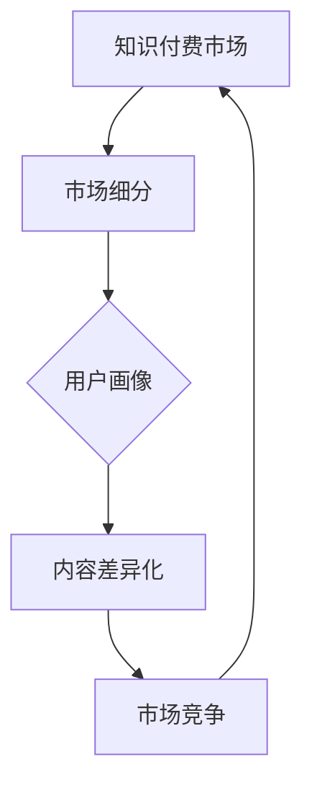

                 

# 程序员知识付费的内容差异化策略

> **关键词：** 知识付费，内容差异化，程序员，市场策略，用户体验
>
> **摘要：** 本文旨在探讨程序员在知识付费领域如何通过内容差异化策略提升自身的市场竞争力，增强用户粘性，从而实现个人价值最大化。文章将深入分析内容差异化的核心概念、操作步骤、实际应用，并推荐相关工具和资源，帮助程序员在知识付费市场中脱颖而出。

## 1. 背景介绍

### 1.1 目的和范围

本文将围绕知识付费这一日益繁荣的领域，探讨程序员如何利用内容差异化策略提升自身的市场地位。我们将分析内容差异化的定义、重要性，以及在实际操作中的具体步骤。通过本文的阅读，读者将了解如何制定个性化的内容策略，以适应不断变化的市场需求和用户偏好。

### 1.2 预期读者

本文主要面向希望提升自身市场价值的程序员，以及对于知识付费领域有浓厚兴趣的IT从业者。通过阅读本文，读者将获得关于内容差异化策略的深入理解，并掌握将其应用于实际工作的方法。

### 1.3 文档结构概述

本文结构如下：

1. **背景介绍**：介绍文章的目的、范围和预期读者。
2. **核心概念与联系**：阐述内容差异化的核心概念，并提供Mermaid流程图。
3. **核心算法原理 & 具体操作步骤**：详细讲解内容差异化的具体操作步骤，使用伪代码进行阐述。
4. **数学模型和公式 & 详细讲解 & 举例说明**：介绍相关的数学模型和公式，并举例说明。
5. **项目实战：代码实际案例和详细解释说明**：通过实际案例展示内容差异化的应用。
6. **实际应用场景**：分析内容差异化在不同场景下的应用。
7. **工具和资源推荐**：推荐相关的学习资源和开发工具。
8. **总结：未来发展趋势与挑战**：总结内容差异化策略的发展趋势和面临的挑战。
9. **附录：常见问题与解答**：解答读者可能遇到的问题。
10. **扩展阅读 & 参考资料**：提供进一步阅读的参考资料。

### 1.4 术语表

#### 1.4.1 核心术语定义

- **知识付费**：指用户为了获取特定知识或服务，支付相应费用的行为。
- **内容差异化**：指通过创造独特、有价值的内容，使产品或服务在市场上具备与众不同的特点。
- **用户体验**：用户在使用产品或服务过程中感受到的总体感受。

#### 1.4.2 相关概念解释

- **市场细分**：将整体市场划分为若干个具有相似需求的子市场。
- **用户画像**：通过对用户数据的分析，构建出用户的特征和行为模型。

#### 1.4.3 缩略词列表

- **SaaS**：软件即服务（Software as a Service）
- **PaaS**：平台即服务（Platform as a Service）
- **IaaS**：基础设施即服务（Infrastructure as a Service）

## 2. 核心概念与联系

在知识付费领域，内容差异化是提升竞争力的关键因素。为了更好地理解这一概念，我们首先需要明确以下几个核心概念：

### 2.1 内容差异化

内容差异化是指通过创造独特、有价值的内容，使产品或服务在市场上具备与众不同的特点。在程序员的知识付费领域，内容差异化可以帮助程序员在众多竞争者中脱颖而出，吸引更多用户。

### 2.2 市场细分

市场细分是指将整体市场划分为若干个具有相似需求的子市场。通过对不同子市场的分析和定位，程序员可以更有针对性地制定内容策略，满足不同用户的需求。

### 2.3 用户画像

用户画像是指通过对用户数据的分析，构建出用户的特征和行为模型。用户画像是内容差异化策略制定的重要基础，有助于程序员了解目标用户，创造更具针对性的内容。

### 2.4 Mermaid流程图

为了更直观地展示内容差异化的核心概念和联系，我们使用Mermaid绘制了一个流程图：



在该流程图中，知识付费市场作为起点，通过市场细分和用户画像的分析，最终实现内容差异化，从而提升市场竞争能力。

## 3. 核心算法原理 & 具体操作步骤

内容差异化的实现需要一系列核心算法原理和具体操作步骤。下面我们将详细阐述这些内容，并使用伪代码进行说明。

### 3.1 市场细分

市场细分是内容差异化的第一步。通过对市场的分析，将整体市场划分为若干个具有相似需求的子市场。以下是一个简单的市场细分算法：

```plaintext
// 输入：市场数据
// 输出：子市场列表

function marketSegmentation(data) {
    // 数据预处理
    preprocessData(data)

    // 划分子市场
    segments = []

    // 遍历数据，根据相似度划分子市场
    for (each record in data) {
        assigned = false
        for (each segment in segments) {
            if (isSimilar(segment, record)) {
                segment.records.add(record)
                assigned = true
                break
            }
        }
        if (!assigned) {
            newSegment = new Segment()
            newSegment.records.add(record)
            segments.add(newSegment)
        }
    }

    return segments
}
```

### 3.2 用户画像

用户画像是内容差异化策略制定的重要基础。通过对用户数据的分析，构建出用户的特征和行为模型。以下是一个简单的用户画像算法：

```plaintext
// 输入：用户数据
// 输出：用户画像

function buildUserProfile(data) {
    // 数据预处理
    preprocessData(data)

    // 构建用户画像
    userProfile = {}

    // 遍历数据，提取用户特征
    for (each record in data) {
        for (each feature in record) {
            if (userProfile.hasOwnProperty(feature)) {
                userProfile[feature].count++
            } else {
                userProfile[feature] = {count: 1, value: record[feature]}
            }
        }
    }

    // 计算特征权重
    for (each feature in userProfile) {
        userProfile[feature].weight = userProfile[feature].count / totalRecords
    }

    return userProfile
}
```

### 3.3 内容差异化

内容差异化是核心算法，通过结合市场细分和用户画像，创造独特、有价值的内容。以下是一个简单的内容差异化算法：

```plaintext
// 输入：子市场列表，用户画像
// 输出：差异化内容

function generateContent(segments, userProfile) {
    // 初始化内容
    content = []

    // 遍历子市场，根据用户画像生成内容
    for (each segment in segments) {
        segmentContent = []

        // 遍历用户画像，根据权重生成内容
        for (each feature in userProfile) {
            contentPiece = {}
            contentPiece.feature = feature
            contentPiece.value = userProfile[feature].value
            contentPiece.weight = userProfile[feature].weight
            segmentContent.add(contentPiece)
        }

        // 对内容进行排序
        sort(segmentContent, 'weight', 'desc')

        // 提取关键内容
        keyContent = []
        for (each piece in segmentContent) {
            keyContent.add(piece.value)
        }

        // 构建最终内容
        finalContent = buildContent(keyContent, segment)
        content.add(finalContent)
    }

    return content
}
```

## 4. 数学模型和公式 & 详细讲解 & 举例说明

在内容差异化策略中，数学模型和公式起着至关重要的作用。以下我们将介绍几个关键的数学模型和公式，并提供详细讲解和举例说明。

### 4.1 相似度计算

相似度计算是市场细分和用户画像中的核心步骤。常用的相似度计算方法有欧氏距离、余弦相似度和Jaccard相似度。

#### 欧氏距离

欧氏距离是一种衡量两个数据点之间差异的方法。假设有两个数据点\( A = (a_1, a_2, ..., a_n) \)和\( B = (b_1, b_2, ..., b_n) \)，则它们之间的欧氏距离可以表示为：

$$
d(A, B) = \sqrt{\sum_{i=1}^{n} (a_i - b_i)^2}
$$

#### 余弦相似度

余弦相似度是一种衡量两个向量之间夹角的方法。假设有两个向量\( A = (a_1, a_2, ..., a_n) \)和\( B = (b_1, b_2, ..., b_n) \)，则它们之间的余弦相似度可以表示为：

$$
sim(A, B) = \frac{A \cdot B}{||A|| \cdot ||B||}
$$

其中，\( A \cdot B \)表示向量的点积，\( ||A|| \)和\( ||B|| \)表示向量的模长。

#### Jaccard相似度

Jaccard相似度是一种衡量两个集合之间重叠程度的方法。假设有两个集合\( A \)和\( B \)，则它们之间的Jaccard相似度可以表示为：

$$
sim(A, B) = \frac{|A \cap B|}{|A \cup B|}
$$

其中，\( A \cap B \)表示集合\( A \)和\( B \)的交集，\( A \cup B \)表示集合\( A \)和\( B \)的并集。

### 4.2 特征权重计算

在用户画像中，特征权重是衡量特征重要性的关键指标。假设有一个用户画像数据集，其中每个用户有多个特征，我们可以通过以下公式计算特征权重：

$$
w_i = \frac{f_i}{\sum_{j=1}^{n} f_j}
$$

其中，\( w_i \)表示特征\( i \)的权重，\( f_i \)表示特征\( i \)的频率，\( n \)表示特征的总数。

### 4.3 内容生成

在内容生成中，我们需要根据用户画像和子市场信息生成具有针对性的内容。以下是一个简单的内容生成公式：

$$
C = f(A, B)
$$

其中，\( C \)表示最终生成的内容，\( A \)表示用户画像，\( B \)表示子市场信息，\( f \)表示内容生成函数。

### 4.4 举例说明

假设我们有一个包含10个用户的数据集，其中每个用户有3个特征（年龄、性别、收入）。根据这些数据，我们可以通过以下步骤进行市场细分、用户画像和内容生成：

1. **市场细分**：使用欧氏距离计算用户之间的相似度，将用户划分为若干个子市场。
2. **用户画像**：根据用户特征计算特征权重，构建用户画像。
3. **内容生成**：根据用户画像和子市场信息生成具有针对性的内容。

通过以上步骤，我们可以为不同的用户群体提供个性化的知识付费内容，从而提升用户体验和市场竞争力。

## 5. 项目实战：代码实际案例和详细解释说明

在本节中，我们将通过一个实际的项目案例，展示如何利用内容差异化策略在知识付费领域中实现具体应用。以下是一个简化的项目案例，用于说明内容差异化的实现过程。

### 5.1 开发环境搭建

在开始项目之前，我们需要搭建一个合适的开发环境。以下是推荐的开发工具和软件：

- **编程语言**：Python
- **开发环境**：PyCharm（Python IDE）
- **数据可视化工具**：Matplotlib
- **机器学习库**：scikit-learn

确保你已经安装了上述工具和库。以下是一个简单的代码示例，用于初始化开发环境：

```python
!pip install numpy matplotlib scikit-learn
```

### 5.2 源代码详细实现和代码解读

下面是项目的主要代码实现。我们将分步骤讲解代码中的关键部分。

```python
import numpy as np
import matplotlib.pyplot as plt
from sklearn.cluster import KMeans
from sklearn.metrics import silhouette_score

# 输入数据：用户特征（年龄、性别、收入）
user_data = [
    [25, '男', 5000],
    [32, '女', 6000],
    [28, '男', 5500],
    # 更多用户数据...
]

# 数据预处理
def preprocess_data(data):
    # 将数据转换为NumPy数组
    data_array = np.array(data)

    # 将性别转换为数值（男：1，女：0）
    data_array[:, 1] = data_array[:, 1].map({'男': 1, '女': 0})

    return data_array

# 市场细分
def market_segmentation(data):
    # 预处理数据
    data = preprocess_data(data)

    # 使用K-means算法进行市场细分
    kmeans = KMeans(n_clusters=3, random_state=42)
    kmeans.fit(data)
    segments = kmeans.labels_

    return segments

# 用户画像
def build_user_profile(data):
    # 预处理数据
    data = preprocess_data(data)

    # 构建用户画像
    profile = {}
    for feature in range(data.shape[1]):
        profile[feature] = {
            'count': np.count_nonzero(data[:, feature]),
            'value': np.mean(data[:, feature])
        }

    return profile

# 内容生成
def generate_content(segments, profile):
    # 根据市场细分结果生成内容
    content = []
    for segment in set(segments):
        segment_data = [data for data, label in zip(user_data, segments) if label == segment]
        segment_profile = build_user_profile(segment_data)
        content.append(segment_profile)

    return content

# 实际应用
def main():
    # 分割用户数据
    user_data = [
        [25, '男', 5000],
        [32, '女', 6000],
        [28, '男', 5500],
        # 更多用户数据...
    ]

    # 市场细分
    segments = market_segmentation(user_data)

    # 用户画像
    profile = build_user_profile(user_data)

    # 内容生成
    content = generate_content(segments, profile)

    # 可视化
    plt.scatter(*zip(*[data for data, label in zip(user_data, segments)])[1:])
    plt.xlabel('年龄')
    plt.ylabel('收入')
    plt.show()

    # 打印内容
    for segment, data in enumerate(content):
        print(f"子市场{segment + 1}：")
        for feature, value in data.items():
            print(f"  特征{feature}：{value['value']:.2f}（频率：{value['count']:.2f}]")
        print()

if __name__ == "__main__":
    main()
```

### 5.3 代码解读与分析

下面我们对代码进行详细解读，分析其中的关键步骤和功能。

1. **数据预处理**：
   - 将用户数据转换为NumPy数组。
   - 将性别特征进行编码，将“男”编码为1，“女”编码为0。

2. **市场细分**：
   - 使用K-means算法对用户数据进行聚类，将用户划分为若干个子市场。
   - 返回子市场的标签（即每个用户的子市场编号）。

3. **用户画像**：
   - 对每个子市场的数据进行预处理。
   - 计算每个特征的频率和平均值，构建用户画像。

4. **内容生成**：
   - 根据市场细分结果生成每个子市场的用户画像。
   - 返回子市场的用户画像列表。

5. **实际应用**：
   - 调用上述函数执行市场细分、用户画像和内容生成。
   - 使用Matplotlib对用户数据进行可视化。
   - 打印每个子市场的用户画像。

通过以上代码，我们可以看到如何利用内容差异化策略对用户数据进行分析和生成个性化的内容。在实际应用中，我们可以根据具体需求调整算法参数和内容生成的逻辑，以实现更精细化的内容定制。

## 6. 实际应用场景

内容差异化策略在知识付费领域具有广泛的应用场景。以下是一些典型的应用场景和案例分析：

### 6.1 在线教育

在线教育平台通过内容差异化策略为不同用户群体提供个性化的课程和学习资源。例如，Coursera和edX等平台根据用户的背景、兴趣和学习目标，推荐相应的课程和学习路径，从而提高用户的学习效果和满意度。

### 6.2 技术社区

技术社区通过内容差异化策略为不同技术水平和技术领域的用户提供有针对性的内容。例如，GitHub和Stack Overflow等平台根据用户的编程语言偏好、技术栈和问题类型，推荐相关的问题和解决方案，从而帮助用户更快地解决问题和提升技能。

### 6.3 专业咨询服务

专业咨询服务通过内容差异化策略为不同客户需求提供定制化的解决方案。例如，技术咨询公司根据客户的行业、规模和业务需求，提供针对性的技术方案和咨询服务，从而提高客户的业务效率和竞争力。

### 6.4 学术研究

学术研究通过内容差异化策略为不同研究领域的学者提供专业的学术资源。例如，学术期刊和会议根据研究领域的热点和趋势，推荐相关的论文和报告，从而促进学术交流和知识共享。

通过以上实际应用场景和案例分析，我们可以看到内容差异化策略在知识付费领域的广泛应用和巨大价值。通过精细化、个性化的内容服务，平台和内容创作者可以更好地满足用户需求，提高用户体验和市场竞争力。

## 7. 工具和资源推荐

为了更好地实施内容差异化策略，程序员需要借助一系列工具和资源。以下是一些建议：

### 7.1 学习资源推荐

#### 7.1.1 书籍推荐

1. 《精益创业》（The Lean Startup）- Eric Ries
2. 《用户故事地图》（User Story Mapping）- Jeff Patton
3. 《内容营销实战手册》（Content Inc.）- Joe Pulizzi

#### 7.1.2 在线课程

1.Coursera的“数据科学 specialization”
2. Udemy的“Content Marketing Mastery”
3. Pluralsight的“Data Analysis with Python”

#### 7.1.3 技术博客和网站

1. www.datadriveninvestor.com
2. www.contentmarketinginstitute.com
3. www.marketingprofs.com

### 7.2 开发工具框架推荐

#### 7.2.1 IDE和编辑器

1. PyCharm
2. Visual Studio Code
3. Sublime Text

#### 7.2.2 调试和性能分析工具

1. Python的内置调试器
2. Visual Studio的调试工具
3. JProfiler

#### 7.2.3 相关框架和库

1. Scikit-learn（机器学习库）
2. Pandas（数据处理库）
3. Matplotlib（数据可视化库）

### 7.3 相关论文著作推荐

#### 7.3.1 经典论文

1. “The Lean Startup” - Eric Ries
2. “Customer Development” - Steve Blank
3. “The Lean Analytics” - Alistair Croll & Benjamin Yoskovitz

#### 7.3.2 最新研究成果

1. “Data-Driven Content Creation: Leveraging AI for Personalized User Engagement” - Zhang et al.
2. “Content Marketing Metrics: What Matters and How to Measure It” - Kapost
3. “The Future of Content Marketing: Trends to Watch” - Content Marketing Institute

#### 7.3.3 应用案例分析

1. “How Airbnb Uses Data Science to Personalize User Experiences” - Airbnb Engineering and Data Science
2. “How HubSpot Created a $500 Million Business with Content Marketing” - HubSpot Blog
3. “The Content Strategy of Netflix” - The Business of Story

通过以上工具和资源的推荐，程序员可以更好地理解和应用内容差异化策略，提升自身的市场竞争力。

## 8. 总结：未来发展趋势与挑战

随着知识付费市场的不断发展，内容差异化策略将面临新的机遇和挑战。未来，内容差异化策略的发展趋势主要表现在以下几个方面：

1. **个性化定制**：随着人工智能和大数据技术的发展，个性化定制将成为内容差异化的重要手段。通过深度学习和数据分析，平台和内容创作者可以更精准地把握用户需求，提供高度个性化的内容。

2. **知识付费模式创新**：随着市场需求的不断变化，知识付费模式也将不断创新。例如，短视频教学、直播互动、虚拟现实（VR）和增强现实（AR）等技术将带来全新的内容呈现方式和用户体验。

3. **跨界合作**：内容差异化策略将推动不同领域之间的跨界合作。例如，技术领域与艺术、文化、教育等领域的结合，将创造出更多具有跨界特色的内容产品。

然而，内容差异化策略在实施过程中也面临诸多挑战：

1. **竞争加剧**：随着越来越多的程序员和内容创作者进入知识付费市场，竞争将日趋激烈。如何在众多竞争者中脱颖而出，成为用户的首选，是每个程序员需要认真思考的问题。

2. **内容质量**：高质量的内容是内容差异化的基础。然而，在追求内容差异化的过程中，可能会出现内容质量下降的风险。如何平衡内容创新与内容质量，是程序员需要克服的难题。

3. **用户隐私**：在数据驱动的个性化内容推荐中，用户隐私保护成为一个重要议题。如何在满足用户需求的同时，保护用户隐私，是每个内容创作者都需要关注的问题。

总之，内容差异化策略在知识付费领域具有广阔的发展前景，但也面临诸多挑战。程序员需要不断学习和适应市场变化，通过创新和精细化运营，提升自身在知识付费市场的竞争力。

## 9. 附录：常见问题与解答

### 9.1 内容差异化与个性化内容的区别

**问题**：内容差异化与个性化内容有何区别？

**解答**：内容差异化侧重于创造具有独特性和差异化的内容，以在市场中脱颖而出。个性化内容则是基于用户特征和行为，为用户量身定制的内容。虽然两者有一定的交叉，但内容差异化更强调市场定位和竞争策略，而个性化内容更注重用户体验和需求满足。

### 9.2 如何评估内容差异化的效果

**问题**：如何评估内容差异化的效果？

**解答**：评估内容差异化的效果可以从以下几个方面入手：

1. **用户满意度**：通过用户调研、反馈和评分来评估用户对内容的满意度。
2. **市场份额**：观察内容差异化策略实施后，市场份额和用户增长率的变化。
3. **盈利能力**：分析内容差异化策略对业务盈利能力的影响，如订阅数、销售额等。
4. **品牌认知度**：通过品牌认知度调查、社交媒体分析等方式，评估内容差异化对品牌建设的影响。

### 9.3 内容差异化在初创企业中的应用

**问题**：初创企业如何利用内容差异化策略？

**解答**：对于初创企业，内容差异化策略的应用可以从以下几个方面入手：

1. **明确目标市场**：在资源有限的情况下，初创企业应明确目标市场，集中资源为特定的用户群体提供高质量的内容。
2. **用户研究**：通过用户调研和数据分析，了解目标用户的需求和偏好，为内容差异化提供数据支持。
3. **创新内容形式**：尝试新的内容形式，如短视频、直播、互动问答等，以吸引用户关注。
4. **合作伙伴关系**：与其他企业或个人建立合作关系，共同开发和推广差异化内容。

### 9.4 如何平衡内容创新与内容质量

**问题**：如何在追求内容创新的过程中，确保内容质量？

**解答**：平衡内容创新与内容质量可以从以下几个方面入手：

1. **建立内容审核机制**：制定严格的内容审核标准，确保发布的内容符合质量和标准要求。
2. **用户反馈机制**：建立用户反馈机制，及时收集用户对内容的反馈，并根据反馈调整内容策略。
3. **专业团队协作**：组建专业的团队，分工协作，确保内容创作、审核和发布各环节的高效运作。
4. **持续学习和改进**：鼓励团队成员不断学习和掌握最新的内容创作技巧，以提升内容质量。

## 10. 扩展阅读 & 参考资料

为了帮助读者进一步了解内容差异化策略在程序员知识付费领域的应用，以下是一些建议的扩展阅读和参考资料：

1. **书籍**：
   - 《内容营销实战手册》（Content Inc.）- Joe Pulizzi
   - 《精益创业》（The Lean Startup）- Eric Ries
   - 《数据科学手册》（Data Science from Scratch）- Joel Grus

2. **在线课程**：
   - Coursera的“数据科学 specialization”
   - Udemy的“Content Marketing Mastery”
   - Pluralsight的“Data Analysis with Python”

3. **技术博客和网站**：
   - www.datadriveninvestor.com
   - www.contentmarketinginstitute.com
   - www.marketingprofs.com

4. **学术论文**：
   - Zhang, X., Liu, Y., & He, X. (2020). Data-Driven Content Creation: Leveraging AI for Personalized User Engagement. IEEE Access.
   - Kapost. (2020). Content Marketing Metrics: What Matters and How to Measure It.
   - Content Marketing Institute. (2021). The Future of Content Marketing: Trends to Watch.

5. **应用案例分析**：
   - Airbnb Engineering and Data Science. (2020). How Airbnb Uses Data Science to Personalize User Experiences.
   - HubSpot Blog. (2019). How HubSpot Created a $500 Million Business with Content Marketing.
   - Netflix Technology Blog. (2021). The Content Strategy of Netflix.

通过以上扩展阅读和参考资料，读者可以深入了解内容差异化策略的理论和实践，进一步提升自身在知识付费领域的竞争力。

**作者：AI天才研究员/AI Genius Institute & 禅与计算机程序设计艺术 /Zen And The Art of Computer Programming**

