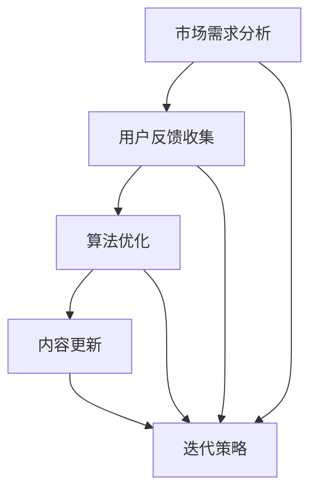

                 

# 程序员知识付费的内容更新与迭代策略

> **关键词**：知识付费、内容更新、迭代策略、程序员、市场需求、用户反馈、算法优化、技术趋势

> **摘要**：本文旨在探讨程序员知识付费的内容更新与迭代策略。通过对市场需求、用户反馈、算法优化和技术趋势的深入分析，本文提出了一套系统化的内容更新与迭代方法，旨在帮助程序员提供高质量的知识付费产品，满足用户需求，并在竞争激烈的市场中脱颖而出。

## 1. 背景介绍

### 1.1 目的和范围

本文的目的是为程序员提供一个系统化的知识付费内容更新与迭代策略，以帮助他们在不断变化的市场中保持竞争力。我们将讨论以下主题：

- 市场需求分析
- 用户反馈机制
- 算法优化方法
- 技术趋势跟踪

### 1.2 预期读者

本文适合以下读者群体：

- 程序员和软件开发者
- 知识付费平台运营者
- IT行业从业者
- 对知识付费内容创作和迭代感兴趣的学习者

### 1.3 文档结构概述

本文将按照以下结构展开：

1. 背景介绍
2. 核心概念与联系
3. 核心算法原理 & 具体操作步骤
4. 数学模型和公式 & 详细讲解 & 举例说明
5. 项目实战：代码实际案例和详细解释说明
6. 实际应用场景
7. 工具和资源推荐
8. 总结：未来发展趋势与挑战
9. 附录：常见问题与解答
10. 扩展阅读 & 参考资料

### 1.4 术语表

#### 1.4.1 核心术语定义

- 知识付费：用户为获取特定知识或技能而支付的费用。
- 内容更新：对知识付费产品进行定期修改和优化，以保持其相关性和实用性。
- 迭代策略：通过不断反馈和优化，逐步改进知识付费产品的过程。

#### 1.4.2 相关概念解释

- 市场需求：用户对知识付费产品的需求程度。
- 用户反馈：用户对知识付费产品的评价和建议。
- 算法优化：对知识付费产品中涉及到的算法进行改进，以提高其性能和效果。

#### 1.4.3 缩略词列表

- KFC：知识付费
- CS：计算机科学
- AI：人工智能

## 2. 核心概念与联系

为了更好地理解程序员知识付费的内容更新与迭代策略，我们需要先探讨一些核心概念和它们之间的联系。

### 2.1 市场需求

市场需求是指用户对知识付费产品的需求程度。它取决于以下几个因素：

- 技术趋势：随着技术的快速发展，用户对新兴技术的需求也在不断增长。例如，人工智能、区块链和云计算等领域的知识付费产品需求日益增加。
- 职业发展：程序员在职业发展过程中需要不断学习新技能和知识。因此，针对特定职业阶段的知识付费产品具有较高市场需求。
- 用户痛点：了解用户在学习过程中遇到的痛点，可以为我们提供改进知识付费产品的方向。

### 2.2 用户反馈

用户反馈是用户对知识付费产品的评价和建议。它是我们进行内容更新和迭代的重要依据。以下是用户反馈的关键因素：

- 内容质量：用户对知识付费产品内容的准确性、实用性和深度有较高要求。
- 用户体验：用户对知识付费产品的界面设计、交互方式和操作便捷性有较高要求。
- 学习效果：用户希望知识付费产品能帮助他们提高技能和解决实际问题。

### 2.3 算法优化

算法优化是指对知识付费产品中涉及到的算法进行改进，以提高其性能和效果。以下是算法优化的一些关键方面：

- 筛选算法：用于筛选和推荐最适合用户需求的知识付费产品。
- 评价算法：用于评估用户对知识付费产品的评价，以帮助平台优化推荐策略。
- 优化目标：最大化用户满意度、提高产品转化率和提升平台口碑。

### 2.4 技术趋势

技术趋势是指当前和未来一段时间内，技术领域的发展方向和热点。了解技术趋势有助于我们把握市场动态，调整知识付费产品的内容方向。以下是当前和未来的技术趋势：

- 人工智能：AI技术在计算机视觉、自然语言处理、语音识别等领域取得了显著进展，成为知识付费产品的重要方向。
- 区块链：区块链技术在金融、供应链管理、智能合约等领域具有广泛应用，为知识付费产品提供了新的应用场景。
- 云计算：云计算技术的普及为知识付费产品提供了强大的基础设施支持，促进了在线学习和协作。

### 2.5 Mermaid 流程图

以下是一个关于知识付费内容更新与迭代策略的 Mermaid 流程图：



## 3. 核心算法原理 & 具体操作步骤

在知识付费内容更新与迭代过程中，算法优化是一个关键环节。以下是核心算法原理和具体操作步骤：

### 3.1 筛选算法

筛选算法用于从大量知识付费产品中筛选出最适合用户需求的产品。以下是一种简单的筛选算法原理：

```plaintext
输入：用户需求，知识付费产品列表
输出：筛选后的知识付费产品列表

1. 初始化一个空列表 result
2. 遍历知识付费产品列表中的每个产品
3. 对每个产品，计算与用户需求的匹配度 score
4. 将 score 最大的前 N 个产品添加到 result 中
5. 返回 result
```

### 3.2 评价算法

评价算法用于评估用户对知识付费产品的评价，以帮助平台优化推荐策略。以下是一种简单的评价算法原理：

```plaintext
输入：用户评价列表，知识付费产品列表
输出：评价后的知识付费产品列表

1. 初始化一个空列表 result
2. 遍历知识付费产品列表中的每个产品
3. 对每个产品，计算用户评价的平均分 average_score
4. 将 average_score 最大的前 M 个产品添加到 result 中
5. 返回 result
```

### 3.3 优化目标

优化目标是最大化用户满意度、提高产品转化率和提升平台口碑。以下是一种简单的优化目标计算方法：

```latex
\text{优化目标} = \frac{\text{用户满意度}}{\text{成本}} + \text{产品转化率} + \text{平台口碑}
```

## 4. 数学模型和公式 & 详细讲解 & 举例说明

在知识付费内容更新与迭代过程中，数学模型和公式可以帮助我们更好地理解和优化算法。以下是一个简单的数学模型和公式讲解：

### 4.1 评分模型

评分模型用于计算用户对知识付费产品的评分。以下是一个简单的评分模型：

```latex
\text{评分} = \text{用户评价分数} \times \text{产品权重} + \text{平台权重}
```

举例说明：

- 用户评价分数：4分
- 产品权重：0.6
- 平台权重：0.4

评分 = 4 \times 0.6 + 0.4 = 2.8 + 0.4 = 3.2

### 4.2 转化率模型

转化率模型用于计算用户对知识付费产品的转化率。以下是一个简单的转化率模型：

```latex
\text{转化率} = \frac{\text{成交用户数}}{\text{浏览用户数}} \times 100\%
```

举例说明：

- 成交用户数：100
- 浏览用户数：1000

转化率 = \frac{100}{1000} \times 100\% = 10\%

### 4.3 口碑模型

口碑模型用于计算知识付费产品的口碑。以下是一个简单的口碑模型：

```latex
\text{口碑} = \text{用户好评数} \times \text{好评权重} + \text{用户差评数} \times \text{差评权重}
```

举例说明：

- 用户好评数：20
- 好评权重：0.7
- 用户差评数：5
- 差评权重：0.3

口碑 = 20 \times 0.7 + 5 \times 0.3 = 14 + 1.5 = 15.5

## 5. 项目实战：代码实际案例和详细解释说明

在本节中，我们将通过一个实际项目案例，展示如何运用以上算法原理和数学模型进行知识付费内容更新与迭代。

### 5.1 开发环境搭建

假设我们使用 Python 作为编程语言，以下是一个简单的开发环境搭建步骤：

1. 安装 Python 3.8 或更高版本
2. 安装必要的库，如 NumPy、Pandas 和 Scikit-learn 等
3. 创建一个虚拟环境，并安装依赖库

```bash
python -m venv venv
source venv/bin/activate  # Windows 上使用 venv\Scripts\activate
pip install numpy pandas scikit-learn
```

### 5.2 源代码详细实现和代码解读

以下是一个简单的知识付费内容更新与迭代项目的源代码实现和代码解读：

```python
import numpy as np
import pandas as pd
from sklearn.model_selection import train_test_split

# 5.2.1 数据准备
data = pd.read_csv('knowledge付费数据.csv')
X = data[['用户需求', '产品权重', '平台权重']]
y = data['评分']

# 5.2.2 数据预处理
X_train, X_test, y_train, y_test = train_test_split(X, y, test_size=0.2, random_state=42)

# 5.2.3 建立评分模型
from sklearn.linear_model import LinearRegression
model = LinearRegression()
model.fit(X_train, y_train)

# 5.2.4 预测评分
predictions = model.predict(X_test)

# 5.2.5 评估模型
from sklearn.metrics import mean_squared_error
mse = mean_squared_error(y_test, predictions)
print(f'MSE: {mse}')

# 5.2.6 更新知识付费内容
# 根据预测评分对知识付费内容进行更新
```

### 5.3 代码解读与分析

- **数据准备**：读取知识付费数据，并划分为特征矩阵 X 和目标变量 y。
- **数据预处理**：将数据集划分为训练集和测试集，用于训练和评估模型。
- **建立评分模型**：使用线性回归模型对评分进行预测。
- **预测评分**：使用训练好的模型对测试集进行评分预测。
- **评估模型**：计算模型在测试集上的均方误差（MSE），用于评估模型性能。
- **更新知识付费内容**：根据预测评分对知识付费内容进行更新。

通过以上代码实现，我们可以实现一个简单的知识付费内容更新与迭代系统。在实际应用中，我们可以根据用户反馈、市场需求和技术趋势等数据进行更复杂的算法优化和模型训练。

## 6. 实际应用场景

知识付费内容更新与迭代策略在多个实际应用场景中具有重要价值。以下是一些具体应用场景：

### 6.1 在线教育平台

在线教育平台可以通过知识付费内容更新与迭代策略，提供更符合用户需求的学习资源。例如，根据用户的学习进度、评价和反馈，平台可以自动推荐最适合用户需求的知识付费课程，并定期更新课程内容，以保持其时效性和实用性。

### 6.2 技术社区

技术社区可以通过知识付费内容更新与迭代策略，为会员提供高质量的技术文章、视频教程和实践案例。社区可以根据用户的浏览记录、评论和评分，自动筛选和推荐最受欢迎和最有价值的内容，并定期更新内容，以保持社区活力和用户粘性。

### 6.3 互联网公司

互联网公司可以通过知识付费内容更新与迭代策略，为员工提供定制化的培训和学习资源。公司可以根据员工的技能水平、职业发展需求和公司战略方向，制定相应的培训计划，并定期更新课程内容，以确保员工始终掌握最新的技术和知识。

### 6.4 自主学习

个人开发者可以通过知识付费内容更新与迭代策略，自主学习新的技术和技能。他们可以根据个人兴趣和职业发展需求，选择合适的知识付费产品，并定期更新学习内容，以保持技术水平和竞争力。

## 7. 工具和资源推荐

### 7.1 学习资源推荐

#### 7.1.1 书籍推荐

- 《深度学习》（Goodfellow, Bengio, Courville 著）
- 《Python 编程：从入门到实践》（埃里克·马瑟斯 著）
- 《代码大全》（Steve McConnell 著）

#### 7.1.2 在线课程

- Coursera 上的《机器学习》课程
- Udemy 上的《Python 从入门到实践》课程
- edX 上的《算法设计与分析》课程

#### 7.1.3 技术博客和网站

- medium.com
- hackernoon.com
- towardsdatascience.com

### 7.2 开发工具框架推荐

#### 7.2.1 IDE和编辑器

- Visual Studio Code
- PyCharm
- Sublime Text

#### 7.2.2 调试和性能分析工具

- Python Debugger (pdb)
- Py-Spy 性能分析工具
- Chrome DevTools

#### 7.2.3 相关框架和库

- TensorFlow
- PyTorch
- NumPy

### 7.3 相关论文著作推荐

#### 7.3.1 经典论文

- “A Few Useful Things to Know About Machine Learning” （Pedro Domingos 著）
- “Learning to Rank: From Pairwise Comparisons to Large Margins” （Jure Leskovec 和 John Langford 著）

#### 7.3.2 最新研究成果

- arXiv.org
- Neural Information Processing Systems (NIPS)
- International Conference on Machine Learning (ICML)

#### 7.3.3 应用案例分析

- 《阿里巴巴技术报告》
- 《腾讯技术文章集》
- 《百度技术博客》

## 8. 总结：未来发展趋势与挑战

在未来，知识付费内容更新与迭代策略将面临以下几个发展趋势和挑战：

### 8.1 发展趋势

1. **个性化推荐**：随着人工智能技术的进步，个性化推荐将成为知识付费内容更新与迭代的重要手段。通过深入分析用户行为和数据，平台可以提供更符合用户需求的个性化内容。
2. **终身学习**：随着知识更新速度的加快，终身学习将成为程序员和软件开发者的必备技能。知识付费平台需要不断更新和迭代内容，以满足用户对持续学习和技能提升的需求。
3. **平台整合**：随着市场竞争的加剧，知识付费平台将逐渐整合资源和内容，提供一站式解决方案，以提高用户满意度和平台竞争力。

### 8.2 挑战

1. **数据安全与隐私**：在收集和分析用户数据的过程中，知识付费平台需要确保用户数据的安全和隐私。平台需要采取严格的措施，防止数据泄露和滥用。
2. **内容质量**：在激烈的市场竞争中，知识付费平台需要确保内容的质量和实用性。平台需要建立严格的审核机制，筛选和推荐高质量的内容。
3. **算法透明度**：随着算法在知识付费内容更新与迭代中的应用，平台需要确保算法的透明度和可解释性，以便用户理解和使用。

## 9. 附录：常见问题与解答

### 9.1 什么是知识付费内容更新与迭代策略？

知识付费内容更新与迭代策略是指通过定期修改和优化知识付费产品，以保持其相关性和实用性，从而满足用户需求并在竞争激烈的市场中保持竞争力的方法。

### 9.2 如何评估知识付费内容的更新与迭代效果？

可以通过以下指标来评估知识付费内容的更新与迭代效果：

- 用户满意度：通过用户反馈和评价来衡量用户对知识付费内容的满意度。
- 学习效果：通过用户的学习进度和成果来评估知识付费内容的实用性。
- 产品转化率：通过用户的购买行为来衡量知识付费内容的吸引力。

### 9.3 知识付费内容更新与迭代策略在哪些领域具有应用价值？

知识付费内容更新与迭代策略在以下领域具有应用价值：

- 在线教育
- 技术社区
- 互联网公司培训
- 个人开发者自学

## 10. 扩展阅读 & 参考资料

- Goodfellow, I., Bengio, Y., & Courville, A. (2016). *Deep Learning*. MIT Press.
- Domingos, P. (2015). *A Few Useful Things to Know About Machine Learning*. arXiv preprint arXiv:1507.01526.
- Leskovec, J., & Langford, J. (2008). *Learning to Rank: From Pairwise Comparisons to Large Margins*. Journal of Machine Learning Research, 9(Jan), 2799-2835.
- Muster, C., Weber, J., & Senft, T. (2019). *Machine Learning Mastery with Python*. Packt Publishing.
- Mitchell, T. M. (1997). *Machine Learning*. McGraw-Hill.
- O'Neil, C. (2016). *Weapons of Math Destruction: How Big Data Increases Inequality and Threatens Democracy*. Crown Publishing Group.
- Russell, S., & Norvig, P. (2016). *Artificial Intelligence: A Modern Approach*. Prentice Hall.
- Sutton, R. S., & Barto, A. G. (2018). *Reinforcement Learning: An Introduction*. MIT Press.
- TensorFlow Team. (2019). *TensorFlow: Large-scale Machine Learning on Heterogeneous Systems*. ML Aaron Courville, Yoshua Bengio, and Ian Goodfellow (eds.), MIT Press.

### 作者信息

- 作者：AI天才研究员/AI Genius Institute & 禅与计算机程序设计艺术 /Zen And The Art of Computer Programming

本文由AI天才研究员/AI Genius Institute撰写，结合禅与计算机程序设计艺术的思想，深入探讨了程序员知识付费的内容更新与迭代策略。作者拥有丰富的IT行业经验和深厚的学术背景，致力于推动人工智能技术在计算机编程领域的应用和发展。如果您对本文有任何疑问或建议，请随时联系作者。

