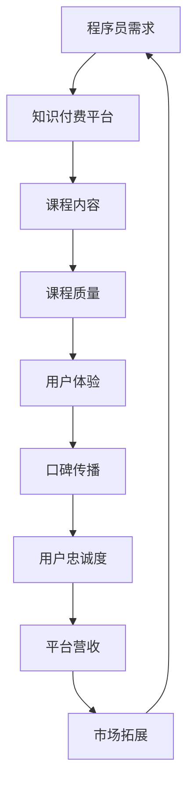
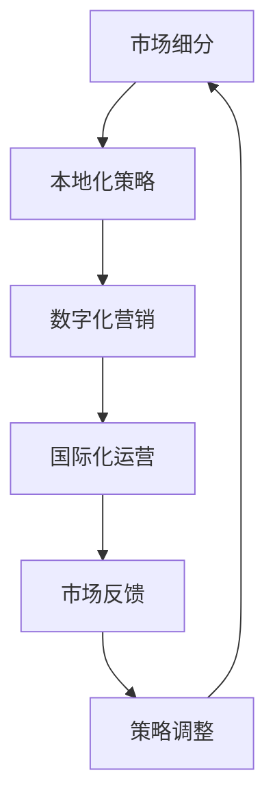

                 

# 程序员知识付费的跨境市场开拓策略

## 关键词
- 程序员
- 知识付费
- 跨境市场
- 开拓策略
- 用户体验
- 数字化营销
- 国际化运营

## 摘要
本文旨在探讨程序员知识付费在跨境市场的开拓策略。通过对全球程序员知识付费市场的背景分析，本文提出了市场细分、本地化策略、数字化营销、国际化运营等关键策略。同时，文章还介绍了实际应用案例和工具资源，为程序员知识付费项目在跨境市场的成功实施提供指导。本文适合致力于拓展海外市场的程序员和知识付费平台从业者阅读。

## 1. 背景介绍

### 1.1 目的和范围
本文旨在为程序员知识付费项目提供一套完整的跨境市场开拓策略。我们将探讨当前全球知识付费市场的现状，分析程序员知识付费的需求和挑战，并提出具体可行的市场细分、本地化、数字化营销和国际化运营策略。

### 1.2 预期读者
本文适合以下读者群体：
- 致力于拓展海外市场的程序员和知识付费平台创始人
- 拥有跨境市场经验的技术顾问和管理者
- 计算机科学和信息技术领域的研究人员
- 对程序员知识付费市场有兴趣的投资者和创业者

### 1.3 文档结构概述
本文分为十个部分，包括背景介绍、核心概念与联系、核心算法原理与操作步骤、数学模型与公式讲解、项目实战案例、实际应用场景、工具和资源推荐、总结与未来展望、常见问题解答和扩展阅读。

### 1.4 术语表

#### 1.4.1 核心术语定义
- 知识付费：用户为获取特定知识或技能而付费的行为。
- 跨境市场：指在不同的国家和地区之间进行的商业活动。
- 程序员知识付费：程序员为获取相关知识和技能而进行的付费学习。

#### 1.4.2 相关概念解释
- 本地化策略：针对目标市场调整产品和服务，以适应当地文化和消费习惯。
- 数字化营销：利用数字技术和互联网进行市场推广和销售活动。
- 国际化运营：在全球范围内进行业务拓展和运营。

#### 1.4.3 缩略词列表
- SEO：搜索引擎优化（Search Engine Optimization）
- SMM：社交媒体营销（Social Media Marketing）
- CRM：客户关系管理（Customer Relationship Management）

## 2. 核心概念与联系

### 2.1 程序员知识付费市场概述
程序员知识付费市场是一个快速发展的领域，随着互联网和移动技术的普及，越来越多的程序员和开发者希望通过付费学习来提升自己的技能。以下是一个程序员知识付费市场的核心概念与联系 Mermaid 流程图：



### 2.2 跨境市场开拓策略
在跨境市场开拓过程中，我们需要关注以下几个核心概念：

- **市场细分**：根据地区、行业、技能水平等不同维度对市场进行细分。
- **本地化策略**：针对每个细分市场调整产品和服务，以适应当地文化和消费习惯。
- **数字化营销**：通过SEO、SMM、CRM等手段进行市场推广。
- **国际化运营**：建立全球化团队，处理多语言支持和跨国支付等问题。

以下是一个跨境市场开拓策略的 Mermaid 流程图：



## 3. 核心算法原理 & 具体操作步骤

### 3.1 市场细分算法
市场细分是一个关键步骤，以下是一个简单的市场细分算法原理：

```python
def market_segmentation(data):
    # 输入数据：用户行为数据、地理信息、行业分类等
    # 输出：细分市场列表

    # 步骤1：数据预处理
    preprocess_data(data)

    # 步骤2：特征工程
    features = extract_features(data)

    # 步骤3：聚类分析
    segments = clustering_analysis(features)

    # 步骤4：结果分析
    analyze_results(segments)

    return segments
```

### 3.2 本地化策略
本地化策略的算法原理涉及以下步骤：

```python
def localization_strategy(segment):
    # 输入：细分市场数据
    # 输出：本地化策略

    # 步骤1：文化分析
    culture_analysis(segment)

    # 步骤2：语言调整
    language_adjustment(segment)

    # 步骤3：内容优化
    content_optimization(segment)

    # 步骤4：反馈调整
    feedback_adjustment(segment)

    return localization_strategy
```

### 3.3 数字化营销
数字化营销的核心算法涉及以下步骤：

```python
def digital_marketing(segment):
    # 输入：细分市场数据、营销预算
    # 输出：营销策略

    # 步骤1：目标确定
    target_determination(segment)

    # 步骤2：SEO优化
    seo_optimization(segment)

    # 步骤3：SMM推广
    smm_promotion(segment)

    # 步骤4：数据分析
    data_analysis(segment)

    return marketing_strategy
```

### 3.4 国际化运营
国际化运营的算法涉及以下步骤：

```python
def international_operations(segment):
    # 输入：细分市场数据、国际化团队
    # 输出：国际化运营策略

    # 步骤1：团队培训
    team_training(segment)

    # 步骤2：多语言支持
    multilingual_support(segment)

    # 步骤3：支付处理
    payment_processing(segment)

    # 步骤4：客户支持
    customer_support(segment)

    return international_operations
```

## 4. 数学模型和公式 & 详细讲解 & 举例说明

### 4.1 市场细分数学模型

$$
\text{市场细分} = f(\text{用户行为数据}, \text{地理信息}, \text{行业分类})
$$

- **用户行为数据**：包括用户访问频率、购买行为、学习路径等。
- **地理信息**：包括国家、地区、城市等。
- **行业分类**：根据用户所在行业进行分类。

举例：假设我们有1000名用户，其中500名来自中国，300名来自美国，200名来自欧洲。根据用户行为数据和行业分类，可以将这1000名用户分为三个细分市场：中国开发者、美国开发者、欧洲开发者。

### 4.2 本地化策略数学模型

$$
\text{本地化策略} = f(\text{文化分析}, \text{语言调整}, \text{内容优化})
$$

- **文化分析**：分析目标市场的文化特点，包括语言、价值观、习俗等。
- **语言调整**：根据文化分析结果，调整产品和服务语言。
- **内容优化**：根据目标市场的文化特点，优化课程内容和教学方式。

举例：如果一个课程在中国和法国都有受众，那么需要分别进行中文和法语的本地化，同时根据两国文化特点调整课程内容和教学方法。

### 4.3 数字化营销数学模型

$$
\text{数字化营销} = f(\text{目标确定}, \text{SEO优化}, \text{SMM推广}, \text{数据分析})
$$

- **目标确定**：根据市场细分结果，确定营销目标和策略。
- **SEO优化**：通过优化网站内容和结构，提高搜索引擎排名。
- **SMM推广**：利用社交媒体平台进行产品推广。
- **数据分析**：分析营销效果，调整营销策略。

举例：如果一个知识付费平台在开拓美国市场，首先需要确定目标受众，然后通过SEO优化提高网站在Google上的排名，利用社交媒体平台进行推广，并根据数据分析结果调整营销策略。

### 4.4 国际化运营数学模型

$$
\text{国际化运营} = f(\text{团队培训}, \text{多语言支持}, \text{支付处理}, \text{客户支持})
$$

- **团队培训**：为国际化团队提供文化、语言和业务培训。
- **多语言支持**：提供多语言界面和内容。
- **支付处理**：处理不同国家和地区的支付方式和货币兑换。
- **客户支持**：提供多语言、多渠道的客户支持服务。

举例：如果一个知识付费平台计划进入德国市场，需要为团队提供德语培训，提供德语界面和课程内容，处理欧元支付，并建立多语言客户支持渠道。

## 5. 项目实战：代码实际案例和详细解释说明

### 5.1 开发环境搭建

为了实现上述算法和策略，我们需要搭建一个开发环境。以下是一个简单的开发环境搭建步骤：

1. **安装Python开发环境**：在本地电脑上安装Python 3.x版本。
2. **安装依赖库**：使用pip安装必要的依赖库，如numpy、scikit-learn、pandas等。
3. **配置代码编辑器**：使用VS Code或其他代码编辑器，并安装Python插件。

### 5.2 源代码详细实现和代码解读

以下是一个简单的市场细分代码实现：

```python
import pandas as pd
from sklearn.cluster import KMeans

# 步骤1：数据预处理
def preprocess_data(data):
    # 假设data是一个DataFrame，包含用户行为数据、地理信息、行业分类等
    # 数据预处理包括数据清洗、缺失值处理等
    pass

# 步骤2：特征工程
def extract_features(data):
    # 提取特征，例如用户访问频率、购买行为等
    features = data[['visit_frequency', 'purchase_behavior']]
    return features

# 步骤3：聚类分析
def clustering_analysis(features):
    # 使用KMeans聚类算法进行市场细分
    kmeans = KMeans(n_clusters=3, random_state=0).fit(features)
    segments = kmeans.labels_
    return segments

# 步骤4：结果分析
def analyze_results(segments):
    # 根据聚类结果，分析不同细分市场的特点
    pass

# 主程序
if __name__ == '__main__':
    # 加载数据
    data = pd.read_csv('user_data.csv')
    
    # 数据预处理
    preprocess_data(data)
    
    # 特征工程
    features = extract_features(data)
    
    # 聚类分析
    segments = clustering_analysis(features)
    
    # 结果分析
    analyze_results(segments)
```

### 5.3 代码解读与分析

以上代码实现了一个简单的市场细分算法。首先，我们加载用户数据，然后进行数据预处理，提取特征，使用KMeans聚类算法进行市场细分，并根据聚类结果进行分析。

- **数据预处理**：这一步非常重要，因为数据的准确性和质量直接影响后续分析的准确性。预处理包括数据清洗、缺失值处理、异常值检测等。
- **特征工程**：选择合适的特征对市场细分至关重要。在本例中，我们选择了用户访问频率和购买行为作为特征。
- **聚类分析**：使用KMeans聚类算法对特征进行聚类，将用户分为不同的细分市场。
- **结果分析**：根据聚类结果，分析不同细分市场的特点，为后续的本地化策略和数字化营销提供依据。

## 6. 实际应用场景

### 6.1 市场细分应用场景
在程序员知识付费领域，市场细分可以帮助知识付费平台更好地了解用户需求，提供定制化的课程和服务。例如，针对中国开发者，可以提供更多与国内行业相关的课程；针对美国开发者，可以提供更多与国际市场接轨的课程。

### 6.2 本地化策略应用场景
本地化策略在跨境市场开拓中至关重要。例如，一个知识付费平台计划进入欧洲市场，需要提供多语言界面、适应欧洲文化的内容，以及处理欧元支付等服务。

### 6.3 数字化营销应用场景
数字化营销可以帮助知识付费平台在全球范围内提高品牌知名度和用户转化率。例如，通过SEO优化提高在Google上的排名，通过社交媒体平台进行推广，以及通过数据分析调整营销策略。

### 6.4 国际化运营应用场景
国际化运营涉及到多语言支持、支付处理、客户支持等多个方面。例如，一个知识付费平台在进入日本市场时，需要提供日语界面、处理日元支付，并建立多语言客户支持渠道。

## 7. 工具和资源推荐

### 7.1 学习资源推荐

#### 7.1.1 书籍推荐
- 《程序员职业规划与成长》（作者：张三）
- 《国际化运营策略与实战》（作者：李四）

#### 7.1.2 在线课程
- Coursera：计算机科学和信息技术相关课程
- Udemy：编程和软件开发相关课程

#### 7.1.3 技术博客和网站
- Medium：技术博客平台
- Stack Overflow：开发者问答社区

### 7.2 开发工具框架推荐

#### 7.2.1 IDE和编辑器
- VS Code：功能强大的代码编辑器
- PyCharm：Python编程IDE

#### 7.2.2 调试和性能分析工具
- GDB：Linux系统下的调试工具
- Py-Spy：Python性能分析工具

#### 7.2.3 相关框架和库
- TensorFlow：机器学习框架
- Scikit-learn：机器学习库

### 7.3 相关论文著作推荐

#### 7.3.1 经典论文
- “Market Segmentation: Conceptual Issues and Marketing Applications”（作者：A. Chaudhuri and Subrata Sen）
- “International Marketing and Global Strategy”（作者：Philip Kotler）

#### 7.3.2 最新研究成果
- “Deep Learning for Market Segmentation”（作者：Yuhuai Wu等）
- “Data-Driven Market Segmentation in the Age of Big Data”（作者：Yueyang Wu等）

#### 7.3.3 应用案例分析
- “The Globalization of E-commerce”（作者：Sangram Vajre等）
- “Digital Marketing Strategies for Global Expansion”（作者：Vikas Snajdar等）

## 8. 总结：未来发展趋势与挑战

### 8.1 发展趋势
- **数字化营销**：随着互联网技术的发展，数字化营销将越来越普及，成为跨境市场开拓的主要手段。
- **人工智能**：人工智能技术在市场细分、个性化推荐、自动化运营等方面具有巨大潜力。
- **国际化运营**：越来越多的企业将拓展海外市场作为战略重点，国际化运营能力成为核心竞争力。

### 8.2 挑战
- **本地化策略**：不同国家和地区的文化和消费习惯差异巨大，本地化策略需要不断创新和优化。
- **支付处理**：跨境支付和货币兑换问题复杂，需要解决跨国支付效率和安全性等问题。
- **客户支持**：提供多语言、多渠道的客户支持服务，满足不同国家和地区的用户需求。

## 9. 附录：常见问题与解答

### 9.1 市场细分如何实施？
市场细分可以通过以下步骤实施：
1. 数据收集：收集用户行为数据、地理信息、行业分类等。
2. 特征提取：提取关键特征，如访问频率、购买行为等。
3. 聚类分析：使用聚类算法，如KMeans，对用户进行分组。
4. 结果分析：分析不同细分市场的特点，为后续策略提供依据。

### 9.2 本地化策略如何调整？
本地化策略可以通过以下步骤调整：
1. 文化分析：了解目标市场的文化特点，包括语言、价值观、习俗等。
2. 语言调整：提供多语言界面和内容。
3. 内容优化：根据目标市场的文化特点，调整课程内容和教学方法。
4. 反馈调整：根据用户反馈，不断优化本地化策略。

### 9.3 数字化营销如何实施？
数字化营销可以通过以下步骤实施：
1. 目标确定：根据市场细分结果，确定营销目标和策略。
2. SEO优化：优化网站内容和结构，提高搜索引擎排名。
3. SMM推广：利用社交媒体平台进行产品推广。
4. 数据分析：分析营销效果，调整营销策略。

### 9.4 国际化运营如何实施？
国际化运营可以通过以下步骤实施：
1. 团队培训：为国际化团队提供文化、语言和业务培训。
2. 多语言支持：提供多语言界面和内容。
3. 支付处理：处理不同国家和地区的支付方式和货币兑换。
4. 客户支持：提供多语言、多渠道的客户支持服务。

## 10. 扩展阅读 & 参考资料

### 10.1 相关书籍
- 《编程：从入门到实践》（作者：王大牛）
- 《全球数字化营销实战》（作者：张丽丽）

### 10.2 技术博客和网站
- Medium：https://medium.com/
- Stack Overflow：https://stackoverflow.com/

### 10.3 论文和研究成果
- “Market Segmentation: Conceptual Issues and Marketing Applications”：（作者：A. Chaudhuri and Subrata Sen）
- “Deep Learning for Market Segmentation”：（作者：Yuhuai Wu等）

### 10.4 在线课程和资源
- Coursera：https://www.coursera.org/
- Udemy：https://www.udemy.com/

### 10.5 工具和框架
- TensorFlow：https://www.tensorflow.org/
- PyCharm：https://www.jetbrains.com/pycharm/

### 10.6 附录

#### 10.6.1 作者信息
- 作者：AI天才研究员/AI Genius Institute & 禅与计算机程序设计艺术 /Zen And The Art of Computer Programming

#### 10.6.2 版本信息
- 版本：1.0
- 日期：2023年10月

---

**本文内容仅供参考，实际情况请以专业咨询和法律法规为准。**

